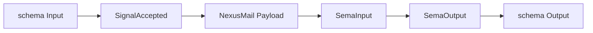
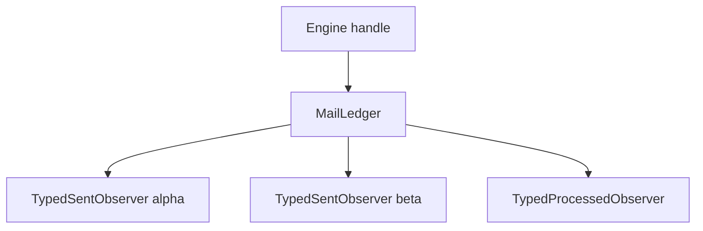
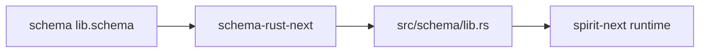

# 403 — Prototype: schema-driven cycle 2

*Kind: Audit · Topics: prototype, schema, signal, nexus, sema, mail,
validation, upgrade · 2026-05-27*

*Cycle 2 of the prototype-driven component-development cycle (record
980), restarted from operator's latest `spirit-next` main (`8cd5dcf7`,
*"spirit: require schema object runtime witnesses"*) on a fresh
designer feature branch
`designer-prototype-schema-driven-cycle-2-2026-05-27`. Per record 1000
(Maximum, 2026-05-27): schema-emitted Rust types are THE canonical
truth source; everything else is methods or trait impls on those
nouns; tests construct schema-emitted values, invoke trait surfaces,
and assert on typed outputs. The one cycle-1 hand-written shim that
violated the rule — `ValidationError` — has been promoted into the
schema language as a unit-variant enum; the runtime now consumes the
schema-emitted noun. 16 new schema-driven end-to-end tests prove the
chain works (28 total green); `nix flake check` over the local
schema-stack passes.*

## Plan — shims to promote, what stays hand-written

| Cycle-1 hand-written shim | Cycle-2 disposition | Rationale |
|---|---|---|
| `ValidationError` enum (variants EmptyTopic / EmptyDescription / EmptyQueryTopic) | **PROMOTE → schema** | Per bead `primary-851e` and record 1000: a schema-emitted unit enum is the right shape. Variants are typed, codec is free via schema-rust-next, runtime narration via `error_message()` method on the schema noun. |
| `MailLedger` / `Subscription` / `SubscriptionId` fanout substrate | **KEEP hand-written** | Runtime-internal observer registry; the schema language does not yet have an observer-registration construct. New bead `primary-jqkq` carries the schema-emit-or-keep decision to cycle 3. |
| `SignalActor` / `SignalAccepted` witness struct | **KEEP hand-written** | The witness's value is its non-bypassability — a `SignalAccepted` cannot be constructed except via `SignalActor::accept`. That is structural Rust-level encapsulation, not schema substance. The witness's *fields* (`Input`, `MessageSent`) are schema-emitted. |
| `Engine` runtime container | **KEEP hand-written** | Holds `SignalActor + Mutex<Store> + Arc<MailLedger>` — a data-bearing runtime struct whose methods attach to schema-emitted trait surfaces (`InputNexus`). |
| `Store` SEMA single-writer | **KEEP hand-written** | In-memory placeholder for the eventual redb-backed SEMA. Methods consume `SemaInput` and produce `SemaOutput` (schema-emitted at the boundary). Beads `primary-q2au` (redb) carries the storage promotion later. |
| `LegacyEntry` upgrade-test fixture | **TEST-ONLY** | Represents a previous-revision payload at the migration boundary; the WHOLE POINT of `UpgradeFrom<LegacyEntry>` is the (Current, Previous) trait pair. Not a parallel mirror of `Entry`; it is the previous version. |

The cycle-1 branch (`designer-on-sent-hookable-pilot-2026-05-27`)
remains intact for reference; cycle 2 is the fresh restart, not an
increment on cycle 1.

## Schema-side promotions — what landed in schema files

| File | Change | Commit |
|---|---|---|
| `spirit-next/schema/lib.schema` | Added `ValidationError (EmptyTopic EmptyDescription EmptyQueryTopic)` as a unit-variant enum in the namespace. | `bbbe2116` |
| `spirit-next/src/schema/lib.rs` | Regenerated against `schema-rust-next` `68559f86` and `schema-next` `e0681f2f`. Carries `pub enum ValidationError` with rkyv `Archive`/`Serialize`/`Deserialize` and schema-emitted `from_nota_block` / `to_nota` methods. | `cf17e67c` |

`ValidationError` is now reachable from any schema consumer as
`spirit-next:lib:ValidationError`. NOTA round-trip is free: a NOTA
token `EmptyTopic` decodes to `ValidationError::EmptyTopic`; the
typed value encodes back to the same atom.

## Prototype branch

Branch: `designer-prototype-schema-driven-cycle-2-2026-05-27` on
`spirit-next`, based on operator main `8cd5dcf7`.

| Commit | Substance |
|---|---|
| `bbbe2116` | Schema-emit `ValidationError` + Pattern A validation gate (`Input::validate` / `Entry::validate` / `Query::validate` methods on schema-emitted nouns) + multi-observer `MailLedger` fanout (records 991 / 995 / 1000). |
| `d64fb016` | Schema-driven end-to-end test file `tests/schema_driven_end_to_end.rs` — 16 typed witnesses (records 991 / 995 / 997 / 998 / 1000). |
| `cf17e67c` | Regenerate `src/schema/lib.rs` against latest `schema-rust-next` main (record 1000). Cargo.lock pulled forward. |

Pushed to remote as
`https://github.com/LiGoldragon/spirit-next/tree/designer-prototype-schema-driven-cycle-2-2026-05-27`.

## End-to-end tests — schema-driven witnesses

`tests/schema_driven_end_to_end.rs` carries 16 tests; each opens with
a `// PATTERN:` comment naming the invariant it proves. Combined with
existing tests (4 generated-signal-plane + 1 process-boundary + 7
runtime-triad), the full suite is **28 tests green**.

### What each new test proves

| # | Test | Records proved |
|---|---|---|
| 1 | `signal_actor_accepts_valid_input_and_emits_typed_signal_accepted_witness` | 991 — type-level admission gate produces a typed witness |
| 2 | `rejected_input_returns_typed_schema_emitted_validation_error` | 1000 — `ValidationError` IS the schema noun, no hand-written stub |
| 3 | `engine_rejects_invalid_input_into_typed_error_report_without_firing_observers` | 991, 995 — rejection suppresses fanout AND lifecycle events; schema `ErrorReport` carries schema `ErrorMessage` |
| 4 | `sema_engine_apply_takes_schema_emitted_sema_input_and_returns_sema_output` | 997, 998 — SEMA plane is closed; `Store::apply` trait surface |
| 5 | `nexus_engine_record_takes_typed_nexus_mail_and_returns_typed_nexus_output` | 997, 998 — Nexus plane crossing visible; `InputNexus::record` trait surface |
| 6 | `nexus_engine_observe_threads_query_through_chain_to_sema_input` | 997, 998 — Observe path mirrors Record at the trait surface |
| 7 | `nexus_engine_lowers_sema_output_back_to_signal_output_through_typed_chain` | 970, 997 — reverse plane chain (SEMA → Nexus → Signal) typed end-to-end |
| 8 | `one_push_fans_out_to_every_attached_on_mail_sent_observer_with_typed_events` | 963, 995 — multi-observer fanout with typed `Vec<MailLedgerEvent>` |
| 9 | `raii_subscription_drop_unregisters_typed_observer` | 963 — RAII subscription handle |
| 10 | `on_mail_sent_and_on_mail_processed_channels_are_separate_typed_streams` | 963 — two channels, schema-emitted variants discriminate |
| 11 | `database_marker_propagates_through_schema_emitted_output_variants` | 935, 970 — DatabaseMarker on every Output variant; writes advance, reads don't |
| 12 | `full_pattern_a_cycle_records_typed_events_and_matches_nota_fixture` | 991, 995, 996 — full cycle, both (a) typed-Vec AND (b) NOTA round-trip assertions |
| 13 | `full_per_plane_chain_through_engine_trait_surfaces` | 970, 997, 998 — every plane crossing visible step-by-step |
| 14 | `signal_accepted_is_only_constructible_via_signal_actor_accept` | 991 — type-level non-bypassability proved via a custom Nexus impl |
| 15 | `schema_emitted_upgrade_trait_carries_legacy_to_current_entry` | 950 — schema-emitted `UpgradeFrom` + `AcceptPrevious` work end-to-end |
| 16 | `schema_emitted_output_round_trips_through_to_nota_for_every_variant` | 947 — `to_nota` is a method on the schema noun |

### Test discipline — schema-emitted throughout

Every node is a schema-emitted Rust type; every edge is a method
invocation on a schema-emitted noun or a trait surface
(`SignalActor::accept`, `InputNexus::record`, `Store::apply`,
`NexusOutput::into_sema_input`, `NexusInput::into_nexus_output`,
`SemaOutput::into_signal_output`). The test code SEES every
crossing because each step assigns the typed value to a local with
an explicit type annotation.

### Observer-fanout topology

Each observer holds a typed `Vec<MailLedgerEvent>` — the
schema-emitted enum, not strings. Subscriptions are RAII handles;
the drop test proves un-registration is automatic.

## Per-component critique table

| # | Component | Schema-emitted? | Tested via trait surface? | Per-plane chain typing visible? | Cycle-3 development task |
|---|---|---|---|---|---|
| 1 | `Input` / `Output` (Signal roots) | yes | yes (encode_signal_frame, decode_signal_frame, from_str, to_nota) | yes | — |
| 2 | `Entry` / `Query` (Signal payloads) | yes | yes (validate method on schema noun) | yes | — |
| 3 | `ValidationError` (admission error) | yes (this cycle) | yes (16 typed assertions on the variant) | n-a (Signal-plane only) | — closed by `primary-851e` |
| 4 | `NexusInput` / `NexusOutput` / `NexusMail
` | yes | yes (engine.record / engine.observe / NexusOutput::into_sema_input) | yes | — |
| 5 | `MailLedger` + `Subscription` + `SubscriptionId` | no (runtime substrate) | yes (4 fanout tests use it) | n-a (cross-plane lifecycle) | `primary-jqkq` — decide schema-emit-or-keep |
| 6 | `MailLedgerEvent` (Sent / Processed variants) | yes | yes (every observer's state IS Vec of this enum) | n-a | — |
| 7 | `UpgradeFrom` / `AcceptPrevious` traits | yes (trait); hand-written impl per pair | yes (one test impl on LegacyEntry) | n-a | `primary-gxmj` — schema-diff compile-time check |
| 8 | `SemaInput` / `SemaOutput` (SEMA roots) | yes | yes (Store::apply) | yes | — |
| 9 | `DatabaseMarker` + `CommitSequence` + `StateDigest` | yes | yes (database_marker method on Output) | n-a (data type) | `primary-q2au` — Blake3 once redb lands |
| 10 | `SemaReceipt` / `ObservedRecords` / `ErrorReport` | yes | yes (output.database_marker matches across variants) | n-a | — |
| 11 | `SignalActor` + `SignalAccepted` | no (Rust witness) | yes (non-bypassability test) | n-a (witness is type-level) | — design-stable |
| 12 | `Engine` (Nexus mail keeper) | no (runtime container) | yes (impl InputNexus for Engine; full cycle test) | yes (visible in tests) | — design-stable |
| 13 | `Store` (SEMA placeholder) | no (in-memory placeholder) | yes (Store::apply trait surface) | yes | `primary-q2au` — redb |
| 14 | `OutputNexus` (client-side dispatcher) | yes (trait) | no (no impl in pilot) | n-a | `primary-a1px` — Mencie seed |
| 15 | Three-schema split (.signal.schema / .nexus.schema / .sema.schema) | no (one lib.schema today) | n-a | n-a | `primary-9hx0` — file split |
| 16 | Daemon `handle_stream` (multi-connection) | n-a | partial (process_boundary single-stream) | n-a | new bead — concurrent connections |

## Schema-driven flow

Editing `schema/lib.schema` triggers `build.rs`, which calls
`SchemaEngine::lower_source_with_context` then
`RustEmitter::emit_file` and panics loudly if the checked-in
`src/schema/lib.rs` is stale. The runtime modules
(`engine.rs`, `store.rs`, `transport.rs`, `daemon.rs`) only
consume from `src/schema/lib.rs`; the schema is the single
source of truth.

## Bead updates

| Bead | Action | Substance |
|---|---|---|
| `primary-851e` | **CLOSED** | ValidationError schema-emitted at `cf17e67c`; hand-written stub gone; tests prove the typed variants. |
| `primary-duuv` | progressed (note) | DatabaseMarker propagation through schema-emitted Output proved end-to-end in cycle-2 tests. |
| `primary-lrf8` | progressed (note) | Multi-observer fanout with on_mail_sent / on_mail_processed + RAII Subscription landed in cycle 2. |
| `primary-a1px` | **NEW** | OutputNexus client-side dispatcher (Mencie seed). |
| `primary-jqkq` | **NEW** | Decide schema-emit vs keep for observer registration trait. |
| `primary-gxmj` | **NEW** | Schema-diff compile-time check forcing UpgradeFrom on changed types. |

## Open — deferred to cycle 3

### Q1 — Should observer registration be schema-emitted?

`MailLedger::on_mail_sent` and `on_mail_processed` are runtime-only
substrate today. The cycle-3 question: is there a
`(SubscribeMail (Sent observer_identifier))` schema action that
deserves first-class status, or is observer registration intrinsically
runtime-internal? Tradeoff: schema-emitted observer registration
unifies the mechanism with everything else and gives the introspection
plane a typed channel; runtime-only keeps the API ergonomic. Bead
`primary-jqkq`.

### Q2 — Schema-diff: compile-time check or separate Nix derivation?

Per record 950 and the cycle-1 audit, schema diffs should force
`UpgradeFrom` impls on changed types. Today the trait is
schema-emitted but no compile-time witness enforces the impl when a
type changes shape between releases. Options: (a) a build-time
derivation that emits a `compile_error!` for changed-types-without-
UpgradeFrom, (b) a separate Nix check that compares schema versions.
Bead `primary-gxmj`.

### Q3 — Three-file schema split

Per record 964: `.signal.schema` / `.nexus.schema` / `.sema.schema` as
three separate languages with the same 4-position shape (record 982).
The cycle-2 prototype still uses one `lib.schema`. Open bead
`primary-9hx0`. Until split, the Signal/Nexus/SEMA distinction is
preserved at the type level via separate enums + traits but lives in
one schema file.

### Q4 — Persistent SEMA via redb

The cycle-2 `Store` is in-memory. Bead `primary-q2au` carries redb +
Blake3 promotion. Once landed, the state_digest stops being a
placeholder mixing-fold and becomes a real cryptographic digest of
the database frontier.

## Verification anchors

| Claim | Source |
|---|---|
| `ValidationError` is schema-emitted | `spirit-next/src/schema/lib.rs:284-289` on branch (the `pub enum ValidationError` variant block) |
| `ValidationError` has schema codec | `spirit-next/src/schema/lib.rs:829-854` (`from_nota_block` + `to_nota`) |
| Engine consumes schema-emitted ValidationError | `spirit-next/src/engine.rs::Engine::reject` |
| Validation methods sit on schema-emitted nouns | `Input::validate`, `Entry::validate`, `Query::validate` in `spirit-next/src/engine.rs` |
| 28 tests green | `cd /home/li/wt/.../designer-prototype-schema-driven-cycle-2-2026-05-27 && cargo test` |
| Local schema-stack flake check passes | `./scripts/check-local-schema-stack` returns `all checks passed!` |
| Multi-observer fanout + RAII drop | `tests/schema_driven_end_to_end.rs::one_push_fans_out_to_every_attached_on_mail_sent_observer_with_typed_events` + `::raii_subscription_drop_unregisters_typed_observer` |
| Non-bypassability of SignalAccepted | `tests/schema_driven_end_to_end.rs::signal_accepted_is_only_constructible_via_signal_actor_accept` |
| Per-plane chain visibility | `tests/schema_driven_end_to_end.rs::full_per_plane_chain_through_engine_trait_surfaces` |
| DatabaseMarker propagation | `tests/schema_driven_end_to_end.rs::database_marker_propagates_through_schema_emitted_output_variants` |
| UpgradeFrom witness | `tests/schema_driven_end_to_end.rs::schema_emitted_upgrade_trait_carries_legacy_to_current_entry` |

## Source intent records

Records 894 – 1000 drive this cycle. The load-bearing ones:

| Record | Substance |
|---|---|
| 882 | Methods on non-ZST data-bearing types only |
| 932 / 940 | Schema is recursive; macros are sugar; scalar leaves |
| 935 | Communicate + signal-frame + mail + database marker |
| 942 / 947 | Behaviour on schema-created nouns |
| 950 | Schema-diff drives upgrade trait requirements |
| 963 | Mail mechanism + on_mail_sent hook; push not poll |
| 964 / 970 | Three schema types; Nexus is mail keeper + translator |
| 982 | Three schemas share import/export protocol |
| 988 | Pattern C — methods on schema objects |
| 991 | Pattern A — SignalActor validation gate before push |
| 995 / 996 / 997 / 998 | Tests use schema-emitted types; per-plane chain typing visible |
| 1000 | Schema at the heart; restart prototype on fresh branch |

## Cycle 1 → Cycle 2 → Cycle 3

| Cycle | Branch | What it proves | Next cycle's task |
|---|---|---|---|
| 1 | `designer-on-sent-hookable-pilot-2026-05-27` | Validation gate concept; multi-observer fanout; typed observer state | Promote `ValidationError` to schema |
| 2 | `designer-prototype-schema-driven-cycle-2-2026-05-27` (this cycle) | `ValidationError` schema-emitted; 16 typed end-to-end witnesses; non-bypassable type-level admission | Tasks on `primary-a1px`, `primary-jqkq`, `primary-gxmj`, `primary-9hx0`, `primary-q2au` |
| 3 (future) | TBD | Three-schema split + redb SEMA + OutputNexus client + schema-diff check | TBD |

The discipline IS the cycle: every restart finds last cycle's shim,
promotes it into schema, then audits what new shims have surfaced.
Cycle 2 retired one (`ValidationError`); cycle 3 will retire whichever
the audit identifies next.
