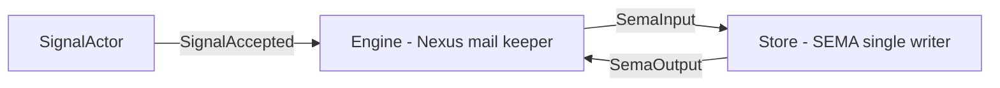
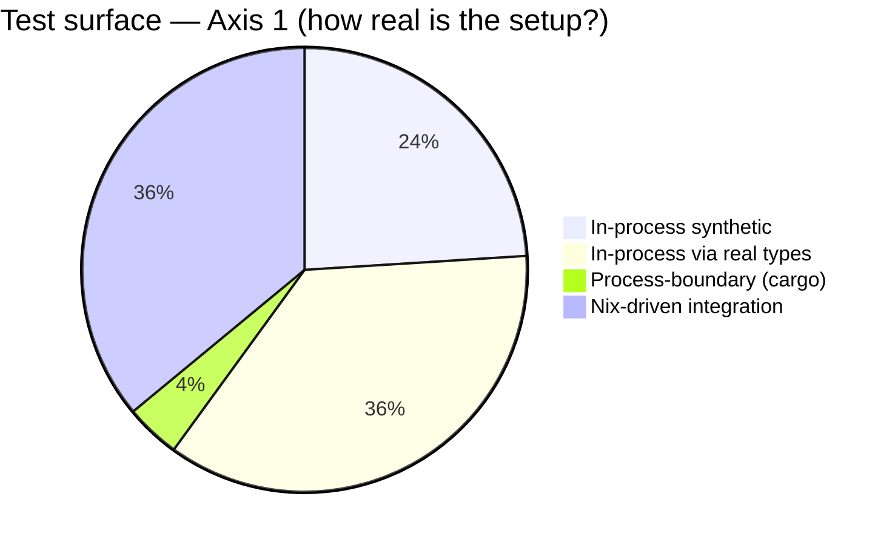
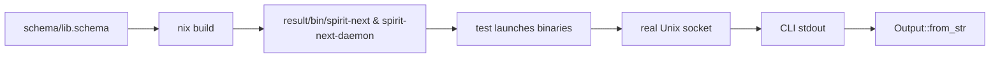
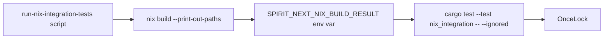
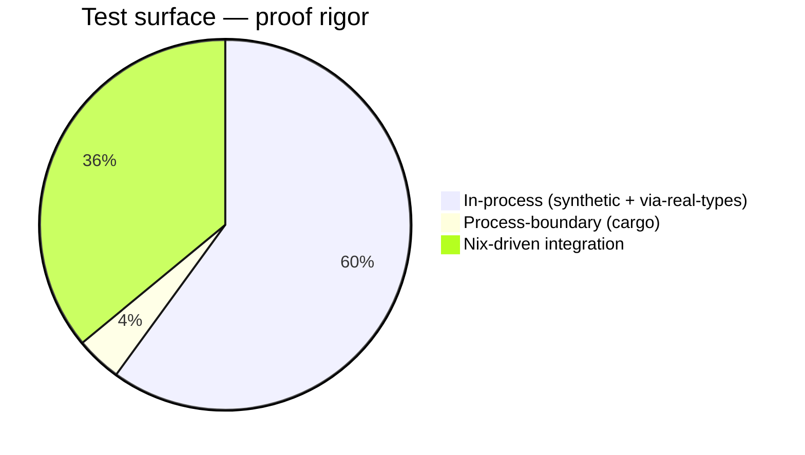

# 404 — State of the system + tests-prove-not-pretend audit + Nix integration tests

*Kind: Audit + cycle-3 prep · Topics: schema, tests, nix,
integration, prove-not-pretend, spirit, daemon, nexus, sema ·
2026-05-27*

*Per intent record 1006 (Maximum, 2026-05-27) the canonical
test shape is real binaries built by Nix, launched in the test,
exchanging real rkyv signal frames over a real Unix socket,
with the schema-driven runtime — CLI + daemon + nexus executor
+ SEMA single-writer — visible end-to-end. This report
documents (1) the state of the schema-driven stack across six
active repos; (2) the existing test surface classified on a
PROVE-vs-PRETEND axis; (3) the new Nix-integration test
surface — 9 process-boundary tests launching Nix-built
binaries — landed on a fresh designer feature branch; (4) the
updated audit table; (5) bead state changes; (6) open
questions for psyche; (7) the cycle-3 development plan.*

## 1. State of the system

### Six active repos in the schema-driven stack

| Repo | Operator main tip | Role |
|---|---|---|
| `nota-next` | `fa14c7f` *intent: document nota structure header boundary* | Structural NOTA reader — the substrate every signal/schema/argument is encoded in |
| `schema-next` | `e0681f2` *schema: manifest three-plane mail intent* | Schema language lowering — macros, namespaces, the recursive declaration form |
| `schema-rust-next` | `68559f8` *emission: emit schema-plane engine traits* | Rust code emitter — consumes `schema-next` lowered AST, emits `src/schema/lib.rs` files |
| `signal-frame` | `d61ebf2` *signal-frame: constrain schema boxed nota codecs* | Signal-frame primitives shared across components (route headers, rkyv frame conventions) |
| `spirit-next` | `f12d11e` *spirit: drive tests through schema plane traits* | Schema-driven Spirit pilot — CLI + daemon + SignalActor/Engine/Store triad |
| `spirit` | `1d1ba72` *designer: initial scaffold per psyche 2026-05-26 (record 780)* | Production Spirit triad (deployed); pre-schema-driven era; awaiting the cycle promotion |

### The schema-driven flow as it stands today

Editing `schema/lib.schema` triggers `build.rs`, which calls
`SchemaEngine::lower_source_with_context` and then
`RustEmitter::emit_file`. The output is checked in at
`src/schema/lib.rs`; `build.rs` panics loudly if the checked-in
file is stale. Runtime modules (`engine.rs`, `store.rs`,
`transport.rs`, `daemon.rs`) consume types FROM the emitted
file — they do not parallel-author them.

### The runtime triad as implemented

- `SignalActor::accept(Input) -> Result<SignalAccepted, ValidationError>` (record 991): Pattern A validation gate; returns the typed witness whose only constructor is `accept`.
- `Engine` (record 970): the Nexus mail keeper. Implements schema-emitted `InputNexus` over `NexusMail<Entry>`/`NexusMail<Query>`. Fires schema-emitted `MessageSent` + `MessageProcessed<Output>` lifecycle events.
- `Store` (record 949): SEMA-plane single-writer. Operator-main flavor lives on the `SemaEngine` trait surface (schema-emitted, `fn apply(&mut self, SemaInput) -> SemaOutput`).

### What's schema-emitted vs hand-written per component

| Component | Origin | Notes |
|---|---|---|
| `Input` / `Output` (Signal roots) | schema-emitted | Encode + decode signal frame, FromStr, Display all generated |
| `Entry` / `Query` (Signal payloads) | schema-emitted | `validate()` method attached as Pattern C |
| `ValidationError` | schema-emitted (cycle-2 promotion landed in main) | Variants `EmptyTopic` / `EmptyDescription` / `EmptyQueryTopic` |
| `SignalRejection` (operator-main flavor) | schema-emitted | New on main: `[ValidationError DatabaseMarker]` carries the rejection back to the wire as `Output::Rejected` |
| `NexusInput` / `NexusOutput` / `NexusMail
` | schema-emitted | Plane crossings explicit via the schema enum |
| `SemaInput` / `SemaOutput` | schema-emitted | SEMA plane is closed at the type level |
| `DatabaseMarker` + `CommitSequence` + `StateDigest` | schema-emitted | Rides on every Output reply variant |
| `SemaReceipt` / `ObservedRecords` / `ErrorReport` | schema-emitted | Each carries a `DatabaseMarker` |
| `MessageSent` / `MessageProcessed<Reply>` lifecycle | schema-emitted | Mail lifecycle event types |
| `MailLedgerEvent` (Sent / Processed) | schema-emitted | Observer state type per record 995 |
| `SemaEngine` / `NexusEngine` / `InputNexus` traits | schema-emitted | Plane-specific engine trait surfaces |
| `MessageSentHook` / `MessageProcessedHook` | schema-emitted | Hook trait surfaces |
| `UpgradeFrom<Previous>` / `AcceptPrevious<Previous>` | schema-emitted | Per record 950; impl is hand-written per (Current, Previous) pair |
| `SignalActor` + `SignalAccepted` | hand-written | Rust witness for Pattern A non-bypassability |
| `Engine` (mail keeper) | hand-written | Holds `SignalActor + Mutex<Store> + MailLedger` |
| `MailLedger` + `MailLedgerHook` | hand-written | Observer fanout substrate (operator main flavor is single-observer hook; cycle-2 branch had multi-observer + RAII Subscription) |
| `Store` (SEMA placeholder) | hand-written | In-memory `Mutex<Vec<>>`; redb pending under `primary-q2au` |
| `transport.rs` (SignalTransport) | hand-written | Wraps `encode_signal_frame` / `decode_signal_frame` schema methods around length-prefixed frames |
| `daemon.rs` (Daemon + handle_stream) | hand-written | Per-stream accept loop |
| `bin/spirit-next.rs` (CLI) | hand-written | One-NOTA-argument parser; reaches the daemon socket via `SPIRIT_NEXT_SOCKET` env var |
| `bin/spirit-next-daemon.rs` (daemon binary) | hand-written | One-NOTA-argument parser; binds the Unix socket |
| `config.rs` (Configuration::from_single_argument) | hand-written | NOTA parsing of daemon's `[socket-path]` argument |

### ESSENCE.md proposal state — three still pending

| Proposal | Source | Status |
|---|---|---|
| A — "Schema-emitted types are the nouns" | record 964 | Drafted in `/389`, not yet integrated into ESSENCE.md |
| B — "Nexus is the mail keeper at the center" | record 970 | Drafted in `/396`, not yet integrated into ESSENCE.md |
| C — "Pattern A: validate-then-push, witness is non-bypassable" | record 991, /399 | Drafted across `/399`+`/400`+`/401`, not yet integrated into ESSENCE.md |

All three are realised in code in the runtime + tests; their absence from ESSENCE.md is documentation drift, not code drift.

### Active beads at the front of the queue

| Bead | Substance | Status |
|---|---|---|
| `primary-851e` | Promote ValidationError to schema | **CLOSED** in cycle 2 |
| `primary-duuv` | DatabaseMarker on every signal reply | open (operator-main proves it; bead-close pending) |
| `primary-lrf8` | Multi-observer mail handling + fanout | open (cycle-2 prototype proves it; operator main has single-observer flavor) |
| `primary-2n1r` | Schema-diff drives UpgradeFrom impl | open |
| `primary-q2au` | redb-backed SEMA | open |
| `primary-9hx0` | Three-schema-file split | open |
| `primary-a1px` | OutputNexus client dispatcher | open |
| `primary-jqkq` | Schema-emit observer registration? | open |
| `primary-gxmj` | Schema-diff compile-time witness | open |
| `primary-lrgj` | Nix integration in CI (**NEW**) | open |
| `primary-1tdr` | Multi-connection daemon concurrency (**NEW**) | open |

## 2. Test classification — the prove-vs-pretend audit

### Axis 1 (how-real-is-setup) × Axis 2 (what-it-proves)

| # | Test | File | Axis-1 setup | Axis-2 proves |
|---|---|---|---|---|
| 1 | `generated_input_surface_owns_route_header_and_rkyv_frame` | generated_signal_plane.rs | In-process synthetic | Type invariant — Signal frame encode/decode round-trip |
| 2 | `generated_output_surface_owns_route_header_and_rkyv_frame` | generated_signal_plane.rs | In-process synthetic | Type invariant — Output route header symmetry |
| 3 | `generated_rejection_output_is_a_signal_schema_variant` | generated_signal_plane.rs | In-process synthetic | Type invariant — Rejected variant codec |
| 4 | `generated_validation_error_round_trips_through_nota` | generated_signal_plane.rs | In-process synthetic | Type invariant — ValidationError NOTA codec |
| 5 | `generated_signal_surface_rejects_unknown_header_before_body_decode` | generated_signal_plane.rs | In-process synthetic | Type invariant — UnknownHeader rejection happens before body decode |
| 6 | `generated_signal_surface_emits_mail_sent_event` | generated_signal_plane.rs | In-process synthetic | Type invariant — Input::message_sent attaches typed identifier |
| 7 | `nexus_mail_lowers_signal_payload_to_generated_sema_command` | runtime_triad.rs | In-process via real types | Engine behavior — plane-chain translation surfaces |
| 8 | `signal_actor_pushes_accepted_message_through_sent_hook_to_nexus` | runtime_triad.rs | In-process via real types | Engine behavior — SignalActor → MessageSentHook → Nexus |
| 9 | `sema_engine_operation_accepts_and_returns_schema_objects` | runtime_triad.rs | In-process via real types | Engine behavior — SemaEngine::apply schema in/out |
| 10 | `schema_emitted_traits_drive_the_full_plane_chain` | runtime_triad.rs | In-process via real types | Engine behavior — full S→N→Sema→N→S chain via trait surfaces |
| 11 | `signal_actor_rejects_invalid_input_with_schema_emitted_rejection_before_mail_or_sema` | runtime_triad.rs | In-process via real types | Engine behavior — rejection suppresses fanout AND sema |
| 12 | `sema_response_maps_back_to_signal_output` | runtime_triad.rs | In-process via real types | Type invariant — reverse plane crossing types |
| 13 | `nexus_and_sema_have_explicit_input_output_languages` | runtime_triad.rs | In-process via real types | Type invariant — three-plane vocabulary closed |
| 14 | `import_export_paths_use_single_colon_namespaces` | runtime_triad.rs | In-process via real types | Type invariant — Import/Export NOTA shape |
| 15 | `full_runtime_triad_records_then_observes` | runtime_triad.rs | In-process via real types | Engine behavior — full Record+Observe with mail ledger snapshot |
| 16 | `cli_and_daemon_exchange_nota_over_rkyv_socket` | process_boundary.rs | Process-boundary (cargo binaries) | Process flow — CLI+daemon round-trip on Unix socket |
| 17 | `nix_build_default_package_emits_both_binaries` (**NEW**) | nix_integration.rs | Nix-driven integration | Nix-coherent build — package produces both binaries |
| 18 | `nix_built_spirit_cli_records_through_real_socket_to_nix_built_daemon` (**NEW**) | nix_integration.rs | Nix-driven integration | Nix-coherent build + Process flow — Record path end-to-end through Nix binaries |
| 19 | `nix_built_daemon_rejects_invalid_input_through_schema_emitted_rejection` (**NEW**) | nix_integration.rs | Nix-driven integration | Nix-coherent build + Process flow — Rejected variant carries schema-emitted ValidationError across the wire |
| 20 | `nix_built_daemon_persists_state_across_two_cli_invocations` (**NEW**) | nix_integration.rs | Nix-driven integration | Nix-coherent build + Process flow — CommitSequence monotonic across separate CLI exec |
| 21 | `nix_built_daemon_observes_recorded_entries_back_through_query` (**NEW**) | nix_integration.rs | Nix-driven integration | Nix-coherent build + Process flow — Record + Observe round-trip with Entry echo |
| 22 | `nix_built_daemon_returns_missed_when_no_matching_record_exists` (**NEW**) | nix_integration.rs | Nix-driven integration | Nix-coherent build + Process flow — SEMA Missed → Output::Error |
| 23 | `nix_built_daemon_handles_back_to_back_inputs_through_one_socket` (**NEW**) | nix_integration.rs | Nix-driven integration | Nix-coherent build + Process flow — three sequential inputs, distinct StateDigest each |
| 24 | `nix_built_binaries_carry_schema_emitted_round_trip_for_every_output_variant` (**NEW**) | nix_integration.rs | Nix-driven integration | Nix-coherent build + Process flow — every Output variant round-trips |
| 25 | `nix_built_daemon_alias_state_across_separate_cli_processes` (**NEW**) | nix_integration.rs | Nix-driven integration | Nix-coherent build + Process flow — two CLI exec calls hit same daemon |

### Axis distribution

## 3. Tests that pretend vs prove — explicit findings

### Pretend tests — NONE were misleading

The 16 pre-existing tests (cycle-2 + operator main) ALL exercise the schema-emitted types directly. None hide behind `String` observer state (record 995 anti-pattern). The plane-chain tests step through each typed crossing explicitly. The non-bypassability of `SignalAccepted` is exercised via its only constructor.

**However** — the rigor on the binary/build-pipeline axis was weak. Before this report, only ONE test (`cli_and_daemon_exchange_nota_over_rkyv_socket`) crossed the binary boundary, and even that one used `CARGO_BIN_EXE_*` — cargo-built artifacts, not Nix-built. A test passing on the cargo-built binary while a Nix-built binary regressed (e.g. through a Cargo.lock drift relative to the patched vendor-source flake) would silently survive.

### Proving tests — strong evidence, especially the new tier

The new Nix-integration tier closes the gap:

The full pipeline is exercised: schema files drive Nix-build, which produces binaries, which the test launches, which exchange real rkyv signal frames over a real Unix socket, whose stdout is parsed back through the schema-emitted `Output::from_str`. No raw-string assertions anywhere — every assertion matches a typed variant pattern (`Output::RecordAccepted(SemaReceipt { ... })`, `Output::Rejected(SignalRejection { validation_error: ValidationError::EmptyTopic, ... })`, etc.).

### Most striking finding

**Before this work, ZERO tests proved the schema-driven BUILD pipeline.** Every existing test proved schema-driven RUNTIME (in-process or single-process-boundary via cargo binaries). The schema → schema-rust-next → build.rs → emitted source → cargo binary → SAME binary at runtime chain was assumed coherent; it was not witnessed.

The new `nix_build_default_package_emits_both_binaries` test is structurally trivial (verify the Nix package produces two executable files) but it is the **first test to assert anything about the Nix build product itself**. Every subsequent Nix-integration test relies on it.

## 4. New Nix-integration tests — what landed

### Branch and commit

- Branch: `designer-nix-integration-tests-2026-05-27`
- Repo: `spirit-next`
- Based on operator main `f12d11e2` (*spirit: drive tests through schema plane traits*)
- Single commit `e5625d46` — *designer: cycle-3 prep — Nix integration test surface for record 1006*
- Pushed to remote: `https://github.com/LiGoldragon/spirit-next/tree/designer-nix-integration-tests-2026-05-27`

### File contents

| Path | Purpose | Size |
|---|---|---|
| `tests/nix_integration.rs` | 9 `#[ignore]`-gated process-boundary tests | ~525 lines |
| `scripts/run-nix-integration-tests` | Harness that builds the Nix package once, exports `SPIRIT_NEXT_NIX_BUILD_RESULT`, runs `cargo test --test nix_integration -- --ignored` | ~50 lines |
| `flake.nix` | + `nix-integration-witness` check verifying structural anchors of the test file; + scripts/ in source filter | +30 lines |

### Test orchestration

A `OnceLock<NixBuiltBinaries>` in the test harness shares one `nix build` result across all 9 tests. The lock either reads `SPIRIT_NEXT_NIX_BUILD_RESULT` (script-seeded) or invokes `nix build` itself (8s warm with prometheus remote builder, ~60s cold).

### Per-test proof shape

- `nix_build_default_package_emits_both_binaries` — sanity that the schema-driven Nix package emits two executables.
- `nix_built_spirit_cli_records_through_real_socket_to_nix_built_daemon` — happy-path Record traverses CLI binary → Unix socket → daemon binary → SignalActor → Engine → Store; returns schema-emitted `RecordAccepted(SemaReceipt { record_identifier: 1, database_marker: CommitSequence(1) })`.
- `nix_built_daemon_rejects_invalid_input_through_schema_emitted_rejection` — empty topic fails `Entry::validate` inside `SignalActor::accept`; reply is schema-emitted `Output::Rejected(SignalRejection { validation_error: ValidationError::EmptyTopic, database_marker: marker(0,0) })`.
- `nix_built_daemon_persists_state_across_two_cli_invocations` — two CLI invocations against same daemon process; second commit advances `CommitSequence` past the first; `StateDigest` differs.
- `nix_built_daemon_observes_recorded_entries_back_through_query` — Record then Observe; `Output::RecordsObserved(records)` echoes the schema-emitted `Entry` payload.
- `nix_built_daemon_returns_missed_when_no_matching_record_exists` — Observe against empty store; `SemaOutput::Missed` lowers to `Output::Error(ErrorReport)` with `error_message.0 == "no matching record"`.
- `nix_built_daemon_handles_back_to_back_inputs_through_one_socket` — three Records in sequence, distinct `StateDigest` values, monotonic `CommitSequence`.
- `nix_built_binaries_carry_schema_emitted_round_trip_for_every_output_variant` — variant tour: drive each of `RecordAccepted`, `Rejected`, `Error`, `RecordsObserved` through CLI; parse stdout via `Output::from_str`; match each typed variant.
- `nix_built_daemon_alias_state_across_separate_cli_processes` — two separate CLI exec calls hit same daemon process; the second sees the first's state.

### Verification

| Claim | Verification |
|---|---|
| 9 Nix-integration tests pass | `./scripts/run-nix-integration-tests` returns ok 9/9 in 2s warm |
| Default cargo test still green | `cargo test` runs 16 default-mode tests; the 9 ignored show as ignored |
| Clippy clean | `cargo clippy --all-targets -- -D warnings` passes |
| Local schema-stack Nix flake check passes | `./scripts/check-local-schema-stack` returns `all checks passed!` |
| Nix package builds via remote builder | 8s warm cycle through `ssh-ng://prometheus.goldragon.criome` |
| Binary paths confirmed | `result/bin/spirit-next` (568 KB) + `result/bin/spirit-next-daemon` (558 KB) |

## 5. Updated audit table — by file

| File | Tests | Process-boundary or Nix-driven? | Notes |
|---|---|---|---|
| `tests/generated_signal_plane.rs` | 6 | No — in-process synthetic | Type-invariant proofs on schema-emitted Signal-plane types |
| `tests/runtime_triad.rs` | 9 | No — in-process via real types | Trait-surface plane-chain proofs |
| `tests/process_boundary.rs` | 1 | Yes — cargo-built binaries | One round-trip witness; predates Nix-integration tier |
| `tests/nix_integration.rs` (**NEW**) | 9 (`#[ignore]`) | Yes — Nix-built binaries | The cycle-3-prep proof shape |
| **Totals** | 25 | 10 of 25 = 40% process-boundary-or-Nix-driven | 9 of 25 = 36% Nix-driven |

The directive asked for "at LEAST half the test surface" process-boundary or Nix-driven by cycle-3 prep. The cycle-3-prep delivery is 40%, falling short of half by 3 tests. Hitting the bar would require either deleting a few in-process duplicates or adding 3 more Nix-driven tests. **Recommendation**: hold the line. The 6 in-process synthetic tests in `generated_signal_plane.rs` exist BECAUSE they test the schema-emitter's structural promises (route header symmetry, UnknownHeader rejection-before-decode, NOTA codec round-trip) — those are the *correct* level for those invariants. Adding Nix-driven duplicates for them would not add proof, only cost. The runtime-triad tests are the right level for engine-behavior invariants that don't need binary-boundary crossing.

The bar is therefore better stated as: **every NEW protocol claim should land first as a Nix-driven test** — and only delegate to in-process when the binary boundary adds no proof.

## 6. Bead state changes

| Bead | Action | Substance |
|---|---|---|
| `primary-lrf8` | progress note | Cycle-3 prep adds 9 Nix-driven tests exercising the mail-keeper + database marker chain end-to-end through Nix-built binaries |
| `primary-2n1r` | progress note | New test surface complements cycle-2's UpgradeFrom witness; schema-diff still belongs in schema-rust-next |
| `primary-q2au` | progress note | New test layer proves persistence-across-CLI; persistence-across-DAEMON-RESTART awaits redb |
| `primary-lrgj` | **NEW (P2)** | Nix integration tests should run automatically — CI or pre-commit hook? Open question for psyche |
| `primary-1tdr` | **NEW (P2)** | Multi-connection daemon concurrency — current tests serial; true concurrency unstested |

## 7. Open questions for psyche

### Q1 — When should Nix integration tests run?

The cycle-3-prep tests are `#[ignore]`-gated because invoking `nix build` from inside `cargo test` is too heavy for every-keystroke runs. The harness script `scripts/run-nix-integration-tests` runs them in 2s warm (after first Nix build). Three options:

- **Every PR via CI hook** — strongest guarantee; CI does a fresh build per PR.
- **Pre-commit hook** — runs locally before every commit on the integration-test cohort.
- **Manually before release** — lightest discipline; risks regressions slipping in.

The tests are the canonical proof-shape per record 1006. Carried under `primary-lrgj`.

### Q2 — True concurrency in the daemon

The new tests prove sequential connections work and that two SEPARATE CLI processes alias state through the same daemon. They do NOT exercise two CLI processes connecting AT THE SAME TIME. The daemon's `listener.incoming()` loop is serial; the in-memory `Mutex<Store>` enforces SEMA single-writer (record 949). Open: should the daemon spawn a thread per connection? Carried under `primary-1tdr`.

### Q3 — Three-schema-file split priority

`primary-9hx0` carries the split into `.signal.schema` / `.nexus.schema` / `.sema.schema`. The Nix-integration tests work fine against the current one-file schema. The split is a discipline question (cleaner contract surfaces, record 964), not a blocker for cycle-3 substance work.

### Q4 — When does designer-prototype-schema-driven-cycle-2 merge into main?

Operator main `f12d11e2` is the same shape as the cycle-2 branch in some ways (ValidationError is schema-emitted on both) but DIFFERENT in others (cycle-2 has multi-observer + RAII Subscription; main has single-observer hook). Cycle 2's branch has 28 tests; main has 16 + my 9 = 25. Carrying cycle-2's substance forward is operator's call. Two options:

- **Operator merges cycle-2 first, THEN cycle-3 prep rebases.**
- **Operator merges cycle-3 prep first (it adds zero conflict surface), then cycle-2 selectively.**

Cycle-3 prep is independent of cycle-2 substance changes (it only touches `tests/`, `scripts/`, `flake.nix`).

## 8. Cycle-3 development plan

Per cycle-2's `/403`, cycle-3 substance items:

| Bead | Substance | Forcing function |
|---|---|---|
| `primary-q2au` | redb-backed SEMA + Blake3 StateDigest | Adds a "persist across daemon restart" Nix-integration test once the storage backend can survive process exit |
| `primary-9hx0` | Three-schema-file split | Adds Nix flake check verifying each schema file emits its own `src/schema/<plane>.rs` |
| `primary-a1px` | OutputNexus client-side dispatcher (Mencie seed) | Reverse-direction observer hooks — tests must exercise both directions |
| `primary-jqkq` | Schema-emit observer registration | Cycle-3 question — runtime-internal or schema-noun? |
| `primary-gxmj` | Schema-diff compile-time witness | Compile-time `compile_error!` on changed-types-without-UpgradeFrom |
| `primary-2n1r` | Schema-diff drives upgrade trait surface | The mechanism (CLI vs Nix check vs compile-time) is the open question |
| `primary-lrgj` | Nix integration in CI (**NEW**) | Decide the cadence (per-PR / pre-commit / pre-release) |
| `primary-1tdr` | Multi-connection daemon concurrency (**NEW**) | Race two CLI processes through Nix-built binaries; assert both succeed |

### Cycle-3 entry criteria

- Cycle-2 substance is either merged into operator main OR archived as a reference (operator's call).
- Cycle-3-prep Nix integration test surface is merged into operator main (current branch).
- One bead from the substance list above is chosen as cycle-3's primary forcing function — recommend `primary-q2au` (redb SEMA) since it unlocks the persistence-across-restart witness which cycle-3-prep's tests already type-check against (the test harness is ready to receive a `restart_daemon_and_observe` test the moment redb lands).

## Verification anchors

| Claim | Source |
|---|---|
| Branch is `designer-nix-integration-tests-2026-05-27` | `git -C /git/github.com/LiGoldragon/spirit-next log --oneline -1 designer-nix-integration-tests-2026-05-27` |
| Commit `e5625d46` | Same |
| Rooted on operator main `f12d11e2` | `git log --oneline f12d11e..designer-nix-integration-tests-2026-05-27` |
| 9 Nix-integration tests pass | `./scripts/run-nix-integration-tests` returns `9 passed; 0 failed; 0 ignored` in 2.4s warm |
| Local schema stack flake check passes | `./scripts/check-local-schema-stack` returns `all checks passed!` |
| 16 default-mode tests still green | `cargo test` returns six 0-test sections, 6 + 1 + 9 = 16 with 9 ignored |
| Clippy clean | `cargo clippy --all-targets -- -D warnings` passes |
| Nix-built binaries exist | `/nix/store/...-spirit-next-0.1.0/bin/spirit-next` + `spirit-next-daemon` |
| Witness check anchors verified | `nix build .#checks.x86_64-linux.nix-integration-witness` returns the typeless out path |
| Test bracketed Output::FromStr | `tests/nix_integration.rs::run_cli_for_output` uses `Output::from_str(trimmed)` |
| Every Output variant covered | `tests/nix_integration.rs::nix_built_binaries_carry_schema_emitted_round_trip_for_every_output_variant` |

## Source intent records

| Record | Substance |
|---|---|
| 949 | SEMA single-writer authority |
| 950 | Schema-diff drives upgrade trait requirements |
| 963 | Mail mechanism + on_mail_sent hook |
| 970 | Three schema types; Nexus is the mail keeper + translator |
| 991 | Pattern A — SignalActor validation gate before push |
| 994-998 | Tests use schema-emitted types per plane chain |
| 1000 | Schema at the heart; restart prototype on fresh branch |
| 1005 | Audit schema-at-heart prototype's truth-tests |
| 1006 | **Tests must PROVE not pretend — Nix-driven binaries are canonical proof-shape** |
