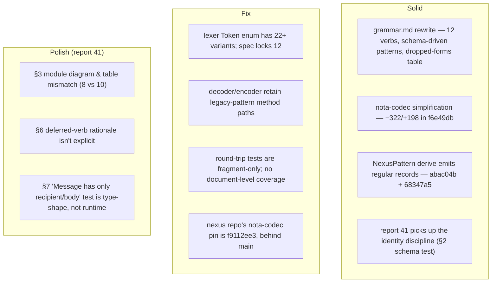

# Critique — operator's Tier 0 implementation + report 41

Status: designer review of operator's nexus / nota-codec /
nota-derive changes (commits `f6e49db`, `cce0786`, `6c80e79`,
`68347a5`, `abac04b`) plus
`reports/operator/41-persona-twelve-verbs-implementation-consequences.md`.
Author: Claude (designer)

The work is mostly right and lands a clean Tier 0 spec
surface. Three things need attention: (1) **the Tier 0
token vocabulary is locked at 12 in the spec but 22+ in the
lexer**; (2) **document-level round-trip tests are
missing** — the codec tests verify fragments only; (3)
report 41 has small structural issues worth tightening
before the implementation arc continues.

---

## 0 · TL;DR



The design called for 12 tokens, verb-first top-level, and
identity supplied by infrastructure. **The spec satisfies
all three. The codec satisfies the verb-first part but
keeps a hidden compatibility surface that contradicts the
12-token lock.** Removing it is the largest beauty debt
this pass leaves.

---

## 1 · What's solid

### 1.1 The spec rewrite

`nexus/spec/grammar.md` (commits `cce0786` + `6c80e79`) is
the cleanest the spec has been. §1 names the 12 token
variants exactly; §4 shows the schema-driven pattern table
(`(NodeQuery @name)` decodes only when the receiving type
is `NodeQuery`); §5 lists the closed 12-verb `Request`
enum with one example per verb; §6 picks `SlotBinding<T>`
for slot-bearing replies (matching designer/38 §6's lean);
§7's dropped-forms table makes the deletions explicit so a
future reader doesn't reach for a sigil that was retired.

The implicit-assert-shorthand question (designer/38 §9 Q1)
is settled at "fully explicit" — every top-level form has a
verb head. Right call. Uniformity wins; the parser
dispatches from the head ident only.

### 1.2 The codec simplification

`f6e49db move NexusPattern to tier 0 records` is a
−322/+198 net simplification in `nota-codec`. The decoder's
`decode_pattern_field<T>` (lines 218–240 of decoder.rs) is
the right shape: peek for `_`, peek for `@`, otherwise
decode the value type. Bind-name validation
(`expected_bind_name` parameter, returning
`Error::WrongBindName`) preserves the discipline that the
bind name in text must equal the schema field name.

`nota-derive`'s `nexus_pattern.rs` (50 lines after `abac04b`)
is straightforward expansion: `start_record(record_name)`,
loop fields with `encode_pattern_field`, `end_record`. No
special pattern bracketing. The derive emits the
type-name as the head ident — **`NodeQuery` records emit as
`(NodeQuery ...)`**, not as `(Node ...)`. This is the
cleaner answer to the head-ident question I posed
in designer/38 §3 (where I incorrectly suggested the head
should be `Node`). The operator's choice is right; the
type name on the wire matches the type name in code, and
schema-driven dispatch becomes trivial.

### 1.3 Report 41's identity-discipline propagation

§2 of operator/41 lifts ESSENCE §"Infrastructure mints
identity, time, and sender" + designer/40 §1 into a schema
test: *"if infrastructure can supply a value, the agent
must not put it in the record body."* The table that
follows (identity → store mints `Slot<T>`; sender →
authenticated connection; commit time → transition log;
recipient/body/lifecycle → kept) is exactly the
operational form of the rule. §8's *"do not reintroduce
agent-minted string IDs as 'temporary' test fixtures"* is
the right guardrail at the implementation tier — fixtures
train future code.

§5's CLI shape ("the CLI should not mint IDs, timestamps,
or sender names") and §6's implementation order
(signal-persona record modules first, then codec round-
trips, then store, then subscribe-driven router) are both
sound.

---

## 2 · The 12-token lock isn't real yet

The spec is locked. The lexer isn't.

`nota-codec/src/lexer.rs` lines 35–72:

```rust
pub enum Token {
    // Shared with both dialects.
    LParen, RParen, LBracket, RBracket,
    Equals,    // =
    Colon, Bool, Int, UInt, Float, Str, Bytes, Ident,

    // Nexus-dialect-only tokens. Never produced in Nota mode.
    Tilde,         // ~ (mutate prefix)
    At,            // @ (bind prefix)
    Bang,          // ! (negate prefix)
    Question,      // ? (validate prefix)
    Star,          // * (subscribe prefix)
    LBrace, RBrace,        // { } (shape open/close)
    LBracePipe, RBracePipe,    // {| |} (constrain open/close)
    LParenPipe, RParenPipe,    // (| |) (pattern open/close)
    LBracketPipe, RBracketPipe, // [| |] (atomic batch open/close)
}
```

Twenty-three variants. Ten of them — `Tilde`, `Bang`,
`Question`, `Star`, `LBrace`, `RBrace`, `LBracePipe`,
`RBracePipe`, `LParenPipe`, `RParenPipe`, `LBracketPipe`,
`RBracketPipe` — and `Equals` — are forms designer/31 §5
permanently dropped. The lexer's docstring acknowledges
this directly: *"Tier 0 Nexus uses ordinary records,
sequences, `@`, and `_`; legacy delimiter and verb tokens
remain only as compatibility tokens."*

This is the *"dead code retained for backward compatibility"*
diagnostic reading from ESSENCE §"Beauty is the criterion."
There is no compatibility surface to preserve — Tier 0 was
locked before any Tier 0 daemon shipped; the legacy nexus
forms were design exploration, never deployed. The forms
are dropped, not reserved.

Concretely, the leak appears in the codec:

- `lexer.rs:166–252` produces these tokens when it
  encounters the dropped sigils.
- `decoder.rs:188–212` (`expect_pattern_record_head` /
  `expect_pattern_record_end`) and `decoder.rs:278, 364`
  (`peek_is_record_end` / `peek_record_head` accepting
  both `LParen` and `LParenPipe`) dispatch on them.
- `encoder.rs:163–185` (`start_pattern_record` /
  `end_pattern_record`) emits them.

These are dead paths in a Tier 0 world. They keep the
grammar surface ambiguous (a reader of the codec can't
tell whether `(| Node @name |)` is supported or not without
running the parser), and they make the lexer/decoder more
than they should be.

**Recommendation.** Strip the legacy variants, the lexer
production paths that create them, the decoder methods
that consume them, and the encoder methods that emit them.
The grammar.md token-table version is the truth; the lexer
should match it character-for-character. Net result:
~50–80 lines smaller, no behavioural regression, and the
codec stops carrying a hidden grammar.

A targeted note: `Equals` (`=`) appears in the "shared"
section. It's likewise dropped per designer/22 §8 "no
consumer" + designer/31 §5. The lexer comment claims
*"the lexer rejects them in both dialects"* — if rejected,
the variant doesn't need to exist; the lexer just errors
on the byte. Same disposition.

---

## 3 · Round-trip tests are fragment-only

`nota-codec/tests/nexus_pattern_round_trip.rs` covers:

```rust
let q = NodeQuery { name: PatternField::Wildcard };
assert_eq!(encode_text(&q), "(NodeQuery _)");

let q = NodeQuery { name: PatternField::Bind };
assert_eq!(encode_text(&q), "(NodeQuery @name)");

let q = NodeQuery { name: PatternField::Match("User".to_string()) };
assert_eq!(encode_text(&q), "(NodeQuery User)");
```

These tests are *correct at the codec layer.* The codec's
job is to encode/decode a record kind; testing
`NodeQuery → "(NodeQuery _)"` is testing exactly that.

But `(NodeQuery _)` is a **fragment**, not a top-level
nexus document. Per grammar.md §5: *"Every top-level
request is a verb record."* `NodeQuery` only appears
inside `(Match …)`, `(Subscribe …)`, etc. A wire stream
containing standalone `(NodeQuery _)` would be invalid at
the protocol level — it has no verb head.

The test suite has no document-level coverage for the
verb-wrapping case. Specifically missing:

- Round-trip `Request::Match(MatchQuery { pattern:
  NodeQuery { name: PatternField::Wildcard }, cardinality:
  Cardinality::Any })` and assert wire form is
  `(Match (NodeQuery _) Any)`.
- Same for Subscribe, Aggregate, Project, Constrain,
  Recurse, Infer payloads.
- Same for Atomic with multiple inner asserts.

Without these, a regression that breaks the verb wrapping
(say, the verb derive emits the inner record's head ident
in the wrong place) would slip through every test in the
current suite — because every current test checks a
fragment that happens to look like a complete record.

**Recommendation.** Add a `nexus_request_round_trip.rs`
test file that round-trips each of the 12 verbs end-to-end
with realistic payloads. This is the operator/41 §7 test
plan's natural next step — the row *"`(Assert (Message
bob "hello"))` round-trips"* belongs in this file.

A secondary recommendation, shaped by the user's earlier
correction ("now nexus always begins with a verb"): rename
the codec function used in fragment tests from `encode_text`
to `encode_record_fragment` (or similar). The current
naming reads as if it produces a complete nexus document;
it doesn't. Renaming makes the layer explicit.

---

## 4 · Other implementation issues

### 4.1 The `Encoder.dialect` field is unused

`encoder.rs:21–22`:

```rust
pub struct Encoder {
    output: String,
    #[allow(dead_code)]
    dialect: Dialect,
    needs_space: bool,
}
```

The docstring at the top of the file promises *"refuses
to emit nexus-only forms when in nota mode (sigils,
pattern delimiters — wired in as those derives land)."*
The field is set in `Encoder::nota()` and `Encoder::nexus()`,
but never read.

Two paths forward:
- **Wire it up.** When the encoder writes a wildcard, a
  bind, or pattern brackets, check the dialect and error
  in nota mode. The nota dialect is strict-data-layer; it
  has no patterns.
- **Remove the field.** If the codec doesn't enforce the
  dialect distinction (callers do), the field is decoration
  on the type. ESSENCE §"Behavior lives on types" wants
  the type's data to do work; `#[allow(dead_code)]` on a
  field is a smell.

Either is fine; the middle state isn't.

### 4.2 The nexus repo's nota-codec pin is behind main

The nexus build (`cargo check`) consumes nota-codec from
git at ref `f9112ee3`:

```
Checking nota-codec v0.1.0 (https://github.com/LiGoldragon/nota-codec.git?branch=main#f9112ee3)
```

Operator's nota-codec local main is at `f6e49db` — six
commits ahead. The Tier 0 codec changes haven't reached
the nexus build yet. `cargo update -p nota-codec` (or
equivalent) bumps the lock; per skills/rust-discipline.md
§"redb + rkyv" — branch-pinned during fast development —
the refresh is the periodic step that keeps consumers in
sync.

Worth doing as part of this Tier 0 arc, before the
spec/code drift becomes a footgun.

### 4.3 The lexer's `Dialect::Nota` discipline isn't tested

The lexer comment says nexus-only tokens *"never produced
in Nota mode."* I haven't confirmed there's a test
asserting this — i.e., feeding `(| ... |)` or `~ ! ? *`
to a `Dialect::Nota` lexer should produce a token error,
not silently produce a Tilde. Worth a small test file
(`lexer_dialect.rs` or similar) covering each nexus-only
sigil against both dialects.

This is a follow-up after §2's strip; once the legacy
tokens are removed, the dialect discipline simplifies
(nota doesn't need to *reject* anything — the tokens
don't exist).

---

## 5 · Report 41 — the polish layer

### 5.1 Strengths

- §2 is the right rule applied at the right level (every
  schema review).
- §4's reducer-responsibilities table is concrete: each
  pushed event names which records react.
- §6's order — contracts → codec → store → subscribe →
  router → harness → CLI — is the right shape.
- §8's *"do not reintroduce agent-minted string IDs as
  'temporary' test fixtures"* is exactly the discipline
  ESSENCE §"Infrastructure mints identity, time, and sender"
  needs at the test layer to stay alive in code.

### 5.2 §1 verb-list ordering is non-standard

The verbs in §1 read:

```
Assert Subscribe Constrain Mutate Match Infer
Retract Aggregate Project Atomic Validate Recurse
```

The canonical order (designer/26 §0) groups by modality
+ element:

```
Cardinal: Assert (♈) Mutate (♋) Retract (♎) Atomic (♑)
Fixed:    Subscribe (♉) Match (♌) Aggregate (♏) Validate (♒)
Mutable:  Constrain (♊) Infer (♍) Project (♐) Recurse (♓)
```

The structure isn't decoration — it's the cycle-of-action
designer/26 derived from Young. Listing in zodiacal order
is a small editorial change with real reading-comprehension
gain: oppositions (Assert ↔ Retract; Match ↔ Validate;
etc.) become visible at a glance. Worth aligning to.

### 5.3 §3 module diagram and table mismatch

§3's flowchart shows 8 children of `signal-persona`:
`message`, `delivery`, `harness`, `binding`, `observation`,
`lock`, `transition`, `stream`.

The table immediately below shows 10 modules — the same 8
plus `authorization` and `deadline`.

The diagram should match the table. Adding `authorization`
matters because §3's later text references it
("authorization gate", "Authorization decision"); a reader
who works from the diagram will think it's missing.

### 5.4 §6's deferred-verb rationale isn't explicit

§6 step 3 names M0's verb support: *"Assert, Mutate,
Retract, Atomic, Match, Subscribe, Validate."* Seven of
twelve.

The five deferred — Aggregate, Project, Constrain,
Recurse, Infer — are the *Fixed→reduction* and *Mutable→
composition* verbs. They aren't load-bearing for M0's
message-routing slice (the slice in §9: Message → Delivery
→ store → router → adapter). They're load-bearing later
when queries get richer (counting pending deliveries by
recipient, projecting transcript bodies, joining
delivery+binding for unbound deliveries, walking
reply chains, applying recovery rules).

A one-line addition to §6 — *"Aggregate / Project /
Constrain / Recurse / Infer are deferred to M1; they're
not load-bearing for the message-routing slice in §9 but
become so once queries get richer."* — would close the
ambiguity. Without it, a reader can't tell if those five
are deprioritized or just-not-yet-needed.

### 5.5 §7's "Message has only recipient/body" test is mis-framed

The test row reads: *"`Message` has only recipient/body —
no sender/id/timestamp body fields."*

This is a property of the **Rust type definition**, not a
runtime behavior. A unit test can't directly assert "the
struct has exactly these two fields"; what it can assert
is "the encoded form of a Message has exactly two
positional fields." Those are different things — the type
shape is enforced by the language, the encoded shape is
enforced by the codec.

The test's intent (catch the regression where someone
re-adds a sender field) is right. The framing should
make the layer explicit:

| Layer | Test |
|---|---|
| Rust type | (none — language-enforced; the type either has those fields or it doesn't compile) |
| Codec encoding | "encode `Message { recipient, body }` and assert the wire form has exactly `(Message <recipient> <body>)`" — a positional-emission test |
| End-to-end | "send `(Assert (Message bob hello))`; assert the durable record has only the auth-supplied sender + the agent-supplied recipient + body" |

The third (end-to-end) is the test that catches "someone
re-added a sender field at the contract layer" — because
the wire form would now have three fields and the test
fails. Worth picking the layer the test actually
operates at.

### 5.6 §8 "decisions to keep visible" deserves a final row

The decisions table is good. One row missing: **the
12-token lock**. operator/41 doesn't currently say
anything about the lexer surface, but a future-pass that
rebuilds parts of the codec might re-introduce a
"compatibility token" the way the current codec did.
Worth a row:

| Decision | Operator recommendation |
|---|---|
| ... | ... |
| token vocabulary | locked at 12 (per grammar.md §1); the lexer enum should match exactly; no compatibility tokens for retired forms |

This is the §2 finding of this report converted into a
guardrail.

---

## 6 · Recommendations, in priority order

| # | Recommendation | Reason |
|---|---|---|
| 1 | Strip the 11 legacy nexus tokens (`Tilde`, `Bang`, `Question`, `Star`, `LBrace`, `RBrace`, `LBracePipe`, `RBracePipe`, `LParenPipe`, `RParenPipe`, `LBracketPipe`, `RBracketPipe`) plus `Equals` from `Token`; remove the lexer paths producing them; remove the decoder/encoder methods consuming/emitting them. | The 12-token lock isn't real until the lexer matches the spec. ESSENCE §"Beauty" — dead code for backward compatibility. |
| 2 | Add a `nexus_request_round_trip.rs` test file covering each of the 12 verbs end-to-end (`(Assert ...)`, `(Match (NodeQuery ...) Any)`, `(Subscribe ...)`, etc.). Move existing `nexus_pattern_round_trip.rs` cases into a `nexus_record_fragment_round_trip.rs` (rename for honesty), or keep them as a sub-module called out as fragment-level tests. | Document-level coverage. The current fragment-level tests don't catch verb-wrapping regressions. |
| 3 | Bump nexus's nota-codec pin (`cargo update -p nota-codec` or equivalent) so the post-Tier-0 codec actually flows into the nexus build. | Spec/code drift between nexus and nota-codec is a near-term footgun. |
| 4 | Decide `Encoder.dialect`: either wire it into refusal of nexus-only writes in nota mode (per the docstring) or remove the field. | `#[allow(dead_code)]` on a struct field is a smell; pick one. |
| 5 | Report 41 polish: §1 reorder verbs to zodiacal grouping; §3 add `authorization` + `deadline` to the diagram; §6 explain the deferred-verb rationale (one line); §7 reframe the "fields-only" test as positional-emission rather than struct-shape; §8 add the 12-token-lock row. | Internal consistency; §1 + §3 mismatches are visible to readers; §6 ambiguity could lead to misinterpretation of deprioritization vs. later-needed. |
| 6 | Add a small `lexer_dialect.rs` test asserting that nexus-only tokens never appear in `Dialect::Nota` output. | After (1), this simplifies — nota just doesn't have those tokens to produce. Cheap defensive test. |

(1) and (2) are the load-bearing actions. The rest are
polish that becomes natural once (1) lands.

---

## 7 · See also

- `~/primary/reports/operator/41-persona-twelve-verbs-implementation-consequences.md`
  — operator's report this critique covers.
- `~/primary/reports/operator/38-nexus-tier-0-rewrite-implementation-plan.md`
  — operator's prior implementation plan; defaults chosen
  there match designer/38 §9 leans.
- `~/primary/reports/designer/38-nexus-tier-0-grammar-explained.md`
  — the grammar reference.
- `~/primary/reports/designer/40-twelve-verbs-in-persona.md`
  — the operational verb mapping operator/41 builds on; §1
  is the bad-patterns destruction the report-41 §2 schema
  test enforces.
- `~/primary/reports/designer/31-curly-brackets-drop-permanently.md`
  §5 — the locked grammar at 12 token variants; §2 of this
  report shows the lexer drift from this lock.
- `~/primary/ESSENCE.md` §"Beauty is the criterion" — the
  *"dead code retained for safety or for backward
  compatibility"* diagnostic the §2 finding triggers.
- `~/primary/ESSENCE.md` §"Infrastructure mints identity,
  time, and sender" — the apex rule operator/41 §2 lifts.
- `~/primary/skills/rust-discipline.md`
  §"The system mints identity, not the agent" — the Rust
  enforcement pair.
- `/git/github.com/LiGoldragon/nexus/spec/grammar.md` — the
  spec; §1's token table is the truth the lexer should
  match.
- `/git/github.com/LiGoldragon/nota-codec/src/lexer.rs`
  — the file with §2's 23-variant Token enum.
- `/git/github.com/LiGoldragon/nota-codec/tests/nexus_pattern_round_trip.rs`
  — the fragment-only test file §3 wants supplemented.

---

*End report.*
