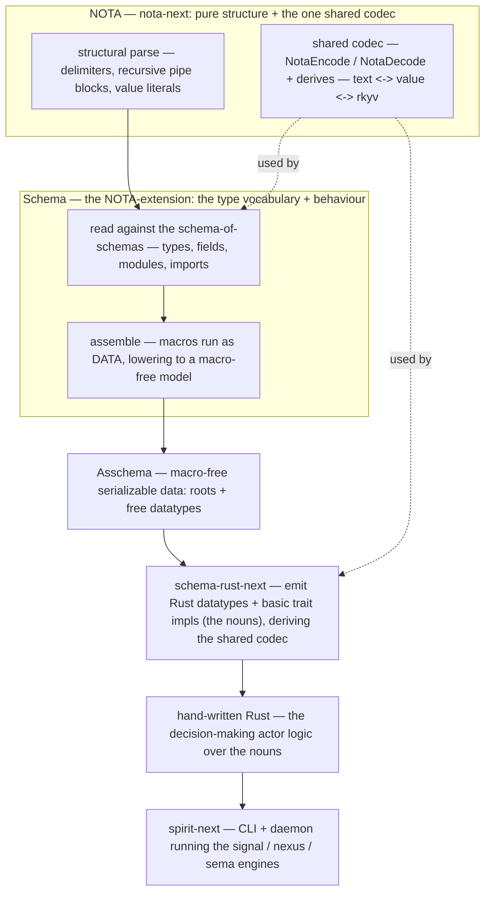

# 424 — The schema (NOTA-extension) system: what it must do, and the mandatory steps to full correctness

*Kind: Design intent / authoritative spec · Topics: schema, nota-extension, correctness, actor-system, mandatory-steps, constraints · 2026-05-29*

*The fresh, whole-system intent: what we are building, the steps that MUST be
genuinely gone through for full correctness, and the constraints that hold
throughout. Synthesizes the locked records — 1109 (everything is data), 1116
(assembled schema first), 1120 (pipe declarations), 1122 (everything is a
struct), 1137 (composite type forms), 1152 (scalar floor full-English), 1155
(roots + free datatypes), 1176 (type vocabulary is Schema's; NOTA is pure
structure + codec), 1178 (camelCase field / PascalCase type, declare-before-use),
1180 (file-based tests), 1184 (full-constraints on spirit-next; emitted nouns +
hand-written actor system), 1185 (no design-implementation avoidance). Component
depth: [[421-nota]], [[422-schema]], [[423-signal-nexus-sema]].*

## 1. The system in one picture

## 2. What the system must do

- **NOTA (nota-next) is the data substrate.** Pure structure — the delimiters
  plus the one shared serialization codec plus the `None`/`(Some x)` literal. A
  value round-trips text ⇄ rkyv. NOTA holds **no type vocabulary** of its own
  (1176).
- **Schema is the NOTA-extension.** It makes NOTA into a composable
  data-type-and-behaviour description: it owns the whole type vocabulary
  (scalars + composites), declarations (pipe forms), and a Rust-like
  module/import system; it is user-programmable into new interfaces (1138, 1176).
- **Asschema is the macro-free, FINAL data model.** Defined first (1116); a
  `roots` section plus free datatype declarations (1155); itself serializable
  data that round-trips NOTA + rkyv.
- **Emission produces the nouns.** `schema-rust-next` emits Rust datatypes +
  basic trait implementations, deriving the **shared** codec — not a private
  per-file reader (1184, [[422-schema]] §5).
- **Hand-written Rust is the actor system.** The decision-making actor logic
  lives in hand-written Rust over the emitted nouns: structure is schema, logic
  is Rust (1184).
- **It runs full-constraints on spirit-next.** CLI + daemon, with the signal /
  nexus / sema engines each defined in schema, assembled in Asschema, emitted to
  Rust, and driven by the actor logic (1184, [[423-signal-nexus-sema]]).
- **Everything is data.** Every artifact — including macros — serializes and
  deserializes; if it can't, it isn't built (1109).

## 3. The mandatory steps to full correctness

Ordered, and each must be **genuinely** done — proven by real file-based tests
(1180), not made to merely pass (1185, §5):

1. **NOTA structural parse** — nota-next parses every delimiter, including
   recursive/compact pipe blocks, and round-trips text. *Correctness:* parse →
   render → identical.
2. **The one shared codec in nota-next** — `NotaEncode`/`NotaDecode` + derive
   macros covering scalars and composites; **hand-written and emitted types use
   the same codec**. *Correctness:* text ⇄ value ⇄ rkyv round-trips, one impl.
3. **Schema read against the schema-of-schemas** — camelCase = field,
   PascalCase = type; pipe declarations; native composites; declare-before-use;
   plain `[]`/`()` datatype declarations rejected. *Correctness:* the rules hold
   on a real `.schema`, with rejection tests.
4. **Assembly into Asschema** — macros run **as data** (data-tree-in →
   data-tree-out, never build-a-string-and-reparse, 1109); the result is
   macro-free. *Correctness:* Asschema round-trips NOTA + rkyv; no text black-box
   in the macro engine.
5. **The roots model** — Asschema is `roots` + free datatypes (1155); the
   reactive surface is the named roots set, not a fixed input/output pair.
   *Correctness:* the three planes get their roots, envelopes, and origin-route.
6. **Rust emission via derives** — datatypes + basic trait impls deriving the
   shared codec, no per-file reader. *Correctness:* emitted nouns compile and
   round-trip through the same codec as hand-written types.
7. **The hand-written actor system** — decision logic over the emitted nouns.
   *Correctness:* the engines make decisions over schema-emitted nouns.
8. **Full-constraints on spirit-next** — CLI + daemon, signal/nexus/sema engines
   end-to-end. *Correctness:* a message flows schema → asschema → emitted nouns →
   actor logic → reply, on the running daemon.

## 4. The constraints that hold throughout

- **Everything is data** — serializable, macros included (1109).
- **One shared codec** — never a parallel per-file reader (1184).
- **`.asschema` is plain NOTA + rkyv only** — the line-format `.witness.txt` is
  forbidden; delete it (1112).
- **NOTA is pure structure** — the type vocabulary is Schema's (1176).
- **Declarations are pipe forms** — plain `[]`/`()` datatype declarations are
  rejected at the authored layer (1120).
- **camelCase = field, PascalCase = type; declare-before-use; inline
  declarations are reusable** (1178).
- **Asschema = roots + free datatypes** (1155).
- **Scalar floor is full-English** — `String`, `Integer`, `Boolean`, `Path`;
  never `Bool`/`U64` (1152).
- **The actor-system split** — emitted nouns + hand-written decision logic
  (1184).
- **Tests load real `.nota`/`.schema`/`.sema` files** — never inline source
  strings (1180).
- **No design-implementation avoidance** (1185, §5).

## 5. No design-implementation avoidance (record 1185)

Bootstrapping a system tempts shortcuts that make it *look* done. Full
correctness is **genuine implementation of every step in §3**, not green tests.
Forbidden:

- **Circular golden tests** — a golden file that is just a dump of the engine's
  own output cannot catch a regression. (The `.witness.txt` line-format goldens
  are both forbidden by 1112 *and* this anti-pattern.)
- **Stubs dressed as done** — `todo!`/`unimplemented!`/placeholder returns
  behind a green test.
- **The per-file reader workaround** standing in for the shared codec (step 2).
- **A text-round-trip macro black-box** standing in for macros-as-data (step 4).
- **Claimed-but-absent features** — e.g., the roots model (step 5) described but
  not in the code.

The companion audit ([[425-implementation-avoidance-audit]]) hunts for exactly
these in the current bootstrap. Known gaps at this writing (from the prior code
audit): step 2 (shared codec) is in progress; step 5 (roots model) is not in the
code (`Asschema` still has `input`/`output` + `namespace`); and the `.witness.txt`
line-format goldens still exist and are still consumed — 1112 still violated.
