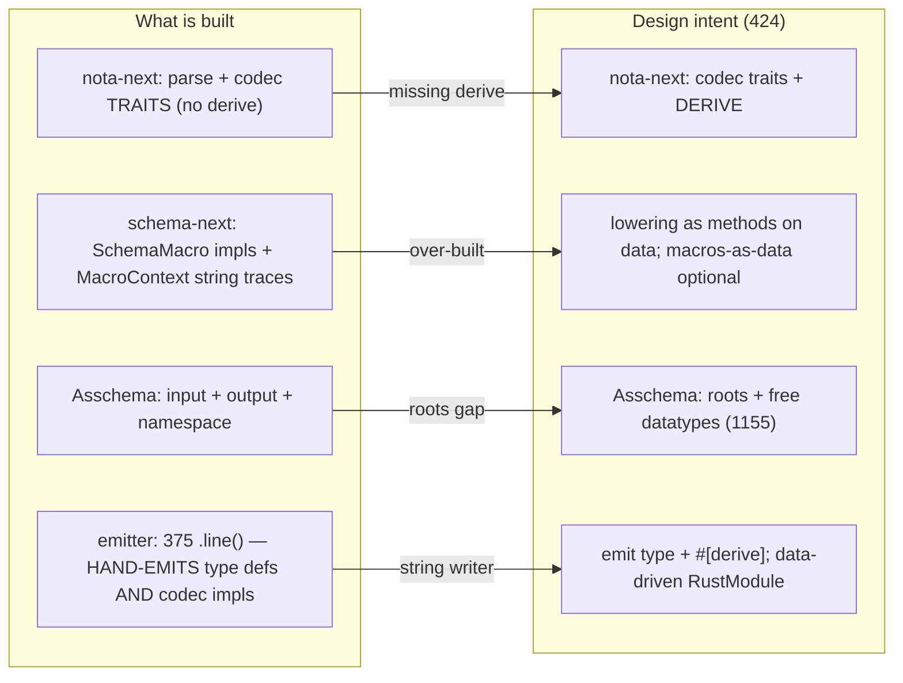

# 426 — Deep review of the schema-stack implementation: gaps, elegance, and the drastic options

*Kind: Design review / argument · Topics: schema, nota-extension, emission, macros, roots, elegance, drastic-options · 2026-05-29 · designer lane*

*An independent designer review of the operator's implementation against
[[424-schema-nota-extension-full-correctness-design-intent]]. Verdict up front:
the bootstrap is **honest and solid** on the syntax layer, the scalar floor, and
the shared codec *traits* — but three things hold it back from a
design-intent-aligned implementation, and two of them want a **drastic
simplification**, not a patch. Grounded in reads of `nota-next/src/codec.rs`,
`schema-next/src/{macros,asschema,engine,declarative}.rs`, and
`schema-rust-next/src/lib.rs`. The psyche invited high-view change; I take that
invitation.*

## 1. What is genuinely done (credit first)

Structural parse incl. recursive pipe (`nota-next`); pipe declarations
load-bearing with plain-`[]` declarations rejected; the scalar floor
`String`/`Integer`/`Boolean`/`Path` (1152 complete); native composites; macro
*calls* lower to data (`MacroOutput`, 1109 for the call); file-based fixtures
(1180); `.witness.txt` deleted (1112); and the shared codec **traits** now live
in `nota-next/src/codec.rs` (`NotaEncode`/`NotaDecode`, typed `NotaDecodeError`).
This is real, verified, honest work.

## 2. The three things holding it back



### Gap A (biggest) — the emitter hand-writes the codec, because there is no derive

`nota-next` has the codec *traits* but **no derive macro**, so
`schema-rust-next`'s emitter hand-writes every type's `NotaDecode`/`NotaEncode`
impl as Rust-source strings — `emit_nota_struct_impl`, `emit_nota_enum_impl`,
`emit_nota_newtype_impl`, … — which is the bulk of its **375 `.line()` calls**.
The design ([[424-schema-nota-extension-full-correctness-design-intent]] §5,
[[422-schema]] §5) called for *derives*: emit the type + a `#[derive(...)]` list,
let one derive generate the impl. Hand-emitting it per type is fragile (string
concatenation, no structural type-check until the generated crate compiles) and
duplicates what a derive does once.

**Bad pattern — today (`schema-rust-next/src/lib.rs`):**
```rust
fn emit_nota_struct_impl(&mut self, declaration: &StructDeclaration) {
    self.line(format!("impl NotaDecode for {} {{", declaration.name));
    self.line("    fn from_nota_block(block: &Block) -> Result<Self, NotaDecodeError> {");
    // …dozens more self.line(...) hand-writing the decode body as a string…
    self.line("    }");
    self.line("}");
}                                   // ×N types, inside 375 total .line() calls
```

**Good pattern — a `nota-next` derive (mirroring production `nota-derive`):**
```rust
// nota-next exports #[derive(NotaDecode, NotaEncode)]; the emitter then writes
// only the type definition + its derive list — the impl is generated once, by the macro.
RustItem::Struct {
    name: "Entry",
    fields: vec![("topics", "Topics"), ("kind", "Kind")],
    derives: vec!["NotaDecode", "NotaEncode", "rkyv::Archive", "rkyv::Serialize"],
}
```

This is also the **one-shared-codec** point (1184): there are currently *two*
codecs — production `nota-codec` (which already has `nota-derive`) and
`nota-next`'s new trait-only `codec.rs`. The next stack owning its own codec is
fine, but it must gain the derive (or reuse `nota-derive`), or the emitter keeps
hand-writing impls forever.

### Gap B — the emitter is a 375-line string writer (drastic option: data-driven emission)

Even with a derive, emitting Rust by `self.line("…")` concatenation is the
fragile core. The design says *everything is data* — so the emitted module
should be **data too**, rendered once:

```mermaid
flowchart LR
  asm["Asschema (data)"] --> rm["RustModule (data: items + derives + impls)"] --> txt["rendered Rust source"]
  asm -. today .-> str["375 self.line(\"…\") → String"]
```

**Good pattern — a `RustModule` data model:**
```rust
pub struct RustModule { pub items: Vec<RustItem> }
pub enum RustItem { Struct(RustStruct), Enum(RustEnum), Alias(RustAlias), Impl(RustImpl) }
impl From<&Asschema> for RustModule { /* pure data → data */ }
impl RustModule { pub fn render(&self) -> String { /* one renderer */ } }
```
Now the emission is `Asschema → RustModule → render`, the mapping is **testable on
the `RustModule` data** (not on a brittle output string), and the renderer is one
small function instead of 375 scattered `.line()` calls. (`quote!` is the
off-the-shelf alternative if you'd rather not own a renderer.)

### Gap C — the macro engine is over-built, and tested through a side channel

The "macro engine" is four bespoke Rust `SchemaMacro` impls (`RootImportsMacro`,
`RootNamespaceMacro`, `RootEnumMacro`, `DeclarativeSchemaMacro`) plus a
`MacroDispatch` and a `MacroContext` that accumulates **string traces** —
`macros_applied: Vec<String>`, `bindings_seen: Vec<String>`,
`expanded_templates: Vec<String>` ("macro -> template" strings, a vestige of the
old text-template macro design). The big-example tests then assert on the
*trace*, not the output:

**Bad pattern — testing the side channel (`big_examples.rs`):**
```rust
assert!(context.macros_applied().iter().any(|n| n.contains("Struct") || n.contains("Enum")));
assert!(context.positions_seen().iter().any(|p| p.as_str() == "RootNamespace"));
```
That passes whenever the engine *ran* a Struct/Enum macro — it can't catch a
wrong lowering. **Good pattern — assert the produced data:**
```rust
let asschema = engine.lower(fixture!("spirit.schema"))?;
assert_eq!(asschema.type_named("Entry"), Some(&expected_entry));   // the real result
```

The deeper point: now that the core forms are *native* NOTA structure + schema
declarations (1120/1137/1176), the built-in lowering doesn't need a "macro"
abstraction at all. **Drastic option — collapse it to verb-belongs-to-noun
methods** (the shape operator report 233 itself sketched):
```rust
impl RawSchemaFile { fn read_syntax(&self) -> Result<SyntaxSchema, SchemaError> }
impl SyntaxSchema   { fn assemble(&self)   -> Result<Asschema, SchemaError> }   // no macro registry
```
Keep "macros as data" (1109) as a *separate, future, optional* user-extension —
a serializable macro-table + one generic interpreter — not entangled with the
built-in lowering. The current `SchemaMacro`/`MacroDispatch`/trace-`Vec<String>`
machinery is neither: it's bespoke Rust dressed in macro vocabulary.

## 3. What is missing for full design-intent alignment

- **The derive macro** (Gap A) — without it the "emit derives" intent is unmet.
- **The roots model (1155)** — `Asschema` is still `input`/`output` + `namespace`
  (`asschema.rs:63-65`); `MacroPosition` still has `RootInput`/`RootOutput`. The
  reactive surface must become the **named roots set**:
  ```rust
  // bad (today): a fixed pair — can't express signal/nexus/sema as three roots
  pub struct Asschema { input: EnumDeclaration, output: EnumDeclaration, namespace: Vec<TypeDeclaration> }
  // good (1155): N named roots — each plane is a root
  pub struct Asschema { roots: Vec<RootDeclaration>, declarations: Vec<TypeDeclaration> }
  pub struct RootDeclaration { name: Name, surface: EnumDeclaration }
  ```
- **The actor system on spirit-next (1184)** — not yet (expected; it is the end
  of the pipeline).
- **Macro definitions as data (1109)** — only the *calls* are data; the
  definitions are Rust. Optional per the open user-macro question, but if a user
  macro layer is wanted, this is where it lives.

## 4. Recommendation / priority

1. **Add the `nota-next` derive** (or reuse `nota-derive`) and cut the emitter's
   hand-emitted codec impls — highest leverage, directly unblocks "emit derives."
2. **Land the roots model (1155)** — required for the three-plane actor surface;
   it is the one design-intent gap the operator has not flagged.
3. **Drastic, worth it:** move emission to a `RustModule` data model
   (`Asschema → RustModule → render`) and **retire the macro/trace machinery** in
   favour of `SyntaxSchema::assemble` methods + output-data tests. These two make
   the stack *everything-is-data* end to end and shrink the most fragile code.

None of this contradicts the operator's work — it builds on the honest base and
removes the two string-heavy, vocabulary-heavy layers (the 375-line emitter and
the macro registry) that the native-structure decisions have already made
unnecessary.
