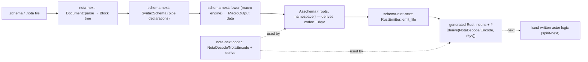
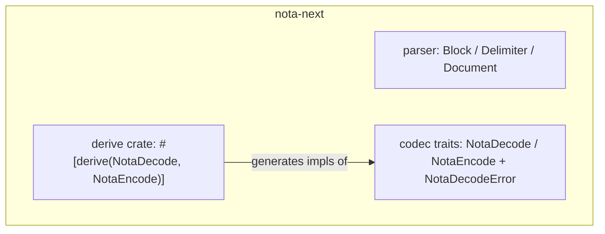
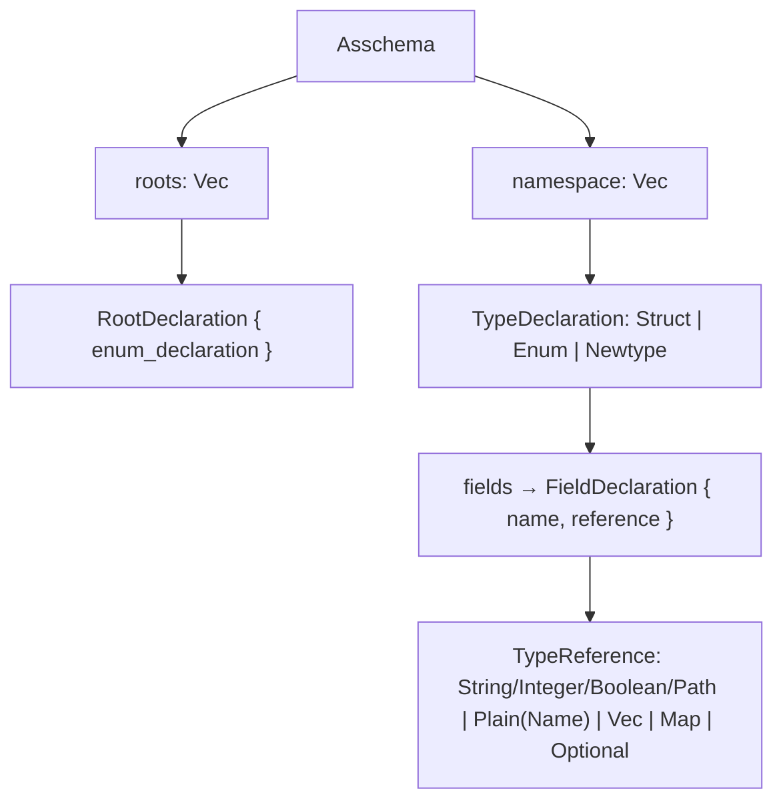

# 427 — The schema stack as it is being implemented now: parts, interfaces, state

*Kind: Current-state reference · Topics: schema, nota-extension, codec, emission, roots, macros-as-data, interfaces · 2026-05-29 · designer lane*

*My best read of the live system as the operator's 7-step pass lands (mid-flight).
Each essential part with its real Rust interface and a visual. Grounded in reads
of `nota-next/src/{parser,codec}.rs` + `nota-next/derive/src/lib.rs`,
`schema-next/src/{syntax,macros,asschema,engine,declarative}.rs` +
`schema-next/schemas/core.schema`, `schema-rust-next/src/lib.rs`. State summary
in §5; the design target is [[424-schema-nota-extension-full-correctness-design-intent]],
the review driving this pass is [[426-schema-implementation-deep-review]].*

## 0. The whole pipeline (as built now)



Green today: `src → … → rs`. Dotted/`next`: the actor system (1184).

## 1. nota-next — the substrate (structure + codec + derive)

Pure structure plus one serialization codec. **No schema types.**

```rust
// parser.rs — structural reader
pub enum Block { Atom(Atom), PipeText(PipeText), Delimited { delimiter: Delimiter, root_objects: Vec<Block>, .. } }
pub enum Delimiter { SquareBracket, Brace, Parenthesis, PipeParenthesis, PipeBrace }
impl Document { pub fn parse(source: &str) -> Result<Document, NotaError>; }

// codec.rs — the shared codec (typed errors)
pub trait NotaDecode: Sized { fn from_nota_block(block: &Block) -> Result<Self, NotaDecodeError>; }
pub trait NotaEncode        { fn to_nota(&self) -> String; }
pub struct NotaSource<'s> { /* parse_root(); parse::<V: NotaDecode>() */ }
pub enum NotaDecodeError { Parse(String), ExpectedDelimited{..}, UnknownVariant{..}, InvalidInteger{..}, .. }

// derive/src/lib.rs — the proc-macro crate (NEW, step 1)
#[proc_macro_derive(NotaDecode)] /* struct + enum, via syn/quote */
#[proc_macro_derive(NotaEncode)]
```



The win this pass: the derive crate means a type just `#[derive(NotaDecode,
NotaEncode)]` — the impl is generated once, not hand-written per type.

## 2. schema-next — the schema layer (syntax → lower → assembled)

### 2a. Syntax + lowering

```rust
// syntax.rs
pub struct SyntaxSchema { /* parsed-NOTA view: pipe declarations, references */ }

// macros.rs — the lowering engine (still "macro"-framed)
pub enum MacroPosition { RootImports, RootInput, RootOutput, RootNamespace, NamespaceDeclaration, StructFields, EnumVariants, TypeReference }
pub trait SchemaMacro { fn matches(..) -> bool; fn lower(..) -> Result<MacroOutput, SchemaError>; }
pub enum MacroOutput { Asschema(Asschema), Imports(..), RootEnum(EnumDeclaration), Types(..), Type(..), Fields(..), Variants(..), Reference(TypeReference), References(..) }
//   4 bespoke impls: RootImportsMacro, RootNamespaceMacro, RootEnumMacro (engine.rs); DeclarativeSchemaMacro (declarative.rs)
//   MacroContext still accumulates trace strings: macros_applied / bindings_seen / expanded_templates
```

Macro *calls* lower to `MacroOutput` (data); *definitions* are these Rust impls
(the macros-as-data frontier is §4).

### 2b. The assembled model — now roots-based

```rust
pub struct Asschema {
    identity: SchemaIdentity,
    imports: Vec<ImportDeclaration>,
    resolved_imports: Vec<ResolvedImport>,
    roots: Vec<RootDeclaration>,        // ← NEW (1155): the named reactive-root set
    namespace: Vec<TypeDeclaration>,
}
pub struct RootDeclaration { pub enum_declaration: EnumDeclaration }   // each root is a named enum
pub enum TypeDeclaration { Struct(StructDeclaration), Enum(EnumDeclaration), Newtype(StructDeclaration) }
pub enum TypeReference { String, Integer, Boolean, Path, Plain(Name), Vector(Box<TypeReference>), Map(Box<TypeReference>, Box<TypeReference>), Optional(Box<TypeReference>) }
// Asschema + these all #[derive(NotaDecode, NotaEncode, rkyv::*)] → .asschema round-trips as data
// transitional: input()/output()/input_and_output() accessors are kept as views over roots
```



## 3. schema-rust-next — emission (now derive-based)

```rust
impl RustEmitter {
    pub fn emit_file(&self, asschema: &Asschema) -> GeneratedFile;   // emits from asschema.roots + namespace
    // per type: writes the def + a derive line, e.g.
    //   #[derive(nota_next::NotaDecode, nota_next::NotaEncode, rkyv::Archive, rkyv::Serialize, rkyv::Deserialize, Clone, Debug, Eq, PartialEq)]
    // the codec is DERIVED now (the old emit_nota_*_impl hand-writers are gone)
    // still emits: short-headers, mail-event support, plane envelopes/Plane, scalar aliases (Path = String)
}
```

The codec impls are no longer hand-written — but the emitter is **still a
~303-call `self.line("…")` string writer** for the type defs + plane support
(the `RustModule`-data refactor of [[426-schema-implementation-deep-review]] §Gap-B
is step 7, not yet done; only a `RustModulePath` naming helper exists).

## 4. The macros-as-data frontier — `core.schema` (in-flight)

The macro *system itself* is being modeled as schema data — `schemas/core.schema`:

```nota
{
  SchemaMacro {| SchemaMacro macroName MacroName macroPosition MacroPosition macroPattern MacroPattern macroTemplate MacroTemplate |}
  MacroPosition (| MacroPosition RootImports RootInput RootOutput RootNamespace NamespaceDeclaration StructFields EnumVariants TypeReference |)
  MacroShape    (| MacroShape BraceMap ParenthesisEnum SquareStruct KeyValueDeclaration VariantDefinition Symbol |)
  MacroOutputKind (| MacroOutputKind Imports RootEnum Types Type Fields Variants Reference References AssembledSchema |)
}
```

This is real progress toward record 1109 (macros as data). **One flag:**
`MacroPattern` and `MacroTemplate` are `String`. Record 1109 was explicit that
the pattern and template must be **data trees, not text with placeholder
sigils** — a `String` pattern/template is the text-template shape it forbade. So
this models the macro *table* as data but keeps the pattern/template as text;
finishing 1109 means those become NOTA/SchemaNode data, not strings.

## 5. State vs the design target (424)

```text
step / target                         status
-------------                         ------
parse + pipe delimiters               DONE
shared codec + DERIVE (step 1)        DONE (nota-next/derive; genuine proc-macro)
emit derives, drop hand-impls (2)     DONE (codec impls derived, not hand-written)
roots model (3, record 1155)          DONE (Asschema { roots }); input/output kept as views
scalar floor incl. Path (1152)        DONE
witness goldens removed               DONE
remove macro-trace side-channel (4)   PARTIAL — lowering.rs still asserts macros_applied / expanded_templates / positions_seen
support nouns → schema (5, core.schema) IN-FLIGHT — macro system modeled as data, but pattern/template are String (1109 risk)
spirit-next production parity (6)     PENDING
RustModule emission + lowering-as-methods (7)  PENDING (emitter still ~303 self.line)
hand-written actor system (1184)      PENDING (downstream)
```

**Read:** the correctness-critical gaps from the review — the missing derive and
the roots model — are genuinely closed. What remains is (a) finishing the
trace-test cleanup with output-data assertions, (b) keeping the `core.schema`
macro pattern/template as data not `String`, and (c) the two drastic refactors
(RustModule emission, collapse the macro engine into `SyntaxSchema::assemble`
methods) plus the spirit-next/actor end. The stack is converging on 424; the
string-shaped macro template is the one place the *direction* could drift from
1109 if not caught now.
