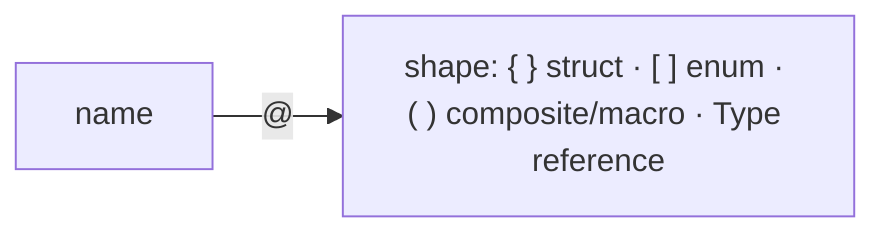
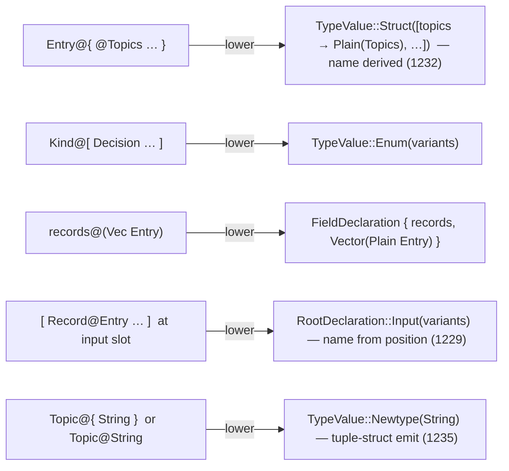

# 428 — The `@`-sigil declaration syntax: full spec (pipes → `@` pivot)

*Kind: Settled syntax spec · Topics: nota, schema, declarations, sigil-macros, nota-macro-interface · 2026-05-29 · designer lane*

*Settled by the psyche 2026-05-29 ("do this"). Records 1199 (the decision),
1202 (refinements), 1211 (bracket-enum, no overload), 1216 (universal
`Name@Delimiter` for declarations), 1226 (visibility + struct-as-key-value),
1229 (positional root-struct fields are bare), 1232 (`@Type` derived-name
shorthand for field/variant), 1235 (newtype = single-element brace `{ Type }`,
distinct `Newtype` variant in assembled model, tuple-struct emit). This
**supersedes the pipe declaration forms** of record 1120: `{| |}` / `(| |)`
are now **transitional**; `@`-sigil is the target. The spec the operator
pivots against. Substrate: [[421-nota]]; schema layer: [[422-schema]];
assembled model now distinguishes `Newtype` from multi-field `Struct`
([[424-schema-nota-extension-full-correctness-design-intent]]).*

## 1. The form — name first, `@` binds name to shape

`@` is the **name-to-shape binder**: `name@shape`. The delimiter after `@` is the
shape.

```text
TOP-LEVEL declarations:
form                                  declares
----                                  --------
Name@{ field@Type  field@Type  … }    a STRUCT — multi-field, named (key-value map per 1226)
Name@{ Type }                         a NEWTYPE — single-element brace (record 1235)
Name@Type                             a NEWTYPE — short form for Name@{ Type } (tuple-struct emit)
Name@[ Variant  Variant  … ]          an ENUM
Name@(Vec X)                          a named composite alias

WITHIN a struct (`Name@{ … }`):
form                                  declares
----                                  --------
field@Type                            a field — explicit name, typed
@Type                                 a field — name DERIVED from type (record 1232; @Topics ≡ topics@Topics)
field@(Vec X) / @(Vec X)              a field — composite, explicit or derived (1119)

WITHIN an enum (`Name@[ … ]`):
form                                  declares
----                                  --------
VariantName                           a unit variant (bare PascalCase)
VariantName@Type                      a data variant — explicit name, held type
@Type                                 a data variant — name = held type (record 1232; @Foo ≡ Foo@Foo)
```

The three delimiters carry distinct meaning, so nothing is overloaded:
**`{ }` = struct (named fields)**, **`[ ]` = enum (variants)**, **`( )` =
composite / macro-call (filling with data — `Vec`/`Optional`/`Map`)** (record
1211).



Worked, recursively:

```nota
Topic@String
Topics@(Vec Topic)
Kind@[ Decision Principle Correction ]
Entry@{ topics@Topics kind@Kind description@Description }
RecordSet@{ records@(Vec Entry) byTopic@(Map Topic RecordIdentifier) }
```

Bad (transitional pipe) vs good (`@`):

```nota
{| Entry topics Topics kind Kind |}     ; pipe: name repeated, delimiter noise
Entry@{ topics@Topics kind@Kind }       ; @: name once, shape cued by @ + delimiter
```

## 2. The root is an implicit struct with positional fields (records 1202, 1229)

A `.schema` file's **root is an implicit struct** — no delimiter, no sigil, even
single-field — and its name comes from the filename ([[424-...]], 1129). The root
struct's fields are **positional and known** from the schema-of-schemas:
`imports` / `input` / `output` / `namespace`. The file body is **those four
values in order, bare** at each position — not a flat list of declarations + named
roots, and not `Imports@{ }` / `Input@[ ]` / `Output@[ ]` / `Namespace@{ }`. The
`Name@Delimiter` rule below applies to **declarations** where the user invents a
new type name (record 1229); at known positional slots in a struct with fixed
fields, the value is bare. Push struct-ness into the Rust as far as possible
(everything is a struct, 1122).

```nota
; spirit.schema  → implicit root struct `Spirit` with 4 positional fields
{}                                                ; imports — positional
[ Record@Entry  Observe@Query ]                   ; input — positional (signal-plane variants)
[ Recorded@Receipt  Observed@RecordSet ]          ; output — positional
{                                                 ; namespace — positional
  Topic@String
  Kind@[ Decision Principle Correction ]
  Entry@{ topics@Topics  kind@Kind }
  NexusInput@[ Signal@Input  Sema@SemaOutput ]    ; additional plane root — a DECLARATION
}
```

Surface-vs-assembled: the surface input/output positions are bare values; the
lowering assigns the canonical names Input / Output when populating the assembled
model's `roots: Vec<RootDeclaration>` ([[422-schema]] §4). Additional plane roots
declared inside the namespace lower as ordinary named root declarations.

## 3. No overload — the delimiter decides (record 1211)

The earlier draft overloaded `@(…)` between an inline enum and a composite type.
Record 1211 removes the overload by moving the enum to the **bracket**, so the
delimiter alone decides — no first-token disambiguation:

```text
Kind@[ Decision Correction ]   → ENUM declaration            ( [ ] = variants )
records@(Vec Entry)            → field of Vec<Entry>          ( ( ) = composite / macro-call )
limit@(Optional Integer)       → field of Optional<Integer>
topics@Topics                  → field of the named type Topics
@Topics                        → struct field `topics` of type Topics (name derived; record 1232)
@RecordIdentifier              → struct field `recordIdentifier` of type RecordIdentifier
@Entry                         → enum data variant `Entry` of type Entry (name unchanged; record 1232)
Topic@{ String }               → NEWTYPE — single-element brace (record 1235)
Topic@String                   → NEWTYPE — short form for Topic@{ String }
```

`( )` is **always** the composite / macro-call form (`Vec`/`Optional`/`Map` —
conceptual macros, "here is the data"); `[ ]` is **always** an enum (variants);
`{ }` is **always** a struct (named fields). An **unnamed composite** at a field
position still derives its name (record 1119): `(Vec Entry)` → field
`vec_of_entry`, composite type-name `VecOfEntry` — provided it doesn't conflict.

## 4. The NOTA-macro interface — `@{`/`@(` are *defined*, not hardcoded

The deepest part: a declaration macro is **`sigil + delimiter → shape`**, defined
as data at the NOTA layer (the mechanism behind `core.schema`'s macro model,
record 1109). NOTA exposes the interface; schema registers its declaration
macros through it:

```rust
// nota-next: a sigil-based open-delimiter macro is DATA
pub struct OpenDelimiterMacro { pub sigil: char, pub delimiter: Delimiter, pub shape: MacroShape }

// schema registers (data, not Rust impls) — post-1211, bracket = enum, paren = composite:
//   { sigil: '@', delimiter: Brace,        shape: Struct }    →  Name@{ … }
//   { sigil: '@', delimiter: Bracket,      shape: Enum }      →  Name@[ … ]
//   { sigil: '@', delimiter: Parenthesis,  shape: Composite } →  Name@(Vec …)     (named composite alias)
//   { sigil: '@', /* bare type */          shape: Field }     →  name@Type
// extensible: a '#' + delimiter could open another macro family (speculative — record 1202)
```

So the schema declaration forms stop being bespoke Rust and become **macro-table
data** — which is the same `MacroTable`-from-asschema target the operator's gap
list (report 242) names. The `@`-syntax and macros-as-data are one move.

## 5. Lowering — surface only; the assembled model is unchanged

`@`-forms lower to the **same** assembled model — `Asschema { roots, namespace }`,
`TypeDeclaration`, `TypeReference` — as the pipes did. So this is
**assembled-schema-first-compatible**: a pure surface change.



## 6. The pivot — what changes, what doesn't

```text
CHANGES (surface):                          UNCHANGED (downstream):
- nota-next: pipe-delimiter parsing →       - the assembled model (roots, TypeReference, …)
  the @-sigil open-delimiter macro interface - the shared codec + derive
- schema-next: pipe declaration reading →   - emission (stays authored-syntax-independent —
  @-declaration reading                       it reads Asschema, not the surface)
- the .schema fixtures + report examples    - spirit-next / the actor flow
```

Pipes (1120) stay as a transitional alias until the `@` path is in; then the
`.schema` fixtures and [[421-nota]]/[[422-schema]] examples move to `@`.

## 7. Acceptance (for the operator pivot)

1. nota-next parses `Name@{ … }` struct, `Name@[ … ]` enum, `Name@(Vec …)`
   named composite, and `name@Type` field via the sigil+delimiter macro interface
   (a real file fixture, 1180).
2. The root file lowers as an implicit struct with four positional fields
   (imports / input / output / namespace, record 1229): bare `{}` for imports,
   bare `[ … ]` for input and output, bare `{ … }` for namespace. Name comes
   from filename.
3. `name@(Vec X)` lowers to a composite field reference; `Name@[ Variant … ]`
   to an enum declaration; an unnamed composite derives its name.
4. **`@Type` derivation (record 1232)**: at a struct field position `@Topics`
   lowers to `(topics, Plain(Topics))` — field name = camelCase of the type; at
   an enum data-variant position `@Foo` lowers to a variant named `Foo` holding
   `Plain(Foo)` — variant name unchanged. Duplicate-derived-name conflicts must
   error.
5. **Newtype vs multi-field struct (record 1235)**: a brace with ONE element
   lowers to `TypeValue::Newtype(TypeReference)`; a brace with N alternating
   name-type pairs lowers to `TypeValue::Struct(Vec<(Name, TypeReference)>)`.
   `Name@Type` at a top-level declaration position is a newtype (short form for
   `Name@{ Type }`). Rust emission: newtypes are tuple-structs with
   `NotaTransparent`; multi-field structs are named-field structs with
   `NotaRecord`.
6. The `@`-forms lower to the same `Asschema` the pipe forms produced
   (round-trip test against the same golden) — proving the surface change is
   semantics-preserving. The bare input/output values lower to
   `RootDeclaration::Input` / `Output` with names assigned from position.
7. The declaration macros are registered as **data** through the interface, not
   bespoke Rust — converging with the `MacroTable`-from-asschema target (242).

## 8. Visibility and inline local types (record 1226)

A PascalCase name creates a type; whether it is exported depends on **where** it
is declared (positional default):

- **Top-level** (in the root struct's namespace) → **public**, exported — this
  is the schema used as a library.
- **Inline** (a PascalCase type written directly at a field) → **private /
  local**: it is logged into the schema's local-types table, and a module-local,
  non-exported Rust type named after the identifier is emitted. The field uses
  the lowercase field name + the PascalCase local-type name.

So a schema defines new types compactly inline without re-naming — sugar that
derives the field name from the type and logs the type local. In the assembled
schema these become `(Public Name Value)` / `(Private Name Value)` declarations
([[422-schema]] §4) — a data-carrying variant, tag then positional name then
value, like every NOTA record — where a struct's `value` **is a key-value brace
map** (field → type), the elegant lowest-level form `@{ … }` expands into.
