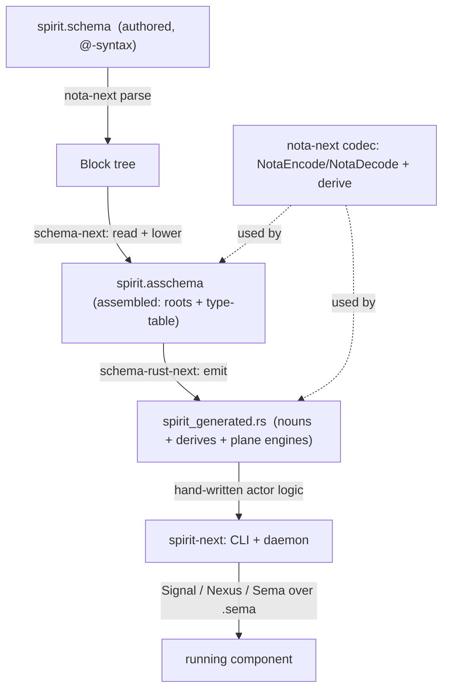
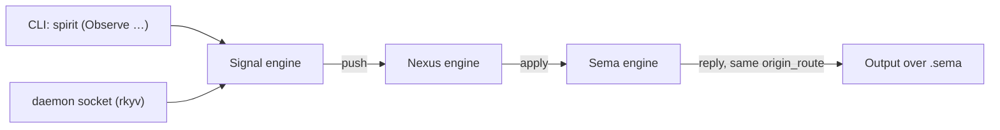

# 429 — The whole stack, intended together: NOTA → schema → assembled → emission → a running component (Spirit)

*Kind: Presentation / synthesis · Topics: nota, schema, assembled-schema, emission, spirit-next, actor-system, syntaxes · 2026-05-29 · designer lane*

*The whole schema/NOTA stack as one intended picture, ending at a running
component (Spirit). All the syntaxes, the types that load each kind of file, the
intent constraints, with visuals and code. Synthesizes the captured intent —
1109, 1116, 1120, 1122, 1126–1130, 1137, 1152, 1155, 1176, 1178, 1180, 1184,
1185, 1199, 1202, 1211, 1216, 1226, 1229. Component depth: [[421-nota]], [[422-schema]],
[[423-signal-nexus-sema]], [[428-at-sigil-declaration-syntax-spec]].*

## 1. One picture



Four layers, one codec, one data model that round-trips at every stage:
**NOTA text ⇄ Rust value ⇄ rkyv bytes.**

## 2. The intent constraints (the load-bearing principles)

- **Everything is data** (1109) — every artifact, macros included, serializes
  and round-trips (NOTA text ⇄ rkyv). If it can't, it isn't built.
- **Everything is a struct** (1122) — unit variant = 0-field struct, data variant
  = 1-field struct, enum = single-field struct. A struct **is a key-value map**
  (field → type) (1226).
- **Define the assembled schema first** (1116) — the macro-free FINAL model the
  rest derives from.
- **One shared codec** (1184) — `nota-next` owns `NotaEncode`/`NotaDecode` + a
  derive; hand-written, schema-emitted, and assembled-schema types all use it.
- **NOTA is pure structure; the type vocabulary is Schema's** (1176) — scalars
  `String`/`Integer`/`Boolean`/`Path` (1152), composites `Vec`/`Optional`/`Map`.
- **Universal macro shape for declarations: `Name @ Delimiter`** (1216, scoped by
  1229) — `@{` struct, `@[` enum, `@(` composite. Positional values at the root
  struct's known fields (imports / input / output / namespace) stay bare — they
  are values, not declarations.
- **camelCase = field, PascalCase = type; declare-before-use; inline = local**
  (1178, 1202, 1226). Top-level = public/exported, inline = private/local.
- **The reactive surface is a named roots set** (1155); a component runs three
  planes — Signal / Nexus / Sema (1184, [[423-signal-nexus-sema]]).
- **The Rust is the actor system** (1184) — schema emits the noun datatypes +
  basic traits; hand-written Rust is the decision logic over them.
- **Tests load real files** (1180) and **no design-implementation avoidance**
  (1185): genuine implementation, proven by file fixtures, not green tests.

## 3. All the syntaxes, side by side

There are four surfaces; the same value flows through them.

```text
purpose                 NOTA value            Schema @-authoring        Assembled .asschema          emitted Rust
-------                 ----------            ------------------        -------------------          ------------
a vector value          [a b c]               —                         [a b c]                      vec![a, b, c]
a map value             {k v k v}             —                         {k v}                        BTreeMap
a struct TYPE           —                     Entry@{ topic@Topic }     (Public Entry { topic Topic }) #[derive…] struct Entry { topic: Topic }
an enum TYPE            —                     Kind@[ Decision Correct ] (Public Kind [ Decision … ]) #[derive…] enum Kind { Decision, … }
a composite TYPE        —                     vals@(Vec Entry)          (Vector (Plain Entry))       Vec<Entry>
a scalar TYPE           —                     n@Integer                 Integer                      u64
a field binding         —                     topic@Topic               topic Topic                  pub topic: Topic
text                    [|multi-line|]        —                         [|…|]                        String
option absent/present   None / (Some x)       —                         None / (Some x)              Option
```

**The schema `@`-syntax in full** (records 1216 + 1229 / [[428-at-sigil-declaration-syntax-spec]]):

```nota
Entry@{ topics@Topics  kind@Kind  description@Description }    ; @{ } = struct (named fields)
Kind@[ Decision Principle Correction ]                        ; @[ ] = enum (variants)
RecordSet@{ records@(Vec Entry)  byTopic@(Map Topic RecordId) } ; @( ) = composite / macro-call
Topic@String                                                  ; name@Type = a typed binding / newtype
NexusInput@[ Signal@Input  Sema@SemaOutput ]                  ; a plane-root DECLARATION (in namespace)
```

`@` is the name-to-shape binder; the delimiter is the shape; the rule is uniform
(`Name @ Delimiter`) for **declarations** — when the user invents a name. camelCase
names are fields; PascalCase names are types (top-level → public, inline → a
private local type, sugar). Positional values at the root struct's known fields
(imports / input / output / namespace) are bare, not declarations (record 1229) —
so a top-level `Input@[ … ]` is wrong; the input variants land bare at the
positional input slot. `NexusInput` / `SemaInput` keep `Name@[ … ]` because they
are declarations inside the namespace.

## 4. The layers and the types that load each file

```text
file        layer            loaded by                              into / via
----        -----            ---------                              ----------
.nota       nota-next        Document::parse → Block                NotaDecode::from_nota_block / NotaSource::parse::<T>()
.schema     schema-next      SyntaxSchema (over a parsed Block)     lower (macro engine) → Asschema
.asschema   schema-next      Asschema::from_nota                    the assembled data (round-trips via the shared codec + rkyv)
.sema       (emitted)        the emitted plane types                Sema<Root> envelope / schema::Plane (signal/nexus likewise)
fixtures    tests            FixtureNota / FixtureSchema            real files, never inline (1180)
```

- **`nota-next`** — parser (`Block`/`Delimiter`/`Document`) + the shared codec
  (`NotaEncode`/`NotaDecode`, `NotaDecodeError`) + the `#[derive(NotaDecode,
  NotaEncode)]` proc-macro crate. Pure structure; no schema types.
- **`schema-next`** — reads a `.schema` against the schema-of-schemas, lowers the
  `@`-declarations into the assembled `Asschema`:

  ```rust
  pub struct Asschema { identity, imports, roots: Vec<RootDeclaration>, declarations: Vec<Declaration> }
  pub enum Declaration { Public(Name, TypeValue), Private(Name, TypeValue) }   // NOTA: (Public Name Value)
  pub enum TypeValue   { Struct(Vec<(Name, TypeReference)>), Enum(Vec<Variant>) }  // struct = field→type map
  pub enum TypeReference { String, Integer, Boolean, Path, Plain(Name), Vec(Box), Optional(Box), Map(Box) }
  ```
- **`schema-rust-next`** — emits Rust noun types that **derive** the shared
  codec, plus the plane envelopes / `schema::Plane` / origin-route.
- **`spirit-next`** — the component: hand-written actor logic over the emitted
  nouns, run by the CLI and daemon across the three plane engines.

## 5. Worked example — Spirit, end to end

### 5a. Authored — `spirit.schema` (`@`-syntax; root is the implicit `Spirit` struct with 4 positional fields: imports / input / output / namespace — record 1229)

```nota
{}                                                              ; imports — positional, empty
[ Record@Entry  Observe@Query  Remove@RecordIdentifier ]        ; input — positional (signal-plane variants)
[ RecordAccepted@SemaReceipt  RecordsObserved@ObservedRecords  Error@ErrorReport ]  ; output — positional
{                                                               ; namespace — positional
  Topic@String
  Topics@(Vec Topic)
  Kind@[ Decision Principle Correction Clarification Constraint ]
  Entry@{ topics@Topics  kind@Kind  description@Description }
  Query@{ topics@Topics  limit@(Optional Integer) }
  RecordSet@{ records@(Vec Entry)  byTopic@(Map Topic RecordIdentifier) }
  NexusInput@[ Signal@Input  Sema@SemaOutput ]                  ; additional plane roots — DECLARED (Name@)
  SemaInput@[ Record@Entry  Observe@Query ]
}
```

Input / Output are not `Name@` declarations — they are values at the root struct's
positional `input` / `output` slots, same shape as bare `{}` at `imports` and bare
`{ ... }` at `namespace`. NexusInput / SemaInput stay `Name@[ … ]` because they are
user-invented declarations inside the namespace, not positional fields.

### 5b. Assembled — `spirit.asschema` (macro-free NOTA data; round-trips + rkyv)

```nota
([example:spirit] [0.1.0]) []
[ (RootEnum Input [ (Record (Plain Entry)) (Observe (Plain Query)) ]) (RootEnum Output [ … ]) ]
[ (Public Topic { text String })
  (Public Topics { items (Vector (Plain Topic)) })
  (Public Kind [ Decision Principle Correction Clarification Constraint ])
  (Public Entry { topics (Plain Topics)  kind (Plain Kind)  description (Plain Description) })
  (Public RecordSet { records (Vector (Plain Entry))  byTopic (Map [(Plain Topic) (Plain RecordIdentifier)]) }) ]
```

Visibility is `(Public …)` / `(Private …)`; a struct is the `{ field type … }`
key-value map; the roots are the named entry-point set.

### 5c. Emitted — `spirit_generated.rs` (the nouns + the plane machinery)

```rust
#[derive(nota_next::NotaDecode, nota_next::NotaEncode, rkyv::Archive, rkyv::Serialize, rkyv::Deserialize, Clone, Debug, PartialEq, Eq)]
pub struct Entry { pub topics: Topics, pub kind: Kind, pub description: Description }

#[derive(nota_next::NotaDecode, nota_next::NotaEncode, rkyv::Archive, rkyv::Serialize, rkyv::Deserialize, Clone, Debug, PartialEq, Eq)]
pub enum Input { Record(Entry), Observe(Query), Remove(RecordIdentifier) }

// plane support, also emitted:
pub struct Signal<Root> { pub origin_route: OriginRoute, pub root: Root }   // + Nexus<…>, Sema<…>
pub mod schema { pub enum Plane<S, N, M> { Signal(Signal<S>), Nexus(Nexus<N>), Sema(Sema<M>) } }
```

### 5d. Running — `spirit-next` (the actor system)



Reading the CLI label as NOTA: `spirit (Observe …)` — the bare parenthesis form
is NOTA, the shell quote wrapping the whole argument is implicit (NOTA strings
never use `"`, so the shell double quote is the clean outer boundary —
[[421-nota]] §5).

The emitted `Input`/`Output`/plane types are the **nouns**; the Signal/Nexus/Sema
engines and the decision logic are **hand-written Rust** over them (1184). A
message arrives as NOTA text (CLI) or rkyv bytes (socket), decodes through the
shared codec into `Input`, threads the trait-ordered engines on its plane
envelope (origin-route correlating the reply), and returns `Output`. That is the
whole stack closing the loop: schema → assembled → emitted nouns → actor system →
a live component.

## 6. The one line that ties it together

A schema is NOTA; it declares types with `Name@Delimiter`; it lowers to a
macro-free, visibility-tagged, struct-is-key-value assembled data model; that
model emits Rust nouns deriving one shared codec; hand-written actor logic over
those nouns runs the three planes on spirit-next. Everything is data, everything
round-trips, and every step is a real file you can read and a real type that
loads it.
