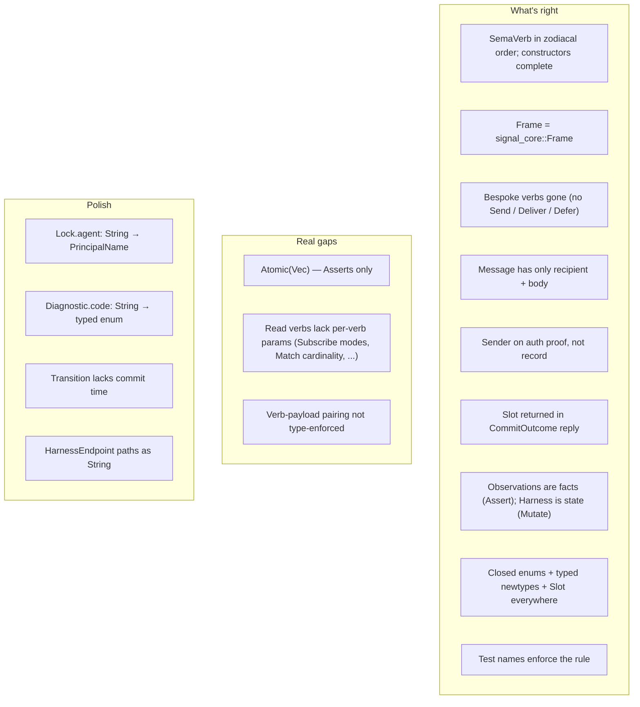

# Audit — signal-core 56002aa7d7cf and signal-persona afdc46823d14

Status: designer audit of operator's first contract slice.
Author: Claude (designer)

The audit is pinned to commits `56002aa7d7cf` (signal-core)
and `afdc46823d14` (signal-persona) so concurrent edits
don't shift the ground.

The contract slice is **mostly excellent**. signal-core's
twelve-verb order matches the canonical zodiacal scaffold.
signal-persona's record discipline is the cleanest contract
shape I've seen in this workspace: every load-bearing
identity/sender/time discipline rule from ESSENCE §"Infrastructure
mints identity, time, and sender" is enforced in the types,
the test names, and the architecture doc.

**Two real gaps need to be filled before this becomes M0
sufficient**: (1) `PersonaRequest::Atomic(Vec<Record>)` can
only bundle Asserts, but the design (designer/40 §10,
operator/41 §6) requires Atomic to bundle Asserts + Mutates
+ Retracts together; and (2) several read verbs need
verb-specific parameters (Subscribe modes, Match
cardinality, Aggregate reductions, etc.) that the current
`PersonaRequest::Query(Query)` shape has no place for. Both
are fixable without disturbing the rest of the contract.

The smaller issues — `Lock::agent: String` instead of typed
`PrincipalName`, missing typed `Diagnostic::code`,
`Transition` with no commit-time field — are polish.

---

## 0 · TL;DR



The structure is right. The gaps are about completeness of
the contract, not about reversing direction. Filling them
is a focused 1-2 commits of work.

---

## 1 · What's right (specific list)

### 1.1 signal-core 56002aa7d7cf

**SemaVerb order matches designer/26 §0 exactly.**
Reading the diff:

```rust
pub enum SemaVerb {
    Assert, Subscribe, Constrain,
    Mutate, Match, Infer,
    Retract, Aggregate, Project,
    Atomic, Validate, Recurse,
}
```

This is the zodiacal grouping (Cardinal × {Fire,Water,Air,Earth},
then Fixed × {Earth,Fire,Water,Air}, then Mutable × {Air,
Earth,Fire,Water}). Oppositions sit at index distance 6 —
Assert↔Retract, Subscribe↔Aggregate, Constrain↔Project,
Mutate↔Atomic, Match↔Validate, Infer↔Recurse — exactly
designer/26 §"oppositions."

The `tests/frame.rs::sema_verbs_follow_the_twelve_verb_order`
test pins the order so a future refactor can't silently
reshuffle.

The added constructors (`constrain`, `mutate`, `match_records`,
`infer`, `retract`, `aggregate`, `project`, `atomic`,
`validate`, `recurse`) bring the API surface to all 12
verbs.

ARCHITECTURE.md adds the canonical order. Good.

### 1.2 signal-persona afdc46823d14 — wire-shape rebase

**Frame is generic over the per-domain payload types**, with
signal-core owning the envelope:

```rust
pub type Frame = signal_core::Frame<PersonaRequest, PersonaReply>;
pub type FrameBody = signal_core::FrameBody<PersonaRequest, PersonaReply>;
pub type Request = signal_core::Request<PersonaRequest>;
pub type Reply = signal_core::Reply<PersonaReply>;
```

This is the layered-effect-crate shape designer/21 §7 named
and report 40 §11 affirmed: signal-persona owns *kinds*, not
*verbs*; the Frame and verb spine come from signal-core.

The deletions confirm the rebase:
- `src/auth.rs` — gone (`AuthProof` is signal-core's).
- `src/frame.rs` — gone (`Frame` is signal-core's).
- `src/version.rs` — gone (`HandshakeRequest`/`Reply` are
  signal-core's, re-exported here).
- `src/system.rs` — replaced by `src/observation.rs` with
  the proper observation-as-Assert shape.

### 1.3 No bespoke Persona verbs

Searching the diff for `SendMessage`, `DeliverMessage`,
`Defer`, `Discharge`, `ClaimScope`, `Status` — **none
remain**. The only top-level Persona verbs are the universal
12. Persona's contribution is the record kinds (Message,
Delivery, Authorization, Binding, Harness, Observation,
Lock, Transition, StreamFrame, Deadline). Exactly the
report 40 §11 / report 21 §7 shape.

### 1.4 Identity discipline is enforced — concretely

`src/message.rs` is the worked example:

```rust
pub struct Message {
    recipient: PrincipalName,
    body: MessageBody,
}
```

**Two fields. No `id`. No `sender`. No `from`. No
`created_at`. No `updated_at`.** Exactly what report 40 §1
demanded after the bad-pattern destruction. The store will
return `Slot<Message>` in the commit reply; the sender is
on the auth proof; the commit time is on the transition log.

The test name enforces the discipline at the test layer:

```rust
#[test]
fn message_assert_frame_round_trips_without_agent_minted_identity_or_sender() { ... }
```

The assertion explicitly walks the frame:

```rust
let frame = Frame::new(FrameBody::Request(Request::assert(PersonaRequest::record(
    Record::message(message.clone()),
))))
.with_auth(AuthProof::LocalOperator(LocalOperatorProof::new("initiator")));
```

`with_auth` adds the sender to the **frame envelope**, not
the Message body. The discipline is visible in the test
construction itself. **This is the right level for the rule
to live**: the test couldn't accidentally violate it without
the type system or the test framework refusing.

The second test confirms slot return:

```rust
fn commit_reply_returns_store_minted_message_slot() {
    let reply = signal_persona::Reply::operation(
        PersonaReply::ok(CommitOutcome::Message(Slot::new(1024)))
    );
    ...
}
```

`CommitOutcome::Message(Slot<Message>)` — the slot comes
back to the agent in the reply. Identity flows
infrastructure → agent, not agent → infrastructure.

### 1.5 Slot references throughout

Every cross-record reference is `Slot<T>`, not a string ID:

| Record | Cross-references |
|---|---|
| `Delivery` | `message: Slot<Message>`, `target: PrincipalName`, `state: DeliveryState` |
| `Authorization` | `message: Slot<Message>`, `target: PrincipalName`, `decision`, `reason` |
| `HarnessObservation` | `harness: Slot<Harness>` |
| `Deadline` | `delivery: Slot<Delivery>`, `at: TimestampNanos` |
| `DeadlineExpired` | `deadline: Slot<Deadline>` |
| `StreamFrame` | `harness: Slot<Harness>` |
| `Transition::RecordSlot` | `Message(Slot<Message>) | Delivery(...) | Harness(...) | ...` |

Zero agent-minted opaque string IDs. Every reference is a
typed integer the store assigns.

### 1.6 Observation/lifecycle split is honoured

Observations are immutable facts (Assert):

```rust
pub enum Observation {
    Focus(FocusObservation),         // (target, focused: bool)
    InputBuffer(InputBufferObservation),  // (target, state)
    WindowClosed(WindowClosed),      // (target,)
    Harness(HarnessObservation),     // (Slot<Harness>, lifecycle)
}
```

Harness has the lifecycle as a mutable state field:

```rust
pub struct Harness {
    principal: PrincipalName,
    kind: HarnessKind,
    command: String,
    node: Option<ComponentName>,
    lifecycle: LifecycleState,
}
```

So a `HarnessObservation` is Asserted (a fact about the
harness at a point in time); the `Harness.lifecycle` is
Mutated by the reducer in response. Two records, two
disciplines — exactly report 40 §3 + §5.

### 1.7 Closed enums everywhere

`DeliveryState`, `BlockReason`, `AuthorizationDecision`,
`HarnessKind`, `LifecycleState`, `InputBufferState`,
`ScopeAccess`, `LockStatus`, `HarnessEndpoint` — every
discriminator is a closed Rust enum, not a string. The
PersonaSignalError enum has its variants typed too. No
`Unknown` escape variants. ESSENCE §"Perfect specificity at
boundaries" holds.

### 1.8 Pattern types per record kind

Each `*Query` has its own pattern variants:

```rust
pub enum DeliveryStatePattern {
    Any,
    Exact(DeliveryState),
    Bind,
}
```

Three variants, one per query field. Mirrors the
`PatternField<T>` shape from `nota-codec` but with explicit
per-field typing. (See §4.5 for a polish note on the
duplication.)

### 1.9 Reply records carry slots through `SlottedRecord<T>`

```rust
pub enum Records {
    Message(Vec<SlottedRecord<Message>>),
    Delivery(Vec<SlottedRecord<Delivery>>),
    ...
}

pub struct SlottedRecord<Record> {
    slot: Slot<Record>,
    record: Record,
}
```

This is exactly the **Option 2** answer from designer/38 §6
("typed `SlotBinding<T>` record... matches verb-belongs-to-
noun discipline"). The reply carries (slot, value) pairs as
a typed pair record, not as an anonymous tuple. `Records::
Mixed(Vec<Record>)` is the escape hatch for heterogeneous
replies — see §4.4 for a polish note.

### 1.10 ARCHITECTURE.md aligns

§2 "Record Discipline" has the same identity-discipline
table as report 40 §1. §5 "Invariants" includes:

> *No Persona schema field stores an agent-minted identity,
> sender, or commit timestamp.*

That's the rule, written into the architecture doc, where
it'll bind future contributors.

---

## 2 · Real gaps — needs filling before M0

### 2.1 `PersonaRequest::Atomic(Vec<Record>)` is too narrow

```rust
pub enum PersonaRequest {
    ...
    Atomic(Vec<Record>),
    ...
}
```

`Record` is the assert-payload enum (Message, Delivery,
Authorization, Binding, ...). So `Atomic(Vec<Record>)` can
**only bundle Asserts**.

Designer/40 §10 specifies Atomic mixing Asserts and Mutates:

```nexus
;; Atomic — binding lost cascades:
(Atomic [(Retract Binding 7001)
         (Mutate 4001 (Delivery 1024 bob (Deferred BindingLost)))])
```

And the canonical nexus example (operator's
`tier-0-canonical.nexus`):

```nexus
(Atomic [(Assert (Node A))
         (Assert (Node B))
         (Mutate 100 (Node C))])
```

The current contract makes those wire forms unrepresentable.
Atomic-of-asserts-only loses the whole point of bundling
heterogeneous operations into one transaction.

**Fix.** Introduce a typed `AtomicOperation` enum and have
Atomic and Validation::Atomic carry it:

```rust
#[derive(Archive, RkyvSerialize, RkyvDeserialize, ...)]
pub enum AtomicOperation {
    Assert(Record),
    Mutate(Mutation),
    Retract(Retraction),
}

pub enum PersonaRequest {
    ...
    Atomic(Vec<AtomicOperation>),
    ...
}

pub enum Validation {
    Mutation(Mutation),
    Atomic(Vec<AtomicOperation>),  // same widening
}
```

The recursive shape is bounded (no nested Atomic, no Query)
which keeps the type small and the validation simple.

### 2.2 Read verbs lack per-verb parameters

`PersonaRequest::Query(Query)` is the payload for **every**
read verb: Match, Subscribe, Aggregate, Project, Constrain,
Recurse, Infer. But each of those verbs needs different
verb-specific parameters:

| Verb | Parameters per designer/40 §10 |
|---|---|
| Match | cardinality (`Any` / `Limit n` / `Range a b`) |
| Subscribe | initial mode (`ImmediateExtension` / `DeltasOnly`), buffering mode (`Block` / `Drop`) |
| Aggregate | reduction (`Count` / `Sum` / `GroupBy` / `Max` / `Min` / `Avg`) |
| Project | field selector + cardinality |
| Constrain | sequence of patterns + `Unify [bindname …]` + cardinality |
| Recurse | base pattern + recursive pattern + termination |
| Infer | ruleset reference |

The current `Query` enum has no place for any of these. A
Subscribe with no mode is incomplete — the M0 router needs
to choose between immediate-extension and deltas-only, and
between block and drop on backpressure.

**Fix.** Per-verb wrapper records under `PersonaRequest`:

```rust
pub enum PersonaRequest {
    Record(Record),                       // Assert
    Mutation(Mutation),                   // Mutate
    Retraction(Retraction),               // Retract
    Atomic(Vec<AtomicOperation>),         // Atomic (per §2.1)

    Match(MatchRequest),                  // wraps Query + Cardinality
    Subscribe(SubscribeRequest),          // wraps Query + InitialMode + BufferingMode
    Aggregate(AggregateRequest),          // wraps Query + Reduction
    Project(ProjectRequest),              // wraps Query + FieldSelector + Cardinality
    Constrain(ConstrainRequest),          // wraps Vec<Query> + Unify + Cardinality
    Recurse(RecurseRequest),              // wraps base/recursive Query + Termination
    Infer(InferRequest),                  // wraps Query + RulesetReference

    Validation(Validation),               // Validate
}

pub struct MatchRequest { query: Query, cardinality: Cardinality }
pub struct SubscribeRequest { query: Query, initial: InitialMode, buffering: BufferingMode }
pub struct AggregateRequest { query: Query, reduction: Reduction }
// ...

pub enum Cardinality { Any, Limit(u64), Range { start: u64, end: u64 } }
pub enum InitialMode { ImmediateExtension, DeltasOnly }
pub enum BufferingMode { Block, Drop }
pub enum Reduction { Count, Sum(FieldName), Max(FieldName), Min(FieldName), Avg(FieldName), GroupBy(FieldName, Box<Reduction>) }
// ...
```

The shape is twelve PersonaRequest variants, one per verb,
each carrying verb-specific typed parameters. The redundancy
with the SemaVerb tag is acceptable: SemaVerb is signal-core's
universal dispatch key (cheap variant); the PersonaRequest
variant carries Persona's typed body. The store's reducer
matches on both and can sanity-check the pairing.

This is the shape designer/40 §11 sketched
(`PersonaAssert::Message(Message), PersonaQuery::Message(MessageQuery), …`)
made specific — the same shape, with read-verb parameters
properly carried.

For M0, only Subscribe and Match need the parameter machinery
on day one (per operator/41 §6 step 3); the other five read-
verb wrappers can ship as M1 alongside their respective
features.

### 2.3 Verb-payload pairing isn't type-enforced

The current shape allows nonsensical `(verb, payload)`
combinations:

```rust
// Compiler allows this; runtime would have to reject:
Request::Operation {
    verb: SemaVerb::Assert,
    payload: PersonaRequest::Query(query),   // assert a query?
}

Request::Operation {
    verb: SemaVerb::Match,
    payload: PersonaRequest::Mutation(mutation),  // match a mutation?
}
```

The reducer must validate the pairing at runtime, which
duplicates effort: type-system invariants are cheaper and
local than reducer-level checks.

The §2.2 fix collapses this: each PersonaRequest variant
maps one-to-one with a SemaVerb. The reducer's job
simplifies from "validate verb-payload combinations" to
"match on the variant; the verb is known from the variant."

The redundancy with SemaVerb is intentional: signal-core
sees every Frame with the same dispatch shape (verb + opaque
payload) regardless of which domain owns the payload. Domain
crates project their verb space to the SemaVerb enum
externally; internally they use the typed variant.

---

## 3 · Smaller issues — polish

### 3.1 `Lock::agent: String` should be a typed name

```rust
pub struct Lock {
    role: RoleName,
    agent: String,           // <-- stringly typed
    status: LockStatus,
    scopes: Vec<Scope>,
}
```

Other principal-typed fields use `PrincipalName`. Lock's
`agent` is a principal too (the agent currently holding the
role). Should be `PrincipalName` for consistency, or
introduce `AgentName` if the workspace cares to distinguish
agents from other principals.

### 3.2 `Scope::path: String` could be `WirePath`

```rust
pub struct Scope {
    path: String,
    access: ScopeAccess,
}
```

`path` is a filesystem path. Per `~/primary/skills/rust-discipline.md`
§"Newtype the wire form": *"`WirePath(Vec<u8>)` over
`PathBuf`; platform-dependent stdlib types don't archive
deterministically."* For ASCII paths, `String` works, but
the discipline's clearer cure is `WirePath`. Worth aligning
with the rust-discipline pattern.

### 3.3 `Diagnostic::code: String` could be typed

```rust
pub struct Diagnostic {
    code: String,
    message: String,
}
```

A typed `DiagnosticCode` enum (the way signal-forge or
criome do diagnostics) lets consumers pattern-match on the
failure cause. As-is, every consumer parses strings. Worth
introducing once Persona starts emitting diagnostics for
real (not yet — the current contract is contract-only, no
diagnostics produced). Note for M0+1.

### 3.4 `Records::Mixed(Vec<Record>)` loses type info

```rust
pub enum Records {
    Message(Vec<SlottedRecord<Message>>),
    Delivery(Vec<SlottedRecord<Delivery>>),
    ...
    Mixed(Vec<Record>),
}
```

Acceptable as an escape hatch, but heterogeneous replies
(e.g., a Status reply carrying Locks + Beads + Transitions)
benefit from a typed wrapper record. Designer/40 §12 flagged
this as an open question; `Records::Mixed` defers it.

When the first heterogeneous reply lands, prefer `Records::
StatusReply(StatusReply)` where `StatusReply` is a record
with typed sub-collections. Keep `Mixed` only as a transition
form if needed; long term it should disappear.

### 3.5 `Transition` lacks commit time

```rust
pub struct Transition {
    subject: RecordSlot,
    verb: SemaVerb,
}
```

Per ESSENCE §"Infrastructure mints identity, time, and
sender": *"commit time belongs on the transition log entry,
not the record."* The Transition record IS the transition
log entry — and currently has no time field. So *where* does
commit time live?

Three options:

| Option | Mechanism | Trade |
|---|---|---|
| **a. Add `at: TimestampNanos` field to Transition** | Time is part of the rkyv contract; any consumer reading the log gets the time | Adds a field; the agent doesn't supply it (the store does), but the contract carries it |
| **b. Time is the slot ordinal** | The Transition's slot in the redb table provides ordering; time queries go through a separate `transition_time` index table | Smaller record; index complexity in the store |
| **c. Time lives on a separate `TransitionMetadata` record** | Two records per transition (subject+verb in one, time+meta in another) | Two records; awkward read path |

**Recommendation: option (a).** Adding a single
`at: TimestampNanos` field is the simplest answer, makes
time-range queries trivial (just match on the field), and
matches the rule exactly: *the store stamps it; the agent
doesn't supply it.* The agent never constructs a Transition
directly — the store does, in response to other operations.

### 3.6 `HarnessEndpoint` paths/addresses as `String`

```rust
pub enum HarnessEndpoint {
    PseudoTerminal { socket: String },
    WezTermPane { pane_id: u64 },
    External { address: String },
}
```

Same `WirePath` polish as §3.2 for the socket; an
`address: String` for an External endpoint is presumably a
network address, which probably wants its own newtype
(`NetworkAddress`) at some point. For M0, `String` is OK —
flag for M1.

### 3.7 Pattern-enum duplication (style note)

Each query field has its own three-variant Pattern enum:
`MessageRecipientPattern`, `TextPattern`,
`DeliveryStatePattern`, `BindingTargetPattern`,
`PrincipalPattern`, `LifecyclePattern`, `RolePattern`,
`LockStatusPattern`, `StreamHarnessPattern`,
`StreamBytesPattern`, `TransitionSubjectPattern`,
`AuthorizationTargetPattern`, `AuthorizationDecisionPattern`,
`BindingEndpointPattern`, `DeliveryMessagePattern` —
fifteen-plus three-variant enums of the same shape.

`nota-codec` already has the equivalent generic:

```rust
pub enum PatternField<T> {
    Wildcard,
    Bind,
    Match(T),
}
```

But signal-persona doesn't depend on nota-codec (signal-
persona is the binary contract, nota-codec is the text
codec). Two paths forward:

- **a.** Keep per-field enums. Verbose but every pattern
  enum is concrete-typed and the codec layer can handle them
  case-by-case.
- **b.** Lift `PatternField<T>` to a shared crate (likely
  `signal-core`) and use it across signal-persona's queries.
  Cuts ~15 enums down to one generic.

This isn't a contract bug — both shapes round-trip — but
(b) is meaningfully cleaner. Defer until the duplication
becomes painful (probably around the third or fourth signal-
* layered crate).

### 3.8 `MessageBody` could implement `FromStr` / `Display`

`MessageBody` is a `String` newtype with `new` and `as_str`.
Per `~/primary/skills/rust-discipline.md` §"Use existing
trait domains": prefer `FromStr` over inherent `parse`,
`Display` over inherent `to_string`. Same for `PrincipalName`,
`ComponentName`, `RoleName`. Small, but the discipline
applies.

---

## 4 · Test coverage gaps

`tests/frame.rs` covers two cases:
1. Assert Message round-trips without agent-minted identity/sender.
2. Commit reply returns store-minted Message slot.

Both excellent. **Missing for M0** (per operator/41 §6 step
3 — `Assert, Mutate, Retract, Atomic, Match, Subscribe,
Validate`):

| Test | Asserts |
|---|---|
| `mutate_delivery_round_trips` | `(Mutate slot Delivery)` round-trips; expected_revision threading works |
| `retract_delivery_round_trips` | `Retract::Delivery(Slot)` round-trips |
| `atomic_mixed_operations_round_trips` | After §2.1, asserting that a mixed Atomic batch (Assert + Mutate + Retract) round-trips |
| `match_request_with_cardinality_round_trips` | After §2.2, asserting `MatchRequest { query, cardinality: Limit(50) }` round-trips |
| `subscribe_request_with_modes_round_trips` | After §2.2, asserting `SubscribeRequest { query, initial: ImmediateExtension, buffering: Block }` round-trips |
| `validate_round_trips` | `Validate(Validation::Mutation)` round-trips |
| `harness_observation_drives_lifecycle_mutate` | An end-to-end shape: Assert HarnessObservation; reducer's expected response is Mutate Harness lifecycle (this is more an integration test, but a frame-level round-trip of the two messages confirms the contract supports the flow) |

The first two are the load-bearing M0 contract guarantees;
the rest fall out as the §2.1 / §2.2 fixes land.

A **negative test** would also be cheap and useful:
constructing a frame with mismatched verb+payload (e.g.,
`SemaVerb::Assert` + `PersonaRequest::Query(...)`) — if the
§2.2 fix lands, the type system makes this *impossible* and
no test is needed; if §2.2 doesn't land, the reducer-level
validation needs its own test surface.

---

## 5 · Recommendations, in priority order

| # | Action | Reason |
|---|---|---|
| 1 | Fix `PersonaRequest::Atomic` (§2.1): introduce `AtomicOperation` enum; have Atomic and Validation::Atomic carry `Vec<AtomicOperation>` | Atomic-of-Asserts-only is too narrow for the design; binding-lost cascades and mixed transactions are central to the router. M0 blocker. |
| 2 | Reshape `PersonaRequest` to per-verb variants with verb-specific payloads (§2.2) | Subscribe needs initial/buffering modes; Match needs cardinality. M0 blocker for Subscribe (router uses Subscribe). |
| 3 | Add `at: TimestampNanos` field to `Transition` (§3.5 option a) | Time-range queries on the transition log. Stamp by the store; no agent involvement. |
| 4 | Type `Lock::agent` as `PrincipalName` (§3.1) | Consistency with other principal fields. |
| 5 | Add round-trip tests for the M0 verb set (§4): Mutate, Retract, Atomic-mixed, Match-with-cardinality, Subscribe-with-modes, Validate | Guards against regressions of (1)-(2)-(3). |
| 6 | Implement `FromStr` / `Display` on `MessageBody`, `PrincipalName`, `ComponentName`, `RoleName` (§3.8) | rust-discipline §"Use existing trait domains." Cheap. |
| 7 | Replace `Diagnostic::code: String` with a typed enum once diagnostics are emitted (§3.3) | Defer to M1 — no consumer yet. |
| 8 | Replace `Records::Mixed(Vec<Record>)` with typed reply records as heterogeneous replies appear (§3.4) | Defer — no heterogeneous reply yet implemented. |
| 9 | Consider lifting `PatternField<T>` to a shared crate (§3.7) | Defer — wait until pattern-enum duplication actively bites. |

(1) and (2) are load-bearing for M0. (3) and (4) are fast
follow-ups. (5) closes the test gap. The rest are M1+.

---

## 6 · See also

- `~/primary/reports/designer/26-twelve-verbs-as-zodiac.md`
  §0 — the canonical zodiacal SemaVerb order signal-core's
  commit aligns to.
- `~/primary/reports/designer/38-nexus-tier-0-grammar-explained.md`
  §6 — the typed-SlotBinding answer the `SlottedRecord<T>`
  reply shape implements.
- `~/primary/reports/designer/40-twelve-verbs-in-persona.md`
  §1 — the bad-pattern destruction signal-persona's records
  obey; §10 — the per-verb examples §2.2 references.
- `~/primary/reports/designer/42-operator-41-and-tier-0-implementation-critique.md`
  — prior critique; this audit is the natural next pass
  after the implementation arc continues.
- `~/primary/reports/operator/41-persona-twelve-verbs-implementation-consequences.md`
  §6 step 3 — the M0 verb set the §2.1 / §2.2 fixes unblock.
- `~/primary/ESSENCE.md` §"Infrastructure mints identity,
  time, and sender" — the rule signal-persona's contract
  shape enforces (§1.4) and the rule §3.5 (Transition's
  missing time field) wants applied to the transition log.
- `~/primary/skills/rust-discipline.md` §"Use existing trait
  domains" — the §3.8 polish cite. §"Newtype the wire form"
  — the §3.2 / §3.6 polish cite.
- `/git/github.com/LiGoldragon/signal-core/src/request.rs`
  at `56002aa7d7cf` — the SemaVerb definition reviewed in §1.1.
- `/git/github.com/LiGoldragon/signal-persona/src/`
  at `afdc46823d14` — the contract surface reviewed in §1
  and §2.

---

*End report.*
