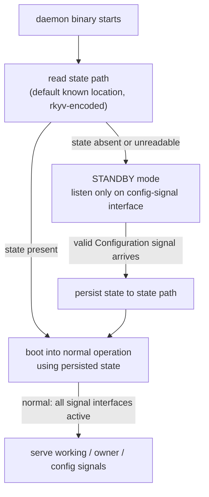
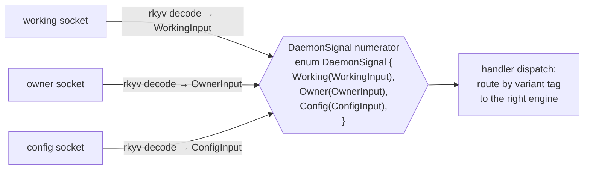

# 431 — Daemon goes zero-NOTA: state-aware startup + config-as-signal + multi-signal interfaces

*Kind: Architecture decision · Topics: daemon, zero-nota, binary-config, state-aware-startup, standby-mode, config-signal, multi-signal-interfaces, signal-routing, component-triad · 2026-05-30 · designer lane*

*Per psyche 2026-05-30 (resolves the open second slice of [[430-codec-opt-in-research-rkyv-base-nota-on-top]] §6 and operator's report 246 §"Daemon Configuration"). The daemon goes ALL-binary: not just protocol messages (records 1236-1238) but configuration too. Config delivery is a signal, not a CLI argument. The architectural generalization: daemons can have multiple signal interfaces, dispatched by a top-level enumeration the psyche named the **numerator**. Captured as Spirit record 1241 (Decision, Maximum).*

## 1. The decision in one paragraph

The daemon does NOT take a NOTA argument at startup. The daemon's binary closure
contains zero `nota_next` references. Startup is state-aware: the daemon reads
its **state path** (a rkyv-encoded state file at a known location). If state is
present, it boots into normal operation. If absent, it enters **standby mode**
— listening on a **config-signal interface** for someone to send config in;
once config arrives, the daemon persists state and continues into normal
operation. A daemon's full surface is a SET of signal interfaces, not one;
working signal + owner signal + config signal are distinct contracts dispatched
by the top-level enumeration.

## 2. State-aware startup — the two-mode boot



The daemon takes either ZERO arguments (state path inferred from environment /
known default) OR one rkyv path argument pointing to its state directory —
whichever fits the deploy story. **Critically, no NOTA argument anywhere.** The
state file's content is rkyv-encoded; the daemon's startup is a structural file
read, not a parse.

**Standby mode** means: the daemon is BOOTED but only the config-signal
interface accepts messages. Working signal and owner signal sockets either
don't bind yet, or accept connections but reject all operations with a typed
"not configured" reply. The simpler shape: only the config interface binds in
standby; the others bind after config arrives.

**State path**: a default location per component, e.g.
`~/.local/state/<component>/<version>/state.rkyv` (matching the existing
spirit-cli skill's daemon state directory pattern). The deploy module
(CriomOS-home for production, ad-hoc for dev) chooses what gets persisted
there.

## 3. Config delivery is a signal, not an argument

Config is delivered the same way operations are — through a signal interface.
This means:

- A new contract crate exists: `config-signal-<component>` (e.g.
  `config-signal-spirit-next`), with its own `Input`/`Output` types declaring
  config operations (`SetConfiguration`, `ReplaceConfiguration`,
  `GetConfiguration`, etc.).
- The daemon binds a config socket and listens on it during standby and during
  normal operation.
- Anyone with access to the config socket can send a config signal — at boot
  (initial config), at runtime (live reconfig).
- Authorization: probably owner-only — possibly the config interface IS a
  facet of the existing owner-signal protocol rather than a separate contract.

**Open structural call**: is `config-signal` its own contract crate alongside
the working signal + owner signal? OR is it folded into the existing
owner-signal protocol as additional operations (`SetConfiguration`, etc.)?

- **Separate config-signal crate**: cleaner separation, explicit contract per
  capability, easier to test in isolation. New triad leg: `config-signal-<component>`.
- **Folded into owner-signal**: fewer artifacts, fits the existing
  owner-only authorization story (config is naturally owner-level), no new
  socket. Recommended starting point — extend owner-signal first; split out
  only if config grows past owner-signal's scope.

This report uses "config interface" without locking in which shape; the
prototype can start with owner-signal extended.

## 4. Multi-signal interfaces — the architectural shift

A daemon currently has one PRIMARY signal interface (the working signal). The
component-triad already implies TWO contracts (signal + owner-signal). The
zero-NOTA decision generalizes this further: a daemon has a SET of signal
interfaces, each with its own contract crate, dispatched by the top-level
enumeration.



Each socket already produces its own typed value; the **numerator** is the
top-level enum that gives the daemon's full input space a single Rust type for
dispatch / pattern matching / testing. The numerator's variants are the
component's full set of signal-interface contracts.

For spirit-next:

```rust
// numerator — daemon's full signal input space (record 1241)
pub enum SpiritNextSignal {
    Working(signal_spirit_next::Input),
    Owner(owner_signal_spirit_next::Input),
    Config(config_signal_spirit_next::Input),   // or fold into Owner
}
```

The daemon's main loop selects across all bound sockets and dispatches into a
single handler that pattern-matches `SpiritNextSignal`. Each variant routes to
its engine (working engine, owner engine, config handler).

Naming: the user's spoken word was "numerator" (likely a transcription of
*enumerator* or *enumeration*) — taking it as a designed term that names the
sum-of-all-signal-interfaces enum unambiguously.

## 5. Crate layout for the prototype

```text
spirit-next workspace
├── crates/
│   ├── signal-spirit-next/         contract — working signal (schema-emitted)
│   │                                 feature `nota-text` opt-in (per 430/246)
│   ├── owner-signal-spirit-next/   contract — owner signal (schema-emitted)
│   │                                 feature `nota-text` opt-in
│   ├── (optional) config-signal-spirit-next/   contract — config signal
│   │                                 OR fold into owner-signal
│   ├── spirit-next-engine/         shared lib — Daemon, Nexus, Sema, state I/O
│   │                                 depends on the signal crates (no nota-text)
│   ├── spirit-next-daemon/         binary — depends on engine + signal crates
│   │                                 ZERO nota-next in closure
│   └── spirit-next-cli/            binary — depends on engine + signal crates
│                                     enables `nota-text` on signal crates
└── schema/                          .schema sources (input to emission)
```

This is the operator's 246 §"Cargo / Nix Reality" option 2 (multi-crate
package) made concrete, plus the multi-signal generalization.

## 6. The daemon's startup, in code shape

Sketch (not final API):

```rust
fn main() {
    let state_path = StatePath::default_for_component("spirit-next");
    let daemon = match Daemon::load_state(&state_path) {
        Ok(state) => Daemon::from_state(state),
        Err(StateLoadError::NotFound) => {
            let state = Daemon::standby_for_config(&state_path);
            state.persist_to(&state_path);
            Daemon::from_state(state)
        }
        Err(error) => exit_with(error),
    };
    daemon.run();
}
```

`standby_for_config` binds only the config socket, blocks on accepting one
valid Configuration, persists state, and returns. Then `from_state` opens the
working + owner sockets and runs the full engine.

No NOTA parsing anywhere in this path. No `Configuration::from_single_argument`
that takes a NOTA string. The `Configuration` type doesn't even need
`NotaDecode` — it's only ever rkyv-decoded from the state file or a config
signal frame.

## 7. Implications for the operator's 246 implementation order

246's order (1-5: schema-rust-next refactor + spirit-next split + Nix separate
artifacts) is the FIRST SLICE — wire derives feature-gated. This report
(431) is the SECOND SLICE that 246 §"Recommended Implementation Order" step 6
flagged: "move daemon config off NOTA". 431 specifies *how*:

1. Daemon binary stops taking a NOTA argument. State path becomes the input
   (env var or single positional rkyv path).
2. `Configuration::from_single_argument` is removed; `Configuration` keeps only
   the rkyv codec (no `NotaDecode` impl).
3. New contract: config signal (separate crate or owner-signal extension).
4. Daemon startup grows the state-aware boot + standby mode.
5. The numerator enum (or its dispatch equivalent) is defined in the engine
   crate; the daemon's main routes across all bound sockets.
6. Source guard test (per 246 §"Tests That Would Prove It" item 6) confirms
   `spirit-next-daemon`'s closure contains no `nota_next` reference.

The first slice (246 1-5) and the second slice (this report's 1-6) can run in
parallel by different subagents — the schema-rust-next refactor (slice 1
specific) and the spirit-next workspace layout (slice 2 specific) touch
different repos.

## 8. Open structural questions for the operator

1. **Config signal: own crate or owner-signal extension?** Recommend starting
   with owner-signal extension (smaller delta, fits owner-only authorization);
   split out if config grows.
2. **State path: env var, positional rkyv path, or hardcoded default?**
   Recommend hardcoded default per component (matching spirit-cli skill's
   `~/.local/state/persona-spirit/<version>/` pattern); env var override for
   tests / non-standard installs.
3. **Standby mode: which sockets bind?** Recommend only the config socket binds
   in standby; working and owner sockets bind after first successful Configuration
   signal. Simpler than "all bind but reject."
4. **Numerator name and home**: `SpiritNextSignal` in the engine crate? Or
   a generic `Signal<C>` in signal-frame? Recommend engine-crate-local per
   component; abstract upward if a pattern emerges.

## 9. The summary line

The daemon's input surface is a SET of signal interfaces, each with its own
rkyv contract, dispatched by a top-level numerator enum; one of those signal
interfaces is config; the daemon starts state-aware, with a standby mode that
listens only on the config interface until first-configured. Zero NOTA in the
daemon binary's closure — verifiable by `cargo tree` + source guard (per 246
§"Tests That Would Prove It"). Codec opt-in (430/246) is the first slice;
this report (431) is the second.
