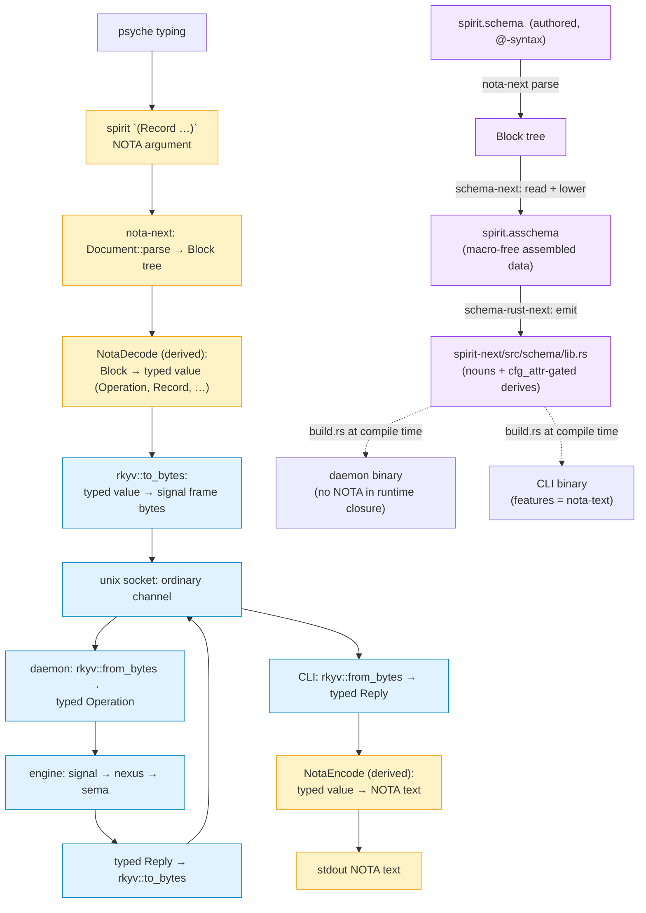

# 433 — The whole stack, comprehensively: every part, all the syntax, end-to-end with code

*Kind: Comprehensive walkthrough · Topics: nota, schema, assembled-schema, emission, nota-surface, spirit-next, daemon, cli, signal-frame, rkyv, nix, intent-loop · 2026-05-30 · designer lane*

*The whole NOTA/schema/Spirit stack as it stands on main today, every piece
named with actual code from the live repos. Synthesizes records 1109, 1116,
1119, 1120, 1122, 1126–1130, 1137, 1152, 1155, 1176, 1178, 1180, 1184, 1185,
1199, 1202, 1211, 1216, 1226, 1229, 1232, 1235, 1236–1238, 1241. Supersedes
[[429-whole-stack-presentation-nota-to-spirit]] (which predated the @Type
shorthand, the newtype model, the NotaSurface opt-in, the operator's
single-crate + required-features integration, the runtime proofs landing on
main, and the slice-2 prototype). Reads top-to-bottom; section 1 is the
one-screen overview, sections 2-9 are each layer with code, section 10 is
the deferred slice-2 frontier.*

## 1. One picture — the whole stack as it runs today



Four layers — one codec, one data model — round-tripping through three forms:
**NOTA text ⇄ Rust value ⇄ rkyv bytes**. The orange path is text (only at
client edges, never on the wire); the blue path is rkyv (always on the wire);
the purple is compile-time codegen (the schema-emitted module landed in the
crate before runtime).

## 2. NOTA — the data notation (substrate)

### 2a. Delimiters carry structure; meaning is positional

```text
delimiter        structural form
---------        ---------------
[ … ]            vector value · OR string at a String position
{ … }            key-value map · OR struct body
( … )            positional record · first token = tag, rest = positional fields
[| … |]          block string (multi-line, may contain bare [ ])
```

The same `[ … ]` is a vector at a vector position and a string at a `String`
position — meaning comes from the expected type at the position (records
1127, 1128). NOTA itself is structure; the type vocabulary is Schema's.

### 2b. Strings come **exclusively** from brackets

```text
[content]                inline string (`Topic`, `recordIdentifier`)
[|multi-line content|]   block string, safe for `(` `)` `[` `]` `{` `}` and newlines
bare camelCase or kebab  bare token at a String position
```

NOTA contains zero quotation marks. The property that falls out: a complete
NOTA expression embeds escape-free in any double-quoted host — shell, JSON,
Rust strings, TOML, a database column.

### 2c. The codec — `NotaEncode`, `NotaDecode`, `NotaTransparent`, the derive

```rust
// nota-next/src/codec.rs (the shared codec — ONE trait pair for everything)
pub trait NotaDecode: Sized {
    fn from_nota_block(block: &Block) -> Result<Self, NotaDecodeError>;
}
pub trait NotaEncode {
    fn to_nota(&self) -> String;
}

// nota-next/derive — proc-macro crate
// #[derive(NotaDecode, NotaEncode)] for multi-field records and enums
// #[derive(NotaTransparent)] for newtypes (tuple-structs wrap a single value)
```

The derive generates `impl NotaDecode for T` and `impl NotaEncode for T`. The
codec is the shared layer used by hand-written types, schema-emitted types,
and the assembled-schema's own `Asschema` type.

### 2d. Worked example — a NOTA record round-tripping

NOTA text → typed Rust value → NOTA text:

```nota
([workspace observation] Decision [|the daemon takes a binary configuration path, not a NOTA string|] Maximum)
```

```rust
// somewhere in a consumer crate that wants to read intent records:
#[derive(NotaDecode, NotaEncode, rkyv::Archive, rkyv::Serialize, rkyv::Deserialize, Clone, Debug, Eq, PartialEq)]
pub struct Record {
    pub topics: Vec<Topic>,
    pub kind: Kind,
    pub description: Description,
    pub magnitude: Magnitude,
}

let value = Record::from_nota_block(&Block::parse(source)?)?;
let back  = value.to_nota();   // round-trips to the same text
```

`(Tag positional1 positional2 ...)` is the universal NOTA record shape;
records are positional (record 1226 holds for surface — "struct is a
key-value map" at *named* positions; here the variant tag + positional
fields).

## 3. Schema syntax — every form

### 3a. The `@`-sigil binder

`@` binds a name to a shape. The shape is the delimiter (or bare type) right
after `@`.

```text
form                      shape
----                      -----
Name@{ … }                struct      ({ } = brace, named fields)
Name@{ Type }             newtype     (single-element brace, record 1235)
Name@Type                 newtype     (short form, same as Name@{ Type })
Name@[ … ]                enum        ([ ] = bracket, variants)
Name@(Vec X)              named composite alias  (( ) = composite/macro)
```

`{ }` is struct (named fields), `[ ]` is enum (variants), `( )` is the
composite/macro-call form — no overload across delimiters (record 1211).

### 3b. The full form table — declarations, fields, variants, with derived-name shorthand (record 1232)

```text
TOP-LEVEL declarations:
Name@{ field@Type  field@Type  … }    multi-field struct (key-value map per 1226)
Name@{ Type }                         newtype (record 1235)
Name@Type                             newtype (short form for Name@{ Type })
Name@[ Variant  Variant  … ]          enum
Name@(Vec X)                          named composite alias

WITHIN a struct (`Name@{ … }`):
field@Type                            field — explicit name, typed
@Type                                 field — name DERIVED from type (1232; @Topics ≡ topics@Topics)
field@(Vec X)  /  @(Vec X)            field — composite, explicit or derived (record 1119)

WITHIN an enum (`Name@[ … ]`):
VariantName                           unit variant (bare PascalCase)
VariantName@Type                      data variant — explicit name, held type
@Type                                 data variant — name = held type (1232; @Foo ≡ Foo@Foo)
```

### 3c. The root struct — positional fields, bare values (record 1229)

A `.schema` file's root is an implicit struct with **four positional fields**
known from the schema-of-schemas: `imports`, `input`, `output`, `namespace`.
The body is those four values **bare**, NOT named with `Name@`.

```nota
; spirit.schema → root is the implicit `Spirit` struct
{}                                                ; positional imports
[ Record@Entry  Observe@Query ]                   ; positional input — signal-plane variants
[ Recorded@Receipt  Observed@RecordSet ]          ; positional output
{                                                 ; positional namespace
  Topic@String
  Kind@[ Decision Principle Correction ]
  Entry@{ @Topics  @Kind  @Description }          ; @Type shorthand
  NexusInput@[ Signal@Input  Sema@SemaOutput ]    ; additional plane root — DECLARATION inside namespace
}
```

The `Name@Delimiter` rule applies to DECLARATIONS (where the user invents a
name). Positional values at the four known root-struct fields stay bare —
they're values, not declarations.

### 3d. Visibility — `(Public Name Value)` / `(Private Name Value)` (record 1226)

In the surface, **top-level declarations are public, inline PascalCase types
are private/local** (positional default).

```nota
; surface — Entry is public (top-level); Receipt is private/local (inline)
Entry@{ Receipt@{ @RecordIdentifier @String } later@Receipt }

; assembled — visibility tagged explicitly
(Public Entry (Struct { receipt Receipt  later Receipt }))
(Private Receipt (Struct { recordIdentifier RecordIdentifier  string String }))
```

`Public` declarations are exported (the schema-as-library); `Private`
declarations are module-local (emitted as `pub(crate)` in Rust). When a
public struct references a private inline type, its referencing field is
narrowed to `pub(crate)` so the private noun cannot leak through.

### 3e. Worked example — spirit.schema in full, with every form

```nota
{}                                                                 ; imports (positional, empty)
[ Record@Entry  Observe@Query  Remove@RecordIdentifier ]           ; input (positional, signal-plane variants)
[ RecordAccepted@SemaReceipt  Error@ErrorReport ]                  ; output (positional)
{                                                                  ; namespace (positional)

  ; newtypes — single-element brace, or short form
  Topic@String                                                     ; Topic@String ≡ Topic@{ String }
  Topics@(Vec Topic)                                               ; newtype around a composite
  Description@String
  RecordIdentifier@Integer

  ; enums — variants in brackets
  Kind@[ Decision Principle Correction Clarification Constraint ]
  Magnitude@[ Zero Minimum VeryLow Low Medium High VeryHigh Maximum ]

  ; multi-field structs with @Type shorthand
  Entry@{ @Topics  @Kind  @Description  @Magnitude }
  Query@{ @Topics  limit@(Optional Integer) }                       ; explicit composite needs explicit name
  RecordSet@{ records@(Vec Entry)  byTopic@(Map Topic RecordIdentifier) }

  ; additional plane roots declared in namespace (Name@ because they're declarations)
  NexusInput@[ Signal@Input  Sema@SemaOutput ]
  SemaInput@[ Record@Entry  Observe@Query ]
}
```

## 4. The assembled model — macro-free data

### 4a. `Asschema` — the type table + roots + identity + imports

```rust
// schema-next/src/asschema.rs
pub struct Asschema {
    identity: SchemaIdentity,
    imports: Vec<ImportDeclaration>,
    roots: Vec<RootDeclaration>,
    namespace: Vec<Declaration>,
}

// (Public Name Value) / (Private Name Value) — data-carrying variant per record 1226
pub enum Declaration { Public(Name, TypeValue), Private(Name, TypeValue) }

// three TypeValue variants, distinct, each canonically tagged in NOTA
pub enum TypeValue {
    Newtype(TypeReference),                  // (Newtype X) — record 1235
    Struct(StructFieldMap),                  // (Struct { name Type … }) — record 1226
    Enum(Vec<Variant>),                      // (Enum [ … ])
}

pub enum TypeReference {
    String, Integer, Boolean, Path,          // scalar built-ins (record 1152)
    Plain(Name),                             // a declared type: Topic, Entry, …
    Vector(Box<TypeReference>),
    Optional(Box<TypeReference>),
    Map(Box<TypeReference>, Box<TypeReference>),
}
```

### 4b. NOTA encoding — explicit `TypeValue` variant tags

```nota
; spirit.asschema — canonical tagged form (record 1235 + 1226)
([example:spirit] [0.1.0]) []
[ (RootEnum Input [ (Record (Plain Entry)) (Observe (Plain Query)) ]) (RootEnum Output [ … ]) ]
[ (Public Topic     (Newtype String))                                                                                ; TypeValue::Newtype
  (Public Topics    (Newtype (Vector (Plain Topic))))                                                                ; Newtype wrapping a composite
  (Public Kind      (Enum [ Decision Principle Correction Clarification Constraint ]))                               ; TypeValue::Enum
  (Public Entry     (Struct { topics (Plain Topics)  kind (Plain Kind)  description (Plain Description) }))          ; TypeValue::Struct (key-value map)
  (Public RecordSet (Struct { records (Vector (Plain Entry))  byTopic (Map [(Plain Topic) (Plain RecordIdentifier)]) })) ]
```

Three TypeValue variants — `(Newtype X)`, `(Struct { … })`, `(Enum [ … ])` —
all tagged with the variant name at the head, NOTA-canonical enum encoding.
Disambiguation is by tag, not by brace shape.

### 4c. Surface-to-assembled lowering, by example

```mermaid
flowchart LR
  a["Entry@{ @Topics  @Kind  @Description }"] -->|@Type derive (1232)| b["TypeValue::Struct([<br/>  ('topics', Plain('Topics')),<br/>  ('kind', Plain('Kind')),<br/>  ('description', Plain('Description')),<br/>])"]
  c["Kind@[ Decision Correction ]"] -->|enum lower| d["TypeValue::Enum([Decision, Correction])"]
  e["Topic@String  /  Topic@{ String }"] -->|newtype lower (1235)| f["TypeValue::Newtype(String)"]
  g["@SomeEnum  (in enum body)"] -->|@Type derive (1232)| h["Variant { name: 'SomeEnum', payload: Some(Plain('SomeEnum')) }"]
  i["[ Record@Entry … ]  at root input slot"] -->|positional (1229)| j["RootDeclaration::Input(variants)<br/>name from POSITION"]
```

## 5. Emission — three NotaSurface modes

### 5a. The `NotaSurface` API on `schema-rust-next` (live on main since `e7dd92fe`)

```rust
// schema-rust-next/src/lib.rs
pub enum NotaSurface {
    Disabled,                                  // zero nota_next anywhere
    FeatureGated { feature: String },          // cfg_attr the derives + impls under the feature
    AlwaysEnabled,                             // derives + impls present unconditionally
}

pub struct RustEmissionOptions {
    pub nota_surface: NotaSurface,
}

impl Default for RustEmissionOptions {
    fn default() -> Self {
        // 540d39fe: the polish default — rkyv-universal, NOTA opt-in via feature
        Self::feature_gated_nota("nota-text")
    }
}

impl RustEmitter {
    pub fn new(options: RustEmissionOptions) -> Self { /* ... */ }
}
```

### 5b. The same type emitted three ways (side-by-side)

```rust
// NotaSurface::AlwaysEnabled — every type, no feature gate
#[derive(nota_next::NotaDecode, nota_next::NotaEncode, rkyv::Archive, rkyv::Serialize, rkyv::Deserialize, Clone, Debug, PartialEq, Eq)]
pub struct Entry { pub topics: Topics, pub kind: Kind, pub description: Description, pub magnitude: Magnitude }

// NotaSurface::FeatureGated { "nota-text" } — DEFAULT for spirit-next today
#[cfg_attr(feature = "nota-text", derive(nota_next::NotaDecode, nota_next::NotaEncode))]
#[derive(rkyv::Archive, rkyv::Serialize, rkyv::Deserialize, Clone, Debug, PartialEq, Eq)]
pub struct Entry { pub topics: Topics, pub kind: Kind, pub description: Description, pub magnitude: Magnitude }

#[cfg(feature = "nota-text")]
impl std::str::FromStr for Entry { type Err = nota_next::NotaDecodeError; /* ... */ }
#[cfg(feature = "nota-text")]
impl std::fmt::Display for Entry { /* uses NotaEncode */ }

// NotaSurface::Disabled — daemon-shape; zero nota_next references
#[derive(rkyv::Archive, rkyv::Serialize, rkyv::Deserialize, Clone, Debug, PartialEq, Eq)]
pub struct Entry { pub topics: Topics, pub kind: Kind, pub description: Description, pub magnitude: Magnitude }
// no FromStr / Display / NotaDecode / NotaEncode / from_nota_block / to_nota anywhere
```

The Disabled-mode snapshot lives at
`schema-rust-next/tests/fixtures/spirit_generated_binary_only.rs` (517 lines),
checked into the repo as a byte-deterministic proof: emit + diff against the
fixture confirms the binary-only path has zero NOTA surface (per operator
246 §"Tests That Would Prove It" item 1).

## 6. The wire — rkyv signal frames

The daemon socket carries **length-prefixed rkyv signal frames**, never NOTA
text. Every wire type derives `rkyv::Archive` regardless of NOTA mode — rkyv
is the universal wire base (record 1237).

```rust
// schema-rust-next emits these inherent methods on root enums
impl Input {
    pub fn encode_signal_frame(&self) -> Vec<u8> {
        let archive = rkyv::to_bytes::<rkyv::rancor::Error>(self).expect("rkyv serialize");
        let mut frame = Vec::with_capacity(SIGNAL_SHORT_HEADER_BYTE_COUNT + archive.len());
        frame.extend_from_slice(&ShortHeader::for_input(self).to_bytes());
        frame.extend_from_slice(&archive);
        frame
    }

    pub fn decode_signal_frame(frame: &[u8]) -> Result<Self, SignalDecodeError> {
        rkyv::from_bytes::<Self, rkyv::rancor::Error>(&frame[SIGNAL_SHORT_HEADER_BYTE_COUNT..])
            .map_err(SignalDecodeError::Rkyv)
    }
}
```

NOTA bytes cannot pass as a signal frame:

```rust
// spirit-next/tests/socket_negative.rs — the runtime proof (operator 917fd184)
#[test]
fn transport_rejects_length_prefixed_raw_nota_text() {
    let nota = b"(Record ([[socket-negative]] Decision [text must not be daemon wire] Maximum))";
    let bytes = LengthPrefixedFrame::new(nota).to_bytes();
    let mut transport = SignalTransport::new(Cursor::new(bytes));
    assert!(transport.read_input().is_err(),
        "daemon wire transport must reject length-prefixed raw NOTA bytes");
}
```

The reject is structural: rkyv archive layout cannot coincide with a
parseable NOTA byte sequence. The proof is in CI now, not just in
documentation.

## 7. Spirit-next — the running component (live on main)

### 7a. Single-crate + `required-features` (operator's integration)

```toml
# spirit-next/Cargo.toml — live on main

[[bin]]
name = "spirit-next"
path = "src/bin/spirit-next.rs"
required-features = ["nota-text"]            # CLI requires the feature; daemon does not

[[bin]]
name = "spirit-next-daemon"
path = "src/bin/spirit-next-daemon.rs"        # no required-features

[[test]]
name = "nix_integration"
path = "tests/nix_integration.rs"
required-features = ["nota-text"]

[features]
default     = []                              # explicit opt-in per psyche framing (rkyv-universal, NOTA opt-in)
nota-text   = ["dep:nota-next"]

[dependencies]
nota-next   = { git = "...", branch = "main", optional = true }
rkyv        = { version = "0.8", default-features = false, features = ["std", "bytecheck", "little_endian", "pointer_width_32", "unaligned"] }
redb        = "2.6.3"
blake3      = "1"
```

The single-crate-with-`required-features` shape is the operator's chosen
mechanism (per 246 §"Cargo / Nix Reality" option 1). Within one crate, both
binaries share a feature set under `cargo build`, but each Nix derivation
runs its own `cargo build` invocation with the right `--features` /
`--no-default-features` flag — so features don't unify across them.

### 7b. Daemon binary — takes a binary `Configuration` path (live on main)

```rust
// spirit-next/src/bin/spirit-next-daemon.rs (8cbc4d67) — zero NOTA
use std::env;
use spirit_next::{Configuration, Daemon};

fn main() {
    if let Err(error) = SpiritNextDaemonCli::from_environment().run() {
        eprintln!("spirit-next-daemon: {error}");
        std::process::exit(1);
    }
}

impl SpiritNextDaemonCli {
    fn run(&self) -> Result<(), Box<dyn std::error::Error>> {
        let configuration = Configuration::from_single_argument(self.single_argument()?)?;
        Daemon::new(configuration).run()?;
        Ok(())
    }
    // single_argument() returns "exactly one binary configuration path" — not a NOTA string
}
```

```rust
// spirit-next/src/config.rs — explicitly no nota_next imports
/// The daemon intentionally does not decode NOTA at startup. Text-facing
/// launchers or tests can produce this binary object, but the daemon itself
/// only receives the binary configuration path.
#[derive(rkyv::Archive, rkyv::Serialize, rkyv::Deserialize, Clone, Debug, Eq, PartialEq)]
pub struct Configuration {
    socket_path: ConfigurationPath,
    database_path: ConfigurationPath,
}

impl Configuration {
    pub fn from_binary_file(path: impl AsRef<Path>) -> Result<Self, ConfigurationError> {
        let bytes = fs::read(path).map_err(ConfigurationError::Read)?;
        Self::from_binary_bytes(&bytes)
    }
}
```

Zero `nota_next::*` imports in `src/config.rs`. Proven structurally by the
dependency_surface test (§7e below).

### 7c. CLI binary — NOTA → rkyv → daemon → rkyv → NOTA

```rust
// spirit-next/src/bin/spirit-next.rs — requires nota-text feature
use spirit_next::{Input, SignalTransport};

impl SpiritNextCli {
    fn run(&self) -> Result<(), Box<dyn std::error::Error>> {
        let argument = self.single_argument()?;
        let source   = self.read_single_argument(argument)?;
        let input    = source.parse::<Input>()?;                  // FromStr → NotaDecode (gated)
        let socket   = env::var("SPIRIT_NEXT_SOCKET")?;
        let (_route, output) = SignalTransport::connect(socket)?.exchange(&input)?;  // rkyv frames
        println!("{output}");                                     // Display → NotaEncode (gated)
        Ok(())
    }
}
```

CLI: `source.parse::<Input>()` decodes NOTA via the schema-emitted `FromStr`
(gated under `nota-text`). `SignalTransport::exchange` writes the rkyv frame
to the daemon socket and reads the rkyv reply. `println!("{output}")`
renders via Display → `NotaEncode::to_nota`.

### 7d. Nix dual-derivation build (live on main)

```nix
# spirit-next/flake.nix (excerpt) — operator's dual-build with feature isolation
daemonPackage = craneLib.buildPackage (commonArguments // {
  cargoExtraArgs = "--no-default-features --bin spirit-next-daemon";
});
cliPackage = craneLib.buildPackage (commonArguments // {
  cargoExtraArgs = "--features nota-text --bin spirit-next";
});
combinedPackage = pkgs.runCommand "spirit-next" { } ''
  mkdir -p $out/bin
  cp ${daemonPackage}/bin/spirit-next-daemon $out/bin/
  cp ${cliPackage}/bin/spirit-next $out/bin/
'';

# Plus separate test derivations for each feature configuration:
test          = craneLib.cargoTest (commonArguments // { cargoExtraArgs = "--no-default-features"; });
test-nota-text = craneLib.cargoTest (commonArguments // { cargoExtraArgs = "--features nota-text"; });
```

Each derivation is an independent `cargo build` — features cannot unify
across them. Nix is the production gate for the feature split.

### 7e. The two runtime proofs on main (operator 917fd184)

```rust
// spirit-next/tests/dependency_surface.rs — runs cargo tree, structural proof
#[test]
fn binary_only_surface_has_no_nota_next_runtime_dependency() {
    let manifest = WorkspaceManifest::from_environment();
    let tree = manifest.cargo_tree(&["--edges", "normal", "--no-default-features"]);
    assert!(
        !tree.contains("nota-next") && !tree.contains("nota_next"),
        "binary-only runtime dependency tree must not contain nota-next:\n{tree}"
    );
}
```

```rust
// spirit-next/tests/socket_negative.rs — runtime contract proof
#[test]
fn transport_rejects_length_prefixed_raw_nota_text() {
    let nota = b"(Record ([[socket-negative]] Decision [text must not be daemon wire] Maximum))";
    /* SignalTransport must reject these bytes — the wire is rkyv only */
}

#[test]
fn transport_rejects_length_prefixed_garbage_bytes() { /* arbitrary zeros also reject */ }

#[test]
fn input_decode_signal_frame_rejects_raw_nota() { /* direct decode_signal_frame on NOTA → Err */ }
```

Two PROOFS of the architecture's contract claims, in CI, on main today.

## 8. Spirit — the intent loop CLI

```mermaid
flowchart LR
  agent[agent / psyche] -->|spirit `(Record …)`| spiritCli[spirit CLI]
  spiritCli -->|NotaDecode Operation| spiritOp[typed Operation]
  spiritOp -->|rkyv frame| spiritSock[ordinary socket]
  spiritSock --> spiritDaemon[persona-spirit-daemon]
  spiritDaemon -->|engine| redb[(redb store)]
  spiritDaemon -->|rkyv frame| spiritSock
  spiritSock --> spiritCli
  spiritCli -->|NotaEncode Reply| stdout[(RecordAccepted N)]
```

### 8a. The three operations (Spirit 0.3.0 wire shape)

```sh
# Record — capture intent
spirit "(Record ([topic1 topic2] Kind [description] Magnitude))"
# → (RecordAccepted N)

# Observe — query
spirit "(Observe (Records ((Partial [nota schema]) None Any SummaryOnly)))"
spirit "(Observe (RecordIdentifiers ((Range (1230 1240)) WithProvenance)))"

# Remove — delete by id
spirit "(Remove 1240)"
# → (RecordRemoved 1240)
```

### 8b. The agent capture discipline

Per workspace AGENTS.md "Capture intent through Spirit FIRST": every psyche
prompt is scanned for intent statements (Decision / Principle / Correction /
Clarification / Constraint), and each captured through the deployed CLI
before any other work. This thread alone landed 1230, 1232, 1235, 1238,
1241 (and operator-side 1236, 1237) by that discipline.

## 9. End-to-end roundtrip — every step traced

Putting all the layers together with a concrete invocation:

```sh
# Step 0 — psyche types
spirit-next "(Observe (Records ((Partial [schema]) None Any SummaryOnly)))"

# Step 1 — CLI binary reads the argument
let source = read_single_argument(argument)?;
# source: "(Observe (Records ((Partial [schema]) None Any SummaryOnly)))"

# Step 2 — NotaSource parses NOTA, decodes into Input
let input = source.parse::<Input>()?;
# Input::Observe(Query { topics: Topics(vec![Topic("schema")]), limit: None })
# (uses NotaDecode under `nota-text` feature — CLI has it; daemon doesn't)

# Step 3 — CLI opens socket, encodes signal frame
let frame = input.encode_signal_frame();
# Vec<u8> = [short-header | rkyv-archived Input bytes]

# Step 4 — frame travels over unix socket → daemon
socket.write_all(&frame)?;

# Step 5 — daemon reads frame, decodes
let input = Input::decode_signal_frame(&frame)?;
# typed Input::Observe(...) — daemon never touches NOTA

# Step 6 — daemon engine processes
let output = engine.handle(input);
# Output::Observed(RecordSet { ... })

# Step 7 — daemon encodes reply
let reply_frame = output.encode_signal_frame();
socket.write_all(&reply_frame)?;

# Step 8 — CLI reads reply, decodes
let output = Output::decode_signal_frame(&reply_frame)?;

# Step 9 — CLI renders as NOTA text and prints
println!("{output}");
# stdout: "(Observed (RecordSet { records [...] byTopic { ... } }))"
```

Every signal frame on the wire is rkyv. Every text touchpoint is NOTA. The
daemon's binary closure has zero `nota_next`. The CLI's compile units
(activated under `nota-text`) carry the full NOTA codec.

## 10. The frontier — slice 2 architecture (designed, prototyped, not yet on main)

What's on main now: codec opt-in + binary-config-path daemon + runtime proofs.
What's prototyped on `~/wt/github.com/LiGoldragon/spirit-next/daemon-zero-nota-2026-05-30`
but deferred per operator's coordinated-migration discipline:

```text
spirit-next workspace (prototype shape)
├── crates/
│   ├── signal-spirit-next/         working-signal contract (cfg feature "nota-text")
│   ├── owner-signal-spirit-next/   owner contract WITH config ops folded in
│   │                                 SetConfiguration / ReplaceConfiguration / GetConfiguration
│   ├── spirit-next-engine/         shared lib — Daemon, Engine, Nexus, Store, state I/O,
│   │                                 the numerator (SpiritNextSignal enum)
│   ├── spirit-next-daemon/         binary — zero NOTA, no required-features dance
│   └── spirit-next-cli/            binary — enables nota-text
```

```rust
// the numerator (record 1241) — daemon's full signal input space, one enum
pub enum SpiritNextSignal {
    Working(signal_spirit_next::Input),
    Owner(owner_signal_spirit_next::Input),       // includes config ops
    // Config(config_signal_...) if config grows past owner's scope
}
```

```rust
// state-aware startup (sketch)
fn main() {
    let state_path = StatePath::default_for_component("spirit-next");
    let daemon = match Daemon::load_state(&state_path) {
        Ok(state) => Daemon::from_state(state),
        Err(StateLoadError::NotFound) => {
            let state = Daemon::standby_for_config(&state_path);     // bind only config socket
            state.persist_to(&state_path);                            // first SetConfiguration arrives
            Daemon::from_state(state)
        }
        Err(error) => exit_with(error),
    };
    daemon.run();
}
```

Slice 2 = workspace split + state-aware startup + standby + config-as-signal
+ numerator, landing as a coordinated migration that preserves the Nix proof
harness alongside the structural reshape. The prototype branch has 13 tests
passing including state-aware-startup (4) + standby roundtrip (3); the
operator's plan is to migrate the harness in lockstep.

## 11. The one-line summary

A schema is NOTA; the `@`-sigil + delimiter + derived-name shorthand
authoring drops to a tagged macro-free assembled model with `Newtype` /
`Struct` / `Enum` variants and `Public` / `Private` visibility; the
schema-rust-next emitter takes a `NotaSurface` choice — `Disabled` for
binary-only consumers, `FeatureGated { "nota-text" }` for double clients —
producing types whose rkyv impls are unconditional and whose NOTA impls are
cfg-gated; spirit-next compiles those types under one `Cargo.toml` with
`required-features` annotations per binary, so the daemon binary's runtime
closure has zero `nota-next` (`dependency_surface.rs` proves it) and the
daemon socket rejects NOTA bytes structurally (`socket_negative.rs` proves
it); CLI parses NOTA → rkyv frame → daemon engine over redb → rkyv reply →
NOTA stdout; Nix builds daemon and CLI as separate derivations and joins
them — features cannot leak across the build boundary. Everything is data,
every layer round-trips, every architectural promise is an executable claim
in CI.
