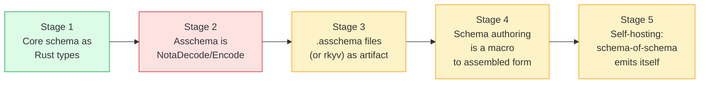
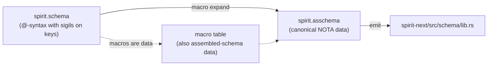
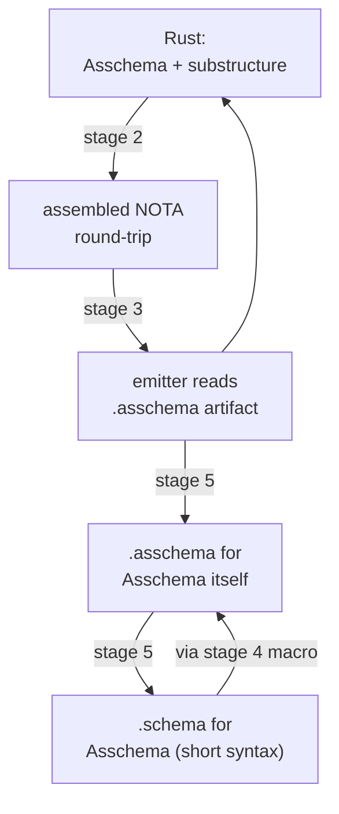

# 434 — Live assembled schema: the bootstrap order, the missing link, the loop closure

*Kind: Architecture decision · Topics: assembled-schema, bootstrap, macros-as-data, nota-decode, self-hosting, schema-of-schema, schema-as-macro, choice-enum, live-artifact, emission-source · 2026-05-30 · designer lane*

*The biggest remaining "everything is data" gap. Per psyche 2026-05-30 in
response to operator 248 §Gap 1: the assembled schema must become a LIVE
serializable artifact — NotaDecode + NotaEncode + rkyv on `Asschema` and its
substructure — not just an in-memory typed Rust value. Captured as Spirit
record 1246 (Decision, Maximum). Reinforces records 1109 (everything is
data, macros included), 1116 (define the assembled schema first), 1184 (one
shared codec). Resolves the architectural blocker named in operator 248
§Gap 1 and 246 §"Recommended Implementation Order".*

## 1. The architectural insight named

The current path is:

```text
.schema (text) → schema-next lower → Asschema (in-memory Rust value) → schema-rust-next emit → Rust code
```

The architectural truth is that this is **wrong-shaped because the emitter
should consume the SERIALIZED assembled form, not the in-memory Rust value**:

```text
.schema (text) → schema-next lower → Asschema (in-memory)
                                  ↓
                       NOTA-serialize / rkyv-archive
                                  ↓
                       .asschema (NOTA file) ⇄ rkyv bytes
                                  ↓
                  schema-rust-next emit (reads serialized form)
                                  ↓
                              Rust code
```

Until the assembled schema can ROUND-TRIP through its own NOTA representation,
it isn't really a data artifact — it's a private intermediate the in-process
emitter happens to share with the in-process lowering. Record 1109 (everything
is data) is unsatisfied; the bootstrap chain doesn't reach the substrate it
should.

## 2. The bootstrap order — five stages



| stage | content | status |
| --- | --- | --- |
| 1 | Core schema types in Rust: `Asschema`, `Declaration`, `TypeDeclaration`, `TypeReference`, `StructDeclaration`, `EnumDeclaration`, `NewtypeDeclaration`, etc. | **DONE** (live in schema-next) |
| 2 | `Asschema` and every substructure derives `NotaDecode` + `NotaEncode` + `rkyv::Archive`; a `.asschema` NOTA file round-trips: file → parse → typed value → emit → file | **MISSING — THE BLOCKING LINK** |
| 3 | A `.asschema` NOTA artifact exists per schema source — either checked-in alongside `.schema` or build-time-emitted + cached. Emitter reads the serialized form (file or rkyv bytes); not the in-memory Rust value directly | TODO (unblocked once stage 2 lands) |
| 4 | Schema authoring language is a MACRO that expands to assembled-schema data. Currently true in shape (lowering produces `Asschema`); becomes true in DATA once stages 2-3 land | partially true; full only after 2-3 |
| 5 | Self-hosting: emit the schema-of-schema's own assembled form, then its short-syntax form. The schema describes itself end-to-end | future, unblocked once stages 2-4 close |

The whole architecture turns on **stage 2** — make the in-memory assembled
schema be a real data artifact. Everything downstream unblocks.

## 3. Stage 2 — the missing link in detail

The stage-2 work is concrete: add the NOTA codec + rkyv derives to every
assembled-schema Rust type. The shapes are already settled (records 1226 +
1235 for visibility-tagged + struct-as-key-value + newtype tagging).

```rust
// schema-next/src/asschema.rs — proposed derive set after stage 2 lands

#[derive(NotaDecode, NotaEncode, rkyv::Archive, rkyv::Serialize, rkyv::Deserialize,
         Clone, Debug, Eq, PartialEq)]
pub struct Asschema {
    pub identity: SchemaIdentity,
    pub imports: Vec<ImportDeclaration>,
    pub roots: Vec<RootDeclaration>,
    pub namespace: Vec<Declaration>,
}

#[derive(NotaDecode, NotaEncode, rkyv::Archive, rkyv::Serialize, rkyv::Deserialize,
         Clone, Debug, Eq, PartialEq)]
pub struct Declaration {
    pub visibility: Visibility,
    pub name: Name,
    pub value: TypeDeclaration,
}

// (Public Topic (Newtype String)) lowers as:
//   Declaration { visibility: Public, name: "Topic", value: Newtype(Newtype { reference: String }) }
#[derive(NotaDecode, NotaEncode, rkyv::Archive, …)]
pub enum TypeDeclaration {
    Struct(StructDeclaration),
    Enum(EnumDeclaration),
    Newtype(NewtypeDeclaration),
}
```

A canonical assembled-schema file becomes a real artifact:

```nota
; spirit.asschema — live data on disk
([example:spirit] [0.1.0]) []
[ (RootEnum Input [ (Record (Plain Entry)) (Observe (Plain Query)) ]) (RootEnum Output [ … ]) ]
[ (Public Topic     (Newtype String))
  (Public Topics    (Newtype (Vector (Plain Topic))))
  (Public Kind      (Enum [ Decision Principle Correction Clarification Constraint ]))
  (Public Entry     (Struct { topics (Plain Topics)  kind (Plain Kind) … })) ]
```

That file can be parsed by `nota-next`, decoded by `Asschema::from_nota_block`,
re-emitted by `Asschema::to_nota`, archived by rkyv, and shared between
processes — exactly the same status as any other data type in the stack.

**Acceptance for stage 2** (the operator's bar to hit):

1. `Asschema` and every substructure derive `NotaDecode` + `NotaEncode`.
2. A real `.asschema` fixture parses + round-trips: `read_to_string → parse →
   from_nota_block → to_nota → assert_eq!(text, original)`.
3. The same `.asschema` rkyv-roundtrips: `to_bytes → from_bytes →
   assert_eq!`.
4. `schema-next/tests/fixtures/spirit.asschema` is the checked-in golden;
   `schema-next/tests/fixtures/spirit.schema` lowers to it (existing
   lowering test compares textual goldens).

## 4. Stage 3 — emitter reads the artifact

Once stage 2 lands, the emitter's input becomes the SERIALIZED form. Two
shapes work:

```rust
// (a) consumer-crate build.rs emits .asschema, then schema-rust-next reads it
let asschema_text = fs::read_to_string("spirit.asschema")?;
let asschema = Asschema::from_nota_block(&Document::parse(&asschema_text)?)?;
RustEmitter::new(options).emit_file(&asschema)

// (b) the rkyv form: emit .asschema.rkyv (smaller, faster), read at build time
let asschema_bytes = fs::read("spirit.asschema.rkyv")?;
let asschema: Asschema = rkyv::from_bytes(&asschema_bytes)?;
RustEmitter::new(options).emit_file(&asschema)
```

The .asschema artifact is now **shareable across processes** (CriomOS-home
modules can read it without re-lowering from .schema), **diff-able in version
control** (changes to the schema show as diffs to the assembled form), and
**inspectable by hand** (NOTA text is human-readable).

## 5. Stage 4 — schema authoring IS a macro

The schema authoring language (the `@`-sigil forms, derived-name shorthand,
newtype short form) is a MACRO that expands to assembled-schema data:



The user's framing: the schema's brace position has **keys as overloaded
strings** carrying name + type-ref + sigil-modifier info compactly:

```text
{ @Topics  @Kind  field@Type  field@(Vec X)  Inline@{ … } }

key shapes inside the brace:
  @Type                    sigil-only — value derived from type (record 1232)
  field@Type               name + sigil + type
  field@(Composite …)      name + sigil + composite-call
  Inline@{ … }             inline private type declaration (record 1226)
```

Each of these is a MACRO INVOCATION that expands to a specific assembled-schema
shape:

```text
@Topics                       → (Field topics (Plain Topics))
field@Type                    → (Field field (Plain Type))
field@(Vec X)                 → (Field field (Vector (Plain X)))
Inline@{ … }                  → adjacent (Private Inline (Struct { … })) declaration
                                + (Field inline (Plain Inline)) field reference
```

The macro table itself is **data** (record 1109) — a typed assembled-schema
artifact that the schema engine reads to know how to expand `@`-sigil shapes.
Per record 1199 + 428 §4, the macro interface is `sigil + delimiter → shape`,
defined as data at the NOTA layer; the schema layer registers its declaration
macros through that interface.

The macro grammar doesn't have to match NOTA's value-level brace shape
(alternating key value pairs) because **it's a macro**. The macro reads the
authored brace contents, recognizes the sigil patterns, and expands each
pattern to an assembled-schema fragment. The OUTPUT (the assembled form) IS
canonical NOTA — that's where the data discipline lands.

## 6. The choice-enum + many-vector pattern

At every position in the assembled schema, **what can appear is a closed
choice (an enum)**, and **multiples are vectors**. This pattern is what
makes assembled schema natural NOTA:

| position | choices (enum variants) | many? |
| --- | --- | --- |
| top-level declaration | `Public(Name, TypeDeclaration)` / `Private(Name, TypeDeclaration)` | yes — `Vec<Declaration>` |
| TypeDeclaration | `Struct(StructDeclaration)` / `Enum(EnumDeclaration)` / `Newtype(NewtypeDeclaration)` | n/a (single) |
| TypeReference | `String` / `Integer` / `Boolean` / `Path` / `Plain(Name)` / `Vector(...)` / `Optional(...)` / `Map(...)` | n/a (single) |
| struct field | `(Name, TypeReference)` | yes — `Vec<(Name, TypeReference)>` |
| enum variant | `(Name, Option<TypeReference>)` | yes — `Vec<Variant>` |
| roots | `RootDeclaration` | yes — `Vec<RootDeclaration>` |

The user's framing: "if there's more than one, it's going to be a vector"
and "all of the possibilities where a type can be in the assembled schema
type definition is going to be an enum" — both true in the model already.
The shape is correct; the missing piece is making it serializable as NOTA.

Naming subtlety the psyche flagged: **read it as what it IS — a STRUCT
DEFINITION, not a struct.** What the user authors is a TYPE DEFINITION at
the namespace position. The `Struct` variant of `TypeDeclaration` carries a
`StructDeclaration` — semantically it's a `StructDefinition`. The current
naming (`Struct` variant + `StructDeclaration` impl type) is close; renaming
the variant to `StructDefinition` (or keeping `Struct` and clarifying via
docs that it means "struct DEFINITION") is a minor surface call for the
operator's stage-2 implementation.

## 7. Why CLI-with-NOTA enforces binary protocol structurally

The user named this as part of the implementation ask:

> "the CLI is going to have the NOTA support and the reason is to force the
> protocol to go through binary communication right away."

The shape — already live on main per operator 248:

- **CLI binary**: enables `nota-text` feature; parses NOTA argument; calls
  `Input::encode_signal_frame` → writes rkyv to socket.
- **Daemon binary**: no `nota-text`; reads rkyv frame; rejects everything
  else (proven by `socket_negative.rs`).

This means anyone wanting to talk to the daemon **must** go through the
binary protocol — the daemon literally cannot decode NOTA. The CLI exists
**as the translation layer** between human-typeable text and the binary
protocol. There's no "ergonomic shortcut" that lets NOTA leak onto the wire
because the daemon doesn't have the decoder. The architecture enforces the
contract at the type-system / dependency-closure level, not just at the
"convention" level. The two runtime proofs (`dependency_surface.rs` +
`socket_negative.rs`) make the enforcement an executable CI claim.

## 8. Loop closure: self-hosting (stage 5)

Once stage 2 + 3 + 4 land, the loop can close:



The `Asschema` Rust type can be authored in short-syntax `.schema` form,
lowered to assembled, emitted back to Rust, and the emission matches the
hand-written Rust. The schema describes itself. At that point the bootstrap
is complete: every layer of the stack is a data artifact whose definition
is also a data artifact.

## 9. What the operator implements next

The blocking work is **stage 2**: make `Asschema` NotaDecode + NotaEncode.
Concrete tasks (the operator owns these; designer takes note):

1. Add `#[derive(NotaDecode, NotaEncode)]` to `Asschema`, `Declaration`,
   `TypeDeclaration`, `TypeReference`, `StructDeclaration`,
   `EnumDeclaration`, `NewtypeDeclaration`, `Visibility`, `Name`,
   `SchemaIdentity`, `ImportDeclaration`, `RootDeclaration`, and any
   substructure that doesn't already have them. The canonical NOTA shape
   (records 1226 + 1235) is the target: `(Public Topic (Newtype String))`,
   `(Public Entry (Struct { topics Topics … }))`, etc.
2. Add `#[derive(rkyv::Archive, rkyv::Serialize, rkyv::Deserialize)]` so the
   binary representation works.
3. Write a roundtrip test: a `.asschema` text fixture parses + decodes +
   re-encodes + matches the original text. Add the rkyv roundtrip alongside.
4. Then **stage 3**: `schema-rust-next`'s emitter accepts a `.asschema`
   file path (or rkyv bytes) as its input alongside the existing in-memory
   `Asschema` Rust value. The consumer's build.rs can choose to pre-write
   the `.asschema` and have the emitter read it; that's the data-artifact
   discipline landing in the build path.

Independent of stages 4-5 (which depend on macro-table-as-data work that
will follow), stage 2 + 3 are unblocked today and deliver the architectural
shift the user named.

The deferred slice-2 spirit-next work from
[[431-daemon-zero-nota-state-aware-startup-multi-signal]] (workspace split +
state-aware startup + multi-signal numerator) is a separate orthogonal
migration and doesn't have to wait on stages 2/3 — but it would benefit
because the assembled-schema artifact becomes shareable across the workspace
crates.

## 10. The one-line summary

The assembled schema is the type table that drives Rust emission; it must
itself be a live data artifact (NOTA-readable + rkyv-archivable) so the
emitter consumes a serialized form, not an in-memory private value; the
schema authoring language is a macro that expands to that assembled-schema
data; macros themselves are data; once enough of that loop closes, the
schema can describe its own schema-of-schema, the short-syntax language can
be re-derived from its assembled form, and "everything is data" reaches the
substrate it should.
