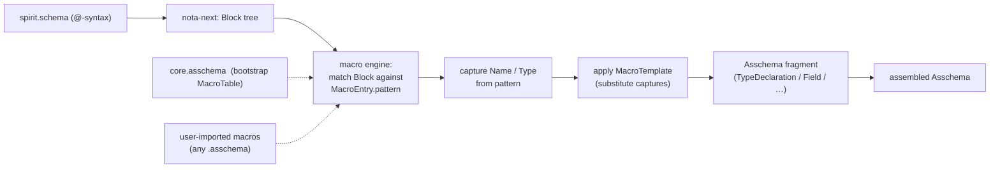
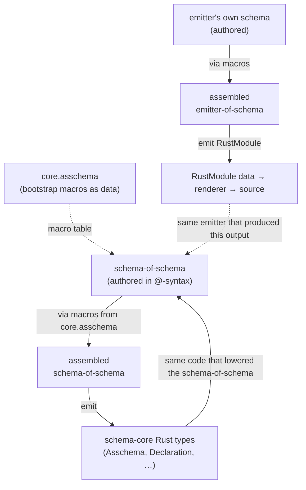

# 435 — Vision for the four remaining gaps: macro-table-as-data, RustModule-as-data, schema-core, schema diff/upgrade

*Kind: Vision / architecture proposal · Topics: macro-table-as-data, rust-module-as-data, schema-core, schema-diff, schema-upgrade, self-hosting, bootstrap-completion, emission-model · 2026-05-30 · designer lane*

*With operator 252 closing the durable-`.asschema`-artifact gap (Stage 3 of
[[434-live-assembled-schema-bootstrap-and-loop-closure]] now genuinely done —
`AsschemaArtifact` lives in schema-next, the emitter reads from file paths,
spirit-next's build.rs writes + re-reads the artifact), the four remaining
large gaps named in operator 252 are the next architectural surface. This
report presents the vision for each. Captured as Spirit record 1248 (Decision,
High). Reads in order — each gap is independent in its own shape but they
compose into the Stage 5 loop closure at §6.*

## 1. The four gaps, named in their current shape

| gap | what's in main today | the architectural target |
| --- | --- | --- |
| **A. Macro-table-as-data** | Macros are Rust impls (`RootImportsMacro`, `RootNamespaceMacro`, `DeclarativeSchemaMacro`, etc. in schema-next's lowering engine). The dispatch is hard-coded against the built-in language. | The macro table is typed data — every macro is a record with name + positions + pattern + expansion template. Bootstrap macros pre-loaded; new macros loaded from `.asschema` files. |
| **B. RustModule-as-data emitter** | `RustWriter` calls `self.line("…")` ~303 times to build emitted source as a string. | Emitter produces a typed `RustModule` (`Vec<RustItem>`); a separate renderer turns `RustModule` into Rust source text. Tests assert on data, not strings. |
| **C. Shared schema-core support nouns** | Each emitted component duplicates ~600 lines of plane envelopes (Signal<R> / Nexus<R> / Sema<R>), routing (OriginRoute), frame primitives (ShortHeader / SignalFrameError), and mail (MailIdentifier / MailLedgerEvent) in its own `src/schema/lib.rs`. | Shared `schema-core` crates (or one bundled crate with modules) hold the support nouns once; emitter emits `use schema_core::Signal;` not inline definitions. |
| **D. Schema diff + upgrade** | Schemas evolve by re-emit; no notion of "v1 vs v2 compatibility" or "this upgrade is safe." | `Asschema::diff(self, other) → AsschemaDiff`; typed `AsschemaUpgrade` artifact codifies migrations; emitter generates `impl From<v1::T> for v2::T` per diff op. Sema persistence upgrades at daemon boot when needed. |

The four are largely independent — they can land in any order — but their
composition is what unlocks Stage 5 self-hosting (§6).

## 2. Gap A — Macro-table-as-data (vision)

### Current state

`schema-next/src/macros.rs` defines the macro engine with Rust-impl macros:
`RootImportsMacro`, `RootNamespaceMacro`, `RootEnumMacro`,
`DeclarativeSchemaMacro`. Each `impl SchemaMacro` knows how to recognise + lower
a specific authored shape. The macro engine matches positionally and dispatches
to the impl that fits.

### Target shape

Each macro becomes a typed record in a serializable `MacroTable`:

```rust
#[derive(NotaDecode, NotaEncode, rkyv::Archive, rkyv::Serialize, rkyv::Deserialize,
         Clone, Debug, Eq, PartialEq)]
pub struct MacroTable {
    pub entries: Vec<MacroEntry>,
}

#[derive(NotaDecode, NotaEncode, rkyv::Archive, ...)]
pub struct MacroEntry {
    pub name: Name,
    pub positions: Vec<MacroPosition>,    // where the macro is legal
    pub pattern: MacroPattern,            // what shape it matches
    pub expansion: MacroTemplate,         // what Asschema fragment it produces
}

#[derive(NotaDecode, NotaEncode, rkyv::Archive, ...)]
pub enum MacroPosition {
    RootImports, RootInput, RootOutput, RootNamespace,
    NamespaceDeclaration, StructFields, EnumVariants, TypeReference,
}

#[derive(NotaDecode, NotaEncode, rkyv::Archive, ...)]
pub enum MacroPattern {
    SigilDelimiter { sigil: char, delimiter: Delimiter },   // Name@{ … }, Name@[ … ], Name@( … )
    NameAtType,                                              // field@Type at a field position
    AtType,                                                  // @Type (derived-name shorthand)
    TaggedRecord { tag: Name },                              // (Public Name …) at a declaration position
    BareSymbol,                                              // unit variant in an enum
}

#[derive(NotaDecode, NotaEncode, rkyv::Archive, ...)]
pub enum MacroTemplate {
    StructDeclaration { name_capture: Capture, body: FieldListTemplate },
    EnumDeclaration   { name_capture: Capture, body: VariantListTemplate },
    NewtypeDeclaration { name_capture: Capture, inner: TypeReferenceTemplate },
    Field             { name_template: NameTemplate, type_template: TypeReferenceTemplate },
    Variant           { name_template: NameTemplate, payload: Option<TypeReferenceTemplate> },
}

#[derive(NotaDecode, NotaEncode, rkyv::Archive, ...)]
pub enum NameTemplate {
    Captured(Capture),                  // use a captured Name from the pattern
    DerivedFromType(Capture),           // camelCase / unchanged of a captured Type
    Literal(Name),                      // hard-coded
}

#[derive(NotaDecode, NotaEncode, rkyv::Archive, ...)]
pub enum Capture { Sigil, Delimiter, Name(usize), TypeRef(usize), Body }
```

### Macro flow



### What unblocks

- **Schema-language extensions without Rust changes.** A user that wants
  `Database@(Table fieldA fieldB)` as a sugar for a specific struct shape
  writes the macro entry in a `.asschema` and imports it.
- **Self-hosting** — the macros that produce the schema language can be
  expressed IN the schema language; the bootstrap chicken-and-egg is broken
  by the bootstrap-macros pre-load.
- **Per-domain vocabularies** — e.g., a CRUD macro vocabulary for
  database-shaped schemas, a state-machine macro vocabulary for actor-shaped
  schemas. Each is a separate `.asschema` artifact.

### Bootstrap problem and its resolution

The core macros (`Name@{ … }` struct, `Name@[ … ]` enum, `Name@String` newtype,
`@Type` derived field/variant) must exist BEFORE the schema engine can read any
`.asschema` — otherwise nothing parses. Resolution: the macro engine has a
hard-coded BOOTSTRAP set (the same Rust impls as today, narrowed to the
absolute minimum). Once the engine is up, it loads `core.asschema` which
declares the FULL macro table as data; the bootstrap set covers exactly the
macros needed to parse `core.asschema` itself.

### Acceptance for closing gap A

1. `MacroTable` + substructure all NotaDecode + NotaEncode + rkyv.
2. A `core.asschema` fixture declares the current schema-language macros (struct,
   enum, newtype-brace, newtype-short, composite, @Type, name@Type, name@(Composite)).
3. The schema engine boots with bootstrap macros, loads `core.asschema`, and
   the loaded macros suffice to lower a real `.schema` fixture identically to
   the current Rust-impl path.
4. A user-defined macro in a separate `.asschema` extends the table; a
   `.schema` using the new macro lowers correctly.

## 3. Gap B — RustModule-as-data emitter model (vision)

### Current state

`schema-rust-next/src/lib.rs` has `RustWriter { output: String, … }` and ~303
calls to `self.line("…")`. Emission is string concatenation; the only data
shape is the input `Asschema`. Tests assert on the resulting string (textual
snapshot tests).

### Target shape

A typed Rust AST that the emitter produces; a renderer that turns it into
source:

```rust
#[derive(NotaDecode, NotaEncode, rkyv::Archive, ...)]
pub struct RustModule {
    pub items: Vec<RustItem>,
    pub attributes: Vec<RustAttribute>,           // crate-level attributes
}

#[derive(NotaDecode, NotaEncode, rkyv::Archive, ...)]
pub enum RustItem {
    UseItem(UsePath),
    TypeAlias(RustTypeAlias),
    Struct(RustStruct),
    Enum(RustEnum),
    Impl(RustImpl),
    Function(RustFunction),
    ConstItem(RustConst),
    Module(RustSubmodule),
    Attribute(RustAttribute),                     // #![cfg_attr(...)] etc.
}

#[derive(NotaDecode, NotaEncode, rkyv::Archive, ...)]
pub struct RustStruct {
    pub visibility: RustVisibility,
    pub attributes: Vec<RustAttribute>,           // #[cfg_attr(...)], #[derive(...)]
    pub name: Name,
    pub generics: Vec<RustGeneric>,
    pub body: RustStructBody,
}

#[derive(NotaDecode, NotaEncode, rkyv::Archive, ...)]
pub enum RustStructBody {
    Named(Vec<RustField>),                        // pub struct Entry { … }
    Tuple(Vec<RustType>),                         // pub struct Topic(pub String)
    Unit,                                          // pub struct Marker;
}

#[derive(NotaDecode, NotaEncode, rkyv::Archive, ...)]
pub enum RustAttribute {
    Derive(Vec<DerivePath>),                      // #[derive(NotaDecode, NotaEncode, rkyv::Archive)]
    CfgAttrDerive { feature: String, derives: Vec<DerivePath> },  // #[cfg_attr(feature = "nota-text", derive(...))]
    Cfg(String),                                   // #[cfg(feature = "nota-text")]
    Raw(String),                                   // escape hatch
}
```

A separate `RustRenderer` produces source text:

```rust
pub struct RustRenderer { /* config: indent, edition, etc. */ }
impl RustRenderer {
    pub fn render(&self, module: &RustModule) -> String { … }
}
```

The emitter signature changes:

```rust
// today
RustEmitter::emit_from_asschema(&asschema) -> String

// target
RustEmitter::emit_module(&asschema) -> RustModule
RustRenderer::default().render(&module)  -> String
```

### What unblocks

- **Semantic tests over textual snapshots.** `assert_eq!(emitter.emit(&asschema)
  .items[0], expected_struct)` instead of asserting on whitespace-sensitive
  strings.
- **Multi-target emission** (speculative). Today's renderer emits Rust; a
  TypeScript renderer or a Python renderer could consume the same RustModule
  data and produce target-shaped source. Most useful once schema becomes a
  cross-language vocabulary (intent 1184 + the cross-component triad rule).
- **Diffable emissions.** `RustModule::diff(self, other)` is a semantic delta;
  text diffs over whitespace changes vanish.
- **Cached re-emission.** If `RustModule` is unchanged, skip the render step;
  the source on disk is still valid.

### Migration path

Step-wise, not a big-bang refactor:

1. Add `RustItem` enum + the leaf types `RustStruct`, `RustEnum`, `RustImpl`,
   etc. as data types (NotaDecode/Encode/rkyv).
2. Refactor `RustWriter::line` callers ONE EMITTER FUNCTION AT A TIME into
   producing `RustItem`s instead of lines.
3. Add a parallel `RustRenderer` that produces strings from `RustItem`s.
4. The top-level `emit_from_asschema` returns `RustModule`; a thin
   compatibility wrapper renders to string for callers that want the
   pre-refactor API.
5. Tests migrate gradually from snapshot-of-string to assertions on
   `RustItem` shape; both can coexist while the migration is in flight.

### Acceptance for closing gap B

1. `RustModule` + substructure all NotaDecode + NotaEncode + rkyv.
2. The emitter produces `RustModule` directly; the renderer is the only path
   to string.
3. At least one emission test asserts on `RustItem` shape rather than text.
4. The rendered output for a fixture asschema matches the current emission
   byte-for-byte (the textual contract survives the refactor).

## 4. Gap C — Shared schema-core support nouns (vision)

### Current state

Each emitted `src/schema/lib.rs` includes ~600 lines of duplicated support
nouns: `Signal<R>`, `Nexus<R>`, `Sema<R>`, `Plane<S,N,M>`, `OriginRoute`,
`ShortHeader`, `SignalFrameError`, `MailIdentifier`, `MailLedgerEvent`,
`MessageProcessedHook`, etc. Same code, different components.

### Target shape

A small set of shared crates (or one bundled `schema-core` crate with
modules):

```text
schema-core/
├── src/
│   ├── lib.rs              re-exports
│   ├── frame.rs            ShortHeader, SignalFrameError, length-prefix primitives
│   ├── plane.rs            Signal<R>, Nexus<R>, Sema<R>, Plane<S,N,M> enum
│   ├── routing.rs          OriginRoute, route header types
│   └── mail.rs             MailIdentifier, MailLedgerEvent, processing phases
```

Or split into separate component-triad-shaped crates:

```text
signal-frame/      ShortHeader, encode_signal_frame / decode_signal_frame primitives
plane-envelope/    Signal<R>, Nexus<R>, Sema<R>, Plane<S,N,M>
origin-routing/    OriginRoute
mail-keeper/       MailIdentifier, MailLedgerEvent
```

The emitter emits `use schema_core::{Signal, Nexus, Sema, OriginRoute};` instead
of inline definitions. The schema-emitted `src/schema/lib.rs` for a component
drops from ~700 lines to ~200 lines (the component-specific types only).

### What unblocks

- **One place to fix bugs in envelope code.** Currently a bug in OriginRoute
  has to be re-emitted into every component; with schema-core it's a single
  fix.
- **New components don't re-derive primitives.** A future binary-only consumer
  imports `schema-core` and gets the wire types for free.
- **Cross-component versioning.** schema-core has its own version; component
  contracts pin to specific schema-core versions; upgrades coordinated.

### Subtle: schema-core itself has its own asschema

The shared nouns are themselves schema-derived. `schema-core/schema/lib.schema`
authors them; `schema-rust-next` emits them; the result is checked in. Other
components import the emitted types as a library, not as schema-emitted code of
their own.

### Acceptance for closing gap C

1. `schema-core` crate (or set) holds the shared support nouns; it has its own
   `schema/lib.schema` and `.asschema` artifact.
2. The schema-rust-next emitter is taught when to emit `use schema_core::T;`
   versus a local definition — likely a per-`.schema` configuration declaring
   "I import these types from schema-core."
3. `spirit-next` re-emits using schema-core; the component-specific
   `src/schema/lib.rs` drops in line count by the deduplication amount.
4. A second component (real or fixture) re-uses schema-core — proving the
   sharing is real, not theoretical.

## 5. Gap D — Schema diff + upgrade (vision)

### Current state

Schemas evolve by re-emit. There's no notion of "v1 and v2 are compatible";
no migration code; no persistence-upgrade path.

### Target shape

```rust
impl Asschema {
    pub fn diff(&self, other: &Asschema) -> AsschemaDiff { … }
}

#[derive(NotaDecode, NotaEncode, rkyv::Archive, ...)]
pub struct AsschemaDiff {
    pub source: SchemaIdentity,
    pub target: SchemaIdentity,
    pub operations: Vec<DiffOperation>,
}

#[derive(NotaDecode, NotaEncode, rkyv::Archive, ...)]
pub enum DiffOperation {
    TypeAdded(Declaration),
    TypeRemoved(Name),
    TypeRenamed { from: Name, to: Name },
    FieldAdded { type_name: Name, field: (Name, TypeReference) },
    FieldRemoved { type_name: Name, field_name: Name },
    FieldTypeChanged { type_name: Name, field_name: Name, from: TypeReference, to: TypeReference },
    FieldRenamed { type_name: Name, from: Name, to: Name },
    VariantAdded { type_name: Name, variant: Variant },
    VariantRemoved { type_name: Name, variant_name: Name },
    VisibilityChanged { name: Name, from: Visibility, to: Visibility },
    NewtypeInnerChanged { name: Name, from: TypeReference, to: TypeReference },
}
```

A typed `AsschemaUpgrade` codifies the migration:

```rust
#[derive(NotaDecode, NotaEncode, rkyv::Archive, ...)]
pub struct AsschemaUpgrade {
    pub diff: AsschemaDiff,
    pub manual_steps: Vec<ManualUpgradeStep>,    // for changes the diff can't migrate automatically
}

#[derive(NotaDecode, NotaEncode, rkyv::Archive, ...)]
pub struct ManualUpgradeStep {
    pub kind: ManualStepKind,
    pub description: Description,
    pub generated_rust_fragment: Option<Vec<RustItem>>,    // optional generated code
}
```

The Rust emitter generates upgrade impls per diff op:

```rust
// generated by schema-rust-next from AsschemaUpgrade
impl From<v1::Entry> for v2::Entry {
    fn from(prev: v1::Entry) -> Self {
        Self {
            topics: prev.topics,
            kind: prev.kind,
            description: prev.description,
            magnitude: v2::Magnitude::Medium,    // default for new field
        }
    }
}
```

### Where the upgrades run

- **Sema persistence**: at daemon startup, compare persisted schema identity
  vs binary schema identity; if persisted < binary, run the upgrade impls
  over the database (entry by entry, rkyv re-archive at the new shape).
- **Wire compatibility**: handshake exchanges schema identities; if peer is at
  v1 and self is at v2, upgrade incoming v1 frames to v2 internally and
  downgrade outgoing v2 replies to v1.
- **Build-time compatibility check**: CI asserts that a new schema's diff vs
  the previous LANDED schema only contains operations that have automatic
  migrations (or have manual steps explicitly authored).

### What unblocks

- **Safe schema evolution in production.** Adding a field to a record doesn't
  break persisted data because the upgrade impl handles it.
- **Automatic migration code generation.** No hand-written
  `impl From<v1::T> for v2::T` per field; the diff drives the impls.
- **Structural compatibility at deploy.** Deploy-time check refuses an
  incompatible schema upgrade before the daemon starts and corrupts data.

### Acceptance for closing gap D

1. `Asschema::diff` produces an `AsschemaDiff` for two assembled schemas; the
   operations cover the common cases (add/remove/rename type, field, variant;
   field type change with widening detection).
2. `AsschemaUpgrade` artifact serializes (NOTA + rkyv).
3. The Rust emitter generates `impl From<v1::T> for v2::T` per diff op for
   automatic cases.
4. A worked spirit-next-style example: persisted `.sema` from v1 schema; daemon
   built against v2 schema; startup migration reads + rewrites entries; queries
   work afterwards.

## 6. The loop closure — Stage 5 unlocks once A + B + (C optional) land

Stage 5 of [[434]] is "self-hosting: schema-of-schema emits itself, then
short-syntax form, closing the loop." The four gaps relate to it as follows:

- **A (macro-table-as-data) is required for stage 5.** Without it, the
  macros that produce schema syntax can't be expressed in schema's own
  language — the chicken-and-egg stays. Once A lands, the schema-of-schema's
  authored form can be defined.
- **B (RustModule-as-data) is required for stage 5 in its strict form.** A
  truly self-hosting emitter that's described in schema's own assembled form
  produces `RustModule`s. If the emitter is still string-concat, self-hosting
  works at the schema-of-schema layer but not at the emitter-of-the-schema
  layer.
- **C (schema-core) is independent of self-hosting.** Self-hosting works
  without schema-core; schema-core is a deduplication win.
- **D (diff + upgrade) is independent of self-hosting.** Self-hosting works
  without upgrade; upgrade is a production-evolution prerequisite.

So **A + B are the self-hosting prerequisites**; C + D are independent value
adds.

### The closed loop



When A + B close, every layer of the stack has a serializable data form whose
definition is also a serializable data form. The system describes itself end
to end.

## 7. Suggested ordering for the operator

The four gaps don't dictate an ordering — they're independent. But for
maximum pragmatic value per slice:

1. **Gap C (schema-core)** — most pragmatic; removes ~500 lines of
   duplication per emitted component; every new component going forward
   benefits. Independent of A/B/D. **Recommended first.**
2. **Gap A (macro-table-as-data)** — unblocks stage-5 self-hosting; turns
   the schema language into a user-extensible vocabulary; is the gap most
   closely aligned with record 1109 ("everything is data, macros
   included").
3. **Gap B (RustModule-as-data)** — incremental quality win for emission
   testability and future multi-target emission; nicest to land alongside or
   after A (the macro template's `MacroTemplate::RustModule(...)` arm makes
   more sense once RustModule is data).
4. **Gap D (schema diff + upgrade)** — large surface; gets prioritised when
   the first production schema evolution forces the question. Until then,
   re-emit-and-pin works.

### Alternate ordering: if production deploy pressure is the constraint

If a spirit-next-like daemon is going to production soon and schema evolution
will be needed within months, D should rise to second priority — getting an
upgrade story landed before persisted data accumulates is worth a lot. In that
case the ordering is C → D → A → B.

### Alternate ordering: if developer-extensibility is the priority

If users start wanting to extend the schema language with their own macros
(per-domain CRUD vocabularies, etc.), A becomes urgent. C → A → B → D.

The choice depends on which pressure the workspace feels first. My default
recommendation is C first regardless — the deduplication win is real
immediately and unlocks future components.

## 8. The one-line summary

The four remaining gaps are (A) macro-table-as-data, (B) RustModule-as-data
emitter, (C) shared schema-core support nouns, (D) schema diff + upgrade.
**A + B close the Stage 5 self-hosting loop**; **C deduplicates ~500 lines of
emission per component**; **D unblocks production schema evolution**. Each is
an independent slice with clear acceptance criteria; recommended ordering is
**C → A → B → D** absent specific deploy or developer-extensibility pressure.
The composition closes the bootstrap loop with every layer of the stack
described by a serializable data artifact whose definition is itself a
serializable data artifact.
