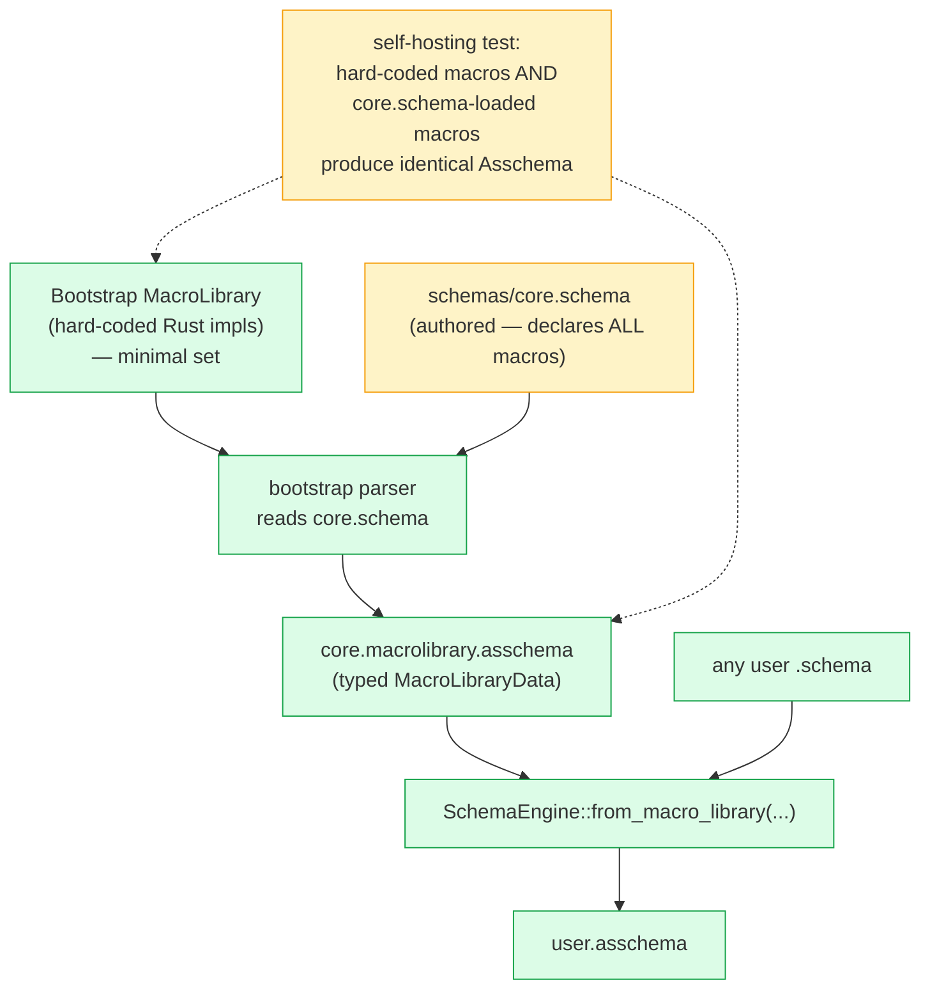

# 436 — Next move: `schemas/core.schema` + the self-hosting macro test (Stage 4 closure)

*Kind: Next-slice vision · Topics: macro-table-as-data, self-hosting, core-schema, bootstrap-resolution, declaration-shape-tidy, stage-4 · 2026-05-30 · designer lane*

*The next move after operator's `a4fe0900` + `82c01208` + `257af74` slice
(macro-library typed data + RustModule + checked-in .asschema). What's
missing right now, and the focused architecture for closing it. Companion to
[[435-vision-for-the-four-remaining-gaps]] (the whole forward plan) — this
report names the IMMEDIATE next slice and resolves the
chicken-and-egg that gates it.*

## 1. What's missing right now

Three things, in priority order:

1. **`MacroLibraryData` is hand-written in Rust, not generated from a schema.**
   Operator's own remaining-gap list names this: "generate the macro-table
   noun from `schemas/core.schema` instead of the hand-written
   `MacroLibraryData`." Without this, Stage 4 of
   [[434-live-assembled-schema-bootstrap-and-loop-closure]] (schema authoring
   = macro to assembled data) is structurally complete but the *macros
   themselves* aren't data — they're Rust constructor calls.
2. **The assembled `.asschema` form has redundant inner names.** From the
   audit of operator's checked-in `schema/lib.asschema`:
   `(Public SourcePath (Newtype (SourcePath String)))` — `SourcePath`
   appears twice. The cleaner form is
   `(Public SourcePath (Newtype String))`. The inner `(Name Type)`
   wrapper inside `Newtype` / `Struct` / `Enum` carries a redundant copy
   of the parent Declaration's name.
3. **`RustModule` is typed-data-shaped but not yet a serializable artifact.**
   `RustModule` doesn't derive `NotaDecode` / `NotaEncode` / `rkyv::Archive`,
   so the emission can't yet round-trip through its own artifact.

Items 1 and 2 land naturally in **one slice** because both touch Declaration
shapes the macros define. Item 3 is the next slice after.

## 2. The slice: `schemas/core.schema` + self-hosting test + name-tidy



### Concrete steps

1. **Author `schemas/core.schema`** in the `schema-next` repo. It declares the
   same macro vocabulary currently produced by hand-written `MacroLibraryData`
   constructors: the bootstrap macros (struct `Name@{ … }`, enum
   `Name@[ … ]`, newtype `Name@Type` / `Name@{ Type }`, composite
   `Name@(Vec X)`, field `field@Type` / `@Type`, variant `Name@Type` /
   `@Type`). One declaration per macro entry.

2. **Add `MacroLibraryData::from_core_schema_artifact()`** — a method that
   reads `core.macrolibrary.asschema` (the checked-in lowered form of
   `core.schema` interpreted as a macro library) and returns the typed value.
   The artifact is generated at build time and checked in (same discipline as
   the existing `schema/lib.asschema`).

3. **Add `SchemaEngine::from_macro_library(MacroLibraryData)`** — wires a
   loaded macro library into the engine's runtime MacroRegistry. (May already
   exist via existing constructors; this slice formalises the entry point.)

4. **Land the self-hosting test**. The acceptance contract:

   ```rust
   #[test]
   fn loaded_core_macros_match_bootstrap_for_real_schemas() {
       let bootstrap_engine = SchemaEngine::default();   // hard-coded macros
       let loaded_engine = SchemaEngine::from_macro_library(
           MacroLibraryData::from_core_schema_artifact()
               .expect("read core.macrolibrary.asschema")
       );

       for fixture in REAL_SCHEMA_FIXTURES {
           let source = include_str!(fixture.path);
           let bootstrap_asschema = bootstrap_engine.lower_source(source, fixture.identity.clone())?;
           let loaded_asschema    = loaded_engine.lower_source(source, fixture.identity.clone())?;
           assert_eq!(bootstrap_asschema, loaded_asschema,
               "core.schema-loaded macros must match bootstrap on {}", fixture.path);
       }
   }
   ```

   This is the self-hosting milestone test. When it passes, the macro
   vocabulary is genuinely data; the hard-coded Rust impls are a
   bootstrap fallback, not the authoritative source.

5. **Tidy the redundant inner names** in the assembled NOTA form. The Declaration
   shape becomes:
   - `(Public Topic (Newtype String))` — drop the inner `Topic`
   - `(Public Entry (Struct { topics Topics  kind Kind … }))` — drop the inner `Entry`
   - `(Public Kind (Enum [ Decision Principle Correction … ]))` — drop the inner `Kind`

   The Rust shape mirrors: `StructDeclaration` / `EnumDeclaration` /
   `NewtypeDeclaration` drop their `name` fields (or get renamed to
   `StructBody` / `EnumBody` / `NewtypeBody` to signal they're the inner
   body, not a complete declaration).

   This is a one-pass diff across `schema-next/src/asschema.rs` + the macro
   templates in `schemas/core.schema` + any tests asserting on the old form.
   It's small but it touches the same files as steps 1-4, so folding in
   keeps the diff coherent.

## 3. The chicken-and-egg, resolved

The obvious tension: to parse `core.schema`, we need macros; to declare
macros, we use `core.schema`. The resolution is **scope, not staging**:

- The **bootstrap macro set** is FIXED at language-design time. It contains
  exactly the macros needed to parse `core.schema` itself — which, by
  construction, is the same set `core.schema` declares.
- The bootstrap macros stay hard-coded in Rust as a fallback / bootstrap
  parser. They are NOT a smaller set; they're the SAME set, implemented twice
  (once in Rust for bootstrap, once as data in `core.schema`).
- The self-hosting test (step 4) proves they're equivalent. Once equivalent,
  the loaded form is authoritative; the Rust form is only used at engine
  startup before `core.macrolibrary.asschema` loads.

There's no "smaller bootstrap" — that would require some macros to be
inaccessible from `core.schema`, which means `core.schema` couldn't declare
the full vocabulary, which means the macros aren't data. The scope rule:
**bootstrap = full core macro set, implemented twice as a self-check**.

User-defined macros (per-domain CRUD vocabularies, etc.) extend the loaded
library through additional `.asschema` imports. They have NO bootstrap
counterpart — they don't need one, because the engine already loaded the
core macros that can parse the user macro declarations.

Captured as a refinement to Spirit record 1246 / 434 §2: the bootstrap set
is the full core vocabulary, not a minimal subset.

## 4. What this slice unblocks

Once `core.schema` exists and the self-hosting test passes:

- **Per-domain macro vocabularies** become real. A CRUD-shaped schema
  vocabulary, a state-machine vocabulary, etc., land as separate `.asschema`
  imports that the engine loads alongside core.
- **The macro language is reviewable as data.** Changes to schema syntax are
  diffs to `core.schema`, not Rust patches to `declarative.rs`. PR review of
  language changes becomes a different kind of read.
- **Stage 5 self-hosting reach** is unblocked for the macro layer (one of
  the two prerequisites named in 434 §6; the other is RustModule as data
  artifact, which is the next slice).

## 5. Acceptance for closing this slice

1. `schemas/core.schema` exists in `schema-next/schemas/core.schema` (path
   convention matching the existing `schema/lib.schema` per component, but
   in a `schemas/` directory for first-party language artifacts).
2. `schemas/core.asschema` and `schemas/core.macrolibrary.asschema` are
   checked-in alongside, generated via the same artifact discipline.
3. `MacroLibraryData::from_core_schema_artifact()` reads the macrolibrary
   artifact.
4. `SchemaEngine::from_macro_library(MacroLibraryData)` wires it in.
5. The self-hosting test (the equivalence assertion in §2 step 4) passes on
   at least three real `.schema` fixtures.
6. The assembled `.asschema` form drops redundant inner names (§2 step 5);
   existing tests + the checked-in `spirit-next/schema/lib.asschema` are
   regenerated to match.
7. `cargo test --all` passes in `schema-next`, `schema-rust-next`, and
   `spirit-next`. `nix flake check` passes in `spirit-next`.

## 6. What this slice does NOT do (and why)

- **Does not extract `schema-core` support nouns** (Gap 3). That's the next
  slice. This slice keeps the cross-crate-import-resolution surface stable
  — schema-core's cross-crate imports are a separate complexity, and
  conflating them with self-hosting risks both.
- **Does not make `RustModule` a serializable artifact** (second cut of
  Gap 2). That slice is mechanically similar (add the derives, add file I/O,
  add a freshness gate) but touches the emission side, not the lowering
  side. Cleaner as a separate slice after this lands.
- **Does not add `SchemaDiff` / `UpgradePlan`** (Gap 4). Depends on stable
  artifact comparison; lands when production schema evolution forces it.

## 7. The one-line summary

The next move is `schemas/core.schema` + a checked-in macrolibrary artifact
+ a self-hosting test that proves the loaded macros and the hard-coded
bootstrap macros produce identical Asschema, with the redundant-inner-name
tidy folded in because it touches the same Declaration shapes. The bootstrap
set isn't smaller than the core macro set — it's the same set implemented
twice, with the test proving equivalence. Once it passes, the macro
vocabulary is genuinely data, per-domain extensions become possible, and the
macro side of Stage 5 self-hosting is reached.
