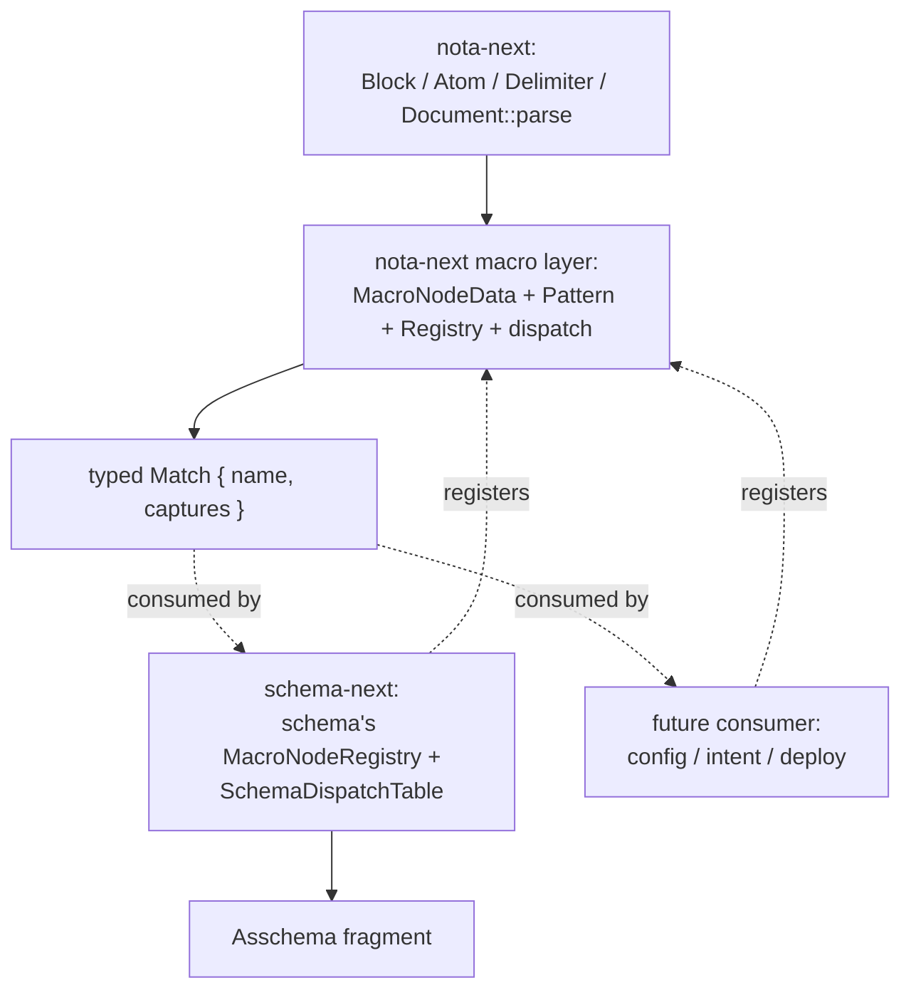
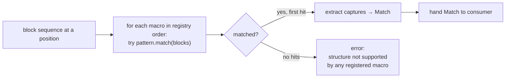

# 438 — Macro nodes at the NOTA layer: the next vision, focused on what's most crucial to get right

*Kind: Architecture vision · Topics: macro-nodes, nota-layer-extension, structural-match, dispatch, schema-consumer, formatter-derivation, strict-form, pattern-enum, capture-extraction, bootstrap-revised · 2026-05-30 · designer lane*

*Captures the macro-node-as-NOTA-extension direction the psyche named after
the strict-brace work landed (records 1259, 1263). Audits and designs the
shape of macro nodes at the NOTA layer — where Schema becomes one CONSUMER
of macros rather than the macro layer itself. Per the directive: focus on
the parts most crucial to get RIGHT, so the operator's implementation
doesn't lock in the wrong shape. Five critical decisions named in §6 with
recommended answers; everything else is derivable.*

## 1. What I heard

The architectural shift, restated:

> Macros are part of the **NOTA decoder**, not just the Schema layer. A
> macro is data — an enum variant in a typed registry — that says "if a
> block sequence matches THIS structural shape, I am the macro that
> interprets it." When NOTA reads a brace or bracket position with a macro
> registry attached, each entry is dispatched against the macros. The first
> matching macro extracts named captures from the blocks. A consumer (Schema
> is one) takes the captures and lowers them to a domain-specific output
> (Asschema fragment, configuration value, intent record, …).

> Macros can have **different arities** depending on what their pattern
> requires — but the strict-brace rule means inside a brace we stick to TWO
> objects per entry; the asterisk same-type shorthand stays as a value-
> position object. The "prefix-sigil arity-1 sugar" (e.g., `*Name` as one
> token meaning derived-field) is rejected because the strict pair-rhythm
> reads more easily and a NOTA formatter can reformat consistently.

> Because the macros are data with structural patterns, a NOTA formatter
> can be **derived** from the same macro definitions — knowing each macro's
> shape tells the formatter where line breaks, indentation, and spacing
> belong.

Schema is one consumer. Other future consumers (configs, intent records,
deploy manifests) register their own macro vocabularies. NOTA owns the
mechanism; consumers own the vocabularies.

## 2. The architectural layer placement



**nota-next gains** (the NEW NOTA-layer surface):

- `MacroNodeData` — the data record describing one macro
- `Pattern` — the typed structural-match enum
- `CaptureName` / `CaptureSpec` — named extraction from a match
- `PositionPredicate` — where the macro applies (brace entry, bracket entry, root, etc.)
- `MacroNodeRegistry` — a collection of macros + the dispatch algorithm
- `Match` — what's returned to consumers (macro name + captures)

**schema-next keeps and narrows**:

- Construct its own `MacroNodeRegistry` (the schema language vocabulary)
- A `SchemaDispatchTable` mapping `MacroName → Handler` that takes captures
  and produces `AsschemaFragment`
- The bootstrap subset (hard-coded handlers for the macros needed to parse
  `core.schema`); the rest loaded from macro data

**nota-next does NOT own**:

- Schema-specific shapes (Asschema, Declaration, TypeReference)
- Any consumer-specific lowering logic
- The macro vocabulary itself (that's per-consumer)

This is record 1109 ("everything is data, macros included") realized at the
right layer: NOTA exposes the macro mechanism as data; each consumer (schema
being the first) declares its vocabulary as data using that mechanism.

## 3. The macro-node data shape

```rust
// nota-next/src/macros.rs (proposed)

#[derive(NotaDecode, NotaEncode, rkyv::Archive, ...)]
pub struct MacroNodeData {
    pub name: Name,                              // identifier in the registry
    pub position: PositionPredicate,             // where this macro is legal
    pub pattern: Pattern,                        // structural match
    pub captures: Vec<CaptureSpec>,              // named extractions from the match
}

#[derive(NotaDecode, NotaEncode, rkyv::Archive, ...)]
pub enum PositionPredicate {
    BraceEntry,                                  // matches a key-value pair inside a brace
    BracketEntry,                                // matches one positional inside a bracket
    RootPositional { index: u32 },               // matches one of the root struct's positional fields
}

#[derive(NotaDecode, NotaEncode, rkyv::Archive, ...)]
pub struct Pattern {
    pub elements: Vec<PatternElement>,
}

#[derive(NotaDecode, NotaEncode, rkyv::Archive, ...)]
pub enum PatternElement {
    Atom(AtomShape),                             // matches one Atom block
    Delimited(DelimitedShape),                   // matches one Delimited block
    Literal(String),                             // matches an exact atom literal (e.g. "*")
}

#[derive(NotaDecode, NotaEncode, rkyv::Archive, ...)]
pub struct AtomShape {
    pub case: Option<AtomCase>,                  // None = any case
    pub sigil: Option<SigilSpec>,                // optional sigil prefix/suffix
    pub capture: Option<CaptureName>,            // optional capture-name binding
}

#[derive(NotaDecode, NotaEncode, rkyv::Archive, ...)]
pub enum AtomCase {
    PascalCase,
    CamelCase,
    KebabCase,
    LowerSnakeCase,
}

#[derive(NotaDecode, NotaEncode, rkyv::Archive, ...)]
pub struct SigilSpec {
    pub character: char,
    pub position: SigilPosition,
}

#[derive(NotaDecode, NotaEncode, rkyv::Archive, ...)]
pub enum SigilPosition {
    Prefix,
    Suffix,
}

#[derive(NotaDecode, NotaEncode, rkyv::Archive, ...)]
pub struct DelimitedShape {
    pub delimiter: Delimiter,                    // brace / bracket / parenthesis / pipe-*
    pub inner: Option<Box<Pattern>>,             // optional nested pattern (or None = any contents)
    pub capture: Option<CaptureName>,            // optional capture-name binding
}

pub struct Match<'blocks> {
    pub macro_name: Name,
    pub captures: BTreeMap<CaptureName, CapturedValue<'blocks>>,
}

pub enum CapturedValue<'blocks> {
    Atom(&'blocks Atom),
    Delimited(&'blocks Block),
    Inner(Vec<&'blocks Block>),
}
```

A macro entry's pattern is a sequence of `PatternElement` matched against
the actual block sequence at the position. Captures are named extractions
from the matched elements; the consumer reads them by name.

## 4. The structural match language — worked examples

### Struct declaration (`Name { fields }` at namespace brace position)

```rust
MacroNodeData {
    name: Name("Struct"),
    position: PositionPredicate::BraceEntry,
    pattern: Pattern { elements: vec![
        PatternElement::Atom(AtomShape {
            case: Some(AtomCase::PascalCase),
            sigil: None,
            capture: Some(CaptureName("type_name")),
        }),
        PatternElement::Delimited(DelimitedShape {
            delimiter: Delimiter::Brace,
            inner: None,                          // body shape is dispatched separately
            capture: Some(CaptureName("body")),
        }),
    ]},
    captures: vec![
        CaptureSpec { name: "type_name", required: true },
        CaptureSpec { name: "body",      required: true },
    ],
}
```

Matches `Entry { topics Topics  kind Kind }` at namespace brace position:
- `type_name` capture = `Entry`
- `body` capture = the brace block content

Schema's handler for `Struct` macro:

```rust
impl MatchHandler for StructDeclarationHandler {
    fn handle(&self, m: Match) -> TypeDeclaration {
        let name = m.captures["type_name"].as_pascal_case();
        let body = m.captures["body"].as_brace_inner();
        let fields = lower_struct_field_body(body);    // dispatch the body's brace pairs
        TypeDeclaration::Struct(StructDeclaration { name, fields })
    }
}
```

### Struct field explicit (`fieldName TypeRef` at struct brace position)

```rust
MacroNodeData {
    name: Name("FieldExplicit"),
    position: PositionPredicate::BraceEntry,
    pattern: Pattern { elements: vec![
        PatternElement::Atom(AtomShape {
            case: Some(AtomCase::CamelCase),
            sigil: None,
            capture: Some(CaptureName("field_name")),
        }),
        PatternElement::Atom(AtomShape {       // OR Delimited for (Vec X) composites
            case: None,
            sigil: None,
            capture: Some(CaptureName("type_ref")),
        }),
    ]},
    ...
}
```

Matches `topics Topics`, `description Description`, etc.

### Struct field derived (`Type *` at struct brace position)

```rust
MacroNodeData {
    name: Name("FieldDerived"),
    position: PositionPredicate::BraceEntry,
    pattern: Pattern { elements: vec![
        PatternElement::Atom(AtomShape {
            case: Some(AtomCase::PascalCase),
            sigil: None,
            capture: Some(CaptureName("type_name")),
        }),
        PatternElement::Literal("*".to_owned()),    // matches the literal asterisk atom
    ]},
    ...
}
```

Matches `Topics *`, `Kind *`, etc. Schema's handler derives the field name
from camelCase of `type_name`.

### Enum unit variant (`Decision` at enum bracket position)

```rust
MacroNodeData {
    name: Name("VariantUnit"),
    position: PositionPredicate::BracketEntry,
    pattern: Pattern { elements: vec![
        PatternElement::Atom(AtomShape {
            case: Some(AtomCase::PascalCase),
            sigil: None,
            capture: Some(CaptureName("variant_name")),
        }),
    ]},
    ...
}
```

### Enum data variant (`Name@ Type` at enum bracket position)

```rust
MacroNodeData {
    name: Name("VariantData"),
    position: PositionPredicate::BracketEntry,
    pattern: Pattern { elements: vec![
        PatternElement::Atom(AtomShape {
            case: Some(AtomCase::PascalCase),
            sigil: Some(SigilSpec { character: '@', position: SigilPosition::Suffix }),
            capture: Some(CaptureName("variant_name")),
        }),
        PatternElement::Atom(AtomShape {
            case: Some(AtomCase::PascalCase),
            sigil: None,
            capture: Some(CaptureName("payload_type")),
        }),
    ]},
    ...
}
```

Matches `Record@ Entry`, `Observe@ Query`, etc.

### Newtype (`Name TypeRef` at namespace brace position)

```rust
MacroNodeData {
    name: Name("Newtype"),
    position: PositionPredicate::BraceEntry,
    pattern: Pattern { elements: vec![
        PatternElement::Atom(AtomShape {
            case: Some(AtomCase::PascalCase),
            sigil: None,
            capture: Some(CaptureName("type_name")),
        }),
        PatternElement::Atom(AtomShape {       // bare PascalCase value
            case: Some(AtomCase::PascalCase),
            sigil: None,
            capture: Some(CaptureName("inner_type")),
        }),
    ]},
    ...
}
```

Matches `Topic String`, `RecordIdentifier Integer`. With a second variant
of the Newtype macro matching `Name (Composite X)`:

```rust
MacroNodeData {
    name: Name("NewtypeComposite"),
    position: PositionPredicate::BraceEntry,
    pattern: Pattern { elements: vec![
        PatternElement::Atom(AtomShape {
            case: Some(AtomCase::PascalCase),
            sigil: None,
            capture: Some(CaptureName("type_name")),
        }),
        PatternElement::Delimited(DelimitedShape {
            delimiter: Delimiter::Parenthesis,
            inner: None,
            capture: Some(CaptureName("composite_value")),
        }),
    ]},
    ...
}
```

Matches `Topics (Vec Topic)`, `RecordSet (Vec Entry)`.

## 5. The dispatch model



### Algorithm

```rust
impl MacroNodeRegistry {
    pub fn dispatch<'blocks>(
        &self,
        position: PositionPredicate,
        blocks: &'blocks [Block],
    ) -> Result<Match<'blocks>, MacroError> {
        for node in self.nodes.iter().filter(|n| n.position == position) {
            if let Some(captures) = node.pattern.try_match(blocks) {
                return Ok(Match { macro_name: node.name.clone(), captures });
            }
        }
        Err(MacroError::NoMatch {
            position,
            tried: self.nodes.iter().filter(|n| n.position == position).map(|n| n.name.clone()).collect(),
            blocks: blocks.iter().map(|b| b.debug_shape()).collect(),
        })
    }
}
```

### Conflict detection at registration time

When a registry is constructed, check pairwise: do any two macros have
patterns that could match the same input? If yes, the order matters and the
operator must explicitly acknowledge.

```rust
impl MacroNodeRegistryData {
    pub fn validate_no_silent_conflicts(&self) -> Result<(), Vec<MacroConflict>> {
        let mut conflicts = Vec::new();
        for (i, a) in self.nodes.iter().enumerate() {
            for b in self.nodes.iter().skip(i + 1) {
                if a.position == b.position && patterns_can_overlap(&a.pattern, &b.pattern) {
                    conflicts.push(MacroConflict { first: a.name.clone(), second: b.name.clone() });
                }
            }
        }
        if conflicts.is_empty() { Ok(()) } else { Err(conflicts) }
    }
}
```

`patterns_can_overlap` is conservative: if it can't prove the two patterns
are disjoint, it reports a conflict. The operator either reorders the
registry (making the priority explicit) or refines patterns to disjoint
shapes.

### Error semantics

When no macro matches at a position, the error names:
- The position predicate (where parsing was)
- The macro names that were tried (the registry's macros for that position)
- The actual block shape that didn't match

This gives the operator and end user immediately actionable diagnostics —
"structure at position BraceEntry isn't supported; tried macros [Struct,
FieldExplicit, FieldDerived, Newtype, NewtypeComposite]; got shape [Atom,
Atom, Atom]." The end user knows their input doesn't match any registered
macro; the operator knows whether to extend the vocabulary or fix the input.

## 6. What's MOST CRUCIAL to get right (the operator's checklist)

These five decisions, if locked in wrong, cost weeks to undo. They warrant
explicit psyche review before implementation lands. **My recommendations
are in bold; alternatives are noted.**

### Critical decision 1 — Layer placement (NOTA vs Schema)

**Recommendation: macros live in nota-next; schema-next is a consumer.**
This makes the macro mechanism reusable across consumers (future configs,
intent records, deploy manifests) and aligns with record 1109. The
alternative (macros in schema-next only) is simpler short-term but locks
out future consumers. Psyche already directed toward NOTA-layer in the
prompt — locking this in.

### Critical decision 2 — Pattern enum variant set (closed vs extensible)

**Recommendation: closed typed enum with the variant set in §3.** The
variants `Atom(AtomShape)`, `Delimited(DelimitedShape)`, `Literal(String)`
plus the substructure (`AtomCase`, `SigilSpec`, etc.) cover every macro
needed for the current strict-brace schema. New variants land as
explicit nota-next changes — extensible only by NOTA's owner, not by
consumers.

The alternative (open extensibility via plugin trait) is more flexible
but makes the data form harder to serialize (you can't NotaDecode a
trait object). Closed enum is the right tradeoff: less flexibility, full
serializability + rkyv-archivability.

### Critical decision 3 — Dispatch order and conflict policy

**Recommendation: ordered list (first match wins) + conflict detection at
registry construction time (warn or error, operator's choice).** This is
deterministic at parse time and catches ambiguous vocabularies early.

The alternatives are:
- Priority-tagged macros (each macro has a priority number) — extra
  surface for the operator to maintain
- Specificity-based (most specific match wins) — needs a complexity
  metric on patterns; can produce surprising results
- Strict error on any ambiguity (no order at all) — safest but most
  restrictive

The recommended hybrid (ordered + construction-time check) gives safety
WITHOUT removing the operator's ability to express priority via list
order.

### Critical decision 4 — Capture mechanism (named vs positional)

**Recommendation: named captures bound in the pattern itself
(`AtomShape::capture: Option<CaptureName>`).** The consumer reads captures
by name. This is clearer for handlers ("get the type_name capture") than
positional indexing ("get blocks[0]") and survives pattern restructuring.

The alternative (positional captures only) is simpler but couples handler
code to pattern layout — pattern refactor breaks handler.

### Critical decision 5 — Output type and consumer interface

**Recommendation: `Match { macro_name, captures }` is the NOTA-layer
output; consumer dispatch table maps `MacroName → Handler` where each
handler takes a `Match` and produces consumer-specific output.** This keeps
nota-next agnostic of consumer-specific types (Asschema, configuration,
etc.).

The alternative (generic `MacroNode<Output>` trait with associated type)
is more typed but harder to serialize (the trait object pattern again).
Keep nota-next data-only; let consumers carry the type-level information.

### The five decisions summarized

| # | decision | recommendation |
| - | -------- | -------------- |
| 1 | layer placement | nota-next owns mechanism; consumers own vocabularies |
| 2 | pattern enum | closed typed enum; new variants are nota-next edits |
| 3 | dispatch | ordered list + construction-time conflict detection |
| 4 | captures | named bindings in the pattern; handlers read by name |
| 5 | output | NOTA returns `Match { name, captures }`; consumer dispatches |

If these five hold, everything else (the specific macro vocabulary, the
schema lowering handlers, the formatter derivation, the bootstrap shape)
is mechanical to implement and reversible if a sub-decision turns out
wrong.

## 7. The formatter derivation (consequence, not separate work)

Once macros are data with patterns, a NOTA formatter can know — for any
given block sequence — which macro matched and therefore what shape
applies. The formatter uses the pattern to know:

- Where to put a line break (after each macro entry inside a brace)
- How to indent nested patterns (each `Delimited` substructure increases
  indent)
- Whether spacing between elements matters (atoms separated by spaces;
  delimiters butted against captures)

```rust
impl NotaFormatter {
    pub fn format(&self, blocks: &[Block], registry: &MacroNodeRegistry) -> String {
        // For each entry at a brace/bracket/root position, dispatch via registry,
        // then format using the pattern's element-by-element layout knowledge.
    }
}
```

This means a SINGLE source of truth (the macro registry) drives both
parsing AND pretty-printing. The formatter doesn't need its own grammar
description — it derives from the macro data.

Worth implementing in a follow-up slice; this report flags it as available
once the macro layer lands.

## 8. The bootstrap, revised (folds 436/255 into the NOTA-layer framing)

The chicken-and-egg from 436/255 still applies, but now framed at NOTA
layer:

```text
nota-next: parser + macro mechanism                 (capable; no schema macros)
schema-next: bootstrap macro subset                 (hard-coded Rust handlers
                                                     for the macros needed to parse
                                                     schemas/core.schema)
schemas/core.schema: declares full macro vocabulary  (struct, enum, newtype, field,
                                                     variant, derived-field, ...)
schema-next: loads macros from core.asschema         (the runtime vocabulary, full)
schema-next: parses user schemas with full vocab     (the steady state)
```

The bootstrap is **schema-next's hard-coded subset, not nota-next's**.
nota-next is purely the mechanism — it doesn't know about struct or enum;
it knows about Atom, Brace, Bracket, Sigil. Schema's bootstrap teaches
nota-next "match these N patterns at these positions; here's how to
extract captures." After bootstrap, the loaded core macros replace (or
augment — operator's choice per 255) the bootstrap set.

This is operator 255's "tiny bootstrap" framing realized: nota-next is
infinite-extensible; schema's bootstrap is a small subset of schema's
full vocabulary; core.schema declares the full set.

## 9. The Rust architecture sketch (where each piece lives)

```text
nota-next/
├── src/
│   ├── parser.rs           Document::parse → Block/Atom/Delimiter (existing)
│   ├── codec.rs            NotaDecode/NotaEncode (existing)
│   └── macros.rs           NEW — MacroNodeData, Pattern, Match, Registry, dispatch
schema-next/
├── src/
│   ├── asschema.rs         Asschema and substructure (existing, evolving)
│   ├── lowering.rs         SchemaDispatchTable + Match handlers (existing logic,
│   │                       refactored to consume nota-next Matches)
│   └── bootstrap.rs        Hard-coded macro subset sufficient to parse core.schema
└── schemas/
    ├── core.schema         Declares the full macro vocabulary as data
    └── core.macrolibrary.asschema    Lowered form (checked in)
```

The interface between nota-next and schema-next is:

```rust
// nota-next
pub fn dispatch<'b>(
    registry: &MacroNodeRegistry,
    position: PositionPredicate,
    blocks: &'b [Block],
) -> Result<Match<'b>, MacroError>;

// schema-next (the consumer side)
pub trait MatchHandler {
    type Output;
    fn handle(&self, m: Match) -> Result<Self::Output, SchemaError>;
}

pub struct SchemaDispatchTable {
    handlers: BTreeMap<Name, Box<dyn MatchHandler<Output = AsschemaFragment>>>,
}

impl SchemaEngine {
    pub fn lower_schema(&self, source: &str) -> Result<Asschema, SchemaError> {
        let document = Document::parse(source)?;
        // walk the root + dispatch each position with the right registry +
        // route the Match to the schema-side handler
    }
}
```

Clean separation: nota-next does structural dispatch; schema-next does
semantic interpretation.

## 10. Open questions for confirmation

A. **The closed pattern enum's variant set** (§3) — is the list
   exhaustive enough? Specifically: do we need a `Vec<PatternElement>`
   variant for matching variable-arity sequences (e.g., the whole body of
   a brace as one capture)? Currently `DelimitedShape::inner: Option<...>`
   serves that role; explicit confirmation that's enough.

B. **Position predicate variants** — `BraceEntry`, `BracketEntry`,
   `RootPositional { index }`. Do we need `ParenthesisEntry` (composite
   call position)? Probably yes; should it be in the initial set?

C. **The strict-no-prefix-sigil-sugar position** — confirming you're firm on
   no `*Type` arity-1 token even though it's tempting; the strict pair
   reads better and the formatter reformats consistently.

D. **The `MacroError::NoMatch` diagnostic detail** — is the proposed shape
   (position + tried-macro names + actual block shapes) enough for end-user
   diagnosis, or do you want richer expected-vs-actual reporting?

E. **Conflict detection: warn or error at registry construction** — should
   silent ambiguities be FATAL (operator must reorder or refine) or
   WARNINGS (registry order wins, operator notified)? My recommendation
   is errors with an explicit opt-out for known-ambiguous cases; alternative
   is warnings with build-script discipline.

The architectural decisions in §6 are the load-bearing ones — A-E are
ergonomic refinements I want your call on before operator implements the
nota-next macro mechanism + schema-next refactor.

## 11. The one-line summary

Macros are NOTA-layer data with typed structural-match patterns; nota-next
gains a `MacroNodeRegistry` + `dispatch()` that returns `Match { name,
captures }` for any block sequence at a registered position; schema-next is
the first CONSUMER that registers its vocabulary and provides handlers
producing Asschema fragments; the strict-brace rule (1259) governs the
pattern shapes; a NOTA formatter derives from the same registry as a
consequence; the bootstrap is schema-next's hard-coded subset sufficient to
parse `schemas/core.schema` which declares the full vocabulary as data. The
five critical decisions in §6 lock in the right shape; A-E in §10 are
ergonomic confirmations before operator implementation.
