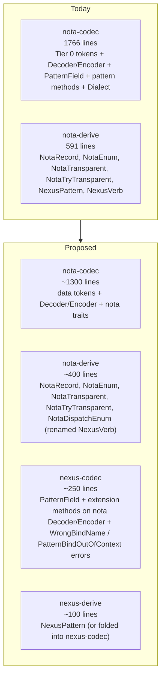
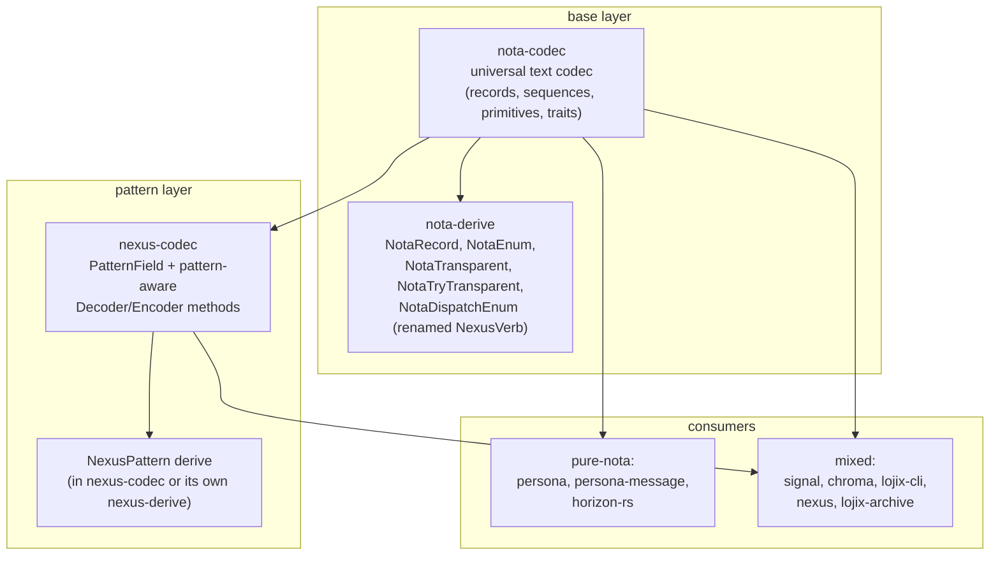
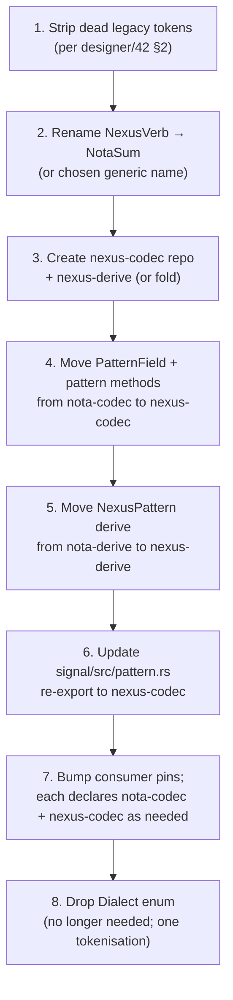

# Extract `nexus-codec` from `nota-codec` — confirm + plan

Status: design analysis answering the user's question
*"is the overlap between nota-codec and nexus necessary, or
can we keep the concerns separate?"*
Author: Claude (designer)

The user's intuition is right and the split is clean. **The
overlap is no longer load-bearing**: with Tier 0 settled
(designer/22–31, designer/38), nexus differs from nota by
exactly one token (`@`) plus the pattern-field machinery.
The original justification for merging — heavy nexus with
many sigils and piped delimiters — is gone. **Today the right
shape is `nexus-codec` layered atop `nota-codec`**, mirroring
the `signal-core` / `signal-persona` layered-effect-crate
pattern that's already working in this workspace.

Two pure-nota consumers (`persona`, `persona-message`) and
several mixed consumers (`signal`, `chroma`, `lojix-cli`,
`nexus`, `lojix-archive`, `horizon-rs`) make the split
materially valuable: pure-nota consumers stop pulling in the
pattern-field machinery; nexus edits stop churning the nota
codec. Plus, the existing `NexusVerb` derive turns out to
have nothing nexus-specific in it — that's a separate naming
fix this report flags but doesn't bundle.

---

## 0 · TL;DR



**The case for confirming the split:**

1. Post-Tier-0, nexus's structural surface is exactly one
   token wider than nota (`@`) plus the `PatternField<T>`
   semantics. The "thick nexus" justification (`~`, `!`, `?`,
   `*`, `(| |)`, `[| |]`, `{ }`, `{| |}`, `=`) is permanently
   dropped per designer/31.
2. There are real **pure-nota consumers** today —
   `persona` (44 nota uses, 0 nexus), `persona-message`
   (22 / 0). They depend on `nota-codec` purely for
   `NotaRecord` and friends.
3. The existing layered-effect-crate pattern
   (`signal-core` ← `signal-persona`) is the right model.
   A `nota-codec` ← `nexus-codec` split mirrors it.
4. The NexusVerb derive is **not actually nexus-specific** —
   it's generic head-ident closed-enum dispatch (used by
   `chroma`'s request/response enums and `signal`'s edit
   operations). Mis-named today; rename + move alongside
   the nota base derives, keep nexus-codec for the actual
   pattern machinery.

Below is the catalogue + dependency analysis + concrete
split plan + migration order.

---

## 1 · What's in `nota-codec` today, by concern

Counting against `f6e49db` and friends (current `main`):

| File | Lines | Concern |
|---|---|---|
| `src/lib.rs` | 24 | re-exports — both |
| `src/error.rs` | 131 | error enum — mixed: pure nota errors + 2 nexus-only errors (`WrongBindName`, `PatternBindOutOfContext`) |
| `src/lexer.rs` | 469 | lexer — mixed: 12 Tier 0 tokens (including `@`) + 11 dropped-form tokens (legacy compat) |
| `src/decoder.rs` | 355 | decoder — mixed: ~80% nota-pure, ~20% pattern methods (`decode_pattern_field`, `peek_is_wildcard`, `peek_is_bind_marker`, plus dead legacy `expect_pattern_record_head` / `expect_pattern_record_end`) |
| `src/encoder.rs` | 245 | encoder — mixed: ~85% nota-pure, ~15% pattern methods (`encode_pattern_field`, `write_wildcard`, `write_bind`, plus dead legacy `start_pattern_record` / `end_pattern_record`) |
| `src/pattern_field.rs` | 73 | nexus-only — `PatternField<T>` |
| `src/traits.rs` | 469 | pure nota — `NotaEncode` / `NotaDecode` + blanket impls |
| `tests/nota_record_round_trip.rs` etc. | — | pure nota (5 files) |
| `tests/nexus_pattern_round_trip.rs` etc. | — | nexus-only (3 files) |
| `tests/lexer_dialect.rs` | — | both |

Dropping the dead legacy paths (per designer/42 §2 — pending
landing) brings the totals down ~80 lines. After that drop,
the **pure-nota slice is roughly 1,300 lines** (lib + error
nota variants + lexer-without-legacy + decoder-without-pattern
+ encoder-without-pattern + traits) and the **nexus slice is
roughly 250 lines** (pattern_field + pattern methods + nexus
error variants).

Same factoring in `nota-derive`:

| Module | Lines | Concern |
|---|---|---|
| `nota_record.rs` | 67 | pure nota |
| `nota_enum.rs` | 65 | pure nota |
| `nota_transparent.rs` | 50 | pure nota |
| `nota_try_transparent.rs` | 58 | pure nota |
| `nexus_pattern.rs` | 93 | nexus-only |
| `nexus_verb.rs` | 119 | **mis-named — it's generic head-ident dispatch, not nexus-specific** (see §4.5) |
| `shared.rs` | 33 | both |
| `lib.rs` | 106 | re-exports |

Pure-nota derives: 4 (240 lines). Nexus-only derive: 1 (93
lines). Mis-named-but-actually-generic: 1 (119 lines).

---

## 2 · The argument — post-Tier-0, nexus is a thin pattern layer

Pre-Tier-0, nexus had:
- Verb sigils: `~ ! ? *`
- Pattern delimiters: `(| |)`
- Atomic-batch delimiters: `[| |]`
- Shape delimiters: `{ }`
- Constrain delimiters: `{| |}`
- Bind alias: `=`
- Plus all of nota.

That's a *substantial* extension. Merging the codecs made
sense — nexus added enough new lexer paths to make a
separate codec mostly-redundant.

Per designer/31 §5, those forms are **permanently dropped**.
Tier 0 nexus has exactly:
- Nota's 11 tokens (`( ) [ ] : ident bool int uint float str bytes`)
- Plus one token: `@` (bind marker)
- Plus the semantic concept of `PatternField<T>` for query
  fields.

The numerical comparison:

| Surface | Before Tier 0 | After Tier 0 |
|---|---|---|
| Nexus-only tokens | 13 (`~`, `@`, `!`, `?`, `*`, `{`, `}`, `(|`, `|)`, `[|`, `|]`, `{|`, `|}`) | **1** (`@`) |
| Nexus-only delimiter pairs | 4 (`(| |)`, `[| |]`, `{ }`, `{| |}`) | **0** |
| Nexus-only verbs | 5 sigil-shaped | **0** (verbs are records) |
| Nexus-only semantic concepts | many (patterns, atomic, shape, constrain) | **1** (PatternField) |

The "thick nexus" that justified the merger is gone. What
remains is **one token + one type** of nexus-specific
machinery — small enough to be its own crate, *because*
it's small. The merger held nexus in nota-codec for
historical reasons; the historical reasons no longer apply.

The signal-core / signal-persona precedent is the right
model: signal-core has the universal Frame envelope, the
SemaVerb spine, and the auth shape; signal-persona has
domain-specific record kinds layered on top. Each crate
owns *one* thing, well. nota-codec ← nexus-codec is the
same cut at a different layer.

---

## 3 · Who consumes what — dependency analysis

Counting matches per consumer for nota-only items
(`NotaRecord`, `NotaEnum`, `NotaTransparent`, `NotaEncode`,
`NotaDecode`) and nexus-only items (`PatternField`,
`NexusPattern`, `Dialect::Nexus`):

| Repo | nota items | nexus items | Bucket |
|---|---|---|---|
| `persona` | 44 | 0 | **pure nota** |
| `persona-message` | 22 | 0 | **pure nota** |
| `chroma` | 25 | 4* | mixed (4 = NexusVerb usage; see §4.5) |
| `lojix-cli` | 13 | 11 | mixed |
| `lojix-archive` | 1 | 4 | mixed |
| `nexus` | 5 | 5 | mixed |
| `signal` | 45 | 59 | mixed |
| `signal-core` | 0 | 0 | none (pre-records) |
| `signal-persona` | 0 | 0 | none (uses its own pattern enums; see §4.4) |
| `horizon-rs` | (uses nota-codec; not surveyed in detail) | 0 | likely pure nota |

(*) the chroma "nexus items" are all `NexusVerb` usages
which, per §4.5, aren't nexus-specific in fact.

**Two clearly pure-nota consumers**: `persona` (the meta
repo's NotaRecord scaffold) and `persona-message` (the NOTA
CLI). Both depend on `nota-codec` strictly for the data-
record codec. Neither uses queries, patterns, or any
nexus-shaped construct.

**One contract crate that re-exports nota-codec's PatternField
without owning it**: `signal/src/pattern.rs`:

```rust
//! `PatternField<T>` — re-exported from `nota-codec`.
pub use nota_codec::PatternField;
```

This re-export is awkward: signal claims (in its
ARCHITECTURE.md §"Owns") to own *"the **pattern field**
type: `PatternField<T>`"*, but the type is defined in
nota-codec and signal just re-exports it. In a layered
world, `PatternField` lives in `nexus-codec`, signal-core
or signal-persona depend on `nexus-codec` for it (or
import it directly), and the awkward re-export disappears.

**Mixed consumers** are still net-better-off after the
split: they declare both `nota-codec` and `nexus-codec`
dependencies, but the boundaries between data-only code
and pattern-aware code become explicit. Editing pattern
machinery doesn't churn data-only code.

---

## 4 · The split, concretely

### 4.1 New crate boundaries



`nota-codec` and `nota-derive` shrink. `nexus-codec` is new.
`nexus-derive` is optional — fold its single derive into
`nexus-codec` if you want one crate per layer (the user's
historical preference; matches `signal-core` / `signal-
persona`'s shape).

### 4.2 What goes where

**`nota-codec` owns**:

- `Lexer`, `Token`, the 12 Tier 0 tokens including `@`. (See
  §4.3 for the rationale on keeping `@` in the universal
  lexer.)
- `Decoder<'input>` with the data-decoding methods only
  (`read_*`, `expect_record_head`, `expect_record_end`,
  `expect_seq_*`, `peek_is_record_end`, `peek_is_seq_end`,
  `peek_record_head`, `peek_token`, etc.).
- `Encoder` with the data-encoding methods only
  (`write_*`, `start_record`, `end_record`, `start_seq`,
  `end_seq`).
- `NotaEncode` + `NotaDecode` traits with their primitive +
  container blanket impls (`u64`, `i64`, `f64`, `bool`,
  `String`, `Vec<T>`, `Option<T>`, etc.).
- `Error` enum with the data-layer variants only
  (`UnexpectedToken`, `ExpectedRecordHead`, `UnexpectedEnd`,
  `IntegerOutOfRange`, `Validation`, `UnknownVariant`,
  `UnknownKindForVerb`, plus lexer errors).

**`nota-derive` owns**:

- `NotaRecord`, `NotaEnum`, `NotaTransparent`,
  `NotaTryTransparent` derives.
- `NexusVerb` *renamed* to a generic name (suggestions in
  §4.5) and kept in `nota-derive` because it's not
  nexus-specific.
- Re-export through `nota-codec`'s `lib.rs`.

**`nexus-codec` owns**:

- `PatternField<T>` enum.
- Extension trait or inherent-impl-block on
  `nota_codec::Decoder` / `nota_codec::Encoder` providing:
  `decode_pattern_field`, `encode_pattern_field`,
  `peek_is_wildcard`, `consume_wildcard`,
  `peek_is_bind_marker`, `write_wildcard`, `write_bind`.
- `WrongBindName` and `PatternBindOutOfContext` error
  variants — either in their own `Error` enum (with
  `#[from]` conversion to/from nota-codec's error) or as
  variants of a unified error type.
- The `NexusPattern` proc-macro derive (or its own
  `nexus-derive` crate if proc-macros need physical
  separation).

The dropped legacy nexus tokens (per designer/42 §2) and
their lexer/decoder/encoder paths leave the workspace
entirely — they're not "moved to nexus-codec," they're
removed everywhere.

### 4.3 The `@` token — keep in the universal lexer

There are two paths for the `@` token at the lexer layer:

| Option | What it looks like | Trade |
|---|---|---|
| **A. Universal lexer** | `nota-codec` lexer recognises all 12 Tier 0 tokens including `@`; nota-only consumers never invoke a method that consumes `@`, so an `@` in nota text fails at parse-time with `UnexpectedToken` | Smaller surface; one lexer; the `@` token is recognisable but unused in nota contexts |
| **B. Nota lexer drops `@`** | `nota-codec` lexer rejects `@` at tokenisation; `nexus-codec` provides its own lexer that adds `@` | Two lexers (or a wrapper); `@` is a tokenisation error in nota contexts (slightly stronger error message) |

**Recommendation: option A.** The cost of option B (a second
lexer or a lexer-wrapper) outweighs the small ergonomic gain
(better error message on stray `@`). The `@` byte is one
character; recognising it universally costs ~3 lines of
lexer code; consumers never receive Token::At unless they
ask. Option A keeps the codec layer simple and the layer
boundary clean.

The `Dialect` enum disappears in option A — there's only
one tokenisation; what consumers do with the result is their
business.

### 4.4 `PatternField<T>` ownership and signal's re-export

`signal/src/pattern.rs` currently re-exports
`nota_codec::PatternField`. Its docstring acknowledges:

> "*`PatternField<T>` — re-exported from `nota-codec`. The
> shape lives in nota-codec because the codec needs to
> pattern-match it during pattern-record encoding/decoding.*"

After the split, `PatternField<T>` lives in `nexus-codec`.
`signal`'s pattern module either:
- Re-exports from `nexus-codec`: `pub use nexus_codec::PatternField`
- Or `signal-core` depends on `nexus-codec` and re-exports
  there (avoiding the per-consumer indirection).

**Sidebar.** `signal-persona` (per the audit in
designer/43) does **not** use `PatternField<T>` at all —
it has its own per-field 3-variant pattern enums
(`MessageRecipientPattern`, `DeliveryStatePattern`, …).
The audit's §3.7 polish note suggested lifting
`PatternField<T>` to a shared crate. *That shared crate is
exactly `nexus-codec` after the split.* The two reports
converge here: signal-persona's pattern duplication is the
visible smell of "no shared layered-effect-crate for
patterns yet"; extracting `nexus-codec` solves both
problems.

### 4.5 NexusVerb is mis-named

The `NexusVerb` derive in `nota-derive/src/nexus_verb.rs`
is described as *"a closed enum whose variants name the
kinds the verb operates on; decoding peeks the head
identifier of the next record and dispatches."*

There is **nothing nexus-specific** in this functionality:

- It produces standard `(VariantName fields…)` records —
  zero use of `@`, `_`, or any nexus-specific token.
- It's used today by `chroma` for request/response enums
  (which aren't sema verbs), `signal` for edit operations
  (assert / mutate / retract — those are universal sema
  verbs, but the derive itself is generic), and similar
  closed-enum-of-records dispatch sites.
- Its codegen reads exactly like a generic
  closed-enum-by-head-ident dispatcher.

The name dates to the original nexus design where verbs
were sigil-prefixed records dispatched this way. Tier 0
made the verbs records, and the derive's role generalised
to any closed-enum-of-records.

**Recommendation:** rename `NexusVerb` to a generic name
that describes what it does. Candidates:

| Name | Notes |
|---|---|
| `NotaSum` | Concise; matches algebraic-sum-type framing |
| `NotaDispatchEnum` | Spells out the behaviour |
| `NotaClosedEnum` | Aligns with rust-discipline §"closed enums" |
| `NotaVerb` | Drops "Nexus" but keeps "Verb" — reads odd since not all uses are verbs |

I lean `NotaSum` (concise; sum-type is the real concept).
Worth a one-liner conversation, then a rename pass + a
deprecated alias for one cycle if the workspace cares to
soften the migration. The rename keeps the derive in
`nota-derive` (where it semantically belongs) instead of
moving it to a nexus-flavoured crate where the name would
keep lying.

This is **not part of the split itself** — it's a separate
clarification the split makes more visible. Could land
before, with, or after.

---

## 5 · Three design questions worth flagging

### 5.1 One nexus crate or two?

`signal-core` is one crate; `signal-persona` is one crate.
The pattern is **one crate per layer**, with proc-macros
either bundled in or in a sibling repo.

For nexus, the choice is:
- **One crate (`nexus-codec`)** containing both the runtime
  code and the `NexusPattern` proc-macro. The proc-macro
  has its own `[lib] proc-macro = true`-flagged sub-crate
  internally if needed (cargo workspaces support this), or
  the runtime imports `proc-macro` from a sibling crate
  via flake input.
- **Two crates (`nexus-codec` + `nexus-derive`)** to mirror
  `nota-codec` + `nota-derive`'s split.

The current nota split (codec + derive as two repos) was a
proc-macro-pragmatism decision. If the same pragmatism
holds for nexus, two crates. If not, one.

I lean **two crates**, mirroring the nota structure. The
discipline pattern is consistent and future maintainers
don't have to reconcile two different codec layouts.

### 5.2 Where do the pattern errors live?

`Error::WrongBindName { expected, got }` and
`Error::PatternBindOutOfContext` are pattern-specific. After
the split, they don't belong in `nota-codec`'s `Error` enum.
Two options:

- **`nexus-codec` defines its own `Error` enum** with
  `From<nota_codec::Error>` so all nexus paths surface a
  single error type. Cleanest type-wise; matches per-crate
  Error discipline (rust-discipline.md §"Errors: typed
  enum per crate").
- **`nota-codec` keeps a generic `Error::Validation(String)`
  variant** that nexus-codec uses to box pattern errors as
  validation failures. Keeps one Error type but loses
  pattern-specific pattern-matching at the consumer.

**Recommendation: option 1**. Per-crate Error enum is the
workspace pattern. Conversion via `#[from]` for
ergonomics.

### 5.3 What about `nexus`'s parser/renderer?

The `nexus` repo (`/git/github.com/LiGoldragon/nexus`) has
`src/parser.rs` and `src/renderer.rs` — daemon-internal
text↔signal translation code. After the split, they
depend on both `nota-codec` (for primitive decoding) and
`nexus-codec` (for pattern decoding). The dependency
diagram gets one more line; the imports get longer; the
content doesn't change.

This is a non-issue — the daemon needs both layers anyway,
because it translates *all* of nexus text, including the
patterns.

---

## 6 · Migration path

A clean staged migration:



Step (1) — the dead-legacy strip from designer/42 — should
land first because it's a precondition for clean factoring;
trying to split with the dead tokens still present means
deciding where they go (and the answer is "nowhere, delete
them," but the deletion is simpler before the split).

Step (2) — rename — is independent. Could run in parallel.

Steps (3)–(5) are the actual extraction. Mechanical. The
type signatures don't change; only the import paths. Each
of (4) and (5) is a single PR.

Step (6) — signal's re-export — is a one-line edit per the
ARCHITECTURE.md / pattern.rs alignment.

Step (7) — consumer pins — needs each consumer's
`Cargo.toml` to add a `nexus-codec = { path/git = "..." }`
line if they use patterns. Pure-nota consumers (persona,
persona-message) need no change. Mixed consumers get the
new dependency.

Step (8) — drop `Dialect` — is the cleanup. After the
split there's nothing for `Dialect` to switch on.

Total work: probably 2–3 commits per crate (nota-codec,
nota-derive, nexus-codec, nexus-derive, signal), plus a
lockfile bump per consumer. Mostly mechanical; the design
work is upfront in this report.

---

## 7 · Recommendations

| # | Action | Reason |
|---|---|---|
| 1 | Confirm the split: extract `nexus-codec` (and `nexus-derive` per §5.1) from `nota-codec` / `nota-derive` | Post-Tier-0 the overlap is small; the merger's historical justification is gone; pure-nota consumers exist and are pulled along by nexus edits today |
| 2 | Per-step migration order in §6 | Strip dead legacy tokens first, then rename `NexusVerb`, then extract; each step is independently safe |
| 3 | Move `PatternField<T>` to `nexus-codec`; signal's `pattern.rs` re-exports from there | Removes the awkward "signal claims to own; nota-codec actually owns" mismatch in signal's ARCHITECTURE.md |
| 4 | Rename `NexusVerb` derive to a generic name (`NotaSum` recommended); keep in `nota-derive` | The derive is mis-named — it's generic head-ident dispatch, not nexus-specific. Already used by chroma/signal/persona-message for non-nexus enums |
| 5 | Drop the `Dialect` enum after the split | One tokenisation; the dialect concept becomes redundant |
| 6 | Per-crate `Error` enums for nota-codec and nexus-codec, with `#[from]` conversion | Workspace discipline (rust-discipline §"Errors: typed enum per crate") |
| 7 | Designer/43 §3.7 (signal-persona pattern duplication) becomes resolvable: lift `signal-persona`'s per-field `*Pattern` enums to `nexus-codec::PatternField<T>` | The audit's deferred polish becomes the natural follow-up after the extraction |

(1)–(3) are the load-bearing work. (4)–(7) are clean
follow-ups that become natural once the split lands.

---

## 8 · Why this confirms (and doesn't deny)

The user's question explicitly framed the choice as "deny
because of technical impossibility, or confirm with a how-
to." There is no technical impossibility. The factoring is
mechanical:

- Lexer: `@` stays in the universal Token enum; one lexer
  for both layers.
- Decoder/Encoder: extension trait or sibling-crate-impl
  pattern adds nexus methods to nota-codec types.
- PatternField: a 3-variant enum with no special derive
  requirements beyond what nota-codec already provides.
- NexusPattern derive: standard proc-macro that emits calls
  into `nexus-codec`'s public API.

There's no circular dependency (nexus-codec depends on
nota-codec; nota-codec doesn't know nexus-codec exists).
There's no shared mutable state (codec types are stateless).
There's no perf cost (the boundary is type-system-only).

The reasons to *not* split would be: cost of more crates,
or material overlap between the layers. The first is real
but small (workspace-managed); the second isn't there
post-Tier-0.

So: **confirmed.** The split is the right shape. §6 has the
migration; §7 has the prioritised actions.

---

## 9 · See also

- `~/primary/reports/designer/22-nexus-state-of-the-language.md`
  — the original audit; named what was lexed but unused.
- `~/primary/reports/designer/23-nexus-structural-minimum.md`
  — picked Tier 0; dropped piped patterns in favour of
  schema-driven disambiguation.
- `~/primary/reports/designer/31-curly-brackets-drop-permanently.md`
  §5 — the locked grammar at 12 token variants; the
  permanent drop of all forms §2 of this report cites.
- `~/primary/reports/designer/38-nexus-tier-0-grammar-explained.md`
  — the canonical Tier 0 grammar reference.
- `~/primary/reports/designer/42-operator-41-and-tier-0-implementation-critique.md`
  §2 — the dead-legacy-tokens strip that's a precondition
  for §6 step 1.
- `~/primary/reports/designer/43-signal-core-and-signal-persona-contract-audit.md`
  §3.7 — the signal-persona pattern duplication that
  resolves once `nexus-codec` provides `PatternField<T>` as
  a shared layered crate.
- `~/primary/skills/contract-repo.md` — the
  layered-effect-crate pattern this split mirrors.
- `~/primary/skills/rust-discipline.md` §"Errors: typed
  enum per crate" — the §5.2 recommendation cite.
- `~/primary/skills/micro-components.md` — the workspace
  rule "one capability, one crate, one repo" supporting the
  split.
- `/git/github.com/LiGoldragon/signal-core/ARCHITECTURE.md`
  — the parent layered-effect pattern.
- `/git/github.com/LiGoldragon/signal-persona/ARCHITECTURE.md`
  — the layered-effect example mirrored here.
- `/git/github.com/LiGoldragon/signal/src/pattern.rs`
  — the awkward re-export §4.4 cleans up.
- `/git/github.com/LiGoldragon/nota-codec/`
  — the crate to be shrunk.
- `/git/github.com/LiGoldragon/nota-derive/`
  — the derive crate where the rename lands.

---

*End report.*
