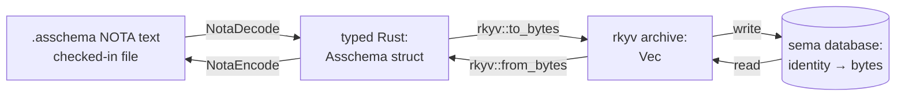
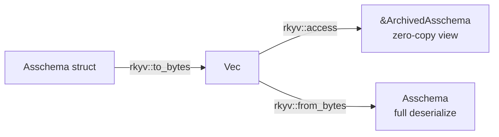
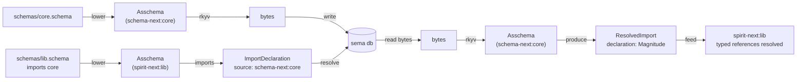
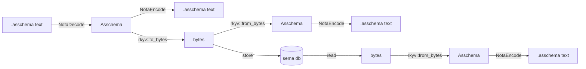
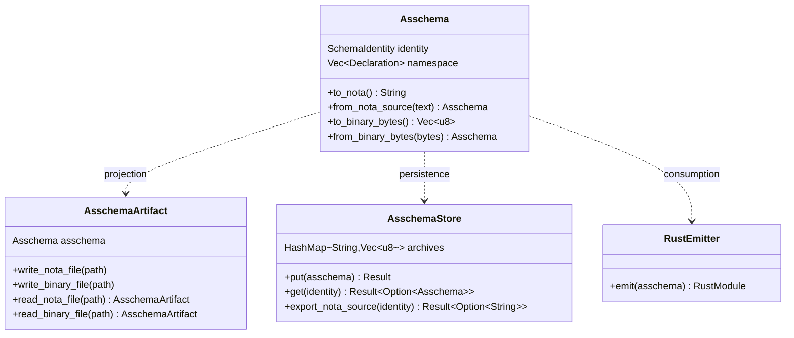

# 441 — Asschema Rust types, rkyv archive, sema database, NOTA round-trip — designer vision

*Kind: vision · Topics: asschema, rust-types, rkyv-archive, sema-database, nota-roundtrip, three-categories, derived-codec, storage-substrate, cross-crate-resolution · 2026-05-31 · designer lane*

**Read alongside `reports/operator/264-asschema-typed-data-rkyv-sema-nota-presentation-2026-05-31.md`** — operator's parallel presentation lifted the same Spirit-1270/1271 prompt into a presentation grounded in live code. This designer report is the forward-vision companion: it pre-applies the natural refactor that makes `Declaration` carry both type and macro kinds (the same gap operator 263 Gap 1 names as "macro-table nouns still hand-written"), names module-prefixing semantics as an open question for psyche call, and frames the Stage 5 self-hosting horizon. The intent is that operator's report shows what runs today; this report shows what the architecture wants to become.

This report presents the full picture of how assembled schema lives as Rust types, persists as rkyv archives in a sema database, and re-exports back to `.asschema` NOTA text through the same nota-derived types. The vision uses Spirit record 1270's three-category framing as the architectural anchor: macro declarations + type declarations + namespace, with module-qualified identity carrying cross-module / cross-crate references. Spirit record 1271 (Maximum, the prompt that drives this report and operator 264) names rkyv-in-SEMA + NOTA re-export through the same Nota-derived types as the explicit invariant. The four surfaces — checked-in NOTA text, in-memory typed Rust, rkyv binary, sema-database storage — are projections of the same data, with the derives as the equivalence proof.

## 1. The one picture



All four surfaces carry the SAME Asschema. The Rust derives are the proof:

- `#[derive(rkyv::Archive, rkyv::Serialize, rkyv::Deserialize)]` makes Rust↔bytes.
- `#[derive(nota_next::NotaDecode, nota_next::NotaEncode)]` makes Rust↔NOTA text.
- Together: text↔Rust↔bytes↔sema-db, all lossless.

The invariant is: any Asschema in any one of the four corners projects losslessly to any other.

## 2. The three categories — Spirit 1270

> Assembled schema is a typed Rust data model with a NOTA projection. Its Rust types include macro declarations, type declarations, and namespaces for reusable declarations; names must remain unique through module-qualified identity so assembled schema can refer to types from other modules, libraries, and crates.

Three categories:

1. **Macro declarations** — typed records describing macros: name, position, pattern, template.
2. **Type declarations** — typed records describing types: Struct, Enum, Newtype.
3. **Namespace** — the storage holding both kinds, indexed by name. Module-qualified names (`schema-next:core:Topic`) make cross-crate references possible.

The current `schema-next` has type declarations and the namespace; macro declarations live in a parallel `MacroLibraryArtifact` and need to be lifted into Asschema (operator 263 Gap 1). This report assumes that lift is done when drawing the Rust types in §3 — the Gap A shape below is the forward target, not the current code.

## 3. The Rust types

### `Asschema` — the root product

```rust
#[derive(
    rkyv::Archive,
    rkyv::Serialize,
    rkyv::Deserialize,
    nota_next::NotaDecode,
    nota_next::NotaEncode,
    Clone, Debug, Eq, PartialEq,
)]
pub struct Asschema {
    identity: SchemaIdentity,
    imports: Vec<ImportDeclaration>,
    resolved_imports: Vec<ResolvedImport>,
    input: EnumDeclaration,
    output: EnumDeclaration,
    namespace: Vec<Declaration>,
}
```

The current state (schema-next `3b58cc7`) has all six fields; the only change for Gap A is widening `Declaration` so its `namespace` carries both kinds.

### `SchemaIdentity` — the module-qualified name + version

```rust
#[derive(rkyv::Archive, rkyv::Serialize, rkyv::Deserialize,
         nota_next::NotaDecode, nota_next::NotaEncode,
         Clone, Debug, Eq, Hash, PartialEq)]
pub struct SchemaIdentity {
    name: Name,         // "schema-next:core"
    version: Version,   // [0.1.0]
}
```

`Name` is the module-qualified identifier used everywhere a name appears:

```rust
#[derive(rkyv::Archive, rkyv::Serialize, rkyv::Deserialize,
         Clone, Debug, Eq, Hash, PartialEq)]
pub struct Name(String);

impl Name {
    pub fn namespace_segments(&self) -> Vec<&str> { self.0.split(':').collect() }
    pub fn local_part(&self) -> &str { ... }       // last segment
    pub fn qualifies_as_symbol_name(&self) -> bool { ... }
}

impl NotaEncode for Name {
    fn to_nota(&self) -> String {
        if self.qualifies_as_symbol_name() {
            self.as_str().to_owned()              // bare symbol form
        } else {
            NotaString::new(self.as_str()).format()   // bracket-string form
        }
    }
}
```

A `Name` of `"Topic"` encodes as the bare symbol `Topic`; a `Name` of `"schema-next:core:Topic"` is still a single colon-segmented symbol if it qualifies (no whitespace, no punctuation). The NotaDecode side mirrors: bare symbols at name positions become `Name(value)`.

### `Declaration` — both kinds, after Gap A

```rust
#[derive(rkyv::Archive, rkyv::Serialize, rkyv::Deserialize,
         nota_next::NotaDecode, nota_next::NotaEncode,
         Clone, Debug, Eq, PartialEq)]
pub struct Declaration {
    pub visibility: Visibility,
    pub name: Name,
    pub value: DeclarationValue,
}

#[derive(rkyv::Archive, rkyv::Serialize, rkyv::Deserialize,
         nota_next::NotaDecode, nota_next::NotaEncode,
         Clone, Debug, Eq, PartialEq)]
pub enum DeclarationValue {
    Type(TypeDeclaration),
    Macro(MacroDeclaration),
}

pub enum Visibility {
    Public,
    Private,
}
```

### `TypeDeclaration` — the three type shapes

```rust
pub enum TypeDeclaration {
    Struct(StructDeclaration),
    Enum(EnumDeclaration),
    Newtype(NewtypeDeclaration),
}

pub struct StructDeclaration {
    pub name: Name,
    pub fields: StructFieldMap,         // ordered field-name → TypeReference
}

pub struct EnumDeclaration {
    pub name: Name,
    pub variants: Vec<EnumVariant>,
}

pub struct EnumVariant {
    pub name: Name,
    pub payload: Option<TypeReference>,
}

pub struct NewtypeDeclaration {
    pub name: Name,
    pub reference: TypeReference,
}
```

### `MacroDeclaration` — the new category

```rust
pub struct MacroDeclaration {
    pub name: Name,
    pub position: MacroPosition,
    pub pattern: MacroPattern,
    pub template: MacroTemplate,
}

pub enum MacroPosition {
    RootImports,
    RootInput,
    RootOutput,
    RootNamespace,
    NamespaceDeclaration,
    StructFields,
    EnumVariants,
    TypeReference,
}
```

`MacroPattern` and `MacroTemplate` are the nota-next macro-pattern + capture types already used by the schema's macro-node mechanism (Spirit record 1263, operator 261). After Gap A they become the wire form for macro declarations stored inside Asschema:

```rust
pub struct MacroPattern {
    pub elements: Vec<MacroPatternObject>,
}

pub enum MacroPatternObject {
    Capture(Option<MacroCaptureName>),
    RestCapture(Option<MacroCaptureName>),
    Atom(Option<MacroAtom>),
    Delimited(Option<MacroPatternDelimited>),
}
```

(The exact substructure already exists in `core.asschema`'s type declarations — `SchemaMacro`, `MacroPattern`, `MacroPatternObject`, etc. — what Gap A adds is making those types carry their instances inside Asschema's namespace, not just declaring the types.)

### `TypeReference` — the leaf

```rust
#[derive(rkyv::Archive, rkyv::Serialize, rkyv::Deserialize,
         Clone, Debug, Eq, PartialEq)]
#[rkyv(
    bytecheck(bounds(__C: rkyv::validation::ArchiveContext)),
    serialize_bounds(__S: rkyv::ser::Writer),
    deserialize_bounds(__D::Error: rkyv::rancor::Source)
)]
pub enum TypeReference {
    String,
    Integer,
    Boolean,
    Path,
    Plain(Name),                                        // declared name (possibly module-qualified)
    Vector(#[rkyv(omit_bounds)] Box<TypeReference>),
    Map(#[rkyv(omit_bounds)] Box<TypeReference>,
        #[rkyv(omit_bounds)] Box<TypeReference>),
    Optional(#[rkyv(omit_bounds)] Box<TypeReference>),
}
```

Cross-module type references appear as `Plain(Name("schema-core:mail:Magnitude"))`. The Rust emitter, reading `resolved_imports`, knows which dependency the qualified name belongs to and emits `use schema_core::mail::Magnitude` instead of redeclaring.

### `ImportDeclaration` and `ResolvedImport` — cross-crate wiring

```rust
pub struct ImportDeclaration {
    pub local_name: Name,                  // how this asschema refers to it
    pub source: TypeReference,             // where it comes from (declared)
}

pub struct ResolvedImport {
    pub local_name: Name,
    pub dependency_identity: SchemaIdentity,    // module-qualified identity of the dependency
    pub dependency_declaration: Declaration,    // the actual resolved declaration
}
```

A `ResolvedImport` is produced when the lowerer reads `imports` against an actual dependency Asschema (loaded from a sema db, a `.asschema` file, or another in-memory Asschema). Once resolved, the emitter uses it to produce `use` statements instead of redeclaring the type.

## 4. rkyv storage — the binary substrate

Every Asschema type derives `rkyv::Archive`, `rkyv::Serialize`, `rkyv::Deserialize`. This produces three artifacts:

1. **`ArchivedAsschema`** — the rkyv-archived form, a separate Rust type with the same field layout as `Asschema` but using rkyv archived primitives (e.g., `ArchivedVec<ArchivedDeclaration>` for `Vec<Declaration>`).
2. **`to_bytes` / `from_bytes`** — round-trip Rust↔bytes.
3. **Zero-copy access** — bytes can be cast to `&ArchivedAsschema` without allocation for read-only queries.

```rust
impl Asschema {
    pub fn to_binary_bytes(&self) -> Result<Vec<u8>, SchemaError> {
        rkyv::to_bytes::<rkyv::rancor::Error>(self)
            .map(|bytes| bytes.to_vec())
            .map_err(|_| SchemaError::ArchiveEncode)
    }

    pub fn from_binary_bytes(bytes: &[u8]) -> Result<Self, SchemaError> {
        rkyv::from_bytes::<Self, rkyv::rancor::Error>(bytes)
            .map_err(|_| SchemaError::ArchiveDecode)
    }
}
```

Properties of the rkyv archive:

- **Deterministic byte layout** — same Asschema produces same bytes; suitable for content-addressing and content-based equality.
- **Byte-stable across versions** — variant discriminants stay stable as long as source enum order is preserved (Spirit 1249 documented the lesson on Magnitude discriminants).
- **Cheap reads** — `unsafe { rkyv::access_unchecked::<ArchivedAsschema>(bytes) }` gives a zero-copy view of a known-valid archive; the safe `rkyv::access` adds a bytecheck pass.



Use the zero-copy view when reading; allocate the full `Asschema` only when mutating or when the caller wants owned data.

## 5. Sema database storage — the persistence substrate

A "sema database" is a typed-record store with rkyv as the wire format and module-qualified identities as keys. The Spirit daemon's redb-backed sema database is one instance; any Asschema-storing daemon (e.g., a future `persona-schema` daemon) can use the same shape.

```rust
// Schema for an Asschema-storing sema database
pub struct AsschemaSemaRecord {
    pub identity: SchemaIdentity,
    pub archived: Vec<u8>,           // rkyv-serialized Asschema
    pub recorded: SemaInstant,       // daemon-stamped time
}

// In the redb table:
//   key:   SchemaIdentity            (module-qualified, version-stamped)
//   value: archived Asschema bytes   (rkyv)
```

Read and write flow:

```rust
impl AsschemaStore {
    pub fn write(&mut self, asschema: &Asschema) -> Result<(), StoreError> {
        let bytes = asschema.to_binary_bytes()?;
        let record = AsschemaSemaRecord {
            identity: asschema.identity().clone(),
            archived: bytes,
            recorded: self.stamp.now(),
        };
        self.redb.put(record.identity.clone(), &record.to_binary_bytes()?)?;
        Ok(())
    }

    pub fn read(&self, identity: &SchemaIdentity) -> Result<Option<Asschema>, StoreError> {
        let Some(record_bytes) = self.redb.get(identity)? else { return Ok(None); };
        let record = AsschemaSemaRecord::from_binary_bytes(&record_bytes)?;
        Asschema::from_binary_bytes(&record.archived).map(Some)
    }
}
```

The sema db becomes the backend for cross-asschema resolution:



The resolver reads the dependency Asschema from the sema db by identity, then looks up the imported declaration by name. The lookup is the same call (`type_named()`) regardless of whether the dependency came from a `.asschema` file or a sema db record — the substrate is interchangeable.

## 6. NOTA re-export — the text projection

The same Asschema also has `NotaDecode` / `NotaEncode` derives. So once bytes round-trip back to typed Rust, the NOTA text projection is one method call away:

```rust
impl Asschema {
    pub fn to_nota(&self) -> String {
        NotaEncode::to_nota(self)
    }

    pub fn from_nota_source(source: &str) -> Result<Self, SchemaError> {
        NotaSource::new(source).parse::<Self>().map_err(SchemaError::from)
    }
}

impl AsschemaStore {
    pub fn export_to_nota_text(&self, identity: &SchemaIdentity) -> Result<String, StoreError> {
        let asschema = self.read(identity)?.ok_or(StoreError::NotFound)?;
        Ok(asschema.to_nota())
    }
}
```

The text projection of `schema-next:core` (real content from `schemas/core.asschema` today):

```nota
((schema-next:core [0.1.0])
 []                                                <- imports
 []                                                <- resolved_imports
 (Input [])                                        <- input EnumDeclaration
 (Output [])                                       <- output EnumDeclaration
 [(Public CoreSchema (Struct (CoreSchema {builtin_macro_positions (Plain BuiltinMacroPositions)
                                          builtin_macro_shapes (Plain BuiltinMacroShapes)
                                          builtin_macro_outputs (Plain BuiltinMacroOutputs)
                                          builtin_macro_definitions (Plain BuiltinMacroDefinitions)})))
  (Public SchemaMacro (Struct (SchemaMacro {macro_name (Plain MacroName)
                                            macro_position (Plain MacroPosition)
                                            macro_pattern (Plain MacroPattern)
                                            macro_template (Plain MacroTemplate)})))
  ...
 ])
```

After Gap A — namespace carrying both kinds:

```nota
[(Public Topic (Type (Newtype (Topic String))))
 (Public Kind (Type (Enum (Kind [(Decision None) (Principle None) (Correction None)
                                 (Clarification None) (Constraint None)]))))
 (Public Entry (Type (Struct (Entry {topics (Plain Topics) kind (Plain Kind)
                                     description (Plain Description) magnitude (Plain Magnitude)}))))
 (Public StructMacro (Macro (StructMacro RootNamespace
                                          [[(Atom (Some pascal-case))
                                            (Delimited (Some (BraceMap struct-fields)))]]
                                          (StructDeclaration ...))))
 ...
]
```

The two `(Public ... (Type ...))` and `(Public ... (Macro ...))` forms come from `DeclarationValue`'s NotaEncode derive: enum variants encode as `(VariantName payload)` at parenthesis positions per nota-next's canonical encoding.

## 7. The round-trip invariant — four corners equivalent



The freshness tests (e.g., `core_asschema_artifact_is_checked_in_and_fresh`) verify text↔Rust round-trip. The rkyv round-trip (`core_asschema_artifact_round_trips_as_nota_and_rkyv`) verifies Rust↔bytes. Together they prove the four-corner equivalence.

Algebraically:

```text
from_nota_source(to_nota(asschema)) == asschema           (text round-trip)
from_binary_bytes(to_binary_bytes(asschema)) == asschema  (rkyv round-trip)
sema_store.read(asschema.identity()) == Some(asschema)    (sema-db round-trip)
```

Any Asschema in any of the four corners projects losslessly to any other. The derives are the proof.

## 8. The re-export path — bytes back into asschema text

The user's stated path is "store as rkyv in a sema db and re-export into asschema, through the nota-derived types." Concretely:

```rust
// 1. Author or compute an Asschema (in Rust)
let asschema = SchemaEngine::default()
    .lower_source(include_str!("../schemas/core.schema"),
                  SchemaIdentity::new("schema-next:core", "0.1.0"))?;

// 2. Serialize as rkyv and persist to sema db
let mut store = AsschemaStore::open("schemas.sema")?;
store.write(&asschema)?;

// 3. Read bytes back from sema db (zero-copy or full deserialize)
let recovered: Asschema = store.read(&asschema.identity())?.unwrap();

// 4. Re-export as NOTA text (through the nota-derived NotaEncode)
let nota_text: String = recovered.to_nota();

// 5. Write to a .asschema file — checked-in artifact form
fs::write("schemas/core.asschema", &nota_text)?;
```

The same NotaEncode that produces the `.asschema` file from a freshly-lowered Asschema also produces it from one recovered from rkyv bytes. The text is byte-equal because the Rust value is byte-equal — round-trip via rkyv preserves all state.

This is the answer to "how does an Asschema in a sema db become an `.asschema` file again": the sema-db record is rkyv bytes; rkyv deserializes to Rust; Rust uses the NOTA derive to project as text. The derives are doing the work; no custom export logic is required.

## 9. What this enables

1. **Cross-crate type references** — `ResolvedImport` carries the dependency's identity; the sema db serves the dependency Asschema; the emitter uses dependency-declared types. Already wired in the checked-in path at `schema-rust-next` `src/lib.rs:117` and `src/lib.rs:337` (`RustImport::from_resolved_import`); once a sema db replaces the file-based dependency source, the lookup is `store.read(import.dependency_identity)` instead of `AsschemaArtifact::read_nota_file(import.dependency_path)`.
2. **Multi-language emission** — the same Asschema bytes drive a Rust emitter; a future TypeScript or Python emitter reads the same bytes. The bytes are the language-independent contract.
3. **Schema evolution / diff / upgrade** — `Asschema::diff(old: &Asschema, new: &Asschema) -> AsschemaDiff` produces a typed diff. Upgrade tooling reads both Asschemas from the sema db, computes the diff, emits migration code (designer 435 Gap D, operator 253 Gap D).
4. **Stage 5 self-hosting** — `core.asschema` declares the Asschema and Declaration shapes themselves (the macro types and most of the type-declaration types are already there). The next slice replaces hand-written Asschema Rust with schema-emitted Asschema Rust. The schema-of-schema is itself a schema.
5. **Live introspection** — a running daemon can introspect its own typed contract by reading its own Asschema bytes from the sema db, decoding to typed Rust, projecting to NOTA text for diagnostics. Persona introspection (the `persona-introspect` direction) becomes "show me my Asschema" — a deterministic, contract-stable operation.

## 10. The honest current state

| layer | status |
|---|---|
| Asschema typed Rust model with rkyv + NOTA derives | ✓ live (Spirit 1246, operator 252) |
| Input/Output as direct fields (no fake wrappers) | ✓ live (Spirit 1267/1268, schema-next `3b58cc7`) |
| Cross-crate refs via `resolved_imports` → emitter | ✓ wired (`schema-rust-next` src/lib.rs:117, 337) |
| Module-qualified `Name` (colon-segmented) | ⚠️ supported by `Name`; not enforced at declaration storage. Three plausible readings of Spirit 1270's "always module-prefixed" — psyche call needed. |
| Macro declarations as first-class Declarations in Asschema | ⏳ Operator 263 Gap 1. Currently macros live in `MacroLibraryArtifact`. |
| Sema database for Asschema storage | ✓ live in `schema-next` main (`84ce382`, `src/store.rs`, 202 lines, redb-backed `TableDefinition<&str, &[u8]>`). Operator promoted from designer prototype `f2b477a` with a typed `AsschemaStoreKey` and structured `SemaDatabaseOperation` errors. |
| Positional root reading + bare input/output bodies (no outer paren wrapper, no Input/Output labels) | ⏳ Per Spirit 1274 + 1277 (Maximum corrections, 2026-05-31). Current `.asschema` text shows `((identity) [] [] (Input ...) (Output ...) [...])` with outer wrapper and label-style input/output — both confuse positional struct fields with data-carrying variants. The reader should consume root fields positionally from document root objects (no outer paren); input/output positions should carry bare enum bodies (no labeled wrapper). |
| Schema-emitted Asschema Rust (Stage 5 self-hosting) | ⏳ Pending Gap A + module-prefixing call + macro-table noun emission (operator 262 §"Next Move" step 1). |

## 11. Prototype landed — `AsschemaStore` with four-corner constraint tests

**Update (2026-05-31)**: Operator promoted the prototype to production main at `schema-next` `84ce382` (`schema: persist asschema artifacts in sema store`). The promoted version lives at `src/store.rs` (202 lines) with the same `put` / `get` / `export_nota_source` surface, swapped to redb (`TableDefinition<&str, &[u8]>`), with a typed `AsschemaStoreKey` newtype replacing the prototype's `format!()` string and a structured `SemaDatabaseOperation` enum for error variants. The prototype below is preserved as the original derivation; the production version is the canonical reference.

The four-object logic separation from Spirit record 1272 is now demonstrated in a runnable prototype on a designer feature branch:

- **Branch**: `designer-store-prototype` on `schema-next`
- **Commit**: `f2b477a` — `schema: AsschemaStore prototype with four-corner round-trip constraint tests`
- **File**: `tests/store_roundtrip_prototype.rs` (single integration test file)
- **Verified**: 7/7 constraint tests pass; `cargo fmt` + `cargo clippy --tests -- -D warnings` clean
- **Promoted to production**: `schema-next` main `84ce382` — `src/store.rs`

The prototype materializes the fourth object — `AsschemaStore` — as a minimal typed surface wrapping a `HashMap<String, Vec<u8>>` so the constraint tests run in-process without filesystem state. The production substrate swaps the HashMap for a redb table (per `spirit-next/src/store.rs`) without changing the put / get / export_nota_source surface.

### 11.1 The four objects, realized



Each arrow is a derive-driven projection: `NotaEncode` produces text, `rkyv::to_bytes` produces bytes, and `AsschemaStore::put` is two lines of glue over the derives.

### 11.2 The `AsschemaStore` surface

```rust
struct AsschemaStore {
    archives: HashMap<String, Vec<u8>>,
}

impl AsschemaStore {
    fn put(&mut self, asschema: &Asschema) -> Result<(), SchemaError> {
        let key = AsschemaStore::key_for(asschema.identity());
        let bytes = asschema.to_binary_bytes()?;
        self.archives.insert(key, bytes);
        Ok(())
    }

    fn get(&self, identity: &SchemaIdentity) -> Result<Option<Asschema>, SchemaError> {
        let key = AsschemaStore::key_for(identity);
        let Some(bytes) = self.archives.get(&key) else {
            return Ok(None);
        };
        Asschema::from_binary_bytes(bytes).map(Some)
    }

    fn export_nota_source(
        &self,
        identity: &SchemaIdentity,
    ) -> Result<Option<String>, SchemaError> {
        let Some(asschema) = self.get(identity)? else {
            return Ok(None);
        };
        Ok(Some(AsschemaArtifact::new(asschema).to_nota_source()))
    }

    fn key_for(identity: &SchemaIdentity) -> String {
        format!("{}@{}", identity.component().as_str(), identity.version())
    }
}
```

That's the whole surface. Three operations — `put`, `get`, `export_nota_source` — each one or two lines after the derives do their work. The "no glue code" claim of §7 is now literal: `put` is `to_binary_bytes + insert`; `export_nota_source` is `get + to_nota_source`.

### 11.3 The seven constraint tests

| # | Test | Constraint proven |
|---|---|---|
| 1 | `constraint_text_roundtrip_through_artifact` | `NotaEncode`/`NotaDecode` derives form an identity round-trip on `Asschema`. |
| 2 | `constraint_bytes_roundtrip_through_artifact` | `rkyv::Archive`/`Serialize`/`Deserialize` derives form an identity round-trip. |
| 3 | `constraint_store_then_export_matches_direct_text` | Store-then-export NOTA text byte-equals direct-encode NOTA text — the four-corner equivalence proof. |
| 4 | `constraint_module_qualified_identity_keys_the_store` | Module-qualified identity (`Name(":")`-segmented) acts as the persistence key; missing identities return `None`, not stale data. |
| 5 | `constraint_independent_asschemas_coexist_in_store` | Two asschemas with different identities round-trip independently — no shared state inside the store. |
| 6 | `constraint_four_corner_equivalence_via_derives_only` | Four corners (Rust, text, bytes, store) recover byte-equal Asschemas; no custom logic between any pair. |
| 7 | `constraint_text_store_text_is_byte_stable` | text → store → text is byte-stable across cycles (deterministic encode). |

Test output:

```text
running 7 tests
test constraint_bytes_roundtrip_through_artifact ... ok
test constraint_store_then_export_matches_direct_text ... ok
test constraint_text_store_text_is_byte_stable ... ok
test constraint_text_roundtrip_through_artifact ... ok
test constraint_four_corner_equivalence_via_derives_only ... ok
test constraint_module_qualified_identity_keys_the_store ... ok
test constraint_independent_asschemas_coexist_in_store ... ok

test result: ok. 7 passed; 0 failed; 0 ignored; 0 measured; 0 filtered out
```

### 11.4 What the prototype proves and what it doesn't

**Proved.**

1. The four-object separation from Spirit 1272 is mechanical to realize: each object's responsibility is one or two derive calls or a HashMap insert/get.
2. The four-corner round-trip invariant from §7 holds in practice — `direct_text == store_export_text` is byte-equal under derives alone.
3. Module-qualified identity is a workable persistence key — `format!("{}@{}", component, version)` is a stable canonical wire key.
4. No custom serialization logic is needed between any pair of corners. The derives are the contract.

**Not yet proved.**

1. **Production redb substrate.** The prototype uses `HashMap`; the real `.sema` substrate is redb-backed (per `spirit-next/src/store.rs`). Translation is mechanical — the operator has the live redb pattern next to this prototype.
2. **`DeclarationValue::Macro` round-trip.** The prototype uses today's `Declaration` (TypeDeclaration only). Once Gap A lands, an eighth constraint test (`constraint_macro_declaration_round_trips_through_all_corners`) will prove the four-corner invariant holds for the new macro kind too.
3. **Cross-asschema reference resolution from the store.** The prototype stores independent asschemas; the next step is reading a dependency's asschema from the store at lowering time and feeding it into `ResolvedImport` construction.

### 11.5 Open questions still standing — psyche call needed

These don't block the prototype but need a call before the production substrate lands:

1. **Module-prefixing semantics** (§10 row 4). The current behavior — bare name within the declaring asschema, qualified at cross-module reference — is what the prototype demonstrates and what the live `core.asschema` uses. If reading (a) "always-qualified storage" is chosen, `key_for` stays the same but every declared `Name` in `core.asschema` gets rewritten to its qualified form, inflating the wire.
2. **Store key shape.** The prototype uses `format!("{}@{}", component, version)` (matches operator 264 §"Asschema In A SEMA Database" sketch). The redb substrate could use the same string key or a tuple key `(component, version)` with `TableDefinition<(&str, &str), &[u8]>`. The string key is simpler; the tuple is more typed.
3. **Store-as-cache vs store-as-truth.** Is the `.sema` store a cache that always defers to checked-in `.asschema` text files, or is it the authoritative source that text files are exported from? The prototype is symmetric (text → store, store → text both work); production deployment needs the call.

### 11.6 Adapting the prototype later — the operator path

1. Lift `AsschemaStore` from `tests/store_roundtrip_prototype.rs` into its own module (`src/store.rs` in `schema-next`) or a new crate (`schema-store`).
2. Replace `HashMap<String, Vec<u8>>` with `redb::TableDefinition<&str, &[u8]>` — the same pattern as `spirit-next/src/store.rs`. The `put` / `get` / `export_nota_source` signatures stay identical.
3. Add the missing surface methods (open/close database, list identities, remove by identity, write to disk path).
4. Promote the seven constraint tests to integration tests against the real redb-backed store with a temporary directory fixture.
5. Once Gap A's `DeclarationValue::Macro` lands, add a `constraint_macro_declaration_round_trips_through_all_corners` test.
6. Once cross-asschema reference resolution from the store is wired, add a `constraint_cross_asschema_resolution_through_store` test that reads a dependency's asschema from the store and verifies the resolved import resolves correctly.

## 12. Recommendations for the next slice

1. **Psyche call on module-prefixing semantics.** Three plausible readings of Spirit 1270's "always module-prefixed": (a) always-qualified storage — every declared name in the asschema is stored as `<identity>:Name`; (b) reference-time only — bare within the declaring asschema, qualified when crossing modules (current behaviour); (c) canonical wire form — stored qualified for interchange, exposed bare in the Rust API. Without that call, Gap A's data-model choices are premature.
2. **Then lift `Declaration` to carry `DeclarationValue::Type | DeclarationValue::Macro`** (§3 here; operator 263 Gap 1 names the macro-table-as-data closure). Migrate `core.asschema` and `builtin-macros.macro-library` toward a unified Asschema carrying both kinds.
3. **Promote `AsschemaStore` from prototype to production substrate** (§5 + §11 here). The HashMap-backed prototype on branch `designer-store-prototype` proves the surface and the four-corner invariant; the production substrate replaces the HashMap with a redb table per `spirit-next/src/store.rs` without changing the put / get / export_nota_source signatures. Initial deploy can be an embedded redb in `schema-next` for build-time use or a separate `persona-schema` daemon for runtime cross-asschema lookup.
4. **Add `cross_crate_type_reference_emits_dependency_use` test** to lock the resolved-imports wire that §9.1 / §10 verify exists but doesn't have explicit emission test coverage.
5. **Defer Stage 5 mirror** until §12.1-3 complete and `core.asschema` actually carries both kinds of declarations.

## 13. Connection to existing work

- `reports/operator/262-total-architecture-core-macro-artifacts-2026-05-30.md` — total stack tour after the macro library artifact landed.
- `reports/operator/263-unimplemented-gap-audit-2026-05-31.md` — operator's 8-gap audit. §10-11 here align with operator 263's Gap 1 (macro-table nouns) and pick up the module-prefixing semantics question as a new designer-side open question.
- `reports/operator/264-asschema-typed-data-rkyv-sema-nota-presentation-2026-05-31.md` — operator's parallel presentation grounded in live code; companion to this report.
- `reports/operator/253-schema-gap-closure-vision.md` — the original five-gap framing.
- `reports/designer/435-vision-for-the-four-remaining-gaps.md` — the four-gap parallel vision.
- `reports/operator/255-schema-next-move-after-leans.md` — the macro-table-from-core.schema vision.
- `reports/operator/261-nota-layer-macro-node-stack-implementation.md` — the macro-node stack at NOTA layer.
- Spirit records: 1246 (live asschema artifact), 1249 (rkyv discriminant stability lesson), 1259 (strict brace), 1263 (macro nodes at NOTA layer), 1267/1268/1269 (notation honesty), 1270 (three categories + module-qualified + cross-crate), 1271 (rkyv-in-SEMA + NOTA re-export through derived types), 1272 (four-object logic separation: Asschema + AsschemaArtifact + AsschemaStore + RustEmitter), 1274 (asschema reader consumes root fields positionally — no outer paren wrapper), 1277 (input/output positions are known struct fields, not data-carrying variants — drop the `(Input ...)` / `(Output ...)` label form).
- Prototype: `schema-next` branch `designer-store-prototype` (`f2b477a`), `tests/store_roundtrip_prototype.rs` — `AsschemaStore` + seven constraint tests proving the four-corner round-trip invariant.
- Production promotion: `schema-next` main `84ce382` (`schema: persist asschema artifacts in sema store`) — `src/store.rs`, redb-backed, with typed `AsschemaStoreKey` and structured `SemaDatabaseOperation` errors.
