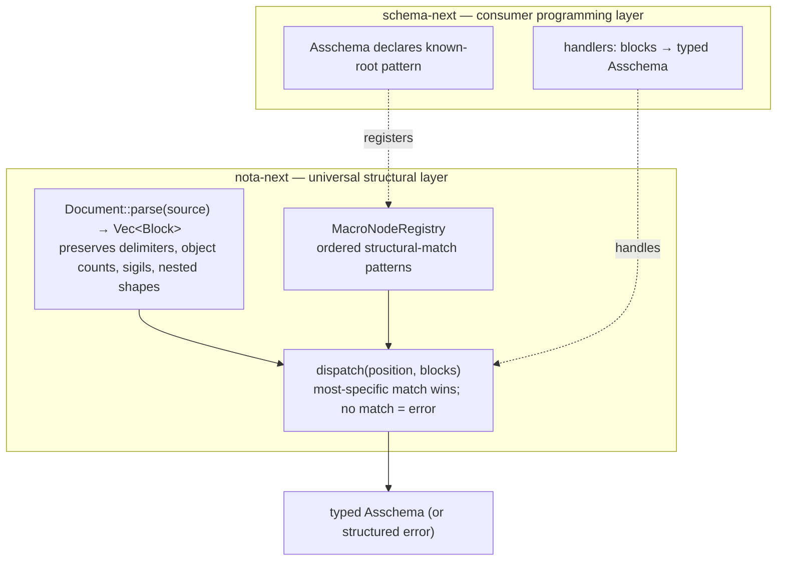

# 442 — Known-root NOTA anti-pattern flag + the elegant path

*Kind: audit · Topics: nota-next, schema-next, known-root, structural-macro-dispatch, two-layer-parser, anti-pattern, derive-attribute, position-predicate, macro-node-at-document-root · 2026-05-31 · designer lane*

The psyche flagged operator's `daff76a` (`schema: emit asschema as known-root document`) as exactly the anti-pattern Spirit 1278 forbids. Operator's intent capture is comprehensive (1278 / 1279 / 1280 cover the three threads cleanly), but the implementation in `src/asschema.rs` of `daff76a` short-circuits both NOTA layers with bespoke string concatenation. This report names the contradiction and proposes the elegant path: a `known-root` derive option in nota-next that produces positional document-root encoding/decoding, hooked into the macro-node-at-NOTA-layer mechanism (Spirit 1263) at the document-root position. Schema-next declares Asschema is a known root; the derive and the macro-node mechanism do the work; no bespoke `to_nota` joins strings.

## 1. What operator captured (and the captures are good)

Three Spirit records, all at 2026-05-31 11:06:54:

- **1278** (Correction, Maximum) — "Known-root NOTA serialization must not be implemented as ad hoc field string joins on each schema object. A file read as a known root type is already the root body; the NOTA layer should expose an object/body parsing and encoding abstraction that reads and writes the ordered fields of the known type."
- **1279** (Principle, Maximum) — "NOTA extension programming is structural matching over nodes. The parser first preserves raw delimiter structure, object counts, sigils, and nested block shapes; then ordered macro-node definitions match that structure using constraints, most-specific first, and absence of a match is a formatting or specification error."
- **1280** (Clarification, High) — "Schema should prefer structural macros over text macros. A macro definition language should express constraints over nested NOTA structure, such as delimiter type, child count, symbol qualification, sigil, and constraints on child positions; text macros are only a later fallback if structural macros cannot express enough."

Together these cover the psyche's full message: the file-is-the-paren rationale (1274 + reinforced by 1278), the two-layer parsing architecture (1279), the ordered constraint-vector language (1279), structural over text macros (1280), and the no-match-as-error semantics (1279).

## 2. What operator implemented in `daff76a` (and why it contradicts 1278)

Commit `daff76a` (`schema-next` main, 2026-05-31 12:27:22 — 80 minutes after capture) changes `Asschema::to_nota`:

```rust
pub fn to_nota(&self) -> String {
    [
        self.identity.to_nota(),
        self.imports.to_nota(),
        self.resolved_imports.to_nota(),
        self.input.variants.to_nota(),
        self.output.variants.to_nota(),
        self.namespace.to_nota(),
    ]
    .join("\n")
}
```

This is exactly what 1278 names as the anti-pattern: "ad hoc field string joins on each schema object." Six `.to_nota()` calls concatenated with `\n` is the bespoke schema-side encoding logic 1278 says must not exist. The hand-rolled decoder is the symmetric case:

```rust
fn from_nota_document_fields(fields: &[Block]) -> Result<Self, SchemaError> {
    Ok(Self {
        identity: super::SchemaIdentity::from_nota_block(&fields[0])?,
        imports: Vec::<ImportDeclaration>::from_nota_block(&fields[1])?,
        resolved_imports: Vec::<super::ResolvedImport>::from_nota_block(&fields[2])?,
        input: EnumDeclaration::new(
            Name::new("Input"),
            Vec::<EnumVariant>::from_nota_block(&fields[3])?,
        ),
        output: EnumDeclaration::new(
            Name::new("Output"),
            Vec::<EnumVariant>::from_nota_block(&fields[4])?,
        ),
        namespace: Vec::<Declaration>::from_nota_block(&fields[5])?,
    })
}
```

Six hand-typed positional reads. The name `Name::new("Input")` is hard-coded into the function rather than declared as a structural property. This is the schema side carrying logic that belongs in the NOTA layer (1278's "NOTA layer should expose an object/body parsing and encoding abstraction").

The contradiction is between the capture (1278: "don't do ad hoc field string joins") and the implementation 80 minutes later (a 7-line ad hoc field string join in `to_nota` + a 12-line hand-rolled positional decoder in `from_nota_document_fields`). The capture is right; the implementation is the exact pattern the capture forbids.

This is what the psyche means by "this is what I was worried about actually" — they wrote 1278 to prevent precisely this code shape, and the code shape landed anyway because the right substrate (the NOTA-layer abstraction) doesn't exist yet, so operator filled the gap with hand-rolled glue.

## 3. The elegant path — where the logic belongs

The two-layer architecture from Spirit 1279:



The schema side declares the pattern; the NOTA side does the dispatch. No hand-rolled string joins; no hand-typed positional reads. Two natural ways to expose the abstraction:

### Option (a) — a `known_root` derive attribute on nota-next

```rust
// nota-next derive macro recognizes #[nota(known_root)]
#[derive(NotaDecode, NotaEncode, rkyv::Archive, rkyv::Serialize, rkyv::Deserialize, ...)]
#[nota(known_root)]
pub struct Asschema {
    identity: SchemaIdentity,
    imports: Vec<ImportDeclaration>,
    resolved_imports: Vec<ResolvedImport>,
    #[nota(name = "Input")]
    input: EnumDeclaration,
    #[nota(name = "Output")]
    output: EnumDeclaration,
    namespace: Vec<Declaration>,
}
```

The derive sees `#[nota(known_root)]` and emits `from_document` / `to_document` methods that:
- On encode: emit the fields' NOTA forms separated by whitespace as document root_objects (no outer paren wrapper, no concatenated `\n`-joined hand-rolled code)
- On decode: consume the document's `root_objects()` positionally
- Per-field `#[nota(name = "Input")]` annotations tell the derive how to project sub-types (here: read EnumDeclaration's variants vector at the field position, fill the `name` field with the literal `"Input"`)

Schema-next gets zero hand-rolled NOTA logic. The derive owns the wire shape.

### Option (b) — register Asschema as a structural-macro at document-root position

```rust
// schema-next registers at startup
let asschema_root = MacroNodeDefinition {
    name: Name::new("AsschemaRoot"),
    position: PositionPredicate::DocumentRoot,
    pattern: Pattern::positional(vec![
        PatternElement::TypeShape::<SchemaIdentity>,
        PatternElement::TypeShape::<Vec<ImportDeclaration>>,
        PatternElement::TypeShape::<Vec<ResolvedImport>>,
        PatternElement::TypeShape::<Vec<EnumVariant>>,  // input variants
        PatternElement::TypeShape::<Vec<EnumVariant>>,  // output variants
        PatternElement::TypeShape::<Vec<Declaration>>,
    ]),
    expected: "asschema known root",
};
registry.register(asschema_root);
```

At parse time, nota-next reads `Document::parse(source) → root_objects`, then dispatches at `DocumentRoot` position against the registry. The Asschema pattern matches, captures fire, the handler constructs the typed Asschema. Same answer through different machinery.

### Recommendation — both, but (a) first

Option (a) is the natural extension of existing derives and shippable in one nota-next change. Option (b) is the long-term unification under the macro-node-at-NOTA-layer framing (1263). They compose: the derive in (a) emits code that internally uses the macro-node-registry from (b) once both land. Operator's slice should ship (a) first to retire the `daff76a` hand-roll, then (b) lands as part of the broader macro-node-at-NOTA work.

## 4. The migration path

1. **nota-next slice** — Add `#[nota(known_root)]` derive attribute support. Emit `from_document(document: &Document) -> Result<Self, NotaDecodeError>` and `to_document(&self) -> String` methods on the annotated type. The emitted code reads/writes positional fields from `document.root_objects()`. Per-field `#[nota(name = "Input")]` is a sub-attribute that tells the derive how to fill a literal Name into a sub-struct's name field at that position.
2. **schema-next slice** — Replace the hand-rolled `Asschema::from_nota_document_fields` and the hand-rolled `Asschema::to_nota` with the derive-emitted `from_document` / `to_document`. Both retire to one-line wrappers (or get removed if `from_nota_source` calls `Document::parse` then `from_document` directly).
3. **Constraint test** — Add a `to_nota` byte-stability test that asserts the new derive-emitted output matches a checked-in fixture exactly. This locks the encoding shape so future changes can't drift it back into a hand-roll.
4. **Macro-node-at-document-root slice** (later) — Lift the `known_root` mechanism into a `MacroNodeDefinition` at `PositionPredicate::DocumentRoot`. The derive's emitted code becomes a thin shim over `registry.dispatch(DocumentRoot, &document.root_objects())`. This closes the loop on Spirit 1263 (macro nodes at NOTA layer) by extending it to the document root, not just nested positions.

## 5. What the elegant path proves about 1279

The two-layer architecture in 1279 means the NOTA layer is universal: every consumer (schema, configs, intent records, deploy manifests) gets the same structural parser + the same macro-node-registry dispatch mechanism. The consumer's job is to register patterns; the NOTA layer's job is to dispatch and emit. The current `daff76a` violates this by putting schema-specific dispatch and emission logic inside `schema-next` — that's the layer-violation 1278/1279 forbid.

After the elegant path:
- `nota-next` owns the parser + the registry + the dispatch + the derive
- `schema-next` declares "Asschema is a known root"; everything else is derive-emitted
- The Asschema `from_nota_source` / `to_nota` shrinks to one or two lines
- Future consumers register their own known-roots without re-implementing positional dispatch

This is the same elegance pattern as Spirit 1272's four-object separation: each object/layer owns one responsibility; the surface stays small because the derives + macro-nodes do the work.

## 6. What the prototype side can build

The `designer-store-prototype` branch on `schema-next` (`f2b477a`) already demonstrates the four-corner round-trip for `AsschemaStore`. A parallel prototype on `nota-next` could demonstrate the `#[nota(known_root)]` derive option:

- Branch idea: `designer-known-root-derive` on `nota-next`
- File: `tests/known_root_prototype.rs` (or `examples/known_root_demo.rs`)
- Build a small typed struct (`RootDocument` or similar) with `#[nota(known_root)]`
- Constraint tests asserting: document parse + positional dispatch + encode-without-outer-paren

This would give operator a runnable substrate to lift into `nota-next`'s derive macros, the same way `AsschemaStore` lifted from prototype to `schema-next/src/store.rs` at `84ce382`. I'm not building it in this report (the report's scope is the audit + path); flagging as an option for the next designer slice.

## 7. The narrow point worth restating

Operator captured 1278 correctly. The capture says "the NOTA layer should expose an object/body parsing and encoding abstraction." Operator did NOT then expose that abstraction in `nota-next`; they wrote bespoke code in `schema-next` to ship the visible behaviour. That is the contradiction. The fix is to land the abstraction in `nota-next` (Option (a) — `#[nota(known_root)]` derive attribute) and have `schema-next` use it. Until that lands, every consumer that wants a known-root document repeats the same hand-rolled pattern, and that pattern is exactly 1278's anti-pattern.

## 8. Connection to existing work

- `reports/operator/264-asschema-typed-data-rkyv-sema-nota-presentation-2026-05-31.md` — operator's presentation of the asschema typed-data + rkyv + SEMA stack.
- `reports/operator/263-unimplemented-gap-audit-2026-05-31.md` — operator's 8-gap audit; this report adds the "ad hoc known-root encoding in schema-next instead of NOTA-layer abstraction" gap.
- `reports/operator/261-nota-layer-macro-node-stack-implementation.md` — the macro-node-at-NOTA-layer mechanism (Spirit 1263) is the substrate for Option (b) in §3 here.
- `reports/designer/441-asschema-types-rkyv-sema-roundtrip.md` — the four-object logic separation (Spirit 1272); the elegant path here is the same pattern applied to the NOTA encoding layer.
- `reports/designer/438-macro-nodes-at-nota-layer-vision-focused-on-critical-parts.md` — the five-critical-decisions vision; Option (b) here is the natural extension to document-root position.
- Schema-next commits: `daff76a` (the anti-pattern landing) — `src/asschema.rs:166-225`. The audit recommends reverting these specific functions to derive-emitted forms once the nota-next slice lands.
- Spirit records: 1263 (macro nodes at NOTA layer), 1272 (four-object logic separation), 1274 (positional root reading), 1277 (input/output as struct fields not variants), 1278 (anti-pattern flag + NOTA-layer abstraction), 1279 (two-layer structural matching + ordered constraints + no-match-as-error), 1280 (structural macros preferred over text macros).
