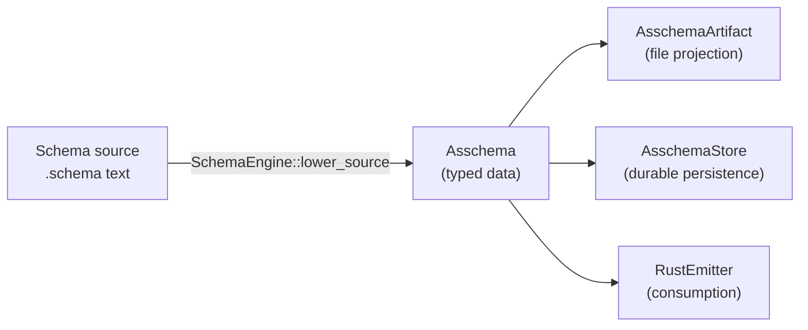
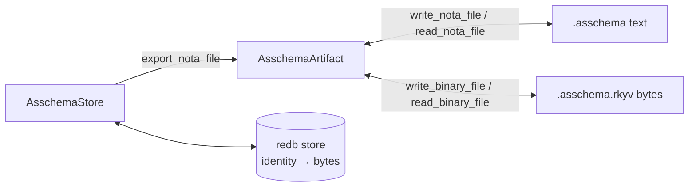
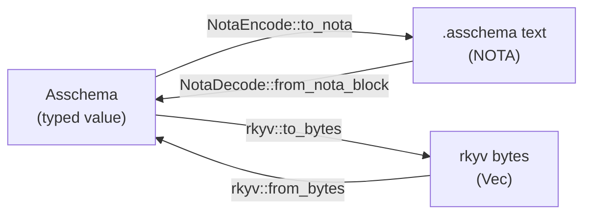
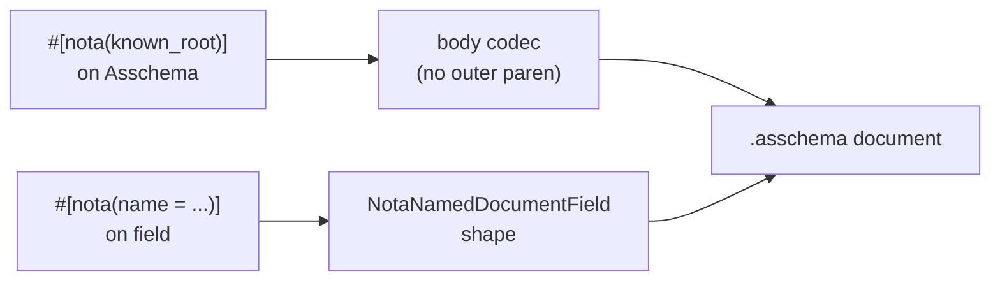
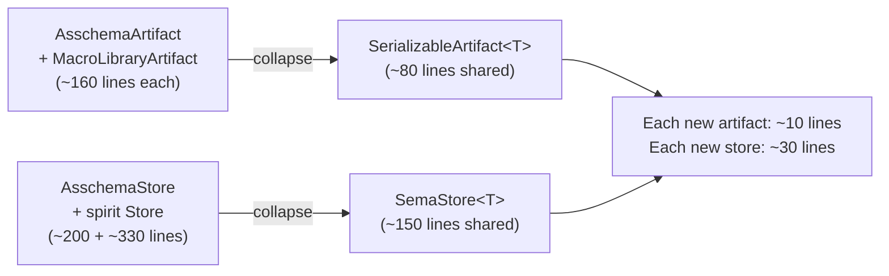

# 1 — The Four Logical Planes

*Kind: vision · Topics: four-object-separation, asschema, asschema-artifact, asschema-store, rust-emitter, derive-driven, generic-substrate · 2026-05-31 · designer lane sub-agent*

## Frame: one elegance

Spirit record 1272 (Maximum, 2026-05-30) named the four-object separation as the architectural cleavage of the schema stack:

> Logically, an Asschema is an Asschema, an AsschemaArtifact is an Asschema with file I/O, an AsschemaStore is a database to persist Asschemas, and a RustEmitter is the thing that uses an Asschema to produce a Rust file.

Each of the four types owns ONE responsibility, and only one. The data lives in `Asschema`. The file projection (text + binary) lives in `AsschemaArtifact`. The durable persistence lives in `AsschemaStore`. The consumer that walks the typed value and emits Rust source lives in `RustEmitter`. Every cross-cutting concern — text encoding, byte encoding, redb cycle, identity keying, Rust generation — sits in exactly one of the four planes. The corner-to-corner edges (Rust ↔ NOTA, Rust ↔ rkyv) are carried by derives on `Asschema`'s field types; the planes around `Asschema` are tiny because the derives do the work.

Why the separation is elegant: every plane's surface methods are one-to-three lines after the derives. `AsschemaArtifact::write_nota_file` is `fs::write(path, asschema.to_nota())`. `AsschemaStore::put_asschema` is `to_binary_bytes + insert`. `RustEmitter::emit_file_from_artifact` is `emit_file(artifact.asschema())`. There is no parsing, no encoding, no glue between the planes — only field access. The four planes are projections of the same value, and the derives are the proof.

## Plane 1: Asschema (data)

### Responsibility

Owns the typed Rust data model of a fully-lowered, macro-expanded, import-resolved schema. `Asschema` is the in-memory value — fields, identity, nested type declarations, resolved imports — with NO knowledge of files, databases, or Rust emission. It IS the data. The codec derives (`rkyv::Archive` + `nota_next::NotaDecode/NotaEncode`) give the corner-to-corner edges; the inherent methods on `Asschema` only call into those derives.

### Signature

```rust
// schema-next/src/asschema.rs:85-106
#[derive(
    rkyv::Archive,
    rkyv::Serialize,
    rkyv::Deserialize,
    nota_next::NotaDecode,
    nota_next::NotaEncode,
    Clone,
    Debug,
    Eq,
    PartialEq,
)]
#[nota(known_root)]
pub struct Asschema {
    identity: super::SchemaIdentity,
    imports: Vec<ImportDeclaration>,
    resolved_imports: Vec<super::ResolvedImport>,
    #[nota(name = "Input")]
    input: EnumDeclaration,
    #[nota(name = "Output")]
    output: EnumDeclaration,
    namespace: Vec<Declaration>,
}
```

The `#[nota(known_root)]` attribute names this struct as the root of an asschema document — the codec consumes the document body without an outer parenthesis wrapper (per Spirit 1278 + nota-next `14ad2f8`). The `#[nota(name = "Input")]` / `#[nota(name = "Output")]` attributes name the input/output fields as positional struct fields, not data-carrying variants (per Spirit 1277).

The supporting identity (`schema-next/src/engine.rs:16-30`) carries the same derive set:

```rust
#[derive(rkyv::Archive, rkyv::Serialize, rkyv::Deserialize,
         nota_next::NotaDecode, nota_next::NotaEncode,
         Clone, Debug, Eq, PartialEq)]
pub struct SchemaIdentity {
    component: Name,
    version: String,
}
```

### Surface methods

```rust
// schema-next/src/asschema.rs:108-191
impl Asschema {
    // accessors
    pub fn identity(&self) -> &SchemaIdentity { ... }
    pub fn imports(&self) -> &[ImportDeclaration] { ... }
    pub fn resolved_imports(&self) -> &[ResolvedImport] { ... }
    pub fn input(&self) -> &EnumDeclaration { ... }
    pub fn output(&self) -> &EnumDeclaration { ... }
    pub fn input_and_output(&self) -> [&EnumDeclaration; 2] { ... }
    pub fn namespace(&self) -> &[Declaration] { ... }
    pub fn type_named(&self, name: &str) -> Option<&TypeDeclaration> { ... }
    pub fn root_named(&self, name: &str) -> Option<&EnumDeclaration> { ... }

    // corner-to-corner edges — pure delegation to derives
    pub fn from_nota_source(source: &str) -> Result<Self, SchemaError> {
        NotaSource::new(source).parse_document_body().map_err(SchemaError::from)
    }
    pub fn to_nota(&self) -> String { self.to_nota_document_body().to_nota() }
    pub fn from_binary_bytes(bytes: &[u8]) -> Result<Self, SchemaError> {
        rkyv::from_bytes::<Self, rkyv::rancor::Error>(bytes)
            .map_err(|_| SchemaError::ArchiveDecode)
    }
    pub fn to_binary_bytes(&self) -> Result<Vec<u8>, SchemaError> {
        rkyv::to_bytes::<rkyv::rancor::Error>(self)
            .map(|bytes| bytes.to_vec()).map_err(|_| SchemaError::ArchiveEncode)
    }
}
```

Per schema-next `57bab60` (Asschema's NOTA codec is now derive-driven, per designer 442), the hand-rolled `[...].join("\n")` shape is GONE. `to_nota` delegates to `to_nota_document_body().to_nota()` which is the macro-emitted document body codec from nota-next `14ad2f8`. The anti-pattern from designer 442 is fixed.

### Where it lives

- Type declaration: `schema-next/src/asschema.rs:85-106`
- Surface methods: `schema-next/src/asschema.rs:108-191`
- SchemaIdentity: `schema-next/src/engine.rs:16-47`

### Not its job

- **No file I/O** — `read_nota_file` belongs to `AsschemaArtifact`.
- **No persistence** — `put_asschema` belongs to `AsschemaStore`.
- **No Rust emission** — `emit_file` belongs to `RustEmitter`.
- **No lowering** — `Asschema` is the OUTPUT of lowering. Macro-expansion + import-resolution live in `SchemaEngine::lower_*` (`schema-next/src/engine.rs:217-331`), which produces an `Asschema` and hands it off.

The plane's discipline: any logic that takes an `Asschema` and either changes its representation (text, bytes, persistence) or consumes it (Rust emission) belongs in one of the other three planes.

## Plane 2: AsschemaArtifact (file projection)

### Responsibility

Owns the NOTA-text and rkyv-byte file projection of an `Asschema` — the `.asschema` and `.asschema.rkyv` artifacts on disk. `AsschemaArtifact` is a thin wrapper around `Asschema` that adds the four file-IO operations (read/write × text/binary). Everything substantive — the encoding work — is done by the derives on the inner `Asschema`; the artifact carries only path + IO-error mapping.

### Signature

```rust
// schema-next/src/asschema.rs:193-196
#[derive(Clone, Debug, Eq, PartialEq)]
pub struct AsschemaArtifact {
    asschema: Asschema,
}
```

Note: `AsschemaArtifact` does NOT carry any derive macros for serialization — it is purely a runtime file-IO wrapper. Serialization is delegated to its inner `Asschema`.

The private path helper `AsschemaArtifactPath` (`schema-next/src/asschema.rs:254-276`) holds a `PathBuf` and projects `std::io::Error` to `SchemaError::Io { path, reason }`. That projection is the artifact's only original work.

### Surface methods

```rust
// schema-next/src/asschema.rs:198-252
impl AsschemaArtifact {
    // wrap / unwrap
    pub fn new(asschema: Asschema) -> Self { ... }
    pub fn asschema(&self) -> &Asschema { ... }
    pub fn into_asschema(self) -> Asschema { ... }

    // four corner-to-corner edges — pure delegation to Asschema's derives
    pub fn from_nota_source(source: &str) -> Result<Self, SchemaError> {
        Asschema::from_nota_source(source).map(Self::new)
    }
    pub fn to_nota_source(&self) -> String { self.asschema.to_nota() }
    pub fn from_binary_bytes(bytes: &[u8]) -> Result<Self, SchemaError> {
        Asschema::from_binary_bytes(bytes).map(Self::new)
    }
    pub fn to_binary_bytes(&self) -> Result<Vec<u8>, SchemaError> {
        self.asschema.to_binary_bytes()
    }

    // four file-IO operations — the artifact's reason for existing
    pub fn read_nota_file(path: impl AsRef<Path>) -> Result<Self, SchemaError> { ... }
    pub fn write_nota_file(&self, path: impl AsRef<Path>) -> Result<(), SchemaError> { ... }
    pub fn read_binary_file(path: impl AsRef<Path>) -> Result<Self, SchemaError> { ... }
    pub fn write_binary_file(&self, path: impl AsRef<Path>) -> Result<(), SchemaError> { ... }
}
```

Each file-IO method is two-to-four lines: build an `AsschemaArtifactPath`, call `fs::read` or `fs::write`, then either delegate to the Asschema codec method (read) or write the codec output (write). The IO-error projection is the only original logic.

### Where it lives

- Type declaration: `schema-next/src/asschema.rs:193-196`
- Surface methods: `schema-next/src/asschema.rs:198-252`
- Path helper: `schema-next/src/asschema.rs:254-276`

### Not its job

- **No data ownership** — it wraps an `Asschema`. Anyone needing the data calls `.asschema()` or `.into_asschema()`.
- **No persistence** — the artifact writes to filesystem PATHS, not to a database keyed by identity.
- **No emission** — anyone needing Rust source reads the artifact's inner `Asschema` and passes it to `RustEmitter`.
- **No codec logic** — `from_nota_source` delegates to `Asschema::from_nota_source`. The artifact never touches NOTA blocks or rkyv bytes directly.

Per designer 443 sub-agent 2 (Finding 1): the artifact pattern is generalizable. The eight method shapes are identical between `AsschemaArtifact` and `MacroLibraryArtifact` — `~160 lines of pure duplication per owner` — which motivates the `SerializableArtifact<T>` generic substrate (see "The generic-substrate horizon" below).

## Plane 3: AsschemaStore (durable persistence)

### Responsibility

Owns the durable rkyv persistence of asschemas, keyed by module-qualified identity. `AsschemaStore` is a redb-backed database (`TableDefinition<&str, &[u8]>`) that maps `<component>@<version>` keys to rkyv-archived bytes. Every operation is a redb transaction (begin → open table → mutate or read → commit) projected through typed errors (`SchemaError::SemaDatabase { operation: SemaDatabaseOperation, reason }`).

**This plane JUST LANDED.** `schema-next` `84ce382` (`schema: persist asschema artifacts in sema store`) promoted the prototype from designer 441 to production main, at `src/store.rs` (203 lines), with a typed `AsschemaStoreKey` newtype and the structured `SemaDatabaseOperation` enum.

### Signature

```rust
// schema-next/src/store.rs:12-18
const ASSEMBLED_SCHEMAS: TableDefinition<&str, &[u8]> = TableDefinition::new("assembled-schemas");

#[derive(Debug)]
pub struct AsschemaStore {
    database: Database,
    path: PathBuf,
}

// schema-next/src/store.rs:187-202
#[derive(Clone, Debug, Eq, PartialEq)]
pub struct AsschemaStoreKey { value: String }

impl AsschemaStoreKey {
    pub fn from_identity(identity: &SchemaIdentity) -> Self {
        Self { value: format!("{}@{}", identity.component().as_str(), identity.version()) }
    }
    pub fn as_str(&self) -> &str { &self.value }
}

// schema-next/src/engine.rs:169-178
#[derive(Clone, Copy, Debug, Eq, PartialEq)]
pub enum SemaDatabaseOperation {
    Open, BeginRead, BeginWrite, OpenTable, Read, Write, Commit,
}
```

`AsschemaStore` is intentionally NOT serializable — it's a runtime resource (database connection + path). Storage is rkyv-only at the value layer; NOTA is only an export projection. Every redb call site projects its specific failure to one `SemaDatabaseOperation` variant — no string-shaped error categories. Per Spirit 1271's rkyv-in-SEMA discipline and the typed-noun rule (`skills/rust/errors.md`).

### Surface methods

```rust
// schema-next/src/store.rs:20-185
impl AsschemaStore {
    // lifecycle
    pub fn open(path: impl Into<PathBuf>) -> Result<Self, SchemaError> { ... }
    pub fn path(&self) -> &Path { &self.path }

    // identity-keyed writes (two flavors of "put" — Asschema OR Artifact wrapper)
    pub fn put_asschema(&self, asschema: &Asschema) -> Result<(), SchemaError> { ... }
    pub fn put_artifact(&self, artifact: &AsschemaArtifact) -> Result<(), SchemaError> { ... }

    // identity-keyed reads
    pub fn get_artifact(&self, identity: &SchemaIdentity) -> Result<Option<AsschemaArtifact>, SchemaError> { ... }
    pub fn get_asschema(&self, identity: &SchemaIdentity) -> Result<Option<Asschema>, SchemaError> { ... }

    // export through the artifact plane — store reads bytes, deserializes, hands to artifact for NOTA write
    pub fn export_nota_file(&self, identity: &SchemaIdentity, path: impl AsRef<Path>) -> Result<(), SchemaError> { ... }

    // size queries
    pub fn len(&self) -> Result<u64, SchemaError> { ... }
    pub fn is_empty(&self) -> Result<bool, SchemaError> { ... }
}
```

Each method is a redb cycle: `begin_write` → `open_table` → `insert`/`get`/`len` → (for writes) `commit`. The cycle pattern is identical across operations; the variant differs only in the table operation and the key/value types passed.

`export_nota_file` is the cross-plane composition that proves the four-corner round-trip in one method: it reads from the store (rkyv bytes), reconstructs the artifact (via `AsschemaArtifact::from_binary_bytes`), and writes the NOTA file (via the artifact's `write_nota_file`). The derives glue it together.

### Where it lives

- Type declaration: `schema-next/src/store.rs:14-18`
- Lifecycle: `schema-next/src/store.rs:20-45`
- Write surface: `schema-next/src/store.rs:47-87`
- Read surface: `schema-next/src/store.rs:89-136`
- Size queries: `schema-next/src/store.rs:138-160`
- Key + error operation: `schema-next/src/store.rs:187-202` + `schema-next/src/engine.rs:169-178`

### Not its job

- **No NOTA-keyed access** — keys are `<component>@<version>` strings derived from `SchemaIdentity`, NOT NOTA text.
- **No NOTA persistence** — the store holds rkyv bytes ONLY. NOTA text is reconstructed on demand from the rkyv-archived value (per Spirit 1271).
- **No data ownership of new asschemas** — the store does not LOWER `.schema` source. It accepts already-lowered values from callers.
- **No emission** — anyone needing Rust source calls `get_asschema(identity)` and passes the result to `RustEmitter`.
- **No store-of-stores** — one `AsschemaStore` is one database file. Discovery across files belongs to a higher layer.

Per designer 443 sub-agent 4 (Finding 3): the redb-cycle scaffolding is duplicated between `spirit-next/src/store.rs` (~333 lines) and `schema-next/src/store.rs` (~203 lines). The lift target is `SemaStore<T: SemaEngine>` — see "The generic-substrate horizon" below.

## Plane 4: RustEmitter (consumption)

### Responsibility

Owns the consumption of a typed `Asschema` into Rust source. `RustEmitter` walks the asschema namespace, converts each declaration into a `RustDeclaration`, organizes them into a `RustModule`, and renders the module to a `RustCode` string. It is the schema stack's consumer — the destination side of the derive-driven round-trip.

`RustEmitter` lives in `schema-rust-next`, a SEPARATE crate from `schema-next`. The split enforces the boundary: an `Asschema` is independent of its consumers; the same Asschema bytes can drive a Rust emitter today, a TypeScript emitter tomorrow, a Python emitter the day after.

### Signature

```rust
// schema-rust-next/src/lib.rs:9-22, 24-37, 85-94
#[derive(Clone, Debug, Eq, PartialEq)]
pub struct GeneratedFile { pub path: String, pub code: RustCode }

#[derive(Clone, Debug, Eq, PartialEq)]
pub struct RustCode(String);

#[derive(Clone, Debug)]
pub struct RustEmitter {
    generator_name: &'static str,
    options: RustEmissionOptions,
}

#[derive(Clone, Debug, Eq, PartialEq)]
pub struct RustModule {
    file_path: String,
    generator_name: String,
    scalar_aliases: Vec<RustScalarAlias>,
    imports: Vec<RustImport>,
    declarations: Vec<RustDeclaration>,
    root_enums: Vec<RustEnum>,
    support: RustSupportModel,
    options: RustEmissionOptions,
}

// schema-rust-next/src/lib.rs:211-214, 266-271
#[derive(Clone, Debug, Eq, PartialEq)]
pub struct RustEmissionOptions { pub nota_surface: NotaSurface }

#[derive(Clone, Debug, Eq, PartialEq)]
pub enum NotaSurface {
    AlwaysEnabled,
    FeatureGated { feature: String },
    Disabled,
}
```

`RustEmitter` is a configuration-bearing facade. The real model is `RustModule` — an intermediate typed value (the "asschema-shape projected into Rust-shape") that walks the asschema in one direction and renders to source in the other. The intermediate model is what lets a future binary-only emitter, a TypeScript emitter, or any consumer share the walk without re-traversing the asschema. `NotaSurface` is the codec-opt-in toggle from designer 430 — the daemon-only build sets `NotaSurface::Disabled` and the binary lives without `nota-next` in its dependency closure; the CLI/launcher sets `NotaSurface::FeatureGated { feature: "nota-text" }` (the default).

### Surface methods

```rust
// schema-rust-next/src/lib.rs:39-82
impl RustEmitter {
    pub fn new(options: RustEmissionOptions) -> Self { ... }

    // four entry points — directly from Asschema or via Artifact, or from file paths
    pub fn emit_file(&self, asschema: &Asschema) -> GeneratedFile { ... }
    pub fn emit_file_from_artifact(&self, artifact: &AsschemaArtifact) -> GeneratedFile { ... }
    pub fn emit_file_from_nota_path(&self, path: impl AsRef<Path>) -> Result<GeneratedFile, SchemaError> { ... }
    pub fn emit_file_from_binary_path(&self, path: impl AsRef<Path>) -> Result<GeneratedFile, SchemaError> { ... }

    // the intermediate model
    pub fn emit_module(&self, asschema: &Asschema) -> RustModule { ... }
    pub fn emit(&self, asschema: &Asschema) -> RustCode { ... }
}

// schema-rust-next/src/lib.rs:96-196
impl RustModule {
    pub fn from_asschema(asschema: &Asschema, generator_name: impl Into<String>, options: RustEmissionOptions) -> Self { ... }
    pub fn render(&self) -> RustCode { ... }
    // + accessors for declarations / imports / root_enums / declaration_named
}
```

The `emit_file_from_*` methods compose with the artifact plane: `emit_file_from_nota_path` delegates to `AsschemaArtifact::read_nota_file` and then `emit_file(artifact.asschema())`. The emitter never reads files directly — it goes through the artifact plane.

### Where it lives

- Emitter type: `schema-rust-next/src/lib.rs:24-82`
- RustModule (intermediate model): `schema-rust-next/src/lib.rs:85-196`
- Sub-types (RustDeclaration, RustStruct, RustEnum, RustNewtype, RustField, RustEnumVariant, etc.): `schema-rust-next/src/lib.rs:348-521`
- RustEmissionOptions + NotaSurface: `schema-rust-next/src/lib.rs:198-297`
- RustWriter (rendering walk): `schema-rust-next/src/lib.rs:662-1554`

### Not its job

- **No file I/O for asschema input** — the emitter goes through `AsschemaArtifact` to read input. It cannot read `.asschema` files directly.
- **No persistence** — generated `.rs` is returned as `GeneratedFile { path, code }` for the caller to write.
- **No NOTA codec on RustModule** — `RustModule` is the in-memory consumer model with NO `NotaDecode/NotaEncode` or `rkyv` derives. NOT serializable on purpose; a `RustModuleArtifact` could land later if a consumer needs one.
- **No data validation** — validity (well-formed types, resolved imports, no dangling references) is the lowerer's job in `SchemaEngine`. The emitter assumes a valid input.
- **No multi-language emission** — TypeScript / Python emitters would live in `schema-typescript-next` / `schema-python-next` consuming the same `Asschema`.

## How the four planes compose

The composition graph emphasizes the ONE entry into the data plane (lowering) and the FOUR projections out of it:



The asschema is the single source of typed truth. Every plane around it is a projection — the file plane produces `.asschema` / `.asschema.rkyv`; the store plane produces redb-archived bytes keyed by identity; the emitter plane produces Rust source. The artifact and store can also flow back into asschema (read from file → asschema; read from store → asschema), but the diagram shows the forward composition.

The cross-plane composition between artifact and store deserves its own zoom:



`export_nota_file` is the cross-plane composition: the store reads its rkyv bytes, hands them to `AsschemaArtifact::from_binary_bytes`, and then writes via `write_nota_file`. The four-corner round-trip (Spirit 1271 + 1272) becomes one method call.

## How the derives carry the work

The corner-to-corner edges live in the derives on `Asschema` and its field types. The planes around `Asschema` only call into those derives:



Two derive families. `nota_next::NotaDecode` + `nota_next::NotaEncode` carry the text edge. `rkyv::Archive` + `rkyv::Serialize` + `rkyv::Deserialize` carry the bytes edge. The same `Asschema` value passes through both edges and recovers identically; the derives are the proof.

The known-root attribute carries the document-body shape:



Per nota-next `14ad2f8` (known-root body codec) and `b041e64` (derive known-root bodies). The `#[nota(known_root)]` attribute on `Asschema` (asschema.rs:96) tells the codec to consume the document body POSITIONALLY (per Spirit 1274 + 1278) without an outer parenthesis wrapper. The `#[nota(name = "Input")]` / `#[nota(name = "Output")]` attributes (asschema.rs:101-104) tell the codec that input/output are positionally-known struct fields, not data-carrying variants (per Spirit 1277). The hand-rolled `[...].join("\n")` anti-pattern from designer 442 is GONE (per schema-next `57bab60`).

## The generic-substrate horizon

The four planes are fully realized today, but TWO of them are special cases of patterns that recur. Per designer 443 sub-agents 2 + 4, two lift targets close the next round of de-duplication.

### SerializableArtifact<T> — the artifact pattern

Per designer 443 sub-agent 2 Finding 1: `AsschemaArtifact` and `MacroLibraryArtifact` carry identical eight-method shapes — `~160 lines of pure duplication per owner`. The pattern is one trait:

```rust
// Sketch (per designer 443 §2 Finding 1)
trait SerializableArtifact: Sized {
    type Inner: NotaDecode + NotaEncode + rkyv::Archive + ...;
    fn inner(&self) -> &Self::Inner;
    fn wrap(inner: Self::Inner) -> Self;
    // eight method shapes derived: from_nota_source, to_nota_source,
    // from_binary_bytes, to_binary_bytes, read_nota_file,
    // write_nota_file, read_binary_file, write_binary_file
}
```

Every artifact wrapper shrinks from ~80 lines to ~10. Future artifacts (`SchemaUpgradeArtifact` per Spirit 1254 Gap D, `MacroTableArtifact`, schema-emitted Signal/Nexus/SEMA artifacts) inherit the trait instead of re-copying boilerplate. Per the four-object separation pattern across the full stack, every noun eventually wants an artifact owner; that's 6-8 artifact types when built out.

### SemaStore<T> — the store pattern

Per designer 443 sub-agent 4 Finding 3: `spirit-next/src/store.rs` (~333 lines) and `schema-next/src/store.rs` (~203 lines) re-implement the same redb cycle. The pattern is one generic substrate:

```rust
// Sketch (per designer 443 §4 Finding 3)
pub struct SemaStore<Layout: SemaTableLayout, Engine: SemaEngine> {
    database: Database,
    path: PathBuf,
    layout: Layout,
    operations: Engine,
}
```

The substrate carries: redb open with mkdir + create-or-open, ensure-tables scaffold parameterised by `T::tables()`, typed `From<redb::*Error>` impls (five identical implementations per concrete store), begin-write / open-table / mutate / commit cycle, begin-read / open-table / iterate cycle, identity-keyed put/get.

Per-store specialization shrinks to ~30 lines. Cumulative reduction: ~350 lines for the existing two stores, plus ~700-900 lines per future store. Future stores (`SignalStore`, `NexusStore`, `SchemaUpgradeStore`) arrive in tens of lines instead of hundreds.

### The horizon graph



The four-plane separation is independent of the lift: the planes stay the same; only the implementation substrate changes. `AsschemaArtifact` keeps its identity as a plane (the file projection of asschema) even when its eight method shapes come from a shared trait. `AsschemaStore` keeps its identity (durable persistence of asschemas) even when its redb scaffolding comes from a shared substrate. The lift is mechanical de-duplication; the architectural cleavage is unchanged.

## Cross-references

**Meta-report companions** — `0-frame-and-method.md` (orchestrator frame); `2-data-model.md` (Rust + NOTA + rkyv equivalence for every type touched here); `3-nota-parsing-and-structural-macros.md` (two-layer parsing + macro nodes + known-root codec); `4-runtime-integration.md` (RustEmitter output feeding Signal/Nexus/SEMA).

**Live code** — `schema-next/src/asschema.rs:85-276` (`Asschema` + `AsschemaArtifact` + path helper); `schema-next/src/store.rs:1-202` (`AsschemaStore` — just landed at `84ce382`); `schema-next/src/engine.rs:16-178` (`SchemaIdentity` + `SchemaError` + `SemaDatabaseOperation`); `schema-rust-next/src/lib.rs:24-196` (`RustEmitter` + `RustModule`).

**Spirit records** — 1272 (four-object logic separation); 1271 (rkyv-in-SEMA; NOTA re-export through the derived types); 1246 (live asschema artifact); 1270 (three categories + module-qualified identity + cross-crate); 1278 (known-root abstraction); 1277 (input/output as positional struct fields); 1274 (positional root reading).

**Agglomerated old reports** — `reports/designer/441-asschema-types-rkyv-sema-roundtrip.md` (four-corner round-trip + AsschemaStore prototype now live at `84ce382`); `reports/designer/434-live-assembled-schema-bootstrap-and-loop-closure.md` (Stage 4/5 vision; asschema-as-artifact is now live per Spirit 1246).

**Generic-substrate horizon source** — `reports/designer/443-design-improvements-audit-2026-05-31/2-schema-next-audit.md` Finding 1 (`SerializableArtifact<T>`); `reports/designer/443-design-improvements-audit-2026-05-31/4-spirit-next-audit.md` Finding 3 (`SemaStore<T>`).
