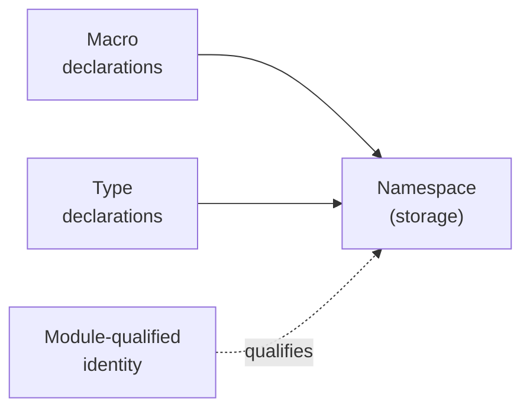
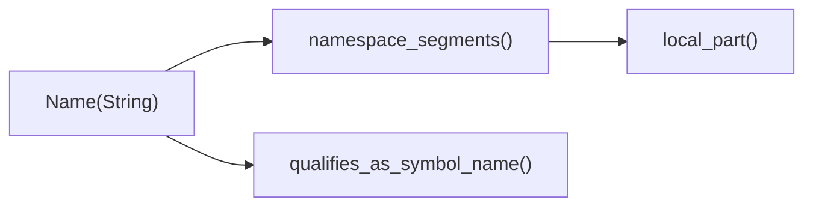
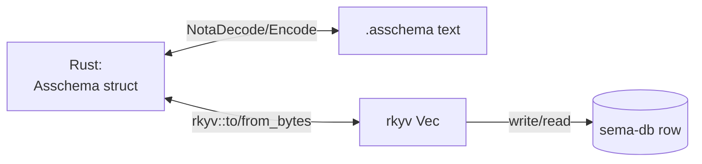

# 2 — The Data Model: Rust ↔ NOTA ↔ rkyv equivalence

*Kind: vision · Topics: data-model, type-signatures, nota-projection, rkyv-archive, three-categories, module-qualified-identity, strict-brace-contract, honest-notation · 2026-05-31 · designer lane sub-agent*

## Frame: one truth, four projections

Spirit 1271 (Maximum): the schema's typed data model lives once in
Rust and projects losslessly into NOTA text, rkyv bytes, and the
sema database row that holds those bytes. The `#[derive(...)]`
attributes on every type are the equivalence proof — not commentary,
not a convention, but the literal code that makes the four corners
the same value.

Each type below appears with its full Rust signature (including all
derives), the concrete NOTA syntax it projects to (drawn from live
`schemas/core.asschema` or `schemas/spirit-min.schema`), its rkyv
property, and the codec rule that ties the three together. The data
model is organized per Spirit 1270 around three categories of
declarations: macro declarations, type declarations, and the
namespace that stores both — all with module-qualified identity
(`schema-next:core:Topic`) so cross-module and cross-crate
references resolve without collisions.

## The three categories per Spirit 1270



Macro declarations carry pattern + template + position; type
declarations carry struct/enum/newtype shape; the namespace is the
storage that holds both, indexed by module-qualified `Name`. The
current `Asschema` namespace holds `TypeDeclaration` only — Gap A
(designer 441 §3, operator 263) widens it to a `DeclarationValue::Type | DeclarationValue::Macro`
enum so the third category lands as a runtime namespace entry, not
just a type definition inside `core.asschema`.

## Module-qualified identity per Spirit 1270 + 1259

`Name` is one type used everywhere a name appears — schema identity,
type names, field names, variant names, import sources. Internally
a `String` of colon-separated segments with a smart bare-vs-bracket
encoding rule at the NOTA boundary.



Per Spirit 1259, NOTA strings come exclusively from bracket forms;
`Name` chooses bare symbol vs `[...]` bracket string at encode time
based on which is structurally legal (`asschema.rs:69-77`). A
`Name("Topic")` and a `Name("schema-next:core:Topic")` both encode
as bare symbols because both are single colon-segmented identifiers;
a name containing whitespace falls back to the bracket form.

## Type-by-type tour

### `Asschema`

The root product. Six positional fields, document-body codec.

**Rust** (`schema-next/src/asschema.rs:85-106`):

```rust
#[derive(
    rkyv::Archive, rkyv::Serialize, rkyv::Deserialize,
    nota_next::NotaDecode, nota_next::NotaEncode,
    Clone, Debug, Eq, PartialEq,
)]
#[nota(known_root)]
pub struct Asschema {
    identity: super::SchemaIdentity,
    imports: Vec<ImportDeclaration>,
    resolved_imports: Vec<super::ResolvedImport>,
    #[nota(name = "Input")]
    input: EnumDeclaration,
    #[nota(name = "Output")]
    output: EnumDeclaration,
    namespace: Vec<Declaration>,
}
```

**NOTA** (`schemas/core.asschema:1-6`):

```nota
(schema-next:core [0.1.0])
[]
[]
[]
[]
[(Public CoreSchema (Struct (CoreSchema {builtin_macro_positions (Plain BuiltinMacroPositions) ...})))
 (Public BuiltinMacroPositions (Struct (...)))
 ...]
```

**rkyv**: deterministic bytes via `to_binary_bytes`/`from_binary_bytes`
(`asschema.rs:182-190`); byte-stable across versions as long as
enum variant order is preserved (Spirit 1249).

**NOTA-encoding rule**: `#[nota(known_root)]` plus derive emits the
document-body codec — the six fields project as document root
objects in source order, no outer parenthesis wrapper (Spirit 1274).
Operator commit `57bab60` lifted the prior hand-rolled
`[...].join("\n")` form to derive-driven (designer 442's
anti-pattern is fixed). The `Input`/`Output` labels are document
field labels, not enum variant tags (Spirit 1277, operator commit
`3b58cc7`).

### `SchemaIdentity`

**Rust** (`schema-next/src/engine.rs:16-30`):

```rust
#[derive(
    rkyv::Archive, rkyv::Serialize, rkyv::Deserialize,
    nota_next::NotaDecode, nota_next::NotaEncode,
    Clone, Debug, Eq, PartialEq,
)]
pub struct SchemaIdentity {
    component: Name,
    version: String,
}
```

**NOTA** (`schemas/core.asschema:1`):

```nota
(schema-next:core [0.1.0])
```

**rkyv**: serves as the sema-database key (Spirit 1271 + 1272); the
daemon stores Asschema bytes indexed by identity.

**NOTA-encoding rule**: derived parenthesized record. Component is
bare symbol; version is bracket string because dots aren't legal in
bare symbols.

### `Name`

**Rust** (`schema-next/src/asschema.rs:18-77`):

```rust
#[derive(rkyv::Archive, rkyv::Serialize, rkyv::Deserialize,
         Clone, Debug, Eq, Hash, PartialEq)]
pub struct Name(String);

impl NotaEncode for Name {
    fn to_nota(&self) -> String {
        if self.qualifies_as_symbol_name() {
            self.as_str().to_owned()                     // bare symbol
        } else {
            NotaString::new(self.as_str()).format()      // bracket string
        }
    }
}
```

**NOTA** — three legal projections:

```nota
Topic                              ; single local name (symbol)
schema-next:core:Topic             ; module-qualified (still symbol)
[topic with spaces]                ; bracket string fallback
```

**rkyv**: single-field tuple over `String`; archived form is
`ArchivedString`, supports zero-copy reads.

**NOTA-encoding rule**: HAND-ROLLED `NotaDecode` + `NotaEncode`
because the encode side branches on `qualifies_as_symbol_name`. The
substrate gap that would let the bare-vs-bracket choice be
derive-driven is open (designer 443 sub-agent 2 §3).

### `Declaration` + `Visibility`

The namespace entry wrapper.

**Rust** (`schema-next/src/asschema.rs:294-361`):

```rust
#[derive(rkyv::Archive, rkyv::Serialize, rkyv::Deserialize,
         nota_next::NotaDecode, nota_next::NotaEncode,
         Clone, Copy, Debug, Eq, PartialEq)]
pub enum Visibility { Public, Private }

#[derive(rkyv::Archive, rkyv::Serialize, rkyv::Deserialize,
         nota_next::NotaDecode, nota_next::NotaEncode,
         Clone, Debug, Eq, PartialEq)]
pub struct Declaration {
    visibility: Visibility,
    name: Name,
    value: TypeDeclaration,
}
```

**NOTA** (`schemas/core.asschema:6`):

```nota
(Public CoreSchema (Struct (CoreSchema { ... })))
```

**rkyv**: fixed-size discriminant for `Visibility`; stable layout
on `Declaration` as long as `TypeDeclaration` variant order holds
(Spirit 1249).

**NOTA-encoding rule**: derived. Three positional children inside
the parenthesis: visibility variant, name, type declaration. Gap A
(designer 441 §3) replaces `TypeDeclaration` with
`DeclarationValue::Type | DeclarationValue::Macro`.

### `TypeDeclaration`

**Rust** (`schema-next/src/asschema.rs:363-388`):

```rust
#[derive(rkyv::Archive, rkyv::Serialize, rkyv::Deserialize,
         nota_next::NotaDecode, nota_next::NotaEncode,
         Clone, Debug, Eq, PartialEq)]
pub enum TypeDeclaration {
    Struct(StructDeclaration),
    Enum(EnumDeclaration),
    Newtype(NewtypeDeclaration),
}
```

**NOTA** (three variants from `schemas/core.asschema:6`):

```nota
(Struct (CoreSchema { ... }))
(Enum (MacroPosition [(RootImports None) ...]))
(Newtype (MacroName String))
```

**rkyv**: tagged union; variant ORDER is byte-stable (Spirit 1249).

**NOTA-encoding rule**: derived enum codec — first child is the
variant tag, remaining children are the payload.

### `StructDeclaration` + `StructFieldMap` + `FieldDeclaration`

**Rust** (`schema-next/src/asschema.rs:411-548`):

```rust
#[derive(rkyv::Archive, rkyv::Serialize, rkyv::Deserialize,
         nota_next::NotaDecode, nota_next::NotaEncode,
         Clone, Debug, Eq, PartialEq)]
pub struct StructDeclaration {
    pub name: Name,
    pub fields: StructFieldMap,
}

#[derive(rkyv::Archive, rkyv::Serialize, rkyv::Deserialize,
         Clone, Debug, Eq, PartialEq)]
pub struct StructFieldMap {
    entries: Vec<FieldDeclaration>,
}

#[derive(rkyv::Archive, rkyv::Serialize, rkyv::Deserialize,
         nota_next::NotaDecode, nota_next::NotaEncode,
         Clone, Debug, Eq, PartialEq)]
pub struct FieldDeclaration {
    pub name: Name,
    pub reference: TypeReference,
}
```

**NOTA** (`schemas/core.asschema:6`):

```nota
(CoreSchema {builtin_macro_positions (Plain BuiltinMacroPositions)
             builtin_macro_shapes    (Plain BuiltinMacroShapes)
             builtin_macro_outputs   (Plain BuiltinMacroOutputs)
             builtin_macro_definitions (Plain BuiltinMacroDefinitions)})
```

**rkyv**: `StructFieldMap` preserves field source order — rkyv
layout and the emitter's generated struct field order are both
load-bearing.

**NOTA-encoding rule**: HAND-ROLLED on `StructFieldMap`
(`asschema.rs:492-532`) to enforce the strict-brace contract
(Spirit 1259): the brace's `root_objects` must be even-length, and
the decoder reads pairs in `chunks_exact(2)`:

```rust
if root_objects.len() % 2 != 0 {
    return Err(NotaDecodeError::ExpectedRootCount { ... });
}
for chunk in root_objects.chunks_exact(2) {
    entries.push(FieldDeclaration {
        name: Name::from_nota_block(&chunk[0])?,
        reference: TypeReference::from_nota_block(&chunk[1])?,
    });
}
```

The encoder emits `{key1 value1 key2 value2 ...}` in source order.
This is the load-bearing strict-brace instance in the data model
(operator 256 landed the parity discipline).

### `EnumDeclaration` + `EnumVariant`

**Rust** (`schema-next/src/asschema.rs:550-604`):

```rust
#[derive(rkyv::Archive, rkyv::Serialize, rkyv::Deserialize,
         nota_next::NotaDecode, nota_next::NotaEncode,
         Clone, Debug, Eq, PartialEq)]
pub struct EnumDeclaration {
    pub name: Name,
    pub variants: Vec<EnumVariant>,
}

#[derive(rkyv::Archive, rkyv::Serialize, rkyv::Deserialize,
         nota_next::NotaDecode, nota_next::NotaEncode,
         Clone, Debug, Eq, PartialEq)]
pub struct EnumVariant {
    pub name: Name,
    pub payload: Option<TypeReference>,
}
```

`EnumDeclaration` also implements `NotaNamedDocumentFieldDecode` /
`NotaNamedDocumentFieldEncode` (`asschema.rs:572-588`) so it can
sit in `Asschema`'s `Input` and `Output` document positions as
named fields whose value IS the variants vector.

**NOTA** (`schemas/core.asschema:6`):

```nota
(MacroPosition [(RootImports None) (RootInput None) (RootOutput None)
                (RootNamespace None) (NamespaceDeclaration None)
                (StructFields None) (EnumVariants None)
                (TypeReference None)])
```

**rkyv**: variants vector preserves source order; `Option<T>`
archives as `ArchivedOption`.

**NOTA-encoding rule**: derived. Each variant is `(VariantName payload-or-None)`;
the `None` carrier is emitted explicitly per Spirit 1268 — variants
without payload write `(Name None)`, NOT bare `Name`, because the
type IS `Option<TypeReference>::None` and pretending bare names
would be heterogeneous and dishonest.

### `NewtypeDeclaration`

**Rust** (`schema-next/src/asschema.rs:390-410`):

```rust
#[derive(rkyv::Archive, rkyv::Serialize, rkyv::Deserialize,
         nota_next::NotaDecode, nota_next::NotaEncode,
         Clone, Debug, Eq, PartialEq)]
pub struct NewtypeDeclaration {
    pub name: Name,
    pub reference: TypeReference,
}
```

**NOTA** (`schemas/core.asschema:6`):

```nota
(MacroName String)
(MacroPattern (Plain MacroPatternObject))
```

**rkyv**: trivial pair, stable layout.

**NOTA-encoding rule**: derived positional record.

### `TypeReference`

The leaf — a type at a reference position.

**Rust** (`schema-next/src/asschema.rs:617-635`):

```rust
#[derive(rkyv::Archive, rkyv::Serialize, rkyv::Deserialize,
         Clone, Debug, Eq, PartialEq)]
#[rkyv(
    bytecheck(bounds(__C: rkyv::validation::ArchiveContext)),
    serialize_bounds(__S: rkyv::ser::Writer),
    deserialize_bounds(__D::Error: rkyv::rancor::Source)
)]
pub enum TypeReference {
    String,
    Integer,
    Boolean,
    Path,
    Plain(Name),
    Vector(#[rkyv(omit_bounds)] Box<TypeReference>),
    Map(#[rkyv(omit_bounds)] Box<TypeReference>,
        #[rkyv(omit_bounds)] Box<TypeReference>),
    Optional(#[rkyv(omit_bounds)] Box<TypeReference>),
}
```

**NOTA** — all eight forms (mined from live schemas):

```nota
String                              ; reserved scalar leaf
Integer
Boolean
Path
(Plain Topic)                       ; declared-name leaf
(Plain schema-next:core:Topic)      ; module-qualified
(Vector (Plain MacroPosition))      ; collection
(Optional (Plain TypeReference))    ; option
(Map (Plain Key) (Plain Value))     ; key-value
```

**rkyv**: the recursive variants need `omit_bounds` plus custom
bytecheck/serialize/deserialize bounds attributes because the type
recursively contains itself. Variant order is byte-stable (Spirit 1249).

**NOTA-encoding rule**: HAND-ROLLED `NotaDecode` + `NotaEncode`
(~50 lines, `asschema.rs:637-689`). The decoder branches on block
shape — bare symbol becomes a reserved-scalar leaf or an
`UnknownVariant` error; parenthesized variants dispatch on the head
to `Plain`, `Vector`, `Optional`, or `Map`. This is the substrate
gap named in designer 443 sub-agent 2: reserved-symbol leaves AND
symbol-headed variants combined aren't yet expressible as a derive
attribute on `nota-next`. Closing that gap removes the largest
remaining hand-roll in `asschema.rs`. The
`from_block_with_registry` path (`asschema.rs:771-962`) handles
macro invocations and inline declarations — that's lowering logic,
not codec.

### `ImportDeclaration` + `ResolvedImport`

**Rust** (`schema-next/src/asschema.rs:278-292` and
`schema-next/src/resolution.rs:13-105`):

```rust
#[derive(rkyv::Archive, rkyv::Serialize, rkyv::Deserialize,
         nota_next::NotaDecode, nota_next::NotaEncode,
         Clone, Debug, Eq, PartialEq)]
pub struct ImportDeclaration {
    pub local_name: Name,
    pub source: TypeReference,
}

#[derive(rkyv::Archive, rkyv::Serialize, rkyv::Deserialize,
         nota_next::NotaDecode, nota_next::NotaEncode,
         Clone, Debug, Eq, PartialEq)]
pub struct ImportSource {
    crate_name: Name,
    module: Name,
    type_name: Name,
}

#[derive(rkyv::Archive, rkyv::Serialize, rkyv::Deserialize,
         nota_next::NotaDecode, nota_next::NotaEncode,
         Clone, Debug, Eq, PartialEq)]
pub struct ResolvedImport {
    local_name: Name,
    source: ImportSource,
}
```

**NOTA** — current schemas have empty imports (`[]`); the wire
shape for populated imports per `engine.rs:710-724` is a brace-map
of `local_name source_path` pairs:

```nota
{ Magnitude schema-core:mail:Magnitude
  Kind     spirit-next:lib:Kind }
```

**rkyv**: cross-crate references at the wire level are qualified
`Name` strings inside `TypeReference::Plain`. Resolution happens at
lowering time (`resolution.rs:185-215`): load the dependency
asschema by `crate_name:module`, confirm the `type_name` exists,
produce a `ResolvedImport`.

**NOTA-encoding rule**: full derive on all three types — all
positional records. The brace-map shape on imports is enforced by
the `RootImports` macro at lowering time (`engine.rs:704-727`).

### `MacroDeclaration` + `MacroPosition` (horizon — Gap A)

The third category per Spirit 1270. Currently the types are
declared inside `schemas/core.asschema` but no live `Asschema`
holds macro entries as namespace declarations of itself.

**Rust** (the existing `MacroPosition` from `schema-next/src/macros.rs:13-69`):

```rust
#[derive(rkyv::Archive, rkyv::Serialize, rkyv::Deserialize,
         nota_next::NotaDecode, nota_next::NotaEncode,
         Clone, Copy, Debug, Eq, PartialEq)]
pub enum MacroPosition {
    RootImports, RootInput, RootOutput, RootNamespace,
    NamespaceDeclaration, StructFields, EnumVariants, TypeReference,
}
```

The Gap A target shape (designer 441 §3):

```rust
pub enum DeclarationValue {
    Type(TypeDeclaration),
    Macro(MacroDeclaration),
}

pub struct MacroDeclaration {
    pub name: Name,
    pub position: MacroPosition,
    pub pattern: MacroPattern,
    pub template: MacroTemplate,
}
```

**NOTA** — `MacroPosition` serializes today inside `core.asschema:6`:

```nota
(Enum (MacroPosition [(RootImports None) (RootInput None) ...]))
```

The Gap A target — once `Declaration` carries both kinds:

```nota
(Public StructMacro
        (Macro (StructMacro RootNamespace
                            [[(Atom (Some pascal-case))
                              (Delimited (Some (BraceMap struct-fields)))]]
                            (StructDeclaration ...))))
```

**rkyv**: same derive surface; enum order is byte-stable (Spirit 1249).

**NOTA-encoding rule**: derived. The hand-rolling lives in macro
EXECUTION (`MacroRegistry`, pattern matching), not the declaration
codec.

## The four-corner round-trip

The data flows lossless between four representations; the derives
carry each edge.



- `NotaDecode` + `NotaEncode` carry the Rust↔NOTA edge.
- `rkyv::Archive` + `rkyv::Serialize` + `rkyv::Deserialize` carry
  the Rust↔bytes edge.
- `AsschemaStore` (Spirit 1272) carries bytes↔storage; identity is
  the key, bytes are the value.

The invariant: any `Asschema` in any corner projects losslessly to
any other. The derives are not commentary — they are the literal
code that makes the equivalence hold.

## The strict-brace key-value contract (Spirit 1259)

NOTA's brace `{ }` is a **strict key-value map**. Every entry is
exactly two objects — a key and a value. The contract: `len % 2 == 0`
AND every other position is a valid key.

`StructFieldMap` is the load-bearing instance in the data model.
Its hand-rolled decoder (`asschema.rs:492-521`) enforces the
contract structurally — the encoder mirrors with
`{key1 value1 key2 value2 ...}` in source order. The `RootImports`
macro (`engine.rs:704-724`) and `RootNamespace`'s
`contains_key_value_pairs` detection (`engine.rs:841-867`) apply
the same parity discipline at lowering positions.

The user-facing consequence: a struct's NOTA body is
`{field1 (Type1) field2 (Type2) ...}` — never `{@Field1 @Field2 ...}`
(the retired single-token form rejected in report 437).

## The honest-notation discipline (Spirit 1267-1269)

**1267 — Input/Output as direct struct fields.** Asschema's input
and output positions are fields of type `EnumDeclaration` with
`#[nota(name = "Input")]` / `#[nota(name = "Output")]` markers.
There is no `(Input variants)` or `(Output variants)` wrapper at
the document level — the labels are document field labels, not
enum variant tags. The bare body `[]` or `[(Record Entry) ...]` IS
the enum body, with the implicit name supplied by position
(operator commit `3b58cc7`).

**1268 — No heterogeneous vectors.** When a vector's element type
declares `Option<T>`, every element emits `None` or `(Some T)`. A
variant without payload writes `(Name None)`, NOT bare `Name`, so
the vector stays homogeneous in element shape. The enum-variant
lists in `core.asschema:6` demonstrate this throughout.

**1269 — No meaningless wrappers.** Notation form follows type
truth. No wrapping parenthesis at the document root (Spirit 1274).
No labeled enum-variant when the type is a direct field. Notation
that doesn't correspond to a piece of type structure is sugar that
hides where information lives — and is rejected.

Together: truthful representation. Every NOTA shape corresponds to
a Rust type shape, and the codec is the lossless map between them.

## Cross-references

- **Spirit records**: 1246 (live asschema artifact), 1249 (rkyv
  discriminant stability), 1259 (strict brace), 1263 (macro nodes
  at NOTA layer), 1267 + 1268 + 1269 (notation honesty), 1270
  (three categories + module-qualified + cross-crate), 1271
  (rkyv-in-SEMA + NOTA re-export through derived types), 1272
  (four-object logic separation), 1274 (positional document root),
  1277 (input/output as struct fields), 1278 (known-root
  abstraction).
- **Operator commits referenced**: schema-next `57bab60` (derive-
  driven asschema known-root codec — anti-pattern fixed),
  `3b58cc7` (Input/Output as direct enum fields).
- **Sibling reports in this meta-report directory**:
  `1-four-logical-planes.md` (the planes that own these types),
  `3-nota-parsing-and-structural-macros.md` (how source text
  becomes these types through the macro layer),
  `4-runtime-integration.md` (how schema-emitted variants of these
  types power Signal / Nexus / SEMA).
- **Retired vision reports agglomerated here**:
  `441-asschema-types-rkyv-sema-roundtrip.md` (Rust signatures +
  NOTA examples — content lifted into the type-by-type tour),
  `437-strict-brace-key-value-explanation-and-implementation-try.md`
  (Spirit 1259 explanation — content lifted into the strict-brace
  section), `434-live-assembled-schema-bootstrap-and-loop-closure.md`
  (asschema-as-artifact — content lifted into the four-corner
  round-trip frame).
- **Live code referenced**: `schema-next/src/asschema.rs` (the
  types), `schema-next/src/engine.rs` (`SchemaIdentity`,
  `SchemaError`, lowering), `schema-next/src/resolution.rs`
  (`ImportSource`, `ResolvedImport`, `ImportResolver`),
  `schema-next/src/macros.rs:13-69` (`MacroPosition`),
  `schema-next/schemas/core.asschema` + `schema-next/schemas/spirit-min.schema`
  (live NOTA exemplars).
- **Open horizons**: Gap A — widen `Declaration` to carry both
  `TypeDeclaration` and `MacroDeclaration` per Spirit 1270
  (designer 441 §3, operator 263 Gap 1); substrate gap on
  `TypeReference`'s hand-rolled codec (designer 443 sub-agent 2 §3);
  substrate gap on `Name`'s smart bare-vs-bracket encoder (same
  sub-agent §3).
