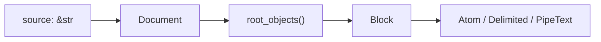
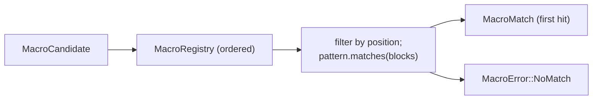
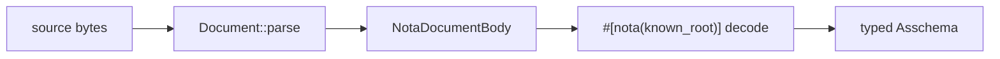

# 3 — NOTA Parsing + Structural Macros

*Kind: vision · Topics: nota-next, schema-next, two-layer-parser, known-root, macro-nodes, structural-matching, ordered-patterns, no-match-as-error, derive-attribute, uniform-body-parsing, outer-delimiter-omitted · 2026-05-31 · designer lane sub-agent*

## Frame: the two-layer architecture

Spirit 1279 (Maximum, 2026-05-31): *"NOTA extension programming is
structural matching over nodes. The parser first preserves raw
delimiter structure, object counts, sigils, and nested block shapes;
then ordered macro-node definitions match that structure using
constraints, most-specific first, and absence of a match is a
formatting or specification error."*

Two layers, not one:

- **Layer 1 — Universal structural parse** (`nota-next`). A
  hand-authored recursion floor reading source bytes into typed
  structural blocks; delimiter kind, object count, atom case,
  sigil, span — all preserved as data BEFORE any consumer
  vocabulary is loaded.
- **Layer 2 — Per-consumer macro-node programming.** Ordered typed
  patterns matched against layer-1 data; each consumer (schema,
  configs, intent records, deploy manifests) loads ITS OWN registry
  first, then applies it. Data shape in `nota-next`; vocabulary
  instances in the consumer.

A symmetric consequence: a NOTA formatter is derived from the same
registry — the patterns already encode delimiter, line break, and
atom layout. Spirit 1263 (High) placed macro nodes AT the NOTA
layer; 1279 refines into two layers; 1280 requires
structural-over-text in the pattern language itself.

## Layer 1: structural parse



A `Document` holds source plus a vector of root-level `Block`s. A
`Block` is `Delimited`, `PipeText`, or `Atom`. Recursion is data;
each delimited block carries its own span and its own nested
`root_objects`.

### Rust signatures (nota-next, live)

`/git/github.com/LiGoldragon/nota-next/src/parser.rs:17-65`:

```rust
pub struct Document { source: String, root_objects: Vec<Block> }
impl Document {
    pub fn parse(source: impl Into<String>) -> Result<Self, NotaError>;
    pub fn root_objects(&self) -> &[Block];
    pub fn holds_root_objects(&self) -> usize;
    pub fn root_object_at(&self, index: usize) -> Option<&Block>;
}

pub enum Block {
    Delimited { delimiter: Delimiter, span: SourceSpan, root_objects: Vec<Block> },
    PipeText(PipeText),
    Atom(Atom),
}

pub enum Delimiter {
    Parenthesis, SquareBracket, Brace, PipeParenthesis, PipeBrace,
}
```

`/git/github.com/LiGoldragon/nota-next/src/parser.rs:522-577`:

```rust
pub struct Atom { text: String, classification: AtomClassification, span: SourceSpan }
impl Atom {
    pub fn qualifies_as_symbol(&self) -> bool;
    pub fn qualifies_as_pascal_case_symbol(&self) -> bool;
    pub fn qualifies_as_camel_case_symbol(&self) -> bool;
    pub fn qualifies_as_kebab_case_symbol(&self) -> bool;
}

pub enum AtomClassification {
    SymbolCandidate, IntegerCandidate, DecimalCandidate, TextCandidate,
}
```

Three load-bearing properties of this layer:

1. **Source spans are preserved.** Every block carries
   `SourceSpan { start, end }`; `Block::reemit(source)` returns the
   exact slice. Diagnostics map back to columns.
2. **Atom case is classified at parse time.** `AtomClassification`
   distinguishes symbol from integer / decimal / text candidates;
   `qualifies_as_*_symbol` reads classification PLUS leading
   character — no second-pass regex on the consumer side.
3. **Delimiter substrate is exposed.** Pre-`3f46c2e`, `Block` hid
   delimiter kind inside variant arms. The refactor turned
   `Delimited` into one variant carrying `Delimiter` as data, so
   pattern code asks "delimited with X?" by data equality — not by
   variant explosion. Closes designer 443 sub-agent 1 Finding 2.

### Five delimiter shapes — what each carries

| Form | Block shape | Use |
|---|---|---|
| `()` | `Delimited { Parenthesis }` | Tagged record, enum data variant, composite type |
| `[]` | `Delimited { SquareBracket }` | Vector, root enum body |
| `{}` | `Delimited { Brace }` | Strict key-value pairs (Spirit 1259) |
| `(\|...\|)` | `Delimited { PipeParenthesis }` | Inline enum body |
| `{\|...\|}` | `Delimited { PipeBrace }` | Inline struct body |
| `[\|...\|]` | `PipeText` | Bracket-safe / multi-line string |

The pipe-delimited inline forms let a schema declare an inline
struct or enum at any reference position; they land naturally
because the substrate enumerates all five delimiters.

### What this layer does NOT know

The parser knows nothing about Asschema, type references, struct
declarations, or any schema vocabulary — push it
`(SchemaIdentity [...] ...)` and it returns a `Delimited
{ Parenthesis, .. }` without interpreting "SchemaIdentity" as a
type tag. That ignorance is the design; it's what makes the
substrate infinitely reusable across consumers.

## Layer 2: macro-node programming

`MacroNodeDefinition` and its supporting types live in
`nota-next/src/macros.rs` (re-exported from `lib.rs:20-24`). A
`MacroRegistry` is an ordered vector of definitions;
`dispatch(candidate)` walks in order and returns the FIRST match —
or a structured error naming position, rules tried, and actual shape.



### Rust signatures (nota-next, live)

All types derive `rkyv::{Archive, Serialize, Deserialize}` +
`nota_next::{NotaDecode, NotaEncode}` — macro data is itself
NOTA-encodable and rkyv-archivable; a library serializes through
the same substrate it describes.

`/git/github.com/LiGoldragon/nota-next/src/macros.rs:121-170`:

```rust
pub struct MacroNodeDefinition {
    name: String,
    position: PositionPredicate,
    pattern: Pattern,
    expected: String,
}
impl MacroNodeDefinition {
    pub fn matches<'block>(&self, candidate: &MacroCandidate<'block>)
        -> Option<MacroMatch<'block>>;
}

pub enum PositionPredicate {
    RootIndex(u64),
    DelimitedEntry(MacroDelimiter),
    Named(String),
}
```

`/git/github.com/LiGoldragon/nota-next/src/macros.rs:182-251`:

```rust
pub struct Pattern { elements: Vec<PatternElement> }

pub enum PatternElement {
    Any(Option<CaptureName>),
    Atom(AtomShape),
    Delimited(DelimitedShape),
    Literal(String),
    Rest(CaptureName),
}
```

`/git/github.com/LiGoldragon/nota-next/src/macros.rs:311-444`:

```rust
pub struct AtomShape {
    case: Option<AtomCase>,
    sigil: Option<SigilSpec>,
    capture: Option<CaptureName>,
}
pub enum AtomCase { Symbol, PascalCase, CamelCase, KebabCase }
pub struct SigilSpec { character: String, position: SigilPosition }
pub enum SigilPosition { Prefix, Suffix }

pub struct DelimitedShape {
    delimiter: MacroDelimiter,
    object_count: MacroObjectCount,
    capture: Option<CaptureName>,
    #[rkyv(omit_bounds)]
    children: Option<Box<Pattern>>,    // recursive structural constraint
}

pub enum MacroObjectCount { Any, Even, Exact(u64) }
```

The `children: Option<Box<Pattern>>` field (commit `b041e64`) is
the nested macro constraint: not just "be a brace" but "be a brace
whose first child is a camelCase atom and whose second child is a
parenthesised type reference". Closes designer 443 sub-agent 1
Pattern / ChildPattern collapse.

### Registry shape and dispatch

`/git/github.com/LiGoldragon/nota-next/src/macros.rs:604-662`:

```rust
pub struct MacroRegistry { nodes: Vec<MacroNodeDefinition> }
impl MacroRegistry {
    pub fn new(nodes: Vec<MacroNodeDefinition>) -> Result<Self, MacroError>;
    pub fn unchecked(nodes: Vec<MacroNodeDefinition>) -> Self;
    pub fn dispatch<'block>(&self, candidate: &MacroCandidate<'block>)
        -> Result<MacroMatch<'block>, MacroError>;
    pub fn validate_no_silent_conflicts(&self) -> Result<(), MacroError>;
}

pub enum MacroError {
    NoMatch { position: String, tried: Vec<String>,
              expected: Vec<String>, found: String },
    Conflict(MacroConflict),
}
```

The error carries every diagnostic axis: WHERE (position), WHAT
WAS TRIED (rule names), WHAT WAS EXPECTED (per-rule description),
and WHAT SHOWED UP — "absence of a match is a formatting or
specification error" in code. `MacroRegistry::new` runs
`validate_no_silent_conflicts` at construction: same position AND
same `Pattern` errors. Order is priority; silent ambiguity is
rejected at load time, not at dispatch.

### Program loading order — programs first, then structure

Per psyche 2026-05-30: load programming first, then apply on
structure. Construct registries at startup (consumer bootstrap +
declared macros) → parse document (`Document::parse`) → walk
document with registry (`dispatch(candidate)`) — first match wins,
no match is a structured error. Two consumers can apply DIFFERENT
registries to the SAME document; the structural parse is shared,
the meaning differs.

## The known-root abstraction (Spirit 1278 — now LIVE)

Spirit 1278 (Maximum, 2026-05-31): *"A file read as a known root
type is already the root body; the NOTA layer should expose an
object/body parsing and encoding abstraction that reads and writes
the ordered fields of the known type."*

A `.asschema` file is read AGAINST a known root type. Contents are
NOT wrapped in an outer paren naming the root — the file IS the
root body. The reader consumes root fields positionally from
`Document::root_objects()`.



Designer 442 named the prior anti-pattern: `schema-next` had a
hand-rolled `.join("\n")` plus six positional hand-typed decodes
with `Name::new("Input")` fabricated inline. Commits `nota-next
14ad2f8` + `schema-next 57bab60` landed the elegant path.

### Code: the derive-driven Asschema codec (57bab60)

`/git/github.com/LiGoldragon/schema-next/src/asschema.rs:85-191`:

```rust
#[derive(
    rkyv::Archive, rkyv::Serialize, rkyv::Deserialize,
    nota_next::NotaDecode, nota_next::NotaEncode,
    Clone, Debug, Eq, PartialEq,
)]
#[nota(known_root)]
pub struct Asschema {
    identity: super::SchemaIdentity,
    imports: Vec<ImportDeclaration>,
    resolved_imports: Vec<super::ResolvedImport>,
    #[nota(name = "Input")]  input: EnumDeclaration,
    #[nota(name = "Output")] output: EnumDeclaration,
    namespace: Vec<Declaration>,
}

impl Asschema {
    pub fn from_nota_source(source: &str) -> Result<Self, SchemaError> {
        NotaSource::new(source).parse_document_body().map_err(SchemaError::from)
    }
    pub fn to_nota(&self) -> String { self.to_nota_document_body().to_nota() }
}
```

No outer paren. No `.join("\n")`. `#[nota(known_root)]` emits
`NotaDocumentDecode` + `NotaDocumentEncode` impls. The per-field
`#[nota(name = "Input")]` annotation projects a
`NotaNamedDocumentFieldEncode` / `Decode` pair onto an embedded
type whose own name is a literal — closing Spirit 1277 (Maximum):
*"Asschema root input and output positions are known fields, not
data-carrying variants."*

### Derive-emitted impl shape (nota-next derive)

`/git/github.com/LiGoldragon/nota-next/derive/src/lib.rs:182-204,260-291`
— when `#[nota(known_root)]` is present, the derive emits:

```rust
impl ::nota_next::NotaDocumentDecode for #name {
    fn from_nota_document_body(body: &NotaDocumentBody<'_>)
        -> Result<Self, NotaDecodeError>
    {
        let fields = body.expect_fields(#type_name, #field_count)?;
        Ok(Self { #(#document_fields,)* })
    }
}
impl ::nota_next::NotaDocumentEncode for #name {
    fn to_nota_document_body(&self) -> NotaDocumentEncoding {
        NotaDocumentEncoding::new(vec![#(#document_fields,)*])
    }
}
```

The `NotaDocumentBody` interface
(`/git/github.com/LiGoldragon/nota-next/src/codec.rs:143-171`):

```rust
pub struct NotaDocumentBody<'document> { document: &'document Document }
impl<'document> NotaDocumentBody<'document> {
    pub fn root_objects(&self) -> &'document [Block];
    pub fn expect_fields(&self, type_name: &'static str, expected: usize)
        -> Result<&'document [Block], NotaDecodeError>;
}
```

The decoder consumes `body.expect_fields(type_name, N)`
positionally: field 0 is `identity`, field 1 is `imports`, ... field
5 is `namespace`. There is no outer paren; the document's root
objects are the fields. Spirit 1274 (Maximum, 2026-05-31): *"A
.asschema file is read against the known Asschema root struct, so
the canonical text form should not need an outer parenthesized
record wrapper."* Live.

### Live test demonstrating known-root

`/git/github.com/LiGoldragon/nota-next/tests/derive.rs:62-69,152-165`
contracts the round-trip: the source string
`"[schema]\n[]\n[[Record] [Observe]]"` decodes against a
`#[nota(known_root)]` struct with fields `name: String, imports:
Vec<String>, #[nota(name = "Input")] input: NamedVariants`, and
re-encodes byte-for-byte. Three root_objects, three fields, no
outer paren. The test is the contract.

## Structural matching — worked examples

The schema-side `MacroNodeDefinition`-builders in
`schema-next/src/macros.rs:301-580` show the structural patterns
the schema vocabulary registers. Each builder constructs a
`nota-next::MacroNodeDefinition` for one position.

### Namespace declaration — three structural patterns

`/git/github.com/LiGoldragon/schema-next/src/macros.rs:356-392`
constructs three `MacroNodeDefinition`s — all pair-shaped at
`MacroPosition::NamespaceDeclaration`:

```rust
// pair_case(position, label, key_element, value_element, expected)

Self::pair_case(/* */, "struct declaration",
    PatternElement::atom(AtomShape::symbol(/* type_name capture */)),
    PatternElement::delimited(DelimitedShape::new(
        MacroDelimiter::Brace, NotaMacroObjectCount::Any, /* body */)),
    "symbol key followed by brace value")

Self::pair_case(/* */, "enum declaration",
    PatternElement::atom(AtomShape::symbol(/* type_name */)),
    PatternElement::delimited(DelimitedShape::new(
        MacroDelimiter::SquareBracket, NotaMacroObjectCount::Any, /* body */)),
    "symbol key followed by square bracket value")

Self::pair_case(/* */, "newtype declaration",
    PatternElement::atom(AtomShape::symbol(/* type_name */)),
    PatternElement::any(/* reference */),
    "symbol key followed by type reference value")
```

Three patterns: **Struct** matches `TypeName { ... }`, **Enum**
matches `TypeName [ ... ]`, **Newtype** matches `TypeName
Reference`. Order matters: `Struct` and `Enum` are more specific
(specific delimiter); `Newtype` is the open-ended fallback.

Real input in `schema-next/schemas/core.asschema:6`:

```
(Public CoreSchema (Struct (CoreSchema {builtin_macro_positions ...})))
(Public MacroDelimiter (Enum (MacroDelimiter [(SquareBracket None) ...])))
(Public MacroName (Newtype (MacroName String)))
```

### Struct fields — explicit vs derived (Spirit 1259)

`/git/github.com/LiGoldragon/schema-next/src/macros.rs:394-419`
constructs two pair-cases at `MacroPosition::StructFields`:

```rust
Self::pair_case(/* */, "explicit field",
    PatternElement::atom(AtomShape::camel_case(/* field_name */)),
    PatternElement::any(/* reference */),
    "camelCase field key followed by type reference value")

Self::pair_case(/* */, "derived field",
    PatternElement::atom(AtomShape::pascal_case(/* type_name */)),
    PatternElement::literal("*"),
    "PascalCase type key followed by * marker")
```

**Explicit field** matches `fieldName TypeReference` (camelCase
key, any value); **Derived field** matches `TypeName *` (PascalCase
key, literal asterisk). Spirit 1259 (High, 2026-05-30) governs
strict-brace: *"Every entry inside braces is exactly TWO objects."*
The derived-field marker is the value-side asterisk literal — not
a prefix-sigil arity-1 token. `PatternElement::literal("*")`:
asterisk matched as string equality against the value block.

NOTA strings these match:

```
{userIdentifier UserIdentifier sessionToken String}   ; explicit fields
{Topics * Kind * Description *}                       ; derived fields
```

### Enum variants — unit and data (sigil constraint)

`/git/github.com/LiGoldragon/schema-next/src/macros.rs:421-446`
constructs two cases at `MacroPosition::EnumVariants`:

```rust
NotaMacroNodeDefinition::new("unit variant", /* position */,
    Pattern::new(vec![PatternElement::atom(
        AtomShape::pascal_case(/* variant_name */))]),
    "PascalCase variant atom")

Self::pair_case(/* */, "data variant",
    PatternElement::atom(AtomShape::pascal_case(/* variant_name */)
        .with_sigil(SigilSpec::suffix("@"))),
    PatternElement::any(/* payload */),
    "PascalCase@ variant key followed by payload type")
```

**Unit variant** — single-element pattern: ONE PascalCase atom
matches `Decision`, `Principle`, `Correction`. **Data variant** —
pair pattern: PascalCase-with-suffix-`@` atom plus any value
matches `Record@ Entry`, `Observe@ Query`. The
`with_sigil(SigilSpec::suffix("@"))` is the structural constraint
— not regex on text, a typed sigil specification.

### Type reference — symbol vs composite

`/git/github.com/LiGoldragon/schema-next/src/macros.rs:448-469`
constructs two patterns at `MacroPosition::TypeReference` under
`MacroDispatch::StructuralOrTaggedInvocation`: a one-element
`AtomShape::symbol`-only pattern (plain or scalar reference) and a
`Parenthesis` `block_case` (composite or tagged invocation, any
count).

NOTA inputs matched: `String` / `Topic` (plain or scalar — symbol
atom); `(Vec Topic)` / `(Map (String Integer))` / `(Plain Magnitude)`
(composite or tagged invocation). `StructuralOrTaggedInvocation`
dispatch means: structural first; if none match BUT the candidate
is parenthesised, hand off to a user-declared macro library.

## The constraint-vector language

A `Pattern` is `Vec<PatternElement>`. Each element is:

- `Any(Option<CaptureName>)` — match any single block, optionally
  bind. Open-ended fallback.
- `Atom(AtomShape)` — match an atom with case AND/OR sigil
  constraints, optionally bind. Constraints stack.
- `Delimited(DelimitedShape)` — match a delimited block of specific
  delimiter AND/OR object count AND/OR nested children pattern.
- `Literal(String)` — match exactly this atom text. Equality on
  demoted-to-string view.
- `Rest(CaptureName)` — match remaining blocks; binds as vector.
  Terminal.

The match algorithm walks elements and blocks in lockstep
(`/git/github.com/LiGoldragon/nota-next/src/macros.rs:196-221`):
each element advances `index` after `match_block`, `Rest` consumes
the tail immediately as `CapturedValue::Blocks`, and final
`index == blocks.len()` is required — silent leftover blocks are
rejected. Three properties:

1. **Total positional consumption.** Every block in the candidate
   must be matched — `Pattern::matches` returns `None` if
   `index < blocks.len()` at the end. No silent leftover.
2. **`Rest` is terminal.** Checked first inside the loop, returns
   immediately; nothing after it executes.
3. **Captures carry typed Block refs.** `CapturedValue::Block(&Block)`
   or `CapturedValue::Blocks(Vec<&Block>)` — references into the
   original document, no copies, no notation strings. This is what
   makes the round-trip structural per Spirit 1280.

### No-match diagnostics

`/git/github.com/LiGoldragon/nota-next/src/macros.rs:775-787` —
the `Display` impl renders `NoMatch` as
`"no macro matched at {position}; tried [{names}]; expected
[{expectations}]; found {shape}"`. WHERE the parser was, WHICH
macros it tried, WHAT each macro
expected, WHAT the actual blocks looked like. Enough to point a
finger either at the input ("you wrote a brace where the registry
only has bracket patterns at this position") or at the vocabulary
("you need to add a macro for this shape").

## Structural over text macros (Spirit 1280)

Spirit 1280 (High, 2026-05-31): *"Schema should prefer structural
macros over text macros. A macro definition language should
express constraints over nested NOTA structure, such as delimiter
type, child count, symbol qualification, sigil, and constraints on
child positions; text macros are only a later fallback if structural
macros cannot express enough."*

The macro-node mechanism IS that language: every constraint is
structural — `MacroDelimiter` (delimiter), `MacroObjectCount`
(child count), `AtomCase` (symbol qualification), `SigilSpec`
(sigil), positional `Pattern` element sequence (child position),
`DelimitedShape::with_children` (recursive). All five 1280 axes
have typed representations in `nota-next/src/macros.rs`; none is
"match this text".

### Spirit 1280 violation — CLOSED at `schema-next 877c03f5`

Sub-agent 3's earlier framing called the macro-lowering text
round-trip a pending violation. Verified post-dispatch against
live code at `schema-next fe770d1`: the violation is FIXED.
`MacroBindings` now stores typed `Block` values — `SingleMacroBinding
{ name: String, value: Block }` at `declarative.rs:1090-1097` and
`RepeatedMacroBinding { name: String, values: Vec<Block> }` at
`declarative.rs:1099-1102`. `ExpandedTemplate::lower_to_output`
lowers through `AssembledTemplate::new(ObjectView::Expanded(&self
.object)).lower(registry, context)` — direct structural lowering
without text reparse. The remaining `source: String` on
`ExpandedTemplate` is a TRACE surface (`object.compact_notation()`),
used for diagnostics and `context.remember_expanded_template`,
not the lowering substrate.

Operator's fix landed at `877c03f5` (`schema: keep declarative
macro expansion structural`), then repinned at `fe770d1` after the
recursive nota macro substrate landed. Designer 443 sub-agent 2's
#1 finding is **CLOSED**; sub-agent 3's framing here is corrected
in the meta-report synthesis (`5-overview.md` §"Current truth").

## The next refinement — Spirit 1288: outer delimiter omitted before the next step

Spirit 1288 (Principle, Maximum, 2026-05-31): *"NOTA parsing
strips the outer delimiter before handing content to the next
step. After the structural pass identifies the type — via the
delimiter shape, or via file/context knowledge of a known root
type — the INSIDE of the delimiter, never the wrapper, is what
the type-specific body parser receives. Parsing a file is the
same operation as parsing the body of a nested struct or vector:
in both cases the next step sees only the inside content."*

This is the architectural rule that makes Spirit 1278's
"object/body abstraction" singular. The known-root abstraction
above shows the file case working today; 1288 names the broader
rule that every type-specific body parser receives the inside,
regardless of whether that inside came from a file (no wrapper to
strip) or from a nested delimited block (wrapper consumed by the
structural match).

### What's special-cased today

Two parallel parsing entry points in `nota-next`:

```rust
// nota-next derive crate emits these two methods per derived type:
//   - for file-bound types with #[nota(known_root)]:
impl NotaDocumentDecode for KnownRootDocument {
    fn from_nota_document_body(body: &NotaDocumentBody<'_>)
        -> Result<Self, NotaDecodeError> { /* read positional fields */ }
}

//   - for inner-content types (the default):
impl NotaDecode for InnerContentType {
    fn from_nota_block(block: &Block)
        -> Result<Self, NotaDecodeError> { /* match outer paren, skip head, read fields */ }
}
```

The structures are nearly identical — both walk positional fields
per the type's structure — but the surfaces are split because the
FILE case skips the wrapper and the INNER case consumes one.

### The elegant target — one body parser per type

Per 1288: every type with derived NOTA codec should have ONE
body-parsing method that consumes body objects, agnostic of
where those objects came from:

```rust
// proposed nota-next derive output (one per type, two callers):
impl T {
    fn from_body_objects(objects: &[Block])
        -> Result<Self, NotaDecodeError> { /* read positional fields */ }
}

// file caller (today's #[nota(known_root)] case):
let document = Document::parse(source)?;
let value = T::from_body_objects(document.root_objects())?;

// nested caller (today's NotaDecode case):
// after structural match identified T inside `(T field field field)`,
// the macro-node handler strips wrapper + head and calls:
let value = T::from_body_objects(&inside_objects[1..])?;
```

The wrapper-stripping responsibility moves to the CALLER (the
party that already knows what type the content is). The body
parser stays uniform.

### What changes in schema-next under 1288

`Asschema::from_nota_source` today:

```rust
pub fn from_nota_source(source: &str) -> Result<Self, SchemaError> {
    NotaSource::new(source).parse_document_body()
        .map_err(SchemaError::from)
}
```

Under 1288:

```rust
pub fn from_nota_source(source: &str) -> Result<Self, SchemaError> {
    let document = nota_next::Document::parse(source)?;
    Asschema::from_body_objects(document.root_objects())
        .map_err(SchemaError::from)
}
```

The `#[nota(known_root)]` attribute and `#[nota(name = "Input")]`
per-field annotations become general body-parsing options rather
than known-root specials. Any type with `from_body_objects` is
body-parseable from any source of body objects.

### Connection to the structural-match → handler dispatch (Spirit 1263)

When a macro-node pattern matches a delimited block and the
consumer's handler knows the type, the handler today must bridge
between `NotaDecode` (expects wrapped) and the inside content.
Under 1288 the handler calls `T::from_body_objects(inside)`
directly — no wrap-and-unwrap, no head-skipping bookkeeping. The
macro-node mechanism IS the type-identification step for nested
content; the known-root attribute IS the type-identification step
for files. Same next step in both cases.

### Status

Pending: 1288 is captured intent, not yet implemented. The
operator's nota-next slice that ships `from_body_objects` per
type (or unifies the two derived trait methods behind it) is the
foundation work. Designer 443 sub-agent 1's #2 broad improvement
(nota-next derive features + public surface) folds 1288 into its
scope.

## Cross-references

**Spirit records embodied in code.** 1259 (High) — strict-brace
key-value; manifests as derived-field `PatternElement::literal("*")`.
1263 (High) — macro nodes are NOTA-layer. 1274 (Maximum) —
known-root file is parenless. 1277 (Maximum) — Input/Output are
struct fields. 1278 (Maximum) — NOTA layer owns known-root
abstraction. 1279 (Maximum) — two-layer matching; ordered
constraints; no-match-as-error. 1280 (High) — structural over text
macros; the language is structural in `nota-next/src/macros.rs`;
VIOLATED in `schema-next/src/declarative.rs` text round-trip
(open horizon).

**Operator commits.** `nota-next 14ad2f8` (known-root body codec),
`b041e64` (derive known-root bodies + nested macro constraints),
`3f46c2e` (delimiter substrate + recursive patterns). `schema-next
57bab60` (derives asschema known-root codec — closes designer 442
anti-pattern), `62d78bc` (uses nota document body codec). Operator
261 authored the macro-node mechanism in nota-next.

**Reports.** Retired into this section: designer 442 (anti-pattern
+ elegant path), 438 (five critical decisions), 437 (strict-brace).
Live audit naming the remaining horizon: designer 443 sub-agent 2
§"Finding 3" — `reports/designer/443-design-improvements-audit-2026-05-31/2-schema-next-audit.md`.

**Live code.** `nota-next/src/{parser,macros,codec}.rs` +
`nota-next/derive/src/lib.rs`; `schema-next/src/{asschema,macros,declarative}.rs`
— all under `/git/github.com/LiGoldragon/`.
