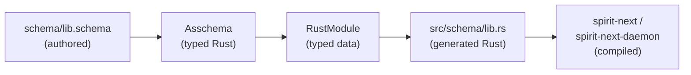
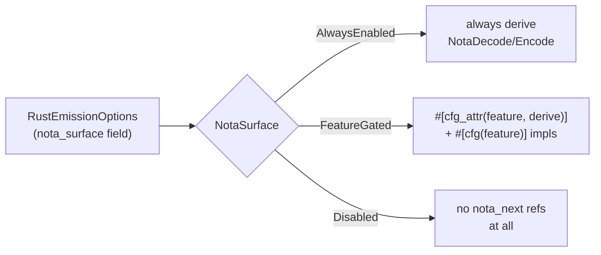
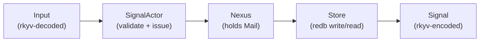
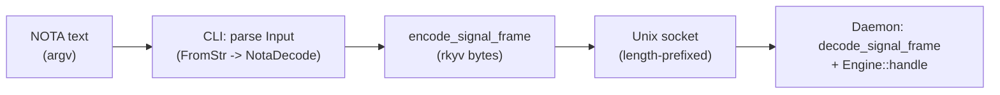
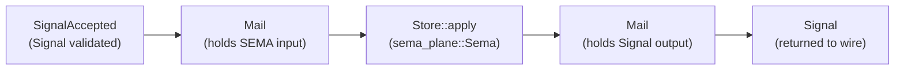
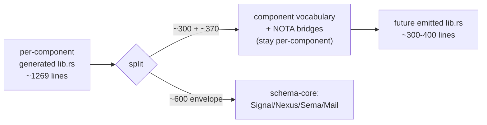

# 4 — The Runtime Integration

*Kind: vision · Topics: schema-emission, runtime-triad, nota-surface, cli-daemon-split, sema-store, schema-core-horizon · 2026-05-31 · designer lane sub-agent*

## Frame: schema-emitted types ARE the runtime nouns

The single most important fact about this stack: there is **no shadow
type layer**. Every runtime noun the daemon manipulates — `Input`,
`Output`, `Entry`, `Query`, `SemaInput`, `SemaOutput`, `Signal<Root>`,
`Nexus<Root>`, `Sema<Root>`, `NexusMail<Payload>`, `MessageSent`,
`MessageProcessed`, `MailLedgerEvent`, `DatabaseMarker`,
`SignalRejection`, `ValidationError`, the route enums, the trait
surfaces (`NexusEngine`, `SemaEngine`, `MessageSentHook`,
`MessageProcessedHook`) — comes from `src/schema/lib.rs`, which is
machine-emitted from `schema/lib.schema` through the schema pipeline
named in Spirit 1270 + 1272. The hand-written runtime code in
`spirit-next/src/{engine,nexus,store,daemon,transport,config}.rs`
exists ONLY to compose those typed nouns — it never invents a parallel
type, never shadows a generated enum, never declares a hand-rolled
mirror of the schema vocabulary. Spirit 1272 is the principle:
*"Asschema owns assembled schema data, AsschemaArtifact owns NOTA and
rkyv artifact projection, a SEMA store owns durable rkyv persistence,
and Rust emission consumes the typed Asschema object rather than
parsing side syntax."*

The runtime crate carries 1379 hand-written lines that own 1269 lines
of emitted schema; the hand-written code is a thin actor shim around
the emitted contract.

## The compilation pipeline

The pipeline from `.schema` text to a running binary is four hops,
each one passing a typed object — never a string — through the next
stage.



The build is driven from `spirit-next/build.rs`. Each stage carries
its own type — designer 435 Gap B closed when `RustModule` became a
typed data model owned by `schema-rust-next` rather than a string
buffer wrapped in a `RustWriter::line(...)` helper.

### Signatures: the pipeline's three engines

**Stage 1 — `.schema` source to `Asschema`.** The schema engine lowers
authored shorthand into typed `Asschema`. The lowering is invoked
from `spirit-next/build.rs:42-44`:

```rust
let asschema = SchemaEngine::default()
    .lower_source(source.source(), source.identity().clone())
    .expect("lower spirit-next schema");
```

**Stage 2 — `Asschema` to `AsschemaArtifact`.** The artifact is the
serializable projection of `Asschema` (Spirit 1271 — typed data
projectable to NOTA text + rkyv bytes through Nota-derived /
NotaEncode + rkyv derives). Authored at `spirit-next/build.rs:45`:

```rust
let artifact = AsschemaArtifact::new(asschema);
artifact.write_nota_file(artifact_files.nota_path()).expect(...);
artifact.write_binary_file(artifact_files.binary_path()).expect(...);
```

The artifact round-trips through both surfaces — designer 442's
anti-pattern fix (schema-next `57bab60`) made these derive-driven, not
hand-joined.

**Stage 3 — `AsschemaArtifact` to `RustModule` (typed data).**
`schema-rust-next`'s `RustEmitter` consumes the typed object —
NEVER the side text — and produces a typed `RustModule`. From
`schema-rust-next/src/lib.rs:39-82`:

```rust
pub struct RustEmitter {
    generator_name: &'static str,
    options: RustEmissionOptions,
}

impl RustEmitter {
    pub fn new(options: RustEmissionOptions) -> Self { ... }
    pub fn emit_file(&self, asschema: &Asschema) -> GeneratedFile { ... }
    pub fn emit_file_from_artifact(&self, artifact: &AsschemaArtifact) -> GeneratedFile { ... }
    pub fn emit_module(&self, asschema: &Asschema) -> RustModule { ... }
}
```

`RustModule` (`schema-rust-next/src/lib.rs:85-94`) is typed data —
Spirit 1270's Rust data model with macro declarations, type
declarations, and namespaces:

```rust
pub struct RustModule {
    file_path: String,
    generator_name: String,
    scalar_aliases: Vec<RustScalarAlias>,
    imports: Vec<RustImport>,
    declarations: Vec<RustDeclaration>,
    root_enums: Vec<RustEnum>,
    support: RustSupportModel,
    options: RustEmissionOptions,
}
```

**Stage 4 — render to source, compile to binary.** `RustModule::render`
(`schema-rust-next/src/lib.rs:154-195`) produces `RustCode`; the
checked-in `src/schema/lib.rs` is the literal text the build asserts
to match. Both the CLI and daemon binaries depend on that emitted
module — they share its typed nouns even though they compile against
different cargo features.

## NotaSurface gating (Spirit 1244)

The NOTA codec is opt-in. `RustEmitter` carries an emission option
that controls whether the emitted module derives `nota_next::NotaDecode`
/ `nota_next::NotaEncode` and emits the `from_nota_block` / `to_nota`
inherent bridges. Per Spirit 1244 (operator 246):
*"Generated component types always need binary rkyv support, while
NOTA encode/decode is opt-in for text-facing clients such as CLIs;
daemons should communicate through binary protocols so nobody can
talk NOTA directly to the daemon."*



The runtime crate uses the feature-gated form per spirit-next's
`Cargo.toml:34-39`:

```toml
[features]
default = []
nota-text = ["dep:nota-next"]

[dependencies]
nota-next = { ..., optional = true }
```

The CLI binary `[[bin]] spirit-next` declares `required-features =
["nota-text"]` (`Cargo.toml:18`); the daemon binary
`[[bin]] spirit-next-daemon` does not. The default feature set is
empty, so building the daemon alone never compiles `nota-next` into
its closure.

### The emitted gating shape

Every data-bearing schema noun gets the cfg-attr derive per
`schema-rust-next/src/lib.rs:285-292`:

```rust
fn feature_gated_derive_attribute(&self) -> Option<String> {
    Some(format!(
        "#[cfg_attr(feature = \"{feature}\", derive(\
        nota_next::NotaDecode, nota_next::NotaEncode))]"
    ))
}
```

Concretely, `Topic` from `spirit-next/src/schema/lib.rs:91-93` reads:

```rust
#[cfg_attr(feature = "nota-text", derive(nota_next::NotaDecode, nota_next::NotaEncode))]
#[derive(rkyv::Archive, rkyv::Serialize, rkyv::Deserialize, Clone, Debug, PartialEq, Eq)]
pub struct Topic(pub String);
```

The inherent `from_nota_block` / `to_nota` bridges (Topic at
`spirit-next/src/schema/lib.rs:399-408`, identical shape for every
named type) carry `#[cfg(feature = "nota-text")]`:

```rust
#[cfg(feature = "nota-text")]
impl Topic {
    pub fn from_nota_block(block: &nota_next::Block) -> Result<Self, NotaDecodeError> {
        <Self as NotaDecode>::from_nota_block(block)
    }
    pub fn to_nota(&self) -> String {
        <Self as NotaEncode>::to_nota(self)
    }
}
```

And the root `FromStr` / `Display` impls (`Output` at
`spirit-next/src/schema/lib.rs:713-726`) are equally gated, so the
daemon's binary closure carries neither the parser nor the renderer.

This is what closed designer 430's research ask and the "zero-NOTA
daemon" first slice from designer 431.

## The runtime triad: Signal -> Nexus -> SEMA

The daemon runtime is three responsibilities composed as one
`Engine`:

- **Signal admission** — validate the inbound `Input`, issue identity
  (`MessageIdentifier`, `OriginRoute`).
- **Nexus mail keeping** — hold the validated payload across the SEMA
  call as `Mail<BeingProcessed>`; translate Signal payloads to SEMA
  inputs; translate SEMA replies to Signal outputs; emit lifecycle
  events.
- **SEMA durable store** — apply the SEMA-language input to the redb
  database; produce a SEMA output.



The composition is in `spirit-next/src/engine.rs:22-79`. `Engine`
owns the SignalActor and a `Mutex<Nexus>`; Nexus owns the Store and
the MailLedger.

### Signatures: SignalActor, NexusEngine, SEMA Store

**`SignalActor`** (`spirit-next/src/engine.rs:28-32`) — the admission
actor:

```rust
#[derive(Debug, Default)]
pub struct SignalActor {
    next_message_identifier: Mutex<Integer>,
    next_origin_route: Mutex<Integer>,
}

impl SignalActor {
    pub fn accept(&self, input: Input) -> Result<SignalAccepted, SignalRejected> {
        let identifier = self.issue_message_identifier();
        let origin_route = self.issue_origin_route();
        input
            .validate()
            .map_err(|validation_error| SignalRejected { ... })?;
        let input = input.with_origin_route(origin_route);
        Ok(SignalAccepted { sent: input.message_sent(identifier), input })
    }
}
```

`Input::validate` and `Input::with_origin_route` are methods on the
schema-emitted enum — the runtime never declares its own validation
type. `MessageIdentifier`, `OriginRoute`, `SignalRejected` are
schema-emitted or directly compose schema-emitted nouns.

**`Nexus`** (`spirit-next/src/nexus.rs:23-95`) — the mail keeper:

```rust
#[derive(Debug)]
pub struct Nexus {
    store: Store,
    mail_ledger: MailLedger,
}

impl Nexus {
    pub fn new(store: Store) -> Self { ... }

    pub fn process<Payload>(&mut self, mail: NexusMail<Payload>) -> signal_plane::Signal<Output>
    where
        Mail<BeingProcessed>: FromMail<Payload>,
    {
        let in_flight = Mail::<BeingProcessed>::from_mail(mail);
        let processed = in_flight.run_sema(&mut self.store);
        processed.emit_processed(&mut self.mail_ledger.hook()).expect(...);
        processed.into_output()
    }
}

impl NexusEngine for Nexus {
    fn execute(
        &self,
        input: nexus_plane::Nexus<nexus_plane::Input>,
    ) -> nexus_plane::Nexus<nexus_plane::Output> {
        input.into_nexus_output()
    }
}
```

`NexusEngine` is the schema-emitted trait
(`spirit-next/src/schema/lib.rs:1249-1251`); the runtime is a delegate
that calls the generated `Nexus<Input>::into_nexus_output()` method.

**`Store`** (`spirit-next/src/store.rs:29-32`) — the SEMA durable store:

```rust
#[derive(Debug)]
pub struct Store {
    database: Database,
    path: PathBuf,
}

impl SemaEngine for Store {
    fn apply(
        &mut self,
        command: sema_plane::Sema<sema_plane::Input>,
    ) -> sema_plane::Sema<sema_plane::Output> {
        let origin_route = command.origin_route();
        let output = match command.into_root() {
            SemaInput::Record(entry) => match self.record(entry) { ... },
            SemaInput::Observe(query) => match self.observe(&query) { ... },
            SemaInput::Remove(record_identifier) => match self.remove(...) { ... },
        };
        output.with_origin_route(origin_route)
    }
}
```

`SemaEngine` is the schema-emitted trait
(`spirit-next/src/schema/lib.rs:1253-1255`). The store ONLY implements
that trait surface — it never invents alternate operations. Inputs
and outputs are schema-emitted nouns; the redb side is a sealed
encapsulation behind the trait.

**`Engine`** (`spirit-next/src/engine.rs:23-79`) — the composer:

```rust
#[derive(Debug)]
pub struct Engine {
    signal_actor: SignalActor,
    nexus: Mutex<Nexus>,
}

impl Engine {
    pub fn new(store: Store) -> Self { ... }

    pub fn handle(&self, input: Input) -> signal_plane::Signal<Output> {
        let accepted = match self.signal_actor.accept(input) {
            Ok(accepted) => accepted,
            Err(rejected) => return rejected.into_signal_output(self.database_marker()),
        };
        let mut nexus = self.nexus.lock().expect("nexus lock");
        accepted.process_with(&mut nexus)
    }
}
```

The full record-970 flow lives in `Engine::handle`: validate ->
issue identity -> hand to Nexus -> Nexus holds across SEMA -> reply.
No hand-rolled enum dispatches; every enum-to-enum projection
(`SemaOutput -> Output`, `Sema<Output> -> Nexus<Input>`,
`Nexus<Output> -> Signal<Output>`) is a method on the generated noun
(`spirit-next/src/engine.rs:347-398`).

## The wire path: CLI -> socket -> daemon

The CLI is the only NOTA-aware process. The wire between CLI and
daemon is exclusively rkyv-encoded `Signal` frames over a Unix socket.



The reverse direction is symmetric — the daemon writes a rkyv-encoded
`Output` frame; the CLI decodes it back to typed `Output` and renders
through `Display` (which delegates to `NotaEncode`).

### The CLI binary

`spirit-next/src/bin/spirit-next.rs:6-32` is the entire CLI:

```rust
struct SpiritNextCli { arguments: Vec<String> }

impl SpiritNextCli {
    fn run(&self) -> Result<(), Box<dyn std::error::Error>> {
        let argument = self.single_argument()?;
        let source = self.read_single_argument(argument)?;
        let input = source.parse::<Input>()?;  // FromStr -> NotaSource -> NotaDecode
        let socket_path = env::var("SPIRIT_NEXT_SOCKET")
            .unwrap_or_else(|_| String::from("/tmp/spirit-next.sock"));
        let (_route, output) = SignalTransport::connect(socket_path)?.exchange(&input)?;
        println!("{output}");  // Display -> NotaEncode
        Ok(())
    }
}
```

### The transport layer

`SignalTransport` (`spirit-next/src/transport.rs:45-101`) wraps a
length-prefixed rkyv frame protocol. The frame body itself is
schema-emitted (`Input::encode_signal_frame` /
`Input::decode_signal_frame` at `spirit-next/src/schema/lib.rs:806-830`):
the first 8 bytes are the typed short header (a discriminant
constant), the rest is rkyv bytes. The transport adds a 4-byte
length prefix on top.

```rust
pub struct SignalTransport<Stream> {
    stream: Stream,
}

impl<Stream: Read + Write> SignalTransport<Stream> {
    pub fn exchange(&mut self, input: &Input) -> Result<(OutputRoute, Output), TransportError> {
        self.write_input(input)?;
        self.read_output()
    }
    pub fn write_input(&mut self, input: &Input) -> Result<(), TransportError> {
        self.write_frame(input.encode_signal_frame()?)
    }
    pub fn read_input(&mut self) -> Result<(InputRoute, Input), TransportError> {
        Ok(Input::decode_signal_frame(&self.read_frame()?)?)
    }
}
```

The daemon's stream loop calls into the SAME transport
(`spirit-next/src/daemon.rs:82-88`):

```rust
fn handle_stream(&self, stream: UnixStream, engine: &Engine) -> Result<(), DaemonError> {
    let mut transport = SignalTransport::new(stream);
    let (_route, input) = transport.read_input()?;
    let output = engine.handle(input);
    transport.write_output(output.root())?;
    Ok(())
}
```

### The CLI single-argument rule (component-triad)

Per `skills/component-triad.md` §"The single argument rule" — every
component binary takes exactly one argument: a NOTA string, a path to
a NOTA file, or a path to a signal-encoded (rkyv) file. The CLI's
`single_argument` and `read_single_argument`
(`spirit-next/src/bin/spirit-next.rs:34-49`) enforce this:

```rust
fn single_argument(&self) -> Result<&str, Box<dyn std::error::Error>> {
    match self.arguments.as_slice() {
        [argument] => Ok(argument),
        _ => Err("expected exactly one NOTA argument or path".into()),
    }
}

fn read_single_argument(&self, argument: &str) -> Result<String, Box<dyn std::error::Error>> {
    if argument.trim_start().starts_with('(') {
        Ok(argument.to_owned())
    } else if Path::new(argument).exists() {
        Ok(fs::read_to_string(argument)?)
    } else {
        Err("inline operation must be a parenthesized NOTA value".into())
    }
}
```

Concrete CLI invocations against the deployed binary follow the same
shape as the deployed `spirit` CLI:

```sh
spirit-next "(Record ([workspace test] Decision [pilot record] High))"
spirit-next "(Observe ((Partial [workspace]) None))"
spirit-next "(Remove 1)"
spirit-next ./operation.nota
```

The argument shape is a `signal_plane::Signal<Input>` payload —
that is, the variant root `Input` inside a Signal envelope. The
schema-emitted `Input` enum (`spirit-next/src/schema/lib.rs:251-255`)
declares three variants:

```rust
pub enum Input {
    Record(Entry),
    Observe(Query),
    Remove(RecordIdentifier),
}
```

Each NOTA argument is a `(Variant payload)` form — the schema-emitted
`NotaDecode` derive recognizes the variant head, lowers the body into
the typed payload. Audit Finding 7 of designer 443 sub-agent 4 notes
this string-prefix branching is a NOTA-codec concern that should
move into `nota_next::NotaSource::from_argument` — a present horizon,
not a present blocker.

### The daemon binary's single argument

Per Spirit 1244 the daemon takes ONE binary argument — a path to a
rkyv-encoded `Configuration` file. From
`spirit-next/src/bin/spirit-next-daemon.rs:6-35`:

```rust
struct SpiritNextDaemonCli { arguments: Vec<String> }

impl SpiritNextDaemonCli {
    fn run(&self) -> Result<(), Box<dyn std::error::Error>> {
        let configuration = Configuration::from_binary_path(self.single_argument()?)?;
        Daemon::new(configuration).run()?;
        Ok(())
    }
}
```

The daemon does not call `nota-next`; the path is read as bytes and
deserialized through `rkyv::from_bytes` (config below). The
configuration is a derive-driven rkyv struct, not the older 9-field
positional NOTA record from spirit-cli.md — designer 443 sub-agent 4
Finding 4 confirms.

## The persistence path: SEMA Store

The SEMA store wraps a `redb::Database` and serves the `SemaEngine`
trait. Every `SemaInput::Record(...)` is a redb write transaction;
every `SemaInput::Observe(...)` is a redb read transaction. The
records table holds rkyv-encoded `Entry` archives keyed by `u64`
identifier; the ledger table tracks `next-identifier` and
`commit-sequence` for monotonic durability.

### The Mail<Phase> typestate

Nexus owns the mail across the SEMA call. The phase parameter is a
compile-time fact, not a logging convention — *"Nexus holds the mail
=> it is being processed"* is enforced by Rust's privacy rules.



`Mail<Phase>` (`spirit-next/src/nexus.rs:38-55`):

```rust
#[derive(Debug)]
pub struct Mail<Phase> {
    identifier: MessageIdentifier,
    origin_route: OriginRoute,
    phase: Phase,
}

#[derive(Debug)]
pub struct BeingProcessed {
    sema_input: sema_plane::Sema<sema_plane::Input>,
}

#[derive(Debug)]
pub struct Processed {
    output: signal_plane::Signal<Output>,
}
```

The phase carries phase-specific data, not a marker — so the two
phases are structurally different values. The ONLY transition is
`Mail<BeingProcessed>::run_sema` (`spirit-next/src/nexus.rs:174-186`):

```rust
fn run_sema(self, store: &mut Store) -> Mail<Processed> {
    let sema_output = store.apply(self.phase.sema_input);
    let output = sema_output
        .into_nexus_input()
        .into_nexus_output()
        .into_signal_output();
    Mail {
        identifier: self.identifier,
        origin_route: self.origin_route,
        phase: Processed { output },
    }
}
```

The method is private to the module — no external caller can produce
a `Mail<Processed>` without running SEMA. Designer 443 sub-agent 4
Finding 5 names this typestate pattern as the strongest piece of the
spirit-next design.

### The redb layout

`spirit-next/src/store.rs:12-18` declares the table layout — two
typed `TableDefinition`s:

```rust
const RECORDS: TableDefinition<u64, &[u8]> = TableDefinition::new("records");
const LEDGER: TableDefinition<&str, u64> = TableDefinition::new("ledger");
const NEXT_IDENTIFIER_KEY: &str = "next-identifier";
const COMMIT_SEQUENCE_KEY: &str = "commit-sequence";
```

The records table holds `(identifier, rkyv-encoded Entry)` pairs; the
ledger table holds two monotone counters. `Store::record`
(`spirit-next/src/store.rs:124-146`) shows the rkyv encoding:

```rust
fn record(&self, entry: Entry) -> Result<u64, StoreError> {
    let archive =
        rkyv::to_bytes::<rkyv::rancor::Error>(&entry).map_err(|_| StoreError::ArchiveEncode)?;
    let transaction = self.database.begin_write()?;
    // ... ledger reads, identifier++, commit_sequence++ ...
    let mut records = transaction.open_table(RECORDS)?;
    records.insert(identifier, &archive[..])?;
    transaction.commit()?;
    Ok(identifier)
}
```

`Entry` carries its `rkyv::Archive` / `rkyv::Serialize` /
`rkyv::Deserialize` derives from the schema emission
(`spirit-next/src/schema/lib.rs:207-214`). No hand-written
serialization; rkyv is the canonical durable form. The
`DatabaseMarker` (commit sequence + content hash digest) is a typed
schema noun — `Store::database_marker`
(`spirit-next/src/store.rs:198-203`) constructs it from the ledger +
blake3 hasher.

### The Configuration

Spirit 1244's binary-config gate is direct. `Configuration`
(`spirit-next/src/config.rs:9-12`) is a derive-driven rkyv struct:

```rust
#[derive(rkyv::Archive, rkyv::Serialize, rkyv::Deserialize, Clone, Debug, Eq, PartialEq)]
pub struct Configuration {
    socket_path: ConfigurationPath,
    database_path: ConfigurationPath,
}

#[derive(rkyv::Archive, rkyv::Serialize, rkyv::Deserialize, Clone, Debug, Eq, PartialEq)]
pub struct ConfigurationPath(String);
```

Loaded through `from_binary_path` (`spirit-next/src/config.rs:43-46`):

```rust
pub fn from_binary_path(path: impl AsRef<Path>) -> Result<Self, ConfigurationError> {
    let bytes = fs::read(path).map_err(ConfigurationError::Read)?;
    Self::from_binary_bytes(&bytes)
}

pub fn from_binary_bytes(bytes: &[u8]) -> Result<Self, ConfigurationError> {
    rkyv::from_bytes::<Self, rkyv::rancor::Error>(bytes)
        .map_err(|_| ConfigurationError::ArchiveDecode)
}
```

There is no `nota_next::*` reference in `config.rs`. The daemon's
closure has none. This was the surviving NOTA dependency named in
designer 430; it has been removed.

The configuration's two fields — `socket_path` and `database_path` —
are the minimum the daemon needs. Designer 431's vision adds a
`state path` + config-signal interface for state-aware startup; that
is a horizon, not present-day. The path forward is shaping
`Configuration` as a schema-emitted `OwnerSignal::Configure` variant
(designer 443 sub-agent 4 Finding 4 horizon).

### The daemon's bind-and-serve loop

`Daemon::run` (`spirit-next/src/daemon.rs:60-80`) opens the socket,
opens the SEMA store, builds the Engine, and serves one stream at a
time:

```rust
pub fn run(&self) -> Result<(), DaemonError> {
    if let Some(parent) = self.configuration.socket_path().parent() {
        fs::create_dir_all(parent)?;
    }
    self.remove_stale_socket()?;
    let listener = UnixListener::bind(self.configuration.socket_path())?;
    let store = Store::open(self.configuration.database_path())?;
    let engine = Arc::new(Engine::new(store));
    for stream in listener.incoming() {
        match stream {
            Ok(stream) => {
                let engine = Arc::clone(&engine);
                if let Err(error) = self.handle_stream(stream, &engine) {
                    eprintln!("spirit-next-daemon: {error}");
                }
            }
            Err(error) => return Err(DaemonError::Io(error)),
        }
    }
    Ok(())
}
```

Synchronous + Mutex-locked per designer 443 sub-agent 4 Finding 6 —
intentional pilot scope; `kameo` / `sema-engine` is the production
destination for the actor substrate.

### The integration tests

`spirit-next/tests/nix_integration.rs` exercises the full chain: Nix
builds both binaries, the test spawns the daemon against a temp
socket, invokes the CLI binary against that socket with inline NOTA
arguments, and asserts on the CLI's stdout — parsed back through the
schema-emitted `Output::FromStr` and matched on typed variants.
Eight test cases prove the record-970 flow end-to-end through the
SAME schema-emitted code path the runtime uses.

A key proof: `tests/socket_negative.rs` proves the binary boundary
**rejects raw NOTA** — sending NOTA text to the daemon's socket fails
the rkyv frame decode. Spirit 1244's intent — *"nobody can talk NOTA
directly to the daemon"* — is enforced by the codec gating + the
rkyv-only transport, both end-to-end.

## The schema-core extraction horizon

The biggest remaining cut. Designer 443 sub-agent 4 audited the
emitted module and found ~1100 lines of envelope substrate that will
appear identically in every future schema-emitted component. The
extraction lifts these into a shared `schema-core` crate; the emitter
emits `use schema_core::Signal;` instead of inline definitions.



### What lifts into schema-core

**Universal envelope substrate (~600 lines, per designer 443
sub-agent 4 Finding 1):**

- The `Signal<Root>` / `Nexus<Root>` / `Sema<Root>` envelope triple
  (`spirit-next/src/schema/lib.rs:946-1028`) — identical body,
  identical methods, parameterised only by the component's root enum.
- The `pub mod schema::Plane<S,N,M>` cross-plane wrapper
  (`spirit-next/src/schema/lib.rs:927-944`).
- `MessageIdentifier`, `OriginRoute`, `MessageRoot`, `MessageSent`,
  `NexusMail<Payload>`, `MessageProcessed<Reply>`, their hook traits
  (`spirit-next/src/schema/lib.rs:892-1119`).
- The `signal` / `nexus` / `sema` plane module re-exports
  (`spirit-next/src/schema/lib.rs:1157-1173`).
- The frame primitives: `short_header` constants
  (`spirit-next/src/schema/lib.rs:728-737`), `SignalFrameError`
  (`spirit-next/src/schema/lib.rs:739-762`), the
  `encode_signal_frame` / `decode_signal_frame` methods on `Input` and
  `Output` (`spirit-next/src/schema/lib.rs:806-890`).
- The `NexusEngine` / `SemaEngine` / `UpgradeFrom` / `AcceptPrevious`
  trait surfaces (`spirit-next/src/schema/lib.rs:1249-1267`).

**Runtime substrate (~300 lines):**

- The `Mail<Phase>` typestate pattern with `BeingProcessed` /
  `Processed` phase types (`spirit-next/src/nexus.rs:38-55`).
- The `MailLedgerHook` infallible event sink pattern
  (`spirit-next/src/engine.rs:46-54, 203-255`).
- The `SemaStore<Layout: SemaTableLayout, Engine: SemaEngine>` redb
  substrate (designer 443 sub-agent 4 Finding 3) — wraps the
  `Database::create` / `begin_write` / `open_table` / `commit` cycle
  and the five `From<redb::*Error>` impls.

### What stays per-component

- The schema vocabulary itself — `Topic`, `Topics`, `Entry`, `Query`,
  `Magnitude`, `Kind`, `Input`, `Output`, `SemaInput`, `SemaOutput`,
  `NexusInput`, `NexusOutput`, the receipt / records / report
  payloads, `ValidationError`, `MailLedgerEvent` enum, `SentMail`,
  `ProcessedMail`, `DatabaseMarker` — what makes the component itself.
- The NOTA bridges (`from_nota_block` / `to_nota`) emitted under
  cfg-attr — these reference the component-specific types and must
  stay co-located.
- The runtime composition — `Engine` as composer of SignalActor +
  Nexus + Store — though Engine itself becomes much smaller once
  Mail<Phase> + the variant projections live in schema-core.

### What this unblocks

- **One place to fix bugs in envelope code.** A bug in `OriginRoute`
  is fixed once, not re-emitted into every component.
- **Stage-5 self-hosting** (Spirit 1246) — once schema-core exists,
  the emitter can be expressed against shared substrate, and the
  bootstrap shrinks.
- **Multi-component triad work.** A future component triad — say a
  hypothetical `persona-introspect` — emits ~300 lines of its
  vocabulary and writes ~200 lines of runtime composition, total ~500
  lines per component instead of today's ~1700.

Designer 435 Gap C named this; designer 443 sub-agent 4 confirmed the
line-count at scale; this is the next architectural cut after the
schema-emission pipeline is fully derive-driven.

### Companion cut: schema-aware variant projection

The schema-core extraction leaves a smaller residue — per designer
443 sub-agent 4 Finding 2, the three identical `FromMail<Payload>`
impls in `spirit-next/src/nexus.rs:105-154` and the variant-by-variant
hand-mapping in `spirit-next/src/engine.rs:326-345, 347-398` are
schema-derivable. The cure is an emitter that derives `impl
From<Variant> for Enum` for each variant payload type plus
sibling-plane translation directives. Then `FromMail` collapses to
one generic impl; the runtime composition becomes "Engine composes
SignalActor + Nexus + Store" and not much else.

Smaller than schema-core but compounds with it. Together: ~200 lines
of variant glue + ~600 lines of envelope substrate + ~300 lines of
runtime substrate disappear from spirit-next; the savings multiply
across every future component.

## Cross-references

- **Spirit records** —
  1244 (operator 246's NOTA-surface split, Maximum, 2026-05-30, LIVE),
  1246 (Stage 5 self-hosting, Maximum, 2026-05-30, in-flight),
  1249 (Magnitude rkyv discriminant correction, Maximum, 2026-05-30),
  1270 (Asschema as typed Rust data model with NOTA projection,
  Maximum, 2026-05-31),
  1271 (Asschema storable as rkyv in SEMA, projectable to NOTA text +
  rkyv binary, Maximum, 2026-05-31),
  1272 (the four-object separation principle, Maximum, 2026-05-31),
  1274 (positional reading of root struct, Maximum, 2026-05-31),
  1277 (input/output as known fields, not data-carrying variants,
  Maximum, 2026-05-31).
- **Old reports agglomerated here** —
  designer 430 §codec opt-in research closed via NotaSurface
  (LIVE via operator 246 + schema-rust-next `c733a0d`);
  designer 431 §zero-NOTA daemon closed at startup (LIVE via
  Configuration as rkyv struct);
  designer 431 §state-aware startup + config-signal (FUTURE horizon
  per designer 443 sub-agent 4 Finding 4 — `Configuration` should
  become an `OwnerSignal::Configure` variant);
  designer 435 Gap A (macro-table-as-data) — closed by nota-next
  3f46c2e + designer 444 §3;
  designer 435 Gap B (RustModule-as-data) — closed (RustModule is
  typed data in schema-rust-next `c733a0d`);
  designer 435 Gap C (schema-core extraction) — the present horizon,
  carried forward here as §"The schema-core extraction horizon".
- **Live code** —
  `/git/github.com/LiGoldragon/spirit-next/src/lib.rs:21-52` (the
  runtime crate's public exports — every name is schema-emitted or a
  thin shim around schema-emitted nouns);
  `/git/github.com/LiGoldragon/spirit-next/src/engine.rs:22-79` (the
  Engine composer + the record-970 flow);
  `/git/github.com/LiGoldragon/spirit-next/src/nexus.rs:23-95` (Nexus
  + the Mail<Phase> typestate);
  `/git/github.com/LiGoldragon/spirit-next/src/store.rs:29-82` (Store
  + the SemaEngine trait impl);
  `/git/github.com/LiGoldragon/spirit-next/src/transport.rs:45-101`
  (length-prefixed rkyv frame transport);
  `/git/github.com/LiGoldragon/spirit-next/src/daemon.rs:51-94` (the
  bind-and-serve loop);
  `/git/github.com/LiGoldragon/spirit-next/src/config.rs:9-62`
  (Configuration as rkyv struct, no NOTA);
  `/git/github.com/LiGoldragon/spirit-next/src/bin/spirit-next.rs:6-49`
  (CLI single-argument + NOTA parse + rkyv exchange + NOTA print);
  `/git/github.com/LiGoldragon/spirit-next/src/bin/spirit-next-daemon.rs:6-35`
  (daemon single binary-config argument);
  `/git/github.com/LiGoldragon/spirit-next/Cargo.toml:11-39` (binary
  declarations + feature gating);
  `/git/github.com/LiGoldragon/spirit-next/build.rs:21-58` (the schema
  pipeline driven from the build);
  `/git/github.com/LiGoldragon/schema-rust-next/src/lib.rs:24-82,
  85-196, 211-297` (RustEmitter + RustModule + NotaSurface);
  `/git/github.com/LiGoldragon/spirit-next/src/schema/lib.rs` (the
  full generated module — 1269 lines, the canonical schema-emitted
  contract).
- **Recent operator landings** —
  spirit-next `c4bf4d7` (repinned known-root schema stack) +
  `be8b1b5` (repinned direct asschema roots with Spirit 1267/1268 +
  strict-brace);
  the existing `spirit-next/src/store.rs` named by designer 443 as the
  parallel substrate to schema-next's `AsschemaStore` and a candidate
  for generic `SemaStore<T>`.
