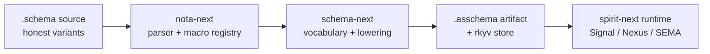

# 445 — Next stack audit — nota-next + schema-next + spirit-next

## TL;DR

The three substrate repos are in good shape. The architecture lines named in designer 444 are honored in code: NOTA owns parsed-structure + macro-node programming + derives; schema-next consumes the NOTA macro-node mechanism with schema vocabulary; spirit-next uses schema-emitted types as wire nouns through the Signal/Nexus/SEMA triad. The Spirit 1287 / 1290 body-stream substrate is integrated. The Spirit 1294 enum-body honesty migration is fully landed — schema sources, lowered macro definitions, and assembled artifacts all carry parenthesized data-variant records `(VariantName PayloadType)` and bare PascalCase unit variants.

Four small findings remain. None is structural; each is operator-lane code work, sized as a discrete bead. The biggest discipline-relevant one is a single free function in `nota-next/src/parser.rs:972` — `fn opening_starts_declaration(name: &str, opening: char) -> bool`. That's the only Rust-discipline violation across ~9 952 lines of production source surveyed.

## Why this audit, why now

Psyche directive: "refresh your skills and audit the nota/schema/spirit next implementations." The substrate has had heavy operator work since designer 444 landed (2026-05-31): integrating the body-stream substrate, migrating to honest enum bodies per Spirit 1294, and several smaller repins. This audit checks live code against the constraint set named in `AGENTS.md` hard overrides + `skills/nota-design.md` + `skills/rust/methods.md` + `skills/abstractions.md`, plus designer 444's §5 horizon ledger.

## Method

| Step | What I did |
|---|---|
| Refresh | Read `AGENTS.md`, `skills/skills.nota`, `skills/designer.md`, `skills/nota-design.md`. |
| Read live source | Read `nota-next/src/{lib,macros,parser,codec}.rs`, `schema-next/src/{lib,macros,engine,store,asschema}.rs`, `spirit-next/src/{lib,engine,nexus,store,transport,daemon,config,bin/*}.rs`. |
| Cross-check schema sources | Read `spirit-next/schema/lib.schema`, `schema-next/schemas/{core,builtin-macros,spirit-min}.schema`, the assembled `.asschema` artifacts. |
| Discipline sweep | `grep -nE "^(pub )?fn [a-z]"` across production `.rs` files (free-function detector), grep for unit-struct `pub struct X;` (ZST namespace detector), check encoder joins for Spirit 1278 patterns. |
| Compare to horizon ledger | Read designer 444 §5 horizons and verify each item's "landed" claim against current code. |

## Stack overview — what is live



The five-node chain is the steady state today. Each arrow corresponds to a derive-driven projection, not glue code:

- A → B: `nota-next::Document::parse` lifts source text into `Vec<Block>` with span tracking and structural classification.
- B → C: `schema-next::MacroRegistry::with_schema_defaults` (engine.rs:382) plugs schema vocabulary into the nota macro-node mechanism; `SchemaEngine::lower_source` walks document root objects into typed `Asschema`.
- C → D: `Asschema::to_nota_body` (derive-driven `#[nota(known_root)]`) + `rkyv::to_bytes` emit the durable artifact pair; `AsschemaStore` persists rkyv bytes in redb keyed by `SchemaIdentity`.
- D → E: `spirit-next/build.rs` calls `RustEmitter` on the checked-in `.asschema`; the emitted `src/schema/lib.rs` carries `Input`/`Output`/`NexusInput`/`NexusOutput`/`SemaInput`/`SemaOutput` plus the `MessageSent`/`MessageProcessed`/`OriginRoute` support surface. The hand-written runtime substrate (`Engine`, `Nexus`, `Mail<Phase>`, `Store`, `MailLedger`, `SignalActor`) attaches behavior to those schema-emitted nouns.

This matches designer 444 §"The one-paragraph architecture story" exactly.

## What's clean — discipline check by repository

### nota-next — clean apart from one free function

The macro-node mechanism (`src/macros.rs`) and codec layer (`src/codec.rs`) are textbook: every public surface is a method on a data-bearing type. `Pattern`, `PatternElement`, `MacroNodeDefinition`, `MacroCandidate`, `MacroRegistry`, `MacroMatch`, `MacroCaptures`, `CapturedValue`, `NotaSource`, `NotaBody`, `NotaDocumentBody`, `NotaBlock`, `NotaString`, `NotaCollection`, `NotaBodyEncoding` — all data-bearing, all methods, no ZST holders.

The body-stream substrate is consistent across the codec — `NotaSource::parse_body::<Value: NotaBodyDecode>()` is the single semantic entry point; matched delimiters expose `NotaBody` directly through `CapturedValue::Body(NotaBody)` (macros.rs:530-535) so the next semantic parser receives body contents, never the wrapper delimiter. Spirit 1287 + 1290 are honored.

The recursive macro pattern substrate is the right shape: `DelimitedShape::with_children(Pattern)` (macros.rs:510-513) takes another `Pattern` over the matched block's children, letting consumers declare arbitrarily nested constraints. This is the substrate the data-variant macro uses to enforce `(VariantName PayloadType)` shape inside a `MacroDelimiter::Parenthesis` (schema-next/src/macros.rs:447-462) — exactly the structural macro definition designer 444 §3 specifies.

### schema-next — clean

`src/engine.rs` (808 lines) has six tightly scoped data-bearing types — `SchemaEngine`, `KeyValueDeclarationMacro`, `KeyValueDeclaration`, `MacroSignature`, `RootImportsMacro`, `RootNamespaceMacro`, `NamespaceBlock`, `RootEnumMacro`, `RootEnumBlock` — each with a clear responsibility and inherent methods. The `SchemaError` enum at lines 50-160 carries 25 named variants with precise payloads; no anyhow leakage.

`src/macros.rs` (626 lines): `MacroPosition`, `MacroObject`, `MacroPair`, `SchemaMacro` trait, `MacroContext`, `MacroOutput`, `MacroRegistry`, `MacroNodeDefinition`, `MacroDispatch` — all data-bearing, all methods. The structural macro definitions for the seven positions (RootImports / RootInput / RootOutput / RootNamespace / NamespaceDeclaration / StructFields / EnumVariants / TypeReference) compose the nota-next `PatternElement` substrate cleanly.

`src/store.rs` (202 lines): `AsschemaStore` + `AsschemaStoreKey`. The store has six explicit `SemaDatabaseOperation` variants for redb fault attribution — that's the typed error shape that Spirit 1278's hand-rolled-string concerns warn against. `put_artifact` / `get_artifact` / `export_nota_file` are the public surface; the underlying `put_binary_bytes` and `ensure_tables` stay private.

`src/declarative.rs` (2233 lines): the largest single file. Surface-grep shows ~25 distinct data-bearing types under one module — `DeclarativeMacroLibrary`, `MacroLibraryArtifact`, `MacroLibraryArtifactPath`, `MacroLibraryData`, `MacroLibrarySourceEntryData`, `MacroDefinitionData`, `MacroPatternData`, `MacroPatternObjectData`, `MacroPatternDelimitedData`, `MacroTemplateData`, `MacroTemplateObjectData`, `MacroTemplateDelimitedData`, `MacroDelimiter`, `MacroLibrarySourceEntry`, `MacroDefinition`, `MacroPattern`, `PatternObject`, `MacroTemplate`, `TemplateObject`, `CaptureName`, `MacroBindings`, `SingleMacroBinding`, `RepeatedMacroBinding`, `DeclarativeSchemaMacro`, `ExpandedTemplate`, `AssembledTemplate`, `AssembledType`, `AssembledFields`, `AssembledVariants`. All methods. Designer 444 §"Current truth" confirms `ExpandedTemplate` no longer round-trips through text; the `source: String` is a trace surface only.

### spirit-next — clean

`Engine`, `SignalActor`, `SignalAccepted`, `SignalRejected`, `MailLedger`, `MailLedgerHook`, `Nexus`, `Mail<Phase>`, `BeingProcessed`, `Processed`, `Store`, `Daemon`, `SocketPath`, `Configuration`, `ConfigurationPath`, `SignalTransport<Stream>` — every type carries data and owns its methods. The `Mail<Phase>` typestate (nexus.rs:39-43, 47-49, 53-55, 125-191) implements designer 444 §"Runtime triad / Nexus" exactly: `BeingProcessed` holds `sema_input`, `Processed` holds `output`, and `run_sema` (nexus.rs:143-154) is the only constructor of `Mail<Processed>`. That's the compile-time "Nexus holds the mail ⇒ it is being processed" invariant.

The two binaries (`src/bin/spirit-next.rs` + `src/bin/spirit-next-daemon.rs`) honor the AGENTS.md single-NOTA-argument rule: each defines `SpiritNextCli` / `SpiritNextDaemonCli` with `single_argument` validation. No flags. `fn main` is the only free function — explicitly allowed.

### Schema sources are honest

All four `.schema` source files (`spirit-next/schema/lib.schema`, `schema-next/schemas/{core,spirit-min}.schema`, plus a clean view of the in-source dispatched macros) carry honest enum bodies:

```nota
; spirit-next/schema/lib.schema (live, lines 2-3)
[(Record Entry) (Observe Query) (Remove RecordIdentifier)]
[(RecordAccepted SemaReceipt) (RecordsObserved ObservedRecords)
 (RecordRemoved RemoveReceipt) (Error ErrorReport)
 (Rejected SignalRejection)]
```

Data variants are parenthesized records; unit variants would be bare PascalCase symbols. The assembled artifact (`spirit-next/schema/lib.asschema`) carries the same shape lifted into `(VariantName (Some (Plain TypeName)))` records. The structural macro that owns this shape (`schema-next/src/macros.rs:432-465`) is a two-case registry — `unit variant` matching a bare PascalCase atom + `data variant` matching a `MacroDelimiter::Parenthesis` with two nested children captured as `variant_name` (PascalCase) + `payload` (any). Spirit 1294 is fully discharged in code.

The retired `@`-suffix dishonest shorthand has no remaining presence in the source files; the recognized form is the one shown above.

## Findings

Four findings, each with file:line, the discipline citation, and a bead-shaped action. None blocks the substrate; all are small.

### Finding 1 — Free function in production code (high)

`nota-next/src/parser.rs:972` defines:

```rust
fn opening_starts_declaration(name: &str, opening: char) -> bool {
    matches!(opening, '[' | '{')
        && name
            .split(':')
            .next_back()
            .unwrap_or(name)
            .chars()
            .next()
            .is_some_and(|character| character.is_ascii_uppercase())
}
```

This is the only free function across `nota-next/src/` + `schema-next/src/` + `spirit-next/src/`. It violates the AGENTS.md hard override: *"Every Rust function is a method or associated function on an `impl` block of a NON-ZERO-SIZED data-bearing type, or a trait impl. Free functions are forbidden except in `#[cfg(test)]` modules and `fn main()`."*

The verb is "does this name look like a declaration name when followed by this opening delimiter" — that's a question the **name atom** can answer about itself. The natural home is a method on `Atom`:

```rust
// in nota-next/src/parser.rs, on impl Atom
pub fn leads_declaration_at_opening(&self, opening: char) -> bool {
    matches!(opening, '[' | '{')
        && self
            .text
            .split(':')
            .next_back()
            .unwrap_or(&self.text)
            .chars()
            .next()
            .is_some_and(|character| character.is_ascii_uppercase())
}
```

The caller at line 711 becomes `if name_atom.leads_declaration_at_opening(next)` where `name_atom` comes from the result of `parse_atom_until_at_binding`. The current code already has the atom in scope (line 695 calls `.atom()`); the refactor is a five-line shuffle.

Bead-shaped action: "operator: move `nota-next::opening_starts_declaration` into `impl Atom`; rename to `leads_declaration_at_opening`; update callsite at parser.rs:711."

### Finding 2 — One-impl trait that should be an inherent method (low)

`nota-next/src/parser.rs:983-999` defines `trait AtBindingOpening` with one method, impl'd only by `Delimiter`. There is no polymorphism — the trait has a single implementor:

```rust
trait AtBindingOpening {
    fn with_source_closing(self, opening: char) -> (Self, char)
    where
        Self: Sized;
}

impl AtBindingOpening for Delimiter {
    fn with_source_closing(self, opening: char) -> (Self, char) { ... }
}
```

This is a trait-as-namespace pattern. `Delimiter::with_source_closing` would be a direct inherent method with the same signature; the trait carries no abstraction value.

Discipline citation: `skills/abstractions.md` §"Verb belongs to noun" — `with_source_closing` belongs to `Delimiter`. The trait adds an indirection without adding a noun.

Bead-shaped action: "operator: drop `trait AtBindingOpening`; move `with_source_closing` into `impl Delimiter` as inherent method; remove the `use` if any."

### Finding 3 — CLI NOTA-prefix detection is overly narrow (low)

`spirit-next/src/bin/spirit-next.rs:42` detects inline NOTA by:

```rust
if argument.trim_start().starts_with('(') {
    Ok(argument.to_owned())
}
```

This assumes the root NOTA object is always a parenthesized record. That holds for `Input` today (an enum of variants like `(Record (Entry ...))`), but it's a thin slice of the NOTA grammar bleeding into the CLI layer. A root could legitimately be `[...]` (vector), `{...}` (map), a bare atom, or `[|...|]` (pipe text). The check is also why the CLI cannot accept some test fixtures inline.

This is **already on designer 444's horizon ledger as item 5**: *"NOTA source helper for inline-vs-path argument handling — the CLI's `read_single_argument` string-prefix branching belongs in nota-next as `NotaSource::from_argument`."* Adding this finding to confirm the horizon is still accurate.

The right shape: a `NotaSource::from_cli_argument(arg: &str) -> Result<NotaSource, NotaSourceError>` that tries inline parse first (a real `Document::parse` attempt against any block shape), and falls back to filesystem-path resolution if parsing fails or the source is too short. The CLI loses the prefix check and the bin file shrinks from ~50 lines to ~30.

Bead-shaped action: "operator: add `NotaSource::from_cli_argument` in nota-next; replace the prefix check at `spirit-next/src/bin/spirit-next.rs:42-49`." Same as designer 444 §5 item 5.

### Finding 4 — `SchemaError` Display uses Debug fallback (low)

`schema-next/src/engine.rs:185-189` impls Display for `SchemaError`:

```rust
impl std::fmt::Display for SchemaError {
    fn fmt(&self, formatter: &mut std::fmt::Formatter<'_>) -> std::fmt::Result {
        write!(formatter, "{self:?}")
    }
}
```

Display === Debug is a placeholder. The 25 variants each carry typed payloads; a real Display would render them as prose. Today the error message a user sees is Rust struct-debug syntax. Mild — not blocking, but worth tightening when an error display lands in user-facing surface area.

Discipline citation: `skills/rust/errors.md` (typed errors at crate boundary) — typed boundaries imply human-readable Display.

Bead-shaped action (small): "operator: write inherent `match` Display impl for `SchemaError`; one short sentence per variant; cite expected/found values where typed payloads carry them."

## What's NOT a finding (close calls reviewed)

These were checked and are not violations:

- **`NotaBodyEncoding::to_nota` uses `self.fields.join("\n")` (codec.rs:288)** — Spirit 1278 frames hand-rolled `join("\n")` as anti-pattern when synthesizing output from disjoint sources. Here the noun *is* a list of pre-rendered field encodings; the join is the noun's natural emission method. Fine.
- **`spirit-next` daemon reads `SPIRIT_NEXT_SOCKET` env var (bin/spirit-next.rs:27)** — That's the CLI, not the daemon. The CLI uses env-var-or-default to find the socket; the daemon takes only a binary `Configuration` path. Designer 444 §"runtime integration" §"The CLI single-argument rule" reads this as "configuration via NOTA argument is the rule for the wire shape; the socket env var is the CLI's connection convention". Tolerable; could move into Configuration if multiple connections need orchestration, but not today.
- **Direct destructuring on `Block::Delimited { delimiter, root_objects, .. }` in schema-next/src/engine.rs:471-482** — The match needs both the delimiter and the root_objects in one event; destructuring is the natural choice over chained `as_delimited(...)` calls. The `as_delimited` accessor exists; the engine uses it when only the body is needed (e.g. `RootEnumBlock::from_block`).
- **`SignalTransport<Stream>` generic parameter** — Not a ZST namespace; the type carries a `stream: Stream` field. Generic over `Read + Write` enables in-memory testing without `UnixStream`. Real value.

## Designer 444 §5 horizon ledger — accuracy check

Item-by-item against the live state:

| Horizon item | Status verified |
|---|---|
| 0 — Body-stream substrate (Spirit 1287 + 1290) | LANDED. `NotaBody` first-class type; `NotaBodyDecode` canonical entry; `CapturedValue::Body(NotaBody)` macros.rs:530-535; `RootEnumBlock` / `NamespaceBlock` / `RootImportsMacro` consume bodies (engine.rs). |
| 0a — Schema source enum-body honesty (Spirit 1294 / 1295) | LANDED. Schema sources, the structural macro at macros.rs:432-465, and the `.asschema` artifacts all carry the honest parenthesized form. The retired `@`-suffix shorthand has no remaining presence. |
| 1 — Schema-core extraction | OPEN. Confirmed by reading spirit-next/src/lib.rs:39-49: the generated `lib.rs` re-exports ~30 schema-emitted nouns directly, no schema-core crate boundary yet. Headline horizon. |
| 2 — Generic `SemaStore<T>` + `SerializableArtifact<T>` substrate | OPEN. AsschemaStore (schema-next) and Store (spirit-next) are independent concrete redb-backed stores today. |
| 3 — `RustModule`-as-data completeness | OPEN. Not directly verified in this audit; designer 443 + operator 265 are the canonical source. |
| 4 — Schema-emitted variant projections | OPEN. spirit-next/src/engine.rs and nexus.rs still contain hand-written translations (`into_signal_output`, `into_nexus_input`, `from_mail`); not yet schema-emitted. |
| 5 — NOTA source helper for inline-vs-path argument | OPEN. Confirmed by Finding 3 above — the prefix check is still at spirit-next/src/bin/spirit-next.rs:42. |

The §5 ledger is accurate as written. No updates needed.

## Cross-references

- `reports/designer/444-stack-vision-2026-05-31/` — full vision meta-report this audit confirms.
- `reports/designer/443-design-improvements-audit-2026-05-31/` — the design-improvement audit feeding the horizon list.
- `reports/operator/265-programmable-nota-structural-macro-vision-2026-05-31/` — operator's parallel reading.
- `reports/operator/267-body-stream-parser-adoption-2026-05-31.md` — operator's landing report for Spirit 1287 + 1290.
- `reports/operator/268-working-vision-nota-schema-asschema-spirit-2026-05-31.md` — operator's working vision after the migration.
- Spirit records 1259 (strict brace), 1263 (macro nodes at NOTA layer), 1267-1269 (vector homogeneity + honest notation), 1272 (four logical planes), 1278 (no hand-rolled string assembly), 1279 (two-layer parsing), 1280 (structural over text macros), 1287 / 1290 (body-stream substrate), 1294 / 1295 (enum-body honesty).
- `AGENTS.md` hard overrides — Rust method-only rule, NOTA argument rule, NOTA bracket-string rule.
- `skills/rust/methods.md` + `skills/abstractions.md` — the rules behind Findings 1 + 2.
- `skills/nota-design.md` — the canonical NOTA discipline.

## Conclusion

Substrate is sound. The architecture lines in designer 444 are honored in code. Four operator-lane refinements remain; the most discipline-relevant is the single free function at `nota-next/src/parser.rs:972`. No structural change recommended; the horizon ledger continues to point at the right next slices (schema-core extraction stays the headline).
