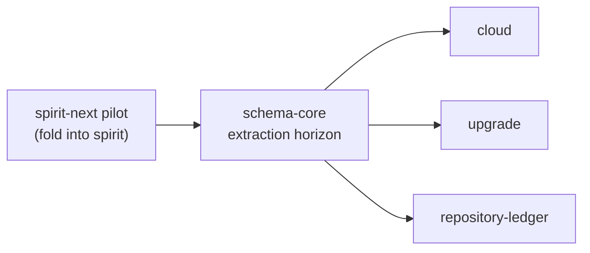
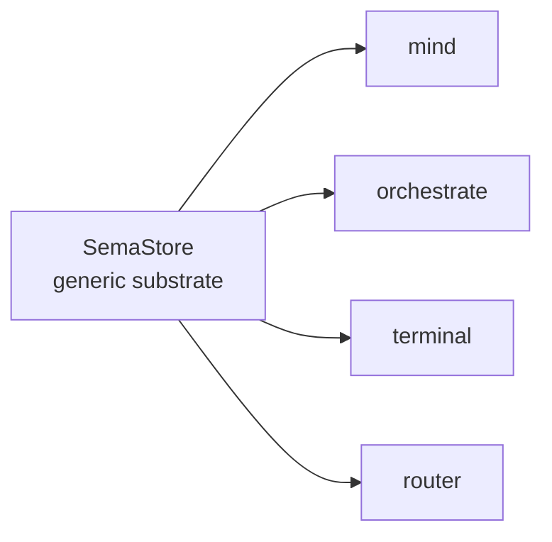
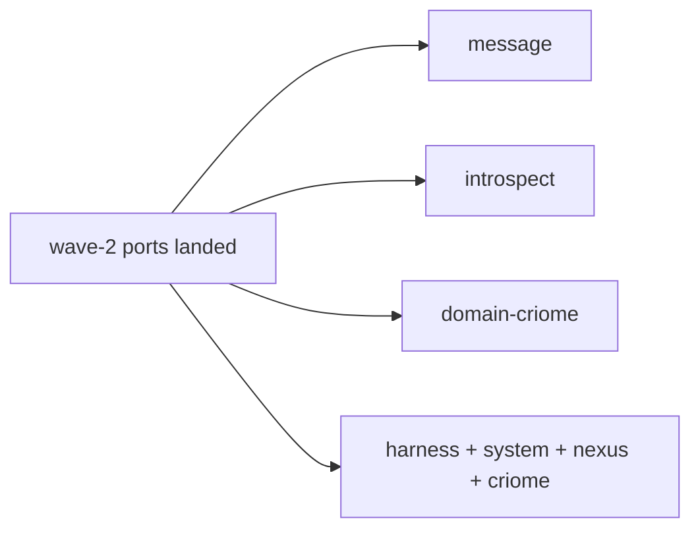

# 446-1 — Component landscape for next-stack porting

## TL;DR

Across the active fleet, **fifteen components are realistic next-stack porting candidates** and one — `spirit` proper (the component the persona-spirit production daemon is being renamed into) — is the strongest first port. Spirit is the canonical worked example already: `spirit-next/schema/lib.schema` is the file `schema-next` lowers in `build.rs`, and the runtime triad over schema-emitted nouns is the recipe sub-agent 2 will codify. Folding `spirit-next`'s pilot back into the real `spirit` repo (whose ARCHITECTURE.md §3 explicitly names schema-driven contract as the destination shape) IS the first port — every other candidate inherits the schema-core extraction horizon from this slice.

Of the remaining fourteen candidates:
- **Wave 1 (port after schema-core lands)**: `cloud`, `upgrade`, `repository-ledger`. Triads with signal+owner-signal pairs already minted, daemon either skeletal or single-purpose, ARCH already names the schema cutover as planned.
- **Wave 2 (port after generic `SemaStore<T>` substrate)**: `mind`, `orchestrate`, `terminal`, `router`, `message`, `introspect`. Triads with mature runtimes; porting these is mostly noun replacement plus contract surface migration.
- **Wave 3 (later — large signal trees, dependencies on intermediate work)**: `system`, `domain-criome`, `harness`, `nexus`, `criome`. Either paused, infrastructural-but-typed-light, or scoped down to one provider integration.

The DELIBERATE non-candidates: `signal-frame` (wire kernel, runtime-free), `sema` + `sema-engine` (library substrate), the legacy `schema` (being replaced by the schema-next pipeline this research is about), `lore` + `TheBookOfSol` + `chronos` (prose / adjacent), the Horizon-leaner-shape repos (`horizon-rs` / `lojix` / `goldragon` / `criomos-horizon-config`) which carry NOTA but not schema-emitted wire types and are an orthogonal deploy stack.

## Why this scan

Per the orchestrator frame (`reports/designer/446-next-stack-porting-research-2026-06-01/0-frame-and-method.md`): the substrate the porting work targets is the four-object next stack — `Asschema` data + `AsschemaArtifact` projection + `AsschemaStore` persistence + `RustEmitter` consumption, derive-driven end to end from `schema/lib.schema` source through `schema-next` lowering to `schema-rust-next` emission to runtime nouns. The audit (`reports/designer/445-next-stack-audit-2026-06-01.md` §"Stack overview") confirms the spirit-next pilot ships a clean five-node chain (source → nota-next → schema-next → artifact → spirit-next runtime); the question this report answers is **which other components in `protocols/active-repositories.md` can absorb that chain shape, and in what order**.

The audit's §5 ledger names the headline horizon — **schema-core extraction** (~470 lines of byte-identical envelope substrate + ~300-400 lines of runtime substrate per emitted component). Until schema-core lands, every additional port re-emits the same support nouns inline. That dependency dominates wave ordering below.

## Method

| Step | What I did |
|---|---|
| Read frame + audit | `446/0-frame-and-method.md`, `444/0-frame-and-method.md`, `444/5-overview.md`, `445-next-stack-audit-2026-06-01.md`. |
| Read substrate ARCH | `spirit-next/ARCHITECTURE.md` (the canonical worked example), `spirit-next/schema/lib.schema`. |
| Read component map | `protocols/active-repositories.md` — every entry in §"Current Core Stack" and §"Adjacent Active Work". |
| Read candidate ARCH | For each plausible candidate: `<repo>/ARCHITECTURE.md`. Paired contract repos checked for `MUST IMPLEMENT — three-layer migration` sections (signals the surface is ready for schema-emitted operation enums). |
| Cross-check signal pairs | `find` confirmed `signal-<component>` + `owner-signal-<component>` repos exist on disk for each candidate. |
| Apply discipline overrides | AGENTS.md hard overrides — NOTA bracket strings, full English identifiers, 5-node graph cap, no `---` rules. |

## The "ported" test

A component is **ported** to the next stack when **its wire-and-runtime nouns are schema-emitted from a `schema/lib.schema` source through `schema-next` + `schema-rust-next`, replacing hand-written Rust wire types**. The hand-written runtime stays (actors, daemon main loop, storage methods) — it attaches behavior to schema-emitted nouns. Per the frame's "What 'ported' means in this research" section, this also pulls in:

1. The CLI + daemon single-NOTA-argument rule (AGENTS.md §"NOTA is the only argument language").
2. The rkyv-only daemon wire (NotaSurface feature-gating on the runtime crate).
3. Configuration as a typed rkyv file consumed by daemon-side `from_binary_path`.
4. A `build.rs` that lowers the schema source and emits checked-in Rust at `src/schema/lib.rs`.

NOT in scope: the schema-core extraction itself (designer 444 §5 horizon 1 — sub-agent 3's territory). This landscape treats schema-core as a dependency that gates wave ordering, not a thing to plan.

## The candidates table

Columns: **substrate** = current type substrate (`hand` = hand-written Rust enums via `signal_channel!`; `legacy-schema` = the older `schema` crate consumer; `signal-only` = contract minted but no daemon types yet; `skeletal` = both contract + runtime are placeholder); **contract pair** = `Y` if both `signal-<X>` + `owner-signal-<X>` repos exist; **cost** = port-cost (S/M/L); **benefit** = port-benefit (S/M/L); **wave** = first / second / later.

| Component | Substrate | Contract pair | Cost | Benefit | Wave |
|---|---|---|---|---|---|
| `spirit` (folding spirit-next pilot in) | hand + schema-next pilot | Y (`signal-spirit`, `core-signal-spirit`) | S | L | **first** |
| `cloud` | hand (`signal_channel!`) | Y | S | L | first |
| `upgrade` | skeletal | Y | S | M | first |
| `repository-ledger` | hand (`signal_channel!`) | Y | M | M | first |
| `mind` | hand (`signal_channel!`, mature) | Y | L | L | second |
| `orchestrate` | hand (`signal_channel!`, mature) | Y | L | L | second |
| `terminal` | hand (`signal_channel!`, mature, large surface) | Y | L | L | second |
| `router` | hand (`signal_channel!`, mature) | Y | L | L | second |
| `message` | hand (`signal_channel!`, mature) | Y (only ordinary; owner deferred) | M | M | second |
| `introspect` | hand + reads peer contracts | Y (only ordinary on `signal-introspect`) | L | M | second |
| `system` | hand, paused-state skeleton | Y (`signal-system` only; no owner repo) | M | S | later |
| `domain-criome` | skeletal | Y | M | M | later |
| `harness` | hand | Y (only `signal-harness` ordinary) | M | M | later |
| `nexus` | NOTA semantic vocab; no wire daemon | N (no signal-nexus repo) | M | S | later |
| `criome` | scoped down to Spartan BLS daemon | Y (only `signal-criome` ordinary) | M | M | later |

## Boilerplate-cost evidence per port

The wave-1 and wave-2 boundaries are GATED by horizon work. Concrete numbers from designer 444 §5 + audit §5 + the spirit-next pilot:

| Substrate that lifts | Lines today (per port, repeated) | After horizon |
|---|---|---|
| Envelope substrate (`MessageSent`, `MessageProcessed`, `OriginRoute`, `MessageIdentifier`, `Mail<Phase>` typestate scaffolding, `MailLedgerHook`) | ~470 lines per emitted component (byte-identical) | One `use schema_core::*` import per consumer after horizon 1 (schema-core extraction). |
| Runtime substrate (`Engine`-as-composer pattern, `Mail<Phase>` typestate methods, `MailLedger` actor scaffolding, `SignalActor::accept`) | ~300-400 lines per component (hand-written but structurally identical) | One `use schema_core::Engine` / `use schema_core::Mail` import per consumer; or a small adapter trait per component. |
| Store substrate (`Store::open`, `SemaEngine::apply`, redb table-set declaration, single-writer mutex) | ~150-250 lines per component | One `SemaStore<MyRecord>` generic instantiation per component after horizon 2 (generic `SemaStore<T>`). |
| Variant projections (`From<Payload> for Enum`, `into_signal_output`, `into_nexus_input`, hand-rolled type-to-type adapter functions) | ~120 lines per port today | Auto-emitted by `schema-rust-next` after horizon 4 (schema-emitted variant projections). |

The multiplicative argument: an N-component fleet without horizons pays N × ~1000 lines of byte-identical substrate. With horizons 1+2+4 landed, that drops to perhaps N × 50-100 lines of component-specific glue. The first port (spirit, wave 0) pays the cost ONCE — and that cost IS the schema-core extraction evidence — but porting a second component before extraction means maintaining two copies. The audit §"Designer 444 §5 horizon ledger" is explicit: horizons 1, 2, 4 are OPEN today; horizon 0 (body-stream substrate) is LANDED, which is part of what makes the next stack stable enough to port.

The cost cliff is the wave-0 / wave-1 boundary. Sub-agent 3's sequencing recommendation will decide whether to tip into wave-1 ports as additional extraction-evidence or wait for schema-core. The shape of the answer is in this report; the timing call is downstream.

## What the port looks like in practice — anatomy of a port slice

For each candidate, the operator-side recipe (per sub-agent 2's playbook scope) has the same shape; concrete instantiation differs per component. Using `repository-ledger` as the worked example:

1. **Author `repository-ledger/schema/lib.schema`.** Lift the existing `signal_channel!` invocation from `signal-repository-ledger/src/lib.rs` into the four-section schema source: imports brace, input enum (operations the daemon accepts), output enum (replies the daemon returns), and namespace map (payload types + newtype declarations). Spirit-next's `schema/lib.schema` is the literal template (see top of file in this report's reading).

2. **Add `build.rs` to `repository-ledger/`.** Pattern from `spirit-next/build.rs`: `SchemaEngine::lower_source` against `schema/lib.schema`, wrap in `AsschemaArtifact`, write fresh `lib.asschema` + `lib.asschema.rkyv` into `OUT_DIR`, compare against checked-in `schema/lib.asschema`, ask `schema-rust-next::RustEmitter::new(RustEmissionOptions::feature_gated_nota("nota-text"))` to emit `src/schema/lib.rs`, compare against checked-in source. Build fails if any witness is stale.

3. **Wire the runtime crate.** Replace `signal-repository-ledger` dependency with import from the schema-emitted module (or maintain parallel-track during transition — see sub-agent 2's playbook). The runtime's actors (the daemon listener, the redb-backed store, the spool-file reader) now attach behavior to schema-emitted `Input`/`Output` nouns instead of hand-written `RepositoryLedgerRequest`/`RepositoryLedgerReply`.

4. **Drop the parallel `signal-repository-ledger` crate's hand-written types.** Replace its `signal_channel!` body with a re-export from the runtime crate's schema module. The crate stays as the public dependency surface for peers; its content is now schema-source-derived rather than hand-typed.

5. **Witness tests.** Cargo `--no-default-features` build must lack `nota-next` (daemon binary's binary-only profile). Cargo with `nota-text` feature must include `nota-next` (CLI binary's NOTA-aware profile). Round-trip witnesses: schema-emitted `Input` decoded from NOTA, encoded to rkyv, decoded back, encoded to NOTA, equals original.

The first port (spirit, wave 0) IS this recipe applied to spirit-next + folded into the `spirit` real repo. Subsequent ports are this recipe applied to each candidate. Sub-agent 2's playbook codifies the order of operations and the discipline around the parallel-track period.

## Per-candidate paragraphs

### `spirit` — folding spirit-next pilot into the real repo (first-port, strongest)

`spirit` (per `/git/github.com/LiGoldragon/spirit/ARCHITECTURE.md` §1-3) is the schema-driven re-implementation home for the psyche-to-mind interface. The ARCH file already names the destination shape: a triad of `spirit` (runtime + bundled `spirit` CLI + `schema/spirit.schema`) plus `signal-spirit` (ordinary peer-callable) plus `core-signal-spirit` (privileged control); the schema generates the Rust wire types from a single authored file, and the runtime composes its actors around schema-emitted nouns. The current type substrate is the hybrid state shown in `spirit-next` — `schema/lib.schema` is live, `schema-next` lowers it through `build.rs`, `schema-rust-next` emits the checked-in `src/schema/lib.rs` (45 KB, 1130 lines), and the runtime triad (`SignalActor` + `Nexus` + `Store`) attaches hand-written behavior to schema-emitted `Input`/`Output`/`NexusInput`/`NexusOutput`/`SemaInput`/`SemaOutput`. Folding the pilot back into the real `spirit` repo means: (1) rename `core-signal-spirit` to `signal-spirit` + a new `owner-signal-spirit` per the current naming, OR resolve the naming question (record 290+299 wanted `meta-signal`, record 293 said `owner-signal` stays until the explicit pass — see `skills/component-triad.md` §"Proposed rename"); (2) commit the `build.rs` + `schema/lib.schema` + checked-in `src/schema/lib.rs` from `spirit-next` into `spirit`; (3) replace the legacy `signal_channel!` invocations on the ordinary + owner contracts with schema-emitted operation enums imported from the runtime crate. This lands in wave 1 because (a) the pilot ALREADY works, (b) the schema source ALREADY exists, (c) the runtime ALREADY composes the right shape, (d) it produces the canonical worked example for every subsequent port. The only open question is whether to do this BEFORE or AFTER schema-core extraction — and the answer per the audit §5 horizon 1 is "before is fine since schema-core is multiplicative; one port pre-extraction is sustainable, six ports pre-extraction is the boilerplate trap we want to avoid."

### `cloud` — hand-written ready, ARCH names cutover (first-port candidate)

`cloud` (per `/git/github.com/LiGoldragon/cloud/ARCHITECTURE.md` §"Pending schema-engine upgrade") is the new cloud-provider runtime (Cloudflare DNS first, future Google/Hetzner). Both `signal-cloud` (ordinary read surface — `Observe(Observation)` and `Validate(DesiredState)`) and `owner-signal-cloud` (owner-only mutation surface — credentials, plan apply) exist with mature contracts using `signal_channel!`. The ARCH file EXPLICITLY schedules the cutover: "this component's hand-written `signal_channel!` invocation + Layer 2 Command/Effect + storage types convert to a single `cloud/cloud.schema` file" and "schema cutover lands together with the first real provider-policy storage implementation rather than retrofitting later." That's a designer-grade green light: the component is currently sized at "binds sockets, decodes frames, returns unsupported replies" — small enough that the port becomes the implementation rather than a refactor. The port shape, sketched in spirit-next's bracket-and-brace authoring style:

```nota
{}
[(Observe Observation) (Validate DesiredState)]
[(Observed ProviderObservation) (Validated ValidationReport)
 (Unsupported UnsupportedProvider) (Error ErrorReport)
 (Rejected SignalRejection)]
{
  ProviderIdentifier String
  Capability [DnsRecord Redirect Account]
  ProviderObservation { Provider * Capability * State * Marker * }
  DesiredState { Provider * Records * }
  ...
}
```

The owner contract gets its own `owner-signal-cloud` schema or an `OwnerInput`/`OwnerOutput` enum pair in the same file (per `signal-cloud/ARCHITECTURE.md` the split is owner = mutations, ordinary = observations). Cost is small because the existing typed records translate one-to-one; benefit is large because it eliminates the hand-written triad's contract crates and proves the port pattern for a NEW component (not a retrofit). Wave 1.

### `upgrade` — skeletal, perfect early adopter (first-port candidate)

`upgrade` (per `/git/github.com/LiGoldragon/upgrade/ARCHITECTURE.md` §"U1 Shape" and §"Pending schema-engine upgrade") is currently a U1 scaffold: binaries enforce the single-argument rule and return typed `RequestUnimplemented` NOTA output, no sema-upgrade migration modules, no `HandoverDriver`, no durable database code. Both `signal-upgrade` and `owner-signal-upgrade` are minted (lines 1-67 each — small placeholder contracts). The ARCH §"Pending schema-engine upgrade" makes the strongest case in any candidate file: *"this triad orchestrates its own schema cutover as part of the brilliant macro library landing"* — because the upgrade daemon is exactly what registers schema fingerprints and migration paths, the schema-language MVP IS what the upgrade runtime exists to express, and the schema cutover lands as part of the U4 runtime implementation rather than as a separate operator pass. The port shape: `upgrade/schema/lib.schema` carries the migration catalogue records (migration identifier, source-version, target-version, status, attempt log), the handover orchestration records (mirror-payload, readiness signal, completion signal, divergence record), and the policy operations (force selector flip, rollback, quarantine). The MIGRATION shape itself is interesting because the schema language is what describes what migrations look like (the source-version and target-version are themselves schema identities); there's a self-reference between the substrate and this component that makes it the right place to prove schema-source-as-state-machine-data. Cost is small because the contract is empty today; benefit is medium because the substantive work is the migration catalogue logic, but proving the schema can express migration-shaped records is significant for the broader stack. The U4 work and the schema cutover may interleave rather than sequence strictly — the macro library substrate IS what U4 is built against from the start. Wave 1.

### `repository-ledger` — mature triad, narrow scope (first-port candidate)

`repository-ledger` (per `/git/github.com/LiGoldragon/repository-ledger/ARCHITECTURE.md`) is the most mature first-wave candidate: full triad already operational, daemon stores typed repository events from Gitolite post-receive hooks, CLI calls daemon directly with fallback spool path, agent-discovery queries (recent repositories, changed files, commit messages) live on the ordinary contract. Both `signal-repository-ledger` and `owner-signal-repository-ledger` exist (161 and 52 lines respectively). The narrow scope (one input source — Gitolite hooks; one storage shape — repository events keyed by repository + commit + time-window) makes this the lowest-risk port of a working triad. Port shape sketch:

```nota
{}
[(Observe ReceiveHookNotification)
 (Query (Vec QueryRequest))]
[(Recorded ReceiptRecord)
 (Queried QueryResult)
 (Error ErrorReport)
 (Rejected SignalRejection)]
{
  RepositoryName String
  CommitIdentifier String
  Timestamp String
  ReceiveHookNotification { Repository * Pusher * Timestamp * Success * Updates * }
  CommitObservation { Commit * Reference * Time * Message * FileChanges * }
  FileChange { Mode * Path * NewContent * }
  QueryRequest [(RecentRepositories RecentRepositoriesQuery)
                (ChangedFiles ChangedFilesQuery)
                (CommitMessages CommitMessagesQuery)]
  ...
}
```

The ARCH §"Pseudo-NOTA Entry And Query Shape" shows the live current shape — translating that into a schema source is mostly transcription. Cost is medium because the existing surface is real (not a skeleton like upgrade), but bounded; benefit is medium because the runtime stays working — the port is mostly noun replacement plus contract-surface migration. Wave 1.

### Why wave-1 vs schema-core order matters

The wave-1 candidates all share the schema-core dependency reading from designer 444 §5 horizon 1 — each port re-emits ~470 lines of byte-identical envelope substrate + ~300-400 lines of runtime substrate (`Mail<Phase>` typestate, `MailLedgerHook`, `Engine`-as-composer, `MessageSent`/`MessageProcessed` support nouns) until schema-core lifts the shared support nouns into one importable crate. The audit framing is **multiplicative scope** — every additional component drops the same amount. The wave-0 spirit port costs that ~770 lines once; the wave-1 candidates running in PARALLEL pre-extraction would cost ~770 × 3 ≈ 2300 lines of byte-identical substrate maintained across separate repos. The natural ordering is therefore: (1) fold spirit-next pilot into spirit as canonical worked example; (2) operator extracts schema-core from the spirit port's emitted code; (3) wave-1 candidates port in parallel, importing from schema-core. Sub-agent 3's sequencing analysis is the authority on whether the cost cliff justifies waiting for extraction OR landing one or two wave-1 ports pre-extraction as additional evidence for what schema-core needs to contain.

### `mind` — central state, mature actor tree (second-port)

`mind` (per `/git/github.com/LiGoldragon/mind/ARCHITECTURE.md`) is Persona's central state component: work graph, typed `Thought`/`Relation` records, durable subscriptions, channel choreography policy, work/memory reducer. The actor topology is rich (root + ingress + dispatch + domain + store-supervisor + memory-store + graph-store + view-phase + subscription-supervisor + choreography-adjudicator + reply-shaper) and the contract surface in `signal-mind` is large — `signal-mind/ARCHITECTURE.md` §2 shows ~13 request variants across three relations (typed mind graph, work-and-memory graph, channel choreography) plus a `signal_channel!` declaration with events + streams (`MindEventStream` token + opened + event + close arms). The MUST-IMPLEMENT section in `signal-mind/ARCHITECTURE.md` already lays out the three-layer migration; that work translates DIRECTLY into the next-stack port — collapse the three relations into typed `Input`/`Output` enums with payload types in the namespace, fold the streaming arm into Subscribe-payload + Token reply types. Port shape complexity: the contract has Subscribe semantics + streaming, so the schema needs to express `MailEvent` and `StreamingFrame` shapes (currently emitted by spirit-next via `MessageSent`/`MessageProcessed` support surface). This is the work `schema-core` extraction unlocks — once `MailEvent` + `OriginRoute` + `MessageIdentifier` + the streaming-frame envelope live in schema-core, `mind` imports them rather than re-emitting. Critical secondary dependency: `mind` owns the `ChoreographyAdjudicator` actor that ISSUES outbound Mutate orders to orchestrate's owner signal socket — until orchestrate is itself ported, mind's outbound caller continues consuming hand-written `owner-signal-orchestrate` types. So the port of mind benefits from being PAIRED with orchestrate, OR landed after orchestrate. Wave 2: after schema-core lands, paired with or following orchestrate.

### `orchestrate` — claim machinery, large signal tree (second-port)

`orchestrate` (per `/git/github.com/LiGoldragon/orchestrate/ARCHITECTURE.md`) owns Persona's orchestration machinery: role claims, handoffs, activity log, agent-run lifecycle, spawn plans, scope acquisition, lane registry, escalation. Both `signal-orchestrate` (ordinary peer surface — `Claim(RoleClaim)` / `Release(RoleRelease)` / `Handoff(RoleHandoff)` / `Observe(RoleObservation)` / `Submit(ActivitySubmission)` / `Query(ActivityQuery)` / `Watch(ObservationSubscription)` / `Unwatch(ObservationToken)`) and `owner-signal-orchestrate` (owner-only surface) are mature; the three-layer migration on the ordinary contract LANDED 2026-05-19 (per `signal-orchestrate/ARCHITECTURE.md` §"Migration history"). The runtime has separate listener actors for ordinary and owner contracts with `ShortHeader` validation against decoded request roots, sema-engine-backed claim/activity store, dynamic role registry, lock-file projection from daemon state, GitHub/ghq-backed report-repository creation (still missing per ARCH status). The Mirror snapshot encode/validate/decode/restore plus private upgrade socket handler are LIVE. Port shape: the existing contract structure maps cleanly to next-stack `Input`/`Output` enums; the owner surface becomes a second top-level enum in the schema or a separate `owner-signal-orchestrate/schema/lib.schema` file. The observation stream (`Watch`/`Unwatch` returning `OperationReceived` / `EffectEmitted` events) needs the `MailEvent` substrate from schema-core. Wave 2; benefits from being a relatively early wave-2 port because mind's `MindOrchestrateCaller` (per `mind/ARCHITECTURE.md` §6.7) targets orchestrate's owner socket directly and porting orchestrate first lets mind's outbound caller consume schema-emitted owner-signal-orchestrate nouns.

### `terminal` — communication socket + supervision socket + sessions (second-port, biggest signal tree)

`terminal` (per `/git/github.com/LiGoldragon/terminal/ARCHITECTURE.md`) owns the Persona-facing terminal sessions: named sessions, viewer-adapter launch, prompt-pattern lifecycle, input-gate leases, write injection acknowledgements, terminal-worker lifecycle records. The data-plane carve-out (raw viewer bytes flow viewer ↔ `terminal-cell` data socket, NOT through Signal) is the canonical example of `skills/component-triad.md` §"Named carve-outs" #2 — the schema port covers the control plane only, the data plane stays as a separate raw-byte socket. `signal-terminal` is the workspace's LARGEST signal-* contract at 398 lines; the MUST-IMPLEMENT three-layer migration block names FOUR concern groups: transport (`Connect`, `Input`, `Resize`, `Detach`, `Capture`), session-discovery (`Query`), prompt-pattern (`Register`, `Unregister`, `Query`), and input-gate (`Acquire`, `Release`, `Inject`). Plus `owner-signal-terminal` for owner-only session lifecycle (`CreateSession`, `RetireSession`). The port shape is mechanically larger than mind or orchestrate because the contract surface is wider; substantively the same — replace `signal_channel!` invocation with schema-emitted enums, attach hand-written runtime methods to schema-emitted nouns. The four concern groups remain as four payload-typed variants under a single `Input` enum, NOT four separate operation roots — the next stack's positional schema authoring style prefers wider enums with rich payload types over multiple operation enums. Wave 2.

### `router` — delivery state + channel authority + bootstrap (second-port)

`router` (per `/git/github.com/LiGoldragon/router/ARCHITECTURE.md`) owns Persona's delivery state and channel authority. Single socket `router.sock` mode 0600 for internal Signal traffic; external engine-owner ingress arrives via `message`'s `message.sock` (mode 0660) and is forwarded to router with `MessageOrigin::External(...)` already minted. `signal-router` (observation + bootstrap vocabulary: `Match Summary` + `Match MessageTrace` + `Match ChannelState`) and `owner-signal-router` (policy authority — grants, extensions, retractions, adjudication denials) both exist. Mature actor tree: `RouterRuntime` + `RouterRoot` + `HarnessRegistry` + `ChannelAuthority` + `MindAdjudicationOutbox` + `HarnessDelivery` + `RouterObservationPlane`. Port shape: contract translation is regular; the interesting wrinkle is the bootstrap vocabulary (`RouterBootstrapDocument` / `RouterBootstrapOperation` with `RegisterActor` / `GrantDirectMessage` / `InstallStructuralChannels` operations) which the ARCH explicitly names as "not a live request/reply channel; those records are fine as typed data records" — they become schema namespace types, NOT operation variants. This is a useful design test for the schema language's ability to express domain data types that AREN'T wire operations. The bootstrap document is read at daemon startup from a manager-written file. Wave 2; benefits from being paired with `signal-message` (since router is the destination for message's `Deliver` ingress).

### `message` — engine ingress, two-socket boundary (second-port)

`message` (per `/git/github.com/LiGoldragon/message/ARCHITECTURE.md`) is the engine's message ingress boundary: a `message` CLI plus a `message-daemon` supervised first-stack component. Both bind sockets — `message.sock` 0660 for owner/external clients, internal `router.sock` 0600 the daemon writes to. `signal-message` is mature with two named relations sharing one root family (`MessageRequest` / `MessageReply`), wired across two different sockets — relation A is message ingress (CLI / client → message-daemon), relation B is router ingress (message-daemon → router). The MUST-IMPLEMENT block names contract-local verbs `Submit` (for `MessageSubmission`), `Deliver` (router-side ingress with `StampedMessage`), and `Query` (for `InboxQuery`). **Notable**: no `owner-signal-message` repo exists today — the workspace map shows only `signal-message`. Owner surface for this component is implicit in the spawn-envelope configuration plus the typed `MessageDaemonConfiguration` record passed at startup. The port might land an `owner-signal-message` repo as a deliberate trigger for the owner surface (lifecycle, ingress-policy, owner-identity-rotation). Cost is medium because the contract is mid-sized but the cross-socket discipline (origin-stamping, SO_PEERCRED extraction from the kernel socket) must port carefully — the schema can express `MessageOrigin::External(ConnectionClass)` and `MessageOrigin::Internal(ComponentName)` as typed variants but the daemon-minting logic stays hand-written. Wave 2; pairs naturally with router because relation B IS the router-ingress wire shape.

### `introspect` — observation aggregator, peer fan-out (second-port)

`introspect` (per `/git/github.com/LiGoldragon/introspect/ARCHITECTURE.md`) is the prototype's inspection-plane component: supervised daemon, fans out to component daemons over Signal, fans in typed observation records, projects NOTA at the human edge. `signal-introspect` carries the wrapper-and-selector contract (engine snapshot, component snapshot, delivery trace, prototype witness); no `owner-signal-introspect` repo today (the inspection plane is read-only). Introspect's role as the CANONICAL subscriber to every persona daemon's mandatory `Tap`/`Untap` surface (per `signal-introspect/ARCHITECTURE.md` §"Subscriber side of the universal observer hook") means it opens subscriptions on each peer ordinary socket, receives standardized `OperationReceived` / `EffectEmitted` events, and projects them into typed roll-up records. The port complexity is HIGH because `introspect` is also a CLIENT of every other component's contract — `ManagerClient`, `RouterClient`, `TerminalClient` actors each hold one peer daemon's socket path and send typed Signal requests; `RouterClient` is already live (sends `RouterRequest::Summary` over `signal-router` frame). Until those peer contracts are themselves schema-emitted, introspect's client paths must continue using whatever wire shape each peer ships. So introspect ports cleanly only AFTER router/terminal/mind have themselves migrated — making it a natural wave-2-late candidate. The own-contract port could land independently (porting just `signal-introspect` for the observation wrapper); the peer-client paths port as their peer contracts port. Wave 2 (after router + mind + terminal); split into own-contract port (parallel to wave 2 starts) + peer-client adoption (after each peer migrates).

### `system` — paused, narrow surface, no owner contract (later)

`system` (per `/git/github.com/LiGoldragon/system/ARCHITECTURE.md`) is the portable OS / window-manager / focus-observation boundary. **Paused** per the ARCH §"Paused-state skeleton" — domain-level focus work waits on a real consumer (window-focus-aware notifications, multi-engine UI, multi-monitor layout). The daemon still comes up as a supervised first-stack component (the FocusTracker exists as a real Kameo actor today; Niri backend is wired) but returns `SystemReply::SystemRequestUnimplemented` for every unbuilt domain request. `signal-system` exists with the three-layer migration on the MUST-IMPLEMENT list (`Watch`/`Unwatch` for focus observations + `Query` for focus snapshot and system status); no `owner-signal-system` repo. Port shape: small (one subscription stream + one query operation + a future-named `SystemPrivilegedRequest` owner surface for `ForceFocus`, `SuppressDrift`). Cost is medium because the FocusTracker actor exists and the Niri backend wiring would need to survive a port; benefit is small because the component is paused and the wire surface is narrow. Better to wait until a real consumer activates this component, then port at the same moment as building it out. Wave later.

### `system` cont. — schema can express paused-state too

The interesting design wrinkle for `system` is that the next stack expresses the paused-state honestly: the schema can declare the `Watch`/`Unwatch`/`Query` operations + the `FocusObservation` namespace types + the `SystemPrivilegedRequest` owner surface, and the daemon's `Unimplemented` reply (per ARCH §1.5 step 3) becomes a schema-emitted `(RequestUnimplemented Reason)` output variant rather than a runtime-injected default. Porting system DOES NOT mean activating it — it means moving the typed surface into the schema-source form so future activation work is implementation behind a stable wire shape. That said, the priority is low because no consumer is asking for the surface today.

### `harness` — process/session control boundary (later)

`harness` (per `/git/github.com/LiGoldragon/harness/ARCHITECTURE.md`) is the surface mediating between the message-delivery path and the actual agent harness processes (Codex, Claude Code, Pi runtime). `HarnessKind` is a closed four-variant enum (`Codex`, `Claude`, `Pi`, `Fixture`); harnesses carry lifecycle state, typed transcript observations, sequence pointers, and delivery capabilities. The Persona-facing terminal contract is `signal-persona-terminal` (transitional name pending the persona-prefix retirement landing here too). Daemon takes `HarnessDaemonConfiguration` on argv — harness socket path/mode, supervision socket, harness name, `HarnessKind`, optional terminal socket, owner identity. `signal-harness` carries the router-to-harness delivery/observation channel contract; no `owner-signal-harness` repo exists today. Port complexity is medium — the contract is mid-sized, but the kind-typing discipline (`HarnessKind` closed enum, transcript event sequencing, lifecycle FSM) translates cleanly into schema namespace types. Critical dependency: harness is downstream of router AND terminal — porting harness BEFORE router/terminal means harness consumes hand-written delivery requests on one side and schema-emitted nouns on the other. Wave later (after wave 2 stabilises router + terminal).

### `nexus` — semantic text vocab, no daemon (later)

`nexus` (per `/git/github.com/LiGoldragon/nexus/` and the workspace map) is "typed semantic text vocabulary written in NOTA syntax." No daemon, no signal contract. Per `skills/component-triad.md` §"Named carve-outs" #1, pure libraries don't need a triad. Marginal candidate because the semantic vocabulary IS the kind of thing the next stack expresses well — but without a runtime consumer driving the port, it's premature. The `nexus-cli` exists as a CLI surface for Nexus-shaped NOTA records, which COULD become the daemon's first client, but Nexus's role today is library-substrate. Naming-wise this also collides with the schema-driven stack's runtime-triad-internal `Nexus` layer (per `skills/component-triad.md` §"Runtime triad — Signal / Nexus / SEMA"): the repo and the runtime concept share a name with different meanings. Resolving the name collision is a prerequisite for the `nexus` repo to remain prominent — either rename the repo or rename the runtime layer. Wave later (or never, if it stays library-shaped); the rename question is upstream of the port question.

### `domain-criome` — registry + intelligent resolution + projection (later)

`domain-criome` (per `/git/github.com/LiGoldragon/domain-criome/ARCHITECTURE.md`) is the Criome-domain registry and projection daemon. Name-server-shaped but richer: peers can ask for intelligent resolution AND provider-neutral desired domain state. Per Spirit record 312 the daemon is the authority for the `.criome` TLD as a whole, but EACH individual `.criome` domain is its own authority server — `domain-criome` instance acts as the TLD registry and delegates to per-domain daemons. Both `signal-domain-criome` and `owner-signal-domain-criome` exist; the current prototype uses an in-memory `Store` with mutex-protected vectors, binds both sockets, decodes real `signal-frame` frames. The target daemon shape is one actor per concern (`RegistryStore`, `ProjectionEngine`, `Resolver`, `PolicyStore`); persistence and actor splitting wait until the hand-written prototype proves the domain model. Port shape: the contract is mid-sized but well-defined (resolution + projection + delegation chain); the cross-component coupling with `cloud` is tight (domain-criome produces projections that cloud plans and applies). Wave later (because both contract pairs need to develop in lockstep before the port adds value; ideally domain-criome ports alongside its first `cloud` integration).

### `criome` — scoped to BLS authentication daemon (later)

`criome` (per `/git/github.com/LiGoldragon/criome/ARCHITECTURE.md`) is the minimal Spartan BLS12-381 authentication and attestation daemon: verifies signatures, maintains identity/revocation state, signs attestations, reports verification facts. Operative principle: **Criome verifies; Persona decides** — criome answers "is this signature valid for this principal under this grant for these bytes?", Persona answers "should this prompt be delivered, should this work be executed?". One Kameo daemon holding criome's own root keypair, an identity registry, delegation grants, a replay-guard, and an audit event log in `criome.redb` via the `sema` library. Signature scheme is BLS12-381 via `blst` (Supranational) — closed `SignatureScheme` enum. `signal-criome` exists (BLS signature envelopes, identity records, delegation grants, component releases, out-of-band attestations); no `owner-signal-criome` repo today. Port viability is real because the contract surface is well-defined; port complexity is medium because the BLS crypto + identity state is non-trivial. Today's `criome` is scoped down from the eventual `Criome` (per ESSENCE §"Today and eventually"), so the port should mirror that scope — port the authentication daemon's wire types, not the eventual universal computing paradigm. The Lojix integration path (`lojix-daemon` submits canonical `signal-lojix` request digests to local `criome-daemon`) couples the criome port to the horizon-leaner-shape stack which is currently orthogonal to next-stack work. Wave later (after wave 2 stabilises and the lojix integration path matures).

## Signal-tree maturity comparison

For wave 2 in particular, the right-shape question is which contracts have ALREADY been through the three-layer migration (described in `signal-mind/ARCHITECTURE.md` §"MUST IMPLEMENT", `signal-router/ARCHITECTURE.md` §"MUST IMPLEMENT", `signal-terminal/ARCHITECTURE.md` §"MUST IMPLEMENT", `signal-message/ARCHITECTURE.md` §"MUST IMPLEMENT", `signal-introspect/ARCHITECTURE.md` §"MUST IMPLEMENT", `signal-system/ARCHITECTURE.md` §"MUST IMPLEMENT"). The three-layer model affirmed 2026-05-20 IS the substrate the next-stack port consumes — Layer-1 contract-local verbs map to schema `Input` enum heads, Layer-2 component commands stay daemon-owned, Layer-3 Sema classification stays in `signal-sema`. A contract whose three-layer migration has already LANDED ports cleanly into the next stack because the operation-root naming work is done. A contract whose three-layer migration is still on the MUST-IMPLEMENT list means the port has to land both the schema cutover AND the contract-local-verb migration in one slice.

| Contract | Three-layer migration | Status today |
|---|---|---|
| `signal-orchestrate` | LANDED 2026-05-19 (§"Migration history") | Ready for schema cutover; verbs already contract-local. |
| `signal-mind` | MUST IMPLEMENT | Schema port + three-layer migration land together. |
| `signal-router` | MUST IMPLEMENT | Schema port + three-layer migration land together. |
| `signal-terminal` | MUST IMPLEMENT | Schema port + three-layer migration land together; largest contract. |
| `signal-message` | MUST IMPLEMENT | Schema port + three-layer migration land together. |
| `signal-introspect` | MUST IMPLEMENT | Schema port + three-layer migration land together; complicated by peer-client paths. |
| `signal-system` | MUST IMPLEMENT | Schema port + three-layer migration land together; component paused. |
| `signal-cloud` | already designed as `Observe(Observation)` / `Validate(DesiredState)` | Contract-local verbs since inception; ready for schema cutover. |
| `signal-repository-ledger` | already contract-local (`Observe` + `Query`) | Ready for schema cutover. |
| `signal-upgrade` | skeletal (no verbs yet) | Schema cutover lands as part of U2/U3/U4. |

This table is a substantial input for sub-agent 3. The "already landed" contracts (orchestrate, cloud, repository-ledger) have the lowest-cost ports because one of the two migrations is done; the "MUST IMPLEMENT" contracts pay both migrations at once but get them through one operator slice.

## Port pairings — components that benefit from same-slice migration

Beyond the wave ordering, several pairs of candidates have cross-component coupling that makes paired migration cheaper than independent migration:

| Pair | Coupling | Rationale |
|---|---|---|
| `mind` + `orchestrate` | mind's `MindOrchestrateCaller` (per `mind/ARCHITECTURE.md` §6.7) targets orchestrate's owner socket directly with three live operations (`Create`, `Retire`, `Refresh`); mind's outbound `Mutate` chain extends through orchestrate. | Porting orchestrate first lets mind's outbound caller consume schema-emitted `owner-signal-orchestrate` nouns. Reverse order means mind ports while still emitting hand-written orchestrate calls. |
| `router` + `message` | message-daemon → router daemon relation B is the router-ingress wire shape; router consumes `StampedMessageSubmission` from message. | Joint port lets router's relation-B wire become a schema-emitted noun shared between the two crates, OR a single `message-to-router` schema imported by both. |
| `router` + `terminal` | router delivers messages to harness which talks to terminal; the harness-router contract and harness-terminal contract are paired in the delivery chain. | Less tight than the other pairs but the delivery chain semantic flows through; porting router first means terminal's downstream surface comes pre-typed. |
| `cloud` + `domain-criome` | domain-criome produces provider-neutral projections that cloud lowers to provider-specific plans; the projection record types appear on both contracts. | Joint port lets the projection types live in a shared schema imported by both. Today both ARCHs name the same cutover plan; landing them together is cheaper than landing cloud, then re-doing the projection types when domain-criome ports. |
| `introspect` + `signal-introspect`'s peer-client paths | introspect subscribes to every persona daemon's mandatory `Tap`/`Untap` surface; each peer's port unlocks introspect's consumption of that peer. | Introspect's own-contract port can land independently; each peer's port unlocks introspect's adoption of that peer's emitted noun shape. Cumulative integration over time. |

For sub-agent 3, the pairings give parallel-track options: where pairings exist, the slice can land both components in one operator pass, saving the intermediate hand-written compatibility code that a sequential port would require.

## Wave-ordering diagrams

Three graphs at 5-node cap per AGENTS.md §"No mermaid graph with more than 5 nodes". Each shows one wave-segment of the ordering.

### Wave 0 + Wave 1



`spirit` (folding the pilot in) is the wave-0 first port. The schema-core extraction is the gate between wave 0 and wave 1 — after it lands, the wave-1 candidates port cheaply because the multiplicative envelope substrate is no longer re-emitted per component.

### Wave 2



The wave-2 components need the generic `SemaStore<T>` + `SerializableArtifact<T>` substrate (audit §5 horizon 2) because each owns a substantial redb-backed store. Without that horizon, every port re-emits the spirit-next `Store` pattern as boilerplate.

### Wave 2 late + Wave 3



`message` and `introspect` straddle wave-2-late because they peer with wave-2-early ports — porting them BEFORE the peers means they consume hand-written contracts from peers and schema-emitted contracts from themselves. The "later" bucket is everything that needs additional substrate (a real consumer for `system`, the cloud port for `domain-criome`, the wave-2 stabilisation for `harness`, the runtime decision for `nexus`, the auth-daemon scope-pin for `criome`).

## What each candidate's port delivers — value-add map

For sub-agent 3's sequencing call, the per-candidate value-add framing:

| Candidate | What porting it specifically delivers |
|---|---|
| `spirit` (wave 0) | Canonical worked example; schema-core extraction evidence; psyche-to-mind interface in schema-driven form (long-standing intent per `spirit/ARCHITECTURE.md` §3); retirement of legacy `persona-spirit` v0.3 daemon path. |
| `cloud` (wave 1) | First NEW-component port (not a retrofit); proves schema can express provider-neutral state surfaces; unblocks domain-criome by pairing; brings DNS-policy capability online with typed wire from day-one rather than retrofitting later. |
| `upgrade` (wave 1) | Proves schema can express migration-shaped records (source-version, target-version, attempt log); makes the upgrade-triad runtime ITSELF the schema-fingerprint registry per ARCH §"Pending"; closes a multi-month skeleton state. |
| `repository-ledger` (wave 1) | Lowest-risk port of a working triad; proves schema can express the workspace's most narrowly-scoped triad cleanly; agent-discovery query surface (recent repositories, changed files, commit messages) becomes schema-emitted. |
| `mind` (wave 2) | Central state component's contract moves to schema-emitted form; subscription + streaming substrate proves the schema-core's MailEvent design works; channel choreography policy port. |
| `orchestrate` (wave 2) | Largest already-three-layer-migrated contract ports cheaply (one migration instead of two); unblocks mind's outbound caller paths; lock-file projection migration further along its retirement arc. |
| `terminal` (wave 2) | Largest signal-* contract ports; data-plane carve-out exercises the next stack's ability to leave non-schema surfaces alone (the raw viewer bytes); demonstrates the control/data split discipline. |
| `router` + `message` paired (wave 2) | Two-component slice covering the delivery chain; bootstrap-vocabulary-as-data-types exercises the schema language's non-operation surface. |
| `introspect` (wave 2-late) | Inspection-plane port; consumes other peer ports as they land (cumulative integration); produces typed observation records over schema-emitted contract. |
| `system` (later) | Honest paused-state schema port (`Unimplemented` becomes a schema-emitted reply variant); no activation, but stable wire shape for future activation. |
| `domain-criome` (later) | Pairs with cloud port to cover the registry+resolution+projection chain; per-domain authority delegation exercises content-addressed naming patterns. |
| `harness` (later) | `HarnessKind` closed enum port; lifecycle FSM types port; consumes wave-2 terminal + router as they're available. |
| `criome` (later) | Authentication wire types port; identity-and-delegation records become schema-emitted; preserves the scope discipline (today's Spartan criome, not eventual Criome). |
| `nexus` (later) | Open question — semantic vocabulary library doesn't need a daemon today; port lands when/if a runtime consumer drives it. |

This map is the value side of the cost/benefit framing in the candidates table. Sub-agent 3 will combine these into a sequencing argument: which combinations produce the most architectural value per operator-slice.

## Deliberately excluded

These were checked and rejected as next-stack porting candidates:

**`signal-frame`** — the wire kernel itself (`/git/github.com/LiGoldragon/signal-frame/ARCHITECTURE.md` §0). Frame envelope, length-prefixed rkyv archives, handshake, exchange identifiers — the substrate every domain contract depends on. Per `skills/component-triad.md` §"Named carve-outs" #1, pure libraries don't need a triad. `signal-frame` is the workspace's frame kernel; it's the THING the next-stack contracts run over, not a thing that ports to next stack.

**`sema` + `sema-engine`** — the workspace's typed storage kernel and full database engine library (`sema/ARCHITECTURE.md`, `sema-engine/ARCHITECTURE.md`). Per `protocols/active-repositories.md`: pure libraries, no daemons, no shared storage. They're consumed by every triad daemon's store. Not candidates.

**`signal-sema`** — owns the six payloadless Sema classification words (`Assert` / `Mutate` / `Retract` / `Match` / `Subscribe` / `Validate`). Classification vocabulary; not a component contract. Per `skills/component-triad.md` §"Verbs come in three layers" Layer 3.

**The legacy `schema` repo** — being replaced by the `schema-next` pipeline this research is ABOUT. Folding the legacy schema crate into next-stack is the schema-core extraction horizon, not a port.

**`nota-next` + `schema-next` + `schema-rust-next`** — these ARE the next stack substrate. Self-port is meaningless.

**`schema-core`** — the cross-crate import proof workspace (`/git/github.com/LiGoldragon/schema-core/ARCHITECTURE.md`). Two-member Cargo workspace proving `Cargo links + DEP_*` metadata works; this IS the extraction-horizon prototype, not a workspace component to port.

**`lore`** — cross-workspace agent discipline + language lore. Prose substrate; no typed wire surface.

**`TheBookOfSol`, `chronos`** — poet/prose surfaces; not Persona-core (per `protocols/active-repositories.md` §"Adjacent Active Work"). No typed wire to port.

**Horizon-leaner-shape stack** — `horizon-rs`, `lojix`, `goldragon`, `criomos-horizon-config`, the CriomOS repos. Per `protocols/active-repositories.md` §"Two deploy stacks coexist": these are the deploy stack rewrite; they use NOTA at the input surface but not schema-emitted Rust wire types. Orthogonal to the next-stack port — `lojix` daemon does carry a `signal-lojix` contract, but the contract is still skeleton + the cutover discipline is per-deploy-stack, not per-component. If `lojix` matures into a full triad daemon with typed wire after the horizon-leaner-shape cutover, it becomes a wave-3 candidate.

**`persona-spirit`** — the legacy spirit production daemon at v0.3 (`/git/github.com/LiGoldragon/persona-spirit/ARCHITECTURE.md`). Being SUPERSEDED by `spirit` (per `spirit/ARCHITECTURE.md` §1) and `spirit-next` pilot. Not a separate port target; the work IS the fold-into-spirit named in the first-port row.

**`signal-version-handover`, `owner-signal-version-handover`, `version-projection`** — shared substrate for version handover across components. Pure library + contract crates that lift into either schema-core or a dedicated handover-substrate crate; not standalone component triads. Port indirectly through the schema-core extraction.

## What a wave-1 first-slice looks like — concrete shape

After the wave-0 spirit port and schema-core extraction, a wave-1 first slice could ship in one operator pass:

1. **Authoring**: `cloud/schema/lib.schema` written carrying ordinary `[Observe Validate]` and owner `[Configure PreparePlan ApplyPlan]` enums plus namespace types (`ProviderObservation`, `DesiredState`, `PlanPreparation`, `CredentialHandle`).
2. **Build chain**: `cloud/build.rs` lowers the schema through schema-next, emits `cloud/src/schema/lib.rs`, checks in both the assembled `.asschema` and the generated Rust.
3. **Runtime wiring**: `cloud-daemon` actors (`CloudflareProvider`, `PlanStore`, `PolicyStore`, `RateLimitGate`, `RemoteOperationTracker` per ARCH §"Actor Shape") attach behavior to schema-emitted `Input` / `Output` / `OwnerInput` / `OwnerOutput` nouns. The hand-written runtime methods on those nouns become `impl` blocks per AGENTS.md method-only rule. The schema-core import covers the envelope substrate.
4. **Contract crate retirement**: `signal-cloud` and `owner-signal-cloud` retire their hand-written `signal_channel!` bodies and re-export schema-emitted types from cloud-daemon (or move the schema source into the contract crate and have the runtime import — the operator decides which way the dependency flows).
5. **Witness tests**: rkyv-only daemon binary tree confirmed via Cargo `--no-default-features`; NOTA-aware CLI tree confirmed via `--features nota-text`; round-trip witnesses prove `Input` NOTA ↔ rkyv equivalence; provider-policy storage gets first real implementation.

The pattern repeats for `repository-ledger` and `upgrade`. Each port slice ships one component end-to-end (schema source + build.rs + emitted Rust + runtime wiring + contract retirement + tests) rather than partial migrations across many components. The discipline keeps each slice's blast radius bounded.

## Strongest first-port — concrete pick

**`spirit`, by folding the `spirit-next` pilot into the renamed real repo per `/git/github.com/LiGoldragon/spirit/ARCHITECTURE.md` §1-3.** It's already the canonical worked example — `spirit-next/schema/lib.schema` (the file shown at the top of this report's reading) lowers through `build.rs` with `SchemaEngine::lower_source`, emits the checked-in `src/schema/lib.rs` (45 KB, 1130 lines of schema-emitted Rust), and the runtime triad (`SignalActor` + `Nexus` + `Mail<Phase>` + `Store`) attaches hand-written behavior to schema-emitted nouns end-to-end. Sub-agent 2's porting playbook can use this as the literal recipe; sub-agent 3's sequencing analysis picks it up as the wave-0 head-of-queue with one open question (rename `core-signal-spirit` → `signal-spirit` + new `owner-signal-spirit` per the workspace's current naming — or alternatively retain `core-signal-spirit` and ratify the naming exception in this slice) and the schema-core extraction landing AFTER as horizon 1.

The pick is concrete and defensible because: (a) the substrate ALREADY works in `spirit-next`, audited clean in `reports/designer/445-next-stack-audit-2026-06-01.md`; (b) the destination repo `spirit` already names the schema-driven shape as its intended architecture per `spirit/ARCHITECTURE.md` §3 with `schema/spirit.schema` already present; (c) the legacy `persona-spirit` v0.3 production daemon exists at `/git/github.com/LiGoldragon/persona-spirit/ARCHITECTURE.md` as the parallel-stack continuity surface during the fold-in; (d) the work is bounded — one schema source file, one `build.rs`, one checked-in generated source, plus the contract-crate naming question. No other candidate has this combination of (already-working pilot, already-named destination, already-existing schema source) — every other candidate requires authoring the schema source from scratch as part of the port.

## What the port does NOT solve — honest scoping

The port replaces hand-written wire-and-runtime nouns with schema-emitted ones. It DOES NOT:

- **Replace the actor runtime.** Kameo lives on; `SignalActor`, `Nexus`, `Mail<Phase>`, `Store` remain hand-written behavior nouns attached to schema-emitted data nouns. Per audit §"Runtime triad" and `spirit-next/ARCHITECTURE.md` §"Implementation methods".
- **Replace storage decisions.** Each component's redb-and-sema-engine choice survives the port; the schema source declares record types, not storage backend. Per `skills/component-triad.md` §"Policy state and working state".
- **Migrate the three-layer Verb model.** The contract-local verb migration (Layer 1 contract operations → Layer 2 component commands → Layer 3 Sema classification) is independent of the schema port; some candidates already landed it, others MUST IMPLEMENT it as part of the same operator slice. Per the signal-tree-maturity table above.
- **Solve the schema-core extraction.** That's horizon 1 — the multiplicative substrate problem this report names as the wave-0 / wave-1 gate. Sub-agent 3 owns the sequencing call on whether to land schema-core BEFORE wave-1 ports or AFTER one or two wave-1 ports as additional extraction evidence.
- **Address the owner-prefix renaming.** The `owner-signal-` vs `meta-signal-` vs `core-signal-` naming question (per `skills/component-triad.md` §"Proposed rename" and `spirit/ARCHITECTURE.md` §2) is independent of the schema port; the schema source doesn't care which prefix the contract crate uses.

The port is necessary infrastructure for the schema-driven stack to become the workspace's standard wire surface; it is NOT a silver bullet that closes every open architectural question. Honest scoping makes wave ordering tractable: each wave lands what its bounded scope can land, and unrelated open questions stay open as separate operator tracks.

## Cross-references

- `reports/designer/446-next-stack-porting-research-2026-06-01/0-frame-and-method.md` — orchestrator frame; defines "ported", the three sub-agent splits, and the dependency on schema-core extraction.
- `reports/designer/444-stack-vision-2026-05-31/5-overview.md` — what the next stack IS (the four-object separation, the derive-driven projection chain) and the §"Open horizons" ordered backlog this report's wave-ordering inherits.
- `reports/designer/445-next-stack-audit-2026-06-01.md` §"Stack overview" — confirms the spirit-next pilot's five-node chain is the steady state today; §"Designer 444 §5 horizon ledger" confirms which horizons are open vs landed.
- `protocols/active-repositories.md` — the workspace component map this scan walked entry-by-entry.
- `AGENTS.md` §"Component triad means daemon + working signal + policy signal" — the triad shape the candidates honor.
- `skills/component-triad.md` §"Named carve-outs" — why `signal-frame`, `sema`, `nexus` are deliberately excluded.
- `/git/github.com/LiGoldragon/spirit-next/ARCHITECTURE.md` §"Layers" — the canonical worked example: `schema/lib.schema` → `build.rs` → `Asschema` → `AsschemaArtifact` → checked-in `.asschema` → `OUT_DIR/lib.asschema.rkyv` → `RustEmitter` → checked-in `src/schema/lib.rs` → runtime triad.
- `/git/github.com/LiGoldragon/spirit/ARCHITECTURE.md` §2-3 — the destination triad shape: `spirit` + `signal-spirit` + `core-signal-spirit`, schema-driven from a single authored file.
- `/git/github.com/LiGoldragon/cloud/ARCHITECTURE.md` §"Pending schema-engine upgrade" — explicit ARCH-level cutover plan; wave-1 first-port green light.
- `/git/github.com/LiGoldragon/upgrade/ARCHITECTURE.md` §"Pending schema-engine upgrade" — wave-1 candidate; the daemon being its own schema host is named explicitly.
- `/git/github.com/LiGoldragon/repository-ledger/ARCHITECTURE.md` — mature triad, narrow scope, ideal wave-1 port for a working triad.
- `/git/github.com/LiGoldragon/mind/ARCHITECTURE.md` + `signal-mind/ARCHITECTURE.md` §"MUST IMPLEMENT — three-layer migration" — wave-2 candidate; the three-layer migration named in MUST IMPLEMENT IS the next-stack port for the contract surface.
- `/git/github.com/LiGoldragon/orchestrate/ARCHITECTURE.md` + `signal-orchestrate/ARCHITECTURE.md` — wave-2 candidate.
- `/git/github.com/LiGoldragon/terminal/ARCHITECTURE.md` + `signal-terminal/ARCHITECTURE.md` — wave-2 candidate; largest signal-* contract.
- `/git/github.com/LiGoldragon/router/ARCHITECTURE.md` + `signal-router/ARCHITECTURE.md` — wave-2 candidate.
- `/git/github.com/LiGoldragon/message/ARCHITECTURE.md` + `signal-message/ARCHITECTURE.md` — wave-2 candidate; no owner-signal repo today.
- `/git/github.com/LiGoldragon/introspect/ARCHITECTURE.md` + `signal-introspect/ARCHITECTURE.md` — wave-2-late candidate; peer-client fan-out depends on other ports landing first.
- `/git/github.com/LiGoldragon/system/ARCHITECTURE.md` — wave-later; paused.
- `/git/github.com/LiGoldragon/cloud/ARCHITECTURE.md` + `/git/github.com/LiGoldragon/domain-criome` (per workspace map) — wave-1 and wave-later respectively, tightly paired.
