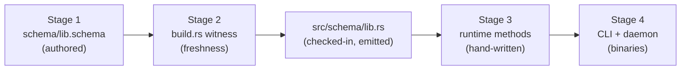
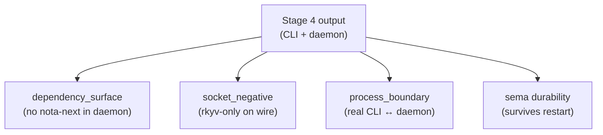

; spirit
[porting-playbook next-stack schema-source build-witness runtime-migration parallel-track witness-tests]
[Operator-side recipe for porting a component to the next stack. Spirit-next is the worked example throughout; every step has a citation in live code. End with a worked migration sketch on signal-message as the near-trivial first candidate.]
2026-06-01
designer

# 446 — Porting playbook — the operator-side recipe

## TL;DR

A component is **ported to the next stack** when its wire-and-runtime nouns are emitted from a `schema/lib.schema` source through `schema-next` + `schema-rust-next`, and the hand-written runtime attaches behavior to those emitted nouns. Spirit-next is the canonical proof: 1379 hand-written runtime lines (engine + nexus + store + transport + daemon + config + binaries) sit over 1269 lines of emitted schema, and the schema is the single source of typed truth.

This playbook turns that proof into a recipe. Five stages: author the schema source, wire the build.rs witness, migrate the runtime to schema-emitted nouns, set up the CLI + daemon binaries, validate via typed witness tests. Each stage has a live spirit-next file backing it; the recipe is "do what spirit-next did, in this order, on your component."

Two cuts of discipline run through every stage:

- **The strict-brace + honest-enum rules** (Spirit 1259 + 1267-1269 + 1294) — your schema source MUST honor them or the lowering rejects you. Per the 445 audit, the rules are now enforced by the structural macro layer and the lowering pipeline; sloppy schemas get a typed error at build time.
- **The single-NOTA-argument rule** (AGENTS.md hard override) — both CLI and daemon binaries take exactly one argument. CLI argument is NOTA; daemon argument is a rkyv `Configuration` path. No flags. Ever.

A worked migration on `signal-message` closes the playbook: that contract crate is small, has hand-written nota_codec derives that the next stack would supersede, and its port shape illustrates the recipe without needing schema-core extraction (designer 444 §5 horizon 1) to land first.

## The recipe at a glance

Five stages, one diagram per phase boundary. The 5-node graph-size cap (Spirit 1282) forces splitting the recipe across two diagrams instead of one wall-of-arrows.

The first diagram is the source-to-rust transition that every port must complete:



The second diagram is the validation surface that proves the port worked. The CI lane runs all four of these tests; any one of them failing is a port regression:



Each box in the second diagram is a real test file in `spirit-next/tests/`. The next sections walk through each stage in operator-handbook detail, citing the live code as the canonical worked example.

## Stage 1 — Author the schema source

The schema source lives at `<component>/schema/lib.schema`. It is a NOTA document with three or four top-level objects: optional imports map, input enum body, output enum body, namespace map. The spirit-next source is the minimal honest example (`spirit-next/schema/lib.schema` lines 1-3):

```nota
; spirit-next/schema/lib.schema (top three lines)
{}
[(Record Entry) (Observe Query) (Remove RecordIdentifier)]
[(RecordAccepted SemaReceipt) (RecordsObserved ObservedRecords)
 (RecordRemoved RemoveReceipt) (Error ErrorReport)
 (Rejected SignalRejection)]
```

Line 1 is an empty imports map `{}`; line 2 is the Input enum body; line 3 is the Output enum body. Line 4 onwards is the namespace `{}` carrying every named type the schema declares. The document body has no labels — input and output are known struct-field positions per Spirit 1277 (designer 444 §"How the derives carry the work").

### The strict-brace rule (Spirit 1259)

Inside every brace `{ }`, entries are **pairs**: even count, alternating key and value. The `Entry` declaration shows the strict shape (`spirit-next/schema/lib.schema:37`):

```nota
Entry { Topics * Kind * Description * Magnitude * }
```

Four key-value pairs inside the brace. The `*` value is shorthand for "field's type is the type with the same name as the field" — `Topics *` means a field named `topics` of type `Topics`. When the field name differs from the type, write the binding explicitly (`Query` at line 38):

```nota
Query { TopicMatch * kind (Optional Kind) }
```

`TopicMatch *` reuses the type name as field name; `kind (Optional Kind)` binds field `kind` to the composite `Optional Kind`. This is the only legal shape inside a struct brace — no labeled blocks, no single-token field lists, no `@Topics` symbol-prefix forms (Spirit 1259, all retired).

If your source violates strict-brace at build time, the schema lowering rejects with a `SchemaError::ExpectedKeyValueBlock { found }` and points to the offending position. The check lives in `schema-next/src/asschema.rs:492-532` and propagates through every `StructFieldMap` site.

### The honest-enum rule (Spirit 1294 / 1295)

Enum bodies are vectors of variant declarations, and **variants are honest about their shape**:

- **Unit variants** — bare PascalCase atoms (`Decision`, `Principle`).
- **Data variants** — parenthesized records `(VariantName PayloadType)`.

The two forms appear side-by-side at `spirit-next/schema/lib.schema:40-41`:

```nota
Kind [Decision Principle Correction Clarification Constraint]
Magnitude [Minimum VeryLow Low Medium High VeryHigh Maximum]
```

These are unit-only enums — every element is a bare symbol. The data-carrying enum at line 36 carries records:

```nota
MailLedgerEvent [(Sent SentMail) (Processed ProcessedMail)]
```

The vector is **homogeneous in element shape per Spirit 1267** — every element is the same NOTA shape (a parenthesized record). You CANNOT mix `Decision` and `(Record Entry)` in one vector; the structural macro at `schema-next/src/macros.rs:432-465` rejects mixed-shape bodies with a typed error.

The retired `@Decision` / `Decision@` shorthand is no longer recognized — operators migrating from a pre-1294 source must rewrite to the bare-symbol form. The 445 audit (§"Schema sources are honest") confirms no `@`-suffix forms survive in any current `.schema` source.

### Namespace declaration patterns

The namespace map declares every named type. Three shapes:

| Shape | Spirit example | Maps to |
|---|---|---|
| `Name TypeReference` | `Topic String` | `Newtype` (single-field tuple struct) |
| `Name { fields ... }` | `Entry { Topics * Kind * ... }` | `Struct` |
| `Name [variants ...]` | `Kind [Decision ... ]` | `Enum` |

The `Topic String` line (line 17 of `spirit-next/schema/lib.schema`) is a **newtype declaration**: a single composite reference becomes a tuple newtype, emitted as `pub struct Topic(pub String);`. The same shape with a generic reference works:

```nota
Topics (Vec Topic)
RecordSet (Vec Entry)
```

Both become tuple newtypes wrapping a `Vec<T>`. The `(Vec T)` parenthesized form is the type-reference macro — parentheses at reference positions denote composite references, separate from the variant-record use at enum positions. Per the 445 audit (§"Schema sources are honest"), the structural macro layer distinguishes these by position predicate.

### Imports and resolved imports

If the component reuses types from another schema-next-emitted crate, declare imports in the leading `{}` map. Spirit-next has none today (the leading `{}` is empty), but the import shape from `spirit-next/schema/lib.schema:7-10` shows the projected form for the reuse vocabulary:

```nota
Import { SourcePath * LocalPath * }
Export { LocalPath * PublicPath * }
SignalReuse { Import * Export * }
```

When you DO declare imports, the leading map carries `source-path => local-path` pairs and `schema-next::SchemaEngine::lower_document_with_resolver` resolves each through an `ImportResolver`. The resolved imports become `pub use` aliases in the emitted Rust, so the dependency crate's types are reused, not re-declared.

### Authoring discipline summary

1. Open `<component>/schema/lib.schema` and lay out three or four root objects in document order: optional `{}` imports, `[]` input enum body, `[]` output enum body, `{}` namespace.
2. Inside the namespace, declare every named type using the three shape patterns above.
3. Honor strict-brace everywhere (`{}` is key-value only) and honest-enum everywhere (`[]` is homogeneous variants — bare PascalCase or parenthesized records).
4. Names follow `skills/naming.md` — full English words; nouns at the struct/newtype boundary; verb-shaped names at the input/output enum variants (the Spirit input enum carries `Record` / `Observe` / `Remove` as the imperative-mood operations).
5. Run `cargo build` once Stage 2's `build.rs` is in place — the lowering's typed errors will pin the next iteration.

## Stage 2 — Wire the build.rs witness

The build script is the freshness witness. It does five things:

1. Loads `schema/lib.schema` and lowers through `SchemaEngine::lower_source` into an `Asschema`.
2. Wraps in `AsschemaArtifact`, writes `lib.asschema` (NOTA) + `lib.asschema.rkyv` (binary) into `OUT_DIR`.
3. Compares the generated NOTA artifact against checked-in `schema/lib.asschema` (the review surface).
4. Calls `RustEmitter::emit_file_from_nota_path` on the checked-in artifact, producing the Rust source.
5. Compares against checked-in `src/schema/lib.rs`. Build fails if anything is stale.

The spirit-next implementation at `spirit-next/build.rs` is the canonical template. The driver is small:

```rust
// spirit-next/build.rs:9-11
fn main() {
    SchemaBuild::from_environment().run();
}
```

The full lowering call sits inside `SchemaBuild::generated_schema_file` (spirit-next/build.rs:36-58):

```rust
let package = SchemaPackage::new(&self.crate_root, "spirit-next", "0.1.0");
let source = package.load_lib().expect("read schema/lib.schema");
let asschema = SchemaEngine::default()
    .lower_source(source.source(), source.identity().clone())
    .expect("lower spirit-next schema");
let artifact = AsschemaArtifact::new(asschema);
let artifact_files = GeneratedAsschemaArtifactFiles::new(&self.output_directory);
artifact.write_nota_file(artifact_files.nota_path()).expect(...);
artifact.write_binary_file(artifact_files.binary_path()).expect(...);

let checked_in_artifact = CheckedInAsschemaArtifact::new(&self.crate_root);
checked_in_artifact.assert_matches_generated_artifact(&artifact_files);

RustEmitter::new(RustEmissionOptions::feature_gated_nota("nota-text"))
    .emit_file_from_nota_path(checked_in_artifact.path())
    .expect("emit Rust from checked-in asschema NOTA artifact")
    .assert_matches_binary_artifact(&artifact_files)
```

Replicate this pattern on every component. Notable details:

### The package identity

`SchemaPackage::new(crate_root, name, version)` is the schema-next entry point that wires the crate-root path to the schema identity. Use your own component name and version: `SchemaPackage::new(&self.crate_root, "my-component", "0.1.0")`.

The identity propagates into the lowered `Asschema::identity` and into the rkyv-keyed `AsschemaStoreKey` shape (`<component>@<version>` per `schema-next/src/store.rs:187-202`). When schema-core extraction lands and an upstream `AsschemaStore` collects all components' asschemas, the keying is uniform across the fleet.

### The freshness comparison

The script panics with a "regenerate from schema/lib.schema" message when the checked-in artifact or Rust source is stale. This is the executable contract: the checked-in files MUST match the build's regeneration, and CI catches drift. Per Spirit 1246 (live asschema artifact) the checked-in `.asschema` text is BOTH a build witness AND a review surface — humans read it to verify the lowering produced the intended schema.

### NotaSurface gating

`RustEmissionOptions::feature_gated_nota("nota-text")` is the magic that lets one emitted Rust file compile under two different feature configurations:

- With `--features nota-text` — the file derives `nota_next::NotaDecode` + `NotaEncode` on every type, emits `FromStr` / `Display` impls, and pulls in `nota_next::*`. The CLI's text bridge works.
- Without features (the daemon's default build) — none of the NOTA derives are emitted; the file compiles with zero `nota-next` references. The daemon's binary closure stays pure.

Per the 445 audit (§"What's clean — discipline check by repository") this is enforced as an executable contract through `tests/dependency_surface.rs` (covered in Stage 5).

### OUT_DIR vs crate-relative paths

The artifact pair (`lib.asschema` + `lib.asschema.rkyv`) lives in `OUT_DIR` — these are generated cache files, not checked in. The checked-in NOTA artifact at `schema/lib.asschema` IS the review surface (Spirit 1246). The emitted Rust at `src/schema/lib.rs` is also checked in. The build asserts both against the freshly-lowered values.

Per the spirit-next `ARCHITECTURE.md` (lines 285-292): "The schema-rust output path is already crate-relative (`src/schema/lib.rs`). `build.rs` uses that path directly; it does not reinterpret a generated `schema/lib.rs` path relative to `src/`."

### Cargo.toml build-dependencies

The `[build-dependencies]` section pulls in the two schema crates (spirit-next/Cargo.toml:44-46):

```toml
[build-dependencies]
schema-next = { git = "https://github.com/LiGoldragon/schema-next.git", branch = "main" }
schema-rust-next = { git = "https://github.com/LiGoldragon/schema-rust-next.git", branch = "main" }
```

Pin both substrate crates to `main` for the production port; use a feature branch when actively co-developing schema-next changes alongside the consumer. Per `skills/feature-development.md`, both repos get a worktree under `~/wt/github.com/LiGoldragon/<repo>/<feature-name>/` for multi-repo coordination, and the pin uses `branch = "<feature-name>"` during co-development.

### Stage 2 checklist

1. Copy `spirit-next/build.rs` into the target crate (rename `SpiritNext` strings to your component name; change the path validator in `assert_generated_schema_path` to match your emitter output path).
2. Add `schema-next` + `schema-rust-next` to `[build-dependencies]`.
3. Create the empty `schema/lib.asschema` and empty `src/schema/lib.rs` placeholders. The first build will fail; copy the error-quoted regeneration output (the build prints the generated text on stale) into the files. Second build succeeds.
4. Commit the artifact pair (lib.schema + lib.asschema + src/schema/lib.rs) as one change. This is the deterministic build floor; agents in future sessions read the committed `.asschema` to understand the schema shape without rerunning the build.

## Stage 3 — Migrate the runtime to schema-emitted nouns

Now the schema is producing Rust types. The runtime migration is **gradual, parallel-track, and one verb at a time**. This is the stage that takes longest on a real component, and where the discipline is most load-bearing.

### The parallel-track discipline

Keep the legacy runtime working while building the new path. **Don't delete legacy code until the new path passes every legacy test.** The substrate that makes this possible:

- The legacy crate's hand-written types (e.g., `MessageSubmission` in `signal-message/src/lib.rs:104-112`) stay in place.
- The new schema-emitted types live alongside in `src/schema/lib.rs`. The build emits them as `pub` items.
- A migration layer (one method per legacy noun: `legacy_to_schema()` / `schema_to_legacy()`) lets callers cross the boundary while both paths exist.
- Tests cover BOTH paths until the new path is feature-complete.
- Final cutover deletes the legacy types in a single commit; the schema types become the public surface.

This is the same shape as the existing two-deploy-stacks discipline (`protocols/active-repositories.md` §"Two deploy stacks coexist") applied at the type-system level. The cost is dual maintenance during the transition; the benefit is no flag day where the entire repo breaks.

### What hand-written behavior attaches to schema-emitted nouns

Three categories of behavior stay hand-written, attached to schema-emitted types as `impl` blocks:

**Validation methods.** The `Input::validate` method (spirit-next attaches it to the schema-emitted `Input` enum) returns `Result<(), ValidationError>` where `ValidationError` is itself a schema-emitted variant enum. Per `spirit-next/src/engine.rs:32-44` (paraphrased — the SignalActor admission path):

```rust
impl SignalActor {
    pub fn accept(&self, input: Input) -> Result<SignalAccepted, SignalRejected> {
        let identifier = self.issue_message_identifier();
        let origin_route = self.issue_origin_route();
        input
            .validate()
            .map_err(|validation_error| SignalRejected { ... })?;
        let input = input.with_origin_route(origin_route);
        Ok(SignalAccepted { sent: input.message_sent(identifier), input })
    }
}
```

`input.validate()` is a hand-written `impl Input { fn validate(&self) -> ... }` block in `spirit-next/src/engine.rs`. The method consumes the schema-emitted enum and returns the schema-emitted error. Behavior on top of the noun, not parallel to it.

**Lifecycle methods.** `SignalAccepted::process_with`, `MessageSent::into_mail_ledger_event`, `MessageProcessed::processed_mail_event` — these are hand-written methods attached to schema-emitted nouns through inherent `impl` blocks. They translate one schema-emitted shape into another, threading runtime identifiers (origin routes, message identifiers) through the pipeline. Per `spirit-next/ARCHITECTURE.md` lines 142-162 (the "schema emits the wire nouns. Rust attaches the behavior" section).

**Conversion methods.** `NexusMail<Entry>::into_nexus_input`, `Nexus<Input>::into_nexus_output`, `Sema<Output>::into_nexus_input` — these projection methods are hand-written today (`spirit-next/src/engine.rs:347-398` per designer 444 §"The runtime triad"). They're listed as designer 444 §5 horizon 4 (schema-emitted variant projections) to become schema-emitted in a future cut; today they're hand-written, attached to the schema-emitted enum.

### The typestate pattern over schema-emitted types

The strongest runtime pattern in spirit-next is `Mail<Phase>` at `spirit-next/src/nexus.rs:38-55`:

```rust
// spirit-next/src/nexus.rs:38-55
#[derive(Debug)]
pub struct Mail<Phase> {
    identifier: MessageIdentifier,
    origin_route: OriginRoute,
    phase: Phase,
}

#[derive(Debug)]
pub struct BeingProcessed {
    sema_input: sema_plane::Sema<sema_plane::Input>,
}

#[derive(Debug)]
pub struct Processed {
    output: signal_plane::Signal<Output>,
}
```

`Mail<Phase>` is a hand-written generic struct. Its `identifier` and `origin_route` are schema-emitted (`MessageIdentifier` and `OriginRoute` come from `src/schema/lib.rs`). The phase payload `BeingProcessed` carries a schema-emitted SEMA input; `Processed` carries a schema-emitted Signal output.

The transition between phases is gated by a single private method `Mail<BeingProcessed>::run_sema` (per `spirit-next/src/nexus.rs:143-154` — designer 444 §"Mail<Phase> typestate"):

```rust
fn run_sema(self, store: &mut Store) -> Mail<Processed> {
    let sema_output = store.apply(self.phase.sema_input);
    let output = sema_output
        .into_nexus_input()
        .into_nexus_output()
        .into_signal_output();
    Mail {
        identifier: self.identifier,
        origin_route: self.origin_route,
        phase: Processed { output },
    }
}
```

Per the 445 audit (Finding 5 in designer 443 sub-agent 4): "Nexus holds the mail ⇒ it is being processed" becomes a compile-time fact. Other components porting to the next stack should consider whether their domain has an analogous phase boundary (admission → in-flight → completed; pending → committed → published; whatever the component's typestate shape is) and lift the equivalent typestate over their schema-emitted nouns.

### One verb at a time

The migration order inside Stage 3:

1. Pick one verb (one variant in the input enum). For spirit-next that was `Record`; for your component it might be `Submit` or `Query`.
2. Port the type chain for that verb: input payload (`Entry`), output payload (`SemaReceipt`), error payload (`ErrorReport`), the wire envelope types it touches.
3. Implement the runtime methods that attach behavior: validation, store operation, output translation. The legacy path for the OTHER verbs keeps working unchanged.
4. Run the existing tests for the one verb; they pass through the new path.
5. Move to the next verb.

This is parallel-track at the verb level. Each verb migration is one bead-sized unit of work, with its own tests, its own commit, its own review.

### What stays per-component

The runtime composition (the `Engine` that wires Signal admission + Nexus + Store) is per-component hand-written code. Per the spirit-next architecture (lines 240-272):

- `SignalActor::accept` — the admission validator. Per component.
- `Nexus::process` — the mail keeper that holds across SEMA. Per component (until schema-core extraction lifts the `Mail<Phase>` shape).
- `Store::apply` — the SEMA writer (redb cycle). Per component (until designer 444 §5 horizon 2's generic `SemaStore<T>` substrate lands).
- `Engine::handle` — the composer that wires Signal → Nexus → Store. Per component.

These four objects are the component's hand-written runtime substrate. They use schema-emitted types as their input/output types; they encapsulate the component-specific behavior.

### Stage 3 checklist

1. Identify your component's verb set (the input enum variants).
2. For each verb, port the type chain through the new schema path.
3. Attach hand-written validation / lifecycle / conversion methods to schema-emitted nouns. Use `impl Input { ... }` blocks in `src/engine.rs` (or equivalent); NEVER hand-write parallel types that shadow the emitted nouns.
4. Identify your component's phase boundary (where state visibly transitions) and lift a typestate (`Mail<Phase>` analogue) over the schema-emitted nouns guarding that transition.
5. Migrate verbs one at a time; keep both paths working until the new path passes every test.
6. Cut over the legacy types in a single commit when the new path is feature-complete.

## Stage 4 — Set up the CLI + daemon binaries

The CLI and daemon binaries are the visible surface of the port. Both must honor the AGENTS.md single-NOTA-argument rule. The spirit-next implementations are the templates.

### The CLI binary

The full CLI at `spirit-next/src/bin/spirit-next.rs` is 50 lines. The shape:

```rust
// spirit-next/src/bin/spirit-next.rs:12-32
struct SpiritNextCli {
    arguments: Vec<String>,
}

impl SpiritNextCli {
    fn from_environment() -> Self {
        Self {
            arguments: env::args().skip(1).collect(),
        }
    }

    fn run(&self) -> Result<(), Box<dyn std::error::Error>> {
        let argument = self.single_argument()?;
        let source = self.read_single_argument(argument)?;
        let input = source.parse::<Input>()?;
        let socket_path = env::var("SPIRIT_NEXT_SOCKET")
            .unwrap_or_else(|_| String::from("/tmp/spirit-next.sock"));
        let (_route, output) = SignalTransport::connect(socket_path)?.exchange(&input)?;
        println!("{output}");
        Ok(())
    }
}
```

Three responsibilities only: validate single-argument, parse the argument to `Input` via the schema-emitted `FromStr`, exchange one frame through `SignalTransport`. The output is printed via the schema-emitted `Display`. No flags, no logic.

### The CLI single-argument rule

The argument can be inline NOTA or a NOTA file path (per `spirit-next/src/bin/spirit-next.rs:34-49`):

```rust
fn single_argument(&self) -> Result<&str, Box<dyn std::error::Error>> {
    match self.arguments.as_slice() {
        [argument] => Ok(argument),
        _ => Err("expected exactly one NOTA argument or path".into()),
    }
}

fn read_single_argument(&self, argument: &str) -> Result<String, Box<dyn std::error::Error>> {
    if argument.trim_start().starts_with('(') {
        Ok(argument.to_owned())
    } else if Path::new(argument).exists() {
        Ok(fs::read_to_string(argument)?)
    } else {
        Err("inline operation must be a parenthesized NOTA value".into())
    }
}
```

The prefix check at line 42 is narrow (only `(` prefix) — per the 445 audit Finding 3, this belongs in a `NotaSource::from_cli_argument` helper in nota-next as designer 444 §5 horizon 5. Today, the spirit-next prefix check is the template; when the horizon lands, the CLI shrinks to a single delegation call.

### The socket convention

The CLI uses env-var-or-default for the socket path (`SPIRIT_NEXT_SOCKET` with fallback to `/tmp/spirit-next.sock`). This is acceptable for the CLI (per the 445 audit's "not a finding" section: "the CLI uses env-var-or-default to find the socket; the daemon takes only a binary `Configuration` path"). When operating multiple daemons, the CLI carries the env var; when running the single-daemon default, no environment variable is needed.

The naming convention for the env var: `<COMPONENT>_SOCKET` (uppercase, underscored, with `_SOCKET` suffix). For a component named `my-component`, use `MY_COMPONENT_SOCKET`.

### The daemon binary

The daemon binary is even smaller at `spirit-next/src/bin/spirit-next-daemon.rs` — 36 lines:

```rust
// spirit-next/src/bin/spirit-next-daemon.rs:12-35
struct SpiritNextDaemonCli {
    arguments: Vec<String>,
}

impl SpiritNextDaemonCli {
    fn run(&self) -> Result<(), Box<dyn std::error::Error>> {
        let configuration = Configuration::from_binary_path(self.single_argument()?)?;
        Daemon::new(configuration).run()?;
        Ok(())
    }

    fn single_argument(&self) -> Result<&str, Box<dyn std::error::Error>> {
        match self.arguments.as_slice() {
            [argument] => Ok(argument),
            _ => Err("expected exactly one binary configuration path".into()),
        }
    }
}
```

One argument: a path to a rkyv `Configuration` file. No NOTA parsing in the daemon's startup path. Per Spirit 1244 + INTENT.md line 139: "The daemon's single argument is a path to a binary rkyv `Configuration` object, not a NOTA configuration string."

### The Configuration type

The Configuration struct lives in `src/config.rs` and is rkyv-only. The spirit-next shape (`spirit-next/src/config.rs:8-25`):

```rust
#[derive(rkyv::Archive, rkyv::Serialize, rkyv::Deserialize, Clone, Debug, Eq, PartialEq)]
pub struct Configuration {
    socket_path: ConfigurationPath,
    database_path: ConfigurationPath,
}

#[derive(rkyv::Archive, rkyv::Serialize, rkyv::Deserialize, Clone, Debug, Eq, PartialEq)]
pub struct ConfigurationPath(String);
```

Two fields: where to bind the socket, where to open the durable store. Add more fields as your component needs them (a future port might add a `bootstrap_policy_path: ConfigurationPath` for first-start policy declaration per `skills/component-triad.md` §"Policy state").

The Configuration is loaded via `from_binary_path` (`spirit-next/src/config.rs:43-46`):

```rust
pub fn from_binary_path(path: impl AsRef<Path>) -> Result<Self, ConfigurationError> {
    let bytes = fs::read(path).map_err(ConfigurationError::Read)?;
    Self::from_binary_bytes(&bytes)
}
```

This is the binary boundary spirit-next/INTENT.md (lines 13-20) names as load-bearing: "Generated schema datatypes always carry rkyv support. NOTA encode/decode is an opt-in text-client surface, not a daemon requirement. The daemon build is binary-only and must not depend on `nota-next`."

### Cargo.toml binary declarations

The two binaries declare separate cargo `[[bin]]` blocks with feature requirements (`spirit-next/Cargo.toml:15-22`):

```toml
[[bin]]
name = "spirit-next"
path = "src/bin/spirit-next.rs"
required-features = ["nota-text"]

[[bin]]
name = "spirit-next-daemon"
path = "src/bin/spirit-next-daemon.rs"
```

The CLI requires the `nota-text` feature; the daemon doesn't. Per `spirit-next/Cargo.toml:34-39`:

```toml
[features]
default = []
nota-text = ["dep:nota-next"]

[dependencies]
nota-next = { ..., optional = true }
```

`default = []` is critical — building the daemon alone uses no features, so `nota-next` is not pulled in. The CLI's `required-features = ["nota-text"]` ensures `cargo build` with no features only builds the daemon.

Cargo feature unification means one workspace invocation can't prove "CLI has NOTA, daemon doesn't" — per `spirit-next/ARCHITECTURE.md` (lines 297-301), the Nix build harness ships separate package derivations so the per-binary dependency closure is provably distinct. For workspace-internal builds, the dependency-surface test in Stage 5 is the executable contract.

### Binary naming per the component-triad skill

`skills/component-triad.md` §"Binary naming table" governs the exact binary names. For a triad component `<component>`:

- CLI binary: `<component>` (e.g., `spirit-next`, `signal-message-cli` if such a thing existed).
- Daemon binary: `<component>-daemon` (e.g., `spirit-next-daemon`, `message-daemon`).

For a child component inside a parent system (`persona-<child>`):

- CLI binary: `<child>` (the short role-name — `pi`, `mind`, `terminal`).
- Daemon binary: `<parent>-<child>-daemon` (e.g., `persona-pi-daemon`, `persona-terminal-daemon`).

Apply the table to your port; the binary names are not negotiable.

### Stage 4 checklist

1. Copy `spirit-next/src/bin/spirit-next.rs` as a CLI template; rename to your component name. The body needs no logic changes beyond renaming.
2. Copy `spirit-next/src/bin/spirit-next-daemon.rs` as a daemon template.
3. Copy `spirit-next/src/config.rs` as the Configuration template; rename and extend the fields as your component needs.
4. Add the two `[[bin]]` declarations to `Cargo.toml` with the `required-features = ["nota-text"]` on the CLI only.
5. Add the `[features]` section with `default = []` and `nota-text = ["dep:nota-next"]`.
6. Add the env-var-or-default socket convention to the CLI with a `<COMPONENT>_SOCKET` env var name.

## Stage 5 — Validate via typed witness tests

A port that passes its tests is a port done. Four tests, each catching a distinct regression class. All four live in `spirit-next/tests/`; copy them as the witness-test template.

### Test 1 — dependency_surface — daemon path is NOTA-free

`spirit-next/tests/dependency_surface.rs` (51 lines) runs `cargo tree` twice and asserts the dependency closure:

```rust
// spirit-next/tests/dependency_surface.rs:30-50 (abridged)
#[test]
fn binary_only_surface_has_no_nota_next_runtime_dependency() {
    let tree = manifest.cargo_tree(&["--edges", "normal", "--no-default-features"]);
    assert!(
        !tree.contains("nota-next") && !tree.contains("nota_next"),
        "binary-only runtime dependency tree must not contain nota-next:\n{tree}"
    );
}

#[test]
fn text_client_surface_has_nota_next_runtime_dependency() {
    let tree = manifest.cargo_tree(&["--edges", "normal", "--features", "nota-text"]);
    assert!(
        tree.contains("nota-next"),
        "nota-text runtime dependency tree must contain nota-next:\n{tree}"
    );
}
```

The two assertions are the executable contract for the NotaSurface gating. Per `spirit-next/INTENT.md` line 17-20: "The binary-only dependency boundary is an executable contract, not just a source comment."

Adapt for your component: rename the test file to `<component>_dependency_surface.rs`, keep the two assertions, change feature names if your component uses a different feature flag name than `nota-text`.

### Test 2 — socket_negative — binary socket rejects NOTA text

`spirit-next/tests/socket_negative.rs` (56 lines) feeds NOTA text and arbitrary bytes through the daemon's transport reader and asserts each is rejected:

```rust
// spirit-next/tests/socket_negative.rs:25-35 (one test)
#[test]
fn transport_rejects_length_prefixed_raw_nota_text() {
    let nota = b"(Record ([[socket-negative]] Decision [text must not be daemon wire] Maximum))";
    let bytes = LengthPrefixedFrame::new(nota).to_bytes();
    let mut transport = SignalTransport::new(Cursor::new(bytes));

    assert!(
        transport.read_input().is_err(),
        "daemon wire transport must reject length-prefixed raw NOTA bytes"
    );
}
```

The test sends length-prefixed NOTA text through `SignalTransport` — the same path the daemon uses — and asserts decode failure. This proves the daemon's binary boundary rejects NOTA structurally, not via comment. Per `spirit-next/ARCHITECTURE.md` lines 97-101: "tests/socket_negative.rs feeds length-prefixed NOTA bytes and arbitrary bytes through SignalTransport and directly through the generated `Input::decode_signal_frame` method. Those tests prove that NOTA is accepted only by the CLI text surface, never as daemon wire input."

Three tests in the file: NOTA via transport, garbage bytes via transport, NOTA via direct `Input::decode_signal_frame` call. Each catches a different evasion vector. Copy all three.

### Test 3 — process_boundary — real CLI ↔ daemon

`spirit-next/tests/process_boundary.rs` (190+ lines) spawns the daemon as a real process and exercises the CLI binary against it. The setup at lines 12-37:

```rust
// spirit-next/tests/process_boundary.rs:23-37
impl DaemonProcess {
    fn spawn(socket_path: &Path, database_path: &Path) -> Self {
        let configuration_path = socket_path.with_extension("config.rkyv");
        Configuration::new(socket_path, database_path)
            .write_binary_file(&configuration_path)
            .expect("write binary daemon configuration");
        let child = Command::new(env!("CARGO_BIN_EXE_spirit-next-daemon"))
            .arg(configuration_path)
            .spawn()
            .expect("spawn daemon");
        let process = Self { child };
        wait_for_socket(socket_path);
        process
    }
}
```

The test serializes a `Configuration` to a `.config.rkyv` file, spawns the daemon binary with that path as its single argument, then runs CLI commands against the socket. The CLI output is parsed back through the schema-emitted `Output::FromStr` for assertion — never via raw-string match (per `spirit-next/ARCHITECTURE.md` lines 313-318).

Per the 445 audit (§"What's clean — discipline check by repository"): the process-boundary test is the strongest proof — it exercises the SAME binaries that ship, through the SAME wire shape, against the SAME parser. If this passes, the port works end-to-end.

### Test 4 — sema durability across daemon restart

The `daemon_persists_sema_file_across_a_restart` test in `spirit-next/tests/process_boundary.rs:117-182` is the durability proof. The flow:

1. Spawn daemon #1, record an entry, drop the daemon (kill).
2. Verify the `.sema` file outlives the daemon.
3. Spawn daemon #2 against the SAME `.sema` file on a fresh socket.
4. Query for the recorded entry through daemon #2 — must observe.
5. Record a second entry; assert commit sequence is 2 (the persisted ledger resumed).

Per the test comment (`spirit-next/tests/process_boundary.rs:118-122`): "The strongest durability proof: a daemon writes the `.sema` file, the daemon process is killed, a NEW daemon process opens the SAME `.sema` file, and the previously recorded entry is still observable and the commit sequence resumes."

This validates the redb-backed SEMA store, the rkyv-encoded record format, AND the binary `Configuration` flow. A port that lacks durable state can skip this test; a port with durable state MUST include the equivalent (commit sequence resume, content survival, ledger continuity).

### Optional test 5 — runtime_triad — library-level chain

`spirit-next/tests/runtime_triad.rs` exercises the Signal → Nexus → SEMA chain in-process (no subprocess spawning). Per the 445 audit (§"Schema sources are honest"): the chain tests use schema-emitted types as witnesses (`MailLedgerEvent`, `NexusInput`/`NexusOutput`, `SemaInput`/`SemaOutput`). Adapt as a library-level regression catcher.

### Stage 5 checklist

1. Copy `spirit-next/tests/dependency_surface.rs`. Adapt feature names if your component uses different feature flags.
2. Copy `spirit-next/tests/socket_negative.rs`. Adjust the NOTA text used as the negative input (use a representative variant from your component's input enum).
3. Copy `spirit-next/tests/process_boundary.rs`. Use your component's actual CLI / daemon binaries and exchange test cases that cover at least one variant per Input enum branch.
4. If your component has durable state, copy the durability test in `process_boundary.rs:117-182`.
5. Run all four through `cargo test`. A green build is the port-complete signal.

## What NOT to port

The schema-emission rule is **wire-and-runtime nouns** become schema-emitted. The hand-written runtime substrate stays hand-written. Per designer 444 §"Schema-emitted types ARE the runtime nouns": "The hand-written code in `spirit-next/src/{engine,nexus,store,daemon,transport,config}.rs` exists ONLY to compose those typed nouns — it never invents a parallel type."

Things that stay hand-written and SHOULD NOT be moved into the schema:

### Runtime actor logic

`Engine`, `SignalActor`, `Nexus`, `Store` — the four runtime objects. They're component-specific composition, not wire types. Per `spirit-next/ARCHITECTURE.md` line 263-268: "`SignalActor` is the Signal admission object, `Nexus` is the data-bearing mail keeper that owns the store + ledger and holds in-flight mail as a typestate, `MailLedger` is the hookable lifecycle sink, and `Store` is the data-bearing durable SEMA writer. `Engine` composes them."

These are the actor surfaces the daemon EXECUTES on. They use schema-emitted types as the input/output of their methods, but their internal structure (the redb cycle, the mail-ledger hooks, the mutex placement) is implementation, not contract. Per designer 444 §"What stays per-component": this is where the component's identity lives.

### Storage internals

The redb `TableDefinition` declarations, the begin-write / open-table / commit cycle, the rkyv encode/decode at the storage boundary — these are storage substrate, not wire contract. Per `spirit-next/src/store.rs:11-18`:

```rust
const RECORDS: TableDefinition<u64, &[u8]> = TableDefinition::new("records");
const LEDGER: TableDefinition<&str, u64> = TableDefinition::new("ledger");
const NEXT_IDENTIFIER_KEY: &str = "next-identifier";
const COMMIT_SEQUENCE_KEY: &str = "commit-sequence";
```

The table names, the key-string constants, the redb invocation pattern — none of this is schema. The schema declares the `Entry` shape persisted under those identifiers; the storage code translates between schema-emitted types and the underlying redb layout. Per designer 444 §5 horizon 2: a future `SemaStore<T>` generic substrate will let multiple components share the redb cycle, but the substrate itself is a Rust library, not a schema artifact.

### Validation methods

`Input::validate` (the spirit-next admission check) returns `Result<(), ValidationError>` where `ValidationError` is schema-emitted. The validation rules themselves — what makes an input valid — are component logic, not schema. Per `spirit-next/INTENT.md` lines 84-91: "`SignalActor::accept` validates the generated `Input` enough to create `SignalAccepted`... Invalid Signal input returns `Output::Rejected(SignalRejection { validation_error, database_marker })` where `ValidationError` is generated from `schema/lib.schema`; the runtime does not use a hand-written rejection enum at the wire boundary."

The validation enum is in the schema; the validation logic is in `impl Input { fn validate(&self) -> ... }`. Don't try to encode validation rules in the schema — they belong to the runtime.

### Typestate patterns

`Mail<Phase>`, the `BeingProcessed` and `Processed` phase types — these are Rust type-system constructs (typestate transitions enforced by privacy + ownership) that can't be expressed in NOTA. Per the 445 audit (Finding 5 referenced in §"What's clean"): "The Mail<Phase> typestate (nexus.rs:39-43, 47-49, 53-55, 125-191) implements designer 444 §'Runtime triad / Nexus' exactly... That's the compile-time 'Nexus holds the mail ⇒ it is being processed' invariant."

Typestate is a Rust pattern the runtime uses to enforce invariants the schema can't express. Keep it in `src/nexus.rs` (or equivalent); don't try to lift into schema.

### The runtime hooks

`MailLedgerHook`, `MessageSentHook`, `MessageProcessedHook` — these are schema-emitted **traits** that hand-written types implement. The trait declaration is schema-emitted; the trait implementation (the `MailLedger` struct that captures events) is hand-written. The boundary is: schema declares the trait signature, runtime provides the impl.

Per designer 444 §"The schema-core extraction horizon" (the "Runtime substrate" subsection): `Mail<Phase>` typestate, `MailLedgerHook` infallible event sink pattern, and `SemaStore<T>` substrate are the lift targets for future generalization — but today they live per-component. Don't try to fold them into your schema; they belong with the runtime composition.

### What this means for your port

When you read `spirit-next/src/`, divide the lines into two piles:

| Pile | What it owns | Stays / lifts |
|---|---|---|
| `src/schema/lib.rs` (1269 lines) | wire nouns, traits, frame primitives, plane envelopes | EMITTED — never hand-edit |
| Everything else (1379 lines) | actor composition, redb cycle, validation rules, lifecycle hooks impl, typestate, binary entry points | STAYS HAND-WRITTEN |

The port migrates pile 1 only. The schema source replaces the hand-written types in `src/lib.rs` (e.g., signal-message's hand-coded `MessageSubmission` becomes a schema-emitted struct). Pile 2 remains the component's implementation surface; only its INPUT types come from schema.

## Worked migration example — porting signal-message

`signal-message` is the strongest near-trivial first candidate. The contract crate has ~339 lines of hand-written types, all currently driven by `nota_codec`'s `NotaRecord` / `NotaEnum` / `NotaTransparent` derives plus rkyv derives. The shape is exactly what schema-next emits: data-bearing structs, variant enums, newtype wrappers, a closed request/reply channel.

### Why signal-message first

Three reasons it's a strong illustrative port:

1. **Pure contract crate** — no runtime, no daemon, no store. The port is purely the type layer; no Stage 3 runtime migration risk.
2. **Familiar shape** — request/reply, newtype wrappers around `String` / `u64`, enum variants with payloads. Every type maps cleanly to a schema construct.
3. **Already uses nota_codec derives** — the new path replaces ONE derive set with another (legacy → schema-emitted), not introduces serialization. The wire-format change is the load-bearing test.

What it doesn't exercise: typestate patterns (no `Mail<Phase>` analogue), durable storage (no redb), the CLI/daemon split (no binaries). For those, port a component-triad runtime crate like spirit-next once signal-message succeeds. But for proving the recipe end-to-end on a small surface, signal-message is the right canvas.

### What signal-message has today

The current schema source at `/git/github.com/LiGoldragon/signal-message/schema/signal-message.concept.schema` is a concept-only file (not driven through the build). The Rust types live hand-written at `signal-message/src/lib.rs` carrying `nota_codec::NotaRecord` / `NotaEnum` / `NotaTransparent` derives. Example (line 22-35 of the legacy source):

```rust
#[derive(
    Archive, RkyvSerialize, RkyvDeserialize, NotaTransparent, Debug, Clone, PartialEq, Eq, Hash,
)]
pub struct MessageRecipient(String);

impl MessageRecipient {
    pub fn new(value: impl Into<String>) -> Self {
        Self(value.into())
    }

    pub fn as_str(&self) -> &str {
        &self.0
    }
}
```

This hand-written newtype is what the schema port replaces.

### Step 1 — Write the schema source

A first-cut `signal-message/schema/lib.schema` rewriting the legacy types into the next-stack source shape:

```nota
{}
[(Submit MessageSubmission)
 (SubmitStamped StampedMessageSubmission)
 (QueryInbox InboxQuery)]
[(SubmissionAccepted SubmissionAcceptance)
 (SubmissionRejected SubmissionRejection)
 (InboxListing InboxListing)
 (Unimplemented MessageRequestUnimplemented)]
{
  MessageRecipient String
  MessageSender String
  MessageBody String
  MessageSlot Integer
  MessageKind [Send Inbox]
  MessageSubmission { MessageRecipient * MessageKind * MessageBody * }
  StampedMessageSubmission { MessageSubmission * MessageOrigin * StampedAt * }
  InboxQuery { MessageRecipient * }
  SubmissionAcceptance { MessageSlot * }
  InboxEntry { MessageSlot * MessageSender * MessageBody * }
  InboxListing { Messages (Vec InboxEntry) }
  SubmissionRejection { Reason SubmissionRejectionReason }
  SubmissionRejectionReason [StoreRejected RecipientNotFound]
  MessageRequestUnimplemented { Operation MessageOperationKind Reason MessageUnimplementedReason }
  MessageOperationKind [MessageSubmission StampedMessageSubmission InboxQuery]
  MessageUnimplementedReason [NotInPrototypeScope (DependencyMissing DependencyKind) (ResourceUnavailable ResourceKind)]
  DependencyKind [Router Mind Harness Terminal]
  ResourceKind [MessageSocket RouterSocket PeerCredentials Store]
  MessageOrigin String
  StampedAt Integer
}
```

Notable choices:

- The input enum (line 2) carries the three request variants from the legacy `MessageRequest` channel. Each is a `(VariantName PayloadType)` data variant per Spirit 1294 — honest enum bodies.
- The unit-only enums (`MessageKind`, `SubmissionRejectionReason`, `MessageOperationKind`, `DependencyKind`, `ResourceKind`) use bare PascalCase atoms per Spirit 1294.
- The mixed-variant enum `MessageUnimplementedReason` mixes a unit variant `NotInPrototypeScope` with two data variants. Per Spirit 1267 vector homogeneity: each element must have the same NOTA shape — `NotInPrototypeScope` becomes `(NotInPrototypeScope None)` in the assembled artifact (the same pattern spirit-next uses for `ValidationError [EmptyTopic EmptyDescription ...]` lowering to `(EmptyTopic None)` per `spirit-next/schema/lib.asschema:5`).

Some hand-written types from the legacy crate don't appear here. `MessageOrigin`, `TimestampNanos`, `WirePath`, `SocketMode`, `OwnerIdentity` — these come from `signal_persona_origin` and `signal_persona`. In the legacy lib.rs they're imported. In a fully-ported signal-message they'd either come from a schema-ported `signal-persona-origin` and `signal-persona` (via the `imports` map in the leading `{}`), OR stay as inline newtypes (the port above takes that simpler path for `MessageOrigin` and `StampedAt`).

The hand-written `MessageDaemonConfiguration` type at lines 319-336 of the legacy lib.rs DOES NOT belong in the schema source. Per the AGENTS.md hard override (NOTA argument rule) + designer 444 §"The daemon binary's single argument": daemon configuration is a runtime concern, not a wire contract. Configuration lives in `message-daemon/src/config.rs` (the runtime crate), schema-emitted there if needed; the signal-message contract is wire-only.

### Step 2 — Wire the build.rs witness

Copy `spirit-next/build.rs` into `signal-message/`, rename `SpiritNext` references to `SignalMessage`, and change the SchemaPackage identity to `("signal-message", "0.1.0")`. The freshness comparison structure stays identical.

First build will fail with "checked-in generated schema source is missing." Copy the generated `lib.asschema` text from the error into `signal-message/schema/lib.asschema`; copy the generated `src/schema/lib.rs` text from the error into the file. Commit both. Second build succeeds.

### Step 3 — Migrate the type surface

Since signal-message is a pure contract crate, there's no runtime to migrate. The port replaces the hand-written types in `src/lib.rs` with re-exports from the schema-emitted `src/schema/lib.rs`. The pattern:

```rust
// signal-message/src/lib.rs (post-port, sketch)
pub mod schema {
    #[rustfmt::skip]
    pub mod lib;
}

pub use schema::lib::{
    MessageRecipient, MessageSender, MessageBody, MessageSlot, MessageKind,
    MessageSubmission, StampedMessageSubmission, InboxQuery,
    SubmissionAcceptance, InboxEntry, InboxListing,
    SubmissionRejection, SubmissionRejectionReason,
    MessageRequestUnimplemented, MessageOperationKind,
    MessageUnimplementedReason, DependencyKind, ResourceKind,
    Input, Output, // the schema-emitted request/reply roots
};
```

The legacy `signal_channel!` macro-driven channel (lines 271-285 of legacy lib.rs) becomes the schema-emitted `Input` / `Output` enums plus the schema-emitted `Signal<Input>` / `Signal<Output>` envelope types. The hand-written `impl MessageRequest { fn operation_kind(...) }` method (lines 293-301) stays hand-written as an attached method on the schema-emitted `Input` enum:

```rust
// signal-message/src/lib.rs (post-port, attached behavior)
impl Input {
    pub fn operation_kind(&self) -> MessageOperationKind {
        match self {
            Self::Submit(_) => MessageOperationKind::MessageSubmission,
            Self::SubmitStamped(_) => MessageOperationKind::StampedMessageSubmission,
            Self::QueryInbox(_) => MessageOperationKind::InboxQuery,
        }
    }
}
```

Method on the schema-emitted noun. The legacy `MessageRequest::operation_kind` becomes `Input::operation_kind`; the variant matching is identical.

### Step 4 — No CLI / daemon binary

Signal-message is a contract crate, not a triad component. No `Cargo.toml [[bin]]` blocks; no `src/bin/`. The crate ships only `lib.rs` + `src/schema/lib.rs` + `build.rs` + `schema/lib.schema` + `schema/lib.asschema`.

When the consumer runtime crates (`message`, `message-daemon`) port, THEY get the binary surface following Stage 4. signal-message's port is type-only.

### Step 5 — Witness tests

Only the parts of Stage 5 that fit a contract crate:

- **No dependency_surface test** — signal-message doesn't compile a daemon binary, so the NotaSurface gating doesn't matter (the contract crate carries both rkyv and NOTA derives universally).
- **No socket_negative test** — no daemon socket.
- **No process_boundary test** — no binary.
- **No durability test** — no storage.

What DOES apply: a round-trip test (`signal-message/tests/round_trip.rs` already exists in the legacy crate). The port replaces its assertions: instead of round-tripping the legacy `MessageRequest` enum, round-trip the schema-emitted `Input` and `Output`. Both rkyv and NOTA round-trips. The schema-emitted derives are what's under test; if the round-trip survives, the schema-emitted types are wire-compatible.

A pseudo-NOTA round-trip example for one variant:

```rust
// signal-message/tests/round_trip.rs (post-port)
#[test]
fn submit_round_trips_through_nota() {
    let original = Input::Submit(MessageSubmission {
        message_recipient: MessageRecipient::new("alice"),
        message_kind: MessageKind::Send,
        message_body: MessageBody::new("hello"),
    });
    let nota = original.to_nota();
    let parsed: Input = nota.parse().expect("parse from NOTA");
    assert_eq!(original, parsed);
}
```

The two derives (`NotaDecode` + `NotaEncode` from the feature-gated emission) make this one assertion. The same shape for rkyv round-trip via `to_binary_bytes` / `from_binary_bytes`.

### What proves the port worked

The port is done when:

1. `cargo build` succeeds — the schema source lowers, the artifacts are fresh, the emitted Rust compiles.
2. The legacy `src/lib.rs` is gone (deleted in the cutover commit); the new `src/lib.rs` only re-exports from `src/schema/lib.rs` + attaches the hand-written methods.
3. Round-trip tests pass for every input/output variant.
4. Every downstream consumer of `signal-message` (the `message` runtime, the `message-daemon`, the router code that decodes `MessageRequest`) compiles unchanged — the schema-emitted types are wire-compatible with the legacy ones at the rkyv layer.

That last criterion is the hard one. The schema-emitted Rust must produce byte-identical rkyv archives to the legacy types. The way to verify: archive a known-good message with the LEGACY crate before deletion, save the bytes, then archive the same message with the SCHEMA-emitted crate post-port and assert byte equality. If they differ, the port broke wire compatibility and needs a schema adjustment (field order, derive options, encoding rules).

Per `skills/contract-repo.md` lines 39-72: rkyv archives interoperate only when both ends compile against the same types with the same feature set — wire compatibility across the legacy→schema cutover is the load-bearing requirement.

## Cross-references

- `reports/designer/446-next-stack-porting-research-2026-06-01/0-frame-and-method.md` — the orchestrator frame defining "what 'ported' means in this research"; this playbook is sub-agent 2's output.
- `reports/designer/444-stack-vision-2026-05-31/` — the full vision meta-report. Body reports cited throughout:
  - `1-four-logical-planes.md` for Asschema / AsschemaArtifact / AsschemaStore / RustEmitter signatures.
  - `4-runtime-integration.md` for the runtime triad, NotaSurface gating, the Signal/Nexus/SEMA flow, and the schema-core extraction horizon.
  - `5-overview.md` §"Open horizons" for the §5 horizon ledger (schema-core, generic substrate, RustModule-as-data, variant projections, NOTA source helper).
- `reports/designer/445-next-stack-audit-2026-06-01.md` — the audit confirming substrate honors discipline; cited for "Schema sources are honest" + "What's clean — discipline check by repository" + Findings 1-4.
- Spirit-next live files (the canonical recipe substrate):
  - `/git/github.com/LiGoldragon/spirit-next/ARCHITECTURE.md` — the runtime triad description and load-bearing constraints.
  - `/git/github.com/LiGoldragon/spirit-next/INTENT.md` — the rkyv-only daemon constraint and the schema-derived rule.
  - `/git/github.com/LiGoldragon/spirit-next/Cargo.toml` — the `[[bin]]` + `[features]` declarations.
  - `/git/github.com/LiGoldragon/spirit-next/build.rs` — the canonical build-witness implementation.
  - `/git/github.com/LiGoldragon/spirit-next/schema/lib.schema` + `lib.asschema` — the source + checked-in review artifact.
  - `/git/github.com/LiGoldragon/spirit-next/src/lib.rs` + `src/config.rs` — the runtime crate's public surface.
  - `/git/github.com/LiGoldragon/spirit-next/src/bin/spirit-next.rs` + `spirit-next-daemon.rs` — the CLI + daemon templates.
  - `/git/github.com/LiGoldragon/spirit-next/tests/dependency_surface.rs` + `socket_negative.rs` + `process_boundary.rs` + `runtime_triad.rs` — the witness test templates.
- Schema substrate live files:
  - `/git/github.com/LiGoldragon/schema-next/src/engine.rs:210-313` — `SchemaEngine::lower_source` + `lower_document_with_resolver` entry points.
  - `/git/github.com/LiGoldragon/schema-next/src/asschema.rs:85-252` — `Asschema` + `AsschemaArtifact` signatures and surface methods.
  - `/git/github.com/LiGoldragon/schema-rust-next/src/lib.rs:39-82, 213-273` — `RustEmitter` + `RustEmissionOptions` + `NotaSurface`.
- `AGENTS.md` — hard overrides cited:
  - §"NOTA is the only argument language" — the single-NOTA-argument rule on every binary.
  - §"Component triad means daemon + working signal + policy signal" — the runtime/contract split.
  - §"NOTA strings come EXCLUSIVELY from bracket forms" — the no-quotation-marks rule on schema sources.
  - §"Every Rust function is a method or associated function" — the method-only rule on hand-written runtime code.
- `skills/component-triad.md` — the full triad shape, the single argument rule, the binary naming table, the runtime triad (Signal / Nexus / SEMA), bootstrap-policy.nota for first-start policy.
- `skills/contract-repo.md` — the wire-contract crate discipline; the rkyv schema-agreement rule that drives the wire-compatibility check on cutover.
- `skills/feature-development.md` — the worktree convention for multi-repo feature branches (relevant when co-developing schema-next changes with a consumer port).
- `skills/rust/methods.md` + `skills/abstractions.md` — the discipline behind the "what stays hand-written" pile: verbs belong to nouns; methods carry ownership context.
- Spirit records:
  - 1259 (strict-brace key-value) — load-bearing on Stage 1 brace shapes.
  - 1267 / 1268 / 1269 (notation honesty) — load-bearing on enum-body vector homogeneity.
  - 1270 (three categories + module-qualified identity + cross-crate) — load-bearing on `SchemaPackage::new` shape.
  - 1271 (rkyv-in-SEMA) — load-bearing on Stage 3 storage internals.
  - 1272 (four-object separation) — defines the planes the playbook traverses.
  - 1274 (positional root reading) — defines the document shape Stage 1 produces.
  - 1277 (input/output as positional struct fields) — defines why the document body is `[input] [output] {namespace}` not `(Input [...]) (Output [...])`.
  - 1278 (known-root abstraction) — defines the `#[nota(known_root)]` attribute the build-emitted Rust carries.
  - 1282 (graph size cap) — applied to the two-diagram split at the top.
  - 1287 / 1290 (body-stream substrate, LANDED) — the codec floor every schema-next consumer rides on.
  - 1294 / 1295 (enum-body honesty) — load-bearing on Stage 1 variant shapes.

## For the orchestrator

**Trickiest step of the recipe:** Stage 3, the parallel-track runtime migration. Stages 1 + 2 + 4 + 5 are mechanical copies of spirit-next files with names changed. Stage 3 is where the component's domain logic gets re-anchored on schema-emitted nouns while the legacy path stays alive — and where the temptation to shadow types or hand-write parallel enums is strongest. The worked migration on signal-message minimizes Stage 3 risk because the legacy types map cleanly to schema constructs; on a more complex runtime port (e.g., `message-daemon` once `signal-message` lands), Stage 3 expands to verb-by-verb migration with dual maintenance until cutover.

**Most reusable substrate / pattern:** the `build.rs` witness template at `spirit-next/build.rs:1-188`. The structure — SchemaPackage identity, lower into Asschema, write OUT_DIR artifact pair, compare against checked-in `.asschema`, emit Rust from the checked-in artifact, compare against checked-in `src/schema/lib.rs`, double-emit from binary path to validate the rkyv↔NOTA equivalence — is the executable freshness contract that every port repeats nearly verbatim. The `GeneratedFileArtifactWitness` trait pattern at lines 142-166 (proving that emitting from the NOTA artifact and from the rkyv artifact produce byte-equal Rust) is especially elegant as a four-corner round-trip check. Generalizing this build-script template into a reusable macro or substrate crate (so every consumer crate's `build.rs` is `schema_next_build::run!("my-component", "0.1.0", "src/schema/lib.rs")` or similar) is the natural follow-on for designer 444 §5 horizon 1 (schema-core extraction).
