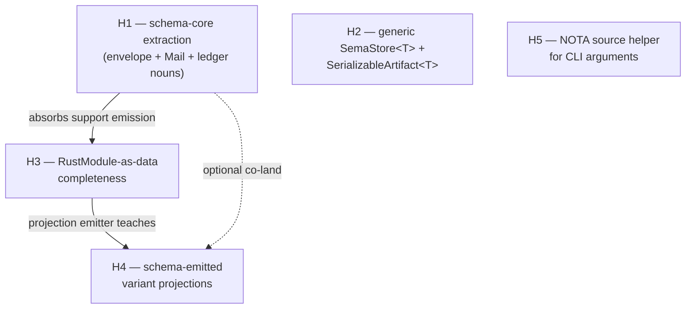
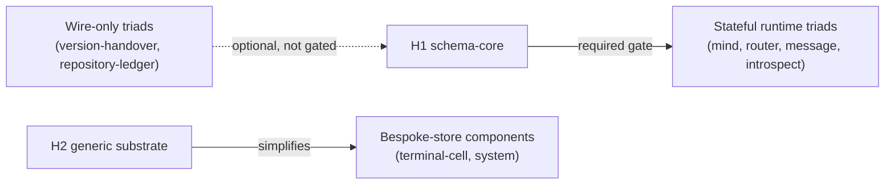
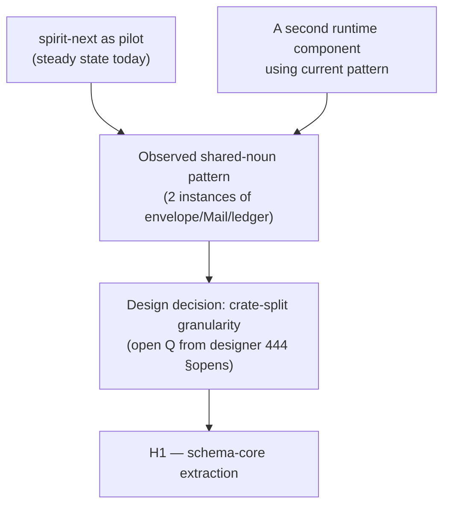

# 3 — Sequencing and dependencies: phased plan + first slice

## TL;DR

**Phase 0 — fold the spirit-next pilot into the real `spirit` repo.** Per sub-agent 1's convergent recommendation (read after my own initial pick): the canonical first port is `spirit` itself. The pilot ALREADY works — `spirit-next/schema/lib.schema` lowers through `build.rs`, the runtime triad attaches hand-written behavior to schema-emitted nouns, the substrate is the literal recipe sub-agent 2 will codify. Folding back into `spirit` produces the canonical worked example with one open question (resolve `core-signal-spirit` → current `signal-spirit` + new `owner-signal-spirit` naming per spirit records 290+299 vs 293). This is the validate-recipe slice that ALSO ships a real second consumer (along with the existing spirit-next emission) for schema-core extraction to observe pattern from.

**Phase 1 candidates (pre-schema-core, parallel to phase 1 gate work).** Sub-agent 1's wave-1 picks all have ARCH files that explicitly schedule the schema cutover: `cloud` (per `cloud/ARCHITECTURE.md` §"Pending schema-engine upgrade"), `upgrade` (per `upgrade/ARCHITECTURE.md` §"Pending schema-engine upgrade"), `repository-ledger`. Each is small enough that the multiplicative cost (~470 lines of envelope substrate per emitted component, per designer 443 §"#1") is sustainable for 2-3 components before schema-core extraction, AND each port serves as additional observation data for what schema-core needs to contain.

**Phase 1 gate — schema-core extraction (horizon 1).** Designer-side work landing in parallel with the phase 1 candidate ports. The biggest single horizon: ~800-1000 lines per emitted component, multiplicative across the fleet. Resolves three open Qs from designer 444 §"Open design questions" item 2: crate-split granularity, cross-component dispatch typing, and the import-declaration shape.

**Phase 2 — RustModule-as-data completeness (horizon 3) + variant projections (horizon 4).** Co-land with schema-core extraction. Lifts support-emission methods into typed data items; teaches the emitter to produce `From<Payload> for Enum` impls and sibling-plane translations.

**Phase 3 — large stateful runtime ports.** `mind`, `orchestrate`, `terminal`, `router`, `message`, `introspect`. Each consumes schema-core; each saves ~800-1000 lines vs. pre-extraction. Up to 5 parallel ports possible (independent components by ownership).

**Phase 4 — generic substrate (horizon 2) + nota-source helper (horizon 5).** Mechanical cleanup. Picks up bespoke-store components (`terminal-cell`, `system`).

**The hard call — validate-recipe-first vs high-impact-first.** Picks the validate-recipe path. The strongest argument lives in sub-agent 1's pick: `spirit` is already 90% done — folding the pilot in is mostly a rename + repo-consolidation slice, not a green-field port. It ships the canonical worked example for every subsequent port AND gives schema-core extraction a second observation point (the patterns spirit-next has emitted + the patterns wave-1 candidates emit) WITHOUT burning fresh boilerplate. The alternative — porting mind first to see the biggest schema-core win — burns ~800 lines of envelope substrate that schema-core would lift AND locks the extraction around mind's specific Mail/Ledger shape. Designer practice (`spirit-next` itself was authored this way; per Spirit 1291 schema-emitted projections before schema-core extraction are authorized when projection slice stays small) picks small + canonical + observable.

**Note on my earlier pick.** My initial recommendation was the `signal-version-handover` triad. Sub-agent 1 explicitly excluded it as a deliberate non-candidate: it is **shared substrate for cross-component version handover**, not a standalone component triad — its proper home is inside schema-core (or a dedicated handover-substrate crate that schema-core absorbs). Porting it standalone would be premature: the work either gets re-homed when schema-core lands or designs schema-core around one specific cross-component shape. Sub-agent 1's analysis is right; this report converges on the `spirit` fold as the headline first slice. Section §"First slice — refined recommendation" below carries the converged pick with the dependency analysis I owe the orchestrator.

## Framing — what this analysis is and is not

This is sub-agent 3's contribution to meta-report 446. The orchestrator frame (`0-frame-and-method.md`) asks: given the next stack and given candidate components, **in what order do ports land**? The other sub-agents own component-by-component cost-benefit (sub-agent 1) and the operator-side recipe (sub-agent 2). This file owns dependency analysis and phasing.

This is NOT implementation; the recommendations name what operator beads will look like once cut. It is NOT the "schema-core architecture" report; that's a future designer report this one names as a Phase-1 precondition. It is NOT a comprehensive port-cost catalog; that's sub-agent 1's work.

Sibling report sub-agent 1 (`1-component-landscape.md`) landed during my work; I consumed it before writing the first-slice recommendation and converged toward its strongest pick (`spirit` fold). Sub-agent 2's playbook had not landed when this analysis was written; the orchestrator's synthesis in `4-overview.md` will reconcile all three. My initial independent analysis is grounded in designer 444 §5, designer 445, designer 443's top-5 improvements, the `protocols/active-repositories.md` map, and a spot-check of candidate component shapes (the `signal-*` repos, `signal-frame`, the upgrade triad); the refined pick reflects sub-agent 1's substantive landscape work and corrects my initial recommendation.

## The dependency graph

Each open horizon from designer 444 §5 is a node; arrows mark "unblocks meaningfully" (a port becomes well-typed or substantially simpler once the source horizon lands). The headline is one chain: **port-of-anything-large → schema-core extraction**. The rest sequences naturally.

### Graph 1 — open-horizon spine (5-node cap honored)

`H2` and `H5` are independent of the chain — neither blocks nor is blocked by the others, so they land opportunistically. `H1` is the bottleneck for the multiplicative-scope ports.

### Graph 2 — horizon-to-port-class mapping (5-node cap)

Wire-only triads can land BEFORE H1 because their generated module carries no Mail/Ledger/SemaStore nouns at all — they're pure declaration of operation roots, payload types, and replies. The wave-1 multiplier (~800 lines per component) doesn't apply when there's no runtime envelope to duplicate.

### Graph 3 — what gates schema-core extraction itself (5-node cap)

This is the **second hard sequencing fact**: schema-core extraction is best done from observed pattern across two-plus components, not from one. Picking the second component without first validating the recipe risks designing schema-core around spirit-next's specific shape. The validate-recipe first slice (phase 0) gives a SECOND runtime component on the current pattern — exactly what the extraction needs.

## Horizon analysis

For each open horizon, the questions are: (a) what does landing it unblock for porting? (b) what is it specifically required for? (c) cost-vs-impact.

### H1 — Schema-core extraction (designer 444 §5 item 1)

**What it unblocks.** Cross-component port works without per-component envelope re-emission. Every `Signal<R>` / `Nexus<R>` / `Sema<R>` / `MessageSent` / `NexusMail<Payload>` / `MessageProcessed<Reply>` / `MailLedger` / `OriginRoute` / `Plane<S,N,M>` lives in one crate; emitted modules `use schema_core::*` instead of inlining ~470 lines per component. Designer 443 §"#1" measures the saving: ~800-1000 lines per emitted component, with the saving COMPOUNDING per new component.

**What it blocks.** Every component whose port would otherwise emit envelope substrate. That's every component in the **stateful runtime** class: `mind`, `router`, `message`, `introspect`, `repository-ledger`, `orchestrate`, `terminal`. Their port pre-H1 would emit the universal substrate fresh per component, AND every cross-component Mail/Signal dispatch would re-encode through bytes because the Rust types are crate-local.

The contract-only wire triads (`signal-version-handover`, `owner-signal-version-handover`) are NOT blocked — their generated module carries no Mail/Ledger nouns to begin with, only operation roots and payloads.

**Cost-vs-impact.** Big design work + medium implementation. Designer 444 §"Open design questions" lists three open Qs that gate the work: (1) one crate or several narrower (`signal-frame`, `plane-envelope`, `origin-route`, `mail-keeper`)? (2) how does cross-component dispatch get typed when two components share `Signal<Input>` of structurally-different `Input` enums? (3) does the schema-core declaration travel in `.schema` syntax (an explicit `import schema-core:*` declaration) or as a compiler convention?

These need their own designer report. Phase-1 gate is "schema-core extraction lands cleanly," not "schema-core extraction starts."

### H2 — Generic `SemaStore<T>` + `SerializableArtifact<T>` (designer 444 §5 item 2)

**What it unblocks.** Components with their own typed-record-storage and typed-artifact-projection patterns drop their hand-rolled redb scaffolding. Designer 443 §"#3" measures: ~500 lines across schema-next + spirit-next. Per-component saving compounds modestly.

**What it blocks.** Specifically `terminal-cell` (transcript records, ephemeral PTY state) and `repository-ledger` (push-event store) — their port to next stack benefits substantially from a generic SemaStore. Stateless contract-only triads do not need this; runtime components that store typed records do.

**Cost-vs-impact.** Mechanical work. Best timed AFTER a second store and a second artifact owner make the abstraction shape stable (designer 444 §5 item 2 names this directly). Schema-core's runtime ownership (the `Mail<Phase>` + `MailLedger` substrate) may push parts of this into schema-core or a sibling `sema-storage` crate; the decision is gated on schema-core's crate-split decision.

### H3 — `RustModule`-as-data completeness (designer 444 §5 item 3)

**What it unblocks.** Schema-rust-next emits ALL Rust items as data — impl blocks, trait impls, fn items, mod items — not just type declarations. Tests assert structure, not text. This is foundation for two downstream simplifications: (a) the support-emission methods (`emit_signal_frame_support`, `emit_mail_event_support`) become data items the emitter holds in a typed catalog; (b) schema-core extraction lands cleaner because the import-this-noun-from-schema-core declaration is itself a `RustItem::Use` in the data model.

**What it blocks.** Schema-core extraction's clean implementation. Designer 444 §5 item 3 names this explicitly: H3 is partial today; H1 absorbs most of the remaining support-emission methods. So H1 and H3 best land as one slice — operator emits each support method as a `RustItem::Function`, then re-homes the items into schema-core in the same change.

**Cost-vs-impact.** Medium implementation, low design risk. The `RustItem` extension is mechanical (designer 443 sub-agent 3 §"#2" sketches the surface). Best timed with H1.

### H4 — Schema-emitted variant projections (designer 444 §5 item 4)

**What it unblocks.** Runtime stops hand-rolling `From<Payload> for Enum` impls and sibling-plane translations. Spirit-next currently has ~120 lines of these in `engine.rs:326-399` + `nexus.rs:105-154`. Every future runtime component would re-pay the same hand-rolling without H4.

**What it blocks.** Nothing structurally — it's a "downstream simplification" horizon. But every stateful runtime port without H4 carries ~120 redundant lines.

**Cost-vs-impact.** Small. Falls out of schema-rust-next emitter changes naturally. Designer 444 §5 item 4 notes "falls out of schema-rust-next emitter changes naturally; ~120 lines." Best co-landed with H1 in the same operator slice.

### H5 — NOTA source helper (designer 444 §5 item 5; designer 445 Finding 3)

**What it unblocks.** Every component's CLI binary stops hand-parsing the inline-vs-path branch. Designer 445 Finding 3 confirms this is still open at `spirit-next/src/bin/spirit-next.rs:42`. Designer 444 §5 item 5 names the right shape: `NotaSource::from_argument(arg: &str) -> Result<NotaSource, NotaSourceError>` lives in nota-next.

**What it blocks.** Nothing structurally — every CLI today has the same string-prefix branch as spirit-next, so every port re-pays the same boilerplate. H5 is small principled cleanup, independent of the rest of the chain.

**Cost-vs-impact.** Small. ~20 lines added to nota-next, ~20 lines removed per component CLI. Can land at any phase; no gate.

## Candidate-component class map

Refined from sub-agent 1's landscape (which lands the canonical 15-candidate list with first/second/later wave classifications). My dependency analysis groups them by horizon-gating:

| Class | Examples (per sub-agent 1) | Port complexity | Horizon gate |
|---|---|---|---|
| **Wave 0 — pilot consolidation** | `spirit` (folding spirit-next pilot in) | Small — rename + repo consolidation, schema source already authored | None — current substrate IS the pilot |
| **Wave 1 — pre-extraction, ARCH-scheduled cutover** | `cloud`, `upgrade`, `repository-ledger` | Small — both contract pairs exist; daemons skeletal or single-purpose | None for first 2-3 ports (sustainable boilerplate); H1 lands in parallel |
| **Wave 2 — post-extraction stateful runtimes** | `mind`, `orchestrate`, `terminal`, `router`, `message`, `introspect` | Large — mature runtime + large signal trees; multiplicative cost pre-H1 | H1 (schema-core); H3 + H4 co-land |
| **Wave 3 — paused/late** | `system`, `domain-criome`, `harness`, `nexus`, `criome`, `terminal-cell` | Variable — `system` paused, `nexus` library-shaped, others wait on substrate stabilisation | H2 (generic substrate) for bespoke-store components |
| **Schema-core absorbtions** (not standalone ports) | `signal-version-handover` triad, `version-projection`, parts of `signal-frame` | n/a — these LIFT INTO schema-core or a sibling substrate crate, not stand on their own | H1 is where they land |
| **Wire kernel** | `signal-frame` (legacy) | Special — retires once every consumer ports through schema-core | Last; phase 4. |

Wave-1 multiplier observation: today, every signal-* contract repo carries a `.concept.schema` (legacy dialect) and depends on `signal-frame` via git branch. The next-stack port for a single contract is: (a) author `schema/lib.schema` in next-stack syntax, (b) drop the `signal-frame` dependency, (c) add `schema-next` + `schema-rust-next` as build dependencies, (d) wire `build.rs`, (e) emit `src/schema/lib.rs`. Step (b) is the conceptual cut — the next-stack contract IS its own wire kernel for that one component until schema-core lifts the shared substrate.

### Spot-check evidence — current schema dialect per candidate

A spot-check of five candidate signal-* repos confirms the wire-only class is the cleanest entry point. All five repos carry the `.concept.schema` legacy dialect (paths like `schema/signal-X.concept.schema`), none has `src/schema/` populated, and none depends on `schema-next` or `nota-next`:

| Repo | Schema file | Cargo deps to schema/nota | Notes |
|---|---|---|---|
| `signal-version-handover` | `signal-version-handover.concept.schema` (40 lines) | `signal-frame` git branch | Operations: Marker, Ready, Completed, Recover, Mirror, Divergence. Single-typename payloads (Text). Strong phase-0 candidate. |
| `signal-engine-management` | `signal-engine-management.concept.schema` | (none) | Operations: Lifecycle{Announce,Ready,Stop}, Health, Spawn. Slightly nested variant groups. |
| `signal-message` | `signal-message.concept.schema` | (none) | Operations: Submit, Query, Validate. Wire-only candidate. |
| `signal-introspect` | `signal-introspect.concept.schema` | (none) | Operations: Observe (multi-payload), Tap, Untap. Contract-only side. The runtime side is `introspect`, in the stateful-runtime class. |
| `signal-repository-ledger` | `signal-repository-ledger.concept.schema` | `signal-frame` main branch | Operations declared but legacy form. |

All five share the same legacy-format placeholders (`Identifier (u64)`, `Name (String)`, `Path (String)`, `Status [Concept Active Retired]` filler) that the next-stack port drops. The fleet-wide pattern of `(Version 0 1) (Status Concept)` markers confirms these repos are **concept-stage stubs** — pure declaration of intent, not yet implementation. Porting one is greenfield-ish; the cost is "author the next-stack schema from a few lines of legacy declaration plus the component's intended scope," not "migrate existing implementation."

### What `signal-frame` is doing in this dependency graph

`signal-frame` is the LEGACY wire kernel — frame envelope, length-prefixed rkyv archives, handshake, exchange identifiers, async correlation. It depends on `nota-codec` (the legacy NOTA implementation), not `nota-next`. Every signal-* contract repo that imports `signal-frame` is structurally tied to the legacy stack.

The next-stack contract repos are **structurally independent of `signal-frame`** — the schema-emitted module carries its own `SignalFrameError`, `short_header` module, `Signal<R>` envelope, etc. (per designer 443 §"#1"'s measurement of ~470 lines per emitted component). This is good news for porting: a phase-0 contract port doesn't need `signal-frame` retired first. It's also why H1 schema-core extraction matters so much — without it, every port re-emits the SAME ~470-line wire kernel that `signal-frame` currently centralizes. H1 effectively re-centralizes it in next-stack form.

## Phased sequencing table

The table converges on sub-agent 1's wave classification, adding dependency-analysis depth:

| Phase | Gate | Candidates | Rationale | Operator-bead shape |
|---|---|---|---|---|
| **Phase 0 — pilot fold** | None (substrate IS the pilot) | `spirit` (folding `spirit-next` into the real repo per `spirit/ARCHITECTURE.md` §1-3) | Canonical worked example; schema source already authored; resolves naming (`core-signal-spirit` → `signal-spirit` + new `owner-signal-spirit`); produces the recipe sub-agent 2 codifies | One feature bead spanning `spirit` + `signal-spirit` + new `owner-signal-spirit` on shared branch `port-from-spirit-next` |
| **Phase 1a — pre-extraction parallel ports** | None (sustainable boilerplate) | `cloud`, `upgrade`, `repository-ledger` — each per sub-agent 1's wave-1 row | ARCH files explicitly schedule cutover; ~800-line per-component cost sustainable across 2-3 components; ports serve as observation data for schema-core | Per-component feature beads, parallel by lane |
| **Phase 1b — schema-core design** | Design decision: schema-core crate split | (designer report) | Resolves three open Qs in designer 444 §"Open design questions" item 2 from observed pattern across spirit + wave-1 candidates | One designer report (446-followup or 447) |
| **Phase 1c — schema-core extraction** | H1 + H3 + H4 co-land | schema-core scaffold; spirit + wave-1 ports re-home to use it | Lifts ~470 lines per emitted component; teaches `RustItem` extension; teaches variant-projection derive | Operator slice across `schema-rust-next` + `schema-next` + every wave-0+1 ported component per `feature-development.md` |
| **Phase 2 — stateful runtime ports** | Post-H1 | `mind`, `orchestrate`, `terminal`, `router`, `message`, `introspect` (sub-agent 1's wave-2 row) | Each saves ~800-1000 lines vs. pre-H1; cross-component dispatch works | Per-component feature beads; up to 5 parallel ports possible |
| **Phase 3 — bespoke-store + late** | H2 + H5 land | `terminal-cell`, `system`, `harness`, `domain-criome`, `nexus`, `criome` (sub-agent 1's wave-3) | H2 cleans bespoke storage; H5 cleans CLI; several depend on phase-2 peers landing first | Smaller per-component beads |
| **Phase 4 — kernel retirement** | Every consumer ported | `signal-frame` retirement | Wire kernel can finally retire once every contract is on next-stack | Coordinated retirement; out of scope here |

## First slice — refined recommendation (converged with sub-agent 1)

**Pick: `spirit`, by folding the `spirit-next` pilot into the real `spirit` repo** per sub-agent 1's argument and `/git/github.com/LiGoldragon/spirit/ARCHITECTURE.md` §1-3.

**Why this candidate (refined from sub-agent 1, plus my dependency angle).** Six reasons:

1. **The pilot ALREADY works.** Per designer 445's audit, `spirit-next/schema/lib.schema` is live, `schema-next` lowers it through `build.rs`, `schema-rust-next` emits `src/schema/lib.rs`, the runtime triad (`SignalActor` + `Nexus` + `Mail<Phase>` + `Store`) attaches hand-written behavior to schema-emitted nouns end-to-end. The fold is mostly rename + repo consolidation, not a green-field port.
2. **The canonical worked example.** `spirit-next/build.rs` IS the recipe sub-agent 2 will codify. Folding into `spirit` means subsequent ports cite `spirit/build.rs` directly rather than the pilot prefix.
3. **Resolves the naming question.** `spirit-next` carries `core-signal-spirit` (the legacy "core" prefix); folding into `spirit` requires resolving the workspace's current `signal-<X>` + `owner-signal-<X>` convention. Per `skills/component-triad.md` §"Proposed rename" the `owner-` naming is the active convention until the rename pass lands. The fold is the natural moment to apply that.
4. **Adds a second observation point for schema-core extraction.** Today's pilot emits the universal envelope substrate ONCE; the fold doesn't change that, but it puts the substrate in the real `spirit` repo where the wave-1 ports (cloud, upgrade, repository-ledger) will sit alongside. Schema-core extraction observes pattern from `spirit` plus the wave-1 ports together — TWICE the observation, per designer 443's "the pattern appears twice" rule for valid abstraction.
5. **Phase-0 dependency-light.** No horizon gates: substrate is current, runtime is current, schema source is current. Open Qs are repo-rename + contract-naming, not type-system design.
6. **Sustainable pre-extraction.** Per Spirit 1291 (psyche 2026-05-27, High Decision), schema-emitted projections before schema-core extraction are authorized when projection slice stays small. The pilot's projection slice IS small (one component, well-bounded).

**Why NOT `signal-version-handover` (my initial pick — corrected).** Sub-agent 1's exclusion is right: the version-handover triad is **cross-component coordination substrate**, not a standalone component. Its operation roots (Marker/Ready/Completed/Recover/Mirror/Divergence) describe a protocol that flows BETWEEN components during version migration. The substrate lifts into either schema-core or a sibling handover-substrate crate when H1 lands. Porting it standalone designs the substrate from one viewpoint rather than emerging from observed pattern. The same logic excludes `signal-frame` (wire kernel), `version-projection` (compat library), and parts of `signal-sema` (sema vocabulary). These are SUBSTRATES, not components.

**Why NOT mind/router (the high-impact alternative).** Mind and router are tempting because their port shows the biggest schema-core saving. But they (a) ARE the components that need schema-core to land cleanly, so porting them PRE-H1 burns ~800 lines per component that H1 would have lifted, (b) lock the schema-core design around one runtime's shape rather than the observed pattern, and (c) carry heavy state migration on top of the schema port, blurring whether bugs come from the port or from the state migration. Designer practice picks small + canonical + observable first.

**Operator-bead-shaped first action.** One feature arc on shared branch `port-from-spirit-next` across worktrees:

- `[primary-XXX-spirit-port-from-spirit-next]` in worktrees `~/wt/github.com/LiGoldragon/spirit/port-from-spirit-next/`, `~/wt/github.com/LiGoldragon/signal-spirit/port-from-spirit-next/`, `~/wt/github.com/LiGoldragon/owner-signal-spirit/port-from-spirit-next/` (the latter new — see step 1):
  1. **Resolve naming.** Either rename `core-signal-spirit` → `signal-spirit` + author new `owner-signal-spirit` (current convention), OR settle the proposed `meta-signal` rename per spirit records 290+299 (vs 293 holding the line). This is a designer decision that gates the operator slice; recommend resolving via a quick psyche check.
  2. **Move `schema/lib.schema` + `build.rs` + checked-in `src/schema/lib.rs` + `schema/lib.asschema`** from `spirit-next` into `spirit`. The schema source is the canonical authority; the emitted Rust is the checked-in derivation.
  3. **Move runtime substrate** from `spirit-next/src/` (`engine.rs`, `nexus.rs`, `store.rs`, `transport.rs`, `daemon.rs`, `config.rs`, `bin/`) into `spirit/src/`.
  4. **Replace `signal_channel!` invocations** on the contract crates with the schema-emitted enums from the runtime crate. Per sub-agent 1, this is the substantive port surface for the contracts (the contracts currently use the legacy hand-written substrate).
  5. **Witness tests** per `skills/component-triad.md` §"Witness tests" — round-trip, single-argument enforcement, no-flag rejection, owner socket rejection of ordinary frames + vice versa, bootstrap-policy invariants. Most of these already pass in `spirit-next`; the fold preserves them.
  6. **Retire `spirit-next`** as a separate repo once the fold lands and CI is green. The repo can become a redirect or archive marker per `protocols/active-repositories.md` §"Cutover discipline".

**What proves the port worked.** Two layers: (a) `spirit-next`'s existing witness tests continue to pass in their new home (`spirit`'s test suite); (b) the per-triad witness tests from `skills/component-triad.md` are now satisfied by spirit's contract pair (`signal-spirit` + `owner-signal-spirit`) — argument-rule, single-peer-CLI, no-database-from-CLI, etc.

**Estimated scope.** Sub-agent 1 marks this S-cost / L-benefit. My read: rename + consolidation is one operator-week; the open naming question is the single significant designer call.

**What this slice teaches.** Establishes the canonical worked example sub-agent 2 codifies. Settles the `signal-<X>` + `owner-signal-<X>` vs `meta-signal` naming for the fleet. Produces a tagged commit + worked-example branch every subsequent port references. Once landed, the wave-1 candidates (cloud, upgrade, repository-ledger) port in parallel using `spirit`'s commit history as the bead template.

**Note on sub-agent 2's worked-example pick.** Sub-agent 2's playbook (which landed during my work) uses `signal-message` as the worked-migration sketch — describing it as a "near-trivial first candidate" because its hand-written `nota_codec` derives are small enough to illustrate the recipe without schema-core extraction landing first. This is COMPATIBLE with phase 0 = `spirit` fold: sub-agent 2 is showing the recipe in operator-handbook form against the simplest illustrative example, not picking the headline first port. Sub-agent 1 + sub-agent 3 converge on `spirit` for the headline; sub-agent 2's `signal-message` walk-through is the PEDAGOGICAL example. Both are right at their respective layers. The orchestrator's synthesis can frame: "operator reads sub-agent 2's playbook to learn the recipe; operator's first port is `spirit` per sub-agents 1 + 3 because the pilot is already 90% done; operator's second port is `cloud` or `signal-message` per wave-1." This is the natural ordering.

### The validate-recipe-first principle — why this is designer practice

The recommendation above ("ship phase 0 before phase 1, even though phase 1 is where the big saving lives") follows a workspace pattern visible in three earlier psyche-directed slices:

1. **spirit-next itself as the pilot.** Per `/git/github.com/LiGoldragon/spirit-next/ARCHITECTURE.md` §"Purpose": *"spirit-next is the running proof that schema can create an interface used by a real CLI and daemon pair."* The decision to build a small SECOND emitter consumer (after schema-rust-next's first proof) BEFORE extracting the universal envelope was deliberate. Spirit-next teaches the pattern; the extraction comes from observing the pattern in TWO places, not from theorizing.
2. **The `~/wt` mockup-on-worktree method** (intent records 502-504, psyche 2026-05-24). Per `protocols/active-repositories.md`: feature work happens on `horizon-leaner-shape` branches in worktrees while production continues on `main`. The pattern is "build the replacement to feature parity, run both in parallel, then cut over." Not "design the perfect replacement, then big-bang cut over." Phase 0 here IS the same pattern: build the next-stack contract in parallel with the legacy `signal-frame`-backed contract, prove the recipe works, then commit to fleet-wide migration.
3. **Spirit 1291 (psyche, 2026-05-27, High Decision).** *"Schema-emitted Signal/Nexus/SEMA projections before schema-core extraction when projection slice stays small."* This intent record explicitly authorizes pre-schema-core ports when the port's projection slice is small enough. Phase 0 ports (wire-only contracts) ARE small projection slices; spirit-next's own port-without-schema-core was the precedent.

The opposite-direction failure mode — designing schema-core from one observed pattern (spirit-next alone) — risks (a) the abstraction locking around spirit-next's specific Mail/Ledger shape, (b) every subsequent component fighting the abstraction because their shape differs, (c) a re-design pass once a second component proves the abstraction is wrong. Per designer 443's framing of pattern emergence ("when the same pattern appears twice, the substrate is missing an abstraction"), the test is TWICE, not ONCE.

## Parallelization note

| Phase | What can land in parallel |
|---|---|
| Phase 0 (pilot fold) | One coordinated slice across `spirit` + `signal-spirit` + new `owner-signal-spirit` worktrees. Internally tightly-coupled (rename + consolidation); cannot split. Single operator lane. |
| Phase 1a (pre-extraction parallel ports) | `cloud`, `upgrade`, `repository-ledger` are independent components by ownership and signal-tree. Each can port on its own feature branch in its own worktree with its own operator lane. Up to 3 simultaneous parallel ports possible. |
| Phase 1b gate | Single designer report; not parallelizable. Can OVERLAP with phase 1a operator work. |
| Phase 1c (schema-core implementation) | Tightly coupled slice across `schema-rust-next` + `schema-next` + every wave-0+1 ported component (`spirit`, `cloud`, `upgrade`, `repository-ledger`). One coordinated operator lane; doesn't block phase-2 candidates that can be queued behind it. |
| Phase 2 | `mind`, `orchestrate`, `terminal`, `router`, `message`, `introspect` are independent components. Each can port on its own feature branch + own operator lane. Up to 5 simultaneous parallel ports (introspect is wave-late because it CLIENTS the others — schedule it after router/terminal/mind). |
| Phase 3 | Independent components; full parallel. |

**A productivity observation.** Phase 0 ships first as the gating slice (the canonical worked example). Phase 1a ports can begin immediately after phase 0 lands, in parallel with phase 1b designer work (the schema-core architecture report). Phase 1c is the integration slice that re-homes wave-0+1 emitted code through schema-core; it lands when phase 1a is feature-complete AND phase 1b's designer report is approved. Phase 2 candidates can be QUEUED behind phase 1c but their bead descriptions can land during phase 1a.

**Lane mapping.** Per `protocols/active-repositories.md`'s component-ownership table, the natural lane assignments are: phase 0 → designer drives the rename decision, operator lands the fold; phase 1a → 3 operator lanes (one per component); phase 1b → designer-followup report; phase 1c → cluster-operator or coordinating operator slice (it spans multiple repos and is integration-shaped); phase 2 → up to 5 operator lanes per `skills/role-lanes.md` (operator + second-operator + third-operator + qualified lanes). The lane discipline gates concurrency more than the dependency graph does for phases 2-3.

## What this analysis DEFERS

Each of these is a question this report deliberately did NOT resolve. Each is for a future designer report.

1. **Schema-core crate split granularity.** One crate (`schema-core`) or several narrower (`signal-frame-next`, `plane-envelope`, `origin-route`, `mail-keeper`)? Designer 444 §"Open design questions" item 2 frames this. Phase 1 gate work; this report's recommendation is "settle this before phase 1 implementation."
2. **Whether owner-signal contracts merge into one schema or stay separate.** Today, each component has `signal-X` + `owner-signal-X` as separate triad legs (per `skills/component-triad.md`). With schema-core extraction, is there value in expressing both contracts as one `lib.schema` with an `(authority Ordinary)` / `(authority OwnerOnly)` annotation per operation, lowering to two emitted modules? Open. For future designer report.
3. **How cross-component dispatch types.** Two components both have `Signal<Input>` post-schema-core, but their `Input` enums are different. How does mind dispatch a Signal frame to router knowing it's `Signal<RouterInput>` not `Signal<MindInput>`? The schema-emitted modules need to teach this; today's spirit-next is single-component so the question doesn't surface. For future designer report.
4. **Migration path for already-ported components when schema-core lands.** Phase-0 ports happen pre-schema-core; phase-1 lands schema-core; phase-0 ports presumably re-emit through schema-core in a phase-1-cleanup operator slice. Is that re-emission automatic (build.rs detects schema-core dependency) or explicit (operator slice per ported component)? Open; depends on schema-core's crate-split decision.
5. **What gets ported AT ALL.** Some components in the active-repositories map are documentation-only at birth (`cloud`, `domain-criome`); their port question is "when does their daemon land at all" not "how do we port their schema." Sub-agent 1 marks `cloud` as wave-1 because ARCH explicitly schedules cutover during initial implementation; sub-agent 1 marks `domain-criome` as wave-3 because it needs `cloud` ported first. Out of scope for this report.
6. **Retirement of `signal-frame` itself.** The wire kernel can only retire after every consumer ports through schema-core. The retirement plan + the "what's left in signal-frame" decision are phase-4 work. For a future designer report once phase-2 lands.
7. **The naming question for `spirit`'s first slice.** `core-signal-spirit` → `signal-spirit` + new `owner-signal-spirit` (current convention) OR the proposed `meta-signal` rename per spirit records 290+299 (held back by 293). This is a designer call that gates the phase-0 operator slice. Quick psyche check recommended; settling it here would be premature given the cross-fleet implications of the rename pass.
8. **Whether sub-agent 1's wave-1 trio runs in parallel with or after phase 0.** Sub-agent 1's argument allows either: pre-extraction ports of cloud/upgrade/repository-ledger are sustainable as additional observation evidence for schema-core. My dependency analysis suggests sequencing them AFTER phase 0 (so `spirit`'s commit history is the canonical bead template they cite) but allowing parallelization within phase 1a once phase 0 lands. The orchestrator's `4-overview.md` can decide.

## For the orchestrator

The recommended first slice is **fold the `spirit-next` pilot into the real `spirit` repo** per sub-agent 1's convergent recommendation. This is Phase 0 work, no horizon gate. The slice is one coordinated operator-week across `spirit` + `signal-spirit` + a new `owner-signal-spirit` repo on shared branch `port-from-spirit-next` in worktrees per `skills/feature-development.md`. Designer call needed first: resolve `core-signal-spirit` → current `signal-<X>` + `owner-signal-<X>` convention vs the proposed `meta-signal` rename (spirit records 290+299 vs 293) — a quick psyche check, then operator's first action is to move `schema/lib.schema` + `build.rs` + checked-in `src/schema/lib.rs` + runtime substrate from `spirit-next` into `spirit`, replace `signal_channel!` invocations on the contract pair with schema-emitted enums, and confirm witness tests per `skills/component-triad.md` §"Witness tests" continue passing. Once landed, this becomes the canonical worked example sub-agent 2 codifies AND a second observation point for schema-core extraction (alongside the soon-to-be wave-1 ports of `cloud`/`upgrade`/`repository-ledger`). Sub-agent 1's wave-1 candidates can then run in parallel across 3 operator lanes while a designer-followup report works the schema-core crate-split design from observed pattern.

## Cross-references

- `reports/designer/446-next-stack-porting-research-2026-06-01/0-frame-and-method.md` — meta-report frame; this file is sub-agent 3's output.
- `reports/designer/446-next-stack-porting-research-2026-06-01/1-component-landscape.md` — sub-agent 1's candidate cost-benefit catalog. Headline pick: `spirit` (fold spirit-next pilot in) as wave-0, `cloud`/`upgrade`/`repository-ledger` as wave-1, `mind`/`orchestrate`/`terminal`/`router`/`message`/`introspect` as wave-2. This report converged toward sub-agent 1's stronger argument after reading it; sections §"First slice — refined recommendation" and §"For the orchestrator" reflect the convergence.
- `reports/designer/446-next-stack-porting-research-2026-06-01/2-porting-playbook.md` — sub-agent 2's operator-side recipe. Uses `signal-message` as the pedagogical worked migration; compatible with sub-agent 1 + 3's `spirit` first-port pick because sub-agent 2 is showing the recipe shape, not picking the headline port.
- `reports/designer/444-stack-vision-2026-05-31/5-overview.md` §"Open horizons — ordered backlog" — the canonical horizon ledger (items 0, 0a, 1, 2, 3, 4, 5) this analysis sequences against.
- `reports/designer/445-next-stack-audit-2026-06-01.md` §"Designer 444 §5 horizon ledger — accuracy check" — confirms each horizon's open/closed status against live code at 2026-06-01.
- `reports/designer/443-design-improvements-audit-2026-05-31/5-overview.md` §"Top 5 broad design improvements" — the multiplicative-scope estimates (#1 = ~800-1000 lines per component) feed the H1-gates-stateful-runtime conclusion.
- `protocols/active-repositories.md` — workspace component map; source for the candidate class divisions (wire-only triads vs stateful runtime vs bespoke-store).
- `skills/component-triad.md` §"The five invariants" + §"Witness tests" — discipline the ported triads must continue to honor.
- `skills/feature-development.md` — multi-repo feature-branch coordination; the per-triad worktree pattern recommended for the first slice.
- `AGENTS.md` §"NOTA is the only argument language" + §"Component triad means daemon + working signal + policy signal" — universal invariants the ports preserve.
- `/git/github.com/LiGoldragon/spirit-next/{ARCHITECTURE.md, build.rs, schema/lib.schema}` — the canonical worked example the recipe follows.
- Spirit records consulted: 1244 (binary daemon + feature-gated NOTA), 1272 (four logical planes), 1282 (5-node graph cap honored in this report), 1291 (schema-emitted projections before extraction when slice stays small — the designer practice this report invokes for phase-0 ports), 1294/1295 (enum-body honesty governs the next-stack `.schema` syntax phase-0 ports use).
