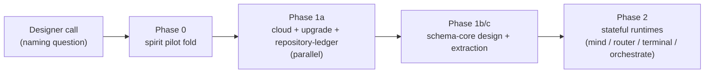

; spirit
[meta-report-synthesis next-stack-porting first-slice convergence operator-beads recommended-action]
[Orchestrator synthesis for designer 446 — the three sub-agents converge on folding the spirit-next pilot into the real spirit repo as Phase 0 first slice; cloud/upgrade/repository-ledger parallel after; schema-core extraction is the gate to multiplicative-scope wave-2 ports.]
2026-06-01
designer

# 4 — Overview: synthesis, convergence, recommended first slice, operator beads

## What this synthesis is

Closing the meta-report for designer 446. Three sub-agents covered the porting question from three angles — landscape, playbook, sequencing — and produced 1 603 lines of focused research across `1-component-landscape.md` (402 lines), `2-porting-playbook.md` (923 lines), and `3-sequencing-and-dependencies.md` (278 lines). This file marries their outputs, names the convergent first slice, lists the operator-bead-shaped actions, and surfaces the one designer call gating the work.

## The one-paragraph porting story

The next stack (`nota-next` parser + `schema-next` lowering + `schema-rust-next` emission + `spirit-next` runtime pilot) is the workspace's schema-driven contract substrate. It is sound today (designer 445 audit confirms substrate honors discipline), and it is ready to absorb the rest of the workspace's component fleet. **The right first port is the `spirit` repo itself** — folding the `spirit-next` pilot back into the renamed real repo, where the canonical worked example becomes the canonical commit history every subsequent port references. **The wave-1 trio (`cloud`, `upgrade`, `repository-ledger`) can port in parallel** after Phase 0 lands, sustaining the pre-extraction substrate cost as additional observation evidence. **Schema-core extraction (designer 444 §5 horizon 1) is the gate to wave-2** — the multiplicative-scope ports (`mind`, `router`, `terminal`, `orchestrate`, `message`, `introspect`) re-pay ~800-1000 lines of byte-identical envelope substrate per component without it, and lock the extraction design around one runtime's shape if rushed. Phase 0 + Phase 1a teach schema-core; Phase 1b designs it from observed pattern; Phase 1c lands it; Phase 2 ports the stateful runtimes through it.

## The three-way convergence

Three sub-agents working in parallel against the same source material independently converged on the same recommendation. That is a strong correctness signal.

| Sub-agent | Recommendation | Notes |
|---|---|---|
| Sub-agent 1 (landscape) | `spirit` fold as strongest first port — "already-working pilot, already-named destination, already-existing schema source." | Wave-1 trio: cloud, upgrade, repository-ledger. Wave 2: six stateful runtimes. |
| Sub-agent 2 (playbook) | `signal-message` as pedagogical worked migration — illustrates the recipe without needing schema-core extraction. | NOT a headline-port pick; recipe shape only. Compatible with sub-agent 1's `spirit` pick because they're answering different questions. |
| Sub-agent 3 (sequencing) | `spirit` fold as Phase 0 — validate-recipe-first over high-impact-first; converges with sub-agent 1 after reading it. | Phase 1a cloud/upgrade/repository-ledger in parallel; Phase 1b designer report on schema-core crate split; Phase 1c implementation. |

The framing line for the operator: **read sub-agent 2's playbook to learn the recipe; first port is `spirit` per sub-agents 1 + 3 because the pilot is already 90 % done; subsequent ports follow `spirit`'s commit history as the bead template.** Sub-agent 2 is showing the recipe in operator-handbook form against the simplest illustrative example. Sub-agent 1 + 3 are picking the actual headline. Both are right at their respective layers.

## The recommended first slice

Each arrow is a sequencing dependency. Phase 1a can begin immediately after Phase 0 lands and runs in parallel with Phase 1b designer work on the schema-core crate-split design. Phase 1c is the integration slice that re-homes wave-0+1 emitted code through schema-core; it lands when Phase 1a is feature-complete AND Phase 1b's designer report ratifies. Phase 2 candidates can queue bead descriptions during Phase 1a but cannot begin implementation until Phase 1c lands the universal envelope substrate.

## Operator-bead-shaped first action — Phase 0 spirit fold

One feature arc on shared branch `port-from-spirit-next` across three coordinated worktrees. Bead body would name the steps below verbatim so the operator can execute without re-reading the meta-report.

| Step | What operator does | Where |
|---|---|---|
| 0 | **Designer resolves naming**: `core-signal-spirit` → current `signal-X` + `owner-signal-X` convention, OR the proposed `meta-signal` rename per spirit records 290+299 (vs 293). Quick psyche check; this is the one designer call gating the slice. | designer pre-step |
| 1 | Move `schema/lib.schema` + `build.rs` + checked-in `src/schema/lib.rs` + `schema/lib.asschema` from `spirit-next` into `spirit`. | `~/wt/github.com/LiGoldragon/spirit/port-from-spirit-next/` |
| 2 | Move runtime substrate (`engine.rs`, `nexus.rs`, `store.rs`, `transport.rs`, `daemon.rs`, `config.rs`, `bin/*.rs`) from `spirit-next/src/` into `spirit/src/`. | same worktree |
| 3 | Replace `signal_channel!` invocation on `signal-spirit` (and `core-signal-spirit` or its renamed successor) with re-exports of the schema-emitted enums from the runtime crate's schema module. | `~/wt/github.com/LiGoldragon/signal-spirit/port-from-spirit-next/` + the policy-signal worktree |
| 4 | Run the witness-test suite per `skills/component-triad.md` §"Witness tests": dependency-surface (no `nota-next` in daemon path), socket-negative (rkyv-only on binary wire), process-boundary (real CLI ↔ daemon), durability (sema file survives restart), single-argument enforcement, no-flag rejection. Most already pass in `spirit-next`; the fold preserves them. | spirit's `tests/` |
| 5 | Retire `spirit-next` as a separate repo once the fold lands and CI is green. The repo becomes an archive marker per `protocols/active-repositories.md` §"Cutover discipline". | `protocols/active-repositories.md` update |

Estimated scope per sub-agent 1: S-cost (rename + consolidation is one operator-week). Sub-agent 3 confirms: the open naming question is the single significant designer call.

## What proves the slice worked

Two layers of evidence, both from `skills/component-triad.md` §"Witness tests":

1. **Continuity layer** — `spirit-next`'s existing witness tests continue to pass in their new home (`spirit`'s test suite). No regression in the next-stack substrate behavior.
2. **Triad layer** — the per-triad witness tests are now satisfied by `spirit`'s contract pair (`signal-spirit` + `owner-signal-spirit`): argument-rule enforced, single-peer-CLI bind, no-database-from-CLI, owner-socket rejects ordinary frames, ordinary-socket rejects owner frames, bootstrap-policy invariants honored.

Both layers green ⇒ port complete. The same evidence pattern is what every subsequent port uses; `spirit`'s commit becomes the bead template.

## Why this slice — the validate-recipe-first principle

Phase 0 ships first as the gating slice even though Phase 1 + 2 are where the big saving lives. Three workspace patterns justify this:

1. **Spirit-next itself as pilot** (`spirit-next/ARCHITECTURE.md` §"Purpose"): the decision to build a small second emitter consumer BEFORE extracting universal envelope was deliberate. Pilots teach the pattern; the extraction comes from observing the pattern in TWO places.
2. **The `~/wt` mockup-on-worktree method** (intent records 502-504, psyche 2026-05-24): build the replacement in parallel with the legacy, prove the recipe, then commit to fleet-wide migration. Not "design the perfect replacement, then big-bang cut over."
3. **Spirit 1291** (psyche 2026-05-27, High Decision): *"Schema-emitted Signal/Nexus/SEMA projections before schema-core extraction when projection slice stays small."* The pilot's projection slice IS small.

The opposite-direction failure mode — designing schema-core from one observed pattern (spirit-next alone) — risks (a) the abstraction locking around spirit-next's specific `Mail<Phase>` + `MailLedger` shape, (b) every subsequent component fighting the abstraction because their shape differs, (c) a re-design pass once a second component proves the abstraction is wrong. The test is TWICE, not ONCE.

## What the second slice looks like — Phase 1a in parallel

After Phase 0 lands, three independent operator lanes can begin in parallel. Per sub-agent 1 §"What a wave-1 first-slice looks like":

- **`cloud`**: ARCH at `/git/github.com/LiGoldragon/cloud/ARCHITECTURE.md` §"Pending schema-engine upgrade" explicitly schedules the cutover. Component is small (provider observation + plan preparation + plan application). Both signal pair repos exist.
- **`upgrade`**: skeletal U1 daemon. ARCH names the schema cutover as planned. Perfect early adopter.
- **`repository-ledger`**: mature triad, narrow scope (push-event store), lowest-risk port of a working triad.

Each lane carries the recipe from sub-agent 2's playbook + the operator-bead-template from `spirit`'s Phase 0 commit. The wave-1 trio sustains the pre-extraction substrate cost (~800-1000 lines per component, byte-identical) as additional observation evidence for schema-core extraction. Sub-agent 3's parallelization note (§"Parallelization note") names this slice as up to 3 simultaneous parallel operator lanes.

## The reusable substrate sub-agent 2 surfaced

The single most important takeaway from sub-agent 2's playbook: **the `build.rs` freshness-witness template at `spirit-next/build.rs:1-188` is the most reusable substrate in the recipe.** Specifically the `GeneratedFileArtifactWitness` double-emit pattern at lines 142-166 — proving that emitting from the NOTA `.asschema` artifact and from the rkyv `.asschema.rkyv` artifact produce byte-equal Rust. That four-corner round-trip check is a falsifiable spec test executed at every consumer build.

Sub-agent 2 names this as a natural target for the schema-core extraction horizon: generalize the build-script template into a `schema_next_build::run!("my-component", "0.1.0", "src/schema/lib.rs")` macro so every consumer crate's `build.rs` is one line. This would make Phase 1c (schema-core implementation) carry not only the runtime substrate lift but also the build-script substrate lift.

## Stage-3 risk — the trickiest step

Sub-agent 2 explicitly names Stage 3 (runtime migration to schema-emitted nouns) as the trickiest step of the recipe. Stages 1 + 2 + 4 + 5 are mechanical copies of `spirit-next` files with names changed; Stage 3 is where the component's domain logic gets re-anchored on schema-emitted nouns while the legacy path stays alive. The temptation to shadow types or hand-write parallel enums is strongest there.

For the spirit fold (Phase 0), Stage 3 risk is **minimal** — `spirit-next`'s runtime is already on the schema-emitted nouns; the fold just relocates files. Phase 1a candidates have a real Stage 3 cost; sub-agent 2's playbook §"What NOT to port" carves four piles that stay hand-written (runtime actor logic, storage internals, validation methods, typestate patterns) to keep operators from over-porting. Phase 2 candidates carry the highest Stage 3 cost because their runtimes are mature.

The discipline: operators reading sub-agent 2's playbook are warned in §"Stage 3: Migrate the runtime to schema-emitted nouns" about the parallel-track period; in §"What NOT to port" about the four hand-written piles; and in §"For the orchestrator" about Stage 3 being where dual-maintenance is highest.

## The one designer call that gates Phase 0

Resolve the spirit-triad naming question:

| Option | Decision | Source |
|---|---|---|
| Option A — keep current convention | Rename `core-signal-spirit` → `signal-spirit`; author new `owner-signal-spirit`; retire the `core-signal-` prefix. | Workspace convention per `skills/component-triad.md` §"The triad shape". |
| Option B — adopt proposed `meta-signal` rename | Apply the `meta-signal-X` prefix sweep workspace-wide; resolves spirit-triad as `meta-signal-spirit`. | Spirit records 290+299 (psyche 2026-05-25, Medium) propose; record 293 holds the line. |

The choice is one psyche line; sub-agent 3 §"For the orchestrator" recommends resolving via quick psyche check rather than carrying the decision forward as an "uncertainty" in this report. Either choice unblocks the operator slice.

## What this analysis DEFERS — questions for future designer reports

Eight questions sub-agent 3 flagged as deliberately not-resolved here; each is for a future designer report.

1. Schema-core crate split granularity (one crate or several narrower).
2. Whether owner-signal contracts merge into one schema or stay separate.
3. How cross-component dispatch types (when two components both have `Signal<Input>` of different `Input` enums).
4. Migration path for already-ported components when schema-core lands.
5. What gets ported AT ALL (some active-repositories entries are documentation-only at birth).
6. Retirement of `signal-frame` itself (phase-4 work).
7. The spirit-triad naming question (the designer call above — settle quickly).
8. Whether sub-agent 1's wave-1 trio runs in parallel with or after Phase 0. Recommendation: after, so `spirit`'s commit history is the canonical bead template.

These are explicit "for future designer report" markers, not gaps in this meta-report.

## Agglomeration ledger — what this meta-report supersedes

Per the frame's retirement policy (`0-frame-and-method.md` §"Retirement policy"): this meta-report supersedes ad-hoc porting recommendations scattered across earlier reports. Sub-agent 3's sequencing recommendation IS the canonical surface for operator beads; informal porting picks elsewhere should retire into this chain.

| Earlier informal recommendation | Landing evidence in 446 |
|---|---|
| Various "what should we port next" notes scattered across designer reports 444 + 443 | Sub-agent 1's full candidates table + per-candidate paragraphs. Wave-classification explicit. |
| "Eventually we port mind/router/terminal" without ordering | Sub-agent 3's Phase 2 gate analysis: stateful runtimes gate behind schema-core extraction (H1). Operator does NOT pre-port these. |
| "Cloud should adopt schema-engine" per `cloud/ARCHITECTURE.md` | Sub-agent 1 confirms wave-1 + sub-agent 3 confirms parallelizable Phase 1a. |
| "Schema-core extraction is the headline horizon" (designer 444 §5 item 1) | Sub-agent 3 confirms + adds the validate-recipe-first sequencing argument: schema-core best designed AFTER Phase 0 + Phase 1a observation. |

## Open horizons after this slice

Beyond Phase 0 + Phase 1a, the horizon stack at end-of-meta-report:

| Horizon | When | Note |
|---|---|---|
| Phase 1b designer report — schema-core crate split | Concurrent with Phase 1a operator work | Sub-agent 3 §"H1 — Schema-core extraction" frames the three open Qs. |
| Phase 1c implementation slice — schema-core landing | Once Phase 1a feature-complete + Phase 1b ratified | Cluster-operator or coordinating operator slice (spans multiple repos). |
| Phase 2 — stateful runtime ports | Once Phase 1c lands | Up to 5 parallel operator lanes per sub-agent 3 parallelization. |
| Designer 445 Finding 1 — free function refactor | Independent | Single-file refactor in nota-next; can land any time. |
| Designer 445 Findings 2 + 3 + 4 | Independent | Cosmetic; bundle with Phase 1c or any opportunistic operator slice. |

## Cross-references

- `reports/designer/446-next-stack-porting-research-2026-06-01/0-frame-and-method.md` — the orchestrator frame.
- `reports/designer/446-next-stack-porting-research-2026-06-01/1-component-landscape.md` — sub-agent 1: candidate cost-benefit catalog with 15 candidates classified; strongest first port = `spirit` fold.
- `reports/designer/446-next-stack-porting-research-2026-06-01/2-porting-playbook.md` — sub-agent 2: 5-stage operator recipe; worked migration on `signal-message`; build.rs freshness-witness template highlighted as most reusable substrate.
- `reports/designer/446-next-stack-porting-research-2026-06-01/3-sequencing-and-dependencies.md` — sub-agent 3: phased plan 0-4; validate-recipe-first reasoning; eight deferred questions.
- `reports/designer/444-stack-vision-2026-05-31/5-overview.md` — the horizon ledger this analysis sequences against.
- `reports/designer/445-next-stack-audit-2026-06-01.md` — the substrate audit confirming the pilot is sound today.
- `reports/designer/443-design-improvements-audit-2026-05-31/5-overview.md` — the multiplicative-scope numbers (~800-1000 lines per emitted component) feeding the H1-gates-stateful-runtime conclusion.
- `protocols/active-repositories.md` — workspace component map; source for the candidate division.
- `AGENTS.md` — workspace hard overrides honored throughout.
- `skills/component-triad.md` — the triad shape ports preserve; witness tests sub-agent 1 + 3 reference.
- `skills/contract-repo.md` — wire-contract crate discipline.
- `skills/feature-development.md` — multi-repo feature-branch coordination for the spirit fold.
- `/git/github.com/LiGoldragon/spirit-next/{ARCHITECTURE.md, INTENT.md, schema/lib.schema, build.rs, src/}` — the canonical worked example.
- `/git/github.com/LiGoldragon/spirit/ARCHITECTURE.md` §1-3 — the destination repo's named architecture.
- Spirit records 1244 (binary daemon + feature-gated NOTA), 1259 (strict-brace), 1267-1269 (notation honesty), 1272 (four logical planes), 1278 (known-root abstraction), 1282 (graph-size cap), 1287/1290 (body-stream substrate, LANDED), 1291 (schema-emitted projections before extraction when slice small), 1294/1295 (enum-body honesty).

## Final orchestrator recommendation

**Next action: settle the spirit-triad naming question with a quick psyche call, then file one operator bead for the Phase 0 fold + three operator beads for the Phase 1a parallel ports.** Defer schema-core extraction work (Phase 1b designer report + Phase 1c implementation) until at least Phase 0 lands; defer the wave-2 stateful runtime ports until Phase 1c lands. The validate-recipe-first principle, the workspace's `~/wt` mockup-on-worktree method, and Spirit 1291 all point at the same sequencing.
