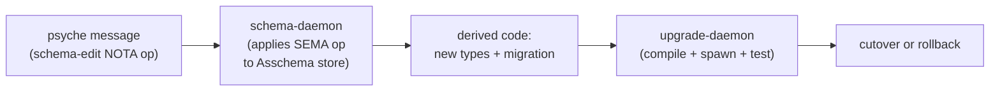
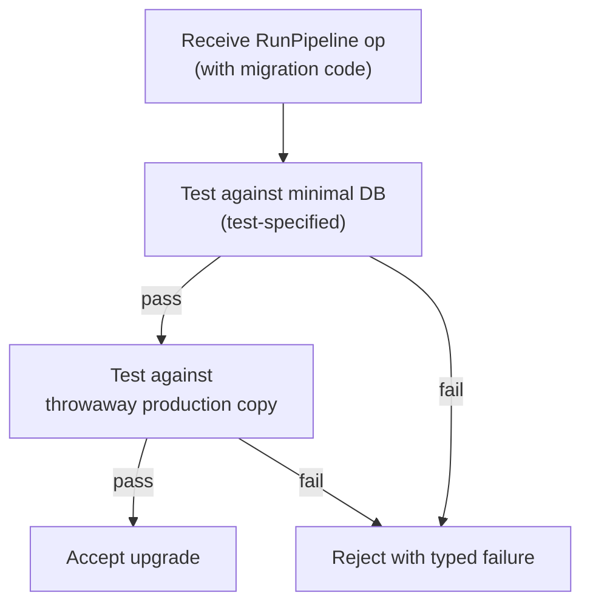

# 447 — Upgrade as SEMA design — the schema daemon as editor

## TL;DR

The upgrade mechanism IS SEMA operations on the Asschema. Same library, two object types: today's spirit-next applies SEMA ops to record-store Entries; tomorrow's schema-daemon applies SEMA ops to schema-store Asschemas. **The schema daemon is the editor of the schema** (Spirit 1309) — it receives upgrade messages encoding schema-edit operations (`AddField`, `ChangeFieldType`, `AddVariant`, etc.), applies them as SEMA writes against its stored Asschemas, and derives BOTH the new data type Rust code AND the upgrade migration Rust code from the resulting diff. A separate **upgrade daemon** (the current `upgrade` triad scaffold reshaped) consumes the derived code, coordinates compilation of a new daemon binary for each affected component, spawns it alongside the old one — the **transitory-database pattern** (Spirit 1310) — and runs a two-tier acceptance test (minimal first, then throwaway copy of production data).

This closes the **NOTA-to-object correspondence** all the way down (Spirit 1312): every NOTA token corresponds to a typed object; NOTA schema source corresponds to typed Asschema; NOTA upgrade ops correspond to typed schema-edit operations; NOTA upgrade ops edit NOTA schema source, producing new NOTA schema that corresponds to new typed objects. The recursion closes when the schema daemon's OWN schema (the one declaring its Input enum + namespace) becomes editable by the schema-edit operations it serves. **The system becomes self-editing.**

This report sketches the typed shape, the flow, the concrete operation examples (Spirit 1313), the testing pipeline, and the operator-bead-shaped first action. **Designer 444 §5 horizon 4 (schema-emitted variant projections) and horizon 1 (schema-core extraction) both become preconditions for the self-editing closure** — variant projections give the migration code its emission floor; schema-core extraction lets the upgrade migration code itself be shared substrate. Spirit 1314 directs starting the design now.

## The one-paragraph realization story

Look at spirit-next: it has Input variants `(Record Entry)`, `(Observe Query)`, `(Remove RecordIdentifier)` — SEMA operations on its `Entry` record store. The records ARE typed Rust objects emitted from `spirit-next/schema/lib.schema`. Now replace `Entry` with `Asschema`: the same daemon shape becomes a SCHEMA store. Its Input variants become `(EditSchema SchemaEdit)`, `(ObserveSchema SchemaQuery)`, `(RemoveSchema SchemaIdentity)` — SEMA operations on Asschema. The `SchemaEdit` enum carries variants like `AddField`, `ChangeFieldType`, `AddVariant`, each a schema-mutating operation. Applying one of these operations writes the new Asschema to the schema-daemon's store. The schema-daemon then derives — via `schema-rust-next` — both the new Rust type code from the new Asschema AND the upgrade migration code from the (old Asschema, new Asschema, migration spec) triple. A separate `upgrade-daemon` consumes this derived code, hands it to the build system, and spawns the resulting new daemon binary against a test database for validation. Cutover happens when validation passes. **Upgrade ≡ schema-edit ≡ SEMA on Asschema.** The library is one library.

## The flow diagram



Five nodes; honors Spirit 1282. Each arrow is a typed handoff:

- `Psyche → SchemaDaemon`: NOTA-encoded SEMA operation arrives at the schema-daemon's ordinary socket. Decoded into a `SchemaInput` variant via the standard signal-frame substrate.
- `SchemaDaemon → DerivedCode`: schema-daemon applies the operation, persists the new Asschema, asks `schema-rust-next` to emit the new Rust types AND derive the upgrade migration code from the operation's migration spec.
- `DerivedCode → UpgradeDaemon`: the derived code lands as an artifact pair (new types `.rs` file + migration `.rs` file) the upgrade-daemon consumes through its ordinary socket.
- `UpgradeDaemon → Cutover`: upgrade-daemon triggers compilation, spawns the new daemon binary alongside the old, runs the two-tier test (minimal first, then production-copy), and either signals cutover acceptance or rolls back.

The diagram intentionally splits schema-daemon and upgrade-daemon as separate components. Schema-daemon owns the EDITOR responsibility (Spirit 1309); upgrade-daemon owns the testing-pipeline responsibility ("another component or will be used by another component eventually to start the upgrade testing pipeline" — psyche's words). They cooperate; neither subsumes the other.

## Why this is one library, not two — Spirit 1308

Spirit 1308 is the realization that the upgrade mechanism is realized as SEMA operations on the Asschema, sharing the same library. The library in question is `schema-next` extended to ship a daemon.

Today, `schema-next` is library-only:

| What schema-next has today | What the schema-daemon needs |
|---|---|
| `Asschema` typed data model | (same) — stored in the daemon's SEMA store |
| `AsschemaArtifact` (text + binary projection) | (same) — emitted from store to artifact |
| `AsschemaStore` (redb persistence) | (same) — the daemon's durable state |
| `RustEmitter` (Asschema → Rust source text) | (same) — used in the derive step |
| `SchemaEngine::lower_source` (NOTA → Asschema) | (same) — used to lower edits |
| (none) | `SchemaSemaEngine::apply(SchemaInput) → SchemaOutput` |
| (none) | `MigrationEmitter` (op + asschema diff → migration code) |
| (none) | a CLI + daemon binary pair following spirit-next pattern |

Two new pieces: a `SchemaSemaEngine` that applies schema-edit operations as SEMA writes; a `MigrationEmitter` that derives migration code from operation + diff. Everything else is what schema-next already has. **One library, two stores** (record-store for spirit; schema-store for schema-daemon); the SEMA-engine shape is shared.

The deeper realization: spirit-next's `SemaEngine` over `Entry` records and the schema-daemon's `SemaEngine` over `Asschema` records have the same TYPE shape — `apply(Sema<Input>) → Sema<Output>` — they differ only in their typed payload. Once schema-core extraction (designer 444 §5 horizon 1) lifts the universal envelope substrate, this becomes obvious.

## The four building blocks

### Block 1 — The SchemaEdit operation enum

```rust
pub enum SchemaEdit {
    AddField(AddFieldOp),
    RemoveField(RemoveFieldOp),
    ChangeFieldType(ChangeFieldTypeOp),
    RenameField(RenameFieldOp),
    AddVariant(AddVariantOp),
    RemoveVariant(RemoveVariantOp),
    AddDeclaration(AddDeclarationOp),
    RemoveDeclaration(RemoveDeclarationOp),
}

pub struct AddFieldOp {
    pub target_type: TypeName,
    pub field_name: FieldName,
    pub field_type: TypeReference,
    pub default: MigrationDefault,
}

pub struct ChangeFieldTypeOp {
    pub target_type: TypeName,
    pub field_name: FieldName,
    pub new_type: TypeReference,
    pub migration: FieldMigration,
}

pub enum FieldMigration {
    WrapSingleton,
    UnwrapSingleton,
    Cast(CastSpec),
    Drop,
    SetDefault(DefaultValue),
}
```

NOTA encoding (positional, no struct-name wrapper inside variant payload):

```nota
(AddField Entry lastModified Integer (DefaultValue 0))
(ChangeFieldType Entry topic (Vec Topic) WrapSingleton)
(ChangeFieldType Entry topic (Vec Topic) (Cast (Identity)))
(AddVariant Kind Reflection)
(RemoveField Entry oldDeprecatedField)
```

Each NOTA expression corresponds to exactly one typed `SchemaEdit` variant. The correspondence is exact and reversible. This is Spirit 1312's principle in action.

### Block 2 — The SchemaSemaEngine

```rust
pub struct SchemaSemaEngine {
    store: AsschemaStore,
}

impl SemaEngine for SchemaSemaEngine {
    type Input = SchemaSemaInput;
    type Output = SchemaSemaOutput;

    fn apply(&mut self, input: Sema<SchemaSemaInput>) -> Sema<SchemaSemaOutput> {
        match input.into_root() {
            SchemaSemaInput::EditSchema(edit) => self.apply_edit(edit),
            SchemaSemaInput::ObserveSchema(query) => self.observe(&query),
            SchemaSemaInput::RemoveSchema(identity) => self.remove(identity),
        }
    }
}

impl SchemaSemaEngine {
    fn apply_edit(&mut self, edit: SchemaEdit) -> SchemaSemaOutput {
        let asschema = self.store.get_current()?;
        let new_asschema = asschema.apply_edit(&edit)?;
        let migration_spec = MigrationSpec::from_edit(&edit, &asschema, &new_asschema);
        self.store.put_asschema(&new_asschema)?;
        SchemaSemaOutput::SchemaEdited(SchemaEditReceipt {
            schema_identity: new_asschema.identity().clone(),
            migration_spec,
            database_marker: self.store.database_marker(),
        })
    }
}
```

The `apply_edit` method is one SEMA write transaction (redb write transaction wrapping the asschema mutation + migration spec capture + database marker bump). Failure modes return typed `SchemaSemaOutput` errors — the operation never panics; the store's invariant is that every accepted edit produces a valid new Asschema.

### Block 3 — The MigrationEmitter

```rust
pub struct MigrationEmitter;

impl MigrationEmitter {
    pub fn emit(
        old_asschema: &Asschema,
        new_asschema: &Asschema,
        spec: &MigrationSpec,
    ) -> Result<RustSource, MigrationError> {
        let module = MigrationModule::derive(old_asschema, new_asschema, spec)?;
        Ok(RustEmitter::emit_module(&module))
    }
}
```

The emitter walks the operation's migration spec and produces a Rust module containing:

- `mod historical` — rkyv reproduction of the old types per `skills/spirit-cli.md` §"Two-submodule migration module".
- `mod current_shape` — same-name types binding the new shape, overriding only changed fields.
- `From`-chain — typed conversion from `historical::T` to `current_shape::T` per the migration spec.

This pattern is already canonical in the workspace (`skills/spirit-cli.md` §"Substrate migration discipline"). The new realization: that pattern is DERIVABLE from the operation, not hand-written. Given the operation `(ChangeFieldType Entry topic (Vec Topic) WrapSingleton)`, the emitter produces:

```rust
mod historical {
    #[derive(rkyv::Archive, rkyv::Serialize, rkyv::Deserialize)]
    pub struct Entry { pub topic: Topic, pub kind: Kind, /* other fields */ }
}

mod current_shape {
    pub struct Entry { pub topic: Vec<Topic>, pub kind: Kind, /* other fields */ }
}

impl From<historical::Entry> for current_shape::Entry {
    fn from(historical: historical::Entry) -> Self {
        Self {
            topic: vec![historical.topic],  // <-- WrapSingleton migration
            kind: historical.kind,
            // ... other fields unchanged
        }
    }
}
```

The `vec![historical.topic]` line IS the WrapSingleton migration spec rendered into Rust. Every `FieldMigration` variant has a fixed emission template.

### Block 4 — The upgrade-daemon test pipeline

```rust
pub struct UpgradePipeline {
    schema_daemon: SignalClient<SchemaDaemon>,
    build_runner: BuildRunner,
    test_databases: TestDatabaseStore,
}

impl UpgradePipeline {
    pub async fn run(&mut self, edit: SchemaEdit) -> UpgradeReceipt {
        let receipt = self.schema_daemon.edit(edit).await?;
        let migration = self.build_runner.compile(&receipt.migration_spec).await?;
        let minimal_db = self.test_databases.minimal_for(&receipt.schema_identity);
        self.test_against(&migration, minimal_db).await?;
        let production_copy = self.test_databases.throwaway_copy_of_production().await?;
        self.test_against(&migration, production_copy).await?;
        UpgradeReceipt::Accepted(receipt)
    }
}
```

The pipeline runs **minimal first, then production-copy** per the psyche's specification. Both must pass. The minimal database carries the specific edge cases the test asserts; the production copy carries real-world distribution. Failure at either tier returns a typed `UpgradeReceipt::Failed(...)` with the failing test enumerated.

## The transitory-database pattern — Spirit 1310

The upgrade pipeline runs the OLD daemon (the production one, serving real traffic on its socket) and a NEW daemon (the candidate, serving the test pipeline on a separate test socket) concurrently. Both have access to durable databases — the old daemon owns the production database; the new daemon owns the throwaway copy. **This is the transitory-database pattern.**

Per Spirit 1310, this concurrency is owned by the SEMA interface — the SEMA store API supports the "two stores at once" pattern as a first-class shape, not a hack. The semantics:

| Phase | Old daemon | New daemon | Production traffic |
|---|---|---|---|
| Before upgrade | Owns production DB | Does not exist | Goes to old |
| During test | Owns production DB (read-only or normal) | Owns throwaway copy | Goes to old |
| After test passes | Still owns production DB | Owns migrated DB derived from production snapshot | Goes to old |
| Cutover step | Releases production socket | Takes production socket; throwaway copy becomes new production | Switches to new |
| After cutover | Retires | Owns production DB | Goes to new |

The cutover step is atomic at the socket level (old daemon stops listening; new daemon starts listening; either ordering with appropriate synchronization works because the database file is owned by the new daemon at that point). The OLD daemon's database file is preserved as the rollback artifact until the upgrade ages out.

This is exactly the shape `skills/component-triad.md` already specifies for the next/main/previous deployment vocabulary — applied at the daemon-runtime layer rather than the package-deployment layer.

## The compilation step — Spirit 1311 constraint

New Rust types require recompiling the daemon binary. The schema-daemon CANNOT live-patch typed Rust types into a running daemon. So the upgrade pipeline always culminates in:

1. Schema-daemon emits the new types `.rs` + migration `.rs` (one or more files).
2. Upgrade-daemon invokes the build system (Cargo + Nix per workspace convention) to compile a new binary.
3. New binary's commit is recorded in the migration history.
4. Spawn step uses the new binary.

Critical: the build step is NOT in-process. The upgrade-daemon shells out to Nix (or equivalent) to build the new binary, just as the workspace already builds binaries for deploy. The new binary is a real workspace artifact, signed and tagged per `skills/secrets.md` and the `criomos-horizon-config` deploy stack discipline.

This means upgrades are NOT instant — there's a real compile step measured in seconds to minutes per component. The pipeline accepts that latency as the cost of typed Rust. The benefit: the upgraded daemon is exactly as strongly typed as a hand-written daemon, and survives every type-system check the build runs.

## The NOTA correspondence closure — Spirit 1312 in action

Spirit 1312 names the goal: NOTA always corresponds to a specified object; when NOTA-as-schema specifies the objects themselves, the correspondence chain runs all the way down. Let me walk the chain explicitly with a concrete example.

**Step 1: NOTA tokens correspond to typed objects.**

```nota
[recordIdentifier]
```

corresponds to

```rust
Vec<NotaString>(vec![NotaString::new("recordIdentifier")])
```

via `nota-next`'s `NotaDecode` derive. The correspondence is enforced by the codec.

**Step 2: NOTA schema source corresponds to typed Asschema.**

```nota
{ Entry { Topics * Kind * Description * Magnitude * } }
```

corresponds to

```rust
Asschema { namespace: vec![Declaration::public(TypeDeclaration::Struct(StructDeclaration {
    name: Name::new("Entry"),
    fields: StructFieldMap::from([
        ("topics", TypeReference::Plain(Name::new("Topics"))),
        ("kind", TypeReference::Plain(Name::new("Kind"))),
        ("description", TypeReference::Plain(Name::new("Description"))),
        ("magnitude", TypeReference::Plain(Name::new("Magnitude"))),
    ]),
})), ...], ... }
```

via `schema-next::SchemaEngine::lower_source`. The correspondence is enforced by the macro registry.

**Step 3: NOTA upgrade operations correspond to typed schema-edit operations.**

```nota
(ChangeFieldType Entry topic (Vec Topic) WrapSingleton)
```

corresponds to

```rust
SchemaEdit::ChangeFieldType(ChangeFieldTypeOp {
    target_type: TypeName::new("Entry"),
    field_name: FieldName::new("topic"),
    new_type: TypeReference::Vector(Box::new(TypeReference::Plain(Name::new("Topic")))),
    migration: FieldMigration::WrapSingleton,
})
```

via the SchemaInput's `NotaDecode` derive (the new piece). The correspondence is enforced the same way as Step 1 — every variant carries its payload positionally; every payload type is itself NotaDecode-derived.

**Step 4: The NOTA upgrade operation edits the NOTA schema source.**

The schema-daemon receives the operation, locates the Entry struct declaration in its stored Asschema, mutates the `topic` field's type from `Topic` to `Vec<Topic>`, and persists. The new Asschema serializes back to NOTA as:

```nota
{ Entry { topics (Vec Topic) Kind * Description * Magnitude * } ... }
```

**The closure**: the new NOTA schema corresponds to the new typed Asschema; emitting Rust from the new Asschema produces the new `Entry` Rust type; new daemon compiled with the new `Entry` Rust type uses the migration code to read old records and write new records. Every link is reversible, every link is typed, every link is NOTA-to-object.

**The recursion**: the schema-daemon's OWN schema (the one declaring `SchemaInput` + `SchemaEdit` + the namespace) can be edited by the same operations. When the schema-daemon receives `(AddVariant SchemaEdit Reflection)`, applies it, and emits a new schema-daemon binary, the system has self-edited. Spirit 1314 names this as the design goal.

## Concrete operation examples — Spirit 1313

Per Spirit 1313, three families of operations are named explicitly by the psyche:

### Example 1 — Add a new field

```nota
; Add a field named "lastModified" of type Integer to the Entry type,
; defaulting to 0 for existing records.
(AddField Entry lastModified Integer (DefaultValue 0))
```

Decodes into `SchemaEdit::AddField(AddFieldOp { target_type: Entry, field_name: lastModified, field_type: Integer, default: DefaultValue(0) })`.

Migration emission:

```rust
mod historical { pub struct Entry { /* original fields */ } }
mod current_shape { pub struct Entry { /* original + last_modified: Integer */ } }
impl From<historical::Entry> for current_shape::Entry {
    fn from(historical: historical::Entry) -> Self {
        Self { /* copy original fields */ last_modified: Integer(0) }
    }
}
```

### Example 2 — Single string to vector with wrap-singleton

```nota
; Change Entry.topic from a single Topic to a vector of Topics,
; migrating each existing single value as the first element.
(ChangeFieldType Entry topic (Vec Topic) WrapSingleton)
```

Decodes into `SchemaEdit::ChangeFieldType(ChangeFieldTypeOp { ..., migration: FieldMigration::WrapSingleton })`.

Migration emission:

```rust
mod historical { pub struct Entry { pub topic: Topic, /* others */ } }
mod current_shape { pub struct Entry { pub topic: Vec<Topic>, /* others */ } }
impl From<historical::Entry> for current_shape::Entry {
    fn from(historical: historical::Entry) -> Self {
        Self { topic: vec![historical.topic], /* others copied */ }
    }
}
```

### Example 3 — Single symbol-qualified string to vector of symbol-qualified strings

```nota
; Change Entry.path from QualifiedName to a vector of QualifiedName,
; with the same wrap-singleton migration.
(ChangeFieldType Entry path (Vec QualifiedName) WrapSingleton)
```

Same shape as Example 2 — `WrapSingleton` is generic over the field's old type. Migration emission identical in structure. The psyche specifies this example to confirm: the WrapSingleton migration is a general pattern that applies regardless of the inner type's NOTA-encoding form.

The takeaway: **migration specs are positional structural shapes, not type-specific incantations**. One `WrapSingleton` migration spec handles `String → Vec<String>`, `Topic → Vec<Topic>`, `QualifiedName → Vec<QualifiedName>`, `Entry → Vec<Entry>` — every wrap-the-singleton case.

## What the upgrade triad becomes

The `upgrade` triad scaffold (`upgrade/ARCHITECTURE.md` U1) takes substance as the upgrade-daemon described here:

| Current (U1 scaffold) | After this design |
|---|---|
| Skeleton daemon returning `RequestUnimplemented` | Live daemon coordinating the upgrade pipeline. |
| No durable state | Owns migration history + active version event log + quarantine list (per current ARCH). |
| No knowledge of schema | Subscribes to schema-daemon's `SchemaSemaOutput::SchemaEdited` events. |
| No build invocation | Shells out to Nix build for compiling new daemon binaries. |
| No spawn coordination | Coordinates transitory-database pattern with persona-engine-management. |
| Pending schema-engine upgrade per ARCH | (This design IS the schema-engine upgrade.) |

The contract pair (`signal-upgrade`, `owner-signal-upgrade`) carries the upgrade-daemon's wire surface; the ordinary signal contract carries `EditSchema(SchemaEdit)` / `RunPipeline(UpgradeTest)` requests; the owner signal contract carries `ForceAccept` / `Rollback` / `Quarantine` authority operations.

## Two parallel daemons — division of labor

| Schema-daemon | Upgrade-daemon |
|---|---|
| Owns Asschema store | Owns migration history + active version event log |
| Receives `EditSchema(SchemaEdit)` SEMA ops | Receives `RunPipeline(UpgradeTest)` ops |
| Applies edits to stored Asschema | Subscribes to schema-daemon edit events |
| Emits new Rust types + migration code | Triggers Nix build of new daemon binary |
| (No build invocation) | (No schema mutation) |
| (No spawn coordination) | Coordinates transitory-database, runs test pipeline |
| (No cutover authority) | Owns acceptance criterion + cutover orchestration |

The split keeps each daemon focused on one responsibility. The schema-daemon NEVER triggers a build; the upgrade-daemon NEVER mutates the schema. They cooperate over the wire via the `SchemaSemaOutput::SchemaEdited` event stream.

## Where this lives in the repo map

| Component | Repo | Role |
|---|---|---|
| `schema-next` (library, today) | `/git/github.com/LiGoldragon/schema-next` | Stays as the library carrying Asschema + macros + emitter. |
| New: schema-daemon | `/git/github.com/LiGoldragon/schema-daemon` (proposed) OR fold into `schema` | Wraps schema-next in a runnable daemon with a SchemaSemaEngine. |
| `signal-schema` (proposed) | New | The ordinary contract for `EditSchema` / `ObserveSchema` / `RemoveSchema`. |
| `owner-signal-schema` (proposed) | New | The owner contract for force-edit / freeze / etc. |
| `upgrade` (current scaffold) | `/git/github.com/LiGoldragon/upgrade` | Becomes the upgrade-daemon runtime per this design. |
| `signal-upgrade` (current scaffold) | `/git/github.com/LiGoldragon/signal-upgrade` | Carries `RunPipeline` operations + status queries. |
| `owner-signal-upgrade` (current scaffold) | `/git/github.com/LiGoldragon/owner-signal-upgrade` | Carries cutover / rollback authority. |

The schema-daemon could either live as its own `schema-daemon` repo or fold into the existing `schema` legacy repo (renaming `schema-next` into `schema` after the spirit/spirit-next fold pattern). Either way, three new contract pairs land (`signal-schema` + `owner-signal-schema`) per the workspace's triad discipline.

## The testing pipeline — minimal first, then production-copy

Per the psyche's specification, the upgrade-daemon's acceptance protocol is two-tier:



Five nodes; honors Spirit 1282. Each test is a real daemon run:

- **Minimal test**: spawn new daemon binary against a minimal test database (loaded with edge-case records the test specifies). Verify migration succeeded; verify post-migration queries return expected values; verify no orphaned records or constraint violations.
- **Production-copy test**: copy the production database to a temp path; spawn new daemon against the copy; verify migration succeeded against real-world data distribution; verify post-migration `database_marker()` matches expected commit sequence + state digest computation.

Both passes ⇒ accept. The minimal test guards against operation bugs; the production-copy test guards against scale + distribution issues.

## How designer 444 §5 horizons interact

This design depends on three of designer 444's §5 open horizons:

| Horizon | How it interacts |
|---|---|
| H1 — schema-core extraction | The `SemaEngine<Input, Output>` trait substrate that lets schema-daemon and spirit-next share `apply()` shape lives in schema-core. Until H1 lands, schema-daemon re-implements the envelope substrate inline (paying the ~470-line duplication per designer 443 §"#1"). |
| H4 — schema-emitted variant projections | The migration emitter is the canonical consumer of variant projections — every `From<historical::T> for current_shape::T` impl is a variant projection. Once H4 lands, MigrationEmitter's emission patterns become uniform. |
| H3 — RustModule-as-data completeness | The migration emitter produces `impl From<...>` blocks. Today the emitter would render these as text; once H3 lands, they're structured `RustItem::ImplBlock` values the emitter holds in a typed catalog. |

None of these BLOCK the design from being implemented. They make it cleaner.

## Open design questions

Eight questions this report deliberately does not resolve. Each is for a follow-up designer report or a psyche call.

1. **One or two daemons?** Schema-daemon + upgrade-daemon as separate components, or one merged daemon? This report proposes separate; the psyche's "another component" wording supports separate; but a single daemon owning both responsibilities would be simpler. **Psyche call recommended.**

2. **Does the schema-daemon edit its OWN schema?** Self-editing closure (Spirit 1312, 1314) requires it. But "self-editing" introduces bootstrap problems: a broken edit to the schema-daemon's schema could brick the schema-daemon. Quarantine + rollback handles this — but the design needs to specify the bootstrap behavior. **Future designer report.**

3. **Where do migration tests live?** The test database is part of what the upgrade-daemon needs. Authored by who? Schema-daemon emits a "test scaffolding" module alongside types + migration? Operator hand-writes? **Open.**

4. **How does the workspace's `criomos-horizon-config` deploy stack interact with hot-spawned daemons?** The deploy stack assumes Nix-built binaries land in `/run/current-system/sw/bin/...`. Hot-spawned binaries don't go through that path. **Designer report needed; pairs with `system-operator` consultation.**

5. **What happens to data the migration can't handle?** A `WrapSingleton` migration is total. A `Drop` migration loses data. A `Cast` migration might fail per-record. The design needs typed failure handling — `MigrationOutcome::PartialFail(rejected_records)` and a quarantine path. **Open.**

6. **Are upgrade operations atomic across multiple components?** When a shared substrate type (e.g. a `signal-core` `Message` envelope) changes, every component that imports it needs simultaneous upgrade. **Future designer report; pairs with schema-core extraction (H1).**

7. **What's the migration history's grain?** Per-edit, per-batch, per-version? The migration history is a SEMA log of applied edits. **Open; depends on the active version event log design.**

8. **What authority is required to edit a schema?** Today the psyche edits schemas through `spirit "(Record ...)"` for intent and through file-level edits for typed schemas. Once the schema-daemon is live, schema edits become signal operations. Who is authorized to send them — psyche only (owner socket), or any authenticated agent (ordinary socket)? **Owner socket per default; psyche call to confirm.**

## Operator-bead-shaped first action

Per the psyche's assignment, operator starts implementing as far as they can understand. The first slice that fits in a single operator-week:

| Step | Action | Lane |
|---|---|---|
| 1 | Fork `schema-next` → new `schema-daemon` worktree on branch `upgrade-as-sema`. | operator |
| 2 | Author the `SchemaEdit` enum in `schema-daemon/src/lib.rs` covering the three operations from Spirit 1313 (AddField, ChangeFieldType with WrapSingleton migration, and AddVariant). | operator |
| 3 | Author the `SchemaSemaInput` / `SchemaSemaOutput` enums in the daemon's `schema/lib.schema` file. Run schema-next lowering through `build.rs` (per designer 446 §"Stage 2"). | operator |
| 4 | Implement `Asschema::apply_edit(&SchemaEdit) → Result<Asschema, SchemaError>` for the three operation cases. | operator |
| 5 | Implement `MigrationEmitter::emit(old, new, spec)` for the three operations — producing the rkyv reproduction + From-chain Rust source per Block 3. | operator |
| 6 | Witness test: round-trip `(ChangeFieldType Entry topic (Vec Topic) WrapSingleton)` → apply → emit migration → compile emitted module → use migration to convert a sample historical Entry into a current_shape Entry → verify result. | operator |
| 7 | NO daemon binary yet (defer to second slice); NO build orchestration (defer to upgrade-daemon work); NO cutover (defer). | scope guard |

Estimated scope: one operator-week. This is the **minimal closure** of the NOTA-to-object correspondence Spirit 1312 directs — the operator can show the psyche each NOTA token's corresponding typed Rust object at every step of the chain, demonstrating the substrate understands NOTA's role as schema-of-objects.

The second slice (estimated one more operator-week) wires the daemon binary + CLI + ordinary socket; the third slice (estimated 2-3 operator-weeks) wires the upgrade-daemon coordination + the testing pipeline. Cutover orchestration lands in the fourth slice.

## What this report DEFERS

This report sketches the typed shape and the flow. It does NOT:

- **Bind operator's implementation choices.** The shapes shown are designer suggestions; operator may name types differently, organize crates differently. Per `skills/designer.md` §"Working with operator", the operator's wire form is binding; the implementation behind it is operator's call.
- **Resolve the eight open questions above.** Each becomes its own follow-up designer report or psyche call.
- **Schedule when this lands.** Per designer 446's sequencing analysis, the spirit fold (Phase 0) lands first; the schema-daemon work can begin in parallel with Phase 1a since it doesn't depend on schema-core extraction (H1) for its initial slice.
- **Specify the build-system handoff details.** Nix invocation patterns, the daemon-spawning Persona protocol, and the cutover socket-swap protocol are system-operator-lane work that designer hands off via separate reports.

## Cross-references

- Spirit records captured for this design:
  - 1308 (Decision, Maximum) — upgrade IS SEMA operations on Asschema; same library.
  - 1309 (Decision, Maximum) — schema daemon IS the editor; receives upgrade messages, derives types + migration code.
  - 1310 (Decision, Maximum) — transitory-database pattern; daemon runs two databases concurrently as part of SEMA interface.
  - 1311 (Constraint, Maximum) — new Rust types require recompiling daemon binary; new daemon spawns alongside old for testing.
  - 1312 (Principle, Maximum) — NOTA always corresponds to a specified object; goal is correspondence all the way down to NOTA-as-schema specifying the objects themselves.
  - 1313 (Clarification, High) — concrete operation examples: AddField, ChangeStringToVec with WrapSingleton, ChangeQualifiedStringToVecOfQualified with WrapSingleton.
  - 1314 (Decision, Maximum) — design self-editing system from the start, not later.
- `reports/designer/444-stack-vision-2026-05-31/` — what the next stack IS today.
- `reports/designer/445-next-stack-audit-2026-06-01.md` — substrate audit confirming the pilot is sound.
- `reports/designer/446-next-stack-porting-research-2026-06-01/` — the porting plan that frames where this design lands.
- `/git/github.com/LiGoldragon/upgrade/ARCHITECTURE.md` — current upgrade triad U1 scaffold; the §"Pending schema-engine upgrade" section flags this design.
- `/git/github.com/LiGoldragon/spirit-next/{ARCHITECTURE.md, src/store.rs, src/engine.rs}` — the SEMA-engine pattern this design re-uses.
- `/git/github.com/LiGoldragon/schema-next/src/{asschema.rs, engine.rs, store.rs}` — the Asschema substrate this design wraps in a daemon.
- `skills/component-triad.md` §"The triad shape" — schema-daemon + signal-schema + owner-signal-schema follow the standard triad pattern.
- `skills/spirit-cli.md` §"Substrate migration discipline" — the historical/current_shape submodule pattern this design generalizes from hand-written to schema-emitted.
- `AGENTS.md` §"Capture intent through Spirit FIRST" — followed for Spirit 1308-1314 before this report was authored.
- `AGENTS.md` §"NOTA strings come EXCLUSIVELY from bracket forms" — all NOTA examples in this report honor.

## For the psyche

The design lands as a coherent typed shape: upgrade IS SEMA on Asschema, schema-daemon owns the edit, upgrade-daemon owns the test-and-cutover, NOTA-to-object correspondence closes the loop. The one-paragraph realization story at the top of this report is the load-bearing summary. Three structural decisions await psyche ratification: (a) separate schema-daemon + upgrade-daemon vs merged single daemon — this report proposes separate, citing your phrasing "another component", (b) does the schema-daemon edit its own schema (the self-editing closure) — this report says yes per Spirit 1312/1314 but defers bootstrap design to a follow-up, (c) the eight open design questions in §"Open design questions" each need either a psyche call or a follow-up report. The first operator slice (the minimal-closure NOTA-to-object correspondence demo) is well-defined and fits in one operator-week without depending on schema-core extraction or other open horizons.
