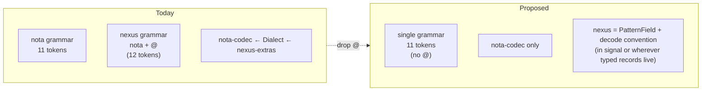

# Nexus needs no grammar of its own — drop `@`, nexus = nota

Status: design analysis answering the user's sharper
follow-up: *"does nexus even need parsing? if its valid
nota format, then it doesn't right?"*
Author: Claude (designer)

**Direct answer: yes, you're right.** Nexus needs no
parser of its own. The only nexus-specific token in Tier 0
is `@` (the bind marker). Drop it, and nexus is
*structurally identical* to nota — same lexer, same parser,
same `Decoder`/`Encoder`. What remains "nexus" is a single
runtime type (`PatternField<T>`) and a decode-time
convention. No grammar, no codec extension.

This supersedes report 44 (which extracted `nexus-codec`
under the assumption `@` stays). If `@` goes, there's
nothing left in nexus that warrants a separate codec —
it's just a typed-record convention layered on top of
nota.

The cost is one ergonomic concession: bare idents at
PatternField positions are reserved for bind / wildcard;
literal-match-of-bare-ident-shaped-strings requires
quoting. That's the entire trade.

---

## 0 · TL;DR



| Question | Today | After dropping `@` |
|---|---|---|
| Token vocabulary | 12 | **11** |
| Codecs needed | nota-codec + (per report 44) nexus-codec | **nota-codec only** |
| Lexer per layer | one (Dialect-aware) | **one (universal)** |
| Parser per layer | one (Dialect-aware) | **one (universal)** |
| `PatternField<T>` ownership | nota-codec re-exported by signal | typed-record crate (`signal` / `signal-core`) |
| Wire form: bind | `@to` | `to` (bare ident matching schema field name) |
| Wire form: wildcard | `_` | `_` (unchanged — already a regular ident) |
| Wire form: literal `"User"` (string) | `User` (bare-ident-as-string) | `"User"` (must quote) |

The ambiguity case (literal-match of a string that happens
to spell the schema field name) is resolved by quoting.
The grammar gets simpler; the codec stack flattens; the
edge case is small.

---

## 1 · The question, restated

The user's intuition: nexus's wire form is just nota
records. The "verbs" are records. The "queries" are
records. The "patterns" are records with special-shaped
fields. If everything is a nota record, then nexus's wire
form is valid nota text, and a nota parser is sufficient.

Today's grammar.md §1 has a 12-token alphabet that
includes `@`. The `@` is the only token that distinguishes
nexus from nota at the tokeniser. If `@` stays, the user's
intuition is *almost* right — nexus is nota plus one extra
token. If `@` goes, it's *exactly* right.

This report explores what happens when `@` goes.

---

## 2 · The grammar without `@`

Token vocabulary becomes:

```rust
pub enum Token {
    LParen, RParen,
    LBracket, RBracket,
    Colon,
    Ident(String),
    Bool(bool),
    Int(i128),
    UInt(u128),
    Float(f64),
    Str(String),
    Bytes(Vec<u8>),
}
```

**11 variants.** Same as today's lexer minus `At`. The
lexer code path that recognises `@` simply doesn't exist;
seeing `@` in source produces an `UnexpectedChar` lexer
error.

Records, sequences, primitives, identifiers, comments,
byte literals — unchanged. Nota is unchanged.

Nexus uses the same vocabulary. There is no separate nexus
lexer. There is no `Dialect` enum. There is no decode path
that consumes a `Token::At`.

The grammar.md §1 table changes one row:

| Removed | `Bind | @fieldname | Pattern bind in a PatternField<T> position` |
| Added | (nothing; bind becomes a decode-layer convention — see §3) |

Section §4 "Patterns" rewrites in terms of bare idents
(see §3 of this report for the rule).

---

## 3 · Bind and wildcard as decode-layer conventions

`PatternField<T>` keeps its three variants:

```rust
pub enum PatternField<T> {
    Wildcard,
    Bind,
    Match(T),
}
```

The decoder for `PatternField<T>`, given that it knows the
expected schema field name at this position, peeks the next
token:

```text
peek next token
    is it Ident("_")? → consume; return PatternField::Wildcard
    is it Ident matching <expected schema field name>? → consume; return PatternField::Bind
    otherwise → decode T; return PatternField::Match(value)
```

That's the entire bind/wildcard machinery. No `@` token.
No special "bind marker" lexer path. The convention is at
the decode layer, where the schema knows the field name.

Concrete examples (Tier 0 today vs proposed):

| Today | Proposed |
|---|---|
| `(NodeQuery @name)` | `(NodeQuery name)` |
| `(NodeQuery _)` | `(NodeQuery _)` (unchanged) |
| `(NodeQuery "User")` | `(NodeQuery "User")` (unchanged) |
| `(EdgeQuery 100 @to Flow)` | `(EdgeQuery 100 to Flow)` |
| `(Match (EdgeQuery @from @to @kind) Any)` | `(Match (EdgeQuery from to kind) Any)` |
| `(Constrain [(EdgeQuery 100 @to Flow) (NodeQuery @to)] (Unify [to]) Any)` | `(Constrain [(EdgeQuery 100 to Flow) (NodeQuery to)] (Unify [to]) Any)` |

**Same character count.** The proposed form drops one
character per bind (`@`), so it's *shorter*. Wildcards
unchanged. Literal matches unchanged when quoted.

The Constrain example is interesting: the `[to]` bind list
in `(Unify [to])` already references binds by their schema
field name (without `@`). The proposed wire form makes
patterns look the same way — the bind name is just an
ident. Consistency.

---

## 4 · The ambiguity case and how to resolve it

There is one ambiguity:

> *Schema has `name: PatternField<String>`. Pattern
> `(NodeQuery name)`. Is `name` a bind, or a literal match
> against the string `"name"`?*

**Resolution: at PatternField positions, bare idents are
reserved for bind and wildcard. Literal-match of a string
that spells like an ident requires quoting.**

| Form | Decoded |
|---|---|
| `(NodeQuery _)` | Wildcard |
| `(NodeQuery name)` | Bind to `name` (the schema field name) |
| `(NodeQuery "name")` | Match the literal string `"name"` |
| `(NodeQuery "User")` | Match the literal string `"User"` |
| `(NodeQuery foo)` | **Parse error** — bare ident `foo` doesn't match the schema field name `name` and bare-ident-as-string is not allowed at PatternField positions |

This is a stricter rule than nota's general "bare-ident-as-
string is allowed when the schema expects String." At
PatternField positions, the relaxation is removed. To
literally match a string, you quote it.

The cost is small:
- Most matched values are typed (numbers, slots, enum
  variants) — no string-vs-ident confusion. `(EdgeQuery 100
  to Flow)` — `100` is `Slot<Node>`, `to` is bind, `Flow`
  is enum variant. No string. No issue.
- For matched String values, quoting is one byte more per
  value (the open quote; close quote can be inferred but
  isn't in nota — both are needed). And quoted-string is
  often what people write anyway.

The benefit is large:
- No `@` token.
- No separate nexus codec.
- No Dialect.
- 11-token grammar lock instead of 12.

---

## 5 · What this does to report 44

Report 44 (`extract nexus-codec from nota-codec`) was
predicated on `@` staying. With `@` gone, the structural
overlap between nota and nexus becomes **zero**: same
grammar, same codec, same parser. There's nothing to
extract.

What was nexus-codec's content under the §44 plan:

| Was | Disposition under §45 |
|---|---|
| `PatternField<T>` enum | Lives in `signal` (or `signal-core`) — the typed-records layer. Not in a codec crate. |
| `decode_pattern_field` extension method | Becomes the standard `NotaDecode for PatternField<T>` impl. The schema field name comes from the surrounding `NexusPattern` (renamed?) derive. |
| `encode_pattern_field` extension method | Becomes the standard `NotaEncode for PatternField<T>` impl. |
| `peek_is_wildcard` / `peek_is_bind_marker` | The bind-marker peek goes away (no `@`). The wildcard peek becomes a generic `peek_is_ident_named("_")` on `nota-codec::Decoder` (or stays inline in PatternField's decode). |
| `WrongBindName`, `PatternBindOutOfContext` errors | Move to wherever `PatternField<T>` lives. |
| Nexus-specific lexer paths | Deleted — there are none. |
| Dialect enum | Deleted — one tokenisation. |
| Nexus-only token variants | Deleted (was already pending per designer/42 §2). |

The `NexusPattern` derive (proc-macro) becomes a regular
nota-derive that emits PatternField-aware codec calls. Or
the derive disappears entirely if PatternField's
`NotaDecode` impl can read the schema field name from
context — which it can, since the derive already passes the
field name to `decode_pattern_field`. The derive is just
positional record codec with PatternField fields.

Report 44 still has value: §3 (consumer audit), §4.5
(NexusVerb is mis-named and should rename to NotaSum or
similar), §5.2 (per-crate Error enum discipline). Those
findings stand independent of the `@` decision.

What changes: the *headline* claim ("extract nexus-codec")
becomes wrong if `@` is dropped. There's nothing to
extract, because nothing nexus-specific remains at the
codec layer.

---

## 6 · What this does to designer/31 §5 and grammar.md §1

Designer/31 §5 locked the grammar at 12 token variants
including `@`. That lock was the right call given the
existing assumption that `@` was needed for binds.

If `@` goes, the lock revises to **11 tokens.** The grammar
becomes simpler. The "drop curly brackets permanently"
discipline (designer/31's headline rule) extends naturally
to "drop `@` permanently" if the user agrees: there's no
expressive case `@` opens that records + sequences +
identifiers can't already handle. By the test in
designer/31:

> *"Can the wire form be made shorter or clearer for an
> expressive case that records + sequences + primitives
> can't handle?"*

For `@`: **no.** The bind name lives in the schema field
name (the schema position carries the field's identity).
The schema knows the field name. The wire
form doesn't need to repeat the marker. `@` was being kept
"for visual clarity," which is the same anti-pattern
designer/31 caught for `{ }`: cosmetic distinction the
schema already encodes.

So the discipline is consistent: `@` was already on the
chopping block by the same rule that chopped `{ }`. The
user's question makes that consistency visible.

`grammar.md` would update §1 (one fewer token), §4 (Patterns
section rewritten with bare-ident bind convention), §5 +
§6 (examples lose the `@` decoration), §7 (dropped forms
list adds one more entry: `@<name>` was replaced by bare
ident at PatternField positions).

The drop is **a one-pass spec edit + a small codec strip +
a small consumer update**. Smaller than report 44's
extraction.

---

## 7 · Recommendations

| # | Action | Reason |
|---|---|---|
| 1 | **Confirm or deny: drop `@` from the grammar.** This is a user-decision point. If confirmed, the rest follows. | The trade is *one* ergonomic edge case (literal-match-of-bare-ident-shaped-strings requires quoting) for the entire elimination of nexus's separate parser story. |
| 2 | If (1) confirmed: update grammar.md (§1 to 11 tokens; §4 rewrite) | One-pass spec edit. |
| 3 | If (1) confirmed: strip `@` token from `nota-codec` lexer; remove `decode_pattern_field`'s `peek_is_bind_marker` path; rewrite as bare-ident-vs-schema-field-name comparison | Clean decoder; one fewer token; the bind-marker peek goes away. |
| 4 | If (1) confirmed: report 44's "extract nexus-codec" becomes moot. The PatternField<T> type moves into `signal` (or `signal-core`); the NexusPattern derive becomes a regular nota-derive. | Codec stack flattens. |
| 5 | Designer/31 §5's "12 tokens" lock revises to 11; designer/26 §7 references update accordingly | Documentation hygiene. |
| 6 | Independent of (1): the `NexusVerb` rename to a generic name (per report 44 §4.5) still holds — the derive is generic head-ident dispatch and isn't nexus-specific regardless of the `@` decision. | Report 44's §4.5 stands. |

(1) is the load-bearing decision. Everything else is
mechanical follow-through.

---

## 8 · Why this is the cleaner answer

Report 44 was the right *conditional* answer ("if `@`
stays, here's how to clean up the codec layout"). Report 45
is the unconditional answer: **`@` doesn't earn its place.**

By the same discipline that drove designer/31 (curly
brackets dropped, then locked grammar at 12 tokens), `@`
is on the chopping block. The user's question makes the
inconsistency visible: we kept `@` because it predated the
"delimiters and sigils earn their place" rule. Apply the
rule, and `@` goes.

What remains is a simpler architecture:
- One grammar (nota's).
- One codec (nota-codec).
- One lexer.
- One parser.
- A typed runtime (`PatternField<T>` + the bare-ident-vs-
  schema-field-name convention) that lives wherever typed
  records live.

The nexus daemon's translation layer (text↔signal) keeps
working without modification — it already uses nota-codec.
The pattern-handling logic moves from "consume `@` then
read bind name" to "peek ident; if it matches the schema
field name, it's a bind." Same number of code paths;
slightly different shape; same correctness.

---

## 9 · See also

- `~/primary/reports/designer/26-twelve-verbs-as-zodiac.md`
  — the verb scaffold; unchanged by dropping `@` (verbs are
  records, no special tokens).
- `~/primary/reports/designer/31-curly-brackets-drop-permanently.md`
  §5 — the locked grammar this report revises from 12 to 11
  tokens; §6's "delimiters earn their place" rule this
  report applies to `@`.
- `~/primary/reports/designer/46-bind-and-wildcard-as-typed-records.md`
  — supersedes §3's "bare-ident-as-bind" convention with
  the typed-record approach.
- `~/primary/skills/contract-repo.md` — the layered-effect-
  crate pattern; `nexus-codec` extraction was an instance,
  but unnecessary once `@` is gone.
- `/git/github.com/LiGoldragon/nexus/spec/grammar.md`
  §1 + §4 — the two sections that change if (1) is
  confirmed.

---

*End report.*
