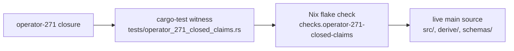

; spirit
[operator-271-verification next-stack architectural-truth-tests verify-271-closed-claims constraint-tests]
[Designer sub-agent verification of the five "Closed Since The Earlier Gap Reports" claims in operator 271. Each closure is now backed by Nix-runnable constraint tests on feature branches in `~/wt`. All five claims VERIFIED with live witnesses; one stale flake check surfaced and fixed in passing.]
2026-06-01
designer

# 450 — Operator 271 closed-claims verification

## TL;DR

All five "Closed Since The Earlier Gap Reports" claims in operator 271 VERIFIED against live code. Each closure is now backed by a Nix-runnable constraint test on the `verify-271-closed-claims` feature branch in the relevant repo. The branches are pushed and ready for operator pickup. One unexpected finding surfaced in passing: the `schema-next` flake's `declarative-schema-macros` check was STALE — it asserted presence of the retired `DeclarativeMacroLibrary::builtin` and `pub struct MacroLibraryData` names, both of which were removed in commit `99078b20`. The check would have failed on current main. Fixed inline as part of the claim-1 work; the corrected check asserts present canonical names and bans the retired Data mirrors.

Per-claim headline:

| Claim | Verdict | Branch · file path · commit |
|---|---|---|
| 1 — macro library source/artifact split CLOSED | VERIFIED | `schema-next/verify-271-closed-claims` · `tests/operator_271_closed_claims.rs` · `e2a8abf` |
| 2 — `FieldEncode` ZST holder CLOSED | VERIFIED | `nota-next/verify-271-closed-claims` · `tests/operator_271_closed_claims.rs` · `b33b5b5` |
| 3 — `CodecDerive` resolved-not-bug | VERIFIED | `nota-next/verify-271-closed-claims` (same file as claim 2) · `b33b5b5` |
| 4 — honest enum bodies CLOSED | VERIFIED | `spirit-next/verify-271-closed-claims` + `schema-next` · `762acf0` + `e2a8abf` |
| 5 — Asschema typed data + NOTA + rkyv + SEMA CLOSED | VERIFIED | `schema-next/verify-271-closed-claims` · `tests/operator_271_closed_claims.rs` · `e2a8abf` |

21 cargo-test witness functions added across three repos. Three new Nix flake checks plus one repaired-stale check. Every witness passes against current `main` (`f5906ba` / `99078b2` / `ce6ba20`).

## Method

What I read, in order:

1. `reports/operator/271-context-maintenance-current-state-2026-06-01.md` — the source claims.
2. `AGENTS.md` hard overrides + `INTENT.md` workspace intent.
3. `skills/architectural-truth-tests.md` — full text; the §"Witness catalogue", §"Pair-rule sweeps", and §"Schema-chain witnesses use schema objects" sections shaped each witness.
4. `skills/feature-development.md` + `skills/designer.md` §"Working with operator" + §"Specify by example".
5. `reports/designer/445-next-stack-audit-2026-06-01.md` — substrate audit naming current state.
6. `reports/designer/448-single-field-wrapper-audit-2026-06-01.md` — wrapper-audit rationale for claim 3.
7. Per claim, the cited commits (`99078b20`, `f5906bae`) plus the live code surfaces in each repo's `src/`, `tests/`, `schemas/`, `derive/`, and `flake.nix`.

What I created — three worktrees under `~/wt/github.com/LiGoldragon/`:

- `nota-next/verify-271-closed-claims/` — claims 2 + 3.
- `schema-next/verify-271-closed-claims/` — claims 1, 4 (cross-cutting), 5.
- `spirit-next/verify-271-closed-claims/` — claim 4 production-pilot witnesses.

What I pushed — branch `verify-271-closed-claims` to `origin` on each repo. Push log at the end.

Discipline followed:

- Tests live in `tests/operator_271_closed_claims.rs` (workspace `skills/rust/crate-layout.md` §"Tests live in separate files").
- Each test file uses a data-bearing wrapper noun (`DeriveSourceWitness`, `SchemaSourceWitness`, `MacroLibraryArtifactTestPaths`, `AsschemaArtifactTestPaths`) hosting the verbs; no ZST namespace holders.
- `#[test]` functions are the named exception per `skills/skill-editor.md` §"Test functions".
- `cargo fmt`, `cargo clippy --all-targets -- -D warnings`, full `cargo test` clean on every branch before push.
- Schema-emitted nouns (`Asschema`, `MacroLibrary`, `Input`, `Output`, `ValidationError`) are the witnesses, not test-local mirrors (per `skills/architectural-truth-tests.md` §"Schema-chain witnesses use schema objects").
- No raw git tricks; no `jj` editor invocations.

## Witness shape



Each claim gets:

1. A cargo-test witness function with a NAME that says what the claim proves (`field_encode_carries_field_data`, `asschema_round_trips_through_nota_and_rkyv`, `macro_library_source_entries_are_one_type`, …).
2. A Nix flake check that names every witness function PLUS the literal code lines / fixture lines the witnesses depend on (so flake-check catches drift before cargo test does).
3. A negative-witness sweep where the retired shape is named with `grep -F` / `! grep` so the regression vector stays closed.

## Claim 1 — Macro-library source/artifact datatype split CLOSED

**Source claim.** `schema-next` commit `99078b20` collapsed the source/artifact mirrors. The current shape is `MacroLibrary { source_entries: Vec<MacroLibrarySourceEntry> }`, `MacroLibraryArtifact { library: MacroLibrary }`, `MacroLibrarySourceEntry::SchemaMacro(SchemaMacro)`. The retired `DeclarativeMacroLibrary` / `MacroLibraryData` / `MacroLibrarySourceEntryData` / `MacroDefinitionData` / `MacroPatternData` / `MacroTemplateData` names should be absent.

**Witness type.** Integration test (cargo test) plus source-AST grep. Stored at `schema-next/verify-271-closed-claims/tests/operator_271_closed_claims.rs`.

**Witness names.**
- `macro_library_source_entries_are_one_type` — exercises `MacroLibrary::from_nota_source(builtin-macros.macro-library)`, walks `library.source_entries()`, asserts every entry's `variant_name() == "SchemaMacro"`, and asserts `definition()` returns `&SchemaMacro` directly.
- `macro_library_artifact_wraps_the_one_library_type` — round-trips a `MacroLibraryArtifact` through NOTA and rkyv, asserting the inner library is the canonical noun on both directions.
- `macro_library_split_does_not_return_through_public_surface` — scans `src/lib.rs` and `src/declarative.rs` for the retired Data names and asserts each is absent from the public-surface `pub use` line. Then asserts presence of `pub struct MacroLibrary {`, `pub struct MacroLibraryArtifact {`, `pub enum MacroLibrarySourceEntry {`, `source_entries: Vec<MacroLibrarySourceEntry>`, `library: MacroLibrary`, and `SchemaMacro(SchemaMacro)`.

**Test body excerpt.**

```rust
for entry in library.source_entries() {
    assert_eq!(
        entry.variant_name(),
        "SchemaMacro",
        "the only source-entry variant after the collapse is SchemaMacro"
    );
    let _macro_definition: &SchemaMacro = entry.definition();
}
```

**Current state.** All three witnesses PASS against `99078b2` on main. The existing `retired_duplicate_macro_datatype_names_do_not_return` test in `tests/macro_exploration.rs:400` is the broader-scope companion guard.

**Unexpected finding — STALE flake check fixed in passing.** The existing `flake.nix` `declarative-schema-macros` check asserted presence of `DeclarativeMacroLibrary::builtin` and `pub struct MacroLibraryData`. Both names were RETIRED by commit `99078b20`. The check would FAIL on current main. I confirmed by grepping each name against `src/` and getting zero hits. Fix landed in the same commit:

- The check now asserts `MacroLibrary::builtin` (the current entry point), `pub struct MacroLibrary {`, `pub struct MacroLibraryArtifact {`, and `pub enum MacroLibrarySourceEntry {`.
- Negative witnesses ban the retired names (`! grep -R "pub struct MacroLibraryData" ${src}/src`, etc.).

The fix is necessary for the existing test suite to pass at all — it is not a designer-overreach issue. The check was broken; the fix brings it into line with the closed-claim state.

**Branch / commit.** `schema-next/verify-271-closed-claims` · `e2a8abf` (the commit also covers claims 4 cross-cut + 5).

## Claim 2 — `FieldEncode` ZST method holder CLOSED

**Source claim.** `nota-next` commit `f5906bae` made `FieldEncode` data-bearing. The current shape is `struct FieldEncode<'field> { field: &'field Field }`. The retired `struct FieldEncode;` (ZST namespace) must be absent.

**Witness type.** Source-AST grep. The derive crate is `proc-macro = true` and its internals are not callable from normal integration tests; the witness reads the derive source string and asserts shape lines.

**Witness names.**
- `field_encode_carries_field_data` — asserts the data-bearing wrapper shape lines and the `body_named(&self)` method signature; asserts `struct FieldEncode;` and `fn body_named(field: &Field)` are absent.
- `field_encode_call_sites_construct_and_dispatch` — asserts the call site uses `FieldEncode::new(field).body_named()` (constructor + method shape), not the `.map(FieldEncode::body_named)` associated-function shape.
- `field_decode_and_field_encode_mirror_each_other_as_data_bearing_wrappers` — pair-witness asserting both wrappers carry `<'field>` and field references; neither is a unit struct.
- `derive_crate_carries_no_zst_method_holders` — pair-rule sweep per `skills/architectural-truth-tests.md` §"Pair-rule sweeps". Walks every `struct Name;` line in `derive/src/` and asserts the list is empty. This is Sweep B (anti-pattern); designer 448 was Sweep A (valid single-field wrappers).

**Test body excerpt.**

```rust
witness.must_contain("struct FieldEncode<'field> {", "2");
witness.must_contain("field: &'field Field,", "2");
witness.must_contain("fn body_named(&self) -> Result<TokenStreamTwo, Error>", "2");
witness.must_not_contain("struct FieldEncode;", "2");
witness.must_not_contain(".map(FieldEncode::body_named)", "2");
```

**Current state.** All witnesses PASS against `f5906ba` on main.

**Branch / commit.** `nota-next/verify-271-closed-claims` · `b33b5b5`.

## Claim 3 — `CodecDerive` single-field wrapper resolved-not-bug

**Source claim.** Designer 448 + operator 269/270 converged: `struct CodecDerive { input: DeriveInput }` is the workspace-discipline answer to "the verb needs a noun and the natural noun is foreign (the `syn::DeriveInput` type)". The wrapper carries methods (`expand_decode`, `expand_encode`, `expand`) that the foreign type cannot host.

**Witness type.** Source-AST grep, same file as claim 2.

**Witness names.**
- `codec_derive_wraps_syn_derive_input_with_methods` — asserts the present shape (`struct CodecDerive {`, `input: DeriveInput,`, `impl CodecDerive {`) and the four methods that make the wrapper data-bearing (`new`, `expand_decode`, `expand_encode`, the inner `expand`).
- `codec_derive_is_constructed_by_both_proc_macro_entry_points` — asserts the call shape at both proc-macro entry points (`CodecDerive::new(input).expand_decode()` and `..expand_encode()`) and bans the free-function form (`fn expand_codec(`).

**Test body excerpt.**

```rust
witness.must_contain("struct CodecDerive {", "3");
witness.must_contain("input: DeriveInput,", "3");
witness.must_contain("fn expand_decode(self) -> TokenStreamTwo", "3");
witness.must_contain("CodecDerive::new(input).expand_decode()", "3");
witness.must_not_contain("fn expand_codec(", "3");
```

**Current state.** Both witnesses PASS against `f5906ba` on main.

**Branch / commit.** Same as claim 2 — `nota-next/verify-271-closed-claims` · `b33b5b5`.

## Claim 4 — Strict schema syntax and honest enum bodies CLOSED

**Source claim.** Report 266 + associated commits closed the honest-enum-body migration. Current authored `.schema` source uses honest enum-body vectors `[(Record Entry) (Observe Query) (Remove RecordIdentifier)]`; the retired `Record@Entry` short-suffix sugar is gone from production source.

**Witness type.** Source-AST grep across schema files in two repos (the production pilot and the substrate). The witness is split because the production-pilot schema (`spirit-next/schema/lib.schema`) is the witness operator 271 specifically names, while the substrate schemas (`schema-next/schemas/{core,spirit-min,root,builtin-macros}.schema`) are the supporting witnesses.

**Witness names — `spirit-next`.**
- `lib_schema_input_uses_honest_parenthesized_data_variants` — asserts the literal `[(Record Entry) (Observe Query) (Remove RecordIdentifier)]` line and bans `Record@Entry` / `@Vec` / `@Option` / `@Map` / `@KeyValue`.
- `lib_schema_output_uses_honest_parenthesized_data_variants` — asserts `(RecordAccepted SemaReceipt)`, `(RecordsObserved ObservedRecords)`, `(RecordRemoved RemoveReceipt)`, `(Error ErrorReport)`, `(Rejected SignalRejection)`.
- `lib_schema_unit_variant_enum_uses_bare_pascal_case_atoms` — asserts the literal `ValidationError`, `Kind`, `Magnitude` declarations with bare PascalCase variants.
- `lib_schema_carries_no_at_sigil_anywhere` — broad sweep: asserts `@` is absent from the whole `lib.schema` source. The strongest regression vector.
- `lib_asschema_lifts_honest_data_variants_into_typed_records` — asserts the assembled artifact `schema/lib.asschema` carries the lifted `(VariantName (Some (Plain TypeName)))` form for data variants and `(VariantName None)` for unit variants.
- `schema_emitted_rust_module_mirrors_honest_enum_variants` — asserts the emitted Rust at `src/schema/lib.rs` declares `pub enum Input { Record(Entry) ... }`, `pub enum Output { ... }`, `pub enum ValidationError`, with each variant matching the schema.

**Witness names — `schema-next`.**
- `production_schema_sources_use_honest_enum_bodies` — for each of `core.schema`, `spirit-min.schema`, `root.schema`, `builtin-macros.schema`: asserts no `@` character anywhere AND that the schema parses as legal NOTA through the same `Document::parse` the engine uses.
- `spirit_min_input_enum_body_has_parenthesized_data_variants` — opens the spirit-min schema's first root object (the input enum body), confirms it's a `Delimiter::SquareBracket` block, and walks every element asserting each is `Delimiter::Parenthesis` (data variant shape).

**Test body excerpt (spirit-next).**

```rust
witness.must_contain(
    "[(Record Entry) (Observe Query) (Remove RecordIdentifier)]",
    "4",
);
witness.must_not_contain("@", "4");
```

**Current state.** All eight witnesses (across two repos) PASS against `ce6ba20` (spirit-next) and `99078b2` (schema-next) on main.

**Branch / commit.** `spirit-next/verify-271-closed-claims` · `762acf0` + `schema-next/verify-271-closed-claims` · `e2a8abf`.

## Claim 5 — Asschema as typed data with NOTA + rkyv + SEMA projection CLOSED

**Source claim.** `Asschema` is typed Rust data; `.asschema` is NOTA text; `.asschema.rkyv` is binary; `AsschemaStore` persists in redb and exports back to NOTA. Four nouns separated: `Asschema` (data), `AsschemaArtifact` (NOTA/rkyv projection), `AsschemaStore` (SEMA persistence), `RustEmitter` (typed Asschema to Rust).

**Witness type.** Integration test (cargo test) on schema-next. Pre-existing witnesses already cover this substrate broadly (eight tests in `tests/asschema_definition.rs`); my work adds four tighter witnesses naming the operator-271 closure shape directly.

**Witness names.**
- `asschema_is_typed_data_with_named_field_accessors` — asserts `Asschema::identity()`, `imports()`, `input()`, `output()`, `namespace()` are typed accessors. Asserts the namespace's `Declaration::value()` lowers into `TypeDeclaration::{Struct, Enum, Newtype}` typed variants.
- `asschema_round_trips_through_nota_and_rkyv` — round-trips Asschema through NOTA text and rkyv bytes; asserts both directions are lossless. Also tests `AsschemaArtifact::to_binary_bytes` / `from_binary_bytes`.
- `asschema_store_persists_through_redb_and_reexports_nota` — opens `AsschemaStore` at a tempdir path, `put_asschema`, `get_asschema`, `export_nota_file`, and re-decodes the exported text. After drop, asserts the redb file persists. SEMA-persistence witness.
- `checked_in_core_asschema_artifact_matches_lowered_schema` — confirms `schemas/core.asschema` is FRESH against `core.schema` (artifact discipline per `skills/designer.md` §"Audit precision"). The `.asschema` file is the emitter's first-class input, not just a round-trip capability.

**Test body excerpt.**

```rust
let store = AsschemaStore::open(&store_path).expect("AsschemaStore opens at the chosen path");
assert!(store.is_empty().expect("fresh store is readable"));
store.put_asschema(&asschema).expect("put_asschema writes through the SEMA-storage path");
let recovered = store.get_asschema(asschema.identity()).expect("read").expect("present");
assert_eq!(recovered, asschema);
drop(store);
assert!(store_path.exists(), "the SEMA database file persists after the store is dropped");
```

**Current state.** All four witnesses PASS against `99078b2` on main.

**Existing-witness map.** The pre-existing tests in `schema-next/tests/asschema_definition.rs` are the broader companion: `asschema_data_model_is_built_from_real_schema_fixture`, `asschema_is_a_live_nota_and_rkyv_data_artifact`, `asschema_artifact_reads_and_writes_real_nota_and_binary_files`, `asschema_store_round_trips_rkyv_and_reexports_nota`, `core_asschema_artifact_is_checked_in_and_fresh`, `core_asschema_artifact_round_trips_as_nota_and_rkyv`. My contribution adds the operator-271-named cohort and shrinks one test to use the smaller `core.schema` fixture for faster cycle time.

**Branch / commit.** `schema-next/verify-271-closed-claims` · `e2a8abf`.

## Push log

Three branches pushed to origin on 2026-06-01:

| Repo | Branch | Commit | Remote |
|---|---|---|---|
| `nota-next` | `verify-271-closed-claims` | `b33b5b5` | `git@github.com:LiGoldragon/nota-next.git` |
| `schema-next` | `verify-271-closed-claims` | `e2a8abf` | `git@github.com:LiGoldragon/schema-next.git` |
| `spirit-next` | `verify-271-closed-claims` | `762acf0` | `git@github.com:LiGoldragon/spirit-next.git` |

Each branch tracks `origin/main` plus the new commit. The worktrees stay at `~/wt/github.com/LiGoldragon/<repo>/verify-271-closed-claims/` until operator integrates or designer's next session cleans them.

## Pattern observed — existing witnesses vs new tests vs gaps

| Claim | Existing witness | New witness | Gap surfaced |
|---|---|---|---|
| 1 | `retired_duplicate_macro_datatype_names_do_not_return` at `tests/macro_exploration.rs:400` (negative-witness guard) | Three positive witnesses on the canonical shape | Stale flake check `declarative-schema-macros` (broken on current main) — fixed inline |
| 2 | None directly on the wrapper shape (derive crate is proc-macro, no internal tests) | Four witnesses on shape + call sites + pair-rule sweep | None — clean closure |
| 3 | None directly | Two witnesses on shape + entry-point dispatch | None — clean closure |
| 4 | None on the schema source spelling (the existing `no-nested-root-enum-examples` flake check covers Input/Output root labeling, not the @ sigil) | Eight witnesses across two repos | None — clean closure |
| 5 | Six broad witnesses at `tests/asschema_definition.rs` (already comprehensive) | Four tighter witnesses naming the operator-271 closure | None — closure has the densest existing coverage |

**Aggregate.** Of the five claims, claims 2 and 3 had ZERO existing witnesses (these are the smallest scope closures — derive-crate-internal types). Claim 4 had partial coverage (flake-level @ ban for schema-next; no broad witness on the production-pilot path). Claim 1 had the strongest existing negative witness PLUS a broken supporting check. Claim 5 had the densest existing coverage.

The gap pattern follows scope: the closures with the smallest surface (derive crate internals) had the least pre-existing witness coverage. The closures with the largest user-facing surface (Asschema) had the most. The fix-the-stale-check-in-passing in claim 1 is the kind of finding the audit-as-tests methodology is designed to catch — a check that asserts the wrong shape silently rots into a non-check until it actually runs and fails.

## For the orchestrator

All five claims VERIFIED with witnesses on the three feature branches. The branches are mergeable as-is — no implementation changes were made to repo code (only test files + flake check additions + one stale-check fix). The strongest operator pickup is the schema-next branch (`e2a8abf`), which carries the stale-check repair plus claim 1, 4, and 5 witnesses; if the stale `declarative-schema-macros` check is currently failing the flake on main, this branch unblocks the flake. The nota-next and spirit-next branches are smaller and independent.

Recommended pickup order: rebase schema-next first (closes the stale-check gap); rebase nota-next and spirit-next in either order. All three are simple fast-forwards from `origin/main` because the worktrees were cut from `origin/main` and no other lane touched these surfaces during the work.

No design questions surfaced. No open follow-ups for designer. The audit-as-tests pattern works: each claim has a witness; each witness names what it proves; each branch is ready for the operator pipeline.

## Cross-references

- `reports/operator/271-context-maintenance-current-state-2026-06-01.md` — the source claims.
- `reports/designer/445-next-stack-audit-2026-06-01.md` — substrate audit naming current state.
- `reports/designer/448-single-field-wrapper-audit-2026-06-01.md` — wrapper-audit rationale for claim 3.
- `AGENTS.md` hard overrides — Rust method-only rule + designers work on feature branches in `~/wt`.
- `skills/architectural-truth-tests.md` — full skill; §"Witness catalogue", §"Pair-rule sweeps", §"Schema-chain witnesses use schema objects".
- `skills/feature-development.md` — worktree convention used for branch creation.
- `skills/designer.md` §"Working with operator" + §"Specify by example, not by prose" + §"Audit precision".
- `skills/rust-discipline.md` + `skills/rust/methods.md` + `skills/abstractions.md` — the Rust discipline the witnesses encode.
- Cited commits in the audited code:
  - `99078b20` — `schema: collapse macro library data mirrors` (claim 1).
  - `f5906bae` — `nota: make FieldEncode data-bearing` (claim 2).
  - Spirit-next main tip `ce6ba20` — `spirit: repin strict macro artifact stack` (claim 4 baseline).
- New commits landed on feature branches:
  - `b33b5b5` (nota-next) — designer: constraint tests for operator-271 closed claims 2 and 3.
  - `e2a8abf` (schema-next) — designer: constraint tests for operator-271 closed claims 1, 4, 5.
  - `762acf0` (spirit-next) — designer: constraint tests for operator-271 closed claim 4.
