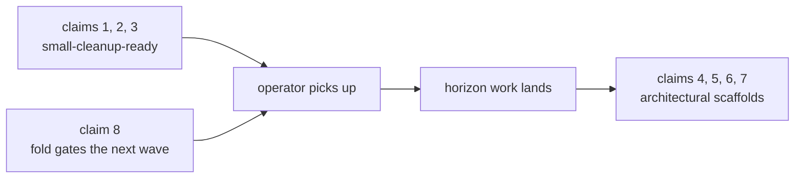

; spirit
[falsifiable-specs operator-271 nota-next schema-next spirit-next spirit-fold worktree-method designer-loop]
[Designer sub-agent dispatch: eight falsifiable Nix-and-cargo-test
spec witnesses for the open claims in operator/271 §"Still
Unaddressed". Each test names the end-state operator must implement;
each is red today and green when implemented. Lands on feature
branches in four repos under ~/wt; all four branches pushed.]
2026-06-01
designer

# 451 — Operator-271 open claims: falsifiable specs on feature branches

## TL;DR

**Eight falsifiable-spec witnesses written; four repos touched; four
branches pushed.** One branch per repo, all named
`falsifiable-specs-271-open-claims`. The spec witnesses are RED today
and turn GREEN when operator implements the spec — they make the
"still unaddressed" backlog from operator/271 §"Still Unaddressed"
mechanically falsifiable.

| Claim | Repo | Shape | State today |
|---|---|---|---|
| 1 — parser discipline pair | `nota-next` | precise | red (target methods missing) |
| 2 — CLI source helper | `nota-next` + `spirit-next` | precise | red (helper + consumer-side missing) |
| 3 — SchemaError Display | `schema-next` | precise | red (Debug fallback live) |
| 4 — schema-core extraction | `schema-next` + `spirit-next` | scaffold | red (crate not created) |
| 5 — SemaStore<T> substrate | `schema-next` | scaffold | red (types not created) |
| 6 — emitted variant projections | `spirit-next` | scaffold | red (projections hand-written) |
| 7 — Upgrade-as-SEMA | `schema-next` | scaffold | red (SchemaEdit + apply_edit missing) |
| 8 — Spirit fold | `spirit-next` + `spirit` | scaffold + filesystem | red (fold not landed) |

Three claims (1, 2, 3) are **precise** spec tests against named call
sites — operator can pick them up immediately and they're small
single-PR cleanups. Five claims (4, 5, 6, 7, 8) are **scaffold**
tests that compile-fail today because they reference end-state types
or repos that don't exist yet — these queue behind the architectural
horizon work in designer 444 §5 + designer 446 + designer 447. The
scaffolding marks the shape so operator can see what "done" means
without re-reading the design reports.

## Why this dispatch — establishing the designer sub-agent pattern

Per the orchestrator's frame: this sub-agent dispatch establishes the
**designer sub-agent pattern** — work on the most-recent main of
relevant repos via `~/wt` worktrees, land the design's spec as actual
code tests on feature branches, push for operator pickup. The
falsifiable-spec test makes the spec executable: operator implements
until the test goes green; no ambiguity about what "done" means.

Per `skills/designer.md` §"Specify by example, not by prose" + per
`skills/architectural-truth-tests.md` §"The principle": the test
**witness** is what makes a design assertion falsifiable. The eight
witnesses below each name (a) the source-code location currently in
violation, (b) the structural artifact that proves implementation, (c)
the Nix-derivation check that runs without depending on the build
toolchain when the crate fails to compile.

## Method

### Mandatory readings

1. `reports/operator/271-context-maintenance-current-state-2026-06-01.md` — source.
2. `AGENTS.md` — hard overrides.
3. `skills/architectural-truth-tests.md` — full file; witness design.
4. `skills/feature-development.md` — worktree convention.
5. `skills/designer.md` §"Working with operator" + §"Specify by example, not by prose".
6. `reports/designer/444-stack-vision-2026-05-31/5-overview.md` §"Open horizons" — horizons 1, 2, 3, 4.
7. `reports/designer/445-next-stack-audit-2026-06-01.md` — Findings 1-4 covering claims 1-3.
8. `reports/designer/447-upgrade-as-sema-design-2026-06-01.md` — claim 7's spec.
9. `reports/designer/446-next-stack-porting-research-2026-06-01/4-overview.md` — claim 8's spec.
10. Live source — `nota-next/src/parser.rs:972-999`, `schema-next/src/engine.rs:185-189`,
    `schema-next/src/asschema.rs`, `spirit-next/src/bin/spirit-next.rs:42-49`,
    `spirit-next/src/engine.rs:374-392`, `spirit-next/src/nexus.rs:100-155`,
    `spirit-next/src/schema/lib.rs:1034 + 1157 + 1172` (the OriginRoute / MessageSent /
    MessageProcessed declarations).

### Worktree creation

Four worktrees from `origin/main` on each repo:

```sh
mkdir -p ~/wt/github.com/LiGoldragon/<repo>/
cd /git/github.com/LiGoldragon/<repo>
git fetch origin
git worktree add ~/wt/github.com/LiGoldragon/<repo>/falsifiable-specs-271-open-claims \
    origin/main -b falsifiable-specs-271-open-claims
```

The canonical ghq checkouts stay on `main`; each worktree is its own
working copy independent of any operator activity.

### Test classification

Each witness is one of three shapes:

| Shape | Used for | Example |
|---|---|---|
| **AST-static (Nix grep)** | Witness on raw source that compiles or fails to compile downstream | `falsifiable-specs-271-static` in each flake — runs the grep witnesses without the build toolchain |
| **Compile-time (cargo test)** | Witness on type identity / method existence / public API surface | `tests/falsifiable_specs_271.rs` — the test compiles only once operator creates the named types and methods |
| **Runtime (cargo test)** | Witness on behavior (Display NOT delegating to Debug, NotaSource round-trip) | Same test file — runtime assertions inside `#[test]` functions |

Tests are gated behind a `falsifiable-specs-271` cargo feature so the
default `cargo test` invocation keeps compiling; the Nix check at
`falsifiable-specs-271-static` runs always (greps don't need the build
toolchain) and the `falsifiable-specs-271` cargo-test check runs with
the feature enabled.

## Per-claim section

### Claim 1 — `nota-next` parser discipline pair

**Source.** operator/271 §"Still Unaddressed" item 1; designer/445
Findings 1 + 2.

**Spec.** Two related cleanups in `nota-next/src/parser.rs`:
(1a) the free function `fn opening_starts_declaration(name: &str,
opening: char) -> bool` at parser.rs:972 moves onto `Atom` as the
inherent method `leads_declaration_at_opening(&self, opening: char) ->
bool`; (1b) the one-impl trait `trait AtBindingOpening` at
parser.rs:983 disappears and `with_source_closing(self, opening: char)
-> (Self, char)` becomes an inherent method on `Delimiter`.

**Witness — compile-time + AST-static:**

```rust
// tests/falsifiable_specs_271.rs (excerpt)
#[test]
fn atom_leads_declaration_at_opening_required_by_design() {
    let document = nota_next::Document::parse("(Entry [x])")
        .expect("inline NOTA parses for the fixture");
    let head_atom = first_atom(&document).expect("fixture has an atom");

    assert!(head_atom.leads_declaration_at_opening('['));
    assert!(!head_atom.leads_declaration_at_opening('('));
}

#[test]
fn delimiter_with_source_closing_required_by_design_as_inherent_method() {
    let delimiter = Delimiter::Bracket;
    let (returned, closing) = delimiter.with_source_closing('[');
    assert_eq!(returned, Delimiter::Bracket);
    assert_eq!(closing, ']');
}
```

**Why it fails today.** `Atom::leads_declaration_at_opening` doesn't
exist; the verb is a free function. `Delimiter::with_source_closing`
exists but only as the trait `AtBindingOpening` method — calling it
without importing the trait fails compilation.

**Why it passes when implemented.** Operator moves the verbs onto
their owning nouns per designer/445 Findings 1 + 2; the calls compile
and the runtime assertions hold.

**Where it lives.** `nota-next` branch
`falsifiable-specs-271-open-claims`, commit `7c25e1d`. The flake's
`falsifiable-specs-271-static` check is the no-build-toolchain
witness; the `falsifiable-specs-271` cargo-test check is the
build-toolchain witness.

### Claim 2 — CLI inline-vs-path NOTA source helper

**Source.** operator/271 §"Still Unaddressed" item 2; designer/444 §5
horizon item 5; designer/445 Finding 3.

**Spec.** Two locations: (2-helper) nota-next exposes
`NotaSource::from_cli_argument(argument: &str) -> Result<NotaSource,
NotaSourceError>` plus the typed `NotaSourceError` error enum;
(2-consumer) the spirit-next CLI binary at
`src/bin/spirit-next.rs:42` calls through this helper instead of the
local `.starts_with('(')` check.

**Witness — compile-time + runtime + AST-static (2 repos):**

```rust
// nota-next tests/falsifiable_specs_271.rs (excerpt)
#[test]
fn nota_source_from_cli_argument_required_by_design_for_inline_record() {
    let argument = "(Record (workspace Decision [topic body] Maximum))";
    let source = NotaSource::from_cli_argument(argument)
        .expect("inline NOTA argument must produce a NotaSource");
    assert!(source.as_str().contains("workspace"));
}

#[test]
fn nota_source_from_cli_argument_returns_typed_error_required_by_design() {
    let result: Result<NotaSource, nota_next::NotaSourceError> =
        NotaSource::from_cli_argument("");
    assert!(result.is_err());
}
```

Plus the spirit-next-side flake grep:

```
if grep -R -n -E "starts_with\\('\\('\\)" ${src}/src/bin; then
  echo "claim 2 (operator/271): spirit-next CLI still uses .starts_with('(') heuristic" >&2
  exit 1
fi
grep -R -n -E 'NotaSource::from_cli_argument' ${src}/src/bin/spirit-next.rs >/dev/null \
  || { echo "claim 2 (operator/271): spirit-next CLI should call NotaSource::from_cli_argument" >&2; exit 1; }
```

**Why it fails today.** `NotaSource::from_cli_argument` does not
exist; `NotaSourceError` does not exist; spirit-next still has
`.starts_with('(')`.

**Why it passes when implemented.** Operator adds the helper to
`nota-next/src/codec.rs` per designer/445 Finding 3 + designer/444 §5
horizon 5; spirit-next CLI delegates.

**Where it lives.** `nota-next` commit `7c25e1d` (helper + error
type); `spirit-next` commit `36bbf0d` (consumer-side grep + compile-
time witness).

### Claim 3 — `SchemaError` Display fallback

**Source.** operator/271 §"Still Unaddressed" item 3; designer/445
Finding 4.

**Spec.** `impl std::fmt::Display for SchemaError` at
`schema-next/src/engine.rs:185-189` stops delegating to Debug
(`write!(formatter, "{self:?}")`). The replacement is a real `match
self` body with a human-readable sentence per variant.

**Witness — runtime + AST-static:**

```rust
// schema-next tests/falsifiable_specs_271.rs (excerpt)
#[test]
fn schema_error_display_required_by_design_not_debug_fallback() {
    let error = SchemaError::MissingAsschema {
        key: String::from("workspace::spirit"),
    };
    let displayed = format!("{error}");

    assert!(!displayed.contains("MissingAsschema { key:"));
    assert!(!displayed.contains("{ "));
    assert!(displayed.contains("workspace::spirit"));
}
```

Plus a flake grep that asserts the Display impl contains `match self
` (a real Display body matches on self; the Debug fallback does not).

**Why it fails today.** The fallback prints `MissingAsschema { key:
"workspace::spirit" }` which contains the Rust struct brace syntax
the assertion rejects.

**Why it passes when implemented.** Operator writes the per-variant
match arms per designer/445 Finding 4.

**Where it lives.** `schema-next` branch
`falsifiable-specs-271-open-claims`, commit `bfe38db`.

### Claim 4 — Schema-core extraction

**Source.** operator/271 §"Still Unaddressed" item 4; designer/444 §5
horizon 1; designer/443 #1; operator/265 Gap 1.

**Spec.** A `schema-core` crate exists in the workspace; spirit-next
depends on it for the envelope substrate (`MessageSent`,
`MessageProcessed`, `OriginRoute`, `MailLedgerHook`); spirit-next's
`src/schema/lib.rs` no longer hand-emits versions of those four
types.

**Witness — scaffold (compile-fail + flake-static, 2 repos):**

```rust
// schema-next tests/falsifiable_specs_271.rs (excerpt)
#[test]
fn schema_core_crate_exists_required_by_design() {
    use schema_core::{MailLedgerHook, MessageProcessed, MessageSent, OriginRoute};

    let _ = std::marker::PhantomData::<MessageSent>;
    let _ = std::marker::PhantomData::<MessageProcessed<()>>;
    let _ = std::marker::PhantomData::<OriginRoute>;
    let _ = std::marker::PhantomData::<MailLedgerHook>;
}
```

Plus spirit-next-side negative-presence sweeps:

```
if grep -R -n -E '^pub struct MessageSent ' ${src}/src/schema/lib.rs; then
  echo "claim 4: MessageSent still hand-emitted locally" >&2
  exit 1
fi
```

**Why it fails today.** The `schema_core` crate doesn't exist —
`use schema_core::...` fails compilation. Spirit-next's schema/lib.rs
hand-emits `MessageSent` at line 1157, `MessageProcessed<Reply>` at
line 1172, `OriginRoute(pub Integer)` at line 1034.

**Why it passes when implemented.** Operator (per designer/446 Phase
1b/1c after Phase 0 + 1a teach the abstraction) creates `schema-core`
with the four envelope types, schema-rust-next emits `use
schema_core::*` instead of hand-emitting, and spirit-next imports
from there.

**SCAFFOLD-ONLY.** Operator picks this up only AFTER the spirit fold
(claim 8) and at least one wave-1 port lands per designer/446 — the
extraction is best designed from TWO observed patterns.

**Where it lives.** `schema-next` commit `bfe38db` (schema-core
import scaffold); `spirit-next` commit `36bbf0d` (consumer-side
negative-presence sweep).

### Claim 5 — Generic `SemaStore<T>` + `SerializableArtifact<T>` substrate

**Source.** operator/271 §"Still Unaddressed" item 5; designer/444 §5
horizon 2.

**Spec.** Generic `SemaStore<T>` + `SerializableArtifact<T>` types
exist in `schema-next` (or a future `sema-storage` crate); existing
concrete stores (`AsschemaStore`, `Store`) factor through them.

**Witness — scaffold (compile-fail):**

```rust
// schema-next tests/falsifiable_specs_271.rs (excerpt)
#[test]
fn sema_store_substrate_exists_required_by_design() {
    use schema_next::{SemaStore, SerializableArtifact};

    let _ = std::marker::PhantomData::<SemaStore<schema_next::Asschema>>;
    let _ = std::marker::PhantomData::<SerializableArtifact<schema_next::Asschema>>;
}
```

**Why it fails today.** Neither generic exists.

**Why it passes when implemented.** Operator extracts the generics
per designer/444 §5 horizon 2, after a second store and a second
artifact owner make the abstraction shape stable.

**SCAFFOLD-ONLY.** Queued behind schema-core extraction (claim 4)
which gives the substrate-floor home.

**Where it lives.** `schema-next` commit `bfe38db`.

### Claim 6 — Schema-emitted variant projections

**Source.** operator/271 §"Still Unaddressed" item 6; designer/444 §5
horizon 4.

**Spec.** The projection methods `into_signal_output`,
`into_nexus_input`, `from_mail` are emitted by `schema-rust-next`
into `src/schema/lib.rs` rather than hand-written in `engine.rs`
(lines 375 + 384) and `nexus.rs` (lines 109-122). Negative presence
in hand-written; positive presence in emitted.

**Witness — scaffold (flake-static, mostly negative-presence):**

```
if grep -R -n -E 'pub fn into_signal_output\(' ${src}/src/engine.rs; then
  echo "claim 6: into_signal_output still hand-written in engine.rs" >&2
  exit 1
fi
if grep -R -n -E 'fn from_mail\(' ${src}/src/nexus.rs; then
  echo "claim 6: from_mail still hand-written in nexus.rs" >&2
  exit 1
fi
grep -R -n -E 'pub fn into_signal_output' ${src}/src/schema/lib.rs >/dev/null \
  || { echo "claim 6: into_signal_output should be emitted into src/schema/lib.rs" >&2; exit 1; }
```

**Why it fails today.** `ValidationError::into_signal_output` at
engine.rs:375 + `SignalRejected::into_signal_output` at engine.rs:384
+ `FromMail::from_mail` at nexus.rs:109-122 are all hand-written.
Spirit-next's lib.rs already carries the partial emitted projection
(into_nexus_input at line 1330, into_signal_output at line 1365) so
the positive-presence half is partially satisfied — the SPEC says ALL
hand-written ones move to the emitted module.

**Why it passes when implemented.** Operator (per designer/444 §5
horizon 4) makes schema-rust-next emit the remaining projections; the
hand-written copies disappear.

**SCAFFOLD-ONLY.** Falls out of schema-rust-next emitter changes; ~120
lines per designer/443.

**Where it lives.** `spirit-next` commit `36bbf0d`.

### Claim 7 — Upgrade-as-SEMA implementation

**Source.** operator/271 §"Still Unaddressed" item 7; designer/447
§"Operator-bead-shaped first action".

**Spec.** Three parts: (7a) `SchemaEdit` enum exists with variants
`AddField`, `ChangeFieldType`, `AddVariant`; (7b)
`Asschema::apply_edit(&SchemaEdit) -> Result<Asschema, SchemaError>`
method exists; (7c) the canonical Spirit 1313 example
`(ChangeFieldType Entry topic (Vec Topic) WrapSingleton)` decodes via
the NOTA codec into the corresponding `SchemaEdit` variant.

**Witness — scaffold (compile-fail + NOTA round-trip):**

```rust
// schema-next tests/falsifiable_specs_271.rs (excerpt)
#[test]
fn schema_edit_enum_exists_required_by_design() {
    use schema_next::{FieldMigration, FieldName, SchemaEdit, TypeName};

    let _ = SchemaEdit::AddField;
    let _ = SchemaEdit::ChangeFieldType;
    let _ = SchemaEdit::AddVariant;
}

#[test]
fn schema_edit_nota_round_trip_required_by_design() {
    use nota_next::NotaSource;
    use schema_next::SchemaEdit;

    let source = NotaSource::new("(ChangeFieldType Entry topic (Vec Topic) WrapSingleton)");
    let edit: SchemaEdit = source.parse::<SchemaEdit>()
        .expect("designer/447 Spirit 1313 example decodes into SchemaEdit");
    let _ = matches!(edit, SchemaEdit::ChangeFieldType);
}
```

**Why it fails today.** `SchemaEdit`, `FieldMigration`, `FieldName`,
`TypeName`, and `Asschema::apply_edit` all don't exist.

**Why it passes when implemented.** Operator authors the typed shape
per designer/447 §"Block 1" + §"Block 2" + the codec wiring; the
Spirit 1313 NOTA example round-trips.

**SCAFFOLD-ONLY for the migration emitter + upgrade-daemon pipeline.**
Designer/447 §"Operator-bead-shaped first action" steps 5-7
(MigrationEmitter, daemon binary, upgrade-daemon coordination) are
EXPLICITLY deferred to later operator slices; this spec only carries
the type-level scaffolding for step 4 (`Asschema::apply_edit`) and the
NOTA-decode minimum-closure of step 2 (`SchemaEdit` enum).

**Where it lives.** `schema-next` commit `bfe38db`.

### Claim 8 — Spirit fold and broader porting

**Source.** operator/271 §"Still Unaddressed" item 8;
designer/446 Phase 0.

**Spec.** Post-fold, the canonical `spirit` repo (NOT `spirit-next`)
carries:
- the schema substrate: `schema/lib.schema`, `schema/lib.asschema`,
  `build.rs`, `src/schema/lib.rs`
- the runtime substrate: `src/engine.rs`, `src/nexus.rs`,
  `src/store.rs`, `src/transport.rs`
- the bin pair: `src/bin/cli.rs` + `src/bin/daemon.rs` (names
  flexible — `spirit-cli.rs` + `spirit-daemon.rs` also accepted)
- absence of the retired `signal_channel!` macro

Plus on the spirit-next side: an `ARCHIVED.md` marker pointing at
spirit; the runtime substrate gone from spirit-next/src.

**Witness — filesystem + flake-static (2 repos):**

```
# spirit/flake.nix excerpt
test -f ${src}/schema/lib.schema
test -f ${src}/build.rs
test -f ${src}/src/schema/lib.rs
grep -R -n -E '// @generated by schema-rust-next' ${src}/src/schema/lib.rs
test -f ${src}/src/engine.rs
test -f ${src}/src/nexus.rs
test -f ${src}/src/store.rs
test -f ${src}/src/transport.rs
```

```
# spirit-next/flake.nix excerpt
test -f ${src}/ARCHIVED.md
if test -f ${src}/src/engine.rs && grep -R -n -E '^pub struct Engine' ${src}/src/engine.rs; then
  echo "claim 8: spirit-next still owns Engine; should be folded into spirit" >&2
  exit 1
fi
```

**Why it fails today.** `spirit` repo is a scaffold from May 26 with
no schema substrate; spirit-next has all the substrate and no
ARCHIVED.md.

**Why it passes when implemented.** Operator runs designer/446 Phase
0 steps 1-5: move schema files, move runtime substrate, repoint
signal-spirit re-exports, run witness-test suite, retire spirit-next
with an ARCHIVED.md.

**SCAFFOLD-ONLY** until the spirit-triad naming question (designer/446
§"The one designer call that gates Phase 0") settles. The test
doesn't depend on the naming choice — both `signal-spirit` and the
proposed `meta-signal-spirit` paths land the same files.

**Where it lives.** `spirit-next` commit `36bbf0d` (retirement
witness); `spirit` commit `6e0f97d` (fold post-condition witness).

## Push log

| Repo | Branch | Commit | Push status |
|---|---|---|---|
| `nota-next` | `falsifiable-specs-271-open-claims` | `7c25e1d` | pushed; tracking origin |
| `schema-next` | `falsifiable-specs-271-open-claims` | `bfe38db` | pushed; tracking origin |
| `spirit-next` | `falsifiable-specs-271-open-claims` | `36bbf0d` | pushed; tracking origin |
| `spirit` | `falsifiable-specs-271-open-claims` | `6e0f97d` | pushed; tracking origin |

Each push reported the GitHub PR-creation URL; the PRs are NOT opened
— operator picks them up as beads, not PRs.

## Pattern observed — small-cleanup vs architectural-scaffold



**Three small-cleanup-ready (claims 1, 2, 3).** Precise tests against
named call sites. Operator can land all three in a single slice; each
is one-file or two-file scope. None depends on any horizon work. The
tests pin the end-state exactly — no design ambiguity remains.

**Four architectural scaffolds (claims 4, 5, 6, 7).** Compile-fail
tests that name types or crates that don't exist yet. Operator
shouldn't pick these up until the horizon work (designer/444 §5 + 446)
shapes them properly:
- Claim 4 (schema-core) wants TWO observed patterns first — the spirit
  fold + a wave-1 port.
- Claim 5 (SemaStore<T>) is best timed after schema-core lands so the
  substrate has a home.
- Claim 6 (variant projections) is mechanical but needs the schema-
  rust-next emitter changes that come with schema-core extraction.
- Claim 7 (Upgrade-as-SEMA) per designer/447 §"How designer 444 §5
  horizons interact" depends on H1 (schema-core) + H4 (variant
  projections) for clean emission; the type-level scaffolding can land
  earlier, but the full migration pipeline waits.

**One Phase-0 gate (claim 8).** The spirit fold blocks the wave-1
ports. The post-conditions are filesystem-level so the Nix witness is
substrate-independent.

## For the orchestrator

Operator can pick up from these branches in two waves.

**Wave 1 — small cleanups, parallelizable, single PR each.**

| Branch | Repo | Steps |
|---|---|---|
| `falsifiable-specs-271-open-claims` | `nota-next` | (a) Move `opening_starts_declaration` onto `Atom::leads_declaration_at_opening`; update callsite at parser.rs:711. (b) Drop `trait AtBindingOpening`; move `with_source_closing` into `impl Delimiter`. (c) Add `NotaSource::from_cli_argument` + `NotaSourceError` to codec.rs and re-export from lib.rs. Run `cargo test --features falsifiable-specs-271`. |
| `falsifiable-specs-271-open-claims` | `schema-next` | Replace SchemaError Display body at engine.rs:185-189 with a `match self` arm per variant. |
| `falsifiable-specs-271-open-claims` | `spirit-next` | Update bin/spirit-next.rs to call `NotaSource::from_cli_argument` (after the nota-next claim 2 helper lands). |

The three branches above are independent; three operator windows can
pick them up in parallel. Each is a single small commit.

**Wave 2 — architectural; queue behind designer/446 Phase 0 + 1a.**

The remaining four scaffold tests stay red until the horizon work in
designer/446 + 447 lands. They mark "what done means" so operator
doesn't need to re-read the horizon reports to know the shape; the
test names are the spec.

**Recommended sequencing.**

1. Operator picks up Wave 1 immediately (small cleanups, no design
   dependencies).
2. Psyche call: resolve the spirit-triad naming question per
   designer/446 §"The one designer call that gates Phase 0".
3. Operator picks up claim 8 (spirit fold) per designer/446 Phase 0;
   the `spirit` branch's filesystem witnesses guide the file moves.
4. Operator runs the wave-1 trio (cloud / upgrade / repository-ledger)
   per designer/446 Phase 1a.
5. Designer authors the schema-core crate-split design (Phase 1b).
6. Operator extracts schema-core (claim 4, Phase 1c).
7. Operator extracts `SemaStore<T>` (claim 5) once schema-core has a
   home for it.
8. Operator finishes variant-projection emission (claim 6) as part of
   schema-rust-next changes.
9. Operator implements Upgrade-as-SEMA Slice 1 (claim 7, type-level
   scaffolding) per designer/447 §"Operator-bead-shaped first
   action".

## Cross-references

Mandatory readings (used in this dispatch):

- `reports/operator/271-context-maintenance-current-state-2026-06-01.md`
- `AGENTS.md` (hard overrides: NOTA argument rule, method-only rule, no jj editor, designer authority)
- `skills/architectural-truth-tests.md` §"The principle" + §"Witness catalogue" + §"Rule of thumb"
- `skills/feature-development.md` §"Creating a worktree"
- `skills/designer.md` §"Working with operator" + §"Specify by example, not by prose"
- `reports/designer/444-stack-vision-2026-05-31/5-overview.md` §"Open horizons"
- `reports/designer/445-next-stack-audit-2026-06-01.md` Findings 1-4
- `reports/designer/446-next-stack-porting-research-2026-06-01/4-overview.md`
- `reports/designer/447-upgrade-as-sema-design-2026-06-01.md`

Live source (read for source-line precision):

- `nota-next/src/parser.rs:972-999` (free function + one-impl trait)
- `nota-next/src/lib.rs` (public surface)
- `nota-next/src/codec.rs` (NotaSource home)
- `schema-next/src/engine.rs:50-160` (SchemaError variants) and 185-189 (Display fallback)
- `schema-next/src/asschema.rs` (Asschema noun; future `apply_edit` home)
- `schema-next/src/lib.rs` (public surface; future `SchemaEdit` re-export)
- `spirit-next/src/bin/spirit-next.rs:5-50` (CLI source helper)
- `spirit-next/src/engine.rs:374-392` (hand-written `into_signal_output`)
- `spirit-next/src/nexus.rs:100-155` (hand-written `from_mail` + `run_sema`)
- `spirit-next/src/schema/lib.rs:1034 + 1157 + 1172 + 1330 + 1365` (emitted envelope + projections)
- `spirit/src/lib.rs` (scaffold; folds happen here)

Commits landed:

| Branch | Commit | Files touched | Lines added |
|---|---|---|---|
| `nota-next/falsifiable-specs-271-open-claims` | `7c25e1d` | Cargo.toml, flake.nix, tests/falsifiable_specs_271.rs | 268 |
| `schema-next/falsifiable-specs-271-open-claims` | `bfe38db` | Cargo.toml, flake.nix, tests/falsifiable_specs_271.rs | 381 |
| `spirit-next/falsifiable-specs-271-open-claims` | `36bbf0d` | Cargo.toml, flake.nix, tests/falsifiable_specs_271.rs | 293 |
| `spirit/falsifiable-specs-271-open-claims` | `6e0f97d` | flake.nix | 49 |

## What this dispatch establishes

The designer sub-agent pattern: design lands as **code on a feature
branch in `~/wt`**, pushed for operator pickup. The falsifiable-spec
test is the contract. Operator runs `nix flake check` or `cargo test
--features falsifiable-specs-271` and sees what's still red; landing
the implementation makes the test green. There is no prose-to-code
translation step where the contract can drift; the test IS the
contract.

The dispatch also demonstrates the **scaffold-vs-precise**
distinction: not every spec is small-cleanup-ready, and scaffold tests
that compile-fail today are a legitimate first-class shape. They mark
where the design points without forcing operator to implement before
the horizon work shapes the substrate.
