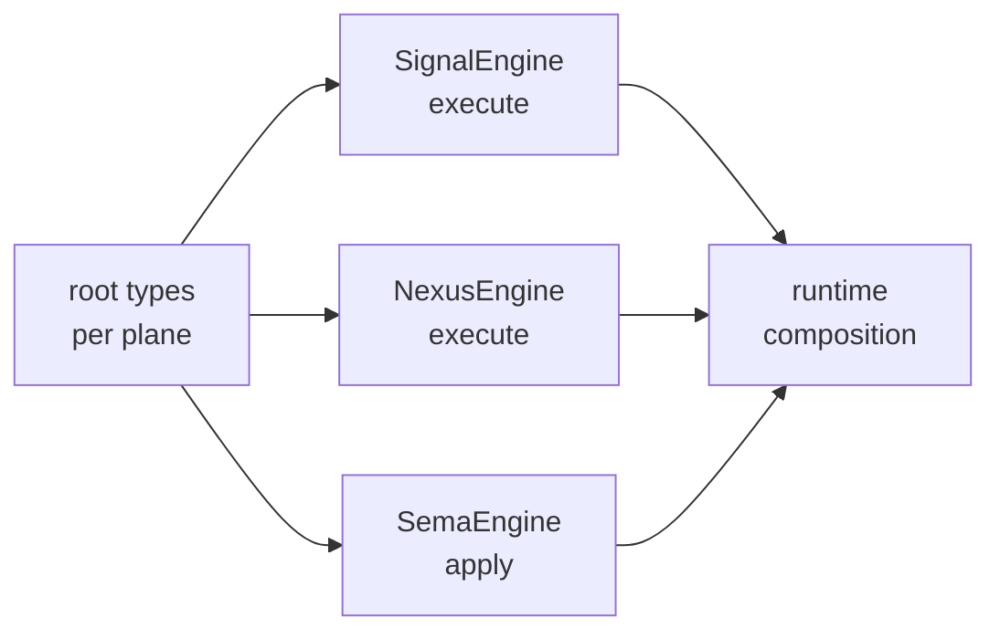

; spirit
[engine-trait-pattern broad-triad-adaptation signal-engine schema-emitted root-type-pipeline component-runtime]
[Designer adaptation of Spirit 1326 (spirit-engine-specific) and 1327 (workspace-wide Principle Maximum) to the broad component-triad architecture. Every component runtime defines its Signal/Nexus/SEMA interfaces in schema and conducts core logic through schema-emitted traits whose methods take and return root types of the concerned interfaces. The trait surface is uniform across components; each component is a composition of trait implementations.]
2026-06-01
designer

# 453 — Engine trait pattern as broad-triad adaptation

## TL;DR

Spirit 1326 (Constraint High, operator-addressed): the spirit engine defines and uses Signal/Nexus/SEMA interfaces in schema and conducts core logic through traits taking + returning root types. Spirit 1327 (Principle Maximum, designer-captured per the psyche's "adapt to the broad triad architecture" directive): the same shape generalizes to **every component triad** in the workspace. Every daemon's runtime is a composition of three schema-emitted engine traits — `SignalEngine`, `NexusEngine`, `SemaEngine` — whose methods take and return the plane's root types. The trait surface is uniform across components; the runtime is hand-written behavior attached to schema-emitted nouns through trait impls. The pattern lives at workspace level, not at any single component.

Today spirit-next has TWO of three engines schema-emitted (`NexusEngine`, `SemaEngine` at `src/schema/lib.rs:1431-1437`); `SignalEngine` is the gap. This report names the gap, sketches the uniform trait signature, and walks the implications for designer 444 §5 horizons + designer 446 porting + designer 447 schema-daemon.

## The captured intent

> **Spirit 1326 (Constraint, High, operator-addressed)**: *"The spirit engine must define and use Signal, Nexus, and SEMA interfaces defined in schema, and its core logic must be conducted through traits whose methods take and return the root types of the concerned interfaces."*

> **Spirit 1327 (Principle, Maximum, designer-captured per psyche's "adapt to broad triad")**: *"Every component engine in the workspace triad architecture defines and uses its Signal, Nexus, and SEMA interfaces in schema, and conducts core logic through schema-emitted traits whose methods take and return root types of the concerned interfaces — adapting Spirit 1326 (spirit-engine-specific) to the workspace-wide component-triad pattern. The trait surface is uniform across components; each component's runtime is a composition of schema-emitted trait implementations."*

The two records compose: 1326 names the spirit-specific constraint; 1327 lifts it to workspace pattern. The adaptation work — what this report covers — is what living up to 1327 across the fleet means in concrete terms.

## Current state in spirit-next

Two schema-emitted engine traits exist in `spirit-next/src/schema/lib.rs:1431-1437`:

```rust
pub trait NexusEngine {
    fn execute(&self, input: nexus::Nexus<nexus::Input>) -> nexus::Nexus<nexus::Output>;
}

pub trait SemaEngine {
    fn apply(&mut self, input: sema::Sema<sema::Input>) -> sema::Sema<sema::Output>;
}
```

Both follow the principle: take a plane root-type, return a plane root-type. The implementations:

- `Nexus` impls `NexusEngine` at `spirit-next/src/nexus.rs:193` — Nexus is hand-written runtime behavior attached to the schema-emitted Nexus envelope.
- `Store` impls `SemaEngine` at `spirit-next/src/store.rs:34` — Store is the hand-written redb-backed SEMA writer attached to the schema-emitted Sema envelope.

The `Engine` composer at `spirit-next/src/engine.rs:56` is what threads these together. It is NOT a trait — it composes the three engines through SignalActor + Nexus + Store.

### The gap — `SignalEngine` does not exist as schema-emitted

The Signal plane today is a hand-written admission flow: `SignalActor::accept(input: Input) -> Result<SignalAccepted, SignalRejected>` at `spirit-next/src/engine.rs:114-145`. No trait. The Engine composer calls `signal_actor.accept(...)` then dispatches to `Nexus::process`. The core logic crosses Signal → Nexus through hand-written method calls on schema-emitted nouns, not through a schema-emitted trait.

Two of three engines satisfy Spirit 1326's "core logic through traits taking/returning root types" rule; the third does not. The principle (1327) requires the third to be added with the same uniform shape.

### The principled signature

Naming `SignalEngine` to match the pair:

```rust
pub trait SignalEngine {
    fn execute(&mut self, input: signal::Signal<signal::Input>) -> signal::Signal<signal::Output>;
}
```

The admission step (validation + identity-stamp + Nexus handoff + reply assembly) becomes internal to `execute`. The trait surface stays clean: root-type-in, root-type-out. The runtime's `Engine` composer becomes a composition of three trait calls instead of two-trait-calls-plus-a-hand-written-method.

This shape generalizes uniformly across the three planes. The principle is: **one trait per plane; one method per trait; method takes and returns the plane's root type.**

## Trait shape — the uniform pattern



Five nodes; honors Spirit 1282. The composition reads: each plane has a root-type envelope (`Signal<...>`, `Nexus<...>`, `Sema<...>`), each envelope is the trait method's input AND output type, each plane's behavior is one trait impl, and the component's runtime is the composition.

### Method naming — `execute` vs `apply`

The two existing traits use different verbs: `NexusEngine::execute` and `SemaEngine::apply`. The semantic distinction is real:

- **SEMA** has effect — it mutates durable state. `apply` carries the "this writes something" connotation.
- **Nexus + Signal** are translation/admission planes — `execute` carries the "this is a stateless transform" connotation.

The split is honest. Keeping it preserves the distinction at the trait surface; collapsing to one verb would erase a meaningful difference. Recommend: `SignalEngine::execute` matching Nexus (admission is a transform with side-effect on identity counters but no DURABLE state effect); `SemaEngine::apply` stays.

### Mutability — `&self` vs `&mut self`

The current split:
- `NexusEngine::execute(&self, ...)` — Nexus is hand-written runtime; `&self` because the Nexus owns interior mutability (the `Mutex` around its mail-ledger and held mail).
- `SemaEngine::apply(&mut self, ...)` — Store is the redb writer; `&mut self` honors that mutation is the trait's purpose.

For Signal: admission writes the next-message-identifier counter (currently a `Mutex` interior). `&self` matches Nexus's pattern (interior mutability for runtime state); the trait method does not need `&mut`. **Recommend `&self`** for SignalEngine to match Nexus + because the underlying counters can be `Mutex<Integer>`.

The honest rule: `&mut self` only when the trait's CONTRACT requires durable-state mutation (SEMA). `&self` for transform-shaped planes (Signal, Nexus). This is a workspace-pattern decision worth carrying explicitly in the schema-emission rules.

## Generalization — every component triad

The principle in 1327 applies workspace-wide. Every component in `protocols/active-repositories.md` whose role includes "daemon" gets three trait impls. The instance-per-component:

| Component | SignalEngine impl | NexusEngine impl | SemaEngine impl |
|---|---|---|---|
| `spirit` (post-fold per designer 446) | New trait + impl on `SignalActor` | Existing `Nexus` impl | Existing `Store` impl |
| `schema-daemon` (per designer 447) | New trait + impl on admission actor | Translation between schema-edit + store ops | New `SchemaSemaEngine` over `AsschemaStore` |
| `upgrade-daemon` (per designer 447 + designer 446) | Admission for `RunPipeline` ops | Translation between pipeline + spawn coordination | The migration-test event log |
| `cloud-daemon` (per designer 446 Phase 1a) | Admission for provider ops | Translation between observation + plan ops | The provider-plan store |
| `mind`, `router`, `terminal`, `orchestrate`, etc. (designer 446 Phase 2) | Per-component admission | Per-component translation | Per-component durable state |

Each row is the same three-trait surface. The runtime crate per component imports the three trait definitions (likely from `schema-core` post-extraction per designer 444 §5 horizon 1), implements them with component-specific behavior, and composes via a runtime `Engine` struct that calls the three traits in sequence.

The benefit compounds: **cross-component dispatch becomes typed**. When mind needs to send a Signal frame to router, the type system can express "calling `router::SignalEngine::execute` with `router::signal::Input::SomeVariant`." Today's hand-written cross-component dispatch (router-sends-to-harness, mind-talks-to-orchestrate) becomes uniform trait-method calls once schema-core makes the trait identities cross-crate-stable.

## Schema-rust-next emission implications

The emitter needs to extend its `RustModule` data model (designer 444 §5 horizon 3 — RustModule-as-data completeness) to emit per-plane engine traits. Today schema-rust-next emits two of three (per the live `spirit-next/src/schema/lib.rs:1431-1437`). The missing piece: emit `SignalEngine` with the same uniform shape.

The emission rules per plane:
- Detect the `Input` / `Output` root types from the schema document's positional root structure (designer 444 §"data model" §"How the root carries plane identity").
- Emit `pub trait <Plane>Engine { fn <method-name>(&self|&mut self, input: <plane>::<Plane><<plane>::Input>) -> <plane>::<Plane><<plane>::Output>; }` per plane.
- The method name + mutability follow the workspace convention named above: Signal/Nexus = `execute` + `&self`; SEMA = `apply` + `&mut self`.
- A trait per plane, not a unified `ComponentEngine` trait — the three planes have different semantic contracts (transform vs durable mutation), and trying to unify them dilutes the per-plane invariant.

For the runtime crate's `lib.rs`, the trait imports become `use crate::schema::{SignalEngine, NexusEngine, SemaEngine}` or, post-schema-core, `use schema_core::{SignalEngine, NexusEngine, SemaEngine}` — with the per-plane root types substituted at the type parameter position (the traits become slightly more generic if cross-component dispatch is needed).

## Connection to designer 444 §5 horizons

### H1 schema-core extraction — where the trait definitions live

The trait definitions themselves are universal across components. They should NOT be re-emitted byte-identically into every component (designer 443 §"#1" measures ~470 lines per emitted component for this kind of substrate). Schema-core extraction lifts the trait definitions into one crate; each consumer's emitted module declares the per-plane root types AND `impl SignalEngine for MyActor { ... }` etc.

The trait surface in `schema-core` would be:

```rust
// schema-core/src/lib.rs (proposed; post-H1)
pub trait SignalEngine<Input, Output> {
    fn execute(&self, input: Signal<Input>) -> Signal<Output>;
}

pub trait NexusEngine<Input, Output> {
    fn execute(&self, input: Nexus<Input>) -> Nexus<Output>;
}

pub trait SemaEngine<Input, Output> {
    fn apply(&mut self, input: Sema<Input>) -> Sema<Output>;
}
```

The traits become generic over per-plane Input/Output types; each component's emitted module instantiates them. Cross-component dispatch types correctly: `router::SignalEngine<router::signal::Input, router::signal::Output>` and `mind::SignalEngine<mind::signal::Input, mind::signal::Output>` are different types but share the trait identity, so generic code over `T: SignalEngine<I, O>` is portable.

### H3 RustModule-as-data completeness — what the emitter holds

The trait declarations are `RustItem::TraitDecl` values in the emitter's typed model. The per-component `impl` blocks are `RustItem::ImplBlock` values. Once H3 lands, the emitter's catalog is typed end-to-end — trait emission becomes uniform data, not a hand-written code path.

### H4 schema-emitted variant projections — what the trait method bodies look like

The trait method implementations frequently DO cross-plane translation: `NexusInput::Signal(input)` → `nexus::Output::Sema(sema_input)` etc. These translations are variant projections (`From<SignalInput> for NexusOutput`, etc.). Today they're hand-written in `spirit-next/src/nexus.rs:105-154`. Once H4 emits the projections, the trait method bodies become THIN compositions of emitted projections.

The principle is enforced more cleanly post-H4: the trait method's `match` arms become `match input.into_root() { NexusInput::Signal(s) => s.into_sema_input(), ... }` where each variant arm calls an emitted `into_*` method. Hand-written runtime drops to admission + storage; the translation glue lifts.

## Connection to designer 447 schema-daemon

Designer 447's `SchemaSemaEngine` is THE second instance of `SemaEngine`:

```rust
// from designer 447 §"The four building blocks" §"Block 2 — The SchemaSemaEngine"
impl SemaEngine for SchemaSemaEngine {
    type Input = SchemaSemaInput;
    type Output = SchemaSemaOutput;

    fn apply(&mut self, input: Sema<SchemaSemaInput>) -> Sema<SchemaSemaOutput> {
        match input.into_root() {
            SchemaSemaInput::EditSchema(edit) => self.apply_edit(edit),
            SchemaSemaInput::ObserveSchema(query) => self.observe(&query),
            SchemaSemaInput::RemoveSchema(identity) => self.remove(identity),
        }
    }
}
```

Two `SemaEngine` impls now exist on paper: `Store` (spirit-next; records) and `SchemaSemaEngine` (schema-daemon; Asschemas). Per Spirit 1291 + designer 446 §"Why validate-recipe-first", this is the SECOND observation point schema-core extraction needs. Once schema-daemon's first slice lands (designer 447 §"Operator-bead-shaped first action"), the workspace has two `SemaEngine` impls in production code — the pattern's shared substrate is observable, not hypothetical.

Same for `SignalEngine` once spirit and schema-daemon both impl it: two-implementation evidence for the schema-core extraction's Signal-plane substrate.

## Connection to designer 446 Phase 0 fold

The spirit fold (designer 446 §"The recommended first slice") is the first place SignalEngine would land — as the fold operator-week adds the trait + impl on `SignalActor` per the cleanup of admission code. Recommended sequencing:

- **Phase 0a** (within the fold): add `SignalEngine` trait to spirit's emitted module; impl on `SignalActor`. One file change to `engine.rs`. ~30 lines of impl wrapping the existing `accept` flow.
- **Phase 0b** (within the fold): refactor `Engine::handle` to call `signal_engine.execute(input)` → `nexus_engine.execute(...)` → `sema_engine.apply(...)` composition. The composer becomes uniform.

Both within designer 446's "one operator-week" estimate. After the fold lands, every wave-1 port (cloud, upgrade, repository-ledger) inherits the three-trait shape as the canonical pattern.

## Open questions

Eight questions the audit-as-design surfaces:

1. **Signal admission asymmetry**: the `accept` semantic returns `Result<SignalAccepted, SignalRejected>` today — the typed REJECTION case is meaningful. Should `SignalEngine::execute` collapse rejections into `Signal<Output>::Rejected(...)` variants (uniform output), or keep a typed Result at the trait surface? Recommendation in this report: collapse into output variants (preserves uniform shape per 1327); operator-bead surfaces if it makes admission less ergonomic.

2. **Where the trait definitions LIVE pre-schema-core**: today they emit per-component in `src/schema/lib.rs`. Should `spirit` carry them locally during the fold + Phase 1a, then lift to schema-core in Phase 1c per designer 446's sequencing? Recommendation: yes — emit locally during Phase 0/1a, lift later. Sub-agent dispatched on this question if needed.

3. **Trait genericity at schema-core**: should the schema-core traits be generic over Input/Output (per the H1 sketch above) or non-generic and per-component re-export? Generic is more reusable; non-generic is more explicit. Open.

4. **Cross-component trait identity**: post-H1, can mind's runtime dispatch `Signal<router::Input>` through `router::SignalEngine` directly? Requires the emitted Input types to derive `Send + Sync` etc. — a build-time check, not a design call.

5. **`Sema<...>` vs `sema::Sema<...>` naming**: the existing trait uses `sema::Sema<sema::Input>` with module qualification. Post-schema-core, does the canonical `Sema` envelope come from schema-core or stay per-component? Affects import paths workspace-wide.

6. **Upgrade traits**: `UpgradeFrom` and `AcceptPrevious` at `spirit-next/src/schema/lib.rs:1439-1451` are already schema-emitted but not yet implemented. They are RELATED to the engine traits but distinct shape — they're version-transition traits, not plane-execute traits. Recommend keeping them separate.

7. **Subscription / streaming surface**: the current engine traits are request-reply shaped (one input → one output). Subscription / streaming is not yet expressed. Per `skills/push-not-pull.md` the workspace prefers subscriptions over polling. The trait surface may need a streaming variant: `SignalEngine::subscribe(&self, query: SubscriptionQuery) -> SubscriptionStream`. Defer to a follow-up designer report.

8. **Test harness**: how do tests stub out engine impls? Today spirit-next tests construct real `Nexus` + `Store`. Post-trait-everywhere, a `FakeSignalEngine` + `FakeNexusEngine` + `FakeSemaEngine` per component would let tests assert "the runtime called the engine with this root type, returned this output." Test-double substrate that would lift cleanly into schema-core. Defer to follow-up.

## Operator-bead-shaped first action

Per designer 446 §"Phase 0", the spirit fold is the next slice. This adaptation slots into it:

| Step | Action | Where |
|---|---|---|
| 1 | Add `pub trait SignalEngine { fn execute(&self, input: signal::Signal<signal::Input>) -> signal::Signal<signal::Output>; }` to the emitted module. | Schema-rust-next emitter change + regenerate `spirit/src/schema/lib.rs`. |
| 2 | `impl SignalEngine for SignalActor` wrapping the current `accept` flow; rejections collapse into `Signal<Output>::Rejected(...)`. | `spirit/src/engine.rs`. |
| 3 | Refactor `Engine::handle` to call `signal_engine.execute(input).into_nexus_input() → nexus_engine.execute(...) → sema_engine.apply(...)` composition. | `spirit/src/engine.rs`. |
| 4 | Witness test: assert all three traits exist; assert the composer calls each in order through their root-type signatures. Add as a `cargo test` + flake check. | `spirit/tests/engine_trait_composition.rs`. |

Estimated scope: 1-2 operator-days inside the fold-week. The witness test name: `runtime_engine_composes_three_schema_emitted_traits` per `skills/architectural-truth-tests.md` rule of thumb.

This action sits inside Phase 0 of designer 446. After Phase 0 lands, every wave-1 port (cloud, upgrade, repository-ledger) inherits the three-trait pattern as canonical.

## Implications summary

| Surface | Before | After this principle lands |
|---|---|---|
| spirit-next core logic | Two traits (Nexus, SEMA) + hand-written Signal admission | Three traits; runtime is uniform composition |
| Cross-component dispatch | Hand-written method calls per pair | Trait-method calls; type system carries plane identity |
| Schema-rust-next emission | Two engine traits per component | Three engine traits per component (uniform pattern) |
| Schema-core extraction | Trait DEFINITIONS would re-emit per component pre-H1 | Three traits lift to schema-core; per-component emits impls |
| Test surface | Real engines wired in tests | Test-doubles per plane substitute for unit tests |
| Future schema-daemon (designer 447) | One `SemaEngine` impl on paper | Joins the trait family; cross-pattern observable |
| Variant projections (H4) | Hand-written translations in `nexus.rs` | Emitted; trait method bodies become thin compositions |

## Cross-references

- Spirit records: 1326 (Constraint High, operator-addressed; spirit-engine-specific), 1327 (Principle Maximum, designer-captured per psyche broad-triad directive; the adaptation this report covers).
- `reports/designer/444-stack-vision-2026-05-31/5-overview.md` §"Open horizons" — H1 (schema-core extraction), H3 (RustModule-as-data), H4 (schema-emitted variant projections) all interact with this adaptation.
- `reports/designer/446-next-stack-porting-research-2026-06-01/4-overview.md` §"Phase 0" — the spirit fold is the canonical landing slice.
- `reports/designer/447-upgrade-as-sema-design-2026-06-01.md` §"The four building blocks" — `SchemaSemaEngine` is the second `SemaEngine` impl that gives the pattern its required two-observation evidence.
- `reports/designer/445-next-stack-audit-2026-06-01.md` §"What's clean" — confirms spirit-next runtime today honors method-only discipline; the trait extension preserves that.
- `protocols/active-repositories.md` — the component-triad inventory that defines the broad-triad surface.
- `AGENTS.md` §"Component triad means daemon + working signal + policy signal" — the triad shape this report adapts.
- `skills/component-triad.md` — full triad discipline.
- `skills/architectural-truth-tests.md` — the witness-test pattern (rule of thumb: `runtime_engine_composes_three_schema_emitted_traits`).
- `skills/push-not-pull.md` — referenced for the subscription / streaming open question.
- Live code: `spirit-next/src/schema/lib.rs:1431-1437` (existing NexusEngine + SemaEngine), `spirit-next/src/engine.rs:56-145` (Engine composer + SignalActor::accept), `spirit-next/src/nexus.rs:193` (Nexus impls NexusEngine), `spirit-next/src/store.rs:34` (Store impls SemaEngine), `spirit-next/src/schema/lib.rs:1439-1451` (UpgradeFrom + AcceptPrevious — related but separate).

## For the psyche

Operator's Spirit 1326 capture is clean and complete for the spirit-specific instruction. Your "adapt to the broad triad architecture" directive lifts the principle workspace-wide (captured as Spirit 1327 Principle Maximum). The adaptation: every component triad runtime gets three schema-emitted engine traits — `SignalEngine`, `NexusEngine`, `SemaEngine` — each method takes and returns its plane's root type; the runtime composes them. Spirit-next today has two of three (Nexus, SEMA); SignalEngine is the gap, easily added inside designer 446's Phase 0 spirit fold as a 1-2 operator-day slice. The pattern lifts to schema-core (H1) once two-or-more components implement it; pre-H1, traits emit per-component. The schema-daemon from designer 447 becomes the second `SemaEngine` impl, providing the validate-twice-then-extract evidence schema-core needs. Open questions in §"Open questions" cover: where to land typed rejections, trait genericity, subscription shape, test-double substrate. None blocking the Phase 0 work; all are follow-up designer reports as the pattern matures. **Three asks unchanged from prior rounds**: spirit-triad naming (gates Phase 0), bulk-bead-sweep authorization, five-cleanup-bead timing.
