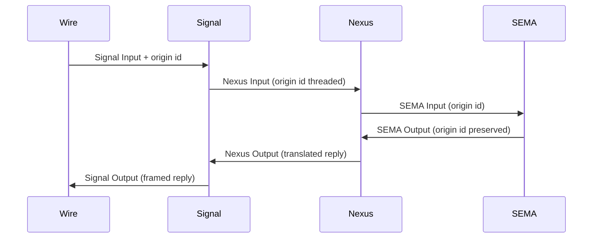

; spirit
[engine-role-refinement signal-triage nexus-computation sema-single-writer parallel-reads origin-identifier pipeline-shape]
[Designer refinement of 453 per Spirit 1330-1337. Signal engine is triage only; Nexus engine carries the heavy logic and is the bidirectional translator; SEMA engine is single-writer for durable state with parallel reads. The full request pipeline is Signal → Nexus → SEMA → Nexus → Signal with origin identifiers threading through. Trait surface refines to a read/write split on SemaEngine.]
2026-06-01
designer

# 454 — Engine role + pipeline refinement (refines 453)

## TL;DR

Designer 453 named the uniform three-trait shape (`SignalEngine`, `NexusEngine`, `SemaEngine`) per Spirit 1326 + 1327. This report refines what each engine **does** per Spirit 1330-1337:

- **Signal engine — triage only** (1330). Admission, dispatch, identity-stamping, validation, wire-frame handling. No heavy logic.
- **Nexus engine — the computation plane** (1331). Algorithms, decision-making, database queries, bidirectional translation between Signal and SEMA. Most of a component's work happens here.
- **SEMA engine — durable single-writer with parallel reads** (1332). Writes serialize through the writer actor; reads run concurrent against MVCC snapshots (redb supports this natively). Database upgrades flow through SEMA per Spirit 1308.
- **Interface direction** (1333). Signal → Nexus (one-way); Nexus → SEMA (down) AND Nexus → Signal (up, for replies). SEMA never calls back up directly — it returns to Nexus which decides.
- **Response shape is independent** (1334). SEMA's reply doesn't map 1:1 to Signal's reply. Nexus translates, filters, augments.
- **Pipeline shape** (1335). Signal triage → Nexus compute → SEMA op → Nexus receive → Nexus decide → Signal reply → wire.
- **Origin identifier protocol** (1336). Rolling identifiers thread through the whole pipeline; each layer routes responses back via origin id; SEMA can use it to associate partial multi-op replies.

The trait surface from 453 gets one substantive refinement: **`SemaEngine` splits into `apply` (writes, `&mut self`) + `observe` (reads, `&self`)** to honor the parallel-read invariant. Other shapes from 453 hold.

## The captured intent

Eight Spirit captures land this refinement:

| Record | Kind | Content |
|---|---|---|
| 1330 | Decision Maximum | Signal engine role is triage only |
| 1331 | Decision Maximum | Nexus engine carries the heavy logic |
| 1332 | Decision Maximum | SEMA is single-writer; reads run in parallel (MVCC) |
| 1333 | Decision Maximum | Interface direction; Nexus is bidirectional translator |
| 1334 | Decision Maximum | SEMA response shape doesn't map 1:1 to Signal response |
| 1335 | Decision Maximum | Full request pipeline shape with origin-id |
| 1336 | Decision Maximum | Origin/rolling-id is part of Signal protocol; threads through pipeline |
| 1337 | Clarification Medium | Brainstorm — Nexus input may embed original Signal message (not firm) |

These compose with 1326 (operator-addressed spirit-engine Constraint) + 1327 (designer-captured broad-triad Principle) into the engine-trait architecture covered in 453 + 454.

## The pipeline — sequence shape



Four participants; six message edges. Each edge carries the origin identifier. The Nexus layer is where the round-trip decision logic lives — it does NOT just forward; it consumes the SEMA reply, decides what to return upstream, and constructs the Nexus output.

## Role refinements per engine

### Signal — triage only

Signal handles:
- **Wire framing** — length-prefixed binary on the socket; route headers per `signal-core` discipline.
- **Identity-stamping** — assign message identifier + origin route per Spirit 1336.
- **Validation** — typed input rejection (`SignalRejection`) before any deeper layer sees the message.
- **Dispatch to Nexus** — convert validated Signal Input into Nexus Input; hand to Nexus engine.
- **Response framing** — receive Nexus Output, frame as Signal Output on the wire.

Signal does NOT:
- Run algorithms over data
- Make decisions about what to compute
- Query the database directly
- Mutate state

The trait surface from 453 stands as-is: `SignalEngine::execute(&self, Signal<Input>) -> Signal<Output>`. Validation rejections collapse into `Signal<Output>::Rejected(SignalRejection)` variants (the recommendation from 453 §"Open questions" §1 — confirmed here as the canonical shape per the triage-only principle).

### Nexus — the computation plane

Nexus handles:
- **Algorithm execution** over the Nexus input + any data fetched via SEMA reads.
- **Decision-making** — what SEMA ops to invoke, in what order, with what arguments.
- **Bidirectional translation** — Nexus knows both Signal and SEMA languages: it constructs SEMA Input from Nexus state + can construct Signal Output (as Nexus Output) from SEMA replies.
- **Origin-id routing** — when Nexus dispatches multiple SEMA ops (e.g. batch reads + a write), the origin id lets it correlate SEMA replies with the originating Nexus request.
- **Response composition** — collapse, filter, augment SEMA output into Nexus Output before returning up.

The trait surface from 453: `NexusEngine::execute(&self, Nexus<Input>) -> Nexus<Output>`. The method body internally invokes SEMA via the `SemaEngine` it holds (Nexus owns or has a handle to the SemaEngine).

### SEMA — durable single-writer with parallel reads

SEMA handles:
- **Single-writer mutations** — `Record`, `Remove`, schema-edit operations per Spirit 1308 — serialize through the writer actor; one transaction at a time.
- **Concurrent reads** — `Observe` operations against MVCC snapshots; multiple readers run in parallel without blocking the writer or each other.
- **Database upgrades** — per Spirit 1308, schema-edit operations are SEMA writes; upgrades flow through the writer path.
- **Origin-id preservation** — every reply carries the originating Nexus request's origin id (per Spirit 1336) so Nexus can route partial responses correctly.

SEMA does NOT:
- Make decisions about what data to compute
- Translate between planes (that's Nexus's job)
- Call upward into Nexus or Signal directly — it returns reply objects; Nexus picks them up.

The trait surface from 453 needs refinement. The single-method `apply(&mut self, ...)` forces reads through the writer path, which serializes them. The honest shape:

```rust
pub trait SemaEngine {
    fn apply(&mut self, input: sema::Sema<sema::Input::Write>) -> sema::Sema<sema::Output::WriteReply>;
    fn observe(&self, input: sema::Sema<sema::Input::Read>) -> sema::Sema<sema::Output::ReadReply>;
}
```

Two methods; the write method takes `&mut self` (serializes through the writer); the read method takes `&self` (concurrent across multiple callers). The Input/Output enums split into Write vs Read sub-types — schema-rust-next emits this naturally when the schema source declares them with explicit read-vs-write annotation.

### Alternative — keep one Input enum, route internally

If splitting Input is too heavy, the trait could keep the single Input enum and route internally:

```rust
pub trait SemaEngine {
    fn execute(&self, input: sema::Sema<sema::Input>) -> sema::Sema<sema::Output>;
}
```

Where `execute(&self, ...)` is `&self` (not `&mut`) and the impl internally:
- For Read variants: opens an MVCC read transaction
- For Write variants: routes through an internal `Mutex<WriteHandle>` or kameo write actor

This keeps the schema simpler (one Input enum, no Read/Write split at the schema layer) but pushes the write-routing inside the impl. Concurrent reads work because `&self` allows many concurrent callers.

**Recommendation**: start with the split-trait shape (`apply` + `observe`) because it makes the read/write distinction type-system-enforced. If the per-component schema authoring proves awkward, fall back to the single-execute shape with internal routing. The split is the principled default; the single-method is the simplification.

## Origin identifier — the protocol surface

Per Spirit 1336, origin identifiers are part of the **Signal protocol** — they enter at the wire boundary and travel with the message through the whole pipeline.


Five nodes; honors Spirit 1282. The origin id is:

- **Minted at the wire boundary** — the client assigns it before sending the Signal Input; OR Signal admission assigns one if the client didn't.
- **Carried as a positional field on Signal Input** — every plane-typed envelope carries it.
- **Used by SEMA for partial-reply correlation** — when Nexus dispatches multi-op SEMA work, each SEMA reply carries the same origin id so Nexus knows which Nexus-request the SEMA-reply belongs to.
- **Used by Signal for client-reply routing** — when the wire response leaves, Signal frames the origin id back so the client correlates the async reply with its original request.

The current spirit-next implementation has `OriginRoute` and `MessageIdentifier` per `spirit-next/ARCHITECTURE.md` §"Runtime triad / Nexus". They serve the same purpose. Spirit 1336 confirms the design: these identifiers are protocol-level, not implementation-detail.

## The brainstormy embedding question (Spirit 1337)

Psyche brainstorm: "a Nexus message in one of, well, maybe not all of them, but probably most calls will include the Signal message that came in." Captured as Clarification Medium because it's hedged.

The design implications if it holds:
- Nexus Input variants carry an embedded `Signal<Input>` payload alongside their decision-relevant data.
- Nexus has access to the raw input it's deciding on, not just the decoded variant payload.
- Useful for auditing, logging, replay, and complex algorithm-level access to original framing.

If it doesn't hold universally:
- Most Nexus variants extract the relevant payload from Signal Input and discard the wrapper.
- A subset (probably error-handling, audit, or complex routing variants) carries the embedded original.

Operator-level audit during implementation will surface which pattern holds. The schema source can express both — a `signal_input: Option<Signal<Input>>` field on relevant Nexus variants is the natural shape. No design call needed today; the schema can accommodate either as the pattern emerges.

## Updated trait surface (refines 453)

The full triad post-refinement:

```rust
pub trait SignalEngine {
    fn execute(&self, input: signal::Signal<signal::Input>) -> signal::Signal<signal::Output>;
}

pub trait NexusEngine {
    fn execute(&self, input: nexus::Nexus<nexus::Input>) -> nexus::Nexus<nexus::Output>;
}

pub trait SemaEngine {
    fn apply(&mut self, input: sema::Sema<sema::Input::Write>) -> sema::Sema<sema::Output::WriteReply>;
    fn observe(&self, input: sema::Sema<sema::Input::Read>) -> sema::Sema<sema::Output::ReadReply>;
}
```

Three traits, four methods. Spirit 1326 + 1327's "core logic through traits taking + returning root types" holds for all four: each method's input is the plane root-type; each method's output is the plane root-type. The split on SEMA preserves the principle while honoring the parallel-read invariant.

## Honest answer to the parallel-reads question

**Yes — SEMA can read in parallel.** The single-writer invariant is about WRITES only:

- redb (the storage backend spirit-next uses; per `spirit-next/ARCHITECTURE.md` §"Runtime triad / SEMA") supports concurrent reads via `begin_read()` from any thread.
- Each read sees an MVCC snapshot consistent at the start of the transaction.
- Multiple concurrent readers do not block each other.
- The writer serializes (one open write transaction at a time, atomic commit).

The architectural implication: the SEMA engine actor can serve reads via a separate read path that bypasses the single-writer actor. The `&self` method signature on `observe` is what enforces this at the type system: many callers can hold `&self` simultaneously; only one can hold `&mut self`.

Per `skills/rust/storage-and-wire.md` (the canonical rkyv + redb pattern), this is already how redb expects to be used. The trait surface should reflect it.

## Implications for the broader architecture

### Implication 1 — Phase 0 spirit fold (designer 446)

The fold adds `SignalEngine` per 453 §"Operator-bead-shaped first action". This refinement adds:
- The `SemaEngine` trait gets the `observe` method alongside `apply`.
- The runtime's `Engine` composer wires Signal → Nexus → (Sema-apply OR Sema-observe based on variant) → Nexus → Signal.
- Existing `Store::observe(query)` becomes the canonical `SemaEngine::observe` impl.

Adds maybe 1 extra operator-day inside the fold week.

### Implication 2 — Schema-rust-next emission (designer 444 §5 horizon 3)

The emitter needs to split SEMA Input/Output into Read/Write sub-types when emitting. This is a schema-source authoring decision: declare which variants are reads vs writes in the `.schema` source, OR emit one Input enum with a `kind()` method that classifies at runtime.

The cleaner shape is schema-source-declared:

```nota
{}
[(Record Entry) (Observe Query) (Remove RecordIdentifier)]  ; Signal Input
[...]                                                        ; Signal Output
{
  ; SEMA Input is split
  SemaWriteInput [(Record Entry) (Remove RecordIdentifier) (EditSchema SchemaEdit)]
  SemaReadInput [(Observe Query) (ObserveSchema SchemaQuery)]
  ...
}
```

The schema source authoring discipline gets a new convention: SEMA Input enums are explicitly read vs write. The structural macro layer can verify this is honored.

### Implication 3 — Schema-daemon (designer 447)

The schema-daemon's `SchemaSemaEngine` follows the same split — `apply` for `EditSchema` / `RemoveSchema`; `observe` for `ObserveSchema`. The asschema store also benefits from MVCC reads (multiple concurrent agents querying the schema while one writes).

### Implication 4 — Upgrade-as-SEMA pipeline (designer 447)

The upgrade pipeline (designer 447 §"The flow diagram") involves multi-op SEMA work: applying a SchemaEdit + persisting the new Asschema + emitting derived code + invoking the build. Each step's SEMA op carries the same origin id (per Spirit 1336) so the upgrade-daemon can correlate partial replies with the originating upgrade request.

### Implication 5 — Schema-core extraction (designer 444 §5 horizon 1)

The traits lift to schema-core with the refined shape. Schema-core's contract becomes:

```rust
// schema-core/src/engines.rs (proposed)
pub trait SignalEngine<I, O> {
    fn execute(&self, input: Signal<I>) -> Signal<O>;
}

pub trait NexusEngine<I, O> {
    fn execute(&self, input: Nexus<I>) -> Nexus<O>;
}

pub trait SemaEngine<WI, WO, RI, RO> {
    fn apply(&mut self, input: Sema<WI>) -> Sema<WO>;
    fn observe(&self, input: Sema<RI>) -> Sema<RO>;
}
```

Generic over per-plane Input/Output types. Cross-component dispatch types correctly. The 4-parameter SemaEngine is wider than the others — that's the cost of the split. The alternative (single Input enum with internal routing) is 2-parameter and matches Signal/Nexus shape but pushes write-vs-read routing into the impl.

## Open questions surfaced

Six follow-up questions:

1. **Split-trait vs single-method-with-routing on SEMA**. This report recommends split-trait. Worth a worked-example operator slice to validate; if the schema-authoring burden is high, single-method with internal routing wins.
2. **Origin-id minting authority**. Client mints or Signal admission mints? Per Spirit 1336 "part of the Signal protocol" — implies wire boundary. Client should mint; Signal validates uniqueness. Worth a designer follow-up on the conflict-resolution case.
3. **Multi-op SEMA from Nexus**. When Nexus dispatches multiple SEMA ops (reads + writes), does Nexus batch them in one trait call (`apply_batch(Vec<SemaInput>)`) or call individually with origin-id correlation? Spirit 1336 supports either; choice affects ergonomics.
4. **Origin-id format**. UUID, sequence number, hash-based? Per the psyche message "hash based identifiers, rolling identifiers" — implies content-addressing or cryptographic. Worth a focused designer call.
5. **Embedded Signal message in Nexus Input (Spirit 1337 brainstorm)**. Operator audit during implementation surfaces whether universal or per-variant. Schema can accommodate either.
6. **Async vs sync at the trait surface**. The traits today are sync; the pipeline is described as asynchronous. Does the trait method return synchronously after the full round-trip (Signal → Nexus → SEMA → Nexus → Signal), or does each layer's method return immediately with a future? For the current spirit-next single-process daemon, sync works. For multi-process or cross-component dispatch, async traits become load-bearing. Worth a designer follow-up tied to schema-core extraction.

## Updated operator-bead-shaped action — Phase 0 spirit fold

Replacing 453's §"Operator-bead-shaped first action" with the refined version:

| Step | Action |
|---|---|
| 1 | Emit `SignalEngine` trait (per 453) AND refine the emitted `SemaEngine` to split `apply` + `observe` methods per Spirit 1332. |
| 2 | `impl SignalEngine for SignalActor` wrapping admission flow; rejections collapse into `Signal<Output>::Rejected`. |
| 3 | `impl SemaEngine for Store` — `apply` for Record + Remove (write transactions, `&mut self`); `observe` for Observe queries (read transactions, `&self`). |
| 4 | `impl NexusEngine for Nexus` — already exists; verify it honors the bidirectional-translator role (calls SEMA + constructs Signal Output). |
| 5 | Refactor `Engine::handle` to call `signal_engine.execute(input)` → match output → for Record/Remove call `nexus_engine.execute` → which internally calls `sema_engine.apply`; for Observe call `nexus_engine.execute` → which internally calls `sema_engine.observe`. |
| 6 | Origin-id witness test: assert origin id mints at wire (or Signal admission), threads through Nexus Input → SEMA Input → SEMA Output → Nexus Output → Signal Output; assert a multi-op SEMA call preserves origin id across partial replies. |
| 7 | Parallel-read witness test: spawn N concurrent threads each calling `sema_engine.observe(...)`; assert all return successfully and concurrently (no serialization through `&mut self`). |

Estimated scope: 2-3 operator-days inside the fold-week. Tests named per `skills/architectural-truth-tests.md` rule of thumb: `origin_id_threads_through_pipeline`, `sema_engine_observes_concurrently`, `sema_engine_apply_serializes_writes`.

## Cross-references

- Spirit records this report captures: 1330-1336 (Decisions Maximum) + 1337 (Clarification Medium).
- `reports/designer/453-engine-trait-broad-triad-adaptation-2026-06-01.md` — base report this refines.
- `reports/designer/444-stack-vision-2026-05-31/5-overview.md` §"Open horizons" — H1 (schema-core), H3 (RustModule), H4 (variant projections) all interact.
- `reports/designer/446-next-stack-porting-research-2026-06-01/4-overview.md` §"Phase 0" — the spirit fold absorbs this refinement.
- `reports/designer/447-upgrade-as-sema-design-2026-06-01.md` — schema-daemon's `SchemaSemaEngine` inherits the apply/observe split; upgrade pipeline uses origin-id for partial-reply correlation.
- `reports/designer/452-rkyv-enum-wrapping-audit-2026-06-01.md` — the closed-sum-per-shape pattern HOLDS for the Input/Output enums this refinement names.
- `spirit-next/src/schema/lib.rs:1431-1437` — current NexusEngine + SemaEngine traits; the refinement changes SemaEngine and adds SignalEngine.
- `spirit-next/src/store.rs` — current Store impl; the refinement splits its `apply` into apply + observe based on the existing `record` (write) + `observe` (read) + `remove` (write) internal methods.
- `spirit-next/src/nexus.rs` — current Nexus impl; the refinement confirms its bidirectional-translator role.
- `spirit-next/src/engine.rs` — current Engine composer; the refinement updates its `handle` flow to call the three engines explicitly.
- `skills/component-triad.md` — the triad shape; this refinement is part of the per-component runtime substrate.
- `skills/architectural-truth-tests.md` — witness tests per the rule of thumb.
- `skills/rust/storage-and-wire.md` — redb's concurrent-read support is the load-bearing fact behind the parallel-read decision.
- `skills/push-not-pull.md` — the async nature of the pipeline; subscription-shaped surfaces remain a follow-up.

## For the psyche

Eight Spirit captures (1330-1337) name the role + pipeline refinements; designer 454 adapts them into the trait surface from 453. The headline shape change: **`SemaEngine` splits into `apply` (writes, `&mut self`) + `observe` (reads, `&self`)** because redb supports MVCC concurrent reads and the single-writer invariant applies only to writes — your parallel-reads question gets a Yes with the trait surface honoring it directly. Signal stays triage-only; Nexus carries the heavy logic and is the bidirectional translator; SEMA is the durable plane with split read/write surfaces. The pipeline is Signal triage → Nexus compute → SEMA op → Nexus receive → Nexus decide → Signal reply → wire, with origin identifiers threading through per Spirit 1336. The Phase 0 spirit fold (designer 446) absorbs the refinement as a 2-3 operator-day slice. Six open questions surfaced — split-vs-single SEMA trait, origin-id minting authority, multi-op batching, origin-id format, embedded-Signal-in-Nexus universality, sync-vs-async at the trait surface — all follow-up designer reports as the pattern matures.
