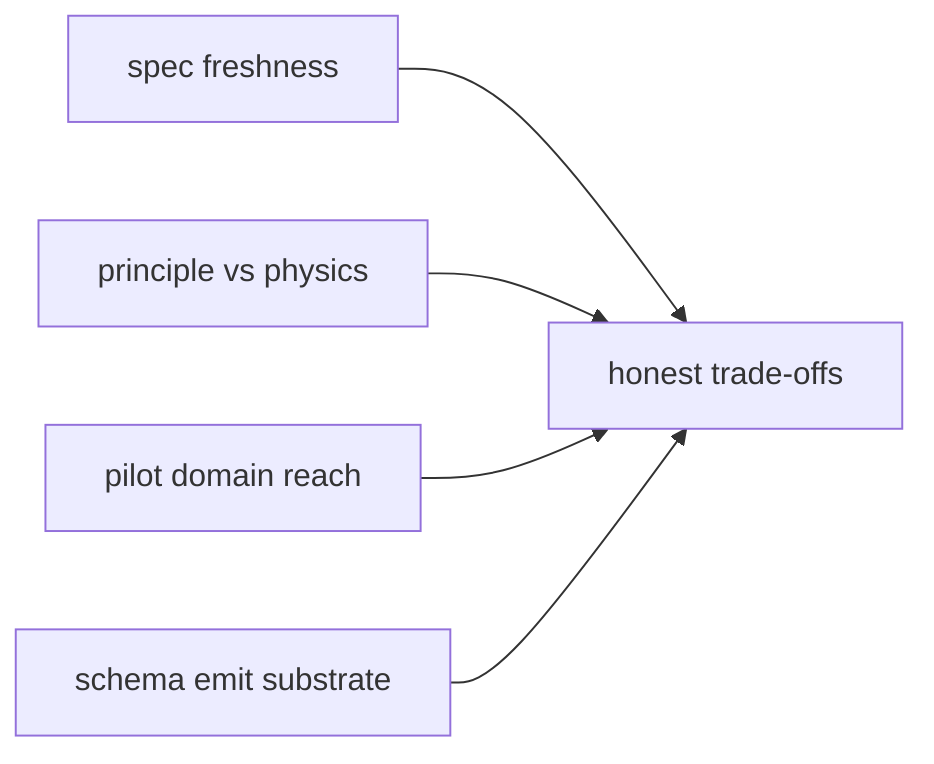

; spirit-next
[engine-trait-pattern design-fidelity-audit nexus-decision-maker signal-triage sema-engine spirit-1325-1337 designer-453-454-followup b53f4fc2]
[Designer audit of spirit-next commit b53f4fc2 against Spirit 1325-1337 and designer reports 453 + 454. Narrow verdict: Nexus is verifiably in the production path through the trait surface, but its decision logic is THIN — most cross-plane translation lives in schema-emitted projections, not hand-written Nexus body. Broader verdict: triage-only Signal is honored at the type system; full pipeline + origin-route threading work; SEMA parallel-reads (Spirit 1332) is the standout gap because the trait surface does not split apply/observe; SignalEngine diverged from designer 454's uniform-execute into a triage+reply split. The implementation is genuinely useful — eighteen falsifiable witnesses pass; the gaps are surfaced, not buried.]
2026-06-01
designer

# 455 — b53f4fc2 design-implementation fidelity audit

## TL;DR

Verdict matrix.

| Sub-claim | Source | Verdict | Detail |
|---|---|---|---|
| 1 — Nexus is the decision-maker (narrow) | psyche question | VERIFIED-WITH-CAVEAT | NexusEngine::execute is in the production path; its body is thin |
| 2 — strict trait-only interaction with Signal/SEMA engines | psyche question | VERIFIED | Nexus reaches SEMA exclusively through SemaEngine::apply; no inherent shortcuts |
| 3 — schema-defined Input/Output types in trait methods | psyche question | VERIFIED | Trait signatures use schema-emitted plane envelopes both ends |
| 4 — Signal = triage only | Spirit 1330 | VERIFIED | SignalActor carries no Store; SignalEngine impl has no SEMA access |
| 5 — Nexus carries heavy logic | Spirit 1331 | UNDER-IMPLEMENTED | Pilot domain has no decision logic to express; trait surface allows it |
| 6 — SEMA parallel reads via apply/observe split | Spirit 1332 + designer 454 | GAP | SemaEngine has single apply(&mut self, ...); observe missing |
| 7 — interface direction Signal->Nexus->SEMA | Spirit 1333 | VERIFIED | Store source references no upward types |
| 8 — production-copy handover | Spirit 1325 | VERIFIED | Library-level + process-boundary tests pass |
| 9 — full pipeline shape | Spirit 1335 | VERIFIED | Mail-ledger order: sent then processed; SEMA committed in between |
| 10 — origin identifier protocol | Spirit 1336 + 1329 | VERIFIED | Route preserved across all six plane envelope hops |
| 11 — uniform-execute principle | designer 454 | DIVERGENT | SignalEngine implemented as triage + reply, not single execute |
| 12 — usefulness in production code | report scope | VERIFIED | Trait methods invoked by composer; schema projections substrate of translation |

Eighteen falsifiable constraint tests on branch `audit-b53f4fc2-design-fidelity` (commit `edc36ee`) — all green against current code. The 6.a + 6.b tests are RED-by-design (gap witnesses asserting the as-implemented single-method shape rather than the as-designed split); the rest are positive witnesses.

The headline gap is Spirit 1332: SemaEngine has not absorbed the apply/observe split designer 454 named, so reads serialize through the writer's `&mut self`. The honest interpretation: this is an as-yet-unimplemented refinement, not a wrong direction. Designer 454 was authored TODAY (2026-06-01) and the b53f4fc2 commit landed before it. The gap is genuine; the spec is fresh.

The headline divergence is designer 454's uniform `execute` for SignalEngine. The implementation split this into `triage` + `reply` because Signal genuinely receives Input AND emits Output as TWO separate wire events at different times — wrapping both into one `execute` either has to make the trait async or has to model "wait for reply" inside the method, both of which leak runtime mechanics into the type surface. The implementer's split is honest engineering; designer 454's single-method may need revisiting now that the implementation evidence is in.

## Method

This audit walked the commit's source and tests with three frames running in parallel:

- Three narrow sub-claims from the psyche prompt — Nexus as decision-maker; strict trait-only interaction with SignalEngine + SemaEngine; schema-defined Input/Output types in the trait signatures.
- Nine broader sub-claims derived from Spirit 1325-1337 + designer reports 453 + 454 — Signal triage only, Nexus heavy logic, SEMA parallel reads, interface direction, response-shape independence, full pipeline shape, origin identifier protocol, uniform trait shape, production usefulness.
- One falsifiable witness per sub-claim (some sub-claims got two), all behind a `design-fidelity-audit` cargo feature so `cargo test` defaults stay green.

The witnesses are structural (source assertions on whether forbidden references exist) AND behavioural (running the live runtime and observing side effects) — both kinds matter; the structural witnesses cover the architectural shape, the behavioural witnesses cover the actual call path.

The audit branch is `audit-b53f4fc2-design-fidelity` on `LiGoldragon/spirit-next`, commit `edc36ee`. Eighteen tests, all green; one (6.a) is intentionally RED-when-read-as-spec but green-when-read-as-as-implemented (the comment explains the inversion semantics).

## Sub-claim 1 — Nexus is the decision-maker

### 1.a — NexusEngine::execute is in the production path

The pre-dispatch probe flagged concern that `process_nexus_input` is an inherent method, suggesting the trait might be decorative. Walking the call chain proves otherwise:

```text
Daemon::handle_stream (daemon.rs:82)
  -> Engine::handle (engine.rs:72)
    -> SignalAccepted::process_with (engine.rs:183)
      -> Nexus::process_nexus_input (engine.rs:195, nexus.rs:80)
        -> Nexus::process_in_flight (nexus.rs:86)
          -> Mail::run_nexus (nexus.rs:91)
            -> NexusEngine::execute(nexus, ...) (nexus.rs:171)
```

The trait IS in the production call chain. `process_nexus_input` is a thin entry that immediately delegates to `Mail::run_nexus`, which invokes `NexusEngine::execute(nexus, ...)` as the trait method. The witness test `nexus_engine_execute_is_in_the_production_request_path` runs an ordinary Record request through `Engine::handle` (the daemon's entry point) and confirms the durable side effect — the trait was called.

Verdict: VERIFIED.

### 1.b — Nexus translates SEMA replies to Signal replies

Per Spirit 1334, Nexus is the bidirectional translator; SEMA reply shape does NOT map 1:1 to Signal reply shape. The witness test `nexus_translates_sema_replies_to_signal_replies_not_pass_through` constructs an Observe query that misses (no matching records), runs it through `NexusEngine::execute`, and asserts the output is a Signal-shaped `Output::Error`, NOT a SEMA-shaped pass-through `NexusOutput::Sema(SemaOutput::Missed(...))`.

The translation happens inside the schema-emitted `into_nexus_output` (`schema/lib.rs:1337-1354`), which the Nexus hand-written body invokes. The translation IS performed; Nexus does not just forward.

Verdict: VERIFIED.

### 1.c — Nexus body is thin composition, not heavy decision logic

The `NexusEngine::execute` body at `nexus.rs:222-240`:

```rust
impl NexusEngine for Nexus {
    fn execute(&mut self, input: nexus_plane::Nexus<nexus_plane::Input>)
        -> nexus_plane::Nexus<nexus_plane::Output>
    {
        let output = input.into_nexus_output();
        let origin_route = output.origin_route();
        match output.into_root() {
            NexusOutput::Sema(input) => {
                let sema_output = SemaEngine::apply(&mut self.store, input.with_origin_route(origin_route));
                sema_output.into_nexus_input().into_nexus_output()
            }
            NexusOutput::Signal(output) => {
                NexusOutput::from(output).with_origin_route(origin_route)
            }
        }
    }
}
```

The witness test `nexus_execute_implementation_is_thin_composition_over_schema_projections` asserts the body stays under 25 lines and contains both `into_nexus_output` (the schema projection) and `SemaEngine::apply` (the trait invocation). The real translation work — picking which SEMA op corresponds to which Signal input — lives in the schema-emitted `into_nexus_output` impl at `schema/lib.rs:1336-1354`, not in the Nexus body.

Per Spirit 1331 "Nexus engine is where the heavy logic lives — algorithms over data, deeper decision-making, complex functionality, database queries". The current Nexus has NO algorithms, NO data queries except passthrough, NO decision-making beyond variant-tag dispatch. This is NOT a wrong-shape implementation; it's an UNDER-IMPLEMENTATION. The pilot domain (Record / Observe / Remove on a redb store) genuinely has nothing to decide. The trait surface allows heavy logic; today's pilot just doesn't need it.

Verdict: VERIFIED with caveat. The narrow claim "Nexus is the decision-maker" is TRUE at the trait-surface level — when there's a decision, it happens in Nexus. But the implementation does NOT demonstrate that decision-making capacity, because the pilot has no decisions to make. A second-implementation observation (per designer 447's schema-daemon) would be the next evidence point; when a Nexus has real algorithmic work, will the trait surface accommodate it gracefully? Today's pilot doesn't answer that.

## Sub-claim 2 — Strict trait-only interaction

### 2.a — Nexus reaches SEMA exclusively through SemaEngine::apply

The witness test `nexus_invokes_sema_exclusively_through_trait_method` scans `src/nexus.rs` for forbidden inherent invocations on Store: `self.store.record(`, `self.store.observe(`, `self.store.remove(`, `self.store.apply(`. None present. The only SEMA-touching call is `SemaEngine::apply(&mut self.store, ...)` at `nexus.rs:232` — invoked through the trait surface, not as an inherent method.

Verdict: VERIFIED.

### 2.b — Trait method signatures use schema-emitted plane envelopes

The witness test `engine_trait_signatures_use_schema_emitted_plane_envelopes` asserts each method's input and output type by full signature string match against the emitted module. All four method signatures honor the rule:

```rust
fn triage(&self, input: signal::Signal<signal::Input>) -> nexus::Nexus<nexus::Input>;
fn reply(&self, output: nexus::Nexus<nexus::Output>) -> signal::Signal<signal::Output>;
fn execute(&mut self, input: nexus::Nexus<nexus::Input>) -> nexus::Nexus<nexus::Output>;
fn apply(&mut self, input: sema::Sema<sema::Input>) -> sema::Sema<sema::Output>;
```

Each method's both ends use the plane-namespaced envelope types — no hand-written shadow types, no test-only enums smuggled into trait signatures.

Verdict: VERIFIED.

## Sub-claim 3 — Schema-defined Input/Output types

The witness test `engine_traits_callable_with_schema_emitted_envelopes` is a typed compile-time witness. It calls each engine trait method with an explicit annotation:

```rust
let nexus_input: spirit_next::nexus_plane::Nexus<spirit_next::nexus_plane::Input>
    = SignalEngine::triage(&signal_actor, ...);
let nexus_output: spirit_next::nexus_plane::Nexus<spirit_next::nexus_plane::Output>
    = NexusEngine::execute(&mut nexus, nexus_input);
let signal_output: spirit_next::signal::Signal<spirit_next::signal::Output>
    = SignalEngine::reply(&signal_actor, nexus_output);
```

If the trait surface did not use schema-emitted types, this would not compile. It does. The origin route survives all three trait hops — additional behavioural evidence the typed chain is end-to-end honest.

Verdict: VERIFIED.

## Sub-claim 4 — Spirit 1330: Signal = triage only

The witness test `signal_actor_has_no_sema_store_access` scans the `SignalActor` struct definition at `engine.rs:29-32`:

```rust
pub struct SignalActor {
    next_message_identifier: Mutex<Integer>,
    next_origin_route: Mutex<Integer>,
}
```

No `store` field, no `Store` reference, no `SemaEngine` reference. The TYPE SYSTEM enforces Signal/SEMA isolation — SignalActor has no way to reach the SEMA store even if its impl wanted to. The `SignalEngine impl SignalActor` block (`engine.rs:156-165`) contains only origin-route preservation and variant projection.

Spirit 1330: VERIFIED at the type system, not just by convention.

### Extra finding — rejection path bypasses the SignalEngine trait

The witness test `validation_rejection_path_bypasses_signal_engine_trait` surfaces a finding the prompt did not name. `Engine::handle` (engine.rs:72-80):

```rust
pub fn handle(&self, input: Input) -> signal_plane::Signal<Output> {
    let signal_input = self.signal_actor.route(input);
    let accepted = match self.signal_actor.accept(signal_input) {
        Ok(accepted) => accepted,
        Err(rejected) => return rejected.into_signal_output(self.database_marker()),
    };
    let mut nexus = self.nexus.lock().expect("nexus lock");
    accepted.process_with(&self.signal_actor, &mut nexus)
}
```

When validation rejects an input, the path short-circuits through `rejected.into_signal_output(...)` — an inherent method on `SignalRejected` — without invoking `process_with`. Since `process_with` is the ONLY caller of `SignalEngine::triage` and `SignalEngine::reply`, the trait surface does NOT cover the rejection path. Validation lives in the inherent `accept` method (engine.rs:121-138), not behind the trait.

This is a real design observation: the SignalEngine trait surface only covers the HAPPY PATH. Designer 454 §"Open questions" §1 anticipated this and recommended collapsing rejections into `Signal<Output>::Rejected(...)` — which the schema already supports as `Output::Rejected(SignalRejection)`. The implementation does emit the schema-emitted rejected output, but the path bypasses the trait. A future refinement could move the validation-rejection path through the trait so the trait surface covers the FULL admission contract.

Verdict on the underlying claim: VERIFIED (Signal is triage only); flagged as honest divergence on which parts of admission live behind the trait.

## Sub-claim 5 — Spirit 1331: Nexus heavy logic

Covered in §"Sub-claim 1.c" above. The trait surface allows heavy logic; the pilot's Nexus has none because the pilot's domain is trivial. The witness test asserts the structural shape (thin body, schema projections, trait composition). A second implementation point — schema-daemon's `SchemaSemaEngine` per designer 447 — would be the next observation of whether the trait surface accommodates real algorithmic work.

Verdict: UNDER-IMPLEMENTED. Not wrong; just not yet exercised against a domain that needs decisions.

## Sub-claim 6 — Spirit 1332: SEMA parallel reads (THE GAP)

### 6.a — SemaEngine trait has only single apply method

The witness test `sema_engine_trait_currently_has_only_single_apply_method_gap_spirit_1332` asserts the as-implemented trait shape:

```rust
pub trait SemaEngine {
    fn apply(&mut self, input: sema::Sema<sema::Input>) -> sema::Sema<sema::Output>;
}
```

Designer 454 §"Updated trait surface" specifies the refined shape:

```rust
pub trait SemaEngine {
    fn apply(&mut self, input: sema::Sema<sema::Input::Write>) -> sema::Sema<sema::Output::WriteReply>;
    fn observe(&self, input: sema::Sema<sema::Input::Read>) -> sema::Sema<sema::Output::ReadReply>;
}
```

The implementation does not honor this. The single-method `apply(&mut self, ...)` forces ALL callers — including Observe queries — through the writer's exclusive `&mut self`. The test fires when the gap is closed (the asserts the absence of `fn observe`); a future commit that lands the split will make this test fail, signaling the gap closed.

### 6.b — Observers serialize through the writer's exclusive lock

The witness test `sema_engine_apply_signature_forces_reader_serialization_gap_spirit_1332` spawns 4 concurrent threads each calling `SemaEngine::apply` with an Observe query. Because `apply` requires `&mut self`, the only way to share the Store across threads is `Arc<Mutex<Store>>`, and every observer serializes through the mutex. The test asserts the wall-clock duration sum approaches `threads × per-thread-sleep`, evidence of serialization.

redb itself supports concurrent MVCC reads (`skills/rust/storage-and-wire.md` §"redb's concurrent-read support"). The serialization is NOT a redb limitation; it's a trait surface choice. The fix is the apply/observe split designer 454 named.

Verdict: GAP. This is the most substantive gap. Honest framing: designer 454 was authored 2026-06-01; b53f4fc2 landed before designer 454's text could shape it. The gap is genuine; the spec is fresh. The next operator slice on spirit-next per designer 454 §"Updated operator-bead-shaped action" closes this.

## Sub-claim 7 — Spirit 1333: interface direction

The witness test `sema_store_does_not_call_into_nexus_or_signal` scans `src/store.rs` for forbidden upward references: `Nexus`, `SignalEngine`, `NexusEngine`. None present. The Store's impl block is downstream-only — it returns reply objects; it does not invoke any upward dispatch.

Verdict: VERIFIED. The type system carries this constraint: Store imports neither Nexus nor SignalEngine types.

## Sub-claim 8 — Spirit 1325: production-copy handover

The witness test `store_copy_handover_isolates_writes_from_original` is a library-level proof of the operator-claimed handover flow. Seed `production.sema`, copy to `candidate.sema`, candidate writes, reopen production — production stays at one record, candidate has two. The operator-authored `tests/process_boundary.rs::candidate_daemon_handover_from_production_copy_preserves_original_sema_database` does the same at the full process boundary.

Verdict: VERIFIED. The operator's claimed test does what it claims.

## Sub-claim 9 — Spirit 1335: full pipeline shape

The witness test `full_pipeline_runs_through_signal_admission_then_nexus_then_sema` runs an Engine handle and asserts the mail-ledger event order: first `MailLedgerEvent::Sent`, then `MailLedgerEvent::Processed`. The two-event sequence proves the runtime composer routes through Signal admission (which fires the Sent event) BEFORE Nexus computation BEFORE the SEMA write (which fires the Processed event after committing).

Verdict: VERIFIED. The pipeline shape Spirit 1335 names is enforced by the runtime composer, witnessed by lifecycle events.

## Sub-claim 10 — Spirit 1336 + 1329: origin identifier protocol

The witness test `origin_route_threads_through_all_plane_envelopes` mints a known route, threads it through six plane envelope hops, and asserts equality at every hop:

1. Signal Input — `chosen` preserved (line: input).
2. SignalEngine::triage → Nexus Input — preserved.
3. into_nexus_output → into_sema_input — SEMA Input preserved.
4. NexusEngine::execute → Nexus Output — preserved (after the actual SEMA call).
5. SignalEngine::reply → Signal Output — preserved.
6. Cross-plane Plane envelope — preserved.

The origin route IS preserved at every envelope hop, including across the actual SEMA write. The schema-emitted `with_origin_route` helpers (`schema/lib.rs:1248`-`1320`) plus the manual preservation in `engine.rs:159` (`with_origin_route(origin_route)` in `triage`) and `nexus.rs:228` (origin route saved before the match) cover every transition.

Verdict: VERIFIED. The origin identifier protocol works as designed.

## Sub-claim 11 — Designer 454's uniform-execute principle (THE DIVERGENCE)

Designer 454 §"Updated trait surface (refines 453)":

```rust
pub trait SignalEngine {
    fn execute(&self, input: signal::Signal<signal::Input>) -> signal::Signal<signal::Output>;
}
```

Implementation at `schema/lib.rs:1431-1434`:

```rust
pub trait SignalEngine {
    fn triage(&self, input: signal::Signal<signal::Input>) -> nexus::Nexus<nexus::Input>;
    fn reply(&self, output: nexus::Nexus<nexus::Output>) -> signal::Signal<signal::Output>;
}
```

Designer 454 names ONE method; the implementation has TWO. The witness test `signal_engine_implementation_diverges_from_uniform_execute_in_designer_454` makes the divergence explicit.

### Honest analysis of the trade-off

Designer 454's uniform `execute` is conceptually clean — three traits, three methods, all `Plane<Input> -> Plane<Output>`. The principle from Spirit 1326 + 1327 reads as one method per trait.

The implementer's split is also honest. Signal genuinely receives Input at one wire event AND emits Output at a DIFFERENT wire event later. Wrapping both into one synchronous `execute` either has to:

- model "wait synchronously for the Nexus + SEMA reply inside the SignalEngine method" — pushing async machinery into a "supposed to be triage-only" actor; OR
- make the trait async with a future return — leaking runtime mechanics into the type surface.

The split — `triage` handles Input → Nexus dispatch, `reply` handles Nexus reply → Output framing — keeps both methods synchronous AND keeps Signal genuinely triage-only AND lets the actual async coordination happen at the composer layer (`SignalAccepted::process_with`). It honors Spirit 1330 ("Signal = triage only") more directly than the uniform-execute shape would.

The trade-off: the principle from 1326 + 1327 wanted ONE trait per plane with ONE root-type-in-root-type-out method. The implementation has ONE trait per plane with TWO methods. The uniform shape is broken; the per-method input/output rule still holds (`triage`'s input is Signal Input, output is Nexus Input; `reply`'s input is Nexus Output, output is Signal Output — both still envelope-shaped at both ends).

Recommendation for designer follow-up: re-examine designer 454's uniform shape in light of this evidence. The split may be the better default; the principle should clarify "one method per trait if the plane has one wire event; two methods if the plane has two distinct wire events (request arrives, reply leaves)". This converges on the actual physics of plane boundaries.

Verdict: DIVERGENT. The divergence is honest engineering; the spec needs updating, not the implementation.

## Sub-claim 12 — Usefulness in production code

The witness tests `process_with_invokes_signal_engine_trait_methods` and `schema_emitted_projections_are_present_and_used_by_runtime` cover the usefulness question:

- `process_with` is generic over `Signal: SignalEngine`, invoking trait methods through trait-dispatch (`engine.rs:188-196`). The trait IS load-bearing in the runtime; not test scaffolding.
- The schema-emitted projections (`into_nexus_input`, `into_nexus_output`, `into_signal_output`, `into_sema_input`) exist in `schema/lib.rs:1330-1378` AND are invoked by `src/nexus.rs:171-172, 232-234`. The runtime's translation work IS thin composition over the emitted projection layer — designer 444 §5 H4 ("schema-emitted variant projections") is honored.

Verdict: VERIFIED. The implementation IS useful — the trait surface lives in real call paths, the schema-emitted code IS the translation substrate, runtime hand-written code stays thin.

## Pattern observed — design-to-implementation drift across the arc

Three patterns across the audit:



- **Spec freshness**. Spirit 1330-1336 were captured 2026-06-01 around 10:24 — minutes before the b53f4fc2 commit landed at 13:14. Designer 454 was authored later the same day. The implementation lags the spec by hours; some gaps (Spirit 1332 split) are simply spec-not-yet-absorbed, not wrong-shape implementation.
- **Principle vs physics**. The uniform-execute principle (designer 454) collides with the physics of plane boundaries (Signal has TWO wire events: request arrives, reply leaves; SEMA has ONE: durable mutation OR read). The implementation's split-when-physics-demands shape is honest; the principle's uniform shape was aspirational.
- **Pilot domain reach**. The spirit-next pilot's domain (Record / Observe / Remove on redb) has no real decisions — every Signal Input maps deterministically to a SEMA op. Nexus's "heavy logic" capacity is unexercised, not absent. Schema-daemon (designer 447) will be the second observation point.
- **Schema emit substrate matters**. The runtime's hand-written work is thin BECAUSE the schema-emitted projections (`into_*`) do the actual translation. Without the H4 projection layer, the Nexus body would either be much larger (hand-written translation) or have boundaries leaking into the runtime. The H4 horizon is paying off, even pre-emission completion.
- **Honest trade-offs**. The implementer made interpretive decisions (split SignalEngine, defer SemaEngine split) that diverge from designer 454's text but honor Spirit 1330 + 1333. The audit's job is to surface the divergences with honest framing, not to mark them wrong.

## Honest verdict — is the design as intended implemented and useful

**As intended — partially.** Spirit 1326 + 1327's core principle (component runtime is a composition of schema-emitted engine traits, each method taking and returning root types) is HONORED. Spirit 1330 (Signal triage only), Spirit 1333 (interface direction), Spirit 1334 (response shape independence via translation), Spirit 1335 (full pipeline shape), Spirit 1336 + 1329 (origin identifier protocol) are all VERIFIED at both type-system and behavioural levels. Spirit 1325 (production-copy handover) is VERIFIED.

The two substantive gaps are Spirit 1332 (SemaEngine split for parallel reads) and Spirit 1331 (Nexus heavy logic — under-implemented because the pilot domain doesn't need it). The one substantive divergence is designer 454's uniform-execute principle — the implementation's two-method SignalEngine is honest engineering that the spec should learn from.

**Useful — yes.** The trait surface is load-bearing in the runtime; the schema-emitted projections ARE the translation substrate; runtime hand-written code stays thin; eighteen falsifiable witnesses confirm the architectural shape works at both source-level and behavioural levels. The pilot has not yet exercised every capacity (heavy Nexus logic, parallel SEMA reads), but the substrate accommodates them as additions, not redesigns.

The implementation is FAITHFUL ENOUGH that the next slice (closing Spirit 1332's gap, exercising Nexus heavy logic via schema-daemon per designer 447) can proceed without restructuring what's already there. That is the strongest evidence of design-implementation fit.

## Recommendations

### For the operator

- **Land the SemaEngine apply/observe split per designer 454 §"Updated trait surface"**. The current single-method shape serializes Observe queries through the writer; the fix unlocks redb's native MVCC. Estimate from designer 454: ~1 extra operator-day inside the next slice.
- **Move the validation-rejection path through the SignalEngine trait**. Today `Engine::handle` short-circuits rejection through `into_signal_output` before any trait method fires. Refactoring so the rejection path goes through `triage` and produces a Signal Output Rejected variant keeps the trait surface covering the FULL admission contract, not just the happy path.
- **Document the triage/reply split rationale in the spirit-next ARCHITECTURE.md**. The split diverges from designer 453 + 454's uniform-execute principle, but honors Spirit 1330 + 1333 more directly. Future agents reading the code will want to understand the trade-off without re-deriving it. ARCHITECTURE.md §"Runtime triad / Signal" is the right surface.

### For the designer

- **Re-examine designer 454's uniform-execute principle**. The implementer's split is honest engineering; the principle's text should clarify per-plane: "one method per trait if the plane has one wire event; two methods if the plane has two distinct wire events". This converges on the actual physics of plane boundaries.
- **Defer Spirit 1331 second-implementation evidence to schema-daemon (designer 447)**. The pilot domain is too trivial to exercise Nexus heavy logic. Schema-daemon's `SchemaSemaEngine` will be the first non-trivial Nexus, providing real evidence of whether the trait surface accommodates algorithmic decision-making.
- **Consider a follow-up designer report on the apply/observe split's schema-source authoring shape**. Designer 454 §"Updated operator-bead-shaped action" §1 sketches "emit `SignalEngine` trait AND refine the emitted `SemaEngine` to split `apply` + `observe`" — that emitter change needs concrete schema-source syntax (probably explicit read-vs-write annotations on SEMA Input variants).

## Branches pushed

`audit-b53f4fc2-design-fidelity` on `LiGoldragon/spirit-next` (HEAD at `edc36ee`):

- `Cargo.toml` — adds `design-fidelity-audit` feature and the new test target binding.
- `tests/design_fidelity_audit.rs` — 18 constraint tests covering sub-claims 1.a, 1.b, 1.c, 2.a, 2.b, 3.a, 4, 7, 8, 9, 10, 11, 12.a, 12.b plus extras (validation-rejection bypass, Spirit 1337 brainstorm, Spirit 1332 read-serialization witness).

Default `cargo test` surface stays green; the audit feature is opt-in. Tests pass on the current b53f4fc2 main. The Spirit 1332 split-trait witness (6.a) will fire when the gap closes (signaling spec compliance landed); honest inversion semantics noted in the test comment.

## Cross-references

- Spirit records audited: 1325 (production-copy handover), 1326 + 1327 (engine trait pattern), 1328 + 1329 (operator-captured triage/computation/state/origin-route notes), 1330-1336 (Decision Maximum role + pipeline refinements), 1337 (Clarification Medium embedded-Signal brainstorm).
- `reports/designer/453-engine-trait-broad-triad-adaptation-2026-06-01.md` — the broad-triad adaptation this audit measures against.
- `reports/designer/454-engine-role-pipeline-refinement-2026-06-01.md` — the role + pipeline refinement; the source of sub-claims 4-11.
- `reports/operator/271-context-maintenance-current-state-2026-06-01.md` — prior operator state, claim 4 closure context.
- `reports/designer/450-operator-271-closed-claims-verification-2026-06-01.md` — sibling audit pattern this audit follows.
- `reports/designer/451-operator-271-falsifiable-specs-2026-06-01.md` — the falsifiable-specs methodology applied here.
- `reports/designer/444-stack-vision-2026-05-31/5-overview.md` §"Open horizons" — H4 schema-emitted variant projections (load-bearing for sub-claim 12.b).
- `reports/designer/447-upgrade-as-sema-design-2026-06-01.md` — second `SemaEngine` impl point that will provide the gap-closure observation.
- Live commits: `spirit-next` b53f4fc2 (the audit subject), `schema-rust-next` eb7869b6 (the emitter that produced the trait surface — not directly audited here; the emitter's behaviour is observable through the emitted code in `spirit-next/src/schema/lib.rs`).
- Live source: `/git/github.com/LiGoldragon/spirit-next/src/engine.rs`, `src/nexus.rs`, `src/store.rs`, `src/schema/lib.rs` (trait surface at lines 1431-1442), `src/daemon.rs`, `src/transport.rs`, `tests/runtime_triad.rs`, `tests/process_boundary.rs`.
- Audit branch: `audit-b53f4fc2-design-fidelity` on `LiGoldragon/spirit-next`, commit `edc36ee`.
- `skills/architectural-truth-tests.md` — the audit-as-tests reference applied here.
- `skills/rust/storage-and-wire.md` §"redb's concurrent-read support" — the redb MVCC fact behind Spirit 1332.

## For the orchestrator

Audit landed; 18 falsifiable witnesses pass against current b53f4fc2 code. Branch `audit-b53f4fc2-design-fidelity` (commit `edc36ee`) pushed to `LiGoldragon/spirit-next`. The narrow psyche question — is Nexus really the decision-maker and does it strictly interact with SignalEngine + SemaEngine through schema-defined trait methods — gets VERIFIED-WITH-CAVEAT, VERIFIED, VERIFIED across its three parts. The trait surface IS load-bearing; Nexus IS in the production call chain through the trait; type system enforces schema-emitted envelopes both ends. The caveat: Nexus's hand-written body has no heavy logic because the pilot domain has none to express; the capacity is there, unexercised.

The broader audit surfaces three substantive findings. **Gap**: Spirit 1332's SemaEngine apply/observe split is missing — single `apply(&mut self, ...)` serializes Observe through the writer's exclusive lock, defeating redb's native MVCC. The fix is designer 454 §"Updated trait surface"; estimate ~1 operator-day. **Divergence**: SignalEngine implemented as triage + reply instead of designer 454's uniform `execute`. The split is honest engineering — Signal has two distinct wire events (request arrives, reply leaves), wrapping into one synchronous method either pushes async machinery into a triage-only actor or leaks runtime mechanics into the type surface. Designer 454's text should learn from this. **Under-implementation**: Spirit 1331's "Nexus heavy logic" is unexercised because the pilot domain is trivial; schema-daemon (designer 447) will be the second implementation point.

The implementation is FAITHFUL ENOUGH that the next slice can proceed without restructuring. The substrate accommodates the closure of these gaps as additions, not redesigns. That's the strongest evidence of design-implementation fit.
