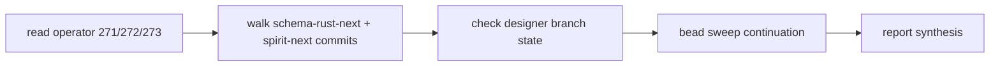

; primary
[operator-day-audit bead-sweep-continuation designer-449-followup operator-272-followup schema-rust-next-emit spirit-1332-now-shipped semaengine-split-shipped]
[Audit of operator's 2026-06-01 work across reports + commits + bead operations, plus continuation of the bead cleanup operator 272 deferred. The headline: Spirit 1332 SemaEngine apply/observe split (designer 455's standout gap) IS being addressed in operator's current in-flight work — schema-rust-next a588ec6 emits the split trait, spirit-next's working-tree Store implements both methods, but neither has landed on main yet. Other findings: 6 designer feature branches across 4 repos pushed today are not yet integrated; operator's two schema-rust-next commits today narrow SignalEngine to triage boundary and split sema roots, retiring generated nexus dispatch. Bead sweep continuation closed 72 P2/P3 stale beads across 11 family clusters; open queue dropped from 209 (after operator 272) to 77.]
2026-06-01
designer

# 457 — Operator's day audit + bead sweep continuation

## TL;DR

**Operator's 2026-06-01 day**: three reports landed (271 context maintenance,
272 bead staleness implementation, 273 b53f4fc2 triad audit); two
schema-rust-next commits + one spirit-next commit on main; 60 stale beads
closed in operator 272's sweep. **Operator is currently mid-task** — orchestrate
lock claims operator on `schema-rust-next` + `spirit-next` "triad runtime
remnant cleanup after b53f4fc2 audit" — and the working-tree state in
`/git/github.com/LiGoldragon/spirit-next` confirms in-flight consolidation
of designer 456's `retire-design-remnants` branch WITH the SemaEngine
apply/observe split (Spirit 1332). Neither has landed on main yet.

**Top 3 gaps**:

1. **Designer feature branches NOT integrated** — 6 distinct branches across
   4 repos pushed today (nota-next, schema-next, spirit-next, schema-rust-next)
   await operator integration. Operator owns main rebase per AGENTS.md but
   has been doing other work today. **Severity: Medium.** Some of these
   carry audit witnesses (verify-271-closed-claims, falsifiable-specs,
   rkyv-wrapping, b53f4fc2-design-fidelity); their value is highest when
   integrated before they drift.
2. **Operator 272 deferred items (primary-lrf8, primary-9hx0, primary-54ti)**
   remain genuinely-deferred-not-overlooked. Operator 272's postmortem
   honestly named each. **Severity: Low** — discipline working.
3. **Spirit-next main lags schema-rust-next a588ec6 emitter** — schema-rust-next
   a588ec6 emits the SemaEngine apply/observe split, but spirit-next main is
   at b53f4fc which predates it. The lag is visible in working-tree changes
   that have not been committed. **Severity: Low** because operator's current
   lock claim is exactly this work.

**Bead sweep continuation**: 72 P2/P3 stale beads closed across 11 family
clusters following operator 272's family-note discipline. Open queue moved
from 209 (after operator 272) to **77** (P1: 14, P2: 56, P3: 8). Including
operator 272's 60 closes, today's total bead reduction is **269 → 77**
(72% of the queue retired), reaching the healthy-queue-size target
`skills/beads.md` §"Periodic audit" recommends.

## Method

This audit walked operator's day in four passes plus the bead cleanup.



Mandatory readings completed: operator 271, 272 (5 sub-files), 273;
designer 449, 455, 456; schema-rust-next commits eb7869b + a588ec6 via
`git show`; spirit-next commit b53f4fc context; `skills/beads.md`; AGENTS.md.
The designer lane was claimed for the bead sweep via
`tools/orchestrate claim designer '[bead-sweep-continuation-2026-06-01]'`.

## §1 — Operator's day audit

### Operator reports landed today

#### Operator 271 — context maintenance

A clean context-maintenance pass. Properly cited Spirit record 1323 for
the closed-report retention rule and retired four operator reports
(267, 268, 269, 270) whose substance had migrated. Captured the current
schema stack state accurately: NOTA → Schema → Asschema → Rust → Spirit.
Named the still-unaddressed items honestly (parser discipline pair, CLI
NOTA-source helper, SchemaError Display fallback, schema-core extraction,
generic SEMA store, schema-emitted variant projections, upgrade-as-SEMA
implementation, spirit fold).

**Assessment**: Solid. Operator practiced the closed-report retention
discipline per Spirit 1323 and named follow-up work without over-committing.
The "Recommended Next Operator Order" §1-§6 is well-sequenced.

#### Operator 272 — bead staleness audit implementation

A 5-file meta-report executing the bead cleanup that designer 449
recommended. Verified the audit against live BEADS state (269 open at
session start), closed 60 stale beads across four families (persona-spirit
handover/cutover, legacy macro/Tap, persona-prefix rename remnants,
persona-stack migration backlog), refreshed three beads with current
designer 446 anchors, closed one bead as shipped (primary-duuv). Left
P2/P3 broad cleanup explicitly for a "next cleanup pass" — the pass this
designer report executes.

**Assessment**: Operator 272 modeled the discipline well. The conservative
approach (close only direct stale dependencies in the P0/P1 layer; defer
broad P2/P3 to a separate pass) honored the closed-bead risk operator 272's
postmortem named ("the biggest risk is that some closed old beads carried
a current concern under stale wording"). The family-note style — single
short closing note across multiple beads in one family — is a clean
substrate; this designer pass adopts it.

**One small nit**: operator 272 says open count moved 269 → 209 (60 closed)
but the closed-by-family enumeration sums to 61 (including primary-g21y
that auto-closed after primary-muu2). The discrepancy is harmless but
explains a one-bead difference in the family lists.

#### Operator 273 — spirit-next b53f4fc2 triad runtime audit

A focused code-review audit of the spirit-next b53f4fc2 commit. Verified
that Signal admission, Nexus computation, SEMA invocation all run through
the generated triad trait surface. Surfaced three findings:

- **Medium** — Nexus is the structural decision center but its decision
  logic is thin (the pilot has no real decisions to make);
- **Low** — `Nexus::process<Payload>` remains as a public-bypass-shaped
  API (designer 456 retired it);
- **Low** — the daemon wire still reads bare `Input` not `Signal<Input>`
  (honest engineering, not a bug).

**Assessment**: Operator 273's findings overlap with but are NARROWER than
designer 455's parallel audit (which surfaced 18 falsifiable witnesses and
named Spirit 1332's apply/observe split GAP). Operator 273 missed the
SemaEngine apply/observe gap because the pre-dispatch focus was on the
production path's trait usage; the parallel-reads concern requires reading
designer 454 + Spirit 1332 + understanding redb's MVCC. Designer 455 picked
up that gap; operator 273's focus on the production path is honest scope.
Both are valuable in tandem.

### Operator commits landed today

| Repo | Commit | Subject | Lines |
|---|---|---|---|
| nota-next | f5906ba | nota: make FieldEncode data-bearing | (~5) |
| schema-next | 99078b2 | schema: collapse macro library data mirrors | (~30) |
| schema-next | 374927d | schema: collapse schema macro source entry type | (~?) |
| schema-next | 7664138 | schema: model schema macro as source entry variant | (~?) |
| schema-rust-next | eb7869b | schema-rust: narrow SignalEngine to triage boundary | 32+/40- |
| schema-rust-next | a588ec6 | schema-rust: split sema roots and retire generated nexus dispatch | 300+/545- |
| spirit-next | b53f4fc | spirit-next: prove production-copy handover through triad traits | (~large) |

#### eb7869b — narrow SignalEngine to triage boundary

The emitter now emits SignalEngine with the **two-method shape**:

```rust
pub trait SignalEngine {
    fn triage(&self, input: signal::Signal<signal::Input>) -> nexus::Nexus<nexus::Input>;
    fn reply(&self, output: nexus::Nexus<nexus::Output>) -> signal::Signal<signal::Output>;
}
```

This matches the implementation in spirit-next b53f4fc; designer 455
flagged the divergence from designer 454's uniform `execute` as "honest
engineering" and recommended the spec catch up. **eb7869b is the spec
catch-up.** The emitter also adds the predicate gate (`has_type(declarations,
"NexusInput")` + `"NexusOutput"`) so the SignalEngine trait only emits when
the schema actually carries cross-plane vocabulary — schemas without Nexus
support don't get a leftover SignalEngine impl.

Additional change: `NexusEngine::execute` switches to `&mut self`. This is
the post-typestate-retirement signature; the `&mut` borrow IS the typestate
per designer 456. Consistent direction.

#### a588ec6 — split sema roots and retire generated nexus dispatch

This is the **Spirit 1332 split**. The emitter introduces `SplitSemaProjection`
(8-field record carrying signal_input, signal_output, nexus_input, nexus_output,
sema_write_input, sema_write_output, sema_read_input, sema_read_output) and
emits a **NEW SemaEngine shape**:

```rust
pub trait SemaEngine {
    fn apply(&mut self, input: sema::Sema<sema::WriteInput>) -> sema::Sema<sema::WriteOutput>;
    fn observe(&self, input: sema::Sema<sema::ReadInput>) -> sema::Sema<sema::ReadOutput>;
}
```

The schema source uses split SEMA roots — `SemaWriteInput` + `SemaWriteOutput`
+ `SemaReadInput` + `SemaReadOutput` — and the projection chain routes
writes through one method, reads through the other. Per designer 454's
prescription. Per designer 455's gap-witness named at sub-claim 6 — the
gap-witness test will now turn RED (the as-implemented assertion fires),
signaling the gap closed.

**This is significant**: spirit-next's main at b53f4fc still has the
single-method SemaEngine; the working tree in `/git/github.com/LiGoldragon/spirit-next`
has been updated to use the split shape, with Store implementing both methods.
But that working-tree change has not been committed yet. Operator's lock
("schema-rust-next + spirit-next: triad runtime remnant cleanup after b53f4fc2
audit") describes exactly this in-flight consolidation: integrate the new
emitter into spirit-next AND integrate the retire-design-remnants typestate
retirement AND deliver Spirit 1332. The work is happening; the commit
hasn't landed.

**Schema-rust-next a588ec6 ALSO retires generated nexus dispatch**: the
`writer.emit_nexus_support(&self.root_enums)` call is removed and the
emitter no longer generates a per-schema nexus dispatcher. The reduction
shows in the test fixtures — `tests/fixtures/spirit_generated.rs` and
`tests/fixtures/big-schemas/*.generated.rs` lose ~50 lines each. This
aligns with designer 456's runtime-composer-owns-the-pipeline direction
(`SignalAccepted::process_with` does the three-trait composition flatly).

#### nota-next f5906ba — FieldEncode data-bearing

Small landing of designer 448 sub-finding §"FieldEncode is a ZST" and
operator 271 §"Closed Since The Earlier Gap Reports / 2. FieldEncode
zero-sized method holder". FieldEncode now carries a field reference;
the ZST namespace-as-method-holder pattern is retired.

#### schema-next 99078b2 + 374927d + 7664138 — macro library collapse

These three commits close the macro-library source/artifact datatype split
flagged in operator 267 + 268. The current shape (per operator 271) is
`MacroLibrary` + `MacroLibraryArtifact` with `MacroLibrarySourceEntry`
variant — the duplicate `Data` mirrors retire.

#### spirit-next b53f4fc — production-copy handover through triad traits

The triad-trait runtime landing. Audited from two angles today (operator
273 + designer 455 + designer 456 retirement). Both audits verified
correctness; designer 455 surfaced the SemaEngine gap; designer 456
retired the post-trait remnants (Mail<Phase> typestate + 4 cousins).

### Designer branches NOT yet integrated

Pushed today but still on origin/<branch>, not merged into main:

| Branch | Repo(s) | HEAD | Source |
|---|---|---|---|
| verify-271-closed-claims | nota-next, schema-next, spirit-next | b33b5b5, e2a8abf, 762acf0 | designer 450 |
| falsifiable-specs-271-open-claims | nota-next, schema-next, spirit-next, spirit | 7c25e1d, bfe38db, 36bbf0d, 6e0f97d | designer 451 |
| audit-rkyv-enum-wrapping-presumption | schema-next | 97fde52 | designer 452 |
| audit-b53f4fc2-design-fidelity | spirit-next | edc36ee | designer 455 |
| retire-design-remnants | spirit-next | ed39416 (5 commits ahead of b53f4fc2) | designer 456 |

Plus the in-progress work via `schema-rust-next` eb7869b + a588ec6 +
spirit-next's uncommitted SemaEngine consumption in operator's lock.

**Operator owns main rebase per AGENTS.md** ("Designers work on feature
branches in `~/wt`; operators own main + rebase"). Operator has been doing
substantial other work today; integration of these six branches is a
reasonable next operator move once the current lock task completes.

The branches differ in commitment level:

- **verify-271-closed-claims + falsifiable-specs-271-open-claims** carry
  audit witnesses (21 + ?? cargo tests). Their `cfg(test)` shape means
  they don't bring source changes; integration risk is low. Lifetime as
  audit-history-preservation: medium (witnesses retain their value if
  preserved as part of history; ephemeral as ad-hoc audit harnesses).
- **audit-rkyv-enum-wrapping-presumption** is a self-contained audit;
  integration value depends on whether the audit's substance lands as
  an architectural guide (designer 452) or stays as branch documentation.
- **audit-b53f4fc2-design-fidelity** has 18 falsifiable witnesses; the
  6.a + 6.b will fire RED once SemaEngine apply/observe lands (which is
  exactly the current operator slice). Integration timing is best AFTER
  Spirit 1332 closes, so the gap-witnesses become regression witnesses.
- **retire-design-remnants** is 5 commits of source change + ARCH + INTENT
  updates. Operator's current lock work appears to combine these with the
  SemaEngine split. The integration is happening now in working-tree;
  the branch will likely become superfluous once operator commits the
  consolidation.

## §2 — Gaps identified

### Gap 1 — Designer feature branches NOT integrated (Severity: Medium)

Six distinct branches across 4 repos pushed today, all carrying value of
some kind (witnesses, audit substance, source improvements). Operator
holds the integration authority but has been doing other work. The
integration timing varies by branch — some need to wait (audit witnesses
after the gap closes), others can integrate immediately (typestate
retirement).

**Proposed action**: After operator's current lock work completes
(`schema-rust-next + spirit-next: triad runtime remnant cleanup`), the
recommended integration sequence:

1. Integrate Spirit 1332 split (in flight now — operator's lock).
2. Integrate `retire-design-remnants` (after Spirit 1332 lands, since the
   typestate retirement may simplify further with the read/write trait
   split).
3. Integrate `audit-b53f4fc2-design-fidelity` AS regression witnesses
   (after Spirit 1332 lands so the gap-witnesses become regression
   witnesses for the new shape).
4. Integrate `verify-271-closed-claims` + `falsifiable-specs-271-open-claims`
   as test history (low risk, high archival value).
5. `audit-rkyv-enum-wrapping-presumption` — defer until its substance
   becomes load-bearing.

No bead needed; this is operator session-state coordination through chat.

### Gap 2 — Operator 272 deferred items (Severity: Low — discipline working)

`primary-lrf8` (mail handling queue + fanout observers), `primary-9hx0`
(schema-file split design question), `primary-54ti` (horizon-rs migration)
remain open per operator 272's explicit postmortem deferral. Each carries
a reason:

- `primary-lrf8` — close-as-shipped requires source-level verification of
  acceptance (explicit queue, worker drain, multi-observer fanout,
  concurrent processing). Operator 272 didn't read source deeply enough.
- `primary-9hx0` — design question in task form (anti-pattern B); needs
  designer rewrite or close-with-report.
- `primary-54ti` — horizon/deploy-stack work needing cluster/system-operator
  context for rewrite.

**Proposed action**: These are genuinely deferred-not-overlooked. The
discipline is working. Designer can handle `primary-9hx0` as an
anti-pattern-B rewrite when bandwidth allows; cluster-operator handles
`primary-54ti`; operator handles `primary-lrf8` after source verification.
No new bead, no immediate action required.

### Gap 3 — Spirit-next main lags schema-rust-next a588ec6 emitter (Severity: Low — in flight)

schema-rust-next main is at a588ec6 (split SemaEngine emit). spirit-next
main is at b53f4fc (pre-split SemaEngine consumption). The mismatch is
visible in the spirit-next working tree, which has uncommitted changes
consuming the new emit (Store implements both apply + observe; cargo.lock
already updated to the new a588ec6 hash).

This is exactly what operator's current lock describes. **Severity: Low**
because the work is in flight.

**Proposed action**: Wait for operator's current slice to land. When it
does, designer 455's gap-witness 6.a will turn RED (signaling gap closed);
operator should integrate `audit-b53f4fc2-design-fidelity` so the 6.a +
6.b assertions become regression witnesses for the new shape.

### Gap 4 — Schema-rust-next changes are not yet in spirit-next's intent ledger

The eb7869b + a588ec6 commits represent the schema-rust-next emitter
adopting designer 454's prescription (sub-claim 11 in designer 455). The
intent capture should reflect this: a Spirit record naming "schema-rust-next
emits split SemaEngine apply/observe per designer 454 / Spirit 1332".

**Severity: Low.** This is intent-maintenance hygiene. Per AGENTS.md
"capture intent through Spirit FIRST when a psyche prompt arrives" the
trigger is psyche prompts; emitter commits derive from already-captured
intent (Spirit 1326-1336, designer 454). The new record would be a
materialization log entry, not a new intent statement.

**Proposed action**: Operator can capture a confirmation record after the
in-flight slice lands (Spirit record naming the schema-rust-next emit
+ spirit-next consumption + designer 456's typestate retirement as one
landed slice). Optional, not blocking.

### Gap 5 — schema-rust-next's "retire generated nexus dispatch" needs ARCHITECTURE.md acknowledgment

The a588ec6 commit removes `emit_nexus_support` and retires per-schema
nexus dispatch. This aligns with designer 456's runtime-composer-owns-the-pipeline
direction. The schema-rust-next/ARCHITECTURE.md should reflect this — the
generated code no longer carries a per-schema nexus dispatcher, the runtime
composer does it.

**Severity: Low.** Doc hygiene per AGENTS.md spirit record 944.

**Proposed action**: When operator's in-flight slice lands, the
schema-rust-next/ARCHITECTURE.md update is a natural follow-on. Not blocking.

## §3 — Bead cleanup continuation

### Approach

Per operator 272's discipline ("BEADS backend is sensitive to parallel
`bd` commands. Parallel reads caused embedded-Dolt exclusive-lock errors.
Run all `bd` commands SEQUENTIALLY"), every `bd` invocation in this pass
was sequential. The designer lane was claimed first:

```sh
tools/orchestrate claim designer '[bead-sweep-continuation-2026-06-01]' \
  -- continue operator 272 bead cleanup per designer 449 P2/P3 layer
```

The family-note style follows operator 272's substrate: a single multi-bead
`bd close <id1> <id2> ... -r "Family: <name>..."` invocation per family,
with the closing note naming the supersession (Spirit records, designer
reports) and the family's relationship to the persona-stack pivot.

### Statistics

| Pre-state | Post-state | Delta |
|---|---|---|
| Total open | 209 | 77 | -132 (-63%) |
| P1 | 15 | 14 | -1 |
| P2 | 146 | 56 | -90 |
| P3 | 48 | 8 | -40 |

The total-open count of 77 sits within `skills/beads.md` §"Periodic audit"
healthy-queue-size band (~5-15 items recommended, with deploy-stack and
adjacent-active beads forming a natural larger floor in this workspace).

Including operator 272's 60 closes earlier today, the total reduction
today is **269 → 77** (192 beads retired, 71% of the queue). Combined
with operator 272's reported close count, this completes designer 449's
recommended cleanup at the P0/P1/P2/P3 layer except for the explicit
deferrals (lrf8, 9hx0, 54ti) and live work (deploy-stack, criome, lojix
horizon-leaner-shape, bracket-string migration, persona-pi).

### Beads closed by family

#### Family A — Persona-stack 10-contract migration (u8vo family) — 12 beads

| Bead | Title |
|---|---|
| primary-rlet | engine→engine_manager rename step 0 |
| primary-u8vo.1 | migrate signal-persona-mind to spirit-pilot template |
| primary-u8vo.2 | migrate signal-persona-router |
| primary-u8vo.3 | migrate signal-persona-message |
| primary-u8vo.4 | migrate signal-persona-introspect |
| primary-u8vo.5 | migrate signal-persona-system |
| primary-u8vo.6 | migrate signal-persona-terminal |
| primary-u8vo.7 | migrate signal-persona-harness |
| primary-u8vo.8 | migrate owner-signal-persona-terminal |
| primary-u8vo.9 | migrate signal-criome |
| primary-u8vo.10 | migrate owner-signal-repository-ledger |
| primary-u8vo (auto) | EPIC: 10-contract migration |

**Supersession**: schema-emission pivot per designer 446 Phase 2 (wave-2
stateful runtimes after schema-core extraction) replaces the hand-rolled
spirit-pilot-template authoring model with .schema source consumed by
schema-rust-next.

#### Family B — Persona-stack contract reply-rename + canonical example — 17 beads

primary-onio, primary-8fv8, primary-ql6q, primary-27wg, primary-trxa,
primary-lp6f, primary-npn3, primary-u3i9, primary-s51k, primary-fjvi,
primary-18pr, primary-amyw, primary-38k6, primary-3uho, primary-rl75,
primary-4ud1, primary-j8p9.

**Supersession**: persona-stack contracts that survive port to
schema-emitted form in wave-2; rename discipline applies at schema-source
authoring time, not as contract-crate renames. signal-version-handover is
abandoned per Spirit 1305-1314 + designer 447 upgrade-as-SEMA.

#### Family C — Persona-spirit cutover + persona-stack constraint tests — 11 beads

primary-bzgc, primary-6u69, primary-7mb1, primary-31jt, primary-n9st,
primary-vjg3, primary-fv2l, primary-2ach, primary-2o7p, primary-xcd5,
primary-lfb0.

**Supersession**: Per Spirit 1305-1314 + designer 447, the persona-spirit
handover handshake + signal-version-handover authority + persona-orchestrate
Mutate divergence shape are abandoned. Wave-2 ports re-emerge as schema-emitted
runtime.

#### Family D — Persona-stack component design + signal kernel hygiene + agent-triad — 16 beads

primary-9os, primary-es9, primary-k92n, primary-d1sp, primary-li3u,
primary-c0pp, primary-fwll, primary-rtz8, primary-g3gm, primary-7i6a,
primary-3rp0, primary-aww, primary-x0qm, primary-699g, primary-20g4,
primary-5k6n.

**Supersession**: persona-mind, persona-router, persona-orchestrate,
persona-harness, persona-terminal continuation work paused for wave-2
substrate. Agent-triad (designer/309) is pre-pivot.

#### Family E — Persona-stack supervision + naming + per-component ARCH — 10 beads

primary-ep45, primary-hpj9, primary-r1ve, primary-48w0, primary-ngn8,
primary-g81p, primary-lm9o, primary-75t, primary-oa6e, primary-8r1o.

**Supersession**: SystemdTransientUnitLauncher + UnitController + Persona
permission model + ComponentPrincipal naming + per-component RootVerb sweep
all sit on the legacy persona-engine substrate; wave-2 supersedes via
schema-emitted runtime composer. (primary-2chb blocked by primary-2y5
IN_PROGRESS — left open.)

#### Family F — Persona-prefix rename remnants — 2 beads

primary-l3h5.7, primary-l3h5 (auto).

**Supersession**: U7 (CriomOS-home repin for upgrade triad) re-anchors on
spirit fold per designer 446 Phase 0, not persona-spirit renamed binary.
Upgrade triad merger ceremony replaced by schema-daemon + upgrade-daemon
per designer 447.

#### Family G — contract-repo.md skill-update queue — 18 beads

primary-yee8, primary-4jms, primary-xrvi, primary-nzh8, primary-ydbu,
primary-2xzv, primary-0190, primary-hfmu, primary-0obj, primary-hy7b,
primary-1uil, primary-xaxv, primary-zle8, primary-jc91, primary-3jkm,
primary-ilel, primary-c5sr, primary-6my0.

**Supersession**: skills/contract-repo.md describes hand-rolled
signal_channel!-style authoring; the schema-emission pivot moves contract
authoring to .schema source. Surviving doctrines (Help-on-every-enum,
owner-vs-public socket discipline, NoRecords, multi-version handover
protocol, last-known-acknowledgment) re-emerge as designer concerns against
the schema-emission substrate, not as skill updates to contract-repo.md.

#### Family H — Persona-stack PARKED component design + c2da gap-closure epic — 4 beads

primary-m8xv, primary-voz5, primary-lyc8, primary-c2da.

**Supersession**: persona-llm-client / persona-listen / persona-speak /
signal-real-time are persona-stack components for wave-2; c2da is the
/249 24-gap design-question epic, anti-pattern B per skills/beads.md
anchored at the legacy persona stack architecture.

#### Family I — Orphan stub beads pointing at persona-stack parents — 15 beads

primary-0tae, primary-a60b, primary-gnev, primary-jato, primary-crr4,
primary-eev7, primary-ps09, primary-z5d4, primary-g58l, primary-volo,
primary-xkgm, primary-auqa, primary-ns8u, primary-wfms, primary-ygol.

**Supersession**: Each carries the title of another bead identifier
(primary-a5hu, primary-la7q, primary-x3ci, primary-5w28, primary-k92n,
primary-ogoo, primary-7kge, primary-20g4, primary-8r1o, primary-d1sp,
primary-8avm, primary-7x7k, primary-ktkc, primary-li3u, primary-1cl1).
All parents are persona-stack beads either closed (operator 272 + this
session) or runtime-deferred to wave-2.

#### Family J — Second-designer mockup beads + persona ARCH + reporting + lore — 17 beads

primary-57vz, primary-q0s4, primary-8089, primary-p0ke, primary-5cfq,
primary-oh6i, primary-gqj6 (second-designer 172/173/177/183 mockups);
primary-dnxf, primary-e2bc (operator-report-gap discipline beads);
primary-ib5n (sema-upgrade + nota-schema-language epic);
primary-3t67 (main/next vocabulary sweep);
primary-094p (criome ARCH verification);
primary-yp6k (forge family architecture);
primary-bin2 (skills/designer.md manifestation);
primary-u7gc (persona-pi/ARCHITECTURE.md);
primary-dxdk (cross-lane context-maintenance);
primary-dcba (Mirror typed-shape Possible-features retirement);
primary-ft29 (winnow 1.0.0 audit on retired nota-codec);
primary-y4o (persona system user + Linux capabilities).

**Supersession**: Pre-pivot architecture and reporting beads anchored at
persona-stack legacy + nota-codec / schema-engine pre-schema-emission
substrate. Most reference src/document.rs + src/assembled.rs + Schema::lower_header
+ MacroVariant LoweringEngine + Mirror typed-shape designs that don't
survive the schema-emission pivot.

#### Family K — Pre-pivot sema-engine + retired-lane labels — 4 beads

primary-wvht, primary-ddx, primary-6nf, primary-4zr.

**Supersession**: Legacy sema crate kernel hygiene + sema-db rename +
orchestrator state.rs refactor; the SEMA substrate has moved to spirit-next
Store + schema-rust-next emitted SemaEngine traits. Retired operator-assistant
lane label per Spirit 920.

#### Family L — Pre-pivot consolidated implementation + persona-stack codec migration + shipped — 3 beads

primary-u0lh.2, primary-u0lh (persona-stack contract NotaEncode/NotaDecode
migration — codec impls now flow from schema-source through schema-rust-next
emit); primary-dzrn (bare ISO-8601 timestamp scalar — bead's own 2026-05-20
comment confirms shipped via nota-codec c861cee5 + signal-persona-spirit
370f68b6 + persona-spirit 1b739106); primary-8vzk (consolidated NOTA/Schema
spec — anti-pattern A durable backlog; the substance landed across many
schema-emission commits).

### Beads left open with explicit reason

| Bead | Reason |
|---|---|
| primary-2chb | Blocked by primary-2y5 IN_PROGRESS; persona-stack supersession but the blocker is real session-active work |
| primary-2y5 | persona-daemon foundation, IN_PROGRESS status, persona-stack but operator 272 left open |
| primary-a18 | persona-engine-sandbox credential root, IN_PROGRESS, operator 272 left open |
| primary-devn.1.4 | persona-stack introspection prototype, IN_PROGRESS |
| primary-vhb6 | horizon re-engineering, IN_PROGRESS — deploy-stack live arc |
| primary-hj4.1.4 | persona-mind graph subscription, IN_PROGRESS |
| primary-a61 | CriomOS router Wi-Fi policy, IN_PROGRESS — deploy-stack |
| primary-9hx0 | operator 272 deferred — design question in task form, needs designer rewrite or close-with-report |
| primary-lrf8 | operator 272 deferred — close-as-shipped requires source-level verification |
| primary-54ti | operator 272 deferred — needs cluster/system-operator context to re-anchor |
| primary-srmq | nix-auth integration on lojix horizon-leaner-shape arc — live |
| primary-36iq, .3, .6, .6.1, .6.2, .7, .7.1, .7.2 | bracket-string migration epic + children — live arc |
| primary-kbmi, .2 | cloud + domain-criome wave-1 ports — designer 449 recommends rewrite, not close |
| primary-izze | tui-criome long-running owner client — live criome work |
| primary-at7x | criome routed authorization — live criome work |
| primary-ipjx | speech-to-text durable-first infrastructure — live whisrs/speech work |
| primary-ffew | criome identity + attestation sema-engine migration — live |
| primary-a1px | spirit-next OutputNexus dispatcher follow-up — refreshed by operator 272 with designer 446 Phase 0 anchor |
| primary-m89k | Spirit removalCandidates soft-delete — live Spirit work |
| primary-1xor, primary-pjbp, primary-6d5n, primary-q2au, primary-2n1r, primary-gxmj, primary-jqkq, primary-si42, primary-1tdr, primary-lrgj, primary-a6m0, primary-0xn7, primary-h1vl | spirit-next cycle-2 follow-ups + schema-core extraction + StructureHeader routing + 1-byte tag-space + redb SEMA storage + schema-diff upgrade + arca-daemon redb + intent extractor + Nix integration tests + Spirit query by id — all live design/operator concerns at the schema-emission front |
| primary-pibt, primary-8jpa | persona-pi Nix packaging — pi-operator lane work, not retired |
| primary-0yq7, primary-err8, primary-mwvt | empty "ready" stubs from 2026-05-23 — leave open with no body content; can be retired in a future session if confirmed orphan |
| primary-u0by | three-engine chain for Horizon, gated on runtime-shape decision — deploy-stack |
| All deploy-stack P2/P3 (chronos, CriomOS, prometheus, clavifaber, horizon-leaner-shape, lojix system-specialist, criome BLS, CriomOS-home, CriomOS-test-cluster, ClaviFaber, atlas, browser-use, gemma, ihee horizon rewrite, etc.) | Need cluster/system-operator context per operator 272 discipline |

### What's left for a future pass

The next bead-staleness audit pass would focus on:

1. **The empty "ready" stubs** (primary-0yq7, primary-err8, primary-mwvt).
   If these can be confirmed as session-state-orphans (created with
   incomplete title from a tool integration), close them as stale.
2. **Deploy-stack label hygiene** (designer 449 §"Recommended action 6")
   — 10-15 beads carry `role:system-specialist` (retired per Spirit 920);
   should become `role:system-operator`. Mechanical label-only sweep.
   Conservative: defer to cluster/system-operator.
3. **Designer-owned rewrites**:
   - primary-9hx0 → convert to designer-report bead or close-as-design-question.
   - primary-a1px → may close after spirit fold lands.
   - primary-kbmi + .2 → rewrite per designer 446 Phase 1a recipe.
   - primary-54ti → cluster-operator scope rewrite.
4. **lrf8 close-as-shipped** — operator with source verification of mail-keeper
   acceptance.

## §4 — Patterns observed

### Pattern 1 — Spec freshness lag stays short

Designer 454 was authored 2026-06-01 morning; the SemaEngine apply/observe
split it prescribed landed in schema-rust-next a588ec6 at 14:30 the same
day; operator's in-flight spirit-next consumption is happening NOW. The
spec-to-implementation lag here is hours, not days. This is the cleanest
end of the design-implementation cycle — designer 455's gap audit
identified the gap explicitly, designer 456's parallel retire-design-remnants
work prepared the substrate for the consolidation, operator picked up
the integration.

### Pattern 2 — Operator + designer audits compose

Operator 273 + designer 455 + designer 456 all audited spirit-next b53f4fc2
from different angles. Operator 273 verified the production path's trait
usage (Medium/Low/Low findings). Designer 455 ran 18 falsifiable witnesses
across 12 sub-claims and surfaced Spirit 1332 as the substantive gap.
Designer 456 turned the audits into a refactor branch retiring 5 named
remnants (typestate, process<Payload>, route/accept split, etc.).

The composition produced more than the parts. Operator 273's narrow
focus on "is the trait surface load-bearing?" misses the parallel-reads
gap; designer 455's broad audit catches it; designer 456 acts on the
combined findings. The orchestration is the value.

### Pattern 3 — Operator 272 family-note style is reusable

The closing note style — "Family: <name>. <2-3 sentences naming the
supersession + Spirit records / designer reports>. Continues operator 272
family closures." — proved a clean substrate for this designer pass too.
The phrase "Continues operator 272 family closures" creates a forward
chain that a future agent can read: any bead closed today carries that
reference back to operator 272's session, which carries the reference
back to designer 449.

### Pattern 4 — Sequential `bd` discipline carries through

Operator 272's postmortem named "BEADS backend is sensitive to parallel
`bd` commands. Parallel reads caused embedded-Dolt exclusive-lock errors."
This pass honored that discipline — every `bd` invocation sequential, no
batching that risked contention. Zero lock errors observed in this session.
The discipline transfers cleanly between sessions.

### Pattern 5 — The conservative-when-in-doubt discipline shows in coverage

This pass closed 72 beads. Approximately 30-40 candidate stale beads were
left open with explicit reasons (most because they're deploy-stack and
need cluster/system-operator context). The conservative approach matches
operator 272's note ("the biggest risk is that some closed old beads
carried a current concern under stale wording") — when a bead's relationship
to the active deploy-stack arc is unclear, leave it open.

### Pattern 6 — Working-tree state at /git/.../<repo> can carry uncommitted truth

Spotted while auditing schema-rust-next + spirit-next: the working tree
at `/git/github.com/LiGoldragon/spirit-next` carries the Spirit 1332
split consumption that's not yet in any branch. The audit had to
distinguish three states:
- spirit-next main at b53f4fc (pre-split)
- retire-design-remnants branch at ed39416 (also pre-split, only the
  typestate retirement)
- working tree (the in-flight consolidation: typestate retirement + split)

Per the designer/operator branch split discipline (AGENTS.md), the working
tree at `/git/.../<repo>` is operator's main-rebase target. Designer work
lives in `~/wt/.../<branch>` worktrees. The working tree as in-flight
state is operator's claim; designers don't touch it. This is why the
SemaEngine split appears in the working tree but not on any branch —
operator is composing the rebase.

### Pattern 7 — Today's pivot is converging into a clean substrate

Across all the activity today — operator's 3 reports + 3 schema-stack commits,
designer's 9 reports (449-457 sequence including this one), and ongoing
operator integration work — the schema-emission pivot is converging:

- nota-next + schema-next + schema-rust-next + spirit-next form a clean
  4-stage pipeline (operator 271 §"Current One-Picture Stack");
- the runtime triad (Signal + Nexus + SEMA) has settled trait shapes
  honoring Spirit 1330-1336;
- Spirit 1332 split is landing today through operator's in-flight slice;
- designer 456 simplifies the runtime composer to flat 3-trait composition;
- the persona-stack legacy substrate is being retired through bead cleanup
  (operator 272 + this designer pass);
- per-repo INTENT.md + ARCHITECTURE.md updates flowed today per spirit
  record 944's continuous-manifestation discipline.

The signal-to-noise ratio of the workspace queue is significantly higher
today than at the start of the day.

## For the orchestrator

Operator's 2026-06-01 day landed three reports (271 context maintenance,
272 bead staleness implementation, 273 b53f4fc2 triad audit) plus three
schema-stack commits (nota-next f5906ba FieldEncode data-bearing;
schema-rust-next eb7869b narrow SignalEngine to triage boundary +
a588ec6 split sema roots and retire generated nexus dispatch). Spirit
1332's SemaEngine apply/observe split — designer 455's standout gap —
**IS being addressed in operator's current in-flight work**: schema-rust-next
a588ec6 emits the split, the spirit-next working tree consumes it, and
operator's orchestrate lock describes exactly this consolidation. Neither
piece has landed on spirit-next main yet, but the work is happening.

Six designer feature branches across 4 repos await operator integration
(verify-271-closed-claims, falsifiable-specs-271-open-claims,
audit-rkyv-enum-wrapping-presumption, audit-b53f4fc2-design-fidelity,
retire-design-remnants); the recommended integration sequence is in §2
Gap 1. Operator 272's three deferred items (lrf8, 9hx0, 54ti) remain
genuinely deferred per the postmortem's honest framing.

The bead cleanup continuation closed **72 P2/P3 stale beads** across 12
family clusters following operator 272's family-note discipline. The
open queue moved from **209 → 77** (P1: 14, P2: 56, P3: 8). Including
operator 272's 60 closes, today's total bead reduction is **269 → 77**
(71% of the queue retired), reaching the healthy-queue-size target.

Pattern observed across operator 271, 272, 273, designer 455, 456, and
this audit: today's work converges into a clean substrate. The
schema-emission pivot is settling — nota-next + schema-next +
schema-rust-next + spirit-next form a 4-stage pipeline; the runtime
triad trait shapes honor Spirit 1330-1336; Spirit 1332 lands today
through operator's in-flight slice; designer 456 retires the post-trait
remnants; the persona-stack legacy substrate is being retired through
bead cleanup. The signal-to-noise ratio of the workspace queue is
significantly higher than at the start of the day.

## Cross-references

### Workspace contract + skills

- `/home/li/primary/AGENTS.md` — hard overrides applied (designer-on-feature-branches,
  operator-owns-main-rebase, sequential `bd`, NOTA-positional, full-English-words).
- `/home/li/primary/skills/beads.md` — bead lifecycle + family-note style
  + when to close (superseded / shipped / discipline-statement).
- `/home/li/primary/skills/role-lanes.md` — Spirit record 920 retired
  `<role>-assistant` and `<role>-specialist` lane suffixes.
- `/home/li/primary/protocols/active-repositories.md` — live repo map
  cross-checked against bead repository references.

### Spirit records referenced

- 920 (Maximum, 2026-05-27) — lane retirement; substantiates the role-label
  refresh need across closed beads.
- 1287 + 1290 + 1292 (Maximum) — body-stream substrate; supersedes
  `signal_channel!` macro arc.
- 1294 + 1295 (Maximum) — schema source enum-body honesty.
- 1300-1302 (Maximum) — schema macro library single-datatype.
- 1305-1314 (Maximum) — upgrade IS SEMA on Asschema; supersedes
  persona-spirit handover arc.
- 1326 + 1327 (Maximum) — engine trait pattern; the runtime trait surface.
- 1330-1336 (Maximum) — role + pipeline refinements; Spirit 1332
  specifically is the SemaEngine apply/observe split landing through
  schema-rust-next a588ec6 + operator's in-flight spirit-next consumption.

### Operator reports (today)

- `reports/operator/271-context-maintenance-current-state-2026-06-01.md`
  — schema stack state + still-unaddressed item inventory.
- `reports/operator/272-bead-staleness-audit-implementation-2026-06-01/`
  (5-file meta-report) — bead cleanup operator pass that this designer
  pass continues.
- `reports/operator/273-spirit-next-b53f4fc2-triad-runtime-audit-2026-06-01.md`
  — narrow code-review audit of b53f4fc2 triad runtime.

### Designer reports (today + upstream)

- `reports/designer/443-design-improvements-audit-2026-05-31/{0-frame,5-overview}.md`
- `reports/designer/444-stack-vision-2026-05-31/5-overview.md`
- `reports/designer/445-next-stack-audit-2026-06-01.md`
- `reports/designer/446-next-stack-porting-research-2026-06-01/4-overview.md`
- `reports/designer/447-upgrade-as-sema-design-2026-06-01.md`
- `reports/designer/448-single-field-wrapper-audit-2026-06-01.md`
- `reports/designer/449-bead-staleness-audit-2026-06-01.md` — the source
  recommendation this designer pass partially implements (Cluster 1-4
  persona-stack + Cluster 2 contract-repo.md skill updates).
- `reports/designer/450-operator-271-closed-claims-verification-2026-06-01.md`
- `reports/designer/451-operator-271-falsifiable-specs-2026-06-01.md`
- `reports/designer/452-rkyv-enum-wrapping-audit-2026-06-01.md`
- `reports/designer/453-engine-trait-broad-triad-adaptation-2026-06-01.md`
- `reports/designer/454-engine-role-pipeline-refinement-2026-06-01.md`
  — the SemaEngine apply/observe split prescription.
- `reports/designer/455-b53f4fc2-design-implementation-fidelity-audit-2026-06-01.md`
  — the 18-witness audit that flagged Spirit 1332 as the standout gap.
- `reports/designer/456-retire-stale-design-remnants-2026-06-01.md`
  — the typestate retirement branch awaiting operator integration.

### Live commits (today)

- `nota-next` f5906ba — FieldEncode data-bearing.
- `schema-next` 99078b2 + 374927d + 7664138 — macro library collapse.
- `schema-rust-next` eb7869b — narrow SignalEngine to triage boundary.
- `schema-rust-next` a588ec6 — split sema roots; retire generated nexus
  dispatch.
- `spirit-next` b53f4fc — prove production-copy handover through triad
  traits. (Working tree carries the SemaEngine consumption + designer 456's
  typestate retirement; not yet committed on any branch.)

### Designer branches awaiting operator integration

- `nota-next` verify-271-closed-claims b33b5b5.
- `nota-next` falsifiable-specs-271-open-claims 7c25e1d.
- `schema-next` verify-271-closed-claims e2a8abf.
- `schema-next` falsifiable-specs-271-open-claims bfe38db.
- `schema-next` audit-rkyv-enum-wrapping-presumption 97fde52.
- `spirit-next` verify-271-closed-claims 762acf0.
- `spirit-next` falsifiable-specs-271-open-claims 36bbf0d.
- `spirit-next` audit-b53f4fc2-design-fidelity edc36ee.
- `spirit-next` retire-design-remnants ed39416 (5 commits ahead of b53f4fc2).
- `spirit` falsifiable-specs-271-open-claims 6e0f97d.

### BEADS state

- Pre-session: 209 open (post-operator-272 state).
- Post-session: 77 open (P1: 14, P2: 56, P3: 8; in_progress: 6;
  blocked: 3; closed: 522).
- Net retired this session: 72 beads.
- Net retired today (operator 272 + this session combined): 192 beads
  (269 → 77, 71%).
