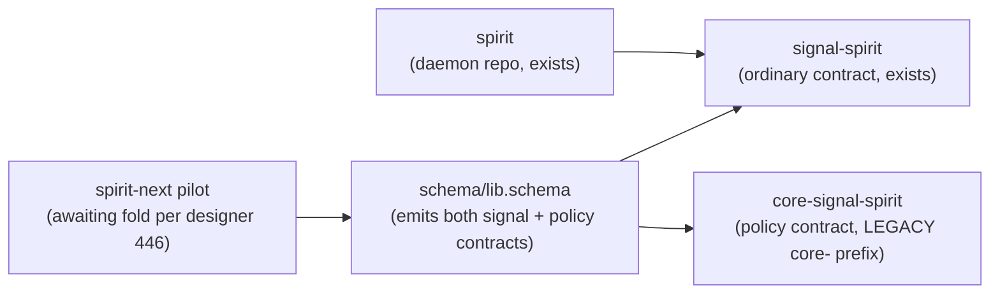
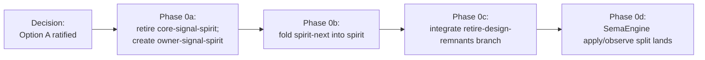

; spirit
[spirit-triad naming-gate policy-contract owner-signal meta-signal phase-0-gate]
[Item 1 of 6 open-queue decisions — present the spirit-triad naming gate with current repo state, the two options (Option A workspace convention `owner-signal-spirit` vs Option B proposed `meta-signal-spirit` rename per Spirit 290+299), code excerpts, trade-offs table, and recommendation. Decision gates designer 446 Phase 0 spirit fold.]
2026-06-01
designer

# 458 — Spirit-triad naming gate (item 1 of 6)

## TL;DR

The spirit triad has TWO question gates resolving as one decision:
1. **Does `core-signal-spirit` retire?** Yes — `core-` prefix is legacy naming the workspace has moved past. Confirmed by Spirit 293 + workspace pattern (10+ `owner-signal-*` repos exist; no other `core-signal-*` survives).
2. **What replaces it?** Either **`owner-signal-spirit`** (Option A — current workspace convention) OR **`meta-signal-spirit`** (Option B — proposed rename per Spirit 290 + 299).

**Recommendation: Option A — `owner-signal-spirit`** for this slice, defer Option B's workspace-wide rename until psyche explicitly ratifies it with Maximum magnitude. Reason: Spirit 290 (Decision) is **Minimum** magnitude; Spirit 293 (Clarification) explicitly says *"owner-signal remains the active policy-signal naming convention until an explicit rename lands"*; Spirit 299 (Clarification) calls it *"a tentative rename direction rather than a completed vocabulary change."* Phase 0 fold is not the right slice to land a fleet-wide rename — that's a separate workspace-wide cleanup pass.

## Current spirit-triad state



Five nodes; honors Spirit 1282. The `core-` prefix on `core-signal-spirit` is the only `core-signal-*` repo in the workspace today — confirmed by `ls /git/github.com/LiGoldragon/ | grep "^core-signal-"`. It needs to retire to one of two names; the rest of the workspace's policy contracts already use `owner-signal-X` (10+ instances: `owner-signal-agent`, `owner-signal-cloud`, `owner-signal-domain-criome`, `owner-signal-mind`, `owner-signal-orchestrate`, `owner-signal-persona`, `owner-signal-persona-spirit`, `owner-signal-repository-ledger`, `owner-signal-router`, `owner-signal-sema-upgrade`).

## The captured intent — three Spirit records compose the decision

| Record | Kind | Magnitude | Content (paraphrased) |
|---|---|---|---|
| 290 (2026-05-23 12:38) | Decision | Minimum | meta-signal is preferred over owner-signal as the policy contract name |
| 293 (2026-05-23 12:43) | Clarification | Medium | owner-signal remains the active policy-signal naming convention until an explicit rename lands |
| 299 (2026-05-23 12:43) | Clarification | Minimum | Meta-signal is the preferred candidate name over owner-signal, but this is a tentative rename direction rather than a completed vocabulary change |

The composition: psyche prefers `meta-signal` BUT explicitly says it's tentative AND that `owner-signal` remains active until the rename lands explicitly. Magnitudes Minimum and Medium — not Maximum. The psyche's pattern for fleet-wide renames is to ratify with Maximum + a dedicated rename slice; Phase 0 fold isn't that slice.

## Option A — `owner-signal-spirit` (current workspace convention)

```nota
; protocols/active-repositories.md would gain the row:
| owner-signal-spirit | github.com/LiGoldragon/owner-signal-spirit | Owner-only spirit policy contract: schema-edit authority, magnitude limits, deploy state. |
```

**Operator slice within Phase 0 fold**:
```sh
# 1. Create new repo
gh repo create LiGoldragon/owner-signal-spirit --private --add-readme

# 2. Mirror core-signal-spirit's structure (the scaffold is identical)
git clone /git/github.com/LiGoldragon/core-signal-spirit /tmp/owner-signal-spirit-scaffold
cd /tmp/owner-signal-spirit-scaffold
# rename references: core_signal_spirit → owner_signal_spirit; 
#                    core-signal-spirit → owner-signal-spirit
# preserve the schema/<contract>.schema content as-is

# 3. Update the spirit-next fold to depend on owner-signal-spirit not core-signal-spirit
# (schema source authoring + Cargo.toml dep edit)

# 4. Retire core-signal-spirit (archive marker per protocols/active-repositories.md cutover discipline)
```

**Impact**: ~30 minutes of operator-mechanical work + schema source authoring + Cargo.toml updates across spirit + signal-spirit + owner-signal-spirit. The spirit fold's existing Phase 0 estimate (1 operator-week) absorbs this without adding scope.

## Option B — `meta-signal-spirit` (proposed rename per Spirit 290 + 299)

```nota
; protocols/active-repositories.md would gain the row:
| meta-signal-spirit | github.com/LiGoldragon/meta-signal-spirit | Meta-signal spirit policy contract: schema-edit authority, magnitude limits, deploy state. |

; Plus a fleet-wide rename sweep across 10+ existing repos:
;   owner-signal-agent → meta-signal-agent
;   owner-signal-cloud → meta-signal-cloud
;   ... × 10 ...
```

**Operator slice (fleet-wide rename)**:
- Rename 10+ existing `owner-signal-X` repos to `meta-signal-X` (`gh repo rename` × N)
- Update every reference in: `AGENTS.md`, `protocols/active-repositories.md`, all `ARCHITECTURE.md` files, all `INTENT.md` files, all skill files, all Cargo.toml dependencies, all NOTA schema sources
- Cargo.toml `[package].name` updates across all renamed repos
- Re-vendor flake.lock pins across every consumer
- Workspace-wide sweep estimated at multi-operator-week

**Impact**: a substantial workspace-wide cleanup; not aligned with the Phase 0 fold's "one operator-week" scope; introduces a transition period where both old and new names coexist.

## Trade-offs table

| Dimension | Option A (`owner-signal-spirit`) | Option B (`meta-signal-spirit`) |
|---|---|---|
| **Workspace consistency** | Aligned with 10+ existing `owner-signal-*` repos | Inconsistent until fleet-wide rename completes |
| **Operator-week scope** | Fits inside Phase 0 fold | Requires separate multi-week rename slice |
| **Spirit-intent alignment** | Honors 293 ("remains active until explicit rename lands") | Honors 290 + 299 (preferred direction) |
| **Magnitude requirement** | Confirmed-default; no ratification needed | Tentative-direction; needs Maximum-magnitude ratification for fleet-wide work |
| **Reversibility** | Low cost to rename later if Option B becomes explicit | Hard to reverse mid-fleet |
| **Spirit fold blast radius** | Affects 3 repos (spirit + signal-spirit + new owner-signal-spirit) | Affects 14+ repos workspace-wide |

## Recommendation

**Option A — `owner-signal-spirit`** for Phase 0 fold.

The case:
1. **Spirit 293 explicitly says** `owner-signal` remains the active convention until an explicit rename lands. Phase 0 fold is the spirit fold, NOT the workspace-wide rename. Landing `owner-signal-spirit` honors 293 directly.
2. **Spirit 290 + 299 are Minimum magnitude.** The psyche pattern for fleet-wide renames is Maximum-magnitude ratification + dedicated rename slice. Phase 0 fold doesn't satisfy either.
3. **Option B locks in `meta-signal-` for spirit while every other component still uses `owner-signal-`** until the fleet-wide sweep completes. That's the worst-of-both: workspace inconsistency PLUS the rename burden later if the psyche decides Option B should NOT happen.
4. **Reversibility is cheaper for Option A**. If the psyche later ratifies Option B with Maximum, the fleet-wide sweep folds `owner-signal-spirit` along with the other ~10 `owner-signal-X` repos as ONE mechanical pass. Cleaner than landing `meta-signal-spirit` now and either (a) waiting for the fleet to catch up or (b) reverting.

The narrative for operator: *"adopt the current workspace convention for now; defer the meta-signal rename to a separate workspace-wide cleanup that ratifies the rename across all 11+ owner-signal repos with Maximum-magnitude psyche intent."*

## What this decision unblocks

Once you ratify Option A, Phase 0 fold can proceed:



Five nodes. The fold-week estimate from designer 446 absorbs Phase 0a as roughly 30 minutes of mechanical work + schema source authoring. Phase 0b-d carry the substance.

## What this decision DEFERS

The fleet-wide `owner-signal-*` → `meta-signal-*` rename remains as a future workspace-wide cleanup. Surface it as a future designer report + psyche ratification gate. Don't bind Phase 0 to it.

## Decision ask

**Ratify Option A — `owner-signal-spirit` for Phase 0 fold; defer fleet-wide meta-signal rename to a separate ratified workspace-wide pass?** Single yes/no closes this gate. If yes, operator's Phase 0 fold absorbs the rename of `core-signal-spirit` → `owner-signal-spirit` as the first mechanical step. If no — i.e. you want Option B — say so and I write a follow-up designer report scoping the fleet-wide rename slice.

## Cross-references

- Spirit records 290 (Decision Minimum), 293 (Clarification Medium), 299 (Clarification Minimum) — the captured intent on the rename direction.
- `protocols/active-repositories.md` — workspace component-triad inventory; 10+ `owner-signal-*` rows are the convention this decision aligns with.
- `skills/component-triad.md` §"Proposed rename: owner-signal → meta-signal" — the skill carries the rename uncertainty per Spirit 290 + 299.
- `reports/designer/446-next-stack-porting-research-2026-06-01/4-overview.md` §"The recommended first slice" — Phase 0 spirit fold this decision gates.
- `/git/github.com/LiGoldragon/core-signal-spirit/` — the legacy `core-`-prefixed repo to retire; live source confirmed at `Cargo.toml` line 1.
- `/git/github.com/LiGoldragon/spirit/` + `signal-spirit/` — the existing two legs of the triad.

## For the orchestrator

One decision gates Phase 0 fold: spirit-triad policy contract naming. Recommend Option A (`owner-signal-spirit`, current workspace convention) over Option B (`meta-signal-spirit`, proposed rename per Spirit 290+299). The Option B rename is real psyche preference but at Minimum/Medium magnitude with explicit "tentative direction" framing in 299 and "owner-signal remains active" framing in 293. Phase 0 fold isn't the right slice for the fleet-wide rename — that's separate work waiting for Maximum-magnitude psyche ratification. Option A is reversible (folds into Option B's fleet-wide sweep if/when it lands); Option B is partial commit that creates fleet inconsistency until the sweep completes. Decision ask is single yes/no; if yes, Phase 0a is the 30-minute mechanical `core-signal-spirit` → `owner-signal-spirit` rename inside the fold week. Item 1 of 6 from the open-queue list; items 2-6 follow as you ratify.
