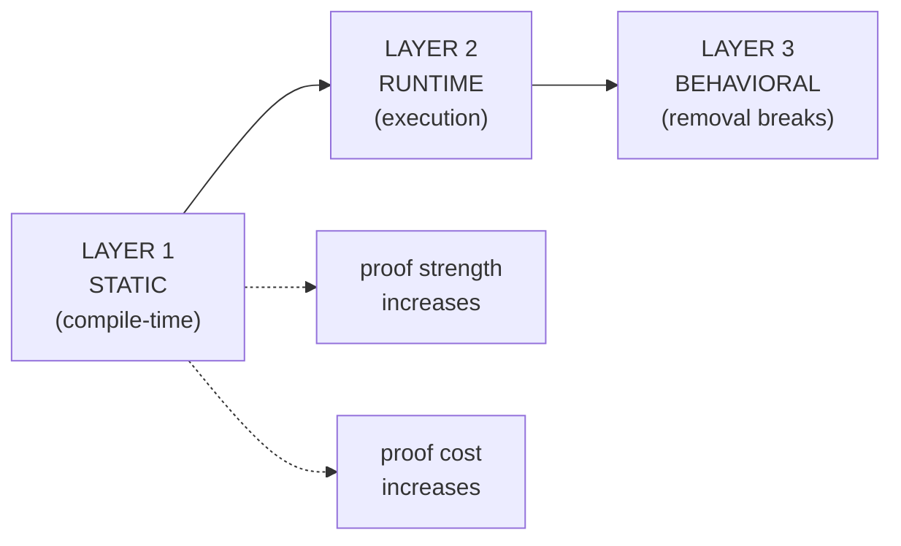
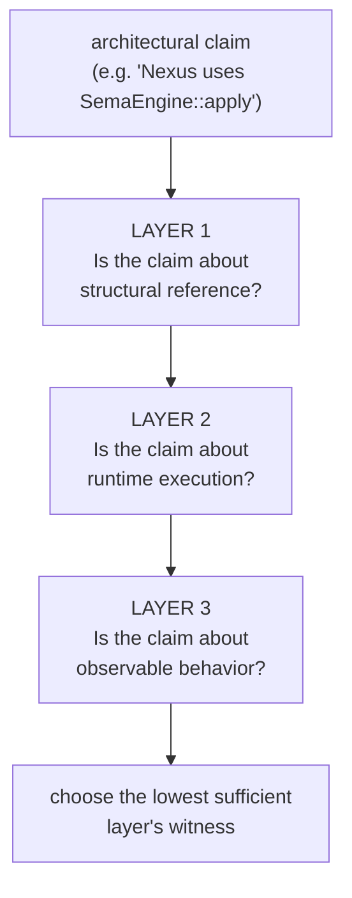

; spirit
[proof-of-usage witness-ladder static-runtime-behavioral architectural-truth tool-upgrade skill-upgrade]
[Designer research adapting psyche directive on operator's Spirit 1341 (positive grep deployment checks forbidden) — the deeper question is what witnesses actually prove code is USED, not just present. Three-layer model (static / runtime / behavioral), per-layer witness catalogue with costs and strength, two concrete tool-upgrade proposals (architectural-witness cargo subcommand + trait-call-site assertion macro), proposed skill upgrades to architectural-truth-tests.md.]
2026-06-01
designer

# 459 — Proof-of-usage witness research

## TL;DR

Spirit 1341 names what's forbidden (positive grep as deployment proof). This report builds the positive complement: **a three-layer witness model that lets every architectural claim about USAGE be backed by the cheapest sufficient witness**. The three layers are STATIC (type-system reference at compile time), RUNTIME (execution path taken under test or production), and BEHAVIORAL (removing the code breaks observable behavior). Each layer has its own witness catalogue with costs and strength ratings.

Concrete tool upgrade proposals: (1) **`architectural-witness` cargo subcommand** reading a `witnesses.toml` and running each declared witness sequentially with pass/fail reporting; (2) **`assert_trait_method_called!` macro** providing in-test call-site sinks for verifying trait-method usage without scaffolding fake implementations from scratch.

Skill upgrade proposal: extend `skills/architectural-truth-tests.md` with §"Proof-of-usage ladder" naming the three layers + per-layer witnesses with strength ratings + the choose-cheapest-sufficient discipline.

## The captured intent — Spirit 1341 + the deeper question

> **Spirit 1341 (Constraint Maximum)**: *"Positive grep deployment checks are not allowed as proof of a live architecture or behavior. A build or deployment check must compile, execute, round-trip, or otherwise exercise the real path; grep may only be used as a narrow negative guard to prove a retired symbol or forbidden pattern is absent."*

The psyche's research directive on this: *"It doesn't prove the architecture is live, it just proves it's in the file. We need to make sure it's actually used. Research this."*

The forbidden case is named. The POSITIVE complement — what witnesses honestly prove a thing is USED — is what this report researches.

## The three-layer model

Code can be "used" at three increasingly strong layers:



Five nodes; honors Spirit 1282. Layer 1 is cheap; Layer 3 is expensive. The discipline: pick the **cheapest sufficient layer** for each architectural claim. Don't over-witness; don't under-witness.

### Layer 1 — STATIC witnesses (compile-time type-system reference)

What they prove: the code exists AND the type system links it. They do NOT prove the code executes at runtime.

| Witness | Proves | Cost | When sufficient |
|---|---|---|---|
| `use T` statement compiles | Module references the type | Free | Crate-level usage claims |
| Compile-fail test (`trybuild`) | Removing T breaks compile | Free | Anti-pattern absence ("no shortcut compiles") |
| `static_assertions::assert_impl_all!(T: Trait)` | T implements Trait at compile time | Free | Trait surface honored |
| `let _: T = expression;` in test | Expression's type is T | Free | Type-level threading |
| Cargo dep assertion via `cargo metadata` | Crate depends on another | Free | Repository-boundary claims |
| Type alias / re-export check | Public surface includes T | Free | Public API stability |

**Strength**: LOW-MEDIUM. Proves structural reference but not execution. A method can be `use`d and the binary linked without the method ever being called at runtime — dead code that the compiler keeps because something references it.

**Critical anti-pattern (Spirit 1341)**: a positive grep is NOT a Layer 1 witness. Grep doesn't traverse the type system; it traverses strings. The type-system witness uses `use` or `static_assertions::assert_impl_all!` or similar, which actually requires the compiler to resolve the reference. **Grep proves text presence; compile-time witnesses prove type-system reference.**

### Layer 2 — RUNTIME witnesses (execution path taken)

What they prove: the code actually runs under test or production. They prove the call path is taken on specific inputs.

| Witness | Proves | Cost | When sufficient |
|---|---|---|---|
| Unit test calling the function | Function runs in test process | Cheap | Single-method behavior |
| Integration test through wire | Full call chain executes | Medium | Cross-module paths |
| Actor trace assertion | Specific mailbox traversed | Medium | Actor-system ordering |
| Recorder actor + trace pattern | Sequence of effects in correct order | Medium-strong | Order-sensitive flows |
| Process-boundary test | Real binary spawn + wire round-trip | Expensive | Cross-process claims |
| Code coverage (`cargo-tarpaulin`, `llvm-cov`) | Line/branch was executed | Expensive | Coverage gates on critical paths |
| Property test (proptest, quickcheck) | Many generated inputs all flow through | Medium | Invariant claims under input variation |

**Strength**: STRONG. Proves execution at the witness's call site. Doesn't prove the code is USED in production — only in the test that ran. Production usage requires either a production execution witness OR a behavioral witness (Layer 3).

**The honest discipline**: a Layer 2 witness proves the path is EXECUTABLE, not that production EXERCISES it. For most architectural claims this is sufficient (the claim is about the system's structure, not about which inputs reach a path). For coverage-gated claims, the witness is the coverage report itself.

### Layer 3 — BEHAVIORAL witnesses (removal breaks observable behavior)

What they prove: this code carries an observable effect — removing it changes the system's externally visible behavior.

| Witness | Proves | Cost | When sufficient |
|---|---|---|---|
| Mutation testing (`cargo-mutants`, `mutagen`) | Removing the code breaks tests | Very expensive | Behavioral usage on test suite |
| Removed-code test: deliberately break code, assert test failure | Same as mutation, manual | Cheap (per-instance) | Specific behavioral guards |
| Negative-presence test on output | Output's existence depends on code path | Cheap | Output-shaping claims |
| Backward compat test against checked-in fixtures | Code processes archived inputs correctly | Medium | Wire-stability claims |
| Differential testing (compare against known-good) | Two systems agree | Medium-expensive | Replacement-shape claims |

**Strength**: STRONGEST. If removing X breaks an observable behavior the test asserts, then X is genuinely USED — not just present. This is the highest-confidence form of proof but the most expensive to operate.

**The practical case**: mutation testing is the gold standard but expensive to run regularly. Most architectural claims don't need Layer 3 — Layer 2 (real execution under test) suffices. Layer 3 reserved for high-stakes invariants where the cost of dead-code-passing-as-live is large.

## The choose-cheapest-sufficient discipline

For each architectural claim, pick the cheapest witness that's STRONG ENOUGH:



Five nodes. The default is Layer 2 — most architectural claims involve a path being EXECUTABLE through the runtime, which is best proven by an integration test through the wire. Layer 1 is sufficient when the claim is purely structural (e.g. "the trait surface exposes only these methods"). Layer 3 is for high-stakes invariants where Layer 2's "executable" isn't sufficient and "removing this breaks behavior" is the real claim.

The forbidden case (positive grep) sits BELOW Layer 1 — it claims structural reference but doesn't prove it. Spirit 1341 enforces "if you want a structural-reference proof, use a real Layer 1 witness."

## Worked examples — applied to today's session

### Example 1 — "SemaWriteInput is generated by schema-rust-next"

The forbidden form: `grep -R "SemaWriteInput" src/schema/lib.rs`. Proves text presence; doesn't prove the type is generated by the emitter.

The Layer 1 form (cheapest sufficient):

```rust
// in tests/schema_emission.rs
#[test]
fn sema_write_input_type_emitted() {
    // Compile-time witness: import the generated type
    use my_crate::schema::lib::SemaWriteInput;
    let _: SemaWriteInput = SemaWriteInput::default();
}
```

This compiles ONLY if the emitter actually emitted the type as the import name + the constructor exists. Grep can't disambiguate "the name appears" from "the type is emitted with this exact shape." The `use` + constructor call does.

### Example 2 — "Nexus runtime uses SemaEngine::apply through the trait"

Layer 2 form via actor trace:

```rust
#[test]
fn nexus_calls_sema_engine_apply_via_trait() {
    let recorded_calls = std::sync::Arc::new(std::sync::Mutex::new(Vec::new()));
    let fake_sema = FakeSemaEngine::new(recorded_calls.clone());
    let mut nexus = Nexus::with_sema_engine(fake_sema);
    
    let _ = nexus.execute(test_nexus_input());
    
    let calls = recorded_calls.lock().unwrap();
    assert!(calls.iter().any(|c| matches!(c, RecordedCall::SemaApply(_))));
}
```

The witness sinks call records. The test proves Nexus actually called the trait method during execution — not that the name appears in source.

### Example 3 — "spirit-next daemon executes through the wire"

Layer 2 form via process-boundary test:

```rust
#[test]
fn daemon_round_trip_through_socket() {
    let fixture = DaemonFixture::start();
    let cli_reply = fixture.invoke_cli("(Record ...)");
    assert!(cli_reply.contains("RecordAccepted"));
    fixture.drop_socket();
}
```

The full real binary runs; the wire round-trips; the reply shape proves the path was executed end-to-end. This is the strongest cheap Layer 2 witness for "the daemon's runtime path is live."

## Two concrete tool-upgrade proposals

### Tool 1 — `architectural-witness` cargo subcommand

A binary that reads a workspace-local `witnesses.toml` file declaring architectural claims + their witness shape, then runs each witness sequentially with pass/fail reporting.

```toml
# witnesses.toml at workspace root
[[claim]]
name = "sema_write_input_emitted"
layer = "static"
witness_type = "compile_check"
test = "tests/schema_emission.rs::sema_write_input_type_emitted"

[[claim]]
name = "nexus_uses_sema_engine_via_trait"
layer = "runtime"
witness_type = "integration_test"
test = "tests/runtime_triad.rs::nexus_calls_sema_engine_apply_via_trait"

[[claim]]
name = "daemon_round_trips_through_socket"
layer = "runtime"
witness_type = "process_boundary"
test = "tests/process_boundary.rs::daemon_round_trip_through_socket"
```

The subcommand:
- Reads `witnesses.toml`
- Runs each test via `cargo test --test <file> -- <test-name>`
- Reports `claim_name: PASS | FAIL` with the layer + witness type
- Returns nonzero exit code if any FAIL

Integration: a flake check `nix flake check` that runs `cargo architectural-witness` produces the hermetic proof. Replaces ad-hoc grep checks with a declared witness catalogue.

### Tool 2 — `assert_trait_method_called!` macro

A test-only macro that wraps a trait impl with a call-site sink, removing the boilerplate of writing `FakeSemaEngine` from scratch.

```rust
// proposed macro shape
#[cfg(test)]
mod tests {
    use my_crate::SemaEngine;
    use architectural_witnesses::assert_trait_method_called;
    
    #[test]
    fn nexus_calls_sema_engine_apply() {
        let mut witness = trait_witness!(SemaEngine);
        let mut nexus = Nexus::with_sema_engine(&mut witness);
        nexus.execute(test_nexus_input());
        
        assert_trait_method_called!(witness, SemaEngine::apply);
    }
}
```

The macro generates a witness type implementing the trait with call recording. The assertion checks the call log. Compared to hand-written `FakeSemaEngine`: zero scaffolding per trait, uniform interface across the workspace.

**Realistic implementation**: this could be `mockall` with a thin wrapper, or a workspace-local derive crate that adds `#[derive(TraitWitness)]` to traits.

## Skill upgrade proposal — `skills/architectural-truth-tests.md`

Operator added §"No positive grep as deployment proof" at line 47 — the negative discipline. This report's research adds the positive complement. Proposed new section:

### §"Proof-of-usage ladder — choose cheapest sufficient"

Three layers (STATIC / RUNTIME / BEHAVIORAL); per-layer witness catalogue with strength + cost; the choose-cheapest-sufficient discipline; worked examples. Inline the substance from this report's §"The three-layer model" + §"The choose-cheapest-sufficient discipline" + §"Worked examples".

The skill becomes the canonical positive-witness vocabulary; reports cite it; new tests are written against the named witness types.

## Concrete next-action recommendation

1. **Append §"Proof-of-usage ladder" to `skills/architectural-truth-tests.md`** — the three-layer model + per-layer witnesses + choose-cheapest-sufficient discipline. Inline the substance per `skills/skill-editor.md` discipline; no report references in the skill body.
2. **Add a workspace-wide `architectural-witnesses.toml` pattern** — name it as the next-generation replacement for ad-hoc test naming conventions; surface it in `skills/architectural-truth-tests.md` §"Witness catalogue".
3. **Consider the cargo subcommand + assert-macro tools as future operator-bead work** — they're tool upgrades, not blocking the skill discipline. File as future bead targets once the skill discipline is established.

## Open questions

Five for follow-up:

1. **Mutation testing as a workspace default?** Layer 3 is the strongest witness but expensive. Worth a focused designer report on which architectural claims warrant mutation testing.
2. **Coverage gates as architectural witnesses?** Should specific paths require coverage proof in the witness catalogue?
3. **Workspace policy on `assert_called!` vs hand-written fakes?** The macro tool would standardize; hand-written fakes are more flexible. Trade-off worth deciding workspace-wide.
4. **Architectural-witness cargo subcommand — build or borrow?** Could be a thin wrapper over `cargo test --test`. Worth a focused operator slice to scope the build.
5. **How does the proof-of-usage discipline interact with the Nix flake check substrate?** Each `cargo architectural-witness` invocation could be a flake check; the relationship between flake checks and the witness catalogue needs explicit framing.

## Cross-references

- Spirit 1341 (Constraint Maximum) — the negative discipline this report builds the positive complement to.
- `skills/architectural-truth-tests.md` — the existing canonical home; operator added §"No positive grep as deployment proof" at line 47 today.
- `skills/testing.md` — operator added §"No positive grep deployment checks" at line 39 today.
- `skills/skill-editor.md` §"Skills never reference reports" — the discipline that makes the substance migration possible.
- Today's designer audits (450, 451, 452, 455) all used Layer 2 witnesses; the patterns here distill what worked across those.
- Operator 273 §"Pipeline Witness" + designer 455's 18 constraint tests — both demonstrated Layer 2 witness shapes.

## For the orchestrator

Operator's Spirit 1341 captures the negative discipline (positive grep forbidden). This research builds the positive complement: a three-layer model (STATIC / RUNTIME / BEHAVIORAL) with per-layer witness catalogue + the choose-cheapest-sufficient discipline. Layer 1 (compile-time type-system reference) replaces positive grep with `use` statements + `static_assertions::assert_impl_all!`; Layer 2 (runtime execution) is the workspace's default through integration tests + actor traces + process-boundary tests; Layer 3 (behavioral) reserves mutation testing + removed-code tests for high-stakes invariants. Two tool-upgrade proposals: `architectural-witness` cargo subcommand reading a `witnesses.toml` catalogue, and `assert_trait_method_called!` macro for trait-method call-site assertions without per-trait scaffolding. Skill upgrade: append §"Proof-of-usage ladder" to `skills/architectural-truth-tests.md`. The recommendation is to add the skill section now and file the tool upgrades as future operator beads — the skill discipline is the load-bearing change; the tools accelerate it. Five open questions for follow-up around mutation testing defaults, coverage gates, and the cargo subcommand build/borrow decision.
