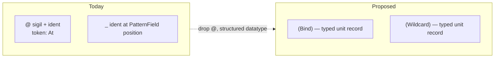

# `Bind` and `Wildcard` as typed records — `@` dropped permanently

Status: decision landed (user confirmed 2026-05-08)
Author: Claude (designer)

The user confirmed "drop `@` permanently" and added a
sharper move: *"what At was doing can be done with a
properly structured datatype."*

That's the right shape. Bind becomes the record `(Bind)`;
wildcard becomes the record `(Wildcard)` (recommended) or
remains the ident `_` (shortcut option). PatternField<T>
keeps its three runtime variants; their wire form is now
**typed records**, not special tokens. The `@` token leaves
the grammar entirely.

This report supersedes designer/45 §3's "bare-ident-as-bind"
convention. Designer/45's argument that nexus needs no
parser of its own is unchanged — the typed-record approach
is *also* pure nota; the only delta is that bind/wildcard
appear as records `(Bind)` / `(Wildcard)` rather than as
bare idents matching the schema field name.

---

## 0 · TL;DR



| Concept | Today | Designer/45 (bare-ident) | Designer/46 (typed record) |
|---|---|---|---|
| Bind | `@name` (`@` token + ident) | `name` (bare ident matching schema field name) | **`(Bind)`** (typed record, no payload) |
| Wildcard | `_` (ident at PatternField position) | `_` (same — unchanged) | **`(Wildcard)`** (typed record, no payload) — or `_` as shortcut |
| Token vocabulary | 12 (incl. `@`) | 11 | **11** |
| Special tokens at PatternField positions | `@`, `_` | `_` | **none** (just record dispatch) |
| Codec | nota + nexus extras | nota only (with bind convention) | **nota only** (with reserved record heads) |
| Ambiguity case | none | literal-match-of-bare-ident-as-string | **none** |

The typed-record shape is **strictly cleaner** than
designer/45's bare-ident convention:
- No "is this an ident matching the schema field name?"
  decode-time comparison.
- No literal-match-of-bare-ident-as-string ambiguity case.
- Universal — works for any `T` without convention rules.
- Pure typed records throughout — fits the "everything is
  a typed record" discipline.

Trade: slightly more verbose at the wire (`(Bind)` is six
characters vs four for `name` or `@to`). For a workspace
that already trades verbosity for type-honesty everywhere
else (positional fields, no field labels, typed slots, no
agent-minted IDs), this is the consistent move.

---

## 1 · The structured datatype

`PatternField<T>` is unchanged at the type level:

```rust
pub enum PatternField<T> {
    Wildcard,
    Bind,
    Match(T),
}
```

Three variants: don't-care, capture-by-position,
literal-value. The change is purely in the wire form.

Two unit-struct types provide the wire shape for the
non-Match variants:

```rust
#[derive(NotaRecord, …)]
pub struct Bind;

#[derive(NotaRecord, …)]
pub struct Wildcard;
```

`PatternField<T>`'s `NotaEncode` / `NotaDecode` impls
dispatch on the wire form:

```rust
impl<T: NotaDecode> NotaDecode for PatternField<T> {
    fn decode(decoder: &mut Decoder<'_>) -> Result<Self> {
        // Peek: is the next token an opening paren, and if so, what's the head?
        match decoder.peek_record_head_or_value()? {
            Some("Bind")     => { decoder.expect_record_head("Bind")?;     decoder.expect_record_end()?; Ok(PatternField::Bind) }
            Some("Wildcard") => { decoder.expect_record_head("Wildcard")?; decoder.expect_record_end()?; Ok(PatternField::Wildcard) }
            _                => Ok(PatternField::Match(T::decode(decoder)?)),
        }
    }
}
```

The `peek_record_head_or_value` helper returns
`Some(head_name)` if the next tokens are `(<PascalIdent>` and
`None` otherwise. Conveniently, this is what
nota-codec's `peek_record_head` already does — the only
change is making it non-erroring when the next token isn't
`(` (so the fall-through to `T::decode` is clean).

Encoding is symmetric:

```rust
impl<T: NotaEncode> NotaEncode for PatternField<T> {
    fn encode(&self, encoder: &mut Encoder) -> Result<()> {
        match self {
            PatternField::Bind     => { encoder.start_record("Bind")?;     encoder.end_record() }
            PatternField::Wildcard => { encoder.start_record("Wildcard")?; encoder.end_record() }
            PatternField::Match(value) => value.encode(encoder),
        }
    }
}
```

---

## 2 · Wire-form comparison

| What | Today (with `@`) | Proposed (typed records) |
|---|---|---|
| Bind one field | `(NodeQuery @name)` | `(NodeQuery (Bind))` |
| Wildcard | `(NodeQuery _)` | `(NodeQuery (Wildcard))` |
| Literal match | `(NodeQuery "User")` | `(NodeQuery "User")` (unchanged) |
| Mixed three-field | `(EdgeQuery 100 @to Flow)` | `(EdgeQuery 100 (Bind) Flow)` |
| Match request | `(Match (EdgeQuery @from @to @kind) Any)` | `(Match (EdgeQuery (Bind) (Bind) (Bind)) Any)` |
| All-wildcard query | `(NodeQuery _)` | `(NodeQuery (Wildcard))` |
| Constrain | `(Constrain [(EdgeQuery 100 @to Flow) (NodeQuery @to)] (Unify [to]) Any)` | `(Constrain [(EdgeQuery 100 (Bind) Flow) (NodeQuery (Bind))] (Unify [to]) Any)` |

The Constrain example: each `(Bind)` captures the
field-at-its-position; the `(Unify [to])` references those
binds by the schema field name (the schema position carries
the field's identity). The wire form is uniform — every
pattern marker is a record.

---

## 3 · Wildcard: `(Wildcard)` or `_`?

The user's structured-datatype move was named for `@`
specifically. Wildcard didn't get a comment. Two options:

**Option Y: uniform `(Wildcard)`.** Both bind and wildcard
are typed unit records. Pure structure throughout. Slightly
more verbose at the wire.

**Option X: mixed `(Bind)` + `_`.** Bind is a typed record;
wildcard stays as the bare ident shortcut. Concise for the
common case (wildcards are frequent in patterns).

**Designer's lean: Option Y (uniform).** Reasons:
- The user's preference for typed structure suggests they'd
  pick the uniform shape.
- Mixed (Option X) leaves an asymmetry — one variant is a
  record, the other is a bare ident. The asymmetry is small
  but noisy.
- Verbosity cost is small in practice (`(Wildcard)` is 10
  chars vs `_` is 1 char; for a query with 3 wildcard
  fields, the cost is 27 chars vs 3, which is a real
  difference but still readable).

Worth a one-line user confirmation before locking. If the
user picks X (mixed), `_` stays as the wildcard shortcut.

---

## 4 · Why this is structurally cleaner than designer/45 §3

Designer/45 proposed: at PatternField positions, bare ident
matching schema field name = bind. The decoder reads the
schema field name from context, peeks an ident, compares.

The structural problems with that:

1. **Ambiguity case.** If the schema field is `name:
   PatternField<String>` and you want to literally match the
   string `"name"`, the bare ident `name` would be
   interpreted as bind. Resolution: quote the literal
   (`"name"`). Workable but a footgun — the wire form looks
   the same as a normal string, the meaning changes.
2. **Convention-based dispatch.** The decoder needs to know
   the schema field name at decode time and compare. Works
   but requires the NexusPattern derive to thread the field
   name through. (Today's codec already does this; not
   harder, but conceptually a coincidence rather than a
   structural fact.)
3. **Two ident-shaped concepts at the same position.** Bare
   ident at PatternField<String> is either bind or literal
   match depending on whether it spells the schema field
   name. Reading the wire form requires knowing the schema.

The typed-record approach has none of these:

1. **No ambiguity.** `(Bind)` is unambiguously a record;
   `"name"` is unambiguously a string. They look different.
2. **Structural dispatch.** The decoder peeks for `(Bind)`
   or `(Wildcard)` records explicitly. The schema field
   name is irrelevant to the dispatch.
3. **One concept per wire shape.** `(Bind)` always means
   bind. `"text"` always means string. `100` always means
   integer. The wire form's structure is its meaning.

This is the same discipline as Tier 0's grammar lock:
*structure is records, sequences, primitives*. The user's
intuition extends the discipline: bind and wildcard are
**records**, not special tokens or special idents. They
fit.

---

## 5 · Reserved record heads

`Bind` and `Wildcard` become **workspace-reserved record
head names**. A domain type cannot define a record kind
with these names — at PatternField positions, the codec
dispatches on the head ident, and a domain `(Bind …)`
record would conflict.

The reservation is narrow: it applies at PatternField
positions only. Outside PatternField positions, the codec
doesn't look for `Bind` or `Wildcard` heads — it just
decodes whatever the receiving type expects.

For correctness, the workspace-wide rule is the simplest:
**no domain type defines record kinds named `Bind` or
`Wildcard`.** Worth one line in
`~/primary/skills/contract-repo.md` once the rename
lands.

---

## 6 · What changes — the implementation cascade

Per designer/45 §7 + this report:

| Layer | Change |
|---|---|
| **Grammar (nexus/spec/grammar.md)** | §1: Token enum loses `At`; vocabulary becomes 11. §4 Patterns: rewrite to use `(Bind)` and `(Wildcard)` (or `_` if shortcut chosen). §5/§6 examples: update from `@<name>` to `(Bind)` everywhere. §7 dropped-forms: add `@<name>` → `(Bind)` row. |
| **Lexer (nota-codec/src/lexer.rs)** | Drop the `At` variant from `Token`. Drop the lex path that produces it. The `@` byte becomes an `UnexpectedChar` lexer error in both dialects (and `Dialect` itself can be retired per designer/45). |
| **Decoder (nota-codec/src/decoder.rs)** | Remove `peek_is_bind_marker`, the `decode_pattern_field`'s `peek_is_bind_marker` branch, the `expected_bind_name` parameter (the schema field name no longer participates in decode dispatch — only in upstream usage like `Unify`). Add a `peek_record_head_or_none` helper that returns `Option<String>`. |
| **Encoder (nota-codec/src/encoder.rs)** | Remove `write_bind`. The `encode_pattern_field` becomes `start_record("Bind") + end_record()` for Bind, `start_record("Wildcard") + end_record()` for Wildcard, and `value.encode(self)` for Match. (Or just delete `encode_pattern_field` — the `NotaEncode` impl on `PatternField<T>` is now standard structured encoding, no codec extension needed.) |
| **PatternField type** | Move from `nota-codec/src/pattern_field.rs` to `signal` (or `signal-core`) — wherever typed runtime records live. The type's `NotaDecode`/`NotaEncode` impls are standard, no codec extension trait needed. (Per designer/45 §5: `nexus-codec` extraction becomes moot.) |
| **NexusPattern derive** | Becomes a regular nota-derive — it just emits standard `NotaRecord`-shaped codec for a struct whose fields are `PatternField<T>`. The bind-name validation goes away (no `WrongBindName` error path). |
| **Errors (nota-codec/src/error.rs)** | Drop `WrongBindName`, `PatternBindOutOfContext`. They're not reachable in the new shape. |
| **Designer/31 §5 lock** | Revises from 12 tokens to 11. |
| **Designer/26 §7 token list** | Drop `At`. Revise to 11 tokens. |
| **Designer/38 §0 / §3** | Update token-count references and pattern table to use `(Bind)` / `(Wildcard)`. |
| **Tests (`nexus_pattern_round_trip.rs`)** | Update assertions: `encode_text` of `PatternField::Bind` produces `(Bind)`; of `PatternField::Wildcard` produces `(Wildcard)`. |

For operator: this report's §6 + designer/45 §7 are the
combined implementation list. Most edits are mechanical
substitutions; the lexer/decoder simplifications net code
loss.

---

## 7 · Two choices for the user before operator implements

| # | Choice | Default lean |
|---|---|---|
| 1 | Wildcard wire form | **`(Wildcard)`** (uniform with Bind) — Option Y in §3 |
| 2 | Move `PatternField<T>` to `signal-core` (universal) or `signal` (criome-specific) | **`signal-core`** — universal pattern type for any signal-* layered crate |

Both are small. Worth confirming before the rename pass
lands so operator doesn't have to re-edit.

---

## 8 · Status of preceding reports

| Report | Section | Status after this decision |
|---|---|---|
| designer/26 | §7 grammar Tier 0 | **Update**: drop `At`; revise to 11 tokens |
| designer/31 | §5 grammar lock at 12 tokens | **Update**: revise to 11 tokens; this report extends the same "delimiters earn their place" discipline |
| designer/40 | §10 examples | **Update**: `@to` → `(Bind)` etc. |
| designer/45 | §3 bare-ident bind convention | **Superseded by §1 of this report** (typed-record approach is cleaner); §1 of designer/45 (the `@`-drop confirmation) and §5 (codec extraction is moot) stand |

The arc closes neatly: every drop has been by the same
test ("does this delimiter / sigil / token earn its place
when records and sequences can express the same thing?").
`@` doesn't, and the typed-record approach makes that
visible.

---

## 9 · See also

- `~/primary/reports/designer/26-twelve-verbs-as-zodiac.md`
  §7 — token list to update.
- `~/primary/reports/designer/31-curly-brackets-drop-permanently.md`
  §5 — token-count lock; revises 12 → 11.
- `~/primary/reports/designer/45-nexus-needs-no-grammar-of-its-own.md`
  §7 — implementation cascade complementing §6 of this
  report.
- `~/primary/skills/language-design.md` §"Delimiters earn
  their place" — the discipline this drop applies.
- `~/primary/skills/contract-repo.md` — host for the
  workspace-reserved-record-heads rule (§5 of this report).
- `/git/github.com/LiGoldragon/nexus/spec/grammar.md`
  §1, §4, §5–§7 — the spec sections operator updates.
- `/git/github.com/LiGoldragon/nota-codec/src/lexer.rs`
  — drop `At` variant + lex path.
- `/git/github.com/LiGoldragon/nota-codec/src/decoder.rs`
  — drop `decode_pattern_field`'s bind-marker branch;
  rewrite `PatternField<T>::decode` for record-form
  dispatch.
- `/git/github.com/LiGoldragon/signal/src/pattern.rs`
  — move `PatternField<T>` to `signal` (or
  `signal-core`); drop the re-export from nota-codec.

---

*End report.*
