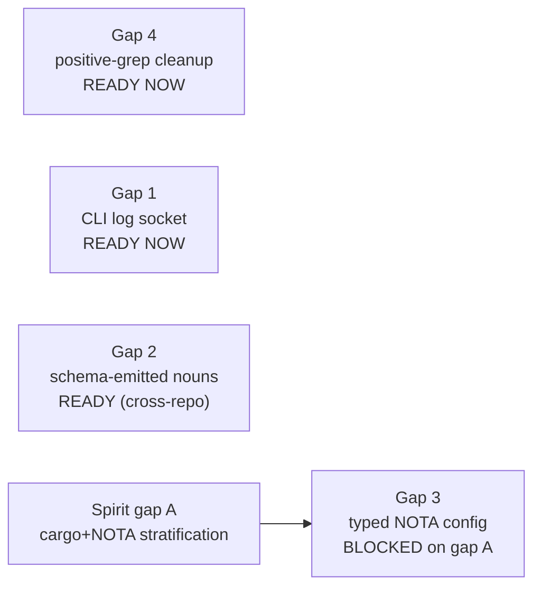
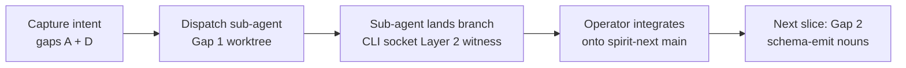
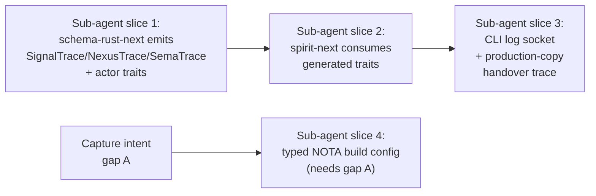

; designer
[testing-trace operator-audit intent-gaps cross-pollination cli-log-socket schema-emission nota-build-config positive-grep]
[Audit of operator's spirit-next 5fc96397 testing-trace landing + operator reports 275/276/277, against captured intent (Spirit 1343-1351 + 1352-1355). Identifies what aligns with intent, what stays gapped, and applies the cross-pollination methodology (Spirit 1364) to surface four intent gaps that block clean sub-agent implementation of the remaining named work. Concludes with sub-agent training readiness ranking + recommended next prototype-proving slice per Spirit 1355 depth-first discipline.]
2026-06-01
designer

# 463 — Operator trace implementation: audit, intent gaps, sub-agent readiness

## TL;DR

Operator's testing-trace slice (`spirit-next` 5fc96397 + report 277) honors the high-substance portion of Spirit 1343-1351 cleanly: all seven engine-trait method calls emit typed events carrying generated schema payloads; tests assert real runtime call order, not name presence; rkyv round-trip works; rejection-path branches correctly. The slice is honest about its scope — operator's "Remaining Gaps" section names four un-landed pieces.

The audit's substantive finding is **not** in the four named implementation gaps — those are designed clearly enough in operator 275 to dispatch sub-agents. The substantive finding is **four intent gaps** that block the cleanest, most elegant form of those implementations. Each gap is filled by cross-pollinating a pattern that already exists elsewhere in the workspace intent (Spirit 1364 methodology).

**Late-update — convergence with operator 278 + Spirit 1365 ratification**: this audit and operator's `reports/operator/278-gap-vision-and-subagent-implementation-brief-2026-06-01.md` converged on the same four gaps + the same gap-D-shape. The psyche ratified the direction as **Spirit 1365 (Correction Maximum, 2026-06-01 15:49:27)** — *"Testing trace must not be modeled merely as a hand-written or generated event enum in spirit-next. Traceability should be expressed as traits on schema-derived interfaces and, where possible, on the Signal, Nexus, and SEMA actor traits themselves."* Gap D is therefore canonically captured at strongest authority (Maximum + Correction); the audit's standing recommendation flips: **the next prototype-proving slice is schema emission of trace traits + actor traits + spirit-next consumption** per operator 278's brief, NOT CLI log socket first. The CLI log socket follows once the emitted trait surface lands. See Section 8 for the convergence + actor-trait shape.

After the remaining intent gaps (A — cargo+NOTA stratification — and B — triad placement) are captured, three of the four implementation gaps become sub-agent-ready; the fourth (typed NOTA build config, Gap 3) needs gap A first.

**Recommendation** (updated post-convergence): capture intent gap A as Spirit Principle High; dispatch designer or worker sub-agent on the schema-emit-then-spirit-next-consume slice per operator 278's brief — the depth-first next prototype-proving slice per Spirit 1355.

## Frame

The audit asks two questions per the psyche's prompt:

1. **Does operator's work match captured intent?** Where it doesn't, that's an *implementation gap*.
2. **Is the intent itself clearly stated, or can patterns from elsewhere in intent project onto under-articulated areas?** Where intent is implicit, that's an *intent gap*; per Spirit 1364, fill it by cross-pollination from established patterns.

Surface for the audit:
- `spirit-next` commits `e4e5035` (testing trace witness) + `5fc9639` (renames to runtime-phase event names), at main HEAD.
- `reports/operator/275-schema-runtime-instrumentation-log-socket-prototype.md` — operator's prototype design.
- `reports/operator/276-schema-thread-context-maintenance-2026-06-01.md` — context maintenance + immediate queue.
- `reports/operator/277-spirit-next-testing-trace-implementation-2026-06-01.md` — implementation closeout.
- Spirit records 1340-1342 (positive-grep ban Maximum), 1343-1351 (testing-build logging Maximum × 5 + High × 3), 1352-1355 (operator-on-main/designer-on-worktree High × 4), 1357 (engine-trait live-landing High), 1361 (engine method-count matches wire-events High), 1364 (cross-pollination methodology Medium).

## Section 1 — What operator landed, what aligns with captured intent

### What landed

The testing-trace cargo feature on `spirit-next` adds:

```rust
pub enum TraceEvent {
    SignalAdmitted   { origin_route, input: Input },
    SignalRejected   { origin_route, validation_error: ValidationError },
    SignalReplied    { origin_route, output: Output },
    NexusEntered     { origin_route, input: NexusInput },
    NexusDecided     { origin_route, output: NexusOutput },
    SemaWriteApplied { origin_route, input: SemaWriteInput,  output: SemaWriteOutput },
    SemaReadObserved { origin_route, input: SemaReadInput,   output: SemaReadOutput  },
}
```

with a `TraceLog` holder (`Arc<Mutex<Vec<TraceEvent>>>`), `Engine::new_with_trace`, and `#[cfg(feature = "testing-trace")]` emission points at exactly the seven engine-method call sites. The test asserts the full ten-event sequence for a Record-then-Observe pair and confirms rkyv round-trip works.

### Alignment matrix against Spirit 1343-1351

| Spirit record | Kind / Magnitude | What it asks for | Operator landed |
|---|---|---|---|
| 1343 | Decision Maximum | optional testing instrumentation surface emitting structured trace events to a logging socket | engine emission ✓; **logging socket ✗** (in-process Vec) |
| 1344 | Decision High | testing-mode logging configured by typed NOTA config; CLI as log surface | typed Rust struct ✓; **NOTA config ✗**; **CLI binding ✗** |
| 1345 | Clarification High | Signal admit/reply, Nexus execute/decide, SEMA write apply / SEMA read observe each emit | ALL SEVEN emit ✓ |
| 1346 | Decision Maximum | schema-emitted objects have optional-compilable logging hooks at the macro/emitter layer | **hand-written in spirit-next ✗** |
| 1347 | Decision Maximum | CLI is the log surface | **no CLI binding yet ✗** |
| 1348 | Decision Maximum | build configuration is a NOTA struct | **cargo feature only ✗** |
| 1349 | Principle Maximum | testing-build logging socket is the canonical Layer 2 runtime witness | Layer 2 runtime witness ✓ (typed events from real method calls); **socket form ✗** |
| 1350 | Decision Maximum | each engine carries optional test-build code that self-verifies it ran | ALL THREE engines emit ✓; tests assert all three fired ✓ |
| 1351 | Clarification High | Signal reply is brief acknowledgement with identifier | out of scope for this slice |

The pattern: high-substance verbs of intent (Signal/Nexus/SEMA self-verify via typed events) are FULLY HONORED. The transport / configuration / emission-layer verbs (socket, CLI, NOTA, schema-emit) are CONSISTENTLY DEFERRED. This is a clean depth-first slice — operator proved the in-process witness shape end-to-end before tackling the outer layers. Per Spirit 1355's depth-first prototype-proving discipline, that's the right shape.

### Implementation gaps (operator's own list, confirmed)

The four gaps operator named in report 277 §"Remaining Gaps" map cleanly to intent records:

1. **CLI log socket** — Spirit 1343 + 1347 + 1349 ask for this; not built.
2. **Schema-emitted trace nouns** — Spirit 1346 asks for this; the nouns are currently hand-written in `spirit-next/src/trace.rs`.
3. **Typed NOTA build/test config** — Spirit 1348 asks for this; cargo feature `testing-trace` is the only switch today.
4. **Positive-grep cleanup carried forward** — Spirit 1340-1342 banned positive grep as deployment proof; `spirit-next/flake.nix` is now clean per operator's cleanup, but `schema-rust-next/flake.nix` still has positive-grep witness checks named in operator 274 (carried forward as known follow-up).

These are honest implementation gaps. Operator's report is accurate.

## Section 2 — Intent gaps surfaced via cross-pollination

Per Spirit 1364: when intent on a question is implicit, look for an established pattern elsewhere in the intent and project it onto the gap.

### Intent gap A — the cargo-feature ↔ NOTA-config layer split is not stated

**Where intent is silent.** Spirit 1346 says "feature-gated code at the macro/emitter layer" (cargo-feature shape). Spirit 1348 says "build configuration is a NOTA struct" (NOTA shape). The two are perfectly consistent in operator's mind (visible in operator 275 §"Build Configuration Shape" — cargo feature for compile-time inclusion, NOTA struct for runtime configuration). But the *relationship* between the two layers is not captured in Spirit.

**The pattern that fills it.** The **single-argument rule** (AGENTS.md hard override, `skills/component-triad.md` §"The single argument rule"). Every component binary takes exactly one NOTA argument. The cargo feature lives *below* that argument layer — it controls *which binary exists* (compile-time-existence). The NOTA argument controls *what the binary does at runtime* (runtime configuration).

Apply to testing-build:
- Cargo feature `testing-trace` controls whether trace-emitting code is compiled in at all.
- NOTA build/configuration struct controls whether the daemon emits trace events, where to, with what filters — at runtime.
- A production binary built without `testing-trace` cannot be reconfigured into emitting traces by any NOTA argument; a `testing-trace`-built binary can be configured by NOTA to enable or disable emission and to bind to a particular socket.

**Capture candidate** (Principle High): *"Compile-time and runtime configuration are stratified — cargo features control which code exists in the binary at all (compile-time existence); NOTA configuration drives runtime behavior of the existing code. Optional instrumentation lands as a cargo feature for compile-time inclusion + a typed NOTA configuration field for runtime control."*

### Intent gap B — testing instrumentation's place in the component triad is not stated

**Where intent is silent.** The component triad pattern (daemon + `signal-<component>` + `owner-signal-<component>`) is workspace-canonical (AGENTS.md hard override, `skills/component-triad.md`). Spirit 1326-1336 + 1357 anchor engine traits inside the daemon repo's schema. But the testing instrumentation surface — the trace nouns + their transport + the policy that decides what gets emitted — is undefined in the triad structure.

**The pattern that fills it.** The triad itself, projected onto the instrumentation surface:
- **Trace nouns** (`TraceEvent`, `TraceLog` interface, `OriginRoute` references, payload type bindings) are *signal contract* — they describe the testing-mode wire shape. Belongs in `signal-<component>` (or a `signal-<component>-trace` sibling if size warrants the split).
- **Trace transport** (length-prefixed rkyv framing over a unix socket) is *daemon implementation* — belongs in the daemon repo.
- **Trace policy** (which engines emit; which events are filtered; the trace socket path; production-vs-testing mode selection) is *owner-signal* — it's the policy/authority signal, not the user-data signal. Belongs in `owner-signal-<component>` (or a `owner-signal-<component>-trace` sibling).

This rhymes with the engine-trait architecture from Spirit 1326-1336 + skills/component-triad.md §"Runtime triad engine traits" — Signal/Nexus/SEMA each get their own typed contract; the testing-trace surface gets ITS own typed contract too, living in the triad's signal legs.

**Capture candidate** (Decision High): *"Testing instrumentation surface follows the component triad pattern — trace nouns and the testing-wire shape live in signal-<component>; trace transport implementation lives in the daemon repo; trace policy (emit/filter/socket-path) lives in owner-signal-<component>. Schema-rust-next emits the trace types from the signal contract source, behind a cargo feature for compile-time inclusion."*

### Intent gap C — trace payload completeness vs slim-acknowledgement

**Where intent is silent.** Spirit 1351 says Signal replies are typically brief acknowledgements with an identifier into SEMA. The current `TraceEvent` payloads carry FULL `Input` / `Output` / `NexusInput` / `NexusOutput` values — diagnostic data is complete-inline. Whether trace events should follow Signal's slim-acknowledgement convention (small wire, durable detail elsewhere) or the SEMA-write convention (full payload at the wire) is unstated.

**The pattern that fills it.** The **Signal-vs-SEMA payload-shape distinction** (Spirit 1351 + the broad triad architecture). Signal is small and identifier-shaped; SEMA carries durable detail. Apply to trace:
- Option C1: trace events are slim — emit `MessageIdentifier` + `OriginRoute` + event phase tag + `StateDigest`. Full Input/Output payloads stay in the SEMA database (already keyed by `RecordIdentifier`) or in a trace-detail sema-like store.
- Option C2: trace events are full — carry complete schema payloads inline, as current implementation. Optimizes for self-contained witness records (tests can assert payload content without secondary lookups).

The current implementation chose C2 (full payload), which is more verbose on the wire but lets tests assert payload structure directly. For testing-build the cost-benefit favors C2 (test-only path, payload size doesn't matter); for any future production-debug trace mode, C1 would dominate.

**Capture candidate** (Clarification Medium): *"Testing-trace events carry full schema payloads inline for self-contained test assertions; future production-debug trace modes (if ever introduced) should follow the Signal slim-acknowledgement pattern instead — small event records with SEMA-style identifier lookups for full detail."* (Decision can be deferred; just naming the present choice and the future-shift trigger.)

### Intent gap D — trace as cross-cutting concern vs trace as fourth engine + actor-trait expansion

**Status: RATIFIED as Spirit 1365 (Correction Maximum, 2026-06-01 15:49:27)** — *"Testing trace must not be modeled merely as a hand-written or generated event enum in spirit-next. Traceability should be expressed as traits on schema-derived interfaces and, where possible, on the Signal, Nexus, and SEMA actor traits themselves, so instrumentation belongs to the interface/actor contract rather than to a local side vocabulary."*

The psyche ratified at Maximum/Correction strength — strongest possible authority + correctional kind — covering both shapes this audit cross-pollinated:

1. **Trace-as-trait-on-schema-derived-interfaces**: peer to `SignalEngine`, `NexusEngine`, `SemaEngine`. Sketch per operator 278 §"Gap 1":

   ```rust
   #[cfg(feature = "testing-trace")]
   pub trait SignalTrace {
       fn signal_admitted(&self, origin_route: &OriginRoute, input: &Signal<Input>) -> TraceEvent;
       fn signal_replied(&self, origin_route: &OriginRoute, output: &Signal<Output>) -> TraceEvent;
   }
   ```

   Analogous `NexusTrace`, `SemaTrace` for the other two planes. These traits are *witness-producing* — they don't carry the engine compute; they describe what the engine method just did. The engine impl calls into the trace trait at its emit points.

2. **Actor traits — `SignalActor`, `NexusActor`, `SemaActor`** as parallel surfaces to the engine traits. Today `SignalActor` is a concrete struct in spirit-next, `Nexus` is a concrete struct, `Store` is a concrete struct. The psyche's "if possible" hedge signals design uncertainty — they SHOULD exist if the architecture works out cleanly. Apply the engine-trait emission discipline to the runtime actors: schema-rust-next emits `SignalActor`/`NexusActor`/`SemaActor` traits that bind the engine trait + lifecycle/identity + (under testing-trace) trace emission:

   ```rust
   pub trait SignalActor: SignalEngine {
       fn identity(&self) -> ActorIdentity;
       #[cfg(feature = "testing-trace")]
       type Trace: SignalTrace;
       #[cfg(feature = "testing-trace")]
       fn trace(&self) -> &Self::Trace;
   }
   ```

   The split: `SignalEngine` is the typed-compute contract (input → output); `SignalActor` is the runtime-actor contract (compute + identity + tracing). Concrete spirit-next types (`SignalActor`-the-struct, `Nexus`, `Store`) implement the actor traits.

**Open design questions** (pilot in worktree per Spirit 1367's "if possible" hedge):
- Does `SignalActor: SignalEngine` (super-trait), or are they peer traits requiring a runtime type to implement both?
- Is `Trace` an associated type (per-actor flexibility), a generic parameter (composition at use site), or a concrete trait method returning `&dyn SignalTrace` (dynamic dispatch, ergonomic for in-process testing)?
- Should the actor trait carry `ActorIdentity` and `started_at` from the actor-systems skill, or stay minimal until a clear use surfaces?

These are best resolved by a sub-agent pilot on a worktree per Spirit 1355 depth-first prototype-proving — the design carries Medium-to-High certainty as a direction; the shape pilot proves the cleanest form.

**This shape connects to:**
- Spirit 1356 (queryable tool-call trace as agent memory) — the trace surface generalizes; the same architecture serves testing self-verification AND agent-memory query.
- Spirit 1326-1336 + 1361 (engine-trait architecture) — actor traits + trace trait extend the established pattern.
- `skills/component-triad.md` §"Runtime triad engine traits" — the workspace discipline this expands.
- `skills/actor-systems.md` — actor identity / lifecycle conventions for the actor-trait surface.

### Intent gap E (minor) — testing-build is one field among potential many

**Where intent is silent.** Spirit 1348 says "build configuration is itself a NOTA struct with fields." Plural fields. What ELSE belongs in that struct? The intent doesn't say. This isn't blocking, but the schema-extensibility pattern (positional records grow new fields by filling None-slot extensions) gives the answer cleanly.

**Pattern**: NOTA records grow by filling `None`-slot extensions in the contract. The build-config NOTA struct gets one field today (`testing_trace: TraceBuildMode`) and grows more without breaking the daemon as new build switches are added (instrumentation levels, log filtering, build-time feature toggles).

**Capture candidate** (deferred — covered by existing extensibility discipline; flagged for awareness).

## Section 3 — Vision for the four implementation gaps

Each gap's vision below assumes the intent gaps from Section 2 land first (where relevant). For each, I name the design shape, the sub-agent readiness, and the proof-of-usage that completes the slice.

### Gap 1 — CLI log socket (canonical Layer 2 runtime witness)

**Design shape** (drawn from operator 275 §"Ownership" + intent gap D's TraceEngine framing):

1. Daemon side: when built with `testing-trace` AND the NOTA configuration enables trace, daemon opens a unix socket as writer at the path specified by NOTA config. `TraceEngine::emit` writes length-prefixed rkyv-archived `TraceEvent` values to the socket.
2. CLI side: a `spirit-next-trace` subcommand (or `spirit-next` mode flag once gap A's typed NOTA config lands) binds the socket as listener, displays incoming frames (rkyv-decoded into `TraceEvent`), and writes the trace to a file or stdout.
3. Test side: the existing in-process `TraceLog` becomes a `TraceEngine` impl `InProcessTraceEngine` for tests that don't need the socket; new tests spawn the daemon + a small in-test socket reader to assert the cross-process trace.

**Proof-of-usage** (Layer 2 runtime witness per `skills/architectural-truth-tests.md` §"Proof-of-usage ladder"):
- Pure cargo test using `InProcessTraceEngine` — fast.
- Stateful nix-built test: spawn daemon with NOTA-typed testing config naming a temp socket; the test binary acts as the CLI side; assert the trace frames arrived; assert their rkyv-decoded content; assert ordering and OriginRoute correlation; assert the normal Signal reply still arrived on the ordinary socket.
- Negative guard: in production-build (no `testing-trace` feature), `cargo check` confirms the trace transport and TraceEngine impl are absent (dependency surface check).

**Sub-agent readiness**: READY NOW (design is articulated in operator 275; intent gaps A + D inform the cleanest form but aren't strictly required for the first cut — sub-agent can build a `TraceLog` rename to `InProcessTraceEngine` + the socket binding in one slice).

**Recommended dispatch**: designer sub-agent on a worktree at `~/wt/github.com/LiGoldragon/spirit-next/cli-log-socket-2026-06-01/`, rebased on current `main` (`5fc96397`). Briefing carries operator 275 + 277 + the four intent gaps from Section 2. Sub-agent lands one feature branch with the Layer 2 process-boundary test.

### Gap 2 — Schema-emitted trace nouns

**Design shape** (drawn from operator 275 §"Trace Event Schema" + intent gap B's triad placement):

1. In `signal-spirit-next` (or whichever signal-contract crate spirit-next pins), declare the trace type family — `TraceEvent` enum, payload-bound type aliases referencing the existing signal/nexus/sema roots, the `TraceEngine` trait per gap D.
2. In `schema-rust-next`, the emitter adds `runtime-trace` feature-gated emission of the trace types and trait. `Cargo.toml` declares the feature on emitter side; consumer crates opt in.
3. In `spirit-next`, the hand-written `src/trace.rs` is replaced by `use schema_rust_next::{TraceEvent, TraceEngine, ...}`; emission code in `engine.rs`, `nexus.rs`, `store.rs` rebinds to the emitted trait.

**Proof-of-usage**: STATIC Layer 1 witness — a dependency-surface cargo test in `spirit-next` confirms `TraceEvent` is imported from `schema_rust_next` not declared locally. RUNTIME Layer 2 witness — the existing `tests/instrumentation_logging.rs` continues to pass against the emitted types (regression coverage).

**Sub-agent readiness**: READY but requires cross-repo coordination — sub-agent works on `schema-rust-next` worktree + `spirit-next` worktree + possibly `signal-spirit-next` worktree in coordinated branches. This is heavier than a single-repo dispatch.

**Recommended dispatch**: AFTER Gap 1 lands. Single sub-agent with three coordinated worktrees, briefed with Section 2 gap B's capture + operator 275 §"Emitter Responsibilities" + the engine-trait emission shape from Spirit 1326-1336.

### Gap 3 — Typed NOTA build/test config

**Design shape** (drawn from operator 275 §"Build Configuration Shape" + intent gap A's stratification):

1. The daemon's existing single-argument NOTA configuration (positional record per `skills/spirit-cli.md` §"The daemon's single-argument configuration") grows one field: an `Option<TraceConfiguration>` reserved-slot fill. The `TraceConfiguration` is a typed NOTA record carrying socket-path and mode.
2. When `testing-trace` is NOT compiled in, the daemon ignores any trace configuration in the NOTA argument with a typed warning (or treats it as a validation error — design choice).
3. When `testing-trace` IS compiled in and trace configuration is `None`, no socket binding happens. When `Some(...)`, the daemon binds the socket and emits.
4. CLI side: a `BuildConfiguration` NOTA record can be authored by the test launcher; for the daemon argument, just the daemon's positional record.

**Proof-of-usage**: process-boundary test launches the daemon with a NOTA configuration including the trace block; trace events arrive; another launch with the trace block as `None` and trace events DO NOT arrive (negative-path proof).

**Sub-agent readiness**: NEEDS intent gap A captured first (the cargo-feature/NOTA-config stratification is the design's load-bearing principle; sub-agent dispatched without it will likely conflate the layers).

**Recommended dispatch**: AFTER Spirit ratifies gap A + gap B. Sub-agent on `spirit-next` worktree to extend the typed daemon configuration record + the typed `TraceConfiguration` struct.

### Gap 4 — Positive-grep cleanup carried forward to schema-rust-next + schema-next

**Design shape** (drawn from Spirit 1340-1342 + `skills/architectural-truth-tests.md` §"Proof-of-usage ladder" + operator 274):

For each remaining positive-grep check in `schema-rust-next/flake.nix` and `schema-next/flake.nix`, classify per the proof-of-usage ladder:
- If the check pretends to prove live use of a generated type/trait → replace with a compile-execute-roundtrip witness (Layer 2 runtime).
- If the check is genuine source-spelling proof (e.g., "the generated code spells `WriteInput` not `Input` for the SEMA write root") → keep but rename and document as a source artifact spelling check, not a live-architecture proof.
- If the check is a negative guard (forbidden symbol absent) → keep as-is.

**Proof-of-usage**: per check, the replacement IS the live runtime witness. No additional proof needed.

**Sub-agent readiness**: READY NOW. Mechanical sweep with the ladder; low complexity.

**Recommended dispatch**: parallel with Gap 1 (separate worktree, separate sub-agent, no coordination needed since the cleanup is per-repo).

## Section 4 — Sub-agent training readiness ranking



Five nodes; honors Spirit 1282.

| Implementation gap | Readiness | Blocking dependency |
|---|---|---|
| Gap 4 (positive-grep cleanup) | READY NOW | none — ladder is in skills |
| Gap 1 (CLI log socket) | READY NOW | none — design articulated in operator 275 |
| Gap 2 (schema-emitted nouns) | READY (cross-repo) | none for dispatch; cleaner with intent gap B captured |
| Gap 3 (typed NOTA config) | BLOCKED | intent gap A capture |

The pattern: 3 of 4 implementation gaps are sub-agent-ready right now; the design substrate (operator 275 + skills/architectural-truth-tests.md + skills/component-triad.md) carries the substance. Gap 3 is the only one that needs an intent capture first.

## Section 5 — Recommended next slice (depth-first per Spirit 1355)

Spirit 1355 says: pick the next thing the prototype needs to prove, prove it in a worktree, integrate, then move to the next. Spirit 1352/1354 says operator owns main + rebase from designer feature branches; designer works on feature branches in `~/wt`.

The next thing the schema-stack prototype needs to prove is **the CLI ↔ daemon log socket round-trip — the canonical Layer 2 runtime witness through a process boundary**. This is Gap 1.



Five nodes.

Parallel work (operator-coordinated, not blocking the designer thread):
- Sub-agent on Gap 4 (positive-grep cleanup in schema-rust-next + schema-next) — small, mechanical, independent.

After Gap 1 + Gap 4 land, the order is:
- Spirit captures gap A (cargo+NOTA stratification, Principle High).
- Gap 2 dispatch (schema-emitted nouns, cross-repo).
- Gap 3 dispatch (typed NOTA config — gap A unblocks it).

This is the depth-first prototype-proving sequence the workspace intent (1355) asks for.

## Section 6 — Sub-agent training and dispatch

Three sub-agents are dispatchable cleanly from this audit. Each gets a worktree per `skills/designer.md` §"Designer sub-agents land code witnesses".

### Sub-agent dispatch shape (Gap 1 — CLI log socket)

- **Worktree**: `~/wt/github.com/LiGoldragon/spirit-next/cli-log-socket-2026-06-01/`, rebased on current `main` (`5fc96397`).
- **Briefing**:
  - This audit (designer 463).
  - Operator 275 §"Ownership" (CLI as log surface).
  - Operator 275 §"Tests That Prove Use" (proof-of-usage shape).
  - Spirit 1343-1351 (testing-build logging intent).
  - `skills/architectural-truth-tests.md` §"Proof-of-usage ladder" (witness classification).
  - `skills/component-triad.md` §"The single argument rule" (daemon argument shape).
  - `skills/jj.md` (worktree discipline, inline-only descriptions).
- **Deliverable**: one feature branch on `spirit-next` named `cli-log-socket-2026-06-01`. Contains: `TraceLog` rename to `InProcessTraceEngine` (or whichever name better fits gap D's framing); new `SocketTraceEngine` for the daemon-side socket writer; CLI subcommand `spirit-next-trace` that binds the socket as reader; process-boundary test proving the round-trip. Push the branch + open a draft PR-equivalent surface for operator pickup.
- **Constraints**:
  - Designers do NOT push to spirit-next main; operator integrates.
  - All `jj` commands inline `-m '...'`; no editor.
  - All sub-agent dispatch in background (the dispatching designer waits asynchronously).
  - One worktree, one feature branch — depth-first.
  - Tests are Layer 2 runtime witnesses (compile-execute-round-trip-observe), no positive grep.

### Sub-agent dispatch shape (Gap 4 — positive-grep cleanup, parallel)

- **Worktree**: `~/wt/github.com/LiGoldragon/schema-rust-next/positive-grep-cleanup-2026-06-01/` AND `~/wt/github.com/LiGoldragon/schema-next/positive-grep-cleanup-2026-06-01/`.
- **Briefing**: operator 274 (the canonical positive-grep finding); `skills/architectural-truth-tests.md` §"No positive grep as deployment proof" + §"Proof-of-usage ladder".
- **Deliverable**: two feature branches (one per repo), each replacing positive-grep flake checks with proof-of-usage ladder-classified witnesses or renaming them as source-spelling checks.
- **Constraints**: same as Gap 1.

### Sub-agent dispatch shape (Gap 2 — schema-emitted nouns, after Gap 1 lands)

- **Worktree**: coordinated across `schema-rust-next`, `signal-spirit-next` (or equivalent), `spirit-next`.
- **Briefing**: this audit + Spirit captures of gaps A + B + D + the engine-trait emission shape.
- **Deliverable**: three coordinated branches; schema-emitted trace nouns; spirit-next's `src/trace.rs` retired.

The first sub-agent (Gap 1) is the depth-first next prototype-proving slice. Dispatch shape is clean: one worktree, one repo, design substrate articulated, proof-of-usage shape clear.

## Section 7 — The user-question "is the intent clear; can you train a sub-agent cleanly"

The psyche's question to operator (forwarded to designer): *"what is your vision for the gaps? is the intent clear? can you train a subagent to implement cleanly and elegantly?"*

**Is the intent clear?**
- For the substance of WHAT to emit (Signal/Nexus/SEMA self-verification, typed events, Layer 2 runtime witness): **yes, intent is clear and operator implemented it correctly.**
- For the SHAPE of the testing-instrumentation architecture (where in the triad it lives, how cargo features and NOTA config stratify, whether trace is a fourth engine): **no — four intent gaps (A, B, C, D from Section 2) are implicit, not stated.** The most important to capture before Gap 3 sub-agent dispatch are A + D; B is helpful but Gap 2 can proceed without it; C is a future-design question.

**Can a sub-agent be trained to implement cleanly and elegantly?**
- For Gap 1 + Gap 4: **yes, now.** Design substrate is articulated, proof-of-usage ladder is in skills, briefing is straightforward.
- For Gap 2: **yes, with cross-repo coordination.** Cleaner if gap B is captured first.
- For Gap 3: **not yet — capture gap A first.** Then yes.

The elegance criterion is met by following the cross-pollinated patterns from Section 2: each implementation gap solved by APPLYING an existing workspace pattern (single-argument rule, component triad, engine-trait architecture, proof-of-usage ladder) rather than inventing a new shape. The implementation reduces to projecting known patterns onto the gap area.

## Decision asks

1. **Capture intent gap A** as Spirit Principle High: *"Compile-time and runtime configuration are stratified — cargo features control which code exists in the binary (compile-time existence); NOTA configuration drives runtime behavior. Optional instrumentation lands as a cargo feature + a typed NOTA configuration field."* Unblocks Gap 3 sub-agent.

2. **Capture intent gap D** as Spirit Decision High: *"Testing instrumentation is a fourth runtime engine — `TraceEngine` — with typed inputs (witness events from Signal/Nexus/SEMA emit sites) and typed outputs (recorded sequence + queryable history per Spirit 1356). Method count follows wire-events rule. Schema-rust-next emits the trait from signal contract source under a cargo feature."* Unifies Gap 2 + connects Spirit 1356.

3. **Capture intent gap B** as Spirit Decision High: *"Testing instrumentation surface follows the component triad pattern — trace nouns live in signal-<component>; trace transport lives in the daemon repo; trace policy (emit/filter/socket-path) lives in owner-signal-<component>."* Sharpens Gap 2 shape.

4. **Dispatch designer sub-agent for Gap 1** (CLI log socket) on the named worktree, briefed with this audit + operator 275 + intent captures from 1-3. Background dispatch per AGENTS.md hard override.

5. **(Optional parallel)** Dispatch designer sub-agent for Gap 4 (positive-grep cleanup in schema-rust-next + schema-next). Independent of Gap 1.

6. **(Deferred)** Designer 458 spirit-triad naming gate STILL awaits ratification (Option A `owner-signal-spirit` recommended); this audit doesn't change that recommendation. Phase 0 fold remains blocked on that decision.

## Section 8 — Convergence with operator 278 and Spirit 1365 ratification

This section is the delta to the audit body (Sections 1-7 were written pre-convergence). It absorbs operator 278's parallel vision + the psyche's Maximum/Correction ratification.

### Three-way convergence as correctness signal

The three independent surfaces produced a tight convergence:
1. **Designer 463 (this audit)** named four intent gaps + four implementation gaps; gap D proposed `TraceEngine` as a trait peer to the engine traits.
2. **Operator 278** named the same four implementation gaps (plus a fifth — production-copy handover with trace discipline — that this audit missed); gap 1 proposed `SignalTrace`/`NexusTrace`/`SemaTrace` traits on schema-derived interfaces.
3. **Psyche (Spirit 1365 Correction Maximum)** ratified both shapes + sharpened: trace as trait on schema-derived interfaces AND on Signal/Nexus/SEMA *actor traits* themselves.

The two reports were authored in parallel, yet converged on the same gap structure and the same trait-on-interface shape. Per `skills/designer.md` §"Three-way convergence as correctness signal", convergence across independent surfaces is a strong correctness signal for the underlying architectural direction.

The audit missed operator 278's **gap 5 (production-copy handover should prove normal binary reply + trace events)** — operator's audit framing was sharper there. Adding it to the gap inventory:

**Gap 5 — Production-copy handover trace discipline.** Once the socket trace lands, the candidate-daemon handover test (currently asserts state-file compatibility + normal binary reply) should also assert that the fresh candidate daemon emits the SAME trace event sequence as the production daemon for the same input. This makes the handover test prove the triad architecture, not only state-file shape. Sub-agent readiness: ready AFTER gaps 1 + 2 land.

### Actor-trait shape per Spirit 1365 + 1367 if-possible hedge

Spirit 1365 covers both halves of the psyche's restated direction:
- Trace as trait on schema-derived interfaces — peer to engine traits.
- Actor traits exist for Signal/Nexus/SEMA; trace lives on the actor-trait surface ("if possible").

The "if possible" hedge means the actor-trait shape pilots on a worktree before it's mandated. The cleanest pilot:

```rust
// Engine trait — typed compute (already exists)
pub trait SignalEngine {
    fn triage(&self, input: signal::Signal<Input>) -> nexus::Nexus<NexusInput>;
    fn reply(&self, output: nexus::Nexus<NexusOutput>) -> signal::Signal<Output>;
}

// Actor trait — runtime identity + (under testing-trace) trace surface
pub trait SignalActor: SignalEngine {
    fn identity(&self) -> ActorIdentity;

    #[cfg(feature = "testing-trace")]
    type Trace: SignalTrace;
    #[cfg(feature = "testing-trace")]
    fn trace(&self) -> &Self::Trace;
}

// Trace trait — witness production per phase
#[cfg(feature = "testing-trace")]
pub trait SignalTrace {
    fn signal_admitted(&self, origin_route: &OriginRoute, input: &signal::Signal<Input>) -> TraceEvent;
    fn signal_rejected(&self, origin_route: &OriginRoute, error: &ValidationError) -> TraceEvent;
    fn signal_replied(&self, origin_route: &OriginRoute, output: &signal::Signal<Output>) -> TraceEvent;
}
```

The same shape for `NexusActor: NexusEngine` + `NexusTrace`, and `SemaActor: SemaEngine` + `SemaTrace`.

Pilot decisions (worktree-resolvable, per Spirit 1355):
- `SignalActor: SignalEngine` super-trait vs peer traits — super-trait is cleaner if every actor IS an engine; peer traits give more flexibility for actor types that don't implement engines directly.
- Associated type `type Trace: SignalTrace` vs generic parameter vs `&dyn SignalTrace` — associated type is the closest to the engine-trait emission pattern; the pilot should report ergonomic trade-offs.
- Whether `ActorIdentity` and `started_at`/`state` belong on the actor trait now or after a clear use surfaces — operator 278's brief favors keeping the first version minimal; pilot stays minimal.

### Recommended slice ordering (updated post-convergence)

The pre-convergence Section 5 had CLI log socket as the next slice. Spirit 1365's Maximum ratification of the trait-on-interface direction changes that — building socket transport on hand-written trace types is wasteful. **The next prototype-proving slice is the schema-emit-then-spirit-next-consume slice** per operator 278's primary brief.



Five nodes; honors Spirit 1282.

Operator 278's brief (§"Subagent Implementation Brief") is the canonical worker brief — well-scoped, has acceptance tests, names non-goals. Designer adds: the actor-trait pilot (Spirit 1367 if-possible hedge) should be a deliberate decision in the brief — pilot the super-trait shape on the worktree, report ergonomic findings, let the second brief refine if needed.

### Decision asks (updated)

**Already ratified — no capture needed:**
- ~~Gap D — trace as trait on schema-derived interfaces + on actor traits~~ → Spirit 1365 (Correction Maximum).

**Still recommended captures:**
1. **Intent gap A** — cargo-feature / NOTA-config stratification. Recommended as Spirit Principle High: *"Compile-time and runtime configuration are stratified — cargo features control which code exists in the binary (compile-time existence); NOTA configuration drives runtime behavior. Optional instrumentation lands as a cargo feature for compile-time inclusion + a typed NOTA configuration field for runtime control."* Unblocks Gap 3 sub-agent.

2. **Intent gap B** — testing instrumentation triad placement. Recommended as Spirit Decision High: *"Testing instrumentation surface follows the component triad pattern — trace nouns live in signal-<component>; trace transport lives in the daemon repo; trace policy (emit/filter/socket-path) lives in owner-signal-<component>."* Sharpens Gap 2's emission scope.

3. **Dispatch sub-agent** on operator 278's brief — the schema-emit + spirit-next consumer slice. Worktree on `schema-rust-next` + `spirit-next` (and possibly the trace-traits-signal-contract repo if the project's emission convention requires the source in the signal contract). Background dispatch per AGENTS.md hard override. Whether designer or operator dispatches the worker — both reports' briefs are sufficient. **Operator's brief is more complete on acceptance tests; designer adds the actor-trait pilot shape from Spirit 1365 + 1367.**

4. **Capture intent gap C — payload completeness vs slim acknowledgement** as deferred Clarification Medium. The current full-payload form is fine for testing-build; the slim-acknowledgement pattern shift is a future-design trigger when production-debug trace modes appear.

5. **Designer 458 — spirit-triad naming gate** STILL awaits Option A / Option B ratification. Phase 0 fold remains blocked on that decision. Unchanged by this convergence.

### Where the audit went right + where operator 278 went sharper

Designer 463's distinct contributions vs operator 278:
- ✓ Identified four *intent gaps* per Spirit 1364 cross-pollination methodology (A, B, C, D) — gap A is unique to 463; gap C is a future-design framing not in 278.
- ✓ Connected gap D to Spirit 1356 (queryable tool-call trace as agent memory) and `skills/architectural-truth-tests.md` §"Proof-of-usage ladder" — broader workspace integration framing.
- ✓ Quantified sub-agent training readiness across the four implementation gaps.

Operator 278's distinct contributions vs designer 463:
- ✓ Identified gap 5 (production-copy handover trace discipline) — 463 missed it.
- ✓ Concrete `SignalTrace`/`NexusTrace`/`SemaTrace` trait sketches that prefigure Spirit 1365's ratification shape — sharper than 463's `TraceEngine` framing.
- ✓ Complete sub-agent brief with read-list, acceptance tests, non-goals — operationally tighter.
- ✓ Named the "what is settled, what is a soft design choice" demarcation — sharper meta-framing.

Together, the two reports + Spirit 1365 form a complete brief for the next slice. The audit converges; the slice is sub-agent-ready.

## Cross-references

- Spirit records 1340-1365 — testing-trace intent, positive-grep ban, workflow discipline, cross-pollination methodology, trait-on-interface ratification.
- `reports/operator/275-schema-runtime-instrumentation-log-socket-prototype.md` — operator's design substrate; this audit absorbs and projects forward.
- `reports/operator/277-spirit-next-testing-trace-implementation-2026-06-01.md` — operator's implementation closeout; this audit confirms accuracy.
- `reports/operator/276-schema-thread-context-maintenance-2026-06-01.md` — operator's context maintenance; this audit's immediate queue aligns with §"Immediate Implementation Queue".
- `reports/operator/278-gap-vision-and-subagent-implementation-brief-2026-06-01.md` — parallel-converged operator vision + canonical sub-agent brief. The two reports + Spirit 1365 form the complete brief for the next slice.
- `reports/designer/458-spirit-triad-naming-gate-decision-2026-06-01.md` — separate decision still pending; this audit does not affect it.
- `reports/designer/461-context-maintenance-2026-06-01/` — earlier-session designer context maintenance.
- `skills/architectural-truth-tests.md` §"Proof-of-usage ladder" — the witness classification this audit uses.
- `skills/component-triad.md` §"Runtime triad engine traits", §"The single argument rule" — the patterns cross-pollinated in Section 2.
- `skills/designer.md` §"Designer sub-agents land code witnesses" — the sub-agent dispatch shape this audit recommends.
- `/git/github.com/LiGoldragon/spirit-next` at `5fc96397` — the audit subject.

## For the orchestrator (TL;DR for chat reply)

Operator's testing-trace landing is honest and substance-aligned. The four named implementation gaps are designable; this audit identified four intent gaps that block the cleanest form. **Late-update**: parallel-converged with operator 278 + ratified by Spirit 1365 (Correction Maximum, 2026-06-01 15:49:27) — trace as trait on schema-derived interfaces + on actor traits. The audit's standing recommendation flips: the next prototype-proving slice is **schema-emit traits (+ actor traits per Spirit 1365 + 1367 if-possible hedge) + spirit-next consumption** per operator 278's brief, not CLI log socket first. Remaining captures: gap A (cargo+NOTA stratification, Principle High); gap B (triad placement, Decision High); gap C (payload completeness, deferred). Sub-agent dispatch is ready on operator 278's brief; designer adds the actor-trait pilot shape from Spirit 1365 + 1367. Gap 5 (production-copy handover trace, from operator 278) added to implementation queue; lands after Gap 1 + 2.
