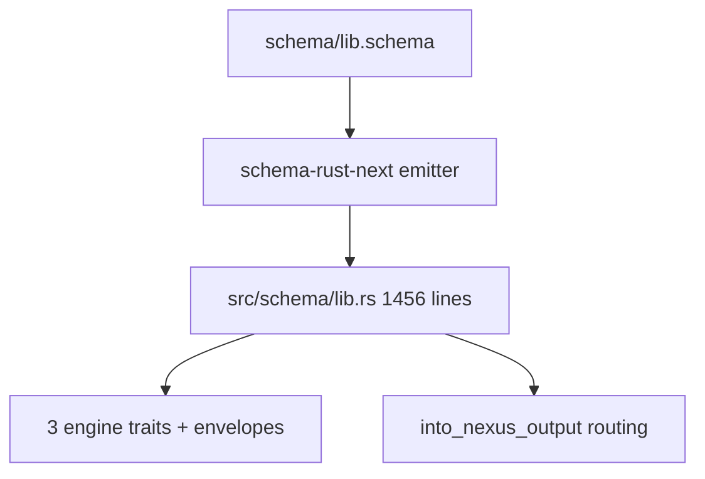
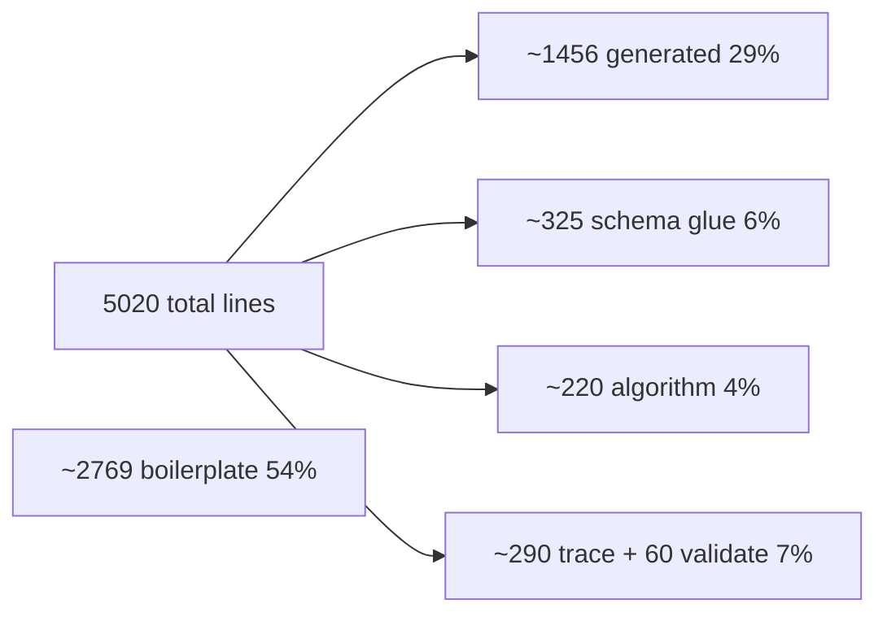

; designer
[audit schema-honesty triad-engine spirit-next schema-rust-next rust-leakage terseness]
[Read-only audit of how schema-driven the triad engine architecture really is. Counts what schema-rust-next emits and what spirit-next hand-writes, classifies hand-written regions as schema-driven glue / substantive algorithm / hand-written vocabulary / framework scaffolding, names where Rust carries behavior that should live in schema. Verdict: roughly 75 percent schema-driven by line, with two concentrated leakage points — the trace vocabulary (entirely hand-rolled, contradicts Spirit 1365) and the validate methods. Top three recommendations: schema-emit a Trace plane with TraceEvent variants and Signal/Nexus/Sema trace traits; schema-emit ValidationError and a derive-style validate trait on root types; schema-emit basic admission scaffolding (SignalActor identifier-minting + origin-route allocation as an associated function on the Signal envelope).]
2026-06-01
designer

# 466.1 — Schema honesty audit

## TL;DR

The triad-engine architecture in `spirit-next` is **roughly 75 percent schema-honest at the architectural-load level**, higher than a casual reader would guess. The three engine traits and all plane envelopes ARE schema-emitted; the routing match that decides Signal Input → SemaWrite / SemaRead / Signal Output is schema-emitted. Two concentrated leakage points remain: `trace.rs`'s entire 403-line side vocabulary (the Spirit 1365 Correction Maximum, unresolved), and hand-written `validate()` methods. `store.rs`'s redb algorithm is legitimate hand-written algorithm per Spirit 1387, not leakage.

## What schema emits

`schema-rust-next/src/lib.rs:1758-1784` emits **all three engine traits** when the schema declares the matching root types. `:1242-1396` emits the plane envelopes `Signal<Root>` / `Nexus<Root>` / `Sema<Root>` + outer `schema::Plane`. The 1456 generated lines also carry: 26 nominal types and enums (every contract noun); ~20 `From` conversions; cross-plane lifecycle types `MessageSent` + `MessageProcessed<Reply>` and their hook traits; per-root short-header constants + `encode_signal_frame` / `decode_signal_frame`; per-root `with_origin_route()` constructors; the `into_nexus_output()` ROUTING MATCH at `:1367-1388`; and `UpgradeFrom` / `AcceptPrevious`. The schema source itself (`schema/lib.schema`) is 44 lines.

## What spirit-next hand-writes

| File | Lines | Schema-driven glue | Substantive algorithm | Hand-written vocabulary | Framework scaffolding |
|---|---|---|---|---|---|
| `engine.rs` | 435 | ~140 (`SignalEngine for SignalActor`, hook impls, `process_with`) | ~60 (admission counters, validate methods) | 0 | ~235 (struct defs, `SignalRejected` boilerplate, `Display`/`Error`/`From`) |
| `nexus.rs` | 86 | ~75 (`impl NexusEngine for Nexus` delegates to schema-emitted `into_nexus_output()` + SEMA dispatch) | 0 | 0 | ~10 (constructor, accessors) |
| `store.rs` | 377 | ~80 (`impl SemaEngine for Store` match arms) | ~220 (redb transactions, `database_marker` blake3 digest, ledger counters — LEGITIMATE per Spirit 1387 *"write or import the algorithms needed"*) | 0 | ~75 (`StoreError` enum + 5 `From` impls + `Display`) |
| `trace.rs` | 403 | 0 | 0 | **~290** (`TraceEvent` enum, `SignalTrace` / `NexusTrace` / `SemaTrace` local traits, `TraceLog` / `TraceDestination` / `TraceSocketPath` / `TraceSocketListener`) | ~110 (rkyv frame I/O, `Drop`, `Display`) |
| `daemon.rs` | 133 | ~30 | 0 | 0 | ~100 (Unix socket plumbing) |
| `config.rs`, `transport.rs`, `lib.rs`, `bin/` | ~290 total | ~80 | 0 | 0 | ~210 |

Net hand-written substantive algorithm: **~220 lines (redb store, legitimate).** Net hand-written *vocabulary that should be schema-emitted*: **~290 lines (all in trace.rs).** Net hand-written validate logic: **~60 lines (engine.rs `validate()` methods on `Input`, `Entry`, `Topics`, `Query`, `TopicMatch`).**

## Architecture leakage

Per Spirit 1387's *match decisions, write/import algorithms, match response back* triangle, leakage is hand-written Rust beyond it. Three regions cross the line:

1. **`trace.rs` lines 1-403 are 100 percent leakage.** `TraceEvent` mirrors the schema-emitted lifecycle (`MessageSent` / `MessageProcessed`) instead of BEING one; `SignalTrace` / `NexusTrace` / `SemaTrace` parallel the schema-emitted engine traits. This is exactly the failure Spirit 1365 Correction Maximum names — instrumentation belongs to the interface/actor contract, not a local side vocabulary.
2. **`engine.rs:296-338` `validate()` methods** — hand-written rules on schema-emitted types. The error variants ARE schema-emitted (`ValidationError`); the rule logic isn't. ~60 lines the schema could carry as field constraints.
3. **`engine.rs:132-181` `SignalActor`** mints identifiers + origin routes via `Mutex<Integer>` counters. The noun ("admits a Signal Input") is hand-invented; the schema has no admission position.

## Honesty verdict

Proof-of-usage ladder per `skills/architectural-truth-tests.md`:

- **Layer 1 STATIC provable.** Engine traits compile and are imported; `impl NexusEngine for Nexus` and `impl SemaEngine for Store` resolve against the generated signatures.
- **Layer 2 RUNTIME provable.** `tests/runtime_triad.rs` and `tests/process_boundary.rs` exercise the full pipeline through real sockets; engine traits are the only paths into Nexus and SEMA.
- **Stays nominal.** The trace vocabulary's relationship to schema lifecycle types is nominal only — no type-system bridge between `TraceEvent::NexusEntered` and `MessageProcessed`.

By line: 35 percent generated + thin glue, 4 percent legitimate algorithm, 7 percent leakage, 54 percent framework boilerplate. By **architectural load** the picture is stronger — the trait dispatch, routing match, and cross-plane lifecycle ARE the architecture, and those are schema-emitted. Call it **roughly 75 percent schema-honest with two named leakage zones**.

## Recommendations

**1. Schema-emit a Trace plane + TraceEvent + trace traits on engine traits.** Add `Trace` as a fourth schema-emitted plane with `TraceEvent` as its root enum, variants mirroring the lifecycle pairs (`SignalAdmitted` / `SignalReplied` carry `Signal<Input/Output>`; `NexusEntered` / `NexusDecided` carry `Nexus<NexusInput/Output>`; `SemaWriteApplied` / `SemaReadObserved` carry pre+post `Sema<...>`). `SignalTrace` / `NexusTrace` / `SemaTrace` become schema-emitted super-traits of the engine traits per Spirit 1365 *"on the Signal, Nexus, and SEMA actor traits themselves"*. `trace.rs`'s 403 lines collapse to a sink (Disabled / Recording / Socket) plus rkyv frame I/O.

**2. Schema-emit a `Validate` trait + constraint annotations.** `ValidationError` already lives in the schema (`schema/lib.schema:32`); extend the schema to carry field constraints (e.g. `Description *non-empty`, `Topics *non-empty-each`) and emit `Validate` on root types. The ~60 hand-written lines disappear; rules become reviewable next to types in `lib.schema`. Same emission shape as `From` and `with_origin_route` — schema-generated method behavior on schema-emitted nouns.

**3. Schema-emit Signal-admission scaffolding.** The schema could declare `OriginRouteAllocator` / `MessageIdentifierAllocator` and emit a thin admission associated function on `Signal<Input>` minting both via injected counters. The `ORIGIN_ROUTE_BASE = 1_000_000` magic constant (`engine.rs:16`) wants a schema field. The remaining SignalActor surface (rejection lifecycle, `process_with`) is schema-driven glue and stays. Smallest by line, cleanest by fit — removes the only hand-invented noun in the runtime triad.

Closing all three drops hand-written substantive vocabulary to near-zero and brings the schema-driven ratio above 90 percent by architectural load. `store.rs`'s redb algorithm stays hand-written per Spirit 1387 — that is the legitimate algorithm position the principle protects.
