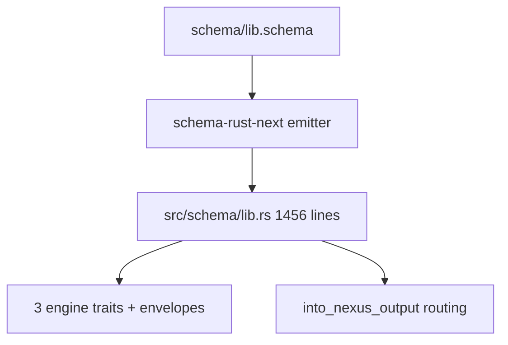
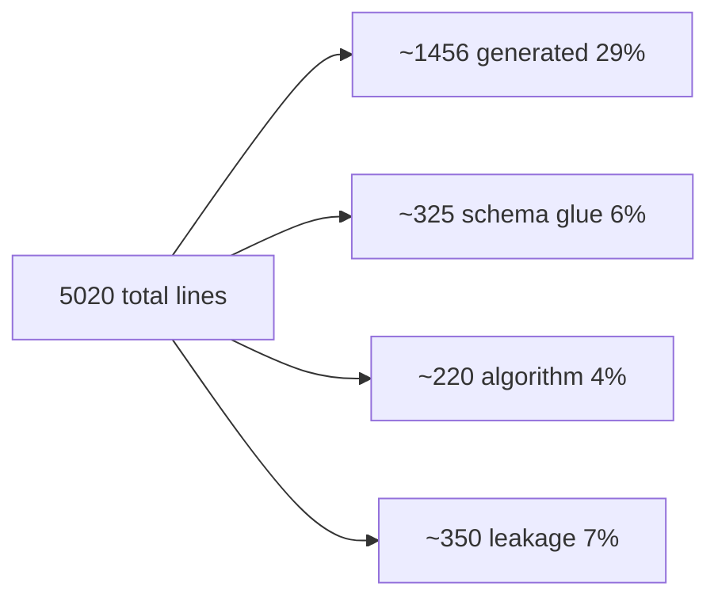

# 466.1 — Schema honesty audit

## TL;DR

**Roughly 75 percent schema-honest at the architectural-load level.** Engine traits, plane envelopes, and the routing match (Signal Input → SemaWrite / SemaRead / Output) are all schema-emitted. Two leakage zones: `trace.rs`'s 403-line side vocabulary (Spirit 1365 Correction Maximum, unresolved) and hand-written `validate()` methods. `store.rs`'s redb algorithm is legitimate per Spirit 1387, not leakage.

## What schema emits

`schema-rust-next/src/lib.rs:1758-1784` emits **all three engine traits**; `:1242-1396` emits plane envelopes + outer `schema::Plane`. The 1456 generated lines also carry: 26 nominal types and enums; ~20 `From` conversions; cross-plane lifecycle `MessageSent` + `MessageProcessed<Reply>` and hook traits; per-root short-header constants + `encode_signal_frame` / `decode_signal_frame`; per-root `with_origin_route()`; the `into_nexus_output()` ROUTING MATCH at `:1367-1388`; and `UpgradeFrom` / `AcceptPrevious`. The schema source (`lib.schema`) is 44 lines.

## What spirit-next hand-writes

| File | Lines | Schema-driven glue | Substantive algorithm | Hand-written vocabulary | Framework scaffolding |
|---|---|---|---|---|---|
| `engine.rs` | 435 | ~140 (`SignalEngine for SignalActor`, hook impls, `process_with`) | ~60 (admission counters, validate methods) | 0 | ~235 (struct defs, `SignalRejected` boilerplate, `Display`/`Error`/`From`) |
| `nexus.rs` | 86 | ~75 (`impl NexusEngine for Nexus` delegates to schema-emitted `into_nexus_output()` + SEMA dispatch) | 0 | 0 | ~10 (constructor, accessors) |
| `store.rs` | 377 | ~80 (`impl SemaEngine for Store` match arms) | ~220 (redb transactions, `database_marker` blake3 digest, ledger counters — LEGITIMATE per Spirit 1387 *"write or import the algorithms needed"*) | 0 | ~75 (`StoreError` enum + 5 `From` impls + `Display`) |
| `trace.rs` | 403 | 0 | 0 | **~290** (`TraceEvent` enum, `SignalTrace` / `NexusTrace` / `SemaTrace` local traits, `TraceLog` / `TraceDestination` / `TraceSocketPath` / `TraceSocketListener`) | ~110 (rkyv frame I/O, `Drop`, `Display`) |
| `daemon.rs` | 133 | ~30 | 0 | 0 | ~100 (Unix socket plumbing) |
| `config.rs`, `transport.rs`, `lib.rs`, `bin/` | ~290 total | ~80 | 0 | 0 | ~210 |

Net algorithm: ~220 lines (legitimate redb). Net vocabulary leakage: ~290 lines (all `trace.rs`). Net validate leakage: ~60 lines (`engine.rs` `validate()` methods).

## Architecture leakage

Per Spirit 1387's *match + algorithm + forward* triangle, three regions cross the line:

1. **`trace.rs` lines 1-403 are 100 percent leakage.** `TraceEvent` mirrors schema lifecycle (`MessageSent` / `MessageProcessed`) instead of BEING one; `SignalTrace` / `NexusTrace` / `SemaTrace` parallel the engine traits. Exact failure Spirit 1365 Correction Maximum names — instrumentation belongs to the interface contract, not a side vocabulary.
2. **`engine.rs:296-338` `validate()` methods** — hand-written rules on schema-emitted types. `ValidationError` IS schema-emitted; rule logic isn't. ~60 lines the schema could carry as field constraints.
3. **`engine.rs:132-181` `SignalActor`** mints identifiers + origin routes via `Mutex<Integer>` counters. The admission noun is hand-invented; schema has no admission position.

## Honesty verdict

Proof-of-usage per `skills/architectural-truth-tests.md`: Layer 1 STATIC — engine traits compile + import; `impl NexusEngine for Nexus`, `impl SemaEngine for Store` resolve against generated signatures. Layer 2 RUNTIME — `tests/runtime_triad.rs` + `tests/process_boundary.rs` drive the full pipeline through real sockets; engine traits are the only paths in. Stays nominal — trace vocabulary's relationship to schema lifecycle types is nominal only, no type-system bridge.

By line: 35 percent generated + glue, 4 percent algorithm, 7 percent leakage, 54 percent framework. By **architectural load** stronger — trait dispatch, routing match, cross-plane lifecycle are the architecture and ARE schema-emitted. **Roughly 75 percent schema-honest, two leakage zones.**

## Recommendations

**1. Schema-emit Trace plane + TraceEvent + trace traits on engine traits.** Fourth plane, `TraceEvent` root enum, variants mirroring lifecycle pairs (`SignalAdmitted`/`SignalReplied` carry `Signal<Input/Output>`; `NexusEntered`/`NexusDecided` carry `Nexus<...>`; `SemaWriteApplied`/`SemaReadObserved` carry pre+post `Sema<...>`). `SignalTrace`/`NexusTrace`/`SemaTrace` become emitted super-traits of the engine traits per Spirit 1365 *"on the Signal, Nexus, and SEMA actor traits themselves"*. `trace.rs` collapses to a sink + rkyv frame I/O.

**2. Schema-emit `Validate` trait + constraint annotations.** `ValidationError` already at `schema/lib.schema:32`; extend with field constraints (`Description *non-empty`, `Topics *non-empty-each`) and emit `Validate` on root types. Same emission shape as `From` and `with_origin_route`. ~60 hand-written lines disappear.

**3. Schema-emit Signal-admission scaffolding.** Declare `OriginRouteAllocator` / `MessageIdentifierAllocator`; emit admission associated function on `Signal<Input>`. `ORIGIN_ROUTE_BASE = 1_000_000` (`engine.rs:16`) wants a schema field. Removes the only hand-invented noun in the runtime triad.

Closing all three brings schema-driven ratio above 90 percent by architectural load. `store.rs` stays hand-written per Spirit 1387 — legitimate algorithm position.
