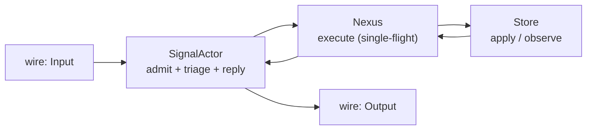

# 466.2 — Actor model + inner/outer world flow audit

## TL;DR

The three engine traits (`SignalEngine`, `NexusEngine`, `SemaEngine` at
`schema/lib.rs:1430-1442`) are the schema-emitted interface layer.
Concrete spirit-next types satisfy them: `SignalActor` (`engine.rs:32`)
implements `SignalEngine`; `Nexus` (`nexus.rs:17`) implements
`NexusEngine`; `Store` (`store.rs:32`) implements `SemaEngine`. The
composition is HONEST against Spirit 1326-1336. **Actor model fit is
partial**: the nouns carry real state, but there are no mailboxes, no
`kameo::Actor` impls, no supervision tree, and the runtime root `Engine`
(`engine.rs:26`) is a mutex-guarded wrapper exposing verb facades —
which `skills/actor-systems.md` §"Runtime roots are actors" names as a
hidden non-actor owner. **Nexus output is currently full-payload**
(carries `SemaReceipt` / `ObservedRecords` / `RemoveReceipt` plus
`DatabaseMarker`), not slim per Spirit 1389.

## Flow diagram + walkthrough

Five nodes (per Spirit 1282). One Record Input traces this way:

1. `Engine::handle` (`engine.rs:87`) hands the raw `Input` to
   `SignalActor::admit` (`engine.rs:143`) which mints `origin_route`
   (`engine.rs:176-180`), mints `MessageIdentifier`, calls
   `Input::validate` (`engine.rs:296-303`), and returns
   `SignalAccepted` carrying `signal_plane::Signal<Input>` and a
   `MessageSent` event.
2. `SignalAccepted::process_with` (`engine.rs:218-239`) pushes
   `MessageSent` to the `MailLedger`, calls
   `SignalEngine::triage` (`engine.rs:184-187`) which wraps
   `Input` into `NexusInput::Signal(...)` with origin route preserved.
3. `NexusEngine::execute` (`nexus.rs:57-86`) calls
   `input.into_nexus_output()` — the schema-emitted match
   (`schema/lib.rs:1367-1388`) decides `SemaWrite` vs `SemaRead` vs
   `Signal`. For Record: `NexusOutput::SemaWrite(SemaWriteInput::Record(entry))`.
4. The `match` in `nexus.rs:70-84` dispatches to
   `SemaEngine::apply` (`store.rs:40-77`) which runs the redb write,
   builds `SemaWriteOutput::Recorded(SemaReceipt { record_identifier,
   database_marker })`, and returns.
5. `sema::Sema<WriteOutput>::into_nexus_input()`
   (`schema/lib.rs:1416-1421`) → re-enters
   `into_nexus_output()` which folds `SemaWriteOutput::Recorded(payload)`
   into `NexusOutput::Signal(Output::RecordAccepted(payload))`.
6. `SignalEngine::reply` (`engine.rs:189-196`) calls
   `nexus::Nexus<NexusOutput>::into_signal_output()`
   (`schema/lib.rs:1407-1413`) → returns `signal_plane::Signal<Output>`
   to the caller. `MessageProcessed` is appended to the ledger.

The six envelope hops (Spirit 1329) are present and `OriginRoute` is
threaded through each via `with_origin_route` (`schema/lib.rs:1331-1364`).

## Actor model fit

| Noun | State carried | Mailbox / handlers | Verdict |
|---|---|---|---|
| `Engine` (`engine.rs:26`) | `SignalActor + Mutex<Nexus>` | None — verb-method facade | Hidden non-actor root |
| `SignalActor` (`engine.rs:32`) | `next_message_identifier`, `next_origin_route`, optional `trace_log` | None — direct method calls | Data-bearing but not actor-shaped |
| `Nexus` (`nexus.rs:17`) | `Store + MailLedger + trace_log` | None — `&mut self` borrow IS the single-flight guard | Data-bearing; not actor-shaped |
| `Store` (`store.rs:32`) | `redb::Database + path + trace_log` | None — sync redb txns | Data-bearing; not actor-shaped |

All four types pass the no-ZST test (`skills/actor-systems.md`
§"Zero-sized actors are not actors") — they all carry meaningful
durable or session state. None is a fake-actor wrapping a one-line
method call. But none is `impl Actor for X` in kameo either: there are
no mailboxes, no `Message<T>` impls, no supervision, no on_stop hooks.
The single-flight invariant (Spirit 1331) is enforced by the
`&mut self` exclusive borrow on `NexusEngine::execute`, which is a
correct Rust-level guard but not an actor mailbox.

The runtime root pattern is the clearest divergence from
`skills/actor-systems.md` §"Runtime roots are actors": `Engine` holds
`Mutex<Nexus>` plus a `SignalActor` field and exposes verb methods
(`handle`, `record_count`, `sent_message_count`, `mail_ledger`,
`database_marker`). Per that skill, *"a struct that merely owns several
ActorRef<_> values and exposes convenience methods is a hidden non-actor
owner."* Replace `ActorRef<_>` with `Mutex<Nexus> + SignalActor` and the
shape matches verbatim. The mutex IS the lock the skill warns against
(`skills/actor-systems.md` §"No shared locks").

**The engine-trait + actor-trait pilot** (Spirit 1365 Correction
Maximum hedges "if possible"): nothing yet emits actor traits per
plane. The current engine traits are the closest layer to "interfaces
the actors implement" — fold them up one more level (declare
`SignalActor`, `NexusActor`, `SemaActor` traits at the schema layer
that compose engine methods with lifecycle/mailbox/trace hooks) and the
meta-actor-with-interfaces vision becomes manifest. The pilot is
clean-shaped today because each engine trait sits on exactly one
data-bearing noun.

## Inner/outer world mapping per Spirit 1388

| World | Substrate | In code |
|---|---|---|
| OUTER | wire ingress/egress, clients | `signal_plane::Signal<Input>` + `Signal<Output>`; `SignalActor::admit` mints identifiers and validates |
| BOUNDARY | decision center | `Nexus` + `NexusEngine::execute` decides SemaWrite vs SemaRead vs Signal direct-return |
| INNER | durable state | `Store` + `SemaEngine::apply` + `SemaEngine::observe` open redb transactions |

The boundary is **explicit at the trait level**: `SignalEngine` takes
and returns Signal envelopes; `SemaEngine` takes and returns Sema
envelopes; `NexusEngine` is the bidirectional translator. The schema
intentionally exposes `nexus::Nexus<Input>` and `nexus::Nexus<Output>`
envelopes that name the boundary in the type system.

The boundary is **blurred at one place**: the `into_nexus_output()`
match (`schema/lib.rs:1367-1388`) couples Signal `Input` variants
directly to SEMA `WriteInput`/`ReadInput` variants. That is the right
direction for terseness (Spirit 1387) but it means Nexus DOES NOT make
a decision today — the variant-to-variant projection is fully
schema-emitted. The trait method body (`nexus.rs:57-86`) is a 30-line
match-and-forward with no algorithmic choice. That's pilot-shaped
honesty (`skills/component-triad.md` §"What this pattern is — and is
not": trivial pilots have thin Nexus bodies); a mature Nexus would
carry policy in this method.

## Slim Nexus output assessment per Spirit 1389

Today's `nexus::Nexus<NexusOutput>::Signal(Output)` carries:

| Output variant | Payload |
|---|---|
| `RecordAccepted(SemaReceipt)` | `record_identifier + database_marker` |
| `RecordsObserved(ObservedRecords)` | `record_set: RecordSet (Vec<Entry>) + database_marker` |
| `RecordRemoved(RemoveReceipt)` | `record_identifier + database_marker` |
| `Error(ErrorReport)` | `error_message + database_marker` |
| `Rejected(SignalRejection)` | `validation_error + database_marker` |

**Verdict: FULL-PAYLOAD, not slim.** `RecordsObserved` carries the
entire `Vec<Entry>` SEMA result back through Nexus and out to the
wire. There is no Nexus-level Query interface — every `Observe` is a
Signal-level operation that produces a Signal-level reply containing
the full record set. Spirit 1389 names this as the gap: input is a
query/decision, output should be a result/what-happened
acknowledgement; clients should issue follow-up queries for specifics.

**Where slim Nexus output would fit cleanly.** Two cuts in priority
order:

1. **Split `Output` into slim ack + follow-up payload.** The slim
   wire-shape for `RecordsObserved` becomes
   `RecordsObserved { result_handle, count, database_marker }` —
   identifier-shaped, no `RecordSet`. The full `RecordSet` lives in
   SEMA, retrievable through a follow-up `(Observe (ByResultHandle ...))`
   Signal call. `RecordAccepted` / `RecordRemoved` are already
   identifier-shaped — `SemaReceipt` carries only `record_identifier`
   + `database_marker`, which is the slim shape Spirit 1351 named.
2. **Add a Nexus-level Match/Observe interface.** Today every
   observation flows from wire → SEMA. A Nexus-level
   query-by-result-handle ("give me the record set bound to handle X
   from the most recent commit you witnessed") lets Nexus serve
   follow-up specifics from its mail ledger without re-hitting SEMA.
   `NexusEngine::execute` already returns `Nexus<Output>`; the slim
   pattern extends `NexusInput` with a `QueryByHandle` variant.

The current architecture supports the slim pattern with a single
schema change (add slim-Output variants beside the current full
variants) and a single engine change (Nexus stashes the full result
in the mail ledger keyed by result_handle when emitting slim
acknowledgement; on follow-up Signal query, Nexus serves from the
ledger).

## OO-original-insight alignment

The psyche's framing — *"in-the-spirit-of-OO with interfaces-FIRST"* —
maps onto the code as: **engine traits = interfaces; SignalActor /
Nexus / Store = implementations**.

| Layer | Where |
|---|---|
| Interface (trait) | `SignalEngine`, `NexusEngine`, `SemaEngine` at `schema/lib.rs:1430-1442` (schema-emitted) |
| Implementation | `impl SignalEngine for SignalActor` (`engine.rs:183-196`); `impl NexusEngine for Nexus` (`nexus.rs:57-86`); `impl SemaEngine for Store` (`store.rs:39-107`) |
| Composition | `Engine::handle` (`engine.rs:87-97`) + `SignalAccepted::process_with` (`engine.rs:218-239`) wire the three together |

**Visibility of interfaces-first in code: PARTIAL.** The trait impls
ARE the load-bearing surface — `Engine::handle` calls
`SignalActor::admit` then dispatches through
`NexusEngine::execute(nexus, ...)` and `signal_engine.triage` /
`signal_engine.reply` as trait calls (`engine.rs:230-237`). Good. But
the concrete types also carry significant inherent methods that bypass
the trait surface: `SignalActor::admit` is inherent (not in
`SignalEngine`); `Store::record / observe / remove / database_marker /
state_digest / len` are inherent; `Nexus::store / mail_ledger /
database_marker` are inherent. **Inherent methods outnumber trait
methods on every concrete type.** That's the "implementations-first
with interfaces as a thin gloss" shape, not "interfaces-first with
implementations supplying them."

The path to make interfaces-FIRST manifest matches the slim-output
direction above: fold more behavior into trait method bodies (move
admit's validation/identity-minting into a `SignalEngine::admit`
schema-level method; move record-count / mail-ledger accessors into a
schema-declared `NexusEngine::observe_ledger` method). The schema
emits the verb spine; the concrete type's inherent methods become
internal helpers. That matches Spirit 1386 ("interface-first") and
Spirit 1387 ("Rust impl TERSE: match-algorithm-forward") together.
