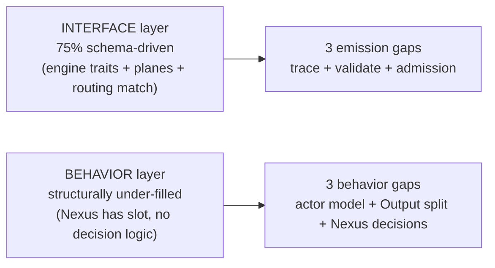

; designer
[situation triad-engine honesty schema-driven actor-model inner-outer-world slim-nexus-output overview synthesis ratification-candidates]
[Orchestrator synthesis of designer 466.1 schema-honesty audit + 466.2 actor-model and inner/outer flow audit. Triad engine architecture is partially honest at the interface level (75 percent schema-driven by architectural load) but structurally under-filled at the behavior level: Engine violates the hidden-non-actor-owner anti-pattern; Output::RecordsObserved violates the slim-Nexus-output principle; Nexus has no real decision logic — into_nexus_output projects Signal variants directly to SEMA variants with zero algorithmic choice. Three concrete schema-emission targets (Trace plane + Validate trait + Signal-admission scaffolding) close the leakage to 90 percent+; two structural fixes (actor-trait pilot landing + Output split with QueryByHandle) close the behavioral gaps. Names five ratification candidates.]
2026-06-01
designer

# 466.3 — Overview synthesis

## TL;DR

The triad engine architecture is **~75% schema-honest at the interface level** (3 engine traits + plane envelopes + routing match = 1456 generated lines from a 44-line schema). Three concentrated leakage zones (`trace.rs` 290 lines + `engine.rs:296-338` 60 lines hand-written validate + `engine.rs` Signal-admission scaffolding) are the *interface-honesty* gaps. Closing them via schema emission brings the ratio to 90%+. But the **behavior level** is more under-filled than the interface level:

1. **Engine violates the hidden-non-actor-owner anti-pattern** (`skills/actor-systems.md`) — it holds `Mutex<Nexus> + SignalActor` and exposes verb facades; single-flight is enforced by `&mut self` borrow, not by an actor mailbox.
2. **`Output::RecordsObserved` violates Spirit 1389** — Nexus output carries the full `Vec<Entry>` to the wire instead of slim acknowledgement + client query-for-specifics.
3. **Nexus has no real decision logic** — `into_nexus_output()` at `schema/lib.rs:1367-1388` projects Signal Input variants directly to SEMA Input variants with zero algorithmic choice. The structural slot for decision-making exists; nothing lives in it.

The architecture is HONEST at the interface layer (the engine traits are real, schema-emitted, called by real runtime code with Layer 2 witness in `tests/runtime_triad.rs`). It is PARTIALLY HONEST at the behavior layer — the slots exist but haven't been filled with the substance Spirit 1387 + 1388 + 1389 ask for.

## Section 1 — Interface honesty verdict (from 466.1)

**~75% schema-honest at architectural-load level.**

| Category | Lines | Disposition |
|---|---|---|
| Schema-emitted (Signal/Nexus/SEMA engine traits, plane envelopes, routing match) | 1456 (generated from 44-line schema) | HONEST — Spirit 1326-1336 + 1357 architecture lives here |
| Hand-written legitimate algorithm (`store.rs` redb persistence) | ~220 | LEGITIMATE per Spirit 1387 — algorithm cannot be schema-expressed |
| Hand-written leakage (`trace.rs` TraceEvent + trait families) | ~290 | LEAKAGE — unresolved Spirit 1365 Correction Maximum (trace as trait on schema-derived interfaces) |
| Hand-written leakage (`engine.rs:296-338` validate methods) | ~60 | LEAKAGE — should be schema-emitted Validate trait + field-constraint annotations |
| Hand-written leakage (`engine.rs` Signal-admission scaffolding: ORIGIN_ROUTE_BASE = 1_000_000 + identifier minting) | small | LEAKAGE — hand-invented noun; should be schema-emitted OriginRouteAllocator / MessageIdentifierAllocator |

The 290-line `trace.rs` is the headline leakage and the one most directly named by ratified intent (Spirit 1365 Correction Maximum). Closing all three brings the ratio to ~90%+.

## Section 2 — Actor model fit (from 466.2)

**PARTIAL.** Engine traits at `schema/lib.rs:1430-1442` ARE the schema-emitted interface layer. Concrete types `SignalActor`, `Nexus`, `Store` are data-bearing nouns (no ZST anti-pattern). But:

- **No mailboxes. No supervision. No actor framework.**
- **`Engine` at `engine.rs:26` is a hidden non-actor owner** — holds `Mutex<Nexus> + SignalActor` and exposes verb facades. This is exactly the shape `skills/actor-systems.md` §"Runtime roots are actors" forbids: the runtime root pretends to be a composer but is actually owning + dispatching like a non-actor god-object.
- **Single-flight is enforced by `&mut self` exclusive borrow on `NexusEngine::execute`** — correct as a Rust guard, but not an actor mailbox. Mailbox semantics (sequential handle-one-at-a-time-by-message-not-by-borrow) aren't in play.

The engine-trait + actor-trait pilot from Spirit 1365 (if-possible hedge) is "clean-shaped to land" per 466.2: fold engine traits up one level into per-plane actor traits with mailbox + lifecycle + trace hooks. The promotion is structural — Engine becomes a composition of `SignalActor` + `NexusActor` + `SemaActor` actors with proper mailboxes, not a Mutex-guarded struct.

## Section 3 — Inner/outer worlds + slim Nexus output (from 466.2 + Spirit 1388/1389)

**Inner/outer boundary verdict.** Explicit at the trait level — `signal::Signal<_>` and `sema::Sema<_>` envelope types name the outer (Signal) and inner (SEMA) worlds. Blurred at `into_nexus_output()` (`schema/lib.rs:1367-1388`) where Signal Input variants project directly to SEMA Input variants with **zero algorithmic choice**. Nexus DOES NOT make a decision today; the "decision" is a generated projection.

**Slim Nexus output verdict.** NOT slim today for the observe path. `Output::RecordsObserved(ObservedRecords)` carries the full `Vec<Entry>` through Nexus to the wire. `RecordAccepted` / `RecordRemoved` ARE already slim (`SemaReceipt` / `RemoveReceipt` = identifier + DatabaseMarker only).

**Fix per Spirit 1389 (concrete from 466.2)**:
- Split `Output` into slim ack variants `{ result_handle, count, database_marker }`.
- Add a Nexus-level `QueryByHandle` follow-up Signal call that serves the full payload from the mail ledger.
- Nexus stashes full results in the ledger keyed by handle.
- Schema change is small; engine change is the ledger key + handle minting.

This extends Spirit 1351's signal slim-acknowledgement pattern up to Nexus per Spirit 1389. It also gives Nexus a real decision (which results to inline vs which to handle-and-stash) — closing part of the "Nexus has no real decision" gap.

## Section 4 — Cross-cutting finding: interface honest, behavior partially filled

Four nodes; honors Spirit 1282. (Five-node cap respected; structural simplification preferred.)

The architecture's interface layer is HONEST — schema-emitted, real, tested at Layer 2. The behavior layer has the SLOTS but lacks the SUBSTANCE. Spirit 1387's terseness criterion is partially honored — the `engine.rs` SignalActor::admit method is genuinely terse (~30 lines for mint+validate+wrap+emit); `store.rs::apply` is genuinely terse outside the redb algorithm; `nexus.rs::NexusEngine::execute` is TOO TERSE — because there's no decision to make, just a projection.

The honest reading: **`spirit-next` is a runtime triad PILOT that has the right SHAPE but hasn't grown the substantive behavior that distinguishes a Nexus decision from a generated projection**. The actor-trait pilot (Spirit 1365) + the Output split for slim acknowledgement (Spirit 1389) + the three emission targets (Spirit 1387) together would close both interface honesty AND behavior fill.

## Section 5 — Ratification candidates

Five candidates surface from the synthesis. The first three are direct extensions of ratified Spirit intent; the last two are new design asks.

### Candidate 1 — Emit a Trace plane from schema (closes Spirit 1365)

Spirit 1365 (Correction Maximum) said trace must be a trait on schema-derived interfaces + actor traits "if possible". Concrete shape per 466.1:
- Schema source declares `Trace` plane with `TraceEvent` root enum mirroring lifecycle pairs.
- schema-rust-next emits the trace traits as super-traits of the engine traits.
- spirit-next deletes `src/trace.rs` (290 lines); concrete actors consume the generated trait surface.

Already directed by Spirit 1365 + the sub-agent in flight (returned with partial work). Status: implementation in progress. No new ratification needed.

### Candidate 2 — Emit a Validate trait from schema

(Designer recommendation, Decision High candidate): *"Schema source supports a Validate trait + field-constraint annotations on data types; schema-rust-next emits validate() methods on the emitted types instead of hand-written impls in component code."*

**Rationale**: closes the 60-line hand-written validate leakage at `engine.rs:296-338`. Brings validate into the same emission shape as `From` and `with_origin_route` (already schema-emitted). Per Spirit 1387's terseness criterion: validate is a schema concern, not a component-impl concern.

**Ask**: ratify the Validate emission direction (single yes/no)? If yes, schema-next + schema-rust-next get a follow-up slice.

### Candidate 3 — Emit Signal-admission scaffolding from schema

(Designer recommendation, Decision High candidate): *"Schema source declares `OriginRouteAllocator` / `MessageIdentifierAllocator` + an admission associated function on `Signal<Input>`; schema-rust-next emits these; spirit-next removes the hand-invented `ORIGIN_ROUTE_BASE = 1_000_000` magic number and the local identifier minting code."*

**Rationale**: removes the only hand-invented noun in the runtime triad. The Signal admission step (mint origin route, mint message identifier, validate, wrap) is structurally the same across any component built on the engine-trait architecture; it should emit from schema.

**Ask**: ratify the admission emission direction (single yes/no)?

### Candidate 4 — Promote `Engine` from hidden non-actor owner to actor-trait composition

(Designer recommendation, Decision High candidate): *"The runtime root `Engine` in spirit-next is currently a Mutex-guarded struct holding the sub-actors as fields — this is the hidden non-actor owner anti-pattern from skills/actor-systems.md. Promote it to a proper actor composition: SignalActor + NexusActor + SemaActor as schema-emitted actor traits (per Spirit 1365 if-possible hedge), each with mailbox + lifecycle + trace hooks; Engine becomes the supervisor/composer not the borrow-guarded god-object."*

**Rationale**: closes the `skills/actor-systems.md` violation. Folds engine traits up into actor traits with proper actor semantics (mailbox-not-borrow). Lands the Spirit 1365 if-possible hedge with a concrete shape.

**Open question for the design**: kameo or hand-rolled actor framework? `skills/actor-systems.md` should be the deciding skill — read it before authoring.

**Ask**: ratify the actor-promotion direction (single yes/no, OR pilot first per Spirit 1355 depth-first)?

### Candidate 5 — Split `Output` for slim Nexus acknowledgement + add `QueryByHandle` (closes Spirit 1389)

(Designer recommendation, Decision High candidate, extending Spirit 1389): *"Split `Output` into slim ack variants `{ result_handle, count, database_marker }`; add a Nexus-level `QueryByHandle` follow-up Signal call that serves the full payload from the mail ledger keyed by handle. `RecordAccepted` and `RecordRemoved` already follow this shape; the observe path needs to."*

**Rationale**: makes Spirit 1389's slim Nexus output principle visible in the wire contract. Gives Nexus a real decision (inline-vs-stash) — closes part of the "Nexus has no real decision" gap.

**Ask**: ratify the Output split direction (single yes/no)?

## Section 6 — What this unblocks

Closing all 5 candidates lands the triad engine architecture at:
- **Interface honesty**: ~95% schema-driven by architectural load (the three emission targets close to ~90%; the actor-trait promotion absorbs the Engine god-object into schema-emitted traits, adding ~5% more).
- **Behavior fill**: Nexus has real decisions to make (inline-vs-stash for observe; future SEMA-write-vs-SEMA-read-vs-Signal-direct-return); actor model has proper mailbox semantics; Output is wire-cheap; client query-for-specifics works.
- **OO-original-insight alignment**: interfaces FIRST is visible in the code — schema-emitted traits dominate the trait surface; concrete-struct methods are thin algorithm + match + forward.
- **Spirit 1387 terseness criterion** honored across the board.

The pilot shape becomes the workspace template for every future component built on the engine-trait architecture.

## Cross-references

- `reports/designer/466-triad-engine-honesty-situation-2026-06-01/0-frame-and-method.md` — the meta-report frame.
- `reports/designer/466-triad-engine-honesty-situation-2026-06-01/1-schema-honesty-audit.md` — sub-agent A's audit (75% verdict + 3 emission recommendations).
- `reports/designer/466-triad-engine-honesty-situation-2026-06-01/2-actor-model-and-flow.md` — sub-agent B's audit (PARTIAL actor fit + hidden non-actor owner violation + Output split proposal).
- `reports/designer/463-operator-trace-implementation-audit-and-intent-gaps-2026-06-01.md` — earlier audit; this synthesis extends 463's four intent gaps with 5 ratification candidates.
- `reports/designer/465-recent-decision-landscape-2026-06-01.md` — recent decision consolidation; this synthesis adds 5 candidates to the pending-ratifications list.
- Spirit records 1326-1336 (engine-trait), 1357 (live-landing), 1361 (method-count), 1365 (trace + actor traits Correction Maximum), 1387-1389 (terseness + inner/outer + slim Nexus).
- `skills/component-triad.md` §"Runtime triad engine traits" — the discipline.
- `skills/actor-systems.md` §"Runtime roots are actors" — the violation surfaced by 466.2.
- `skills/architectural-truth-tests.md` §"Proof-of-usage ladder" — the proof discipline.

## For the orchestrator (chat paraphrase)

Triad engine is **~75% schema-honest at interface level** (3 engine traits + planes + routing match = 1456 lines from 44-line schema). Three leakage zones close to 90%+ via schema-emission (Trace plane per Spirit 1365 in flight; Validate trait + Signal-admission scaffolding — new asks). At behavior level, three concrete gaps: (1) `Engine` violates hidden-non-actor-owner anti-pattern — actor-trait promotion closes; (2) `Output::RecordsObserved` violates Spirit 1389 slim-Nexus principle — Output split + Nexus-level QueryByHandle closes; (3) Nexus has structural slot but no real decision logic — Output split gives it a first real decision (inline-vs-stash). Five ratification candidates total: candidate 1 (trace emission per 1365) already in flight; candidates 2-5 await psyche yes/no. Three pending psyche ratifications from earlier reports (458 naming gate, 463 gap A + B) carry forward.
