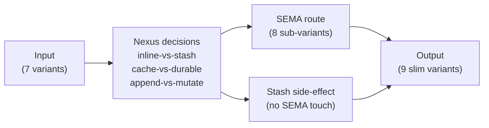
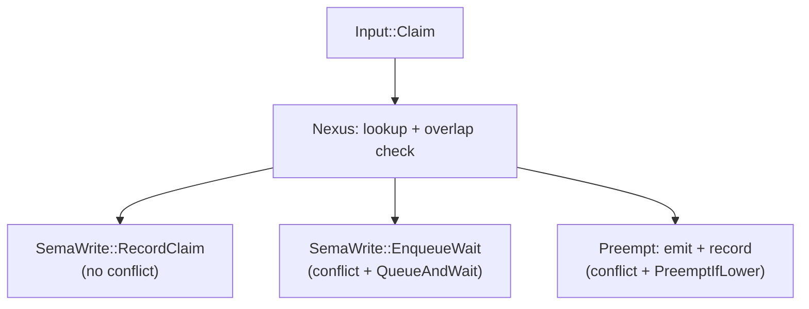
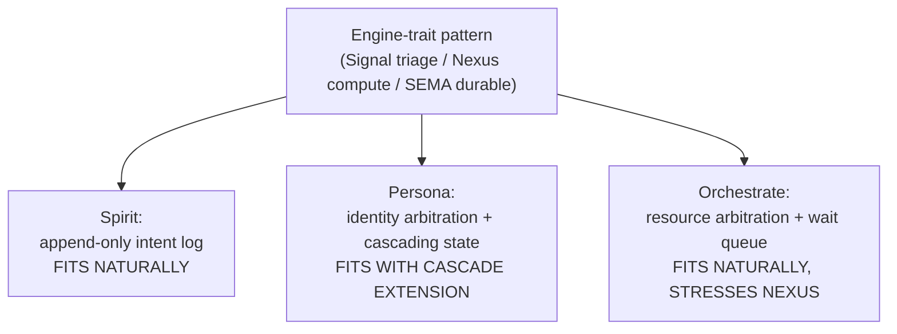

# 468 — Developed interfaces — spirit pilot expansion, persona, orchestrate

## TL;DR

Three schema sketches at the engine-trait level, each with non-toy interface breadth.

Spirit pilot expands from 3-variant `Input` (`Record` / `Observe` / `Remove`) to 5 variants (`Record` / `Observe` / `Remove` / `Update` / `Subscribe`); `SemaWriteInput` grows from 2 to 4 variants (adds `Update` + `Replace`); `SemaReadInput` grows from 1 to 4 variants (adds `Lookup` + `Summarize` + `Count`). Nexus gains real per-variant decisions: result-stash-vs-inline on `Observe`, cache-vs-durable on `Lookup`, append-vs-mutate routing on `Update`, subscription-installation routing on `Subscribe`.

Persona component sketched as the broader identity/profile/state/capabilities surface beyond persona-spirit's intent-capture lane. Eight `Input` variants (Lookup / Register / Assert / Revise / GrantCapability / RevokeCapability / Authorize / Subscribe) drive Nexus decisions about capability-scope routing, cascading revocation, and stale-identity arbitration. Owner-signal vocabulary covers capability-catalog policy and identity-provider configuration.

Orchestrate component sketched as engine-trait runtime for lane coordination, replacing the shell-helper + `.lock` substrate. Eight `Input` variants (Claim / Release / Handoff / Query / Wait / Subscribe / Submit / Snapshot) drive the richest Nexus decision surface of the three: conflict resolution, priority-vs-arrival wait-queue policy, preemption thresholds, and handoff atomicity guarantees. Owner-signal covers lane-catalog policy and timeout configuration.

Cross-cutting finding: every component grows a `Subscribe` variant naturally; every Nexus carries some conflict-resolution decision; every component splits read into `Observe` (filter-driven) + `Lookup` (handle-driven) + `Count` (aggregate). These three are candidate workspace patterns.

## Section 1 — Spirit pilot expansion

### Current state (verified against schema source)

`/git/github.com/LiGoldragon/spirit-next/schema/lib.schema` already shows the pilot mid-flight — it has 5 `Input` variants (`Record` / `Observe` / `Lookup` / `Count` / `Remove`) and 3 `SemaReadInput` variants (`Observe` / `Lookup` / `Count`). Operator 281's report describes a slightly older 3-variant shape. This section sketches the developed shape building on what's already in the schema source plus the recommended expansions to drive richer Nexus decisions.

### Proposed expanded schema source

```nota
{}
[
  (Record Entry)
  (Observe Query)
  (Lookup RecordIdentifier)
  (Count Query)
  (Update RecordRevision)
  (Subscribe Subscription)
  (Remove RecordIdentifier)
]
[
  (RecordAccepted SemaReceipt)
  (RecordsObserved ResultHandle)
  (RecordFound FoundRecord)
  (RecordsCounted CountedRecords)
  (RecordUpdated SemaReceipt)
  (SubscriptionOpened SubscriptionHandle)
  (RecordRemoved RemoveReceipt)
  (Error ErrorReport)
  (Rejected SignalRejection)
]
{
  NexusInput [(Signal Input) (SemaWrite SemaWriteOutput) (SemaRead SemaReadOutput)]
  NexusOutput [(SemaWrite SemaWriteInput) (SemaRead SemaReadInput) (Signal Output) (Stash StashOperation)]

  SemaWriteInput [
    (Record Entry)
    (Update RecordRevision)
    (Replace ReplacementRequest)
    (Remove RecordIdentifier)
  ]
  SemaReadInput [
    (Observe Query)
    (Lookup RecordIdentifier)
    (Summarize SummaryRequest)
    (Count Query)
  ]

  SemaWriteOutput [
    (Recorded SemaReceipt)
    (Updated SemaReceipt)
    (Replaced SemaReceipt)
    (Removed RemoveReceipt)
    (Missed ErrorReport)
  ]
  SemaReadOutput [
    (Observed ObservedRecords)
    (Found FoundRecord)
    (Summarized SummaryDigest)
    (Counted CountedRecords)
    (Missed ErrorReport)
  ]

  RecordRevision { RecordIdentifier * RevisionDelta * }
  RevisionDelta [(Certainty Magnitude) (Description Description) (Topics Topics)]
  ReplacementRequest { RecordIdentifier * Entry * }
  SummaryRequest { TopicMatch * Kind (Optional Kind) DepthScope }
  DepthScope [Shallow Recent Deep VeryDeep]
  SummaryDigest { RecordCount * TopicHistogram * KindHistogram * DatabaseMarker * }
  TopicHistogram (Vec TopicTally)
  TopicTally { Topic * RecordCount * }
  KindHistogram (Vec KindTally)
  KindTally { Kind * RecordCount * }

  Subscription { TopicMatch * Kind (Optional Kind) ChangeFilter }
  ChangeFilter [All Records Updates Removals]
  SubscriptionHandle { SubscriptionIdentifier * DatabaseMarker * }
  SubscriptionIdentifier Integer

  ResultHandle { ResultIdentifier * RecordCount * DatabaseMarker * }
  ResultIdentifier Integer
  StashOperation { ResultIdentifier * RecordSet * }
}
```

### Nexus decision matrix

The expansion changes Nexus from a generated projection to a real decision center. Each `Input` variant now drives a non-trivial Nexus choice:

| Input variant | Nexus decision | Closes |
|---|---|---|
| `Record` | Cheap path: validate, hand to `SemaWriteInput::Record`, return slim `RecordAccepted` | Spirit 1389 (slim ack) — already slim |
| `Observe` | **Decide inline-vs-stash**: count probe via `SemaReadInput::Count`; small-N returns `RecordsObserved(handle)` with inline records via `Stash` then slim ack; large-N returns `RecordsObserved(handle)` only with records reachable via follow-up `Lookup`/`QueryByHandle` | Spirit 1389 (slim Nexus output) |
| `Lookup` | **Decide cache-vs-durable**: recently-stashed handle path returns from result cache without touching SEMA; otherwise `SemaReadInput::Lookup` | New decision — cache substrate |
| `Count` | **Decide approximate-vs-exact**: cheap if cardinality estimate already cached; otherwise `SemaReadInput::Count` | New decision — observability path |
| `Update` | **Route by RevisionDelta variant**: `(Certainty _)` lowers to `SemaWriteInput::Update` (in-place); `(Description _)` or `(Topics _)` lowers to `SemaWriteInput::Replace` (full entry rewrite); rejects updates with `(Magnitude Zero)` collisions per existing semantics | New decision — append-vs-mutate routing |
| `Subscribe` | **Install subscription side-effect** without SEMA write: mint subscription identifier, store filter shape in Nexus mail ledger, return `SubscriptionOpened`; subsequent SEMA writes consult subscription filters | Spirit 1389 + push-not-pull |
| `Remove` | Validate, hand to `SemaWriteInput::Remove`, return slim `RecordRemoved` | Already slim |

### Why this matters

Operator 281 §"Decision Targets" called for per-variant `decide_record` / `decide_observe` / `decide_remove` methods so the actor fills algorithmic slots; designer 466.3 named that Nexus had no real decision because the interface was too thin. The expanded interface gives Nexus seven distinct decisions to make — three are genuinely interesting (inline-vs-stash, cache-vs-durable, append-vs-mutate routing), and one (subscription-install) is a structural side-effect Nexus owns alone.



Five nodes; honors Spirit 1282.

## Section 2 — Persona component design

### Scope and starting vocabulary

The deployed `persona-spirit` is the *intent-capture* persona-shaped component. The broader persona component manages identity, profile, capabilities, and authorization for personas/agents/users — it answers questions like *"is this persona authorized to call `signal-spirit::Record`?"* and *"what is the role-set for `claude-third-designer`?"*. Persona-spirit and the broader persona communicate through the shared persona identifier vocabulary; persona-spirit asserts intent, persona arbitrates authority.

### Proposed schema source

```nota
{}
[
  (Lookup PersonaQuery)
  (Register RegistrationRequest)
  (Assert IdentityAssertion)
  (Revise ProfileRevision)
  (GrantCapability CapabilityGrant)
  (RevokeCapability CapabilityRevocation)
  (Authorize AuthorizationQuery)
  (Subscribe ChangeSubscription)
]
[
  (PersonaFound PersonaSnapshot)
  (PersonaRegistered RegistrationReceipt)
  (PersonaAsserted AssertionReceipt)
  (PersonaRevised RevisionReceipt)
  (CapabilityGranted GrantReceipt)
  (CapabilityRevoked RevocationReceipt)
  (AuthorizationDecided AuthorizationReceipt)
  (SubscriptionOpened SubscriptionHandle)
  (Error ErrorReport)
  (Rejected SignalRejection)
]
{
  NexusInput [(Signal Input) (SemaWrite SemaWriteOutput) (SemaRead SemaReadOutput)]
  NexusOutput [(SemaWrite SemaWriteInput) (SemaRead SemaReadInput) (Signal Output) (Cascade CascadeOperation)]

  SemaWriteInput [
    (Register PersonaRecord)
    (Revise ProfileDelta)
    (GrantCapability CapabilityRecord)
    (RevokeCapability RevocationRecord)
    (StampAssertion AssertionRecord)
  ]
  SemaReadInput [
    (LookupPersona PersonaIdentifier)
    (QueryPersonas PersonaFilter)
    (LookupCapability CapabilityIdentifier)
    (EnumerateCapabilities CapabilityFilter)
    (CheckAuthorization AuthorizationCheck)
  ]

  SemaWriteOutput [
    (Registered PersonaReceipt)
    (Revised PersonaReceipt)
    (Granted CapabilityReceipt)
    (Revoked CapabilityReceipt)
    (Stamped AssertionReceipt)
    (Missed ErrorReport)
  ]
  SemaReadOutput [
    (PersonaFound PersonaSnapshot)
    (PersonasFound PersonaSet)
    (CapabilityFound CapabilitySnapshot)
    (CapabilitiesFound CapabilitySet)
    (Authorized AuthorizationVerdict)
    (Missed ErrorReport)
  ]

  PersonaIdentifier Integer
  PersonaName String
  PersonaKind [Human Agent Service System]
  Profile { displayName PersonaName harness HarnessKind roleSet RoleSet trust TrustLevel }
  HarnessKind [Codex Claude Pi Browser Unknown]
  RoleSet (Vec RoleName)
  RoleName String
  TrustLevel [Unverified Provisional Verified Owner]
  PersonaRecord { Identifier PersonaIdentifier kind PersonaKind profile Profile }
  ProfileDelta [(DisplayName PersonaName) (Trust TrustLevel) (RoleSet RoleSet)]
  ProfileRevision { Identifier PersonaIdentifier delta ProfileDelta }

  CapabilityIdentifier Integer
  CapabilityScope String
  CapabilityKind [Read Write Authorize Owner]
  CapabilityRecord { Identifier CapabilityIdentifier scope CapabilityScope kind CapabilityKind grantee PersonaIdentifier expiration (Optional Expiration) }
  CapabilityGrant { grantee PersonaIdentifier scope CapabilityScope kind CapabilityKind expiration (Optional Expiration) }
  CapabilityRevocation { Identifier CapabilityIdentifier reason RevocationReason }
  RevocationRecord { Identifier CapabilityIdentifier reason RevocationReason }
  RevocationReason [Expired Superseded OwnerWithdrawn TrustDowngrade]
  Expiration { Timestamp * }
  Timestamp Integer

  AuthorizationCheck { persona PersonaIdentifier scope CapabilityScope action CapabilityKind }
  AuthorizationVerdict [Permitted Denied Stale]
  AuthorizationQuery { persona PersonaIdentifier scope CapabilityScope action CapabilityKind }

  IdentityAssertion { persona PersonaIdentifier assertion AssertionPayload signature SignatureBytes }
  AssertionPayload [LoginAttempt RoleSelfClaim Heartbeat]
  AssertionRecord { Identifier PersonaIdentifier payload AssertionPayload stampedAt Timestamp }
  AssertionReceipt { Identifier AssertionRecord verdict AssertionVerdict }
  AssertionVerdict [Accepted Rejected Stale]
  SignatureBytes Bytes

  PersonaQuery [(ByIdentifier PersonaIdentifier) (ByName PersonaName) (ByFilter PersonaFilter)]
  PersonaFilter { kind (Optional PersonaKind) trust (Optional TrustLevel) }
  PersonaSet (Vec PersonaSnapshot)
  PersonaSnapshot { Identifier PersonaIdentifier kind PersonaKind profile Profile capabilities (Vec CapabilityIdentifier) }
  CapabilityFilter { grantee (Optional PersonaIdentifier) scope (Optional CapabilityScope) kind (Optional CapabilityKind) }
  CapabilitySet (Vec CapabilitySnapshot)
  CapabilitySnapshot { Identifier CapabilityIdentifier scope CapabilityScope kind CapabilityKind grantee PersonaIdentifier active Boolean }

  RegistrationRequest { kind PersonaKind profile Profile parent (Optional PersonaIdentifier) }
  RegistrationReceipt { Identifier PersonaIdentifier DatabaseMarker }
  RevisionReceipt { Identifier PersonaIdentifier DatabaseMarker }
  GrantReceipt { Identifier CapabilityIdentifier DatabaseMarker }
  RevocationReceipt { Identifier CapabilityIdentifier cascaded (Vec CapabilityIdentifier) DatabaseMarker }
  AuthorizationReceipt { verdict AuthorizationVerdict DatabaseMarker }

  ChangeSubscription { scope (Optional CapabilityScope) persona (Optional PersonaIdentifier) }
  SubscriptionHandle { Identifier SubscriptionIdentifier DatabaseMarker }
  SubscriptionIdentifier Integer
  CascadeOperation { roots (Vec CapabilityIdentifier) reason RevocationReason }
}
```

### Nexus decision matrix

| Input variant | Nexus decision |
|---|---|
| `Lookup` | **Decide which SEMA read to issue**: `(ByIdentifier _)` → `SemaReadInput::LookupPersona`; `(ByName _)` → `SemaReadInput::QueryPersonas` then filter to single; `(ByFilter _)` → `SemaReadInput::QueryPersonas` |
| `Register` | **Decide parent-trust inheritance**: if `parent` is set, lookup parent trust via `SemaReadInput::LookupPersona` before issuing `SemaWriteInput::Register` with trust clamped to `min(requested, parent.trust)` |
| `Assert` | **Decide signature freshness**: lookup persona, validate signature against persona's stored signing key, route accepted assertions to `SemaWriteInput::StampAssertion`, reject stale-signature cases without touching SEMA |
| `Revise` | **Decide trust-level downgrade cascade**: if `delta` is `(Trust _)` and new trust is below current, additionally enqueue a `Cascade` operation that revokes capabilities exceeding new trust ceiling |
| `GrantCapability` | **Decide capability-scope routing**: cross-check scope against grantor's own capabilities (lookup); validate kind subordination (`Read` < `Write` < `Authorize` < `Owner`); reject grants exceeding grantor authority before SEMA write |
| `RevokeCapability` | **Decide cascading revocation**: lookup capability, find every capability transitively granted under it via `SemaReadInput::EnumerateCapabilities`, issue `SemaWriteInput::RevokeCapability` for the root and emit a `Cascade` operation that fan-outs through child capabilities, collect identifiers into `cascaded` field of receipt |
| `Authorize` | **Decide fresh-vs-cached verdict**: recent identical query returns cached verdict without SEMA touch; otherwise `SemaReadInput::CheckAuthorization` |
| `Subscribe` | Install subscription filter in Nexus mail ledger, return slim handle |

The decisions cluster around three substantive concerns: **trust-level arbitration** (Register / Revise downgrade cascade), **capability-scope subordination** (GrantCapability / RevokeCapability cascade), and **freshness-vs-cache routing** (Authorize / Lookup). Each is a real algorithmic choice, not a generated projection.

### Owner-signal vocabulary (policy-level operations)

```nota
{}
[
  (SetCapabilityCatalog CapabilityCatalog)
  (ConfigureIdentityProvider IdentityProviderConfiguration)
  (RetirePersona PersonaIdentifier)
  (SetTrustEscalationPolicy TrustEscalationPolicy)
]
[
  (CatalogUpdated CatalogReceipt)
  (ProviderConfigured ProviderReceipt)
  (PersonaRetired RetirementReceipt)
  (PolicyUpdated PolicyReceipt)
  (Error ErrorReport)
  (Rejected SignalRejection)
]
{
  CapabilityCatalog (Vec CapabilityTemplate)
  CapabilityTemplate { scope CapabilityScope allowedKinds (Vec CapabilityKind) maxExpiration (Optional Expiration) }
  IdentityProviderConfiguration { provider ProviderName publicKeyMaterial Bytes }
  ProviderName String
  TrustEscalationPolicy { fromTrust TrustLevel toTrust TrustLevel requiredEvidence (Vec EvidenceRequirement) }
  EvidenceRequirement [SignedAssertion HumanReview QuorumApproval]
  CatalogReceipt { DatabaseMarker * }
  ProviderReceipt { DatabaseMarker * }
  RetirementReceipt { DatabaseMarker * }
  PolicyReceipt { DatabaseMarker * }
}
```

The owner surface is the policy side: which capabilities exist as templates, which identity providers are trusted, how trust escalation gates are evaluated. The ordinary surface acts on the policy without changing it.

## Section 3 — Orchestrate component design

### Scope and starting vocabulary

Orchestrate today lives as `orchestrate/AGENTS.md` + `tools/orchestrate` shell helper + `<lane>.lock` files. The component you'd design now replaces all three with a typed daemon: claim/release/handoff become typed wire operations, conflict detection runs at the Nexus plane with real decision logic, durable state lives in `orchestrate.redb`, and the mind/orchestrate authority chain becomes contract-driven rather than helper-script-mediated. The starting vocabulary already exists in `signal-orchestrate/schema/signal-orchestrate.concept.schema` as a draft surface — this section expands it into the engine-trait shape.

### Proposed schema source

```nota
{}
[
  (Claim ClaimRequest)
  (Release ReleaseRequest)
  (Handoff HandoffRequest)
  (Query LaneQuery)
  (Wait WaitRequest)
  (Subscribe ChangeSubscription)
  (Submit ActivityRequest)
  (Snapshot SnapshotRequest)
]
[
  (ClaimGranted ClaimReceipt)
  (ClaimQueued QueueReceipt)
  (ClaimRejected ClaimConflict)
  (ReleaseAcknowledged ReleaseReceipt)
  (HandoffAccepted HandoffReceipt)
  (HandoffRejected HandoffRejection)
  (LaneObserved LaneSnapshot)
  (WaitOpened WaitHandle)
  (SubscriptionOpened SubscriptionHandle)
  (ActivityAccepted ActivityReceipt)
  (SnapshotProvided WorkspaceSnapshot)
  (Error ErrorReport)
  (Rejected SignalRejection)
]
{
  NexusInput [(Signal Input) (SemaWrite SemaWriteOutput) (SemaRead SemaReadOutput)]
  NexusOutput [(SemaWrite SemaWriteInput) (SemaRead SemaReadInput) (Signal Output) (Enqueue WaitQueueOperation) (Preempt PreemptionOperation)]

  SemaWriteInput [
    (RecordClaim ClaimRecord)
    (RecordRelease ReleaseRecord)
    (RecordHandoff HandoffRecord)
    (RecordActivity ActivityRecord)
    (EnqueueWait WaitRecord)
    (DequeueWait WaitIdentifier)
    (RecordPreemption PreemptionRecord)
  ]
  SemaReadInput [
    (LookupLane LaneIdentifier)
    (QueryLanes LaneFilter)
    (LookupClaim ClaimIdentifier)
    (QueryActivity ActivityFilter)
    (QueryWaitQueue LaneIdentifier)
    (Snapshot WorkspaceFilter)
  ]

  SemaWriteOutput [
    (ClaimRecorded ClaimReceipt)
    (ReleaseRecorded ReleaseReceipt)
    (HandoffRecorded HandoffReceipt)
    (ActivityRecorded ActivityReceipt)
    (WaitEnqueued WaitReceipt)
    (WaitDequeued WaitReceipt)
    (PreemptionRecorded PreemptionReceipt)
    (Missed ErrorReport)
  ]
  SemaReadOutput [
    (LaneFound LaneSnapshot)
    (LanesFound LaneSet)
    (ClaimFound ClaimSnapshot)
    (ActivityFound ActivitySet)
    (WaitQueueFound WaitQueueSnapshot)
    (SnapshotFound WorkspaceSnapshot)
    (Missed ErrorReport)
  ]

  LaneIdentifier String
  LaneAuthority [Structural Support]
  ClaimIdentifier Integer
  WaitIdentifier Integer
  PersonaIdentifier Integer

  ScopeReference [(Path PathString) (Task TaskToken)]
  PathString String
  TaskToken String
  ScopeReason String

  ClaimRequest { lane LaneIdentifier persona PersonaIdentifier scopes (Vec ScopeReference) reason ScopeReason priority Priority waitBehavior WaitBehavior }
  Priority [Background Normal Elevated Urgent]
  WaitBehavior [RejectOnConflict QueueAndWait QueueWithTimeout PreemptIfLower]
  ClaimRecord { Identifier ClaimIdentifier lane LaneIdentifier persona PersonaIdentifier scopes (Vec ScopeReference) reason ScopeReason priority Priority claimedAt Timestamp }
  ClaimReceipt { Identifier ClaimIdentifier DatabaseMarker }
  Timestamp Integer

  ReleaseRequest { lane LaneIdentifier persona PersonaIdentifier }
  ReleaseRecord { Identifier ClaimIdentifier releasedAt Timestamp }
  ReleaseReceipt { Identifier ClaimIdentifier nextClaimant (Optional ClaimIdentifier) DatabaseMarker }

  HandoffRequest { sourceLane LaneIdentifier targetLane LaneIdentifier persona PersonaIdentifier scopes (Vec ScopeReference) reason ScopeReason }
  HandoffRecord { Identifier ClaimIdentifier sourceLane LaneIdentifier targetLane LaneIdentifier scopes (Vec ScopeReference) handedAt Timestamp }
  HandoffReceipt { Identifier ClaimIdentifier DatabaseMarker }
  HandoffRejection { reason HandoffRejectionReason conflicts (Vec ScopeConflict) }
  HandoffRejectionReason [SourceLaneDoesNotHold TargetLaneAlreadyClaimed ScopeOutsideSource]

  ClaimConflict { conflicts (Vec ScopeConflict) }
  ScopeConflict { scope ScopeReference holdingLane LaneIdentifier holdingClaim ClaimIdentifier reason ScopeReason }

  QueueReceipt { waitIdentifier WaitIdentifier position Integer estimatedWait (Optional WaitDuration) DatabaseMarker }
  WaitDuration Integer
  WaitRequest { lane LaneIdentifier scopes (Vec ScopeReference) timeoutMillis (Optional WaitDuration) }
  WaitHandle { waitIdentifier WaitIdentifier DatabaseMarker }
  WaitRecord { Identifier WaitIdentifier lane LaneIdentifier scopes (Vec ScopeReference) priority Priority enqueuedAt Timestamp timeoutMillis (Optional WaitDuration) }
  WaitReceipt { Identifier WaitIdentifier DatabaseMarker }
  WaitQueueSnapshot { lane LaneIdentifier waiters (Vec WaitSnapshot) }
  WaitSnapshot { waitIdentifier WaitIdentifier lane LaneIdentifier persona PersonaIdentifier priority Priority enqueuedAt Timestamp }

  PreemptionOperation { displacedClaim ClaimIdentifier replacementClaim ClaimRequest }
  PreemptionRecord { Identifier ClaimIdentifier displaced ClaimIdentifier replacement ClaimIdentifier reason PreemptionReason preemptedAt Timestamp }
  PreemptionReason [PriorityElevation OwnerDirective TimeoutExpired]
  PreemptionReceipt { Identifier ClaimIdentifier DatabaseMarker }

  LaneQuery { filter LaneFilter projection LaneProjection }
  LaneFilter { authority (Optional LaneAuthority) heldBy (Optional PersonaIdentifier) hasWaiters (Optional Boolean) }
  LaneProjection [Summary WithClaims WithWaiters Full]
  LaneSnapshot { lane LaneIdentifier authority LaneAuthority activeClaim (Optional ClaimSnapshot) waiters (Vec WaitSnapshot) DatabaseMarker }
  LaneSet (Vec LaneSnapshot)
  ClaimSnapshot { Identifier ClaimIdentifier lane LaneIdentifier persona PersonaIdentifier scopes (Vec ScopeReference) reason ScopeReason priority Priority claimedAt Timestamp }

  ActivityRequest { lane LaneIdentifier action ActivityAction reason ScopeReason }
  ActivityAction [Started Updated Completed Blocked Resumed]
  ActivityRecord { Identifier ActivityIdentifier lane LaneIdentifier action ActivityAction reason ScopeReason loggedAt Timestamp }
  ActivityIdentifier Integer
  ActivityReceipt { Identifier ActivityIdentifier DatabaseMarker }
  ActivityFilter { lane (Optional LaneIdentifier) action (Optional ActivityAction) since (Optional Timestamp) }
  ActivitySet (Vec ActivityRecord)

  SnapshotRequest { filter WorkspaceFilter projection WorkspaceProjection }
  WorkspaceFilter { authority (Optional LaneAuthority) heldOnly Boolean }
  WorkspaceProjection [Summary Full]
  WorkspaceSnapshot { lanes (Vec LaneSnapshot) recentActivity (Vec ActivityRecord) DatabaseMarker }

  ChangeSubscription { lane (Optional LaneIdentifier) events ChangeEvents }
  ChangeEvents [ClaimsOnly ReleasesOnly Handoffs PreemptionsOnly All]
  SubscriptionHandle { Identifier SubscriptionIdentifier DatabaseMarker }
  SubscriptionIdentifier Integer

  WaitQueueOperation { lane LaneIdentifier scopes (Vec ScopeReference) request ClaimRequest }
}
```

### Nexus decision matrix (the richest of the three)

| Input variant | Nexus decision |
|---|---|
| `Claim` | **Decide conflict-vs-grant-vs-queue-vs-preempt** — the central decision. Lookup current lane state; compute scope overlap; if no conflict → `SemaWriteInput::RecordClaim`; if conflict and `waitBehavior == RejectOnConflict` → return `ClaimRejected`; if conflict and `waitBehavior == QueueAndWait` → `SemaWriteInput::EnqueueWait` + return `ClaimQueued`; if conflict and `waitBehavior == PreemptIfLower` and incoming priority > holder priority → emit `Preempt` operation, displaced holder gets release ack, requester gets `ClaimGranted` |
| `Release` | **Decide wait-queue dispatch**: record release, then read head-of-queue for the lane; if a waiter is queued, atomically promote the waiter (dequeue + record claim + emit handoff notification); receipt includes `nextClaimant` so the requester sees the chain |
| `Handoff` | **Decide handoff atomicity guarantee**: validate source holds the scopes; validate target has no conflicting holds outside the source set; route to `SemaWriteInput::RecordHandoff` only if both halves pass; otherwise return `HandoffRejected` with the offending conflicts |
| `Query` | **Decide projection cost**: `LaneProjection::Summary` and `WithClaims` map to single SEMA read; `WithWaiters` needs queue join; `Full` needs activity log scan — Nexus picks join strategy based on projection |
| `Wait` | Install wait record; compute initial queue position via SEMA read of current queue depth; estimate wait duration from recent release cadence (if any priors); return slim `WaitHandle` |
| `Subscribe` | Install subscription in Nexus mail ledger; persist nothing to SEMA |
| `Submit` | Append activity record; lightweight write path |
| `Snapshot` | **Decide read-concurrency tier**: `WorkspaceProjection::Summary` runs against MVCC snapshot in parallel with writers; `Full` may serialize through writer if recent-write threshold exceeded — Nexus chooses the read isolation level |

The orchestrate Nexus is the richest of the three because lane coordination is fundamentally a **resource-arbitration problem**: every `Claim` involves a typed decision about how the system reacts to contention. The single decision *conflict-vs-grant-vs-queue-vs-preempt* alone is more substantive than the entire current spirit-next Nexus.



Five nodes.

### Owner-signal vocabulary (policy)

```nota
{}
[
  (SetLaneCatalog LaneCatalog)
  (SetPriorityRules PriorityRules)
  (SetTimeoutPolicy TimeoutPolicy)
  (ForceRelease ClaimIdentifier)
  (ForcePreempt ForcePreemptRequest)
]
[
  (CatalogUpdated CatalogReceipt)
  (PriorityRulesUpdated RulesReceipt)
  (TimeoutPolicyUpdated PolicyReceipt)
  (ReleaseForced ReleaseReceipt)
  (PreemptionForced PreemptionReceipt)
  (Error ErrorReport)
  (Rejected SignalRejection)
]
{
  LaneCatalog (Vec LaneRegistration)
  LaneRegistration { lane LaneIdentifier authority LaneAuthority allowedHarnesses (Vec HarnessKind) defaultPriority Priority }
  HarnessKind [Codex Claude Pi Any]
  PriorityRules { elevationThreshold Integer preemptionEnabled Boolean preemptionMinimumGap Integer }
  TimeoutPolicy { defaultWaitMillis WaitDuration maxClaimDurationMillis WaitDuration heartbeatRequired Boolean }
  ForcePreemptRequest { lane LaneIdentifier reason ScopeReason }
  WaitDuration Integer
  CatalogReceipt { DatabaseMarker * }
  RulesReceipt { DatabaseMarker * }
  PolicyReceipt { DatabaseMarker * }
}
```

Owner authority — *which lanes exist as registered slots*, *what priority/preemption policy applies*, *what timeouts govern claims and waits* — sits in the policy contract. The mind/owner chain (mind owns orchestrate per `skills/component-triad.md` §"Authority chain") authors policy through this surface; ordinary peer agents act under the policy via the ordinary contract.

## Section 4 — Cross-cutting comparison

### Where engine-trait fits naturally vs strains



Four nodes.

- **Spirit fits naturally** — intent capture is a paradigmatic append-only single-writer domain. The Nexus decisions added (inline-vs-stash, cache-vs-durable) are genuine but secondary to the core SEMA writes.
- **Persona fits with cascade extension** — most operations are direct SEMA writes/reads, but capability revocation requires fan-out across grant trees. The `Cascade` operation variant on `NexusOutput` is the structural extension; without it, the cascading-revocation logic would smuggle into Nexus implementation code. With it, the cascade IS a typed object Nexus emits.
- **Orchestrate fits naturally but stresses Nexus** — resource arbitration is the prototypical Nexus-decision domain. The `Preempt` and `Enqueue` `NexusOutput` variants are non-SEMA side-channels through which Nexus expresses non-data-bearing decisions: this is structurally important and suggests every component with arbitration needs a typed channel for "decisions that aren't writes".

### Where Nexus decision complexity peaks

| Component | Decision count | Substantive decisions |
|---|---|---|
| Spirit | 7 variants → 4 substantive decisions | inline-vs-stash; cache-vs-durable; append-vs-mutate routing; subscription install |
| Persona | 8 variants → 5 substantive decisions | parent-trust clamp; trust downgrade cascade; capability scope subordination; cascading revocation; fresh-vs-cached authorization |
| Orchestrate | 8 variants → 6 substantive decisions | conflict-vs-grant-vs-queue-vs-preempt; wait-queue dispatch on release; handoff atomicity; projection cost routing; preemption priority arbitration; read-concurrency tier |

Orchestrate's *conflict-vs-grant-vs-queue-vs-preempt* decision alone has 4 branches, each with non-trivial side effects (Preempt emits a separate operation; QueueAndWait writes wait state and returns queued receipt). It's the canonical Nexus-decision example.

### Slim Nexus output (Spirit 1389) fit

All three components use slim acknowledgement naturally. Where the design tension surfaces:

- **Spirit `Observe`** — large result sets force the Stash + Lookup pattern; small sets could inline but consistency-of-shape argues for always-stash. The Nexus decision (inline-vs-stash based on count probe) preserves slim output universally.
- **Persona `PersonaFound`** — naturally slim (snapshot is small).
- **Orchestrate `LaneObserved`** — `Summary` projection is slim; `Full` projection grows; the Nexus decision routes projection cost.

The pattern: **slim output is universal; what varies is the Nexus decision about when to stash vs inline**. This is workspace-wide, not component-specific.

### Name-only trace (psyche 1394) uniformity

All three components apply Spirit 1394 (trace records only object name) uniformly:

- `SignalAdmitted` carries no payload at trace level; the schema already names the variant.
- `NexusEntered` carries no payload; the input type is already named.
- `SemaWriteApplied` carries the operation name; the data lives in SEMA.

Trace is structurally cheap across all three and provides Layer 2 witness for runtime use per Spirit 1349-1350.

### Template lessons for the workspace

Three patterns emerge as workspace-wide candidates:

1. **Every component grows a `Subscribe` variant naturally**. None of the three sketches treated `Subscribe` as optional — observation push is intrinsic to component design. Push-not-pull (`skills/push-not-pull.md`) makes this structural.
2. **Every Nexus has at least one conflict-resolution decision**. Spirit's append-vs-mutate routing on `Update`, persona's trust-cascade, orchestrate's claim-conflict — all are typed decisions that emit non-SEMA side-effects. Each grew a `NexusOutput` variant for the side-effect channel (Stash / Cascade / Preempt).
3. **Every component splits read into `Observe` (filter-driven) + `Lookup` (handle-driven) + `Count` (aggregate)**. Persona adds `Enumerate` and `CheckAuthorization` as further specialized reads; orchestrate adds `Snapshot`. The three-way split is workspace-wide.

## Section 5 — Ratification candidates

The design work surfaces five candidate intent captures that would name workspace-wide patterns:

### Candidate 1 — `Subscribe` is a universal Input variant

(Principle High candidate): *"Every component's `Input` declares a `Subscribe` variant carrying a filter; the Nexus installs the subscription in the mail ledger and returns a slim `SubscriptionOpened` handle. Production-side observers attach via the subscription handle without polling SEMA."*

Realises Pattern A (async at data-type level) + push-not-pull discipline. All three component sketches needed it; none was given it as a constraint.

### Candidate 2 — Nexus carries a typed side-channel `NexusOutput` variant for non-SEMA decisions

(Principle High candidate): *"Where Nexus makes a decision that is neither a SEMA write nor a Signal output (subscription install, cascade fan-out, preemption emission, result stash), it emits a typed `NexusOutput` side-channel variant naming the operation. The side-channel keeps the SEMA boundary clean for state-bearing operations only."*

Generalises spirit-next's `Stash`, persona's `Cascade`, orchestrate's `Preempt` + `Enqueue`. Without this pattern, Nexus implementation accumulates untyped side-effect code; with it, the side-effects are visible at the schema layer.

### Candidate 3 — Read interface splits into Observe + Lookup + Count + Summarize

(Principle High candidate): *"Every component's `SemaReadInput` declares (at minimum) `Observe` (filter-driven scan), `Lookup` (handle-driven point read), and `Count` (aggregate). Components with large result sets add `Summarize` (digest with histograms). The shape mirrors REST resource semantics (filter collection / item / count / aggregate) at the SEMA boundary."*

Realises Pattern D (REST-shaped wire) at the SEMA layer. Spirit's expansion + persona + orchestrate all converged on this split.

### Candidate 4 — Nexus output variant count exceeds SEMA write variant count

(Clarification Medium candidate): *"In components where Nexus has substantive decisions, the count of `NexusOutput` variants exceeds the count of `SemaWriteInput` variants because Nexus emits side-channel operations (cascade, stash, preempt) in addition to SEMA writes. This is the structural signature of a Nexus that earns its keep — equal-count or fewer suggests Nexus is acting as a generated projection rather than a decision center."*

Surfaces from designer 466.3's "Nexus has no real decision" finding. The metric is verifiable and could ride as a `skills/component-triad.md` heuristic.

### Candidate 5 — Engine-trait pattern needs a typed conflict-resolution sub-trait

(Decision High candidate, more tentative): *"Components whose Nexus performs resource arbitration (orchestrate, persona's capability grants, possibly future resource components) implement a `ConflictResolutionEngine` sub-trait carrying the *detect-conflict / arbitrate / record-decision* methods. The trait is engine-emitted from a schema declaration that the component arbitrates a typed resource kind."*

Less certain than the others because it depends on whether more than one component needs it. Orchestrate clearly does. Persona's capability subordination half-does — the *kind subordination* logic could fit. Worth carrying as proposed-not-decided.

## Section 6 — Open questions for the psyche

Three open questions surface from this design pass that warrant clarification before implementation:

1. **Does spirit-next's expansion target `Subscribe` in the pilot or defer it?** Subscribe adds substantive Nexus machinery (mail-ledger subscription registry, change-fanout on writes) but realises the universal push-not-pull pattern. Pilot with or without it?
2. **Does the persona component absorb persona-spirit's intent capture, or do they remain separate triads?** Two paths: (a) persona owns identity + capabilities; persona-spirit owns intent capture as a specialized persona-shaped sibling; (b) persona absorbs intent capture as another schema variant. The current intent (per `ESSENCE.md` §"Persona is meta-AI; spirit animates") suggests separate, but the boundary deserves explicit framing.
3. **Does orchestrate replace `tools/orchestrate` shell helper at cutover, or coexist?** The current shell-helper substrate is well-understood and works; the typed daemon adds Nexus decisions but requires cutover. Cutover discipline per `protocols/active-repositories.md` §"Cutover discipline" applies; designer recommendation is **coexist during transition** with shell helper translating to typed-daemon calls.

## Cross-references

- Spirit records 1326-1395 (engine-trait architecture, slim Nexus output, developed interfaces directive).
- `reports/operator/281-generated-interface-logic-with-macros-2026-06-02.md` — current engine-trait shape and Decision Targets §5.
- `reports/designer/466-triad-engine-honesty-situation-2026-06-01/3-overview.md` — the situation synthesis that motivated Spirit 1389/1395.
- `skills/component-triad.md` §"Runtime triad engine traits" — the architecture pattern this report applies.
- `skills/nota-design.md` — positional records, bracket strings, namespace shape used in schema sketches.
- `skills/spirit-cli.md` — current deployed persona-spirit shape; informs the persona-vocabulary starting point.
- `orchestrate/AGENTS.md` — current orchestrate substrate that the orchestrate component sketch replaces.
- `/git/github.com/LiGoldragon/spirit-next/schema/lib.schema` — current schema source for the spirit pilot (already mid-expansion).
- `/git/github.com/LiGoldragon/signal-orchestrate/schema/signal-orchestrate.concept.schema` — existing orchestrate vocabulary draft used as a starting point for Section 3.

## For the orchestrator (chat paraphrase)

Three schema sketches at the engine-trait level. Spirit pilot expands from 3 to 7 `Input` variants; SEMA gains `Update` / `Replace` / `Summarize`; Nexus gains 4 substantive decisions. Persona drafted as broader identity/profile/capability/authorization surface with 8 `Input` variants and 5 substantive Nexus decisions including capability cascade. Orchestrate drafted as engine-trait runtime replacing the shell helper, with the richest Nexus decision surface (6 substantive decisions, conflict-vs-grant-vs-queue-vs-preempt being the canonical example). Cross-cutting patterns: every component grows a `Subscribe` variant; every Nexus needs a side-channel `NexusOutput` variant for non-SEMA decisions (Stash / Cascade / Preempt); every read splits into Observe/Lookup/Count/Summarize. Five ratification candidates surface for these patterns. Orchestrate's design surface taught the most about the architecture — its Nexus decisions are the prototype resource-arbitration shape every future arbitration component will need. Next-slice recommendation: spirit-next pilot adopts the expanded shape AS the next operator slice (extends what's already mid-flight); persona and orchestrate stay as design-reports-with-schema-sketches until pilot delivers concrete interface-honesty witnesses to copy.
