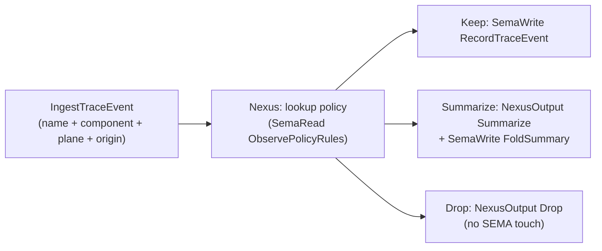

# 469 — Introspect component design

## TL;DR

Per Spirit 1398 (Decision High, 2026-06-02), introspect is a new component using schema-next-based triad engine interfaces. It plays three roles:

1. **Configurable trace destination** — every spirit-stack component (spirit-next, future-persona, future-orchestrate, future cloud / harness / mind) pushes name-only trace events (per Spirit 1394) here as binary rkyv frames over `signal-introspect::IngestTraceEvent`.
2. **Trace policy hub** — Nexus decides per-event: Keep durably, Drop on filter rule, Summarize into a rolling aggregate, Fanout to live Subscribe streams. Policy is itself SEMA-stored typed records, mutated via owner-signal.
3. **Queryable intel source** — clients ask introspect for trace data by component, route, time window, name pattern, or origin identifier. CLI renders (per Spirit 1373: no NOTA between components; CLI is the translation surface).

Schema source proposes five `Input` variants (`ConfigureTracePolicy` / `IngestTraceEvent` / `QueryTraceEvents` / `Subscribe` plus auto-injected `Help` per Spirit 1396), with the **routing decision** (Keep / Drop / Summarize / Fanout) as the heart of the design. The Nexus decision count substantially exceeds the SEMA write variant count — three `NexusOutput` side-channel variants (`Fanout` / `Summarize` / `Drop`) sit alongside the SEMA writes, confirming designer 468's candidate 2 (Nexus side-channel pattern). Push model for ingestion; greenfield migration with persona-spirit retiring its Tap/Untap placeholder when spirit-next ships.

Five ratification candidates emerge: (1) confirms Nexus side-channel from 468; (2) **Configure universal Input variant pattern** (every component declares a policy-configuration root); (3) **introspect is the canonical Layer 2 witness store**; (4) **trace policy is a SEMA-stored typed-record**; (5) Help action recursion applied to trace-introspection vocabulary. Next-slice recommendation: minimal introspect daemon implementing IngestTraceEvent + QueryTraceEvents on schema-next, spirit-next configures push under `testing-trace`, CLI queries introspect, round-trip Layer 2 e2e witness.

## Section 1 — Component purpose and boundaries

### What introspect IS

Introspect is a **trace-pipeline component**. The pipeline has three observable phases that introspect owns:

- **Ingestion** — receives binary rkyv `TraceEvent` frames from every spirit-stack component over its `signal-introspect` socket. Each frame carries the activation name (per Spirit 1394: name-only trace), the origin identifier per Spirit 1336, and the component-identifying metadata that name alone can't carry (which component, which plane, when).
- **Policy** — decides per-ingested-event what to do: append durably to the SEMA trace log (the Layer 2 witness store), drop the event per filter rule, fold into a rolling summary aggregate (per-component / per-route / per-event-name counters), or fan out to live `Subscribe` streams. Policy is itself a SEMA-stored typed record kind — mutated through owner-signal, queried like any other state.
- **Query** — serves typed query results back to peer clients. Query interface splits by handle-driven `Lookup` (by event identifier), filter-driven `Observe` (by component, route, time-range, event-name pattern), aggregate `Count` (per Spirit 1351 slim acknowledgement), and rolling `Summarize` (the policy-folded aggregates).

The component implements the **receiver side** of the trace traits Spirit 1365 names — every spirit-stack engine's `trace_<plane>_activation` hook emits over a socket destination; introspect is the socket destination.

### What introspect ROUTES (input shape)

Every triad-architecture component routes trace to introspect by:

1. Holding a configured `IntrospectSocket` path in its daemon configuration (a new field in the daemon's NOTA-shaped configuration record per the single-argument rule).
2. Emitting a **binary rkyv frame** containing a `TraceEvent { component_identifier, plane, activation_name, origin_identifier, timestamp }` payload through that socket using the `signal-introspect::IngestTraceEvent` operation envelope.
3. Per Spirit 1373: **no NOTA between components**. The wire is binary; only `introspect` CLI ↔ introspect daemon at the user-facing edge speaks NOTA (and the CLI translates).

The wire shape is the Spirit 1394 name-only trace shape, plus the four small typed accompaniments (component identifier, plane label, origin identifier, daemon-stamped timestamp). Payload data does not travel — per Spirit 1394, the trace records only the activation name; payload follow-up to the trace event uses a separate Signal call against the originating component.

### What introspect EMITS BACK (output shape)

To clients, introspect emits **typed query results** as ordinary `signal-introspect` Signal output:

- Slim acknowledgements per Spirit 1389 + 1351 (`PolicyConfigured(ConfigurationReceipt)`, `TraceEventIngested(IngestionReceipt)`, `SubscriptionOpened(SubscriptionHandle)`).
- `TraceEventsQueried(QueryResult)` carries either inline records when result size is small or a `ResultHandle` (per designer 468's Stash pattern) when the result set is large — Nexus decides inline-vs-stash via a count probe.
- `Subscribe` streams emit `TraceEventAppended(TraceObservation)` push-events on every kept event matching the subscription filter.

### What introspect DOES NOT do

Three explicit boundaries:

- **Introspect does not render.** Pretty-printing, color, layout, columnar display, narrative summarisation are CLI responsibilities per Spirit 1373 (CLI is the translation/debugging surface). Introspect serves typed data; the `introspect` CLI translates to human-facing prose.
- **Introspect does not analyze.** Pattern detection (anomalies, regressions, sequence-mining) is an upstream consumer's concern. Introspect serves the queryable substrate; consumers ask the questions. An `introspect-analyzer` future component would be a Signal client of introspect, not a sub-module of it.
- **Introspect does not interpret payloads.** Per Spirit 1394, trace carries name only. If a consumer needs the typed payload that flowed through SEMA at the moment of activation, the consumer issues a separate Signal call against the originating component using the trace event's origin identifier. Introspect knows nothing about the payload schema; that knowledge lives in the schemas of the components being traced.

The boundary discipline preserves component independence: introspect's schema does not know spirit-next's schema or persona's schema. The trace wire shape is the universal Spirit 1394 name-only shape; every component speaks it identically.

## Section 2 — Schema source sketch

The schema follows operator 281 §"Current Pipeline" as the template (namespace declaration + Input root + Output root + Nexus planes + SEMA write planes + SEMA read planes + supporting types). Brackets are the only string form; records are positional.

### Ordinary signal — `signal-introspect/schema/lib.schema`

```nota
{}
[
  (ConfigureTracePolicy PolicyConfiguration)
  (IngestTraceEvent TraceEventPayload)
  (QueryTraceEvents TraceQuery)
  (Subscribe TraceSubscription)
]
[
  (PolicyConfigured ConfigurationReceipt)
  (TraceEventIngested IngestionReceipt)
  (TraceEventsQueried QueryResult)
  (SubscriptionOpened SubscriptionHandle)
  (Error ErrorReport)
  (Rejected SignalRejection)
]
{
  NexusInput [
    (Signal Input)
    (SemaWrite SemaWriteOutput)
    (SemaRead SemaReadOutput)
  ]
  NexusOutput [
    (SemaWrite SemaWriteInput)
    (SemaRead SemaReadInput)
    (Signal Output)
    (Fanout FanoutOperation)
    (Summarize SummarizeOperation)
    (Drop DropOperation)
  ]

  SemaWriteInput [
    (RecordTraceEvent TraceRecord)
    (RecordPolicyRule PolicyRecord)
    (FoldSummary SummaryUpdate)
    (RegisterSubscription SubscriptionRecord)
    (RetireSubscription SubscriptionIdentifier)
  ]
  SemaReadInput [
    (LookupTraceEvent TraceEventIdentifier)
    (ObserveTraceEvents TraceFilter)
    (CountTraceEvents TraceFilter)
    (SummarizeTraceEvents SummaryQuery)
    (ObservePolicyRules PolicyFilter)
    (ObserveSubscriptions SubscriptionFilter)
  ]

  SemaWriteOutput [
    (TraceEventRecorded SemaReceipt)
    (PolicyRuleRecorded SemaReceipt)
    (SummaryFolded SemaReceipt)
    (SubscriptionRegistered SemaReceipt)
    (SubscriptionRetired SemaReceipt)
    (Missed ErrorReport)
  ]
  SemaReadOutput [
    (TraceEventFound TraceObservation)
    (TraceEventsObserved TraceObservations)
    (TraceEventsCounted CountResult)
    (TraceEventsSummarized SummaryDigest)
    (PolicyRulesObserved PolicyObservations)
    (SubscriptionsObserved SubscriptionObservations)
    (Missed ErrorReport)
  ]

  PolicyConfiguration {
    rules (Vec PolicyRule)
    defaultDisposition Disposition
  }
  PolicyRule {
    componentMatch ComponentMatch
    planeMatch PlaneMatch
    activationNameMatch NameMatch
    disposition Disposition
    priority Priority
  }
  ComponentMatch [(Any) (Exact ComponentIdentifier) (Family ComponentFamily)]
  PlaneMatch [(Any) (Exact Plane)]
  NameMatch [(Any) (Exact ActivationName) (Prefix ActivationName) (Suffix ActivationName) (Pattern PatternString)]
  Disposition [Keep Drop Summarize KeepAndFanout SummarizeAndFanout]
  Priority Integer

  Plane [Signal Nexus Sema]
  ComponentIdentifier String
  ComponentFamily [Spirit Persona Orchestrate Harness Cloud Mind Other]
  ActivationName String
  PatternString String
  PolicyRecord {
    Identifier PolicyIdentifier
    rule PolicyRule
    activatedAt Timestamp
  }
  PolicyIdentifier Integer

  TraceEventPayload {
    componentIdentifier ComponentIdentifier
    plane Plane
    activationName ActivationName
    originIdentifier OriginIdentifier
    stampedAt Timestamp
  }
  TraceRecord {
    Identifier TraceEventIdentifier
    componentIdentifier ComponentIdentifier
    plane Plane
    activationName ActivationName
    originIdentifier OriginIdentifier
    stampedAt Timestamp
    ingestedAt Timestamp
  }
  TraceEventIdentifier Integer
  OriginIdentifier Integer
  Timestamp Integer

  TraceQuery {
    componentMatch ComponentMatch
    planeMatch PlaneMatch
    activationNameMatch NameMatch
    originMatch OriginMatch
    timeMatch TimeMatch
    projection QueryProjection
  }
  OriginMatch [(Any) (Exact OriginIdentifier)]
  TimeMatch [(Any) (Since Timestamp) (Until Timestamp) (Between BetweenTimestamps)]
  BetweenTimestamps { lower Timestamp upper Timestamp }
  QueryProjection [Summary Inline WithIdentifiersOnly]

  TraceFilter {
    componentMatch ComponentMatch
    planeMatch PlaneMatch
    activationNameMatch NameMatch
    originMatch OriginMatch
    timeMatch TimeMatch
  }
  TraceObservations (Vec TraceObservation)
  TraceObservation {
    Identifier TraceEventIdentifier
    componentIdentifier ComponentIdentifier
    plane Plane
    activationName ActivationName
    originIdentifier OriginIdentifier
    stampedAt Timestamp
    ingestedAt Timestamp
  }
  CountResult { count Integer DatabaseMarker }

  SummaryQuery {
    componentMatch ComponentMatch
    planeMatch PlaneMatch
    timeMatch TimeMatch
    grouping SummaryGrouping
  }
  SummaryGrouping [ByComponent ByPlane ByActivationName ByOrigin]
  SummaryDigest {
    grouping SummaryGrouping
    tallies (Vec SummaryTally)
    DatabaseMarker
  }
  SummaryTally {
    bucket SummaryBucket
    count Integer
  }
  SummaryBucket [
    (Component ComponentIdentifier)
    (Plane Plane)
    (ActivationName ActivationName)
    (Origin OriginIdentifier)
  ]
  SummaryUpdate {
    grouping SummaryGrouping
    bucket SummaryBucket
    increment Integer
  }

  TraceSubscription {
    componentMatch ComponentMatch
    planeMatch PlaneMatch
    activationNameMatch NameMatch
  }
  SubscriptionRecord {
    Identifier SubscriptionIdentifier
    filter TraceSubscription
    openedAt Timestamp
  }
  SubscriptionIdentifier Integer
  SubscriptionHandle {
    Identifier SubscriptionIdentifier
    DatabaseMarker
  }
  SubscriptionFilter { active (Optional Boolean) }
  SubscriptionObservations (Vec SubscriptionRecord)

  PolicyFilter { active (Optional Boolean) }
  PolicyObservations (Vec PolicyRecord)

  FanoutOperation {
    subscriptionIdentifiers (Vec SubscriptionIdentifier)
    traceRecord TraceRecord
  }
  SummarizeOperation {
    update SummaryUpdate
    traceRecord TraceRecord
  }
  DropOperation {
    reason DropReason
    activationName ActivationName
  }
  DropReason [PolicyFiltered RateLimited SubscriberSaturated]

  ConfigurationReceipt { Identifier PolicyIdentifier DatabaseMarker }
  IngestionReceipt { Identifier TraceEventIdentifier DatabaseMarker disposition Disposition }
  QueryResult [
    (Inline TraceObservations)
    (Handle ResultHandle)
  ]
  ResultHandle {
    Identifier ResultIdentifier
    count Integer
    DatabaseMarker
  }
  ResultIdentifier Integer
  DatabaseMarker Integer

  ErrorReport { reason ErrorReason context ContextNote }
  ErrorReason [
    PolicyConflict
    UnknownComponent
    UnknownPolicy
    UnknownSubscription
    InvalidPattern
    StorageBoundary
  ]
  ContextNote String
  SignalRejection { reason RejectionReason }
  RejectionReason [Unauthorized Malformed UnsupportedOperation OverCapacity]
}
```

### Owner signal — `owner-signal-introspect/schema/lib.schema`

The owner surface is the policy-authority side. The peer-callable `ConfigureTracePolicy` adds rules under existing schema; the owner surface mutates the **policy schema** itself — retention windows, summary grouping defaults, the registered component family catalog, rate-limit envelopes.

```nota
{}
[
  (SetRetentionPolicy RetentionPolicy)
  (SetSummaryGroupingDefaults SummaryGroupingDefaults)
  (RegisterComponentFamily ComponentFamilyRegistration)
  (RetireComponentFamily ComponentFamily)
  (SetIngestionLimits IngestionLimits)
  (PurgeTraceEvents PurgeRequest)
]
[
  (RetentionPolicyUpdated PolicyReceipt)
  (SummaryGroupingDefaultsUpdated PolicyReceipt)
  (ComponentFamilyRegistered PolicyReceipt)
  (ComponentFamilyRetired PolicyReceipt)
  (IngestionLimitsUpdated PolicyReceipt)
  (TraceEventsPurged PurgeReceipt)
  (Error ErrorReport)
  (Rejected SignalRejection)
]
{
  RetentionPolicy {
    maxAgeSeconds Integer
    maxRecordCount Integer
    archiveOnExpiry Boolean
  }
  SummaryGroupingDefaults {
    defaultGroupings (Vec SummaryGrouping)
    rollingWindowSeconds Integer
  }
  ComponentFamilyRegistration {
    family ComponentFamily
    allowedComponentPattern PatternString
    defaultDisposition Disposition
  }
  IngestionLimits {
    perComponentEventsPerSecond Integer
    perSubscriptionFanoutPerSecond Integer
    saturationBehavior SaturationBehavior
  }
  SaturationBehavior [DropOldest DropNewest RejectIngestion]
  PurgeRequest {
    componentMatch ComponentMatch
    timeMatch TimeMatch
    confirmationPhrase ConfirmationPhrase
  }
  ConfirmationPhrase String
  PolicyReceipt { DatabaseMarker }
  PurgeReceipt {
    purgedCount Integer
    DatabaseMarker
  }
}
```

The owner surface is where authority lives: only the workspace owner can change retention, register component families, or purge. Peer agents can configure per-rule policy via the ordinary `ConfigureTracePolicy` — but cannot raise retention windows or purge.

## Section 3 — Nexus decision matrix

This is the heart of the design. Introspect's Nexus carries **the routing decision per ingested event** (Keep / Drop / Summarize / Fanout) — the most teaching-laden decision in the design because it exercises every aspect of the engine-trait pattern: per-event policy match, multi-target side-channel emission, slim acknowledgement back to the ingesting component.

### Per-variant decision table

| Input variant | Nexus decision | Lowers to |
|---|---|---|
| `ConfigureTracePolicy` | **Decide rule-merge vs rule-replace**: lookup existing policy rules via `SemaReadInput::ObservePolicyRules`; for each incoming rule, decide if it conflicts with an active rule of higher priority (reject with `PolicyConflict`), supersedes an existing rule of lower priority (replace), or appends as a new rule. | `SemaWriteInput::RecordPolicyRule` per accepted rule; `Signal::Rejected` if conflict |
| `IngestTraceEvent` | **The central routing decision — Keep / Drop / Summarize / Fanout.** Lookup matching policy rules (highest-priority match wins via `SemaReadInput::ObservePolicyRules`); compute disposition: `Keep` → `SemaWriteInput::RecordTraceEvent`; `Drop` → emit `NexusOutput::Drop` side-channel only, no SEMA touch; `Summarize` → emit `NexusOutput::Summarize` side-channel which fans into `SemaWriteInput::FoldSummary`; `KeepAndFanout` → both `SemaWriteInput::RecordTraceEvent` AND `NexusOutput::Fanout` to matching subscribers (lookup via `SemaReadInput::ObserveSubscriptions`); `SummarizeAndFanout` → both summarize AND fanout. Returns slim `TraceEventIngested(IngestionReceipt)` carrying disposition + identifier so the ingesting component sees what happened. | Per disposition branch above |
| `QueryTraceEvents` | **Decide inline-vs-stash by count probe** (designer 468 candidate 2 pattern): cheap `SemaReadInput::CountTraceEvents` against the filter; if count below inline-threshold → `SemaReadInput::ObserveTraceEvents` + return `QueryResult::Inline`; otherwise → `SemaReadInput::ObserveTraceEvents` writing to stash + return `QueryResult::Handle`. Projection variants alter the SEMA call: `Summary` → `SemaReadInput::SummarizeTraceEvents`; `WithIdentifiersOnly` → projection-only read returning identifiers; `Inline` → full observations. | `SemaReadInput::CountTraceEvents` + projection-driven SEMA read |
| `Subscribe` | **Install subscription side-effect**: mint subscription identifier; persist filter as a `SubscriptionRecord` via `SemaWriteInput::RegisterSubscription`; subsequent `IngestTraceEvent` decisions reference this registry. Returns slim `SubscriptionOpened(SubscriptionHandle)`. | `SemaWriteInput::RegisterSubscription` |
| `Help` (auto-injected per Spirit 1396) | **Decide top-level vs verb-level**: `(Help Main)` → return component-vocabulary overview using emitter-derived help text; `(Help (Verb <name>))` → return per-operation schema description. No SEMA touch — the response is wholly schema-derived. | Pure `Signal::Output` reply; no SEMA call |

### The routing decision — why it's the most teaching-laden

The `IngestTraceEvent` routing decision (Keep / Drop / Summarize / Fanout) is the highest-density Nexus example in the workspace design corpus to date because:

1. **It exercises the side-channel pattern (designer 468 candidate 2) three times in one decision.** Drop emits the side-channel WITHOUT a SEMA write (just an accounting trace); Summarize emits the side-channel AND issues a SEMA write (the FoldSummary); Fanout emits the side-channel AND optionally a SEMA write (KeepAndFanout) AND consults SEMA for the subscription registry. The pattern's three modes are all present in one decision.
2. **It carries the workspace-wide "policy is a typed record consulted at runtime" pattern.** Per record 1339 (no parallel APIs), policy lives ONLY in SEMA — never in hardcoded Rust constants. Every ingest event is a SEMA read against the policy table.
3. **It demonstrates per-component policy clarity.** A trace event from spirit-next's NexusEntered carries the component identifier + plane + activation name; the policy rule "drop all Nexus activations from spirit-next during high-volume periods" matches exactly. The rule is data; the decision is generated from data + input.
4. **The slim acknowledgement carries the disposition.** Per Spirit 1389, output is slim. But the ingesting component needs to know what introspect did with its event — that's the trace-emitter's introspection of its own trace-emission. The `IngestionReceipt { Identifier, DatabaseMarker, disposition }` carries the bare-minimum truth: did this event survive, get summarized, get dropped?

### Decision flow diagram



Five nodes; honors Spirit 1282. The Fanout side-channel emits in parallel with Keep / Summarize as a multi-target multiplier on the disposition; it's not a separate route from policy-match — the visual collapses it into the Keep / Summarize branches because `KeepAndFanout` and `SummarizeAndFanout` are dispositions, not separate matches.

### Nexus output variant count vs SEMA write variant count

Per designer 468 candidate 4 (Nexus output exceeds SEMA write variant count when Nexus earns its keep): introspect's NexusOutput has **six variants** (`SemaWrite` + `SemaRead` + `Signal` + `Fanout` + `Summarize` + `Drop`); SemaWriteInput has **five variants** (`RecordTraceEvent` + `RecordPolicyRule` + `FoldSummary` + `RegisterSubscription` + `RetireSubscription`). Three of the NexusOutput variants (`Fanout` / `Summarize` / `Drop`) are side-channel decisions distinct from SEMA writes — this is the structural signature of a Nexus making real decisions rather than projecting Signal-to-SEMA mechanically. Confirms designer 468 candidate 2 as a workspace pattern.

## Section 4 — Trace-flow integration with other components

### The two options

**Option A — Push model.** Each spirit-stack component's daemon holds an `IntrospectSocket` field in its NOTA daemon configuration. The daemon's `trace_<plane>_activation` hook implementation writes a binary rkyv `TraceEvent` frame through that socket using the `signal-introspect::IngestTraceEvent` operation envelope. Introspect's signal listener receives, routes through Nexus per the policy decision matrix in Section 3, replies with a slim acknowledgement back to the emitting component.

**Option B — Pull model.** Each component exposes a `trace-tap` signal endpoint. Introspect connects as a Signal client to every configured trace-tap and pulls events. The component holds a circular trace buffer; introspect periodically drains the buffer.

### Recommendation — Push model

**Push model is recommended** per the following analysis:

1. **Consistent with Spirit 1373 (no NOTA between components; binary protocol).** The push model carries binary rkyv frames over a signal socket — exactly the workspace standard inter-component wire. The pull model would require the same shape; the directionality is the only difference.
2. **Consistent with the Layer 2 witness pattern (Spirit 1349-1350).** The Layer 2 witness needs events to be observable *as they happen* — a push model emits at the activation moment with no buffer-drain delay. The pull model would introduce a latency window between trace event and witness availability, weakening the Layer 2 guarantee.
3. **Lower component-side complexity.** Push requires the component to know one configured socket and write a frame per activation. Pull requires the component to maintain a typed circular buffer, expose a tap signal endpoint, handle introspect's `Subscribe` semantics on its own runtime, and reason about buffer-overflow semantics when introspect is slow to drain. The pull model invades the traced component's runtime; the push model does not.
4. **Per push-not-pull discipline (skills/push-not-pull.md).** The workspace prefers push over pull for state propagation. Trace event propagation is no exception.
5. **Backpressure handled at introspect's boundary, not the traced component's.** Per the owner-signal `IngestionLimits` field `saturationBehavior`, introspect handles overload by dropping (oldest or newest) or rejecting ingestion — the traced component's `IngestTraceEvent` call gets a `Rejected(OverCapacity)` reply and the trace simply doesn't get recorded that cycle. This degrades gracefully; the traced component's runtime is not blocked.

### Wire shape (push model)

The traced component's per-activation flow:

```text
component daemon: NexusEngine::execute called
  ↓
component's NexusEngine impl: business work
  ↓
component's trace_nexus_activation("NexusEntered") hook fires
  ↓
hook implementation: serialize TraceEvent { component_identifier, Nexus, "NexusEntered", origin_identifier, daemon-stamped timestamp } as rkyv
  ↓
write signal frame over IntrospectSocket carrying IngestTraceEvent envelope
  ↓
introspect daemon receives, routes through Nexus, replies with IngestionReceipt
```

The latency is dominated by the socket write + introspect's match against the policy registry; in the common-case Drop path introspect doesn't touch SEMA, so the reply is fast.

### Configuration shape

Each component's daemon NOTA configuration gains an `IntrospectSocket` field (optional — `None` means no introspect, trace is disabled at the wire level). Introspect's socket is itself a path; the field carries the path string:

```nota
; spirit-next daemon configuration (illustrative)
(
  [/run/persona-spirit/ordinary.sock]
  [/run/persona-spirit/owner.sock]
  [/run/persona-spirit/upgrade.sock]
  [/var/lib/persona-spirit/spirit.redb]
  Maximum
  (Some [/run/introspect/ingest.sock])
  None None None
)
```

The field lands in an existing `None` slot per the daemon's configuration record extension discipline (skills/component-triad.md §"The single argument rule" — new fields land by filling reserved slots, not by adding flags).

## Section 5 — Connection to the deployed persona-introspect legacy

### Current state

The deployed `persona-spirit` Spirit 0.3.0 carries a `Tap` / `Untap` operation pair in its ordinary contract that fans out trace events to a `persona-introspect` component. Per `skills/spirit-cli.md` §"Subscribe / unsubscribe": *"Tap/Untap fanout is currently a no-op placeholder pending persona-introspect."*

So the placeholder exists in the wire contract but is unimplemented — there is no live persona-introspect daemon. The deployed persona-spirit's Tap arm returns a placeholder response without producing real fanout.

### The two options

**Option A — Greenfield.** introspect is a brand-new component on schema-next. Per Spirit 1398, it drops the persona prefix (the name is `introspect`, not `persona-introspect`). The persona-spirit Tap/Untap placeholder retires when spirit-next ships; spirit-next does not carry Tap/Untap at all — instead, spirit-next-the-component pushes trace events to introspect via the IntrospectSocket configuration field per Section 4.

**Option B — Continuity.** introspect implements a Tap/Untap-equivalent ingest path. spirit-next continues to carry Tap/Untap in its wire contract. introspect implements the receiver side of Tap/Untap; the wire shape persists across the transition.

### Recommendation — Greenfield

**Greenfield migration is recommended** per the following:

1. **The Tap/Untap placeholder was never load-bearing.** Per the spirit-cli skill, the current persona-spirit Tap arm is a no-op; no consumer depends on its behavior. There is no production user to migrate gracefully.
2. **Per ESSENCE.md §"Backward compatibility is not a constraint" — break the wrong shape for the right shape.** Tap/Untap is the wrong shape: it puts subscription logic inside the trace-emitting component instead of inside the trace-receiving component. The push model (Section 4) is structurally cleaner. Continuing Tap/Untap would propagate the wrong shape.
3. **The naming change (drop the persona prefix) per Spirit 1398 is itself a discontinuity.** A component renamed to `introspect` carrying the old Tap/Untap mechanics would be confusingly cross-version: same name as the new component but wrong internals. Cleaner to retire and replace.
4. **Spirit-next replaces persona-spirit; introspect replaces persona-introspect.** Both are next-stack components in the schema-next era. The cutover for introspect aligns naturally with the spirit-next cutover wave.

### Cutover sequence

The recommended cutover, depth-first per Spirit 1355:

1. **Slice 1**: Land introspect daemon on schema-next implementing `IngestTraceEvent` + `QueryTraceEvents` (the smallest meaningful slice per Section 7). spirit-next ships a configured push-to-introspect path under `testing-trace`. Layer 2 witness end-to-end.
2. **Slice 2**: Add `ConfigureTracePolicy` + the Nexus decision matrix per Section 3. spirit-next configures a default `Keep` policy; subsequent components add their policy rules as they come online.
3. **Slice 3**: Add `Subscribe` for live monitoring + the Fanout side-channel.
4. **Slice 4 (cutover)**: Persona-spirit's deployed Tap/Untap placeholder retires when its replacement spirit-next ships — no separate cutover step needed beyond the spirit-next deployment itself. Introspect is in production from Slice 1 onward; the only thing that changes at the persona-spirit retirement boundary is that the placeholder wire contract goes away.

This sequence honors the "depth-first prototype-proving" discipline (Spirit 1355) — each slice proves one capability end-to-end before adding the next.

## Section 6 — Five ratification candidates

The design surfaces five candidate intent captures that would name workspace patterns earned by introspect's shape. Each is stated, recommended kind/magnitude, and rationale.

### Candidate 1 — Confirms designer 468 candidate 2 (Nexus side-channel `NexusOutput` variant for non-SEMA decisions)

(Principle Maximum candidate, escalation from designer 468 candidate 2 High): *"Where Nexus makes a decision that is neither a SEMA write nor a Signal output (subscription install, cascade fan-out, preemption emission, result stash, **drop side-channel, summarize side-channel, fanout side-channel**), it emits a typed `NexusOutput` side-channel variant naming the operation. The side-channel keeps the SEMA boundary clean for state-bearing operations only."*

**Rationale**: introspect's design produces **three new side-channel variants in one component** (`Fanout` / `Summarize` / `Drop`). Designer 468 named the pattern across spirit pilot (`Stash`), persona (`Cascade`), and orchestrate (`Preempt` / `Enqueue`) — introspect adds three more and demonstrates that the pattern is universal-by-design, not domain-incidental. The escalation from High to Maximum reflects that the pattern is now demonstrated across four component design sketches with no exceptions.

### Candidate 2 — Configure as a universal Input variant pattern

(Principle High candidate, NEW): *"Every component that carries policy or configuration declares a `Configure<Domain>Policy` variant in its ordinary `Input` root that ingests rule sets into the SEMA-stored policy registry. The Configure variant is the peer-callable side of policy mutation; owner-signal carries the policy-schema-mutation side (which kinds of rules exist, retention envelopes, etc)."*

**Rationale**: introspect's `ConfigureTracePolicy` is the canonical example. Designer 468 sketched persona with `GrantCapability` / `RevokeCapability` and orchestrate with `Claim` / `Release` — these are policy-side configurations dressed as domain operations. The pattern generalizes: every component has a policy-shape that peers (not just the owner) can configure within bounds owner sets. Naming this as a universal variant pattern would push every future component to declare a `Configure*` Input variant at the top level rather than smuggling configuration through ad-hoc Update operations.

The Configure-vs-owner-mutation split also clarifies authority: owner authorizes WHICH policy schemas exist, peers configure WITHIN them. A `Configure<X>Policy` variant in the ordinary contract is correct iff there exists a corresponding owner-signal authority that bounds it.

### Candidate 3 — Introspect is the canonical Layer 2 witness store for the workspace

(Decision Maximum candidate, NEW): *"introspect is the canonical durable Layer 2 witness store for the workspace. Every spirit-stack component in testing-trace build mode pushes name-only trace events to introspect; tests query introspect to assert Layer 2 architectural-crossing claims. Spirit 1349-1350's testing-build logging socket pattern is realized by introspect's IngestTraceEvent + QueryTraceEvents pair; the CLI as log surface (Spirit 1347) renders introspect query results for the testing flow."*

**Rationale**: Spirit 1349 named the testing-build logging socket as the workspace Layer 2 runtime witness substrate; Spirit 1350 named per-engine self-verification; Spirit 1370 named live trace through daemon back to CLI. Introspect is the component that materializes all three: it IS the socket destination, it IS the durable store, it IS what the CLI queries when rendering. Naming introspect as canonical closes the gap between Spirit 1349-1350's pattern and the component implementing it.

### Candidate 4 — Trace policy is a SEMA-stored typed-record

(Principle High candidate, NEW): *"Component policy state — including trace policy, capability policy, lane scheduling policy, and policy state of every triad component — is a SEMA-stored typed record set, never a hardcoded Rust constant or a parallel non-SEMA store. Policy lookups during runtime decisions are SEMA reads against the policy tables. Policy mutations are SEMA writes (peer-callable via ordinary `Configure*` variants per Candidate 2; owner-callable via owner-signal). The policy-tables-as-records pattern unifies how components are configured at runtime."*

**Rationale**: introspect demonstrates this most clearly because its Nexus decision (Keep/Drop/Summarize/Fanout) is **a per-event policy lookup at runtime** — there is no static policy. Spirit-next's policy (which kinds of records can be recorded) is implicit in the schema today; introspect's policy is explicit and per-event. The clarity teaches the pattern: policy belongs in SEMA, lookups are SEMA reads, mutations are SEMA writes. The Component Triad §5 "Policy state and working state — both in one sema-engine DB" already names this for first-start bootstrap; this candidate makes the runtime-lookup discipline explicit.

### Candidate 5 — Help action recursion applied to trace-introspection vocabulary

(Clarification Medium candidate, NEW): *"Spirit 1396's auto-generated Help action applied to introspect's vocabulary surfaces an interesting recursion: querying introspect's Help action returns Help vocabulary that itself can be queried via Help. Future introspect-style components (debug-introspect, deploy-introspect) inherit the same pattern. The Help recursion combined with the trace-event vocabulary makes introspect self-documenting at the wire level — clients can discover the trace event names, the policy match shapes, the disposition vocabulary without external documentation."*

**Rationale**: Spirit 1396 named the auto-Help injection. Introspect's vocabulary is the natural test bed because the help text is itself a kind of trace into the schema. The recursion combined with introspect's role as the trace store means introspect is the component that demonstrates "every component's Help is queryable" at the workspace-discovery level. Medium magnitude because the recursion is structural-not-load-bearing; the High candidates above are heavier.

## Section 7 — Concrete next-slice recommendation

Per Spirit 1355 (depth-first prototype-proving), the smallest meaningful introspect slice that proves the design end-to-end:

### Slice 1 scope

**Component shape**:
- Stand up minimal introspect daemon on schema-next.
- Single binary (CLI + daemon per component-triad convention; daemon binary `introspect-daemon`, CLI binary `introspect`).
- NOTA-shaped configuration record per the single-argument rule.
- Implements just `IngestTraceEvent` + `QueryTraceEvents` from the ordinary contract.
- No `ConfigureTracePolicy` (default behavior: `Disposition::Keep` for every ingested event).
- No `Subscribe` (defer to Slice 3).
- No owner-signal yet (defer to Slice 2 alongside policy).
- Auto-generated `Help` per Spirit 1396 — picked up free from schema-rust-next emission.

**Layer 2 end-to-end witness**:
1. spirit-next configured with `IntrospectSocket` pointing at introspect's ingest socket, under `testing-trace` feature.
2. spirit-next's `trace_<plane>_activation` hook implementations write rkyv `TraceEvent` frames to that socket per Section 4's push model.
3. spirit-next runs the test sequence: a `Record` operation, then an `Observe` operation. Per designer 467's name-only trace prototype, this produces 12 name-only activations across Signal / Nexus / SEMA planes.
4. introspect daemon receives, routes Keep (default policy), writes to SEMA trace table — 12 SEMA writes.
5. The test invokes the `introspect` CLI: `introspect "(QueryTraceEvents ((Exact spirit-next) Any Any Any Any Inline))"`.
6. introspect's Nexus inline-vs-stash decides inline (12 events is well under threshold); returns `TraceEventsQueried(Inline TraceObservations)` carrying all 12 records.
7. The test asserts the 12 activation names match the expected sequence (`SignalAdmitted` / `SignalTriaged` / `NexusEntered` / `SemaWriteApplied` / `NexusDecided` / `SignalReplied` × 2).

This is a **round-trip Layer 2 witness across two daemons** — spirit-next emits, introspect ingests + stores + serves, CLI queries, test asserts. The architectural-crossing claim is now witnessed not just within spirit-next but at the cross-component level.

### Open questions for the slice

1. **Component identifier shape.** What does spirit-next pass as `componentIdentifier`? Recommendation: the daemon binary's typed identity (e.g. `spirit-next` as a `ComponentIdentifier(String)`). Could grow to include version (`spirit-next@v0.4.0`) if the trace store cares to disambiguate across versions.
2. **Origin identifier shape across components.** Per Spirit 1336 the origin identifier threads through one component's pipeline. For introspect to correlate trace events from multiple components on the same logical request, the origin identifier needs a discriminator (which component minted it). Recommendation for Slice 1: treat the origin identifier as opaque per component; cross-component correlation lands in Slice 2 with a typed `CrossComponentOrigin` wrapper.
3. **Database layout.** Introspect's SEMA store has at minimum `trace_events`, `policy_rules`, `subscriptions`, `summary_buckets` tables. For Slice 1 only `trace_events` is needed.

### What Slice 1 doesn't prove

Slice 1 doesn't prove the Nexus routing decision (Keep / Drop / Summarize / Fanout) is operational — that lands in Slice 2 with policy. Slice 1 also doesn't prove live monitoring works — Slice 3 lands Subscribe. The cumulative arc closes the full design over 3-4 slices.

### Action item for operator

After this report is reviewed by psyche and ratified, operator can pick up Slice 1 as a multi-repo bead:
- Create `introspect` repository (schema-next-based daemon + CLI + thin runtime).
- Create `signal-introspect` repository (schema source + emitted types per the Section 2 sketch).
- Create `owner-signal-introspect` repository (owner contract per Section 2 sketch).
- Modify `spirit-next` to add `IntrospectSocket` configuration field and route trace via push under `testing-trace`.
- Land round-trip Layer 2 witness test in `spirit-next/tests/` or a new `introspect/tests/` cross-component test.

## Cross-references

- Spirit record 1398 (Decision High, 2026-06-02) — the introspect directive itself.
- Spirit records 1343-1351 (Maximum × 5 + High × 3) — testing-build logging architecture; introspect is the canonical Layer 2 destination.
- Spirit record 1356 (High) — queryable tool-call trace as agent memory; introspect generalizes from agents to components.
- Spirit record 1365 (Correction Maximum) — trace as trait on schema-derived interfaces; introspect implements receiver side.
- Spirit record 1373 (Principle Maximum) — CLI is translation surface; no NOTA between components; introspect daemon receives binary, CLI renders.
- Spirit record 1389 (Decision High) — slim Nexus output; introspect's query interface implements specifics side.
- Spirit record 1390 (Constraint Maximum) — trace must prove runtime use; introspect makes Layer 2 witnesses queryable.
- Spirit record 1394 (Correction High) — trace records only activation name; introspect ingests name events only.
- Spirit record 1395 (Decision High) — developed interfaces; introspect's interface is non-toy.
- Spirit record 1396 (Decision High) — Help action auto-generated.
- `reports/designer/468-developed-interfaces-spirit-persona-orchestrate-2026-06-02.md` — design pattern template + side-channel candidate.
- `reports/designer/467-name-only-trace-research-and-prototype-2026-06-02.md` — name-only trace prototype; introspect ingests those events.
- `reports/designer/466-triad-engine-honesty-situation-2026-06-01/3-overview.md` — honesty situation; introspect lands without the gaps surfaced.
- `reports/operator/281-generated-interface-logic-with-macros-2026-06-02.md` — current engine-trait shape; template for Section 2.
- `skills/component-triad.md` §"Runtime triad engine traits" + §"The single argument rule" — discipline this design honors.
- `skills/nota-design.md` — positional records, bracket strings, namespace shape.
- `skills/spirit-cli.md` — Tap/Untap placeholder context for Section 5.
- `skills/push-not-pull.md` — discipline supporting push-model recommendation.

## For the orchestrator (chat paraphrase)

Designer 469 lands the introspect component design per Spirit 1398. Schema source at engine-trait level: five Input variants (ConfigureTracePolicy / IngestTraceEvent / QueryTraceEvents / Subscribe + auto-Help), with the IngestTraceEvent routing decision (Keep / Drop / Summarize / Fanout) as the heart. NexusOutput has six variants (three side-channel: Fanout / Summarize / Drop) vs five SemaWriteInput variants — confirms designer 468 candidate 2 as a universal pattern, the most teaching-laden Nexus decision in the workspace design corpus so far. Push model recommended over pull (consistent with Spirit 1373 binary-protocol + push-not-pull + Layer 2 witness latency). Greenfield migration recommended over Tap/Untap continuity (the placeholder was never load-bearing). Five ratification candidates: candidate 1 escalates designer 468's side-channel pattern from High to Maximum; candidate 2 names a "Configure universal Input variant" pattern (every component declares Configure<Domain>Policy at top-level Input); candidate 3 names introspect the canonical Layer 2 witness store; candidate 4 names "trace policy is SEMA-stored typed-record" (and generalizes to all component policy); candidate 5 surfaces Help action recursion in introspect's vocabulary. Next-slice scope: minimal introspect daemon on schema-next implementing IngestTraceEvent + QueryTraceEvents only, spirit-next configures push under testing-trace, CLI round-trips Layer 2 e2e witness across two daemons.
