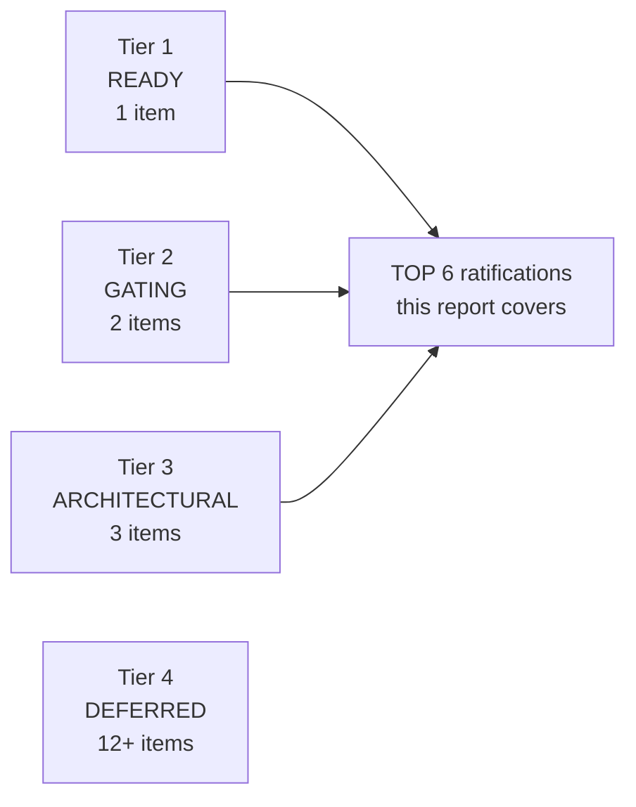
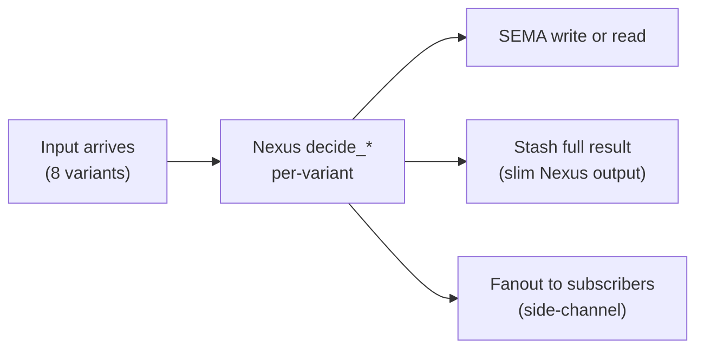
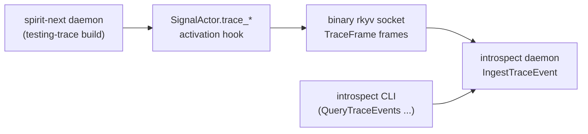
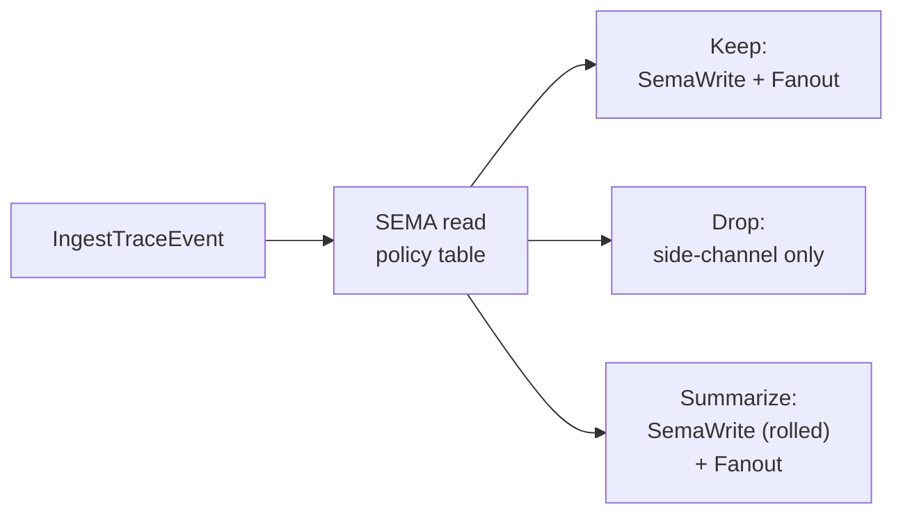
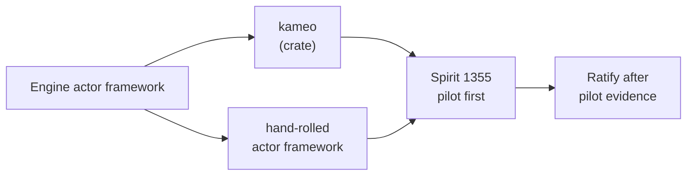
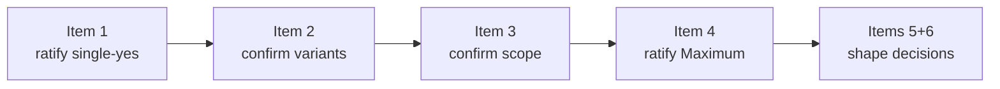

# 470 — Psyche backlog: top 6 with extensive context

## TL;DR

The active design surface has ~18 pending psyche ratification items across 7 reports + recent Spirit captures. This report tiers and reduces to **6 top-priority items** that, if ratified in sequence, unblock the entire active operator integration path. Items 1-3 are immediate-action (small commits, ready to ship); items 4-6 are architectural decisions that shape the next quarter of pilot work. Deferred items (7+) carry forward without blocking; their substance is captured in source reports.

## Backlog landscape — the 18-item set, reduced to top 6



Five nodes; honors Spirit 1282.

The integration path runs Tier 1 → Tier 2 → Tier 3. Tier 4 items are real but inform future slices; ratifying them now without the active slices producing data first risks landing principles that don't survive the next prototype's evidence.

## The top 6 at a glance

| # | Tier | Topic | Spirit anchor | Source report | Ask shape |
|---|---|---|---|---|---|
| 1 | READY | Name-only trace integration | 1394 Correction High | 467 | Single yes (integrate the branch) |
| 2 | GATING | spirit-next pilot expansion (Subscribe + Update + Summarize) | 1395 Decision High | 468 | Confirm next-slice variant set |
| 3 | GATING | Minimal introspect daemon (first cross-component Layer 2 witness) | 1398 Decision High | 469 | Confirm minimal-scope + push model |
| 4 | ARCHITECTURAL | Nexus typed side-channel `NexusOutput` (escalated to Maximum) | 468 candidate 2 + 469 escalation | 468 + 469 | Ratify capture as Maximum |
| 5 | ARCHITECTURAL | Help action shape | 1396 + 1397 Decision High | (designer 470 surfaces) | Pick 4 shape sub-decisions |
| 6 | ARCHITECTURAL | Engine actor promotion (close hidden-non-actor-owner anti-pattern) | 1365 if-possible + 466.3 candidate 4 | 466.3 | Ratify direction + pilot scope |

## Item 1 — Name-only trace integration

**Tier**: READY. Smallest decision; biggest near-term payoff.

**Captured intent**: Spirit 1394 (Correction High, psyche 2026-06-02) — *"Trace instrumentation should record only the name of the object being activated; the macro-generated interface already has that object name, so trace should not carry rich payload snapshots for each boundary."*

**Status**: Prototype landed clean. Designer 467 pushed `251507f8`; spirit-next worktree branch `designer-name-only-trace-2026-06-02` at `c83e1244`. Net diff **357-line reduction** (105 insertions / 462 deletions across 9 files). All 36 default tests + 3 testing-trace Layer 2 witnesses pass. `cargo clippy --features testing-trace --all-targets -- -D warnings` clean. `cargo fmt --check` clean.

**Substantive shape — harness-converged form**:

Before (payload-bearing, 7 hook methods + payload-bearing TraceEvent enum):
```rust
fn trace_signal_admitted(&self, input: &signal::Signal<signal::Input>) {}
fn trace_signal_triaged(
    &self,
    input: &signal::Signal<signal::Input>,
    output: &nexus::Nexus<nexus::Input>,
) {}
fn trace_signal_replied(&self, output: &signal::Signal<signal::Output>) {}

pub enum TraceEvent {
    SignalAdmitted { origin_route: OriginRoute, input: Input },
    SignalTriaged   { origin_route: OriginRoute, input: Input, output: NexusInput },
    SignalReplied   { origin_route: OriginRoute, output: Output },
    NexusEntered    { origin_route: OriginRoute, input: NexusInput },
    NexusDecided    { origin_route: OriginRoute, output: NexusOutput },
    SemaWriteApplied { origin_route: OriginRoute, input: SemaWriteInput, output: SemaWriteOutput },
    SemaReadObserved { origin_route: OriginRoute, input: SemaReadInput, output: SemaReadOutput },
}
```

After (name-only, ONE override per plane):
```rust
pub trait SignalEngine {
    fn trace_signal_activation(&self, _object_name: &'static str) {}

    fn trace_signal_admitted(&self) { self.trace_signal_activation("signal_admitted"); }
    fn trace_signal_triaged(&self)  { self.trace_signal_activation("signal_triaged");  }
    fn trace_signal_replied(&self)  { self.trace_signal_activation("signal_replied");  }
    // ... emitted as default-implementing per-phase wrappers
}

pub trait NexusEngine {
    fn trace_nexus_activation(&self, _object_name: &'static str) {}
    fn trace_nexus_entered(&self) { self.trace_nexus_activation("nexus_entered"); }
    fn trace_nexus_decided(&self) { self.trace_nexus_activation("nexus_decided"); }
}

pub trait SemaEngine {
    fn trace_sema_activation(&self, _object_name: &'static str) {}
    fn trace_sema_write_applied(&self) { self.trace_sema_activation("sema_write_applied"); }
    fn trace_sema_read_observed(&self) { self.trace_sema_activation("sema_read_observed"); }
}
```

**Implementor override surface**: 3 methods total (one per plane), not 8. Concrete spirit-next `TraceLog` impl looks like:
```rust
impl SignalEngine for SignalActor {
    fn trace_signal_activation(&self, object_name: &'static str) {
        self.trace_log.record(TraceObjectName(object_name.to_string()));
    }
    // triage_inner + reply_inner stay as the actor's inner-method overrides
}
```

**The TraceObjectName newtype** (one of the three open questions; harness lean is newtype):
```rust
pub struct TraceObjectName(pub String);
```

**Layer 2 witness test** (asserts on activation names, not payload shadows):
```rust
let trace = recorded_events(&engine);
assert_eq!(
    trace,
    vec![
        TraceObjectName("signal_admitted".into()),
        TraceObjectName("signal_triaged".into()),
        TraceObjectName("nexus_entered".into()),
        TraceObjectName("sema_write_applied".into()),
        TraceObjectName("nexus_decided".into()),
        TraceObjectName("signal_replied".into()),
    ],
);
// Engine-return-value assertions check the semantic outcome separately:
assert_eq!(output.root(), &Output::RecordAccepted(...));
```

**Three open shape questions** in designer 467 §"Open questions":
- (a) `TraceObjectName(String)` newtype OR closed enum? Harness-converged uses newtype.
- (b) Retire the per-phase generated default methods entirely, leaving only `trace_<plane>_activation` as the override point?
- (c) Thread `OriginRoute` pre-emptively for concurrent-trace correlation? Recommendation: no — engines serialize via `Mutex<Nexus>` currently; add when concurrent witnesses surface.

**What this unblocks**: clean baseline for items 2-6. Operator integrates `origin/designer-name-only-trace-2026-06-02` onto spirit-next main as a one-shot rebase.

**Ask**: single-yes — ratify integration. Open questions (a)/(b)/(c) can default to harness-converged (newtype + collapse-to-activation + no-route) unless you say otherwise.

## Item 2 — spirit-next pilot expansion (Subscribe + Update + Summarize)

**Tier**: GATING. Next operator slice depends on this answer.

**Captured intent**: Spirit 1395 (Decision High, psyche 2026-06-02) — *"The spirit-next pilot should use more developed schema-defined interfaces rather than toy one-variant planes; richer operations make the implementation more realistic and make the Signal/Nexus/SEMA design surface easier to see."*

**Status**: spirit-next `schema/lib.schema` ALREADY has `Lookup` + `Count` added mid-flight (operator working in parallel). Remaining additions per designer 468: `Update` + `Subscribe` + `Summarize` plus giving Nexus its first per-variant decisions per operator 281 §5.

**Current schema (from operator 281 §"Current Pipeline" + recent operator additions)**:
```nota
Input [(Record Entry) (Observe Query) (Lookup RecordIdentifier) (Count Query) (Remove RecordIdentifier)]
Output [(RecordAccepted SemaReceipt) (RecordsObserved ObservedRecords) (RecordLookedUp ObservedRecord)
        (RecordCounted RecordCount) (RecordRemoved RemoveReceipt) (Error ErrorReport) (Rejected SignalRejection)]
SemaReadInput [(Observe Query) (Lookup RecordIdentifier) (Count Query)]
SemaWriteInput [(Record Entry) (Remove RecordIdentifier)]
```

**Proposed expansion (designer 468 + this report)**:
```nota
Input [(Record Entry) (Observe Query) (Lookup RecordIdentifier) (Count Query)
       (Summarize Query) (Update RecordUpdate) (Remove RecordIdentifier) (Subscribe Subscription)]
Output [(RecordAccepted SemaReceipt) (RecordsObserved ObservedRecords) (RecordLookedUp ObservedRecord)
        (RecordCounted RecordCount) (RecordSummarized RecordSummary) (RecordUpdated SemaReceipt)
        (RecordRemoved RemoveReceipt) (SubscriptionOpened SubscriptionHandle)
        (Error ErrorReport) (Rejected SignalRejection)]
SemaReadInput [(Observe Query) (Lookup RecordIdentifier) (Count Query) (Summarize Query)]
SemaWriteInput [(Record Entry) (Update RecordUpdate) (Remove RecordIdentifier)
                (RegisterSubscription Subscription)]
```

**Resulting Nexus decision matrix** (the architecture finally has work):



Five nodes.

Per-variant decision targets (operator 281 §5 shape):
```rust
pub trait NexusEngine {
    fn decide_record(&mut self, entry: Entry, route: OriginRoute) -> nexus::Nexus<Output>;
    fn decide_observe(&mut self, query: Query, route: OriginRoute) -> nexus::Nexus<Output>;
    fn decide_lookup(&mut self, identifier: RecordIdentifier, route: OriginRoute) -> nexus::Nexus<Output>;
    fn decide_count(&mut self, query: Query, route: OriginRoute) -> nexus::Nexus<Output>;
    fn decide_summarize(&mut self, query: Query, route: OriginRoute) -> nexus::Nexus<Output>;
    fn decide_update(&mut self, update: RecordUpdate, route: OriginRoute) -> nexus::Nexus<Output>;
    fn decide_remove(&mut self, identifier: RecordIdentifier, route: OriginRoute) -> nexus::Nexus<Output>;
    fn decide_subscribe(&mut self, subscription: Subscription, route: OriginRoute) -> nexus::Nexus<Output>;

    // Default-impl generated by macro, matches on Input root, dispatches to decide_*.
    fn decide(&mut self, input: nexus::Nexus<nexus::Input>) -> nexus::Nexus<nexus::Output> { /* match */ }
}
```

**The slim-output use case** (closes 466.3 candidate 5 dependency): `decide_observe` for large result sets returns `RecordsObserved(SlimAck { result_handle, count, marker })`; client follows up with `Lookup(handle)` or repeated `Lookup(identifier)`. The `Lookup` variant being in the schema is what makes the slim-output pattern land.

**What this unblocks**: spirit pilot becomes a real architecture demonstrator (Nexus has 8 real decisions instead of 0 algorithmic projections); persona + orchestrate designs (468 §2 + §3) stay as design-reports-with-schema-sketches until spirit pilot delivers concrete interface-honesty witnesses per Spirit 1355 depth-first.

**Three open psyche questions from 468 §6**:
- (a) Include `Subscribe` in spirit pilot or defer? `Subscribe` carries multi-message semantics; if included it forces a long-lived stream substrate in spirit-next now.
- (b) `Update` semantics — partial-update by field, or full-record `Replace`? Operator 281 §"Moving Logic With The Interface" leaned `Update` as the workspace term.
- (c) `Summarize` payload — does the `RecordSummary` output type carry counts + magnitudes-weights + topic histograms inline, or just identifiers into a follow-up SEMA-stored summary record?

**Ask**: confirm the 8-variant `Input` shape (or trim to 6/7 if Subscribe/Summarize defer); pick (b) Update-vs-Replace shape; pick (c) inline-vs-handle on Summarize.

## Item 3 — Minimal introspect daemon (first cross-component Layer 2 witness)

**Tier**: GATING. Builds on items 1 + 2.

**Captured intent**: Spirit 1398 (Decision High, psyche 2026-06-02) — *"The new introspection component should be named introspect, dropping the persona prefix from persona-introspect, and should use schema-next based triad engine interfaces. It should be a configurable trace destination for all components, decide what and how to log, and provide a queriable source of tracing-derived intelligence."*

**Status**: Design complete (designer 469, 606 lines, commit `40a03b58`). Minimal-scope slice specified.

**Recommended minimal-slice scope (designer 469 §7)**:
- Stand up minimal introspect daemon on schema-next (new repo `introspect`; greenfield from persona-introspect placeholder).
- Implement ONLY `IngestTraceEvent` + `QueryTraceEvents`. No policy, no `Subscribe`, no owner-signal yet — those land in Slices 2 + 3.
- spirit-next adds `IntrospectSocket` to its daemon configuration record; pushes binary rkyv `TraceEvent` frames per Spirit 1394 name-only shape under `testing-trace` feature.
- CLI invokes `introspect "(QueryTraceEvents (Filter ...))"` and round-trips the 12-event activation sequence from a record-then-observe operation pair.

**Schema-source sketch (introspect minimal slice)**:
```nota
Input [(IngestTraceEvent TraceFrame) (QueryTraceEvents QueryFilter)]
Output [(TraceEventIngested IngestionReceipt) (TraceEventsQueried QueryResult) (Error ErrorReport)]
NexusInput [(Signal Input) (SemaWrite SemaWriteOutput) (SemaRead SemaReadOutput)]
NexusOutput [(SemaWrite SemaWriteInput) (SemaRead SemaReadInput) (Signal Output)]
SemaWriteInput [(RecordTraceEvent TraceRecord)]
SemaWriteOutput [(TraceRecorded SemaReceipt) (Missed ErrorReport)]
SemaReadInput [(Observe QueryFilter)]
SemaReadOutput [(Observed TraceRecordSet) (Missed ErrorReport)]
TraceFrame { component_identifier * route * object_name TraceObjectName timestamp Timestamp }
TraceRecord { ... same fields, schema-derived }
```

**Cross-component flow (push model per Spirit 1373 — no NOTA between components)**:



Five nodes.

**Layer 2 cross-component witness test** (the first in the workspace):
```text
1. start introspect daemon on temp socket
2. start spirit-next daemon configured with introspect_socket = temp socket
3. CLI: spirit-next "(Record (...))" → daemon emits 6-event sequence to introspect
4. CLI: spirit-next "(Observe ...)" → daemon emits 6-event sequence to introspect
5. CLI: introspect "(QueryTraceEvents (All))" → returns the 12-event sequence
6. Assert: 12 events present, correct order, correct route identifiers, correct component identifier
```

**Why this is architecturally important** (designer 469 §1): Layer 2 runtime witnesses have so far been WITHIN one daemon (test asserts trace log inside the engine). Cross-component witnesses prove the wire protocol works end-to-end across daemon boundaries with the CLI as the renderer. This is the first one.

**Three open psyche questions from 469 §6**:
- (a) Push model confirmed (vs pull)? Designer 469 + this report lean push per Spirit 1373.
- (b) Greenfield migration from persona-introspect (vs continuity)? Designer 469 leans greenfield — Tap/Untap placeholder was never load-bearing.
- (c) Minimal scope confirmation — JUST `IngestTraceEvent` + `QueryTraceEvents` in slice 1, defer Subscribe + policy + owner-signal to slices 2 + 3?

**What this unblocks**: workspace-wide Layer 2 witness pattern; trace destination architecture; concrete data for the upcoming policy + Subscribe slices.

**Ask**: confirm minimal scope + push model + greenfield migration (three single-yeses or one combined ratification).

## Item 4 — Nexus typed side-channel `NexusOutput` (ESCALATED to Maximum)

**Tier**: ARCHITECTURAL. Closes designer 466.3's standout "Nexus has no real decision" finding.

**Captured intent (to capture if ratified)**: Decision **Maximum** — *"NexusOutput carries typed side-channel variants for Nexus's own emitted operations (non-SEMA, non-Signal-direct-return). These variants are how Nexus expresses decisions that produce side effects in the runtime without smuggling them into Nexus implementation code. Demonstrated across 4 components: spirit (Stash for slim-output handle), persona (Cascade for permission propagation), orchestrate (Preempt + Enqueue), introspect (Fanout + Summarize + Drop). Without the slot, side-effect logic leaks out of schema."*

**Source**: Designer 468 candidate 2 (originally High); designer 469 §"New ratification candidates" escalates to Maximum after the introspect design surfaced 3 new side-channel variants in ONE Nexus decision.

**Current vs proposed `NexusOutput`** (using introspect's `IngestTraceEvent` as the worked example):
```rust
// CURRENT — no slot for Nexus's own emitted operations:
pub enum NexusOutput {
    SemaWrite(SemaWriteInput),  // delegate write to SEMA
    SemaRead(SemaReadInput),    // delegate read to SEMA
    Signal(Output),             // return directly to Signal without SEMA touch
}

// PROPOSED — typed side-channel variants for Nexus's own emitted operations:
pub enum NexusOutput {
    SemaWrite(SemaWriteInput),
    SemaRead(SemaReadInput),
    Signal(Output),
    // Side-channel variants (component-defined per Nexus's domain):
    Fanout(FanoutSpec),         // introspect: emit to live subscribers
    Summarize(SummarizeSpec),   // introspect: roll into aggregate, no per-event durable write
    Drop(DropReason),           // introspect: filtered by policy, pure accounting
    // ... per-component additions like Stash, Preempt, Enqueue, Cascade
}
```

**The introspect IngestTraceEvent decision exercises the side-channel pattern 3× in ONE decision**:



Five nodes.

**The structural signature of Nexus earning its keep** (designer 469 confirming designer 468 candidate 4):
- Introspect: NexusOutput 6 variants > SemaWriteInput 5 variants — Nexus has more decisions to express than SEMA has operations.
- Compare spirit's current: NexusOutput 3 variants = SemaWriteInput 2 variants + Signal — exactly the "Nexus has no real decision" shape.

**Implementation sketch (post-ratification)**:
```rust
// In introspect's NexusEngine impl:
fn decide_ingest_trace_event(&mut self, frame: TraceFrame, route: OriginRoute)
    -> nexus::Nexus<NexusOutput>
{
    let policy = SemaEngine::observe(&self.store, SemaReadInput::PolicyForComponent(frame.component_identifier));
    match policy {
        Policy::Keep => NexusOutput::SemaWrite(SemaWriteInput::RecordTraceEvent(TraceRecord::from(frame)))
            .with_origin_route(route),
        Policy::Drop(reason) => NexusOutput::Drop(reason).with_origin_route(route),
        Policy::Summarize(spec) => NexusOutput::Summarize(spec).with_origin_route(route),
        Policy::Fanout(subscribers) => NexusOutput::Fanout(FanoutSpec { subscribers, frame }).with_origin_route(route),
    }
}
```

**What this unblocks**: 466.3 candidate 5 (Output split + QueryByHandle uses `Stash` as the Nexus side-channel that stashes full results in the mail ledger); 468 candidate 4 (the Nexus-variant-count > SEMA-write-variant-count heuristic for `skills/component-triad.md`); ALL future components that need real Nexus decisions.

**Ask**: ratify Spirit Decision Maximum + capture; implementation lands as part of the introspect first-slice (item 3) since introspect's decisions REQUIRE side-channel variants.

## Item 5 — Help action shape

**Tier**: ARCHITECTURAL. Captured intent exists; the SHAPE is what awaits ratification.

**Captured intent**: Spirit 1396 + 1397 (both Decision High; duplicate; one capture covers both — *"Every root enum emitted by schema-rust-next gets a Help action variant generated automatically by the macro; Help responses are themselves generated enums root-interface shape; the pattern is recursive."*

**Status**: Direction captured; four shape sub-decisions need answers before the schema-rust-next emitter slice can start.

**The four shape questions**:

**(a) HelpRequest variant set**. Starting set:
```rust
pub enum HelpRequest {
    Overview,                          // describe the whole root enum
    DescribeVariant(VariantName),      // describe one variant's signature + payload type
    DescribeType(TypeName),            // describe one referenced type
}
```
Is this complete? Designer recommendation: yes for slice 1; future additions (`ListAllTypes`, `Examples`) can extend.

**(b) HelpResponse carry-shape — three options**:
```rust
// Option A — plain strings (rejected: breaks the typed principle):
pub enum HelpResponse {
    OverviewText(String),
    VariantText(String),
}

// Option B — identifier-shaped slim per Spirit 1389
// (client follows up with another query to fetch detail):
pub enum HelpResponse {
    Overview(Vec<VariantName>),
    VariantDescription { name: VariantName, payload_type: TypeName },
    TypeDescription { name: TypeName, kind: TypeKind, fields: Vec<FieldName> },
}

// Option C — Asschema slices inline (no follow-up; most natural;
// leverages designer 447 upgrade-as-SEMA's existing Asschema vocabulary):
pub enum HelpResponse {
    Overview(AsschemaInterface),       // the schema's typed self-representation
    VariantDescription(AsschemaVariant),
    TypeDescription(AsschemaType),
}
```

Designer recommendation: **Option C — Asschema slices**. The schema-daemon (designer 447 upgrade-as-SEMA) ALREADY holds Asschema as queryable SEMA data. Help becomes a typed SEMA Observe against the schema-daemon. No new substrate; schema-eats-its-own-dogfood.

**(c) Which roots get auto-Help?** Two options:
- Every emitted root enum (Signal Input/Output, NexusInput/Output, SemaWrite/ReadInput/Output) — uniform self-introspection at every layer.
- Signal-plane only (clients only talk to Signal externally; internal Nexus/SEMA don't need Help on the wire).

Designer recommendation: **every root**. The user's statement said "each root enum"; uniform is simpler than per-plane policy.

**(d) Recursion termination — HelpResponse::Help on HelpResponse itself**? Two options:
- Full recursion — `HelpResponse::Help` works exactly like the others, bottoms at schema leaf types (primitives).
- Selective recursion — macro adds Help only to user-declared roots; HelpResponse is a fixed-shape internal type without further Help.

Designer recommendation: **selective**. Practical value of `HelpResponse::Help::DescribeVariant` is essentially zero (you already have the schema); selective recursion keeps the emitter simpler with a principled termination comment.

**Worked example with Option C + every-root + selective-recursion**:
```nota
; client-side CLI invocation:
spirit "(Help Overview)"

; daemon returns AsschemaInterface — typed self-representation:
(AsschemaInterface
  (name [spirit])
  (signal-input [Record Observe Lookup Count Summarize Update Remove Subscribe Help])
  (signal-output [RecordAccepted RecordsObserved RecordLookedUp ... Help])
  (sema-write-input [Record Update Remove RegisterSubscription Help])
  (sema-read-input [Observe Lookup Count Summarize Help])
  (...))
```

**What this unblocks**: schema-rust-next emitter slice for Help (small change once shape is ratified); uniform self-description across every component built on the engine-trait architecture (spirit, persona, orchestrate, introspect, future).

**Ask**: pick (a) [HelpRequest set OK as proposed], (b) Option C Asschema slices, (c) every root, (d) selective recursion. Four sub-decisions; single combined ratification is cleanest.

## Item 6 — Engine actor promotion (close hidden-non-actor-owner anti-pattern)

**Tier**: ARCHITECTURAL. Closes the standout finding from designer 466.3 §2.

**Captured intent (to capture if ratified)**: Decision High — *"The runtime root `Engine` in spirit-next is currently a Mutex-guarded struct holding the sub-actors as fields — this violates the hidden non-actor owner anti-pattern from skills/actor-systems.md. Promote it to a proper actor composition: SignalActor + NexusActor + SemaActor as schema-emitted actor traits (per Spirit 1365 if-possible hedge), each with mailbox + lifecycle + trace hooks; Engine becomes the supervisor/composer not the borrow-guarded god-object."*

**Source**: Designer 466.3 candidate 4; relates to Spirit 1365 Correction Maximum's "actor traits if possible" hedge.

**Concrete violation** (designer 466.2 §"Actor model fit" + the code):
```rust
// CURRENT — spirit-next/src/engine.rs:26
// The "hidden non-actor owner" anti-pattern from skills/actor-systems.md §"Runtime roots are actors":
pub struct Engine {
    signal_actor: SignalActor,
    nexus: Mutex<Nexus>,
}

impl Engine {
    pub fn handle(&self, input: Input) -> signal::Signal<Output> {
        let accepted = match self.signal_actor.admit(input) { ... };
        let mut nexus = self.nexus.lock().expect("nexus lock");
        accepted.process_with(&self.signal_actor, &mut nexus)
    }
}
```

The shape forbidden: a runtime root that holds sub-actors as fields + exposes verb facades. Single-flight is enforced by `&mut self` exclusive borrow on `NexusEngine::execute`, which is a correct Rust guard but NOT actor mailbox semantics. No mailbox; no message-passing; no supervision; no per-actor lifecycle.

**Proposed shape (schema-emitted actor traits + concrete actor structs)**:
```rust
// Generated by schema-rust-next per Spirit 1365 if-possible hedge:
pub trait SignalActor: SignalEngine {
    type Mailbox: Mailbox<Item = signal::Signal<Input>>;
    fn identity(&self) -> ActorIdentity;
    fn mailbox(&self) -> &Self::Mailbox;
    // Lifecycle hooks the supervisor consults:
    fn handle(&mut self, message: signal::Signal<Input>) -> signal::Signal<Output>;
}

pub trait NexusActor: NexusEngine {
    type Mailbox: Mailbox<Item = nexus::Nexus<NexusInput>>;
    fn identity(&self) -> ActorIdentity;
    fn mailbox(&self) -> &Self::Mailbox;
    fn handle(&mut self, message: nexus::Nexus<NexusInput>) -> nexus::Nexus<NexusOutput>;
}

pub trait SemaActor: SemaEngine {
    type Mailbox: Mailbox<Item = sema::Sema<WriteInput>>;
    fn identity(&self) -> ActorIdentity;
    fn mailbox(&self) -> &Self::Mailbox;
    fn handle_apply(&mut self, message: sema::Sema<WriteInput>) -> sema::Sema<WriteOutput>;
    fn handle_observe(&self, message: sema::Sema<ReadInput>) -> sema::Sema<ReadOutput>;
}

// Engine becomes a composition / supervisor, NOT a Mutex-guarded god-object:
pub struct Engine<Signal, Nexus, Sema>
where
    Signal: SignalActor,
    Nexus: NexusActor,
    Sema: SemaActor,
{
    signal: Signal,
    nexus: Nexus,
    sema: Sema,
}

impl<Signal, Nexus, Sema> Engine<Signal, Nexus, Sema> {
    pub fn handle(&mut self, input: Input) -> signal::Signal<Output> {
        // Routes through actors via their mailboxes; not via borrowed locks.
    }
}
```

**Framework choice — open design question**:



Five nodes.

`skills/actor-systems.md` should be the deciding skill — read it before authoring the pilot.

**Order considerations**: this lands AFTER items 1-3 (clean baseline + expanded interfaces + cross-component witness). Promoting Engine before the developed interfaces (item 2) lands risks designing the actor traits around toy decisions; richer interfaces produce more realistic actor-trait pilot evidence.

**What this unblocks**: closes `skills/actor-systems.md` §"Runtime roots are actors" violation; lands Spirit 1365 if-possible hedge with a concrete shape; makes the actor-trait pilot a workspace template for spirit + persona + orchestrate + introspect (4 components in one shape).

**Ask**: ratify direction (kameo OR hand-rolled, OR pilot first per Spirit 1355 then decide). Designer lean: pilot first, defer framework choice 1-2 weeks until the pilot evidence is in.

## Items 7+ — Deferred backlog

Carried forward but not blocking the active integration path. Each remains live; substance captured in source reports.

| # | Topic | Source | Status |
|---|---|---|---|
| 7 | Designer 458 — spirit-triad naming gate (Option A `owner-signal-spirit` recommended) | 458 | Carry until Phase 0 fold approaches |
| 8 | Designer 463 gap A — cargo+NOTA stratification (Principle High) | 463 + operator 279 | Carry until typed-NOTA-build-config slice approaches |
| 9 | Designer 463 gap B — testing-instrumentation triad placement (Decision High) | 463 + operator 279 | Carry until trait-emission scope decisions land |
| 10 | Designer 466.3 candidate 2 — Validate trait emission (Decision High) | 466.3 §6.2 | Lands when schema-next emitter slice scopes |
| 11 | Designer 466.3 candidate 3 — Signal-admission scaffolding emission (Decision High) | 466.3 §6.3 | Same scope as #10 |
| 12 | Designer 466.3 candidate 5 — Output split for slim Nexus + QueryByHandle | 466.3 §6.5 | Lands implicitly once items 2 + 4 ratify |
| 13 | Spirit 1372 — last-version Nix package (Maximum) | psyche capture | Lands with deploy-flow slice |
| 14 | Spirit 1375 — Nix component library (High, if-possible) | psyche capture | Defer until shape proves out |
| 15 | Designer 468 candidate 1 — Subscribe as universal Input variant (Principle High) | 468 §6 | Confirms once item 2 ratifies Subscribe inclusion |
| 16 | Designer 468 candidate 3 — Read interface split (Principle High) | 468 §6 | Confirms once spirit's expanded Read variants land in code |
| 17 | Designer 468 candidate 5 — ConflictResolutionEngine sub-trait (Decision High, tentative) | 468 §6 | Lands with orchestrate slice (future) |
| 18 | Designer 469 candidate 3 — Configure as universal Input variant (Principle High) | 469 §6 | Confirms once item 3 introspect's ConfigureTracePolicy lands |
| 19 | Designer 469 candidate 4 — Trace policy as SEMA-stored typed-record (Principle High) | 469 §6 | Lands with introspect Slice 2 (policy slice) |

## Recommended decision order



Five nodes.

**Suggested cadence**:
1. **Item 1** in one beat — single yes; operator integrates the branch. Smallest, fastest.
2. **Item 2** next — confirm the 8-variant Input shape (or trim). Operator's next slice scope.
3. **Item 3** after item 2 schema lands — minimal introspect plus cross-component witness scope confirmation.
4. **Item 4** during item 3 design — Nexus side-channel pattern needed for introspect's IngestTraceEvent; ratify Maximum as the substrate.
5. **Items 5 + 6** are the structural moves — Help action + Engine actor promotion. Can address in parallel with items 2-4 implementation, or defer to a focused decision session.

## Cross-references

- `reports/designer/458-spirit-triad-naming-gate-decision-2026-06-01.md` — deferred item 7.
- `reports/designer/463-operator-trace-implementation-audit-and-intent-gaps-2026-06-01.md` — deferred items 8-9.
- `reports/designer/466-triad-engine-honesty-situation-2026-06-01/3-overview.md` — items 4 + 6; deferred items 10-12.
- `reports/designer/467-name-only-trace-research-and-prototype-2026-06-02.md` — item 1.
- `reports/designer/468-developed-interfaces-spirit-persona-orchestrate-2026-06-02.md` — items 2 + 4; deferred items 15-17.
- `reports/designer/469-introspect-component-design-2026-06-02.md` — items 3 + 4; deferred items 18-19.
- `reports/operator/281-generated-interface-logic-with-macros-2026-06-02.md` — current engine-trait shape underpinning items 1-6.
- Spirit records 1340-1398 — captured intent surface this report consolidates.
- `skills/component-triad.md` §"Runtime triad engine traits", §"The single argument rule" — discipline.
- `skills/actor-systems.md` §"Runtime roots are actors" — anti-pattern item 6 closes.
- `skills/architectural-truth-tests.md` §"Proof-of-usage ladder" — Layer 2 witness ladder.

## For the orchestrator (chat paraphrase)

Top 6 backlog reduced from ~18 pending. Items 1-3 are immediate-action (ready-to-integrate name-only trace; gating-next-slice spirit expansion; gating-next-slice minimal introspect daemon). Items 4-6 are architectural (Nexus side-channel Maximum escalation; Help action shape with 4 sub-decisions; Engine actor promotion closing the hidden-non-actor-owner anti-pattern). Suggested decision order — items 1 → 2 → 3 → 4 → (5 + 6 in parallel). Deferred items 7-19 stay in source reports; lands as their slices approach. Total integration path: items 1-4 land the architecture; items 5-6 polish it for workspace-wide template use.
