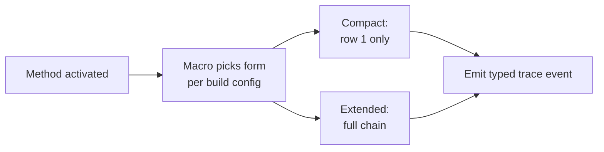

; designer
[trace-name interface-header macro-emission compact-vs-extended root-variant payload-variant struct-vs-enum 128-bit-header schema-driven-trace]
[Synthesis of the psyche directive 2026-06-02 + Spirit 1400-1401 captures on the trace-name and interface-header structure. The macro is the source of trace names because it generated the variants being activated; the trace-name string-newtype-vs-enum question dissolves into typed macro emission. Defines interface as enum-root + multi-variant (formalizing Spirit 1395). Defines two-row interface chain: row 1 root variant + row 2 payload (struct-leaf or enum-continue). Specifies COMPACT vs EXTENDED trace forms. Maps spirit-next pilot schema to demonstrate that current payloads are all structs (extended == compact for spirit today). Proposes typed-ObjectName-enum emission replacing designer 467 TraceObjectName(String). Surfaces the 128-bit header speculation as a separate design question. Maps architectural touch points across 6 captured-intent records + 4 designer reports.]
2026-06-02
designer

# 471 — Trace name structure + interface header design

## TL;DR

The macro that emits engine traits also knows the structural name of every variant being activated — so the trace-name string-vs-newtype-vs-enum debate from designer 467 §"Open questions" dissolves into a typed macro emission. **Trace names are not free-floating strings; they are the structural identifier of an enum variant the macro just emitted.**

An **interface** is formally: an enum at the root + more than one variant (Spirit 1401). The two-row interface chain is: row 1 = root variant; row 2 = payload (struct-leaf OR enum-continue). When row 2 is an enum, the trace can recurse — the **extended** form follows the chain; the **compact** form stops at the root variant. The macro has enum-vs-struct information at compile time per Spirit 1400.

The spirit-next pilot's current `Input` variants all carry **struct** payloads (`Entry`, `Query`, `RecordIdentifier`) — so for spirit today, compact == extended. The compact form (designer 467's `TraceObjectName(String)`) works and is the right starting shape. The extended form becomes relevant when components grow enum payloads (introspect's `IngestTraceEvent(TraceFrame)` where `TraceFrame.object_name: ObjectName` is itself an enum is one such case).

The 128-bit header speculation is a separate question — what does a longer identifier carry beyond the variant name chain? Component identifier + plane identifier + variant chain + version? Surfaced as design question §8.

## Section 1 — The macro-emission insight

Designer 467 left three open questions (§"Open questions"):
- (a) `TraceObjectName(String)` newtype OR closed enum?
- (b) Retire per-phase generated default methods entirely?
- (c) Thread `OriginRoute` pre-emptively?

The psyche's 2026-06-02 message dissolves (a). The reasoning: **the macro is what defines all trace names**. When the macro emits `trace_signal_admitted` as a default method, it knows the activation NAME because it just generated the method. The name doesn't need to be a runtime-supplied string parameter; it can be a typed structural identifier the macro emits alongside the method.

Spirit 1400 (Decision High) captures this: *"Trace names are macro-emitted from the schema-defined enum variant structure not free-floating strings. The macro knows what is being activated because it generated the variant."*

**Implication for designer 467**: the `TraceObjectName(String)` newtype landed in the prototype is a transitional shape. The harness-converged form used `&'static str` literals at the call sites — already typed-by-construction at compile time even though the wire surface is `String`. The next step is to make the wire surface itself typed — emit an `ObjectName` enum from the schema.

```rust
// CURRENT (designer 467 prototype):
pub trait SignalEngine {
    fn trace_signal_activation(&self, _object_name: &'static str) {}

    fn trace_signal_admitted(&self) {
        self.trace_signal_activation("signal_admitted");
    }
}

// PROPOSED (per Spirit 1400 — macro-emitted typed name):
pub enum SignalObjectName {
    SignalAdmitted,
    SignalRejected,
    SignalTriaged,
    SignalReplied,
}

pub trait SignalEngine {
    fn trace_signal_activation(&self, _name: SignalObjectName) {}

    fn trace_signal_admitted(&self) {
        self.trace_signal_activation(SignalObjectName::SignalAdmitted);
    }
}
```

The `String` parameter becomes a typed enum. The trace surface becomes closed-world: an introspect daemon (designer 469) ingesting trace events knows exactly which names are valid because the schema declares them.

## Section 2 — Interface header structure (Spirit 1401)

The psyche stated the interface shape directly: *"You have an enum at the root always. And you're always going to have more than one item. You have to have more than one item. If you can't think of more than one item, you don't have enough to create an interface."*

Spirit 1401 (Clarification High) formalizes this: *"An interface is an enum at the root with MORE THAN ONE variant. If a designer cannot name more than one operation the root represents, the design is incomplete and not an interface. Single-variant enums prove themselves newtypes in practice."*

This generalizes Spirit 1395 (developed interfaces). The previous framing said "toy one-variant planes" — the formal definition makes the threshold explicit.

**Implication for designer 468 spirit pilot expansion**: the current schema's `SemaReadInput [(Observe Query)]` (one variant) is NOT a real interface — it's an `Observe(Query)` newtype wearing enum clothing. The expansion to `SemaReadInput [(Observe Query) (Lookup RecordIdentifier) (Count Query) (Summarize Query)]` (four variants) makes it a real interface.

**Implication for ALL component designs going forward**: when sketching a schema source, ask "can I name two operations on this root?" If not, the design isn't done yet.

## Section 3 — Two-row interface chain

The psyche surfaced a key structural question: *"the second row can also be a struct or an enum, right? So then we have to define sort of two rows, which is what I guess we're doing here."*

The two-row pattern:
- **Row 1**: the root enum variant (e.g., `Input::Remove`).
- **Row 2**: the variant's payload — either a struct (leaf data, chain stops) or another enum (nested interface, chain continues).

Concrete from spirit-next current schema:
```text
Input::Record(Entry)            — Row 1: Record; Row 2: Entry (struct, leaf)
Input::Observe(Query)           — Row 1: Observe; Row 2: Query (struct, leaf)
Input::Remove(RecordIdentifier) — Row 1: Remove; Row 2: RecordIdentifier (struct, leaf)
```

All three current Input variants have struct payloads — the chain stops at row 2. The trace for `Input::Remove(record_identifier)` is therefore:
- Compact: `input_remove` (row 1 only)
- Extended: `input_remove` (row 2 is struct; no enum to descend into)

For spirit-next as it exists today, **compact == extended**. The designer 467 prototype's compact form is correct for the current pilot.

**When does row 2 become an enum?** When the payload type is itself a closed-sum operation choice. Example from designer 469 introspect design:
```text
Input::IngestTraceEvent(TraceFrame)
TraceFrame { component_identifier *  route *  object_name ObjectName  timestamp Timestamp }
ObjectName [(Signal SignalObjectName) (Nexus NexusObjectName) (Sema SemaObjectName)]
SignalObjectName [SignalAdmitted SignalRejected SignalTriaged SignalReplied]
```

Here the row-2 payload `TraceFrame` is a struct (chain stops at row 2). But one of its fields — `object_name: ObjectName` — IS an enum, and `ObjectName` itself wraps another enum (`SignalObjectName`, `NexusObjectName`, `SemaObjectName`). So the chain is:
- Row 1: `Input::IngestTraceEvent`
- Row 2: `TraceFrame` (struct — but contains nested enums in field positions)
- Row 3 (field-of-struct chain): `TraceFrame.object_name = ObjectName::Signal`
- Row 4: `ObjectName::Signal(SignalObjectName::SignalAdmitted)`

The two-row pattern is the SIMPLEST case. Field-of-struct chains continue the depth. The macro has the information at every step.

## Section 4 — Compact vs extended trace



Five nodes.

**Compact form** — for the testing-build Layer 2 witness:
```rust
TraceEvent::SignalAdmitted   // just the activation name
```

**Extended form** — for richer diagnostic traces (production debug, future):
```rust
TraceEvent::Input {
    plane: Plane::Signal,
    root_variant: InputRootName::Remove,
    payload_chain: PayloadChain::StructLeaf(StructName::RecordIdentifier),
}
```

OR if the payload is an enum:
```rust
TraceEvent::Input {
    plane: Plane::Signal,
    root_variant: InputRootName::IngestTraceEvent,
    payload_chain: PayloadChain::Continue(
        StructName::TraceFrame,
        FieldChain::Field {
            field: FieldName::ObjectName,
            value_variant: VariantChain::Variant(ObjectNameVariant::Signal,
                FieldChain::Leaf(SignalObjectNameVariant::SignalAdmitted))
        }
    ),
}
```

The extended form is heavier but carries the full structural identification. Build configuration chooses which form to compile in (per Spirit 1346 — feature-gated at the emitter layer).

**Compact-vs-extended chosen WHERE?** Three options:
- (a) At component build time — global cargo feature `trace-extended` adds the extended form.
- (b) At call site — each hook can request compact or extended via an annotation in the schema source.
- (c) At runtime — the trace destination (per Spirit 1398 introspect) configures whether components send compact or extended.

Designer recommendation: **(a) — global feature**. Simpler emitter; consumers (introspect, CLI) decode the form they receive. Extended is a heavier debug build; compact is the default testing-build form.

## Section 5 — Spirit-next pilot schema audit

To ground the discussion, here's the full enum-vs-struct map of the current spirit-next schema source (per operator 281 §"Current Pipeline"):

| Type | Kind | Variants (if enum) / Fields (if struct) |
|---|---|---|
| `Input` | enum | Record, Observe, Remove |
| `Output` | enum | RecordAccepted, RecordsObserved, RecordRemoved, Error, Rejected |
| `NexusInput` | enum | Signal, SemaWrite, SemaRead |
| `NexusOutput` | enum | Signal, SemaWrite, SemaRead |
| `SemaWriteInput` | enum | Record, Remove |
| `SemaReadInput` | enum | Observe |
| `SemaWriteOutput` | enum | Recorded, Removed, Missed |
| `SemaReadOutput` | enum | Observed, Missed |
| `Entry` | struct | Topics, Kind, Description, Magnitude |
| `Query` | struct | TopicMatch, Kind |
| `RecordIdentifier` | struct | (u64 newtype) |
| `SemaReceipt` | struct | record_identifier, database_marker |
| `ObservedRecords` | struct | record_set, database_marker |
| `RemoveReceipt` | struct | record_identifier, database_marker |
| `ErrorReport` | struct | error_message, database_marker |
| `SignalRejection` | struct | validation_error, database_marker |
| `Topics` | struct | (Vec<Topic> newtype) |
| `Topic` | struct | (String newtype) |
| `Kind` | enum | Decision, Principle, Correction, Clarification, Constraint |
| `Magnitude` | enum | Zero, Minimum, VeryLow, Low, Medium, High, VeryHigh, Maximum |
| `TopicMatch` | enum | Partial, Full |
| `ValidationError` | enum | EmptyDescription, EmptyTopic, EmptyQueryTopic |

**Observations:**

- The 8 ROOT enums (Input, Output, NexusInput, NexusOutput, Sema*) all immediately wrap STRUCTS in their variant payloads. Extended trace on these stops at row 2.
- The DEEPER chain begins INSIDE the structs — fields like `Entry.kind: Kind` (enum), `Entry.magnitude: Magnitude` (enum), `Query.topic_match: TopicMatch` (enum) carry nested enums. Field-of-struct chains.
- `SemaReadInput [(Observe Query)]` — single variant — fails the Spirit 1401 interface definition (not enough variants to be an interface). Designer 468's expansion to 4 variants (add Lookup, Count, Summarize) fixes this.

**Implication for designer 467 + the immediate trace work**: spirit-next's current schema has no immediate need for extended trace because the chain stops at row 2 for every root-variant activation. Compact form is sufficient for the Layer 2 witness today. Extended trace becomes load-bearing as schemas grow enum-typed root-variant payloads (introspect's IngestTraceEvent will be the first).

## Section 6 — Proposed implementation shape

### Section 6.1 — Typed ObjectName emission

Replace designer 467's `TraceObjectName(String)` with macro-emitted typed enums per plane:

```rust
// Emitted by schema-rust-next from schema source:

pub enum SignalObjectName {
    SignalAdmitted,
    SignalRejected,
    SignalTriaged,
    SignalReplied,
}

pub enum NexusObjectName {
    NexusEntered,
    NexusDecided,
}

pub enum SemaObjectName {
    SemaWriteApplied,
    SemaReadObserved,
}

pub enum ObjectName {
    Signal(SignalObjectName),
    Nexus(NexusObjectName),
    Sema(SemaObjectName),
}
```

These are unit-variant enums; their wire representation is just the discriminant byte. They derive `rkyv::Archive + rkyv::Serialize + rkyv::Deserialize` so they cross the binary frame.

The trace hooks pass the typed enum instead of `&'static str`:
```rust
pub trait SignalEngine {
    fn trace_signal_activation(&self, _name: SignalObjectName) {}

    fn trace_signal_admitted(&self) {
        self.trace_signal_activation(SignalObjectName::SignalAdmitted);
    }
}
```

The introspect daemon (designer 469) ingests typed `ObjectName` values:
```rust
pub enum Input {
    IngestTraceEvent(TraceFrame),
    QueryTraceEvents(QueryFilter),
}

pub struct TraceFrame {
    pub component_identifier: ComponentIdentifier,
    pub route: OriginRoute,
    pub object_name: ObjectName,  // typed, not string
    pub timestamp: Timestamp,
}
```

No string parsing on the receive side; closed-world discrimination by enum matching.

### Section 6.2 — Compact vs extended switch

Cargo features at the schema-rust-next emission layer:
```toml
[features]
trace-compact = []        # default for testing-trace builds
trace-extended = []       # opt-in heavier diagnostic
```

Compact form (default): `TraceEvent = ObjectName` (8-byte enum).

Extended form (opt-in): `TraceEvent = ExtendedTraceEvent { plane, root_variant, payload_chain }` — carries the row-1 + row-2 + nested-chain information for diagnostic traces. Sized higher.

### Section 6.3 — Backward compatibility with designer 467

Designer 467's `TraceObjectName(String)` is the prototype shape; the typed-enum form is the next iteration. Migration path:
- Step 1 (already done): integrate designer 467 onto spirit-next main (top-6 item 1).
- Step 2: schema-rust-next adds `ObjectName` enum emission per plane.
- Step 3: spirit-next adopts the typed `ObjectName` enum at the trace hooks; `TraceObjectName(String)` retires.
- Step 4: introspect (top-6 item 3) ingests `ObjectName` directly — no string parsing.

Step 2-4 land together as a single operator slice after item 1 integrates.

## Section 7 — The 128-bit header speculation

The psyche surfaced: *"we could have a 128-bit maybe version where we can, it's really, we have to identify how we, I think we have to better specify the header part."*

The 128-bit header is a SEPARATE design question. What might it carry?

Candidate fields for the longer identifier:
- Component identifier (which component emitted the trace) — 32 bits if compact ID; UUID 128 bits if globally unique.
- Plane identifier (Signal/Nexus/SEMA/...) — 2-3 bits.
- Root variant discriminant — 8 bits if <256 variants per root.
- Payload chain (nested variant discriminants) — variable.
- Schema version (which schema version emitted this) — 16-32 bits if schema migration matters.
- Timestamp prefix — 32-64 bits if temporal sorting matters at the header layer.

A 128-bit header could pack: `[component:32][plane:8][root:8][chain:32][schema_version:16][reserved:32]` for a structured, fixed-width identifier. This is hash-like — fast to compare, queryable by prefix, sortable.

**Open question**: is the 128-bit header for THE TRACE NAME (replacing the typed enum) or for AN OUT-OF-BAND IDENTIFIER (additional to the typed name, used for fast indexing in introspect's SEMA store)?

Designer lean: the typed enum (Section 6.1) IS the trace name; the 128-bit header is an OPTIONAL out-of-band identifier introspect can compute deterministically from the trace event for indexing. Then introspect's `QueryTraceEvents(QueryFilter)` can filter by the 128-bit header range efficiently — and the typed enum stays as the human-meaningful name.

This is a design candidate to surface but not yet ratify.

## Section 8 — Architectural touch points

The trace-name-structure topic touches multiple captured intents and active designs:

| Captured intent | Connection |
|---|---|
| Spirit 1394 Correction High (trace records only the activation name; macro has it) | Direct — this report makes the macro-emitted name typed. |
| Spirit 1395 Decision High (developed interfaces) | Spirit 1401 formalizes the "multi-variant required" criterion. |
| Spirit 1396 + 1397 Decision High (Help action) | Help vocabulary names ARE the same enum variants emitted as trace names — schema source is the single source for both. |
| Spirit 1398 Decision High (introspect component) | Introspect ingests typed `ObjectName` values per Section 6.1 — no string parsing on the receive side. |
| Spirit 1400 Decision High (this) | Trace names are macro-emitted from enum-variant structure. |
| Spirit 1401 Clarification High (this) | Interface is enum-root + multi-variant. |
| Designer 467 (name-only trace) | Surfaces three open questions; this report resolves (a) and partly (b); leaves (c) deferred. |
| Designer 468 (developed interfaces) | Spirit 1401 makes 1395's framing precise; expansions to Lookup/Count/Summarize/Update/Subscribe satisfy the multi-variant criterion. |
| Designer 469 (introspect) | ObjectName typed enum lands on introspect's `TraceFrame.object_name` field directly. |
| Designer 470 (top-6 backlog) | Item 1 (name-only trace integration) sequence applies; the typed-enum upgrade is a follow-on slice after integration. |

## Section 9 — Resolution of designer 467 open questions

Designer 467 §"Open questions" left three:
- (a) `TraceObjectName(String)` newtype OR closed enum? **RESOLVED**: closed enum, schema-rust-next-emitted per Section 6.1. The transitional `TraceObjectName(String)` from 467 retires in the follow-on slice.
- (b) Retire the per-phase generated default methods (`trace_signal_admitted` etc.) entirely, leaving only `trace_<plane>_activation` as the override point? **PARTIALLY RESOLVED**: keep the per-phase methods (they're the call sites where the macro injects the typed `ObjectName` variant). Implementors override `trace_<plane>_activation(name: PlaneObjectName)` once per plane and dispatch internally on the enum.
- (c) Thread `OriginRoute` pre-emptively? **STILL DEFERRED**: not yet needed (engines serialize via `Mutex<Nexus>`); add when concurrent witnesses surface.

## Section 10 — Ratification asks

This report adds 3 ratification candidates beyond designer 470's top-6:

### Candidate A — Typed ObjectName emission (extends Spirit 1400)

**Capture candidate** (Decision High, lands when ratified): *"schema-rust-next emits typed `<Plane>ObjectName` enums per plane (`SignalObjectName`, `NexusObjectName`, `SemaObjectName`) + a wrapping `ObjectName` enum. Trace hooks pass the typed enum at runtime; the wire surface (introspect's `TraceFrame.object_name`) is the typed enum. Designer 467's transitional `TraceObjectName(String)` retires."*

**Order in top-6**: lands as a slice between top-6 item 1 (integrate 467) and top-6 item 3 (introspect minimal slice). Tight 1-2 day operator scope.

### Candidate B — Compact vs extended trace switch (Decision High candidate)

**Capture candidate**: *"schema-rust-next emits the compact trace form by default; an opt-in `trace-extended` cargo feature emits a heavier diagnostic form carrying the row-1 + row-2 + nested-chain structural identification. Build configuration selects which form is compiled in."*

**Order**: defer until a use case for extended trace surfaces. Compact suffices for spirit-next pilot today.

### Candidate C — 128-bit out-of-band identifier (Clarification Medium candidate)

**Capture candidate**: *"introspect optionally indexes trace events by a 128-bit deterministic header computed from `[component_identifier:32][plane:8][root_variant:8][chain_discriminant:32][schema_version:16][reserved:32]`. The typed `ObjectName` is the human-meaningful trace name; the 128-bit header is an indexing aid for fast prefix queries in introspect's SEMA store."*

**Order**: defer until introspect's slice 2 (policy + Subscribe) needs efficient prefix queries.

## Section 11 — Recommended next action

Designer 471's resolution of designer 467 §"Open questions" + capture candidate A gives the typed-enum upgrade a clean shape. The follow-on slice after top-6 item 1 (integrate name-only trace) is:

1. schema-rust-next emits typed `<Plane>ObjectName` enums per plane + the wrapping `ObjectName` enum.
2. spirit-next's trace hooks adopt the typed enum; `TraceObjectName(String)` is dropped.
3. Layer 2 witness tests assert on typed `ObjectName` equality (not String equality).
4. Introspect's `TraceFrame.object_name: ObjectName` consumes the typed wire form.

This is a tight slice — narrower than designer 470 item 2 (spirit expansion) — and lands the typed-name foundation that items 3 + 6 build on.

## Cross-references

- `reports/designer/467-name-only-trace-research-and-prototype-2026-06-02.md` — the prototype this report builds on; §"Open questions" resolutions in Section 9.
- `reports/designer/468-developed-interfaces-spirit-persona-orchestrate-2026-06-02.md` — interface expansion benefits from Spirit 1401 formalization.
- `reports/designer/469-introspect-component-design-2026-06-02.md` — introspect's `TraceFrame.object_name` field consumes the typed `ObjectName`.
- `reports/designer/470-psyche-backlog-top-6-visual-2026-06-02.md` — top-6 backlog; this report adds a follow-on slice between items 1 and 3.
- `reports/operator/281-generated-interface-logic-with-macros-2026-06-02.md` — schema source the audit in Section 5 references.
- Spirit records 1394 (name-only trace), 1395 (developed interfaces), 1396/1397 (Help action), 1398 (introspect), 1400 (macro-emitted trace names), 1401 (interface definition).
- `skills/component-triad.md` §"Runtime triad engine traits" — the architecture the trace-name structure extends.
- `skills/architectural-truth-tests.md` §"Proof-of-usage ladder" — Layer 2 witnesses assert on typed name equality.

## For the orchestrator (chat paraphrase)

Trace names are macro-emitted from enum variants — not free-floating strings (Spirit 1400). An interface is enum-root + multi-variant (Spirit 1401, formalizing 1395). Two-row pattern: row 1 root variant + row 2 payload (struct-leaf OR enum-continue). Spirit-next's current schema has struct-only row 2 payloads — compact == extended today. Introspect's `TraceFrame.object_name` will be the first enum-typed row 2. Three new candidates: A — typed `<Plane>ObjectName` emission (extends 1400, Decision High, slice ready); B — compact-vs-extended cargo switch (defer); C — 128-bit out-of-band identifier (defer). The typed-enum upgrade fits as a follow-on slice between top-6 items 1 and 3. Resolves designer 467 §"Open questions" (a) and partly (b).
