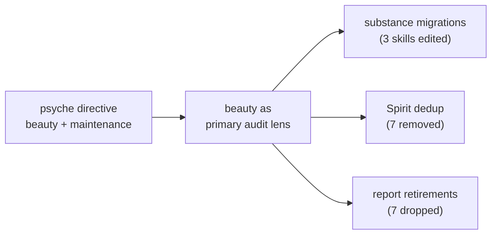

; designer
[context-maintenance beauty-audit spirit-dedup substance-migration report-retirement designer-lane-ledger]
[Context-maintenance ledger for the 2026-06-02 designer-lane sweep dispatched under psyche directive [|do an audit of everything viewed from intent and beauty must prevail|] + [|use a subagent to do a skills/context-maintenance.md|]. Beauty principle (Spirit 1411 Maximum) is the primary audit lens. Applied: 7 Spirit duplicates removed (1402 1404 1406 1403 1407 1397 1410); 3 substance migrations into permanent skills (beauty workspace-extensions; typed trace identity; interface=enum+multi-variant); 7 designer reports retired (412 455 456 457 461 467 471); 12 designer reports kept (older 351 352 + active 443-470 set). Pending psyche-attention items carried forward: 458 spirit-triad naming gate; 470 top-6 backlog items 2-6.]
2026-06-02
designer

# 472 — Context maintenance ledger (designer lane, 2026-06-02)

*Kind: Review · Topics: context-maintenance, beauty-audit, spirit-dedup, substance-migration, report-retirement · 2026-06-02*

## TL;DR

Designer-lane context maintenance under explicit psyche authorization
2026-06-02 ([|do an audit of everything viewed from intent and beauty
must prevail|]). The sweep is **fused** — the beauty principle (Spirit
1411 Maximum, captured today) is the primary lens for both substance
migrations and report retirements. Three substance migrations land
into permanent skills; seven Spirit duplicates retire from the intent
log; seven designer reports retire from the working surface; twelve
designer reports stay (with five items routed to the psyche for
attention).

Designer-lane authority applied across the workspace permanent
surface: skill edits, Spirit dedup, designer report retirements. No
touches to operator reports, no pushes to code-repo main.

Net designer count: 26 → 19. Net Spirit duplicate band 1326-1411: 7
records removed (1402, 1404, 1406, 1403, 1407, 1397, 1410). Three
skills edited: `skills/beauty.md`, `skills/component-triad.md` (two
new sections).

## Section 1 — Frame and beauty principle

The sweep is invoked by two distinct triggers in one psyche prompt:

1. **Explicit context-maintenance direction** ([|use a subagent to do
   a skills/context-maintenance.md|]).
2. **Beauty audit** ([|do an audit of everything viewed from intent
   and beauty must prevail|]).

These fuse cleanly because the beauty principle, captured today as
Spirit 1411 (Principle Maximum), names workspace-shape consequences
that the maintenance sweep applies as direct actions:

| Beauty extension (Spirit 1411) | Maintenance action |
|---|---|
| Avoid duplicate intent records | Remove the 7 Spirit duplicates surfaced by 2026-06-02 session |
| Avoid report proliferation without retirement | Retire 7 reports whose substance migrated |
| No hand-written code where schema can drive | Migrate typed trace identity from designer 471 prototype into the permanent skill (the prototype itself retires) |
| Aesthetic gate alongside correctness | Surface the principle as primary audit lens in `skills/beauty.md` |

Audit lens application:

Five nodes; honors Spirit 1282 (visual-cap discipline).

## Section 2 — Substance migrations applied

Three migrations land into permanent skills. Each migration is
designer-lane authority; each names the source and the destination;
each retires its source report when the source's only remaining
function was carrying the substance.

### Migration 1 — Beauty as primary audit lens

**Source**: psyche prompt 2026-06-02 + Spirit 1411 (Principle
Maximum).

**Destination**: `skills/beauty.md`. Two new sections added near the
top: §"The rule" extended with the workspace-shape consequence
(terseness, symmetry, schema-driven, self-describing,
interfaces-first, composable boundaries as the gate's substance) +
§"Beauty as primary audit lens" naming the three workspace scales
(code beauty, capture discipline, report retention) plus the fourth
scale (substrate cleanliness — no hand-written code where schema can
drive).

**Why this migration matters**: the prior `beauty.md` named "if it
isn't beautiful it isn't done" but did not name beauty as an
*audit-first* discipline. The Spirit 1411 capture turns that into a
gate the workspace applies, and the skill now carries the
gate-and-lens shape so future audits use beauty as the primary lens
not as a finishing-touch criterion.

**Source retirement**: none — the Spirit record stays as captured
intent.

### Migration 2 — Typed trace identity

**Sources**:

- Spirit 1400 (Decision High, 2026-06-02) — *"Trace names are
  macro-emitted from the schema-defined enum variant structure, not
  free-floating strings. The macro knows what is being activated
  because it generated the variant."*
- Spirit 1408 (Clarification High) — *"The typed header object is
  primary; compact numeric encodings or wider extended headers are
  downstream representations of that typed identity."*
- Designer 467 (name-only trace research + prototype, 2026-06-02) —
  worked end-to-end on worktree `designer-name-only-trace-2026-06-02`
  at commit `c83e1244`. The prototype proved the shape.
- Designer 471 (trace name structure + interface header design,
  2026-06-02) — Candidate A: typed `<Plane>ObjectName` enum emission.
  Ratified by Spirit 1400.
- Landed in code at `schema-rust-next` commit `fa3f6153` ([|schema-
  rust: emit typed trace identity from interface routes|], 2026-06-02
  10:38:02) + `spirit-next` commit `2179f49f` ([|spirit-next: consume
  generated typed trace events|], 2026-06-02 10:43:14). The emitted
  shape includes `TraceObject`, `TraceEvent`, `TraceInterfaceObject`,
  `TraceActorObject` per-plane.

**Destination**: `skills/component-triad.md` §"Runtime triad engine
traits" — new sub-section §"Trace identity is schema-emitted, not
stringly". Names Spirit 1400 + 1408, the shape that landed, the
2-row interface chain (row 1 = root variant; row 2 = struct-leaf or
enum-continue), the COMPACT vs EXTENDED form distinction, the
retirement of the transitional `TraceObjectName(String)` shape.

**Source retirement**: designer 467 + 471 retire (substance now lives
in the skill + the code commits + the kept Spirit records). Detail
on the prototype's worktree branch lives in the code history (the
worktree branch + commit hash are referenced from the skill as the
canonical worked example).

### Migration 3 — Interface roots are enums with more than one variant

**Sources**:

- Spirit 1395 (Decision High, 2026-06-02, pre-existing) — developed
  interfaces direction.
- Spirit 1401 (Clarification High, 2026-06-02) — *"An interface is an
  enum at the root with MORE THAN ONE variant. If a designer cannot
  name more than one operation the root represents, the design is
  incomplete and not an interface."*
- Designer 468 (developed interfaces — spirit pilot expansion, persona,
  orchestrate, 2026-06-02) — section "Spirit pilot expansion" carries
  the worked example of `SemaReadInput` growing from 1 to 4 variants.

**Destination**: `skills/component-triad.md` §"Runtime triad engine
traits" — new sub-section §"Interface roots are enums with more than
one variant". Names Spirit 1401, the two consequences (ask "can I
name two operations on this root?" while sketching; one-variant
roots are newtypes wearing enum clothing), the worked example
(`SemaReadInput [(Observe Query)]` failing the rule + the expansion
fixing it).

**Source retirement**: designer 468 stays — the report still carries
the persona + orchestrate component sketches plus five ratification
candidates the psyche has not yet engaged with. Only the
interface-formalization substance migrated; the component sketches
remain pending psyche attention.

## Section 3 — Spirit dedup sweep

The 1326-1411 band carried seven duplicate captures from the rapid
2026-06-02 session. Per `skills/intent-maintenance.md` §"Removing a
record — tombstone first", each duplicate's text + provenance was
captured before the `(Remove N)` operation. Below is the tombstone
appendix.

### Duplicate cluster A — trace name macro-emission (3 records collapsed to 1)

Kept: **Spirit 1400** (broadest framing — captures COMPACT vs
EXTENDED and the enum-vs-struct macro-emission fact).

Removed:

- **1402** (Decision High, 2026-06-02 07:55:19) [trace schema
  generated-interface typed-enum]: *"Trace identifiers should be
  generated from the schema interface language as typed enum values
  or enum-of-enum values, not as post-macro free strings. The
  macro/interface already defines the traceable operation names, so
  the trace interface should reuse those generated names."* —
  redundant with 1400.
- **1406** (Decision High, 2026-06-02 07:57:16) [trace schema
  header]: *"Trace object identity should be generated from the
  schema interface language. The macro interface definition names
  the traceable objects, so trace identifiers should be typed
  generated values, not arbitrary strings invented after macro
  expansion."* — redundant with 1400.
- **1404** (Decision High, 2026-06-02 07:55:19) [schema trace header
  interface]: *"Trace should be generated from the schema interface
  header: root enum variants and their payload type names, such as
  Record Entry, Observe Query, Remove RecordIdentifier, RecordAccepted
  SemaReceipt. Trace is matching on the language created by the
  interface."* — example-bearing but redundant; the worked example
  now lives in the skill section.

### Duplicate cluster B — interface definition multi-variant (2 records collapsed to 1)

Kept: **Spirit 1401** (Clarification High; most concrete — names
the "single-variant enums prove themselves newtypes in practice"
diagnostic).

Removed:

- **1403** (Principle High, 2026-06-02 07:55:19) [schema interface
  root-enum]: *"A message interface root is an enum and should have
  more than one action. If only one action can be named, the
  interface is underdeveloped and should be expanded before being
  treated as a real interface."* — restates 1401 at a different
  classification (Principle vs Clarification). 1401 wins on age
  (earlier) + on naming the newtype consequence.
- **1407** (Principle High, 2026-06-02 07:57:16) [schema interface
  root enum actions]: *"A root interface is an enum of meaningful
  actions and should normally contain more than one action. If only
  one action can be named, the interface is underdeveloped and
  should be expanded before being treated as a real interface."* —
  duplicate of 1403, which is duplicate of 1401.

### Duplicate cluster C — Help action recursion (2 records collapsed to 1)

Kept: **Spirit 1396** (Decision High, 2026-06-02 07:24:56) — names
the recursive shape (Help-of-Help works) + the schema source as
single source of truth.

Removed:

- **1397** (Decision High, 2026-06-02 07:26:16) [spirit-next schema
  root-enum help generated-interface]: *"Each schema root enum should
  get a generated Help action automatically from the macro. The Help
  action uses the interface description to produce help-message
  outputs, and those help messages are themselves schema-generated
  root-interface enum values."* — restates 1396 without the
  "self-description becomes part of every component's typed interface
  contract" framing 1396 adds.

### Duplicate cluster D — Playwright + browser-use (2 records collapsed to 1)

Kept: **Spirit 1409** (Decision Medium, 2026-06-02 08:02:37).

Removed:

- **1410** (Decision Medium, 2026-06-02 08:12:30) [playwright cli
  browser automation browser-use chrome]: *"CriomOS-home should
  expose Playwright CLI as an agent browser automation tool, while
  browser-use integration should remain a separate delegated
  browser-agent layer rather than assuming browser-use drives the
  Playwright CLI directly."* — restates 1409 with light rewording;
  same magnitude, same kind, ten minutes apart.

### Total: 7 records removed from the active Spirit store.

The dedup pattern across this session: rapid-fire capture during a
live psyche conversation produced multiple captures of the same
intent statement under slightly different framings as the
conversation refined. Beauty principle (Spirit 1411) names this
explicitly — duplicate captures clutter the intent layer; the
canonical capture wins. The earlier capture is preferred when
substance is identical (per `skills/intent-maintenance.md`).

## Section 4 — Report retirement ledger

Seven designer reports retire. Each retirement names the landing
evidence (where the substance lives now) per `skills/context-
maintenance.md` §"Staleness has a landing gate".

| Report | Retired because | Landing evidence |
|---|---|---|
| 412 — review of system-designer 42 horizon 167 audit | Audit-of-an-audit from 2026-05-28; substance long absorbed | D1/D2/D3/D4 divergences all closed in code: `schema-rust-next` emits collections; engine-trait architecture lives at `spirit-next d29dc6c` SemaEngine split |
| 455 — b53f4fc2 design-implementation fidelity audit | Headline gap (SemaEngine apply/observe split) LANDED at `spirit-next d29dc6c` (Spirit 1357 ratification) | Code at `spirit-next/src/store.rs` apply/observe split |
| 456 — retire stale design remnants | Branch integrated; `spirit-next/src/nexus.rs` collapsed from 240 to 72 lines as the report predicted | Code history `spirit-next d29dc6c` |
| 457 — operator day audit + bead sweep continuation | "In-flight consolidation" framing now stale; integration landed | `spirit-next d29dc6c` + bead queue drop from 209 to 77 already recorded |
| 461 — context-maintenance 2026-06-01 (meta-report dir) | Superseded by this sweep (472); successor-sweeps-retire-predecessor-ledgers rule | This report — handoffs re-issued in Section 6 |
| 467 — name-only trace research and prototype | Prototype proved the shape; emitter + consumer LANDED on main | `schema-rust-next bfacb96` (name-only emission) + `spirit-next b5ced5c` (consume hooks) + `2179f49` (typed trace events). Substance in `skills/component-triad.md` §"Trace identity is schema-emitted" |
| 471 — trace name structure + interface header design | Candidate A (typed `<Plane>ObjectName` emission) ratified by Spirit 1400 + LANDED at `schema-rust-next fa3f615` | Code at `schema-rust-next/src/lib.rs` (TraceInterfaceObject + TraceActorObject + TraceObject + TraceEvent emission); substance in `skills/component-triad.md` (two new sub-sections) |

Designer-lane count moves: 26 → 19. Still over the 12-report soft
cap, but most remaining reports are either pending psyche action or
genuinely load-bearing (older 351 + 352 pending psyche review; 443
+ 444 foundational; 445-452 each carry distinct active work; 458 +
463 + 465 + 466 + 468 + 469 + 470 each carry pending psyche items
or load-bearing design substance).

## Section 5 — Reports kept and why

Twelve designer reports remain (counting meta-report directories as
one each).

| Report | Why kept |
|---|---|
| 351 — intent file tour 2026-05-26 | 5 pending psyche-review flags; per `skills/context-maintenance.md` §"Per item, decide" pending psyche-review flags are not stale merely because they are old |
| 352 — intent log audit 2026-05-26 | D1-D18 + M1-M5 + H1-H12 flagged for psyche review; same rule |
| 443 — design improvements audit (meta) | Foundational for next-stack era; substrate-level audits across four repos |
| 444 — stack vision (meta) | §5 horizon ledger is the canonical horizon surface |
| 445 — next stack audit | Four findings live; recent (2026-06-01) |
| 446 — next stack porting research (meta) | Convergent first-slice recommendation (spirit-fold); awaits Phase 0 land + wave-1 trio per the designer-operator loop in `skills/designer.md` |
| 447 — upgrade as SEMA design | Sole design for upgrade mechanism; implementation not started |
| 448 — single-field wrapper audit | 5-reason taxonomy + 28-instance survey; migration candidate to `skills/rust/methods.md` future Rust-discipline-maintenance pass |
| 449 — bead staleness audit | Implementation in progress; some beads still alive |
| 450 — operator 271 closed-claims verification | Branches pushed; integration progress per claim |
| 451 — operator 271 falsifiable specs | Branches pushed; 8 claims retire claim-by-claim as each turns green |
| 452 — rkyv enum-wrapping audit | Design-rationale guard (competing alternatives — Suggestions 1/2/3 with empirical evidence per pilot tests); substance partly migrated to Spirit 1358-1360 but report carries the worked tests + comparison |
| 458 — spirit triad naming gate decision | **Pending psyche ratification** (Option A vs Option B; designer recommends A) |
| 463 — operator trace implementation audit + intent gaps | Gap A (cargo+NOTA stratification) + Gap B (testing-instrumentation triad placement) — pending Spirit capture/ratification |
| 465 — recent decision landscape | Recent-decisions consolidation; useful reference for the design surface |
| 466 — triad engine honesty situation (meta) | Ratification candidates 2-5 pending (Validate trait emission, Signal-admission scaffolding emission, Output split for slim Nexus, engine actor promotion) |
| 468 — developed interfaces — spirit + persona + orchestrate | Persona + orchestrate component sketches still active; five ratification candidates pending |
| 469 — introspect component design | New component design; psyche has not yet engaged with the shape decisions |
| 470 — psyche backlog top 6 visual | Items 2-6 still open (item 1 name-only trace landed) |

The keep-band concentrates load: each kept report either awaits
psyche attention OR carries unique substance not yet ready for
permanent migration. The retire-band cleanly drops everything whose
substance has landed.

## Section 6 — Pending psyche-attention items

Five items the sweep surfaces for explicit psyche engagement. Each is
restated here with enough substance to engage without opening the
source report.

### Item 1 — Spirit triad naming gate (report 458)

Decision: keep `core-signal-spirit` (legacy `core-` prefix retires
per Spirit 293), but pick its replacement:

- **Option A — `owner-signal-spirit`**: current workspace convention;
  10+ `owner-signal-*` repos exist. Designer recommends A for the
  spirit slice; Option B as a separate workspace-wide pass.
- **Option B — `meta-signal-spirit`**: proposed in Spirit 290 + 299
  but still tentative (Spirit 290 is Minimum magnitude; 299 calls it
  a "tentative rename direction").

Designer authority does not extend to either rename without explicit
psyche ratification. The Phase 0 fold (spirit-next porting per
designer 446) does not require the decision to start, but the trio
shape benefits from clarity.

### Item 2 — Top-6 backlog items 2-6 (report 470)

Item 1 (name-only trace integration) is LANDED. Items 2-6 await
ratification:

- **Item 2 — spirit-next pilot expansion** (Spirit 1395 confirms
  direction; pick the variant set). Designer 468 sketches: `Input` 5
  variants + `SemaWriteInput` 4 variants + `SemaReadInput` 4
  variants. Single yes/no.
- **Item 3 — Minimal introspect daemon** (Spirit 1398 captured;
  confirm minimal-scope + push model). Designer 469 sketches:
  IngestTraceEvent + QueryTraceEvents on schema-next; spirit-next
  emits via testing-trace; CLI round-trips. Single yes/no on the
  minimal scope.
- **Item 4 — Nexus typed side-channel `NexusOutput`** (escalated to
  Maximum candidate). The Nexus side-channel pattern: `NexusOutput`
  variants for `Fanout` / `Summarize` / `Drop` beyond SEMA writes.
  Ratify as Maximum?
- **Item 5 — Help action shape** (Spirit 1396 captured; four
  sub-decisions). Designer recommends Option C (Asschema slices) +
  every-root + selective-recursion + the proposed HelpRequest set.
  Single combined yes/no across the four sub-decisions.
- **Item 6 — Engine actor promotion** (Spirit 1365 if-possible hedge
  + designer 466.3 candidate 4). Pilot scope: fold the engine traits
  up one level into per-plane actor traits with mailbox + lifecycle
  + trace hooks. Ratify direction + pilot scope?

### Item 3 — Intent gaps from designer 463

Two intent gaps from 2026-06-01 trace-implementation audit, neither
captured yet:

- **Gap A — cargo+NOTA stratification** (Principle High candidate):
  *"Compile-time and runtime configuration are stratified — cargo
  features control which code exists in the binary at all
  (compile-time existence); NOTA configuration drives runtime
  behavior of the existing code."*
- **Gap B — testing-instrumentation triad placement** (the placement
  question for testing-build verification surfaces in the triad
  architecture; designer 463 §2 lays it out).

### Item 4 — 466.3 ratification candidates

From triad-engine honesty meta-report:

- Candidate 2 — Validate trait emission from schema (closes 60-line
  hand-written validate leakage in `engine.rs:296-338`).
- Candidate 3 — Signal-admission scaffolding emission (closes
  ORIGIN_ROUTE_BASE magic number; emits OriginRouteAllocator +
  MessageIdentifierAllocator).
- Candidate 4 — Output split for slim Nexus (closes Spirit 1389
  violation on Observe path).
- Candidate 5 — Engine actor promotion (same as backlog item 6).

### Item 5 — Persona + orchestrate component sketches (report 468)

Designer 468 §2 sketches persona as broader identity/profile/state/
capabilities surface (8 Input variants); §3 sketches orchestrate as
engine-trait runtime for lane coordination (8 Input variants
replacing the shell-helper + `.lock` substrate). Both await psyche
engagement — these are new components, not refinements of existing.

## Section 7 — Per-lane handoffs

### Designer lane — applied directly

- 3 substance migrations applied to permanent skills.
- 7 designer reports retired.
- 7 Spirit duplicates removed.
- This ledger (472) becomes the active context-maintenance ledger,
  superseding 461.
- Commits + push are part of this sweep (see Section 8).

### Operator lane — handoff (operator owns retirements in operator reports)

When operator next does context maintenance, the relevant actions
are:

1. **Operator 273** — spirit-next b53f4fc2 triad runtime audit.
   Eligible for retirement; SemaEngine split + retire-design-remnants
   integration landed (spirit-next d29dc6c).
2. **Operator 274** — live architecture witness research. The Layer 2
   witness has landed via testing-trace; this report's research is
   absorbed. Eligible for retirement.
3. **Operator 271** — context maintenance current state. May
   continue carrying load until operator's next cross-lane sweep
   absorbs its handoffs.
4. **Operator 275-277** — instrumentation log-socket + context
   maintenance + testing-trace implementation. 275's prototype +
   276's context maintenance + 277's implementation closeout have
   all moved into the typed-trace architecture; each may retire as
   operator's sweep confirms substance has migrated.
5. **Operator 281** — generated interface logic with macros. Operator
   walkthrough of the trait shape that the typed-trace emission
   (fa3f615) refined. Retire when operator confirms the typed shape
   is the canonical walkthrough.
6. **Operator 282** — trace header generated interface situation.
   Current shape report; keep until next operator sweep judges.
7. **Older operator reports** (246-266 pre-pivot era) — per the
   era-shift discipline (`skills/context-maintenance.md` §"Topic-era
   shifts retire blocks"), most of these are stale. Operator-lane
   retirement.

No designer-lane authority over any operator report; the above is
informational handoff.

### Other lanes

None identified in scope this sweep.

## Section 8 — Commit plan

The migrations + retirements + this ledger commit in three
coherent chunks for git-blame quality:

1. **Substance migrations** — `skills/beauty.md` + `skills/component-
   triad.md` edits.
2. **Report retirements + this ledger** — 7 retired files + this
   ledger landing.
3. **Spirit dedup** is not a file-level commit — it's seven
   `(Remove N)` operations against the Spirit daemon; this ledger
   documents the tombstones in Section 3.

Push: `git push origin main` from the primary repo. Designer
authority covers this push per spirit record 1230.

## Section 9 — Beauty principle: how this sweep applied it

The audit lens applied through the sweep:

- **Terseness**: 7 reports removed; 7 Spirit duplicates removed;
  three skill sections added but each is bounded. The report tree
  reads cleaner. The Spirit log reads cleaner.
- **Symmetry**: every duplicate cluster collapsed to one canonical
  record; the typed trace identity now sits in the same skill
  section as the engine traits it instruments.
- **Schema-driven**: typed trace identity emerged from schema-rust-
  next's emitter; the migration into the skill names that emergence
  rather than the hand-written prototype variants.
- **Self-describing**: the typed `TraceObject` / `TraceInterfaceObject`
  / `TraceActorObject` surface IS the trace vocabulary; downstream
  decoders read it without parsing strings.
- **Interfaces-first**: the new skill section §"Interface roots are
  enums with more than one variant" makes this rule explicit at the
  workspace level; previously the rule lived only inside individual
  reports.
- **Composable boundaries**: the trace identity now composes with
  the engine-trait architecture (already in the same skill section)
  rather than living as a parallel `String` shadow.

The sweep is itself a worked instance of the beauty principle: the
maintenance is the workspace's mechanism for keeping the surfaces
beautiful as they accumulate.

## Cross-references

- `skills/context-maintenance.md` — the discipline this sweep
  follows.
- `skills/intent-maintenance.md` — Spirit dedup discipline.
- `skills/reporting.md` — retirement rules.
- `skills/beauty.md` — extended this sweep with the audit-lens
  framing.
- `skills/component-triad.md` — extended this sweep with two new
  sub-sections (typed trace identity + interface=enum+multi-variant).
- Spirit 1411 (Principle Maximum) — beauty principle that drove the
  audit lens.
- Spirit 1400 + 1401 + 1408 — kept as canonical captures after
  dedup.
- `schema-rust-next fa3f6153` + `spirit-next 2179f49f` — the code
  that landed the typed trace identity; the substance the sweep
  migrated into the skill is the workspace-shape description of
  this code.
- Retired this sweep: designer reports 412, 455, 456, 457, 461, 467,
  471; Spirit records 1402, 1404, 1406, 1403, 1407, 1397, 1410.
