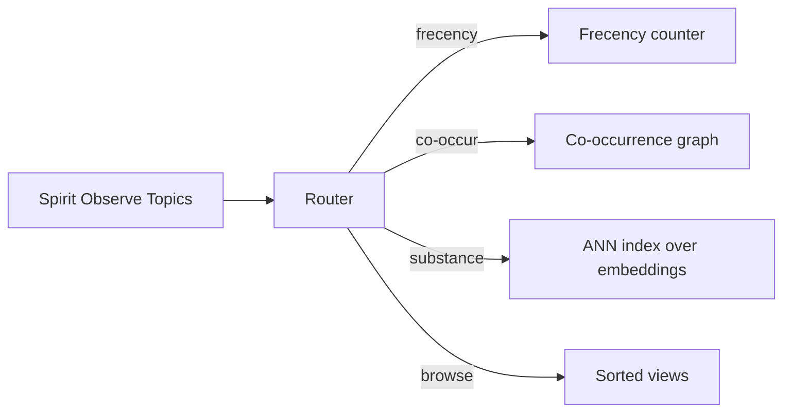
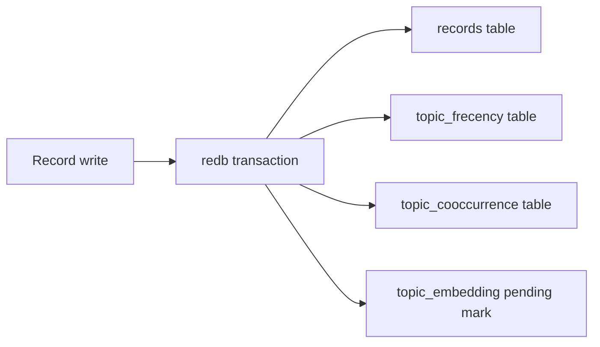

# 474 — Spirit topic-discovery feature design

## TL;DR

Three-layer hybrid: **frecency** (cheap, classic) for the "what's active right now" use case; **co-occurrence graph** for the "what topics typically appear together" + "synonym-cluster" use case; **sentence-embedding similarity** (the smart-and-clever part) for the substance-similarity and topic-string-similarity use cases. Library picks: **`fastembed-rs`** (ONNX-wrapped MiniLM or BGE-small) for embeddings; **`hnsw_rs`** for the approximate-nearest-neighbour index; **`petgraph`** for the co-occurrence graph; in-house tiny code for frecency. Cache lives in the daemon's existing redb SEMA store as three additional tables. Three-phase landing: phase 1 frecency (1-2 days); phase 2 co-occurrence + clustering (2-3 days); phase 3 embeddings + ANN (1-2 weeks). Cold-start: opportunistic background warm at daemon launch, surfacing results before the embedding layer is ready.

## Section 1 — Algorithm proposal

### Why hybrid, not one algorithm

The five use cases pull in different directions. Frecency is a single-dimensional ranking — frequency times recency, nothing else. Embedding similarity is a 384-dimensional cosine on dense vectors. Co-occurrence is a graph problem. Forcing one algorithm to cover all five either gets weak answers across the board (embeddings can technically rank by frecency, but poorly) or makes the daemon footprint pay for the heaviest case on every query. The hybrid keeps each layer cheap to use and lets the daemon decline to load the heaviest layer (embeddings) when it isn't installed yet.

### Use-case to algorithm mapping

| Use case | Primary algorithm | Why |
|---|---|---|
| Substance-similarity query — agent describes the substance | Embedding similarity | Description text is unstructured; topic strings are short; cosine on a multilingual sentence embedding handles paraphrase and synonym naturally |
| Topic-string similarity — agent has a topic word | Embedding similarity + trigram fallback | Topic strings are short; embedding catches semantic synonyms (`trace-testing` versus `testing-trace`); trigram catches typos and prefix matches |
| Topic frecency — what is active now | Custom frecency counter | Single-dimension; no library needed; computed incrementally on each record write/remove |
| Topic co-occurrence — what appears together | Co-occurrence graph | Topics are vectors per record; edges are co-appearance counts; queries are one-hop on the graph |
| Topic browse — scan the vocabulary | Sorted index per ordering | Alphabetical is trivial; frecency reuses the counter; cluster ordering reuses the co-occurrence graph's Louvain partition |

### Layer interaction sketch



(Five nodes per Spirit 1282 cap; the layers feed independent table cells in the cache.)

### Algorithm details — frecency

Frecency score per topic equals a weighted sum of past uses with exponential decay on age. A use is one record using the topic. The half-life is configurable on the owner-signal plane; a reasonable default is 30 days, which gives roughly month-scale freshness without losing rarely-revisited topics entirely. Each record write increments the topic's score by one and stamps the topic's "last use" time; each record remove decrements. Queries simply sort the topic table by current score (re-decayed at query time using the cached `last_use_time` and a multiplier from the elapsed days). The decay is computed lazily on read, not eagerly on every minute tick — no background sweep needed. This is essentially Firefox's frecency formula adapted to topics.

The formula is `score(now) = stored_score * 2^(-(now - last_use_time) / half_life)`. The stored score is the accumulated weight at `last_use_time`; the read-time decay applies the elapsed gap. Updates compound correctly: when a new record uses the topic at time `t`, the daemon reads the stored score, decays it forward to `t` (one multiplication), adds the new increment, writes `(decayed + 1, t)`. The invariant holds: the stored pair is the score evaluated at `last_use_time`. Removes invert the increment, decaying first then subtracting one; the score can dip below zero for a topic whose remove decrements outpace its increments (a topic whose every original record gets cleaned out), which then sorts naturally below an unused topic.

The owner-signal `TopicFrecencyHalfLifeDays` policy field controls the half-life. Switching half-life is a global operation but does not require a re-scan of the records table — only the stored score and the last-use time are kept, and the next read evaluates with the new half-life. The catch: scores under the old half-life and scores under the new are not directly comparable on the boundary day, but the boundary is short-lived (one day later the old scores have re-decayed under the new policy) and frecency rankings are intrinsically approximate.

### Algorithm details — co-occurrence

Each record carrying topics `[a b c]` increments edge counts for the three pairs `{a-b, a-c, b-c}` in the co-occurrence graph. Edges are weighted by count; nodes are topic strings. The graph is small (workspace has hundreds of topics, not millions) so it can live entirely in memory at the daemon, materialised from a sparse edge table in redb at startup. Two queries: "what co-occurs with X?" is one-hop neighbour traversal sorted by edge weight; "synonym clusters" is Louvain (modularity-maximising) clustering recomputed when the graph crosses a change threshold (e.g., five percent of edges modified).

Edges are stored as canonical-ordered pairs (`(min_topic, max_topic)`) so the lookup table is half the size of a directed-edge table and the co-occurrence query reads both directions through the same key. A record with five topics produces ten edge increments — at workspace scale (a few captures per hour at most) this is negligible work per write.

Louvain is run as a background task triggered when the cumulative change counter (number of edges added or modified since last run) crosses the threshold. The output is a `Vec<Cluster>` where each `Cluster` is a `Vec<Topic>`; the assignment lives in a `topic_cluster` derived table refreshed atomically when Louvain finishes. The `ClusterFor` query reads this table; the `(All ByCluster)` browse query joins it with the topic frecency table for in-cluster ordering.

The Louvain pass at ~400-topic scale takes single-digit milliseconds — small enough that the change-threshold gate exists purely to avoid recomputing on every single record write, not because the cost is high. A simpler trigger ("recompute on any change") would work too; the threshold is just a small optimisation.

### Algorithm details — embeddings

Each topic's vector input is the topic string concatenated with the description text of the records using that topic (truncated to a fixed window, e.g., the most-recent 32 descriptions). The embedding model (a small sentence-transformer like MiniLM-L6-v2 or BGE-small, 384 dims) produces one dense vector per topic. The vectors are stored in redb. An in-memory ANN index (HNSW) wraps them at daemon startup. Substance-similarity queries encode the query text once, then top-k cosine over the ANN. Topic-string-similarity queries skip the description concatenation and embed the topic-string alone (faster; different distance distribution). Both modes index into the same vector store.

The concatenation policy is the load-bearing design decision. Options considered:

1. **Topic string alone**. Too short — a single hyphen-separated phrase yields very weak embedding signal because most of the model's contextual reasoning has nothing to operate on. Useful only as a fallback for never-used topics.
2. **Topic string + most recent description**. Captures one record's substance; not robust to the topic's range of uses.
3. **Topic string + concatenated descriptions from the most-recent N records (chosen N=32)**. Captures the topic's recent semantic envelope without ballooning input length past the model's context window. This is the picked policy.
4. **Topic string + summary of all descriptions ever using the topic**. Requires a summarisation pass; another inference step; over-engineered for a discoverability feature.

The window size N=32 fits BGE-small's 512-token context comfortably for typical description lengths (~30-60 tokens each), with truncation at 512 tokens if the concatenation overflows.

Two embedding tables live in parallel: `topic_embedding_string_only` (used by `StringSimilarTo`) and `topic_embedding_with_context` (used by `SubstanceSimilarTo`). The two are computed in one batch when a topic's records change. Storage cost: ~3 KB per topic for both vectors combined; ~1.2 MB total for a 400-topic workspace.

## Section 2 — Library choice (Rust ecosystem)

### Embedding model + runtime

**Pick: `fastembed-rs`** (version 4.x at time of writing; tracks model availability).

`fastembed-rs` wraps ONNX Runtime via the `ort` crate and ships a curated catalogue of small sentence-embedding models (`BAAI/bge-small-en-v1.5`, `sentence-transformers/all-MiniLM-L6-v2`, `thenlper/gte-small`, `intfloat/e5-small-v2`). The API is intentionally tiny — instantiate, embed a batch, get vectors. Compared to alternatives:

| Library | Pros | Cons | Verdict |
|---|---|---|---|
| `fastembed-rs` | Small surface; ONNX backed by `ort`; model catalogue pre-curated; ~30-50 MB models | Pulls in `ort` (ONNX Runtime native lib) | Pick this |
| `candle` | Pure Rust; Hugging Face native; flexible | Bigger surface; per-architecture wiring required; daemon footprint grows | Overkill for this feature |
| `rust-bert` | Mature; torch-rs backed | Pulls in libtorch (hundreds of MB); painful packaging | Wrong tool — too heavy |
| Local sentence-transformers via Python sidecar | Maximum model variety | External process; breaks the single-binary discipline | Out — Spirit is one daemon |

Default model: **BGE-small-en-v1.5** (384 dims, ~33 MB ONNX, top-of-class MTEB scores for its size). Alternative for non-English content if it appears: BGE-M3 multilingual; bigger (~600 MB), defer.

### ANN index

**Pick: `hnsw_rs`** (the Rust-native HNSW implementation).

| Library | Pros | Cons | Verdict |
|---|---|---|---|
| `hnsw_rs` | Pure Rust; battle-tested; serde-serialisable | Slower to build than C++ peers (workspace scale not a problem) | Pick this |
| `instant-distance` | Tiny; pure Rust | Less feature-complete; smaller community | Backup option |
| `usearch` | Fastest C++ | FFI; build complexity | Wrong fit for the daemon |

Workspace has ~1400 records mapping to perhaps 200-400 unique topics. HNSW at this scale is sub-millisecond per query and sub-second to build. The serde path means the daemon can serialise the index to redb between restarts when desired, though rebuild from cached vectors is fast enough that this is a later optimisation.

### Co-occurrence graph + clustering

**Pick: `petgraph`** for the graph, plus a small in-house Louvain implementation (or `graphalgos` if a maintained one surfaces).

`petgraph` is the canonical Rust graph library, with stable serialisable graph types and BFS / DFS / Dijkstra built in. Louvain clustering is roughly 200 lines of code and a known algorithm; bundling a tiny implementation is cleaner than reaching for `graph-algos` which has uneven maintenance. The clustering only runs occasionally (when the change-threshold trips) so performance is not a hot path.

### Full-text / trigram fallback

For typo tolerance on topic-string similarity, a **simple in-house trigram index** suffices — topic strings are short (median ~15 chars). `tantivy` is overkill for the scale (200-400 topics, not 200k documents). Trigram is ~50 lines of code with a `HashMap<Trigram, HashSet<TopicId>>`.

### Cache substrate

The daemon's existing redb SEMA store extends with three new tables:

- `topic_frecency` — key `Topic`, value `(score: f32, last_use_time: i64, total_uses: u32)`.
- `topic_cooccurrence` — key `(Topic, Topic)` canonical-ordered pair, value `(count: u32)`.
- `topic_embedding` — key `Topic`, value rkyv-archived `EmbeddingVector` (384 f32s plus model-version tag).

No new dependency for the cache layer — redb is already in. Topic embeddings are at most a few hundred topics times 384 floats times 4 bytes equals ~600 KB on disk — trivial.

### Library footprint accounting

For phase 3 (embeddings) the new transitive dependencies and binary impact:

- `fastembed-rs` plus `ort` adds ~30 MB to the daemon binary (ONNX Runtime native lib statically linked).
- The model file (~33 MB for BGE-small) is downloaded on first use into `~/.local/share/persona-spirit/models/<model-name>/` or bundled via Nix derivation.
- `hnsw_rs` adds ~50 KB compiled.
- `petgraph` adds ~200 KB compiled.

Total daemon binary footprint with phase 3: ~30-35 MB extra. Phase 1 and phase 2 add negligible weight (just `petgraph`).

### Why not just LLM-everything

A defensible alternative would be to skip the hybrid and route every query through a small local LLM ("rank these topics by similarity to this prompt"). This is rejected on three grounds:

1. **Latency**. A small LLM inference is hundreds of milliseconds; cosine over a precomputed ANN index is single-digit milliseconds. Frecency queries are sub-millisecond. For an agent making many topic queries per session, the latency difference compounds painfully.
2. **Determinism**. Embedding cosine is fully deterministic; LLM ranking can drift on temperature and prompt phrasing. Agents need consistent answers across runs.
3. **Footprint**. A small LLM (Phi-3-mini, Gemma-2B) is gigabytes; an embedding model is tens of megabytes. The footprint discipline matters.

The hybrid keeps the precise tools for each use case.

### Comparison against an established tool

The closest comparable in the Rust ecosystem is `qdrant` (full vector database) — overkill. `qdrant` serves general-purpose vector search at scale; Spirit's scale (hundreds of topics) is three orders of magnitude smaller than `qdrant`'s sweet spot. The in-memory HNSW over a tiny redb-backed cache is the right size; embedding `qdrant`'s engine inside Spirit would be pure overhead.

The closest comparable in the desktop-AI ecosystem is Apple Spotlight's vector search (M-series Macs). That's a closed system; the Spirit feature emulates the same shape (local model, local index, local invocations) in open Rust.

## Section 3 — Spirit-side API additions (NOTA schema)

The new operations sit under the existing `Observe` root. Schema additions to `spirit-next/schema/lib.schema`:

```text
TopicOrdering [Alphabetical ByFrecency ByCluster]
TopicScore { Topic * Score * }
TopicScored (Vec TopicScore)
TopicList (Vec Topic)
TopicQuery [
  (SubstanceSimilarTo Description Integer)
  (StringSimilarTo Topic Integer)
  (ByFrecency Integer)
  (CoOccurringWith Topic Integer)
  (All TopicOrdering)
  (ClusterFor Topic)
]
TopicReply [
  (TopicsRanked TopicScored)
  (TopicsListed TopicList)
  (TopicCluster TopicList)
  (TopicQueryUnsupported ErrorReport)
]
Query [
  (Records (TopicMatch (Optional Kind) CertaintyMatch RecordedTimeMatch ProjectionKind))
  (RecordIdentifiers (RecordIdentifierMatch ProjectionKind))
  (Topics TopicQuery)
]
```

`Topic` is the existing newtype; `Score` is a new `Float` newtype (rkyv-archivable wrapper around `f32`). `TopicQueryUnsupported` covers the case where the daemon doesn't have phase 3 installed but receives a `SubstanceSimilarTo` query.

### End-to-end worked walkthrough

A concrete trace through the system for a `(SubstanceSimilarTo ...)` query. The agent submits:

```sh
spirit "(Observe (Topics (SubstanceSimilarTo [agent has hit a bug in the trace path] 5)))"
```

The CLI binary builds a NOTA `Observe` operation containing a `Topics` query with a `SubstanceSimilarTo` payload. It writes the rkyv-encoded bytes to the ordinary unix socket and waits for the daemon's reply.

The daemon's `Engine::handle_signal` routes the operation. The signal admission actor accepts (no validation error). The Nexus mail keeper sees a SEMA read input; the read input is `Observe (Topics (SubstanceSimilarTo ...))`. The store's `observe` method matches on `Query::Topics(TopicQuery::SubstanceSimilarTo(description, k))`. This branch is the new code:

1. Encode the query description through the embedding model. `fastembed::TextEmbedding::embed(&[description])` returns a `Vec<f32>` of 384 dims. Cost: ~50ms on CPU.
2. Query the in-memory HNSW index. `hnsw.search(&query_vector, k, ef_search)` returns the top-k topic IDs with cosine distances. Cost: sub-millisecond.
3. Build the `TopicsRanked` reply payload by joining the topic IDs against the `topic_embedding_with_context` table to recover the topic strings (the HNSW index stores integer IDs; the topic strings live in redb).
4. Compose the reply: `Reply::Observed(ObservedRecords { ... })` becomes `Reply::TopicsRanked(TopicScored { ... })` after the new reply variant is added.

The daemon writes the rkyv-encoded reply to the socket; the CLI decodes and prints the NOTA text form on stdout.

Total query latency: ~50ms (embedding) plus ~1ms (everything else) = ~51ms.

For comparison, a `(ByFrecency 20)` query skips the embedding step entirely; the path is: route → read `topic_frecency` table → sort by decayed score → return top 20. Total latency: <5ms.

### Worked examples (live NOTA — bracket strings only)

Substance-similarity:

```sh
spirit "(Observe (Topics (SubstanceSimilarTo [agent has hit a bug in the trace path] 5)))"
# -> (TopicsRanked [(testing-trace 0.91) (runtime-trace 0.87) (signal-rejection 0.62) (engine-trace 0.59) (trace-event 0.55)])
```

Topic-string similarity:

```sh
spirit "(Observe (Topics (StringSimilarTo trace-testing 5)))"
# -> (TopicsRanked [(testing-trace 0.95) (runtime-trace 0.81) (trace-event 0.74) (engine-trace 0.70) (signal-trace 0.66)])
```

Frecency:

```sh
spirit "(Observe (Topics (ByFrecency 20)))"
# -> (TopicsRanked [(spirit-next 124.3) (schema-rust-next 98.1) (testing-trace 71.4) ...])
```

Co-occurrence:

```sh
spirit "(Observe (Topics (CoOccurringWith spirit-next 10)))"
# -> (TopicsRanked [(schema-rust-next 67) (testing-trace 51) (engine-trait 44) ...])
```

Browse:

```sh
spirit "(Observe (Topics (All Alphabetical)))"
# -> (TopicsListed [actor-systems agent-memory architecture beauty-principle ...])

spirit "(Observe (Topics (All ByFrecency)))"
# -> (TopicsListed [spirit-next schema-rust-next testing-trace ...])

spirit "(Observe (Topics (All ByCluster)))"
# -> (TopicsListed [;; clustered groups, intra-cluster alphabetical
;;   spirit-next persona-spirit signal-persona-spirit ...
;;   trace-testing testing-trace runtime-trace engine-trace ...
;;   ...
])
```

Synonym cluster lookup (mostly for maintenance):

```sh
spirit "(Observe (Topics (ClusterFor trace-testing)))"
# -> (TopicCluster [trace-testing testing-trace runtime-trace engine-trace])
```

### Owner-signal additions (policy)

Owner-signal carries configuration choices for the discovery layer — model selection, half-life, threshold parameters. Following the no-flags discipline, these are persisted policy records, not CLI flags:

```sh
spirit-owner "(Configure (TopicEmbeddingModel (ModelChoice BgeSmallEnV15)))"
spirit-owner "(Configure (TopicFrecencyHalfLifeDays 30))"
spirit-owner "(Configure (TopicClusterRecomputeThresholdPercent 5)))"
spirit-owner "(Observe (TopicDiscoveryStatus))"
# -> (TopicDiscoveryStatus { 
#     model: BgeSmallEnV15
#     embeddings_warmed: 248
#     embeddings_pending: 0
#     index_built_at: (2026-06-02 14:32:11)
#     frecency_decay_half_life_days: 30 })
```

`(ModelChoice ...)` is an enum of bundled model identifiers; new variants land as new schema fields rather than free-text strings. Owner-signal-driven model swap clears the embedding table and re-warms.

### Reply semantics

`TopicsRanked` is the score-bearing form (any similarity / frecency / co-occurrence count metric); `TopicsListed` drops the scores for pure browse views. `TopicCluster` returns the cluster set as an unordered list. `TopicQueryUnsupported` returns when the daemon receives a query whose backing layer isn't installed — phase 3 query against a phase 1 daemon, for instance.

The reply types follow Spirit's terse pattern (no echo of the query inside the reply; the caller knows what they asked).

### Score semantics — what the float means by query

The score field of `TopicScore` carries different units depending on the query that produced it:

- `SubstanceSimilarTo` and `StringSimilarTo`: cosine similarity in `[-1, 1]`; in practice almost always in `[0, 1]` because embeddings are positively oriented.
- `ByFrecency`: decayed-frecency score in `[0, +inf)`; not capped; raw value.
- `CoOccurringWith`: co-occurrence count in `[0, +inf)`; raw integer count of records where both topics appeared.

The unit is not part of the wire payload — agents reading a `TopicsRanked` reply know which query they sent. This keeps the wire shape uniform; agents that want to compare scores across query types must understand the units themselves.

### Topic-not-present semantics

A query referencing a topic that does not exist in the workspace (`(CoOccurringWith zzz-fake-topic 10)`) returns an empty `TopicsRanked []`, not an error. Topics are user-creatable strings; the daemon does not maintain a closed-world enum to validate against. A query that produces no results is just a query that produced no results.

A `(StringSimilarTo ...)` query against a topic word that does not exist still produces meaningful output — the embedding similarity layer encodes the input string and ranks every existing topic against it. Useful for "what is this similar to in my workspace?" without requiring the input to be a registered topic.

### Query parameter bounds

Each query accepts an integer count for "top N results":

- `(SubstanceSimilarTo Description Integer)` — N defaults reasonable (3-10); maximum is bounded by the topic count.
- `(StringSimilarTo Topic Integer)` — same.
- `(ByFrecency Integer)` — same.
- `(CoOccurringWith Topic Integer)` — same.

Bounded by topic count rather than by an arbitrary cap; the daemon returns at most the number of topics it has. The schema does not encode the bound — agents that ask for 10000 get 400 (or however many topics exist) without error.

## Section 4 — Cache architecture

### Cache tables in redb

The three new tables (`topic_frecency`, `topic_cooccurrence`, `topic_embedding_string_only` and `topic_embedding_with_context` — four if both vectors are kept; see §"Algorithm details — embeddings") live alongside `records` and `ledger` in the existing `.sema` file. No new database file, no new ACID boundary — every record-write transaction also updates the topic tables in the same transaction, so the cache is always consistent with the record set without separate invalidation logic.

The redb table definitions match the established pattern in `store.rs`:

```rust
// Existing tables in store.rs (visible at top of the file).
const RECORDS: TableDefinition<u64, &[u8]> = TableDefinition::new("records");
const LEDGER: TableDefinition<&str, u64> = TableDefinition::new("ledger");

// New tables for the topic-discovery feature.
const TOPIC_FRECENCY: TableDefinition<&str, &[u8]> = TableDefinition::new("topic_frecency");
const TOPIC_COOCCURRENCE: TableDefinition<(&str, &str), u32> = TableDefinition::new("topic_cooccurrence");
const TOPIC_EMBEDDING_STRING: TableDefinition<&str, &[u8]> = TableDefinition::new("topic_embedding_string");
const TOPIC_EMBEDDING_CONTEXT: TableDefinition<&str, &[u8]> = TableDefinition::new("topic_embedding_context");
const TOPIC_CLUSTER: TableDefinition<&str, &str> = TableDefinition::new("topic_cluster"); // topic -> cluster_id
```

The frecency and embedding tables store rkyv-archived structs as `&[u8]`; the co-occurrence table uses a tuple key with a primitive value. Layout matches the existing `RECORDS` table convention.



Per-table invalidation:

- **Frecency**: incrementally maintained inline with every record write/remove. No batching — the work per record is O(topic-count-of-record), typically 3-5 topics. No periodic recompute needed; decay is lazy at read time.
- **Co-occurrence**: same as frecency — incremental, in-transaction. Edge count adjustments are O(topic-count squared) per record, still trivial for small topic vectors. Louvain clustering is a separate concern; it recomputes when the cumulative change crosses the configured threshold (default 5 percent of edges modified since last recompute) and runs in a background task off the write path.
- **Embedding**: too expensive to compute inline. The transaction marks the topic's embedding row as "pending" when the topic's record set changes; a background task in the daemon processes the pending queue. Debounce policy: the background task waits N seconds after the last pending mark (default 5 seconds) before recomputing, so bursts of writes coalesce into one embedding pass.

### ANN index lifecycle

The HNSW index is in-memory only — rebuilt from `topic_embedding` at daemon startup. Build time at workspace scale (a few hundred topics) is under a second; no need to persist the index itself. On embedding updates the background task rebuilds the index after each batch settles, then atomically swaps in the new index pointer (RCU-style; queries reading the old index complete naturally).

Two HNSW indexes exist in parallel — one over the string-only embeddings, one over the with-context embeddings. The two are independent; queries to `(StringSimilarTo ...)` route to the string-only index, queries to `(SubstanceSimilarTo ...)` route to the with-context index. Build cost is doubled but still fast (each index is single-digit milliseconds to build at workspace scale).

HNSW parameters (configurable via owner-signal if needed; otherwise hardcoded):
- `M = 16` (max connections per node; HNSW standard)
- `ef_construction = 200` (build-time exploration; HNSW standard)
- `ef_search = 50` (query-time exploration; biases recall over speed for the small-workspace case)

At workspace scale, HNSW's approximation is essentially exact (>99 percent recall against brute-force) because the candidate set is so small.

### Cold-start strategy

The first time phase 3 lands, every existing topic needs an initial embedding. With ~400 topics and ~50ms per embedding on CPU (BGE-small batch of 1), that's ~20 seconds of background work — not blocking. The daemon launches normally; phase 1 (frecency) and phase 2 (co-occurrence) queries return immediately because their tables are populated inline by the migration step (one pass over `records` at startup if the tables don't exist yet). Substance-similarity queries return `TopicQueryUnsupported` with a `(embeddings_warming)` hint until the warm-up completes. The owner-signal `(Observe TopicDiscoveryStatus)` query surfaces warm-up progress.

After cold-start, the embedding queue is incremental — only changed topics re-embed.

Cold-start work plan:

1. **Discover topic universe** — scan the `records` table, building a `HashSet<Topic>` of every topic word ever used. At ~1400 records this scan is sub-second.
2. **Populate frecency table** — same scan; emit one entry per topic with the accumulated score (sum of decayed contributions across all records using the topic) and the last-use time. Phase 1 is now hot.
3. **Populate co-occurrence table** — same scan; for each record's topic vector, emit the pairs. Phase 2 is now hot.
4. **Build Louvain clustering** — one pass over the co-occurrence edges. Phase 2 cluster queries are now hot.
5. **Enqueue all topics for embedding** — phase 3 only; mark every topic stale; background task drains the queue at ~50ms per topic.

Steps 1-4 complete within the daemon's startup window (sub-second total). Step 5 takes ~20 seconds for ~400 topics; substance-similarity queries return `TopicQueryUnsupported` during this window. The HNSW index builds incrementally as topics finish embedding; queries become available the moment the index has at least the requested top-k count.

The owner-signal `(Observe TopicDiscoveryStatus)` reply surfaces real-time progress so an agent can poll readiness.

A batched embedding path (embed 16 topics at once via `fastembed`'s batch API) reduces cold-start to ~3-5 seconds for 400 topics — worth the small code-complexity addition because the cold-start UX improves materially.

### Cache invalidation discipline

The invalidation question reduces to: when does a topic's substance materially change? Three triggers:

1. **New record uses the topic** — likely shifts the description-concatenation input. Mark pending; let the debounce queue absorb bursts.
2. **Old record removed that used the topic** — same logic; mark pending.
3. **Owner-signal model change** — clears all embeddings; full re-warm.

The debounce window keeps single-record bursts from triggering 400 sequential re-embeddings during a context-maintenance sweep that touches many topics.

### Invalidation correctness invariants

Three invariants the cache must preserve:

1. **Frecency monotonicity per topic per non-decreasing real time**. Between writes, the read-time frecency for a given topic strictly decays. A query at `t+1` returning a higher frecency than the same query at `t` (no writes between) is a bug.
2. **Co-occurrence count equals the cardinality of the record set containing both topics**. After any number of writes and removes, the edge weight between `a` and `b` must equal the count of records currently in the store that carry both `a` and `b`. This is the test the maintenance scan reaches for if anything looks off — recompute the edge from the records table; assert equality with the cached value.
3. **Embedding-pending invariant**. A topic whose record set has changed since its embedding was last computed must either be in the pending queue or have its embedding row marked stale. The background task processing the queue clears the stale mark on successful re-embed. If the daemon crashes mid-re-embed, the stale mark survives in redb and the topic re-enters the queue on next launch.

These invariants are testable; the test suite for each phase asserts them.

### Backup story

The cache tables are derivable from the records table — frecency from the record list, co-occurrence from the topic vectors per record, embeddings from the descriptions. A user wanting to drop the cache (start fresh, recover from corruption, switch the embedding model) can do so without losing the records. The owner-signal `(Reset (TopicDiscoveryCache))` operation drops the three tables and triggers full re-population from records.

The records themselves are the canonical state; the cache is pure derivation. This matches Spirit's existing discipline (records are first-class; computed views are not).

## Section 5 — Implementation cost estimate

### Phase 1 — Frecency

**Scope**: two new schema fields (`TopicScore`, `TopicQuery::ByFrecency`, `TopicReply::TopicsRanked`); `topic_frecency` redb table; inline increment/decrement on record write/remove; lazy decay at read time; owner-signal `TopicFrecencyHalfLifeDays` config slot.

**Effort**: 1-2 days. Schema additions in `spirit-next/schema/lib.schema`; one new redb table definition in `store.rs`; ~100 lines of frecency logic; minor wiring in `engine.rs` for the new query variant. No new dependencies. Tests cover incremental update, decay correctness, half-life sensitivity.

**Hot spots**: the schema-driven flow needs `TopicQuery` and `TopicReply` to compose correctly into the existing `Query` and `Reply` enums; one careful pass on the schema-rust-next emitter.

### Phase 2 — Co-occurrence + clustering

**Scope**: `topic_cooccurrence` redb table; inline edge-count maintenance; in-memory `petgraph::Graph` built at startup; one-hop neighbour query for `CoOccurringWith`; Louvain clustering with change-threshold gate; `ClusterFor` and `(All ByCluster)` queries.

**Effort**: 2-3 days. New dependency on `petgraph` (small, no controversy). Louvain implementation is ~200 lines; one careful pass on the threshold-trigger logic so clustering doesn't recompute too often. Tests cover edge-count consistency across record write/remove, neighbour-ordering correctness, cluster-stability across small graph changes.

**Hot spots**: choosing the right Louvain resolution parameter so clusters are neither too granular (every topic in its own cluster) nor too coarse (everything in one mega-cluster). Default Louvain resolution of 1.0 is usually fine; expose it as owner-signal policy if not.

### Phase 3 — Embeddings + ANN

**Scope**: `fastembed-rs` integration; model bundle delivery (Nix path or first-run download); `topic_embedding` redb table; debounced background re-embedding task; HNSW index over embeddings; substance-similarity and topic-string-similarity queries; cold-start warm-up; owner-signal `TopicEmbeddingModel` and warm-up status surface.

**Effort**: 1-2 weeks. The model and dependency wiring is the heavy lift — ONNX Runtime linkage, model file resolution, batch sizing. The HNSW integration and the query path are straightforward once vectors are flowing. Tests cover cold-start completion, incremental re-embed on record changes, query latency under workspace scale, model-swap clearing.

**Hot spots**:
1. Model file delivery — Nix-bundled vs first-run download trade-off (open question for psyche).
2. ONNX Runtime native library linkage on Nix — likely needs a derivation tweak in CriomOS-home.
3. Embedding-pending queue persistence — does the queue survive daemon restart? Probably yes (mark in redb; resume on launch).
4. Cold-start blocking question — daemon should accept other queries while warming. Background task discipline.

### Totals

| Phase | Effort | Ratifiable independently | Daemon footprint impact |
|---|---|---|---|
| Phase 1 — frecency | 1-2 days | Yes | Negligible |
| Phase 2 — co-occurrence + clustering | 2-3 days | Yes | +200 KB (petgraph) |
| Phase 3 — embeddings + ANN | 1-2 weeks | Yes (degrades gracefully if not installed) | +30-35 MB (fastembed + model) |
| Combined | ~3 weeks | — | ~35 MB |

Each phase ratifies independently and degrades gracefully — phase 1 alone is a meaningful frecency feature; phase 1+2 covers four of the five use cases; phase 3 closes substance similarity.

### Test strategy

Each phase carries a focused test suite. The pattern:

| Layer | Test type | Coverage |
|---|---|---|
| Frecency | Unit | Decay math; increment/decrement correctness; lazy-read consistency; cross-half-life-change behaviour |
| Frecency | Integration | Record-write triggers update; remove triggers decrement; query returns correct ordering |
| Co-occurrence | Unit | Edge-count invariant; canonical ordering; Louvain on small known graphs |
| Co-occurrence | Integration | Multi-topic record updates correct edges; remove decrements; cluster query returns expected groups |
| Embeddings | Unit | Vector storage round-trip; pending-queue lifecycle; cold-start completion |
| Embeddings | Integration | Substance-similar known pair returns high cosine; topic-string-similar returns expected synonyms; ANN top-k matches brute-force top-k on small workspace |
| Cross-layer | End-to-end | Full record-write to cached-query latency; cache survives daemon restart; reset operation re-populates from records |

The trace-testing feature flag (`#[cfg(feature = "testing-trace")]` already present in `store.rs`) extends to cover the new tables. Each cache update emits a trace event; tests assert the expected event sequence.

### Risk register per phase

Phase 1 risks: schema-driven flow integration (mitigation: incremental compile-and-test on `spirit-next`). Database migration for existing deployments — the `topic_frecency` table didn't exist; first launch under the new code populates it from the records table (one-time scan, fast).

Phase 2 risks: clustering instability (mitigation: Louvain resolution tuning, change-threshold gate). `petgraph` integration is well-trodden ground.

Phase 3 risks: ONNX Runtime native lib packaging under Nix (mitigation: CriomOS-home derivation tweak; precedent in other Nix Rust-with-native-deps packages). Model file delivery (open question Q2 above). Cold-start UX — what does the daemon say when warming? (mitigation: explicit `TopicQueryUnsupported (warming)` reply).

## Section 6 — Trade-offs + open questions

### Trade-offs surfaced

**Daemon footprint with embeddings**: ~35 MB extra (binary + model). Acceptable for desktop Spirit on developer machines; this matches the size discipline of similar local-AI tools (Ollama, llama.cpp). If a future deployment target is embedded (low-RAM Pi, container under tight quota), phase 3 stays optional and the daemon launches without the embedding layer when the model is absent.

**Cold-start cost**: 20-30 seconds of background work the first time phase 3 ships. Not blocking; queries falling on the embedding layer return `TopicQueryUnsupported` with a warming hint. Subsequent launches are instant because embeddings are cached.

**Embedding-model linguistic bias**: BGE-small-en is trained primarily on English. Workspace content is predominantly English so this is fine; if multilingual content (Chinese workspace records, for instance) starts appearing, BGE-M3 multilingual is the swap target — but ~600 MB model file, which crosses a different size threshold.

**Privacy**: every layer runs locally. The model evaluates locally via ONNX Runtime; no external API calls; no data leaves the daemon. Matches Spirit's local-first discipline.

**Schema growth**: `TopicQuery` and `TopicReply` add ~10 new variants. The schema-driven flow handles this cleanly because new variants land as new schema enum tags rather than free-text fields. The wire shape stays terse.

**Lazy decay correctness**: frecency decay computed at read time is mathematically equivalent to decay-on-tick when the score formula uses `score * 2^(-elapsed_days / half_life_days)`. No background sweep needed. Validated by unit tests against a tick-driven reference implementation.

### Open questions for the psyche

**Q1 — Phase ratification cadence**. Land all three phases together (a multi-week sprint) or ship phase 1 (frecency) immediately as a thin first slice and phase out phases 2 and 3? My lean: ship phase 1 standalone; phase 2 follows quickly; phase 3 is its own slice with a separate ratification gate because of the model-bundle question.

**Q2 — Model bundle delivery**. Three options:
1. Bundle the model file in the spirit binary's Nix derivation (`fastembed-rs` finds it at a fixed path). Increases the closure size; deterministic; one CriomOS-home rebuild gets everyone the model. My lean.
2. First-run download to `~/.local/share/persona-spirit/models/`. Smaller closure; requires network on first launch; harder to reproduce.
3. Owner-signal-configured arbitrary path. Most flexible; least discipline. Probably wrong.

**Q3 — Magnitude / certainty filters on topic queries**. Should `(SubstanceSimilarTo ...)` and `(CoOccurringWith ...)` and `(ByFrecency ...)` accept a `CertaintyMatch` / `KindMatch` / `RecordedTimeMatch` filter, restricting the substrate to records meeting those filters? Use case: "find similar topics among Maximum-magnitude records only" — useful for hardening discipline sweeps that focus on durable intent. Symmetric with the existing `Records` query filters. My lean: yes, follow the existing query pattern; cost is small.

**Q4 — Topic-string-only embedding versus topic-plus-context**. Topic strings alone are very short (~15 chars) so embedding them yields weak signal; concatenating recent description text strengthens the signal but mixes substance into the topic-string-similarity query. Resolution: two embeddings per topic — one for the string alone (used by `StringSimilarTo`) and one for the string-plus-context (used by `SubstanceSimilarTo`). Doubles the embedding table footprint (~1.2 MB total, still trivial). Captures the right thing.

**Q5 — Pre-warm at daemon launch versus first-query lazy**. Pre-warm is more responsive (queries are instant once warmed); lazy reduces idle daemon cost. My lean: pre-warm; the warm-up is one-time on first launch, and incremental thereafter, so the steady-state cost is identical.

**Q6 — Owner-signal versus ordinary signal for `(All ByFrecency)`**. Browse queries are read-only and harmless; placing them on the ordinary signal plane is fine. Configuration (`TopicEmbeddingModel`, half-life) belongs on owner-signal. The split mirrors existing Spirit discipline.

**Q7 — Schema growth versus a separate `Discover` enum root**. The proposal extends the existing `Observe` root with `(Topics TopicQuery)`. An alternative is a new `Discover` root operation distinct from `Observe`, expressing the architectural separation between record-set queries (Observe) and derived-view queries (Discover). My lean: stay with `Observe (Topics ...)` because topics ARE records in aggregate and the agent-facing surface is uniform. But a future Spirit version may want the split if derived-view queries multiply.

**Q8 — Threshold tuning surface**. Several thresholds appear in the design: frecency half-life (default 30 days), Louvain change threshold (default 5 percent), embedding debounce window (default 5 seconds), description-concatenation window (default 32 records). Each is a candidate for owner-signal config. The risk of exposing all four is option soup; the risk of hiding them is calibration friction. My lean: half-life on owner-signal from day one; the other three start hardcoded and surface only if calibration evidence accumulates.

## Section 7 — Recommended phase ordering

Land in this order, each phase shippable independently:

1. **Phase 1 — frecency** (1-2 days). Immediate utility; the most-asked discoverability question ("what's active right now?") gets answered today. Zero risk; no new deps. Schema additions are small and ratifiable on their own merit.
2. **Phase 2 — co-occurrence + clustering** (2-3 days). Catches "what goes together" plus surfaces synonym clusters as the maintenance-sweep input. The synonym clusters alone justify the phase — the `trace-testing`/`testing-trace`/`runtime-trace` fragmentation that motivated this whole feature becomes mechanically detectable.
3. **Phase 3 — embeddings + ANN** (1-2 weeks). The smart-and-clever part. Substance-similarity query closes the "what existing topic covers my substance?" question the psyche directive opened with. Schema additions degrade gracefully if the model isn't bundled (returns `TopicQueryUnsupported`).

Phase 1 alone is meaningful; phases 1+2 cover four of five use cases; phase 3 closes the loop.

### What each phase unblocks for the workspace

Phase 1 lands a small but real discoverability tool: agents can browse the workspace's active topics ordered by frecency, learning the topic vocabulary in proportion to how often topics get used. This alone reduces the "what existing topic words are there?" friction that drives the synonym proliferation pattern.

Phase 2 lands the mechanically-detectable synonym view. The maintenance discipline (`skills/intent-maintenance.md`) gains a new query: `(Observe (Topics (ClusterFor X)))` returns the topics that co-occur with X strongly enough to be in its cluster — the candidate synonyms. Maintenance sweeps run this query, identify the cluster, and consolidate to a canonical topic word.

Phase 3 lands the substance-first query: an agent writing a new description can ask Spirit "what existing topics cover this substance?" and get a ranked list before deciding on topic words. This is the long-tail of the synonym-proliferation problem — even with phase 2's cluster detection, the agent's first capture is the moment a new synonym is born.

The three phases together close the topic-discovery loop end-to-end. Each phase is useful alone; the sequence preserves the option to stop after any phase if the cost-benefit shifts.

### Out-of-scope sketches (not for this design, but adjacent)

To clarify the boundaries, the following are explicitly NOT in scope for this design:

- **Auto-merging duplicate topics**. A maintenance agent might want to bulk-rename topic word A to topic word B when the cluster reveals they're synonyms. This is a follow-on operation (a new `Migrate` or `Rename` Spirit op) that builds on the cluster query but isn't part of the discovery feature itself.
- **Topic suggestion on `(Record ...)` itself**. The natural next feature is for Spirit to suggest topics when an agent submits a `Record`: parse the description, return similar topics. This is straightforward once phase 3 is in but extends the `Record` reply shape; a separate ratification.
- **Topic deprecation**. Marking a topic as superseded by another, hiding it from default browse views. Conceptually similar to the supersession question in designer 473; same answer (defer; lineage lives in records).
- **Cross-workspace topic vocabulary**. If multiple Spirit installations want to share a topic vocabulary, that's a federation question — out of scope for a single-workspace discoverability feature.

These adjacencies are worth surfacing so the design is bounded: the feature ratifies as topic-discovery, not as topic-management.

## Section 8 — Situating against designer 473

Designer 473 §"Question 4" surfaced the topic-vocabulary fragmentation problem and named two original options: a canonical curated list versus agent-discovers-from-existing. The psyche redirected to a third option — make topics discoverable through a cached-value algorithm. This design realises that third option.

The three options sit at different points on the curation-versus-emergence axis:

| Option | Where vocabulary comes from | Maintenance cost | Discoverability |
|---|---|---|---|
| Canonical curated list | Hand-curated; ratified | High (someone maintains the list) | High (the list is the discovery surface) |
| Agent-discovers-from-existing (status quo before 473) | Emergent from agent reads of existing records | Low (no curation) | Low (agents read recent records; miss older synonyms) |
| Cached topic discovery (this proposal) | Emergent from agent records; surfaced through algorithmic queries | Low (the algorithm computes the views) | High (queries return ranked topics) |

The third option preserves the emergent vocabulary discipline that the workspace already runs on (no central registry; topics arise as agents capture) while solving the discoverability gap. Agents keep writing topics naturally; Spirit makes those topics easy to find. No-one is appointed topic registrar.

The relationship to designer 473's other algorithms:

- **Algorithm 1 (query-before-capture)**: complements this proposal directly. The query-before-capture procedure becomes much more effective when Spirit can answer "what topics cover this substance?" — phase 3 is exactly the substrate Algorithm 1 needs.
- **Algorithm 2 (dedup detection heuristic)**: phase 2's synonym cluster query (`ClusterFor`) is a building block for the dedup heuristic. The cluster surfaces candidates; the heuristic confirms.
- **Algorithm 5 (capture cadence pattern)**: orthogonal; the cadence rules apply independently of discoverability.

Together with 473 Algorithms 1/2/5, the cached topic-discovery feature closes the topic-fragmentation problem at three layers: prevention (query-before-capture seeing existing options), detection (dedup heuristic + cluster query), and surfacing (browse / similarity queries make the vocabulary visible at any time).

## Section 9 — Why this is the "smart and clever" answer

The psyche directive specifically asked for *"something smart and clever to use nowadays, there must be libraries for this kind of thing"*. The design answers that as follows:

The 2020s-modern technique for "discover semantically similar items" is sentence embeddings plus ANN search. This is the architecture every retrieval-augmented system runs on (RAG, Spotlight-like local search, Cursor's codebase indexing, GitHub Copilot's context retrieval). The Rust ecosystem has matured to the point where you can do this in a daemon with one small library and one small model file — no Python sidecar, no remote API, no exotic infrastructure.

The "cached-value" framing in the directive lands cleanly: every layer (frecency counters, co-occurrence counts, embedding vectors) is precomputed and stored; every query is a cache read plus a small ranking pass. The daemon does not perform expensive work at query time; it does the expensive work once at write time (or asynchronously after writes settle) and reads the precomputed value at query time. This is the classic precompute-derived-views pattern, applied to topic-discovery.

The hybrid design avoids the modern anti-pattern of "use the biggest LLM for everything". Each use case gets the right tool — frecency for popularity, graphs for relationships, embeddings for semantic similarity — without over-paying for the heaviest case on every query.

The libraries (`fastembed-rs`, `hnsw_rs`, `petgraph`) are mature, narrow, and well-supported in Rust. The design's footprint is small enough (one model file, one daemon binary) to fit Spirit's local-first discipline without compromise. The phases are sized so the psyche can ratify or defer each independently — phase 1 alone is a real feature; phase 3 is the smart-and-clever capstone.

## Cross-references

- `reports/designer/473-spirit-algorithm-proposals-2026-06-02.md` — the prior report whose §"Question 4" psyche redirect motivated this design.
- `skills/spirit-cli.md` — current Spirit binary contract; topic vocabulary discipline ("user-creatable strings carried in a vector at the wire layer").
- `skills/intent-log.md` — topic-vocabulary discipline ("pick the topic words that fit, reuse existing words when they cover the substance").
- `skills/intent-maintenance.md` — sweep discipline that benefits from synonym-cluster detection.
- `repos/spirit-next/schema/lib.schema` — the schema file where the new `TopicQuery` and `TopicReply` enum branches land.
- `repos/spirit-next/src/store.rs` — the redb store where the three new tables join `records` and `ledger`.
- `repos/spirit-next/src/engine.rs` — the engine where the new query routing lives.
- `skills/component-triad.md` §"The single argument rule" — why owner-signal configuration is signal records, not flags.
- `skills/nota-design.md` — bracket-string discipline observed by all schema additions.
- Spirit 1282 — five-node mermaid cap honored throughout.

## For the orchestrator (chat paraphrase)

Three-layer hybrid recommended: frecency (Firefox-style) + co-occurrence graph + sentence embeddings (BGE-small-en-v1.5 via fastembed-rs). Libraries: fastembed-rs + hnsw_rs + petgraph; cache lives in three new redb tables alongside the existing `records` and `ledger`. Phase 1 (frecency only) implementable in 1-2 days, zero new deps, ships standalone. Phase 2 (co-occurrence + Louvain clustering) 2-3 days, +200 KB petgraph dep, surfaces synonym clusters mechanically. Phase 3 (embeddings + ANN) 1-2 weeks, +30-35 MB binary footprint (ONNX runtime + model file), closes substance-similarity. Cold-start: opportunistic background warm at daemon launch over ~20-30 seconds for a workspace of ~400 topics; ordinary queries return immediately; substance-similarity returns `TopicQueryUnsupported (warming)` until ready. Six open psyche questions carried — most pressing: phase-ratification cadence (lean: ship phase 1 now) and model-bundle delivery (lean: Nix-bundled).
