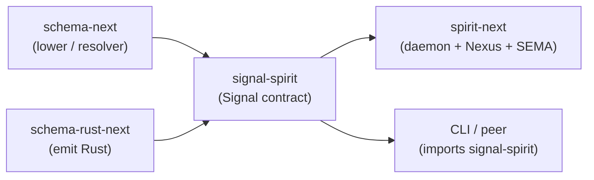

; designer
[contract-repo signal-interface pipeline-split daemon-imports nexus-sema-local fork-proposal spirit-1422]
[Fork proposal — investigate current main HEADs across spirit-next + signal-spirit + schema-rust-next + schema-next + core-signal-spirit + signal-introspect; verify the bypass claim; propose the per-repo split that lands Spirit 1422 (Decision Maximum 2026-06-02) — Signal interface in signal-<component> contract repository, Nexus + SEMA local to daemon, exception clause for scale-out SEMA. Schema-next already supports cross-schema imports via DEP_<CRATE>_SCHEMA_DIR; the proposal leans on the marker-core import-consumer working pattern. Estimated cost 2-4 operator days for spirit-next + signal-spirit; emitter and schema-next need no shape changes. Largest open question is the help action aggregation across the cross-repo Signal/Nexus split. Recommended phasing — spirit-next + signal-spirit pilot, then introspect by-construction, then persona + orchestrate.]
2026-06-02
designer

# 475.1 — Contract-repo fork proposal

## TL;DR

Bypass claim verified at current main HEADs (six commits read, all on
main): `spirit-next/schema/lib.schema` declares Signal Input/Output +
NexusInput/Output + SemaWriteInput/Output + SemaReadInput/Output all
inside the daemon repository; `spirit-next/Cargo.toml` does NOT depend
on `signal-spirit` at all; `signal-spirit/schema/signal-spirit.schema`
is a minimum-one-operation scaffold ((Record Entry) /
(RecordAccepted RecordIdentifier)) that diverged from the daemon's
schema during the depth-first running-concept slice. Spirit 1422
(Decision Maximum, 2026-06-02 10:57:15) codifies the future split:
Signal interface lives in `signal-<component>` because clients depend
on it; Nexus + SEMA stay daemon-internal; scale-out database is the
named exception.

The good news: `schema-next` ALREADY supports cross-schema imports
through `ImportResolver` with `DEP_<CRATE>_SCHEMA_DIR` (per
`src/resolution.rs`, fully exercised by the
`marker-core`/`import-consumer` fixture in `tests/resolution.rs` and
`tests/asschema_definition.rs`). The mechanism the proposal needs
already lives at HEAD `99078b2` and is test-witnessed. No
schema-next shape changes are required.

The proposal: move Signal Input/Output declarations from
`spirit-next/schema/lib.schema` into a new
`signal-spirit/schema/lib.schema`; have spirit-next's schema import
those types via `signal-spirit:lib:Input` /
`signal-spirit:lib:Output` and keep the NexusInput/Output + SEMA
planes local; the build script wires the resolver to point at
signal-spirit's schema directory through Cargo's `links` mechanism.
The daemon and the CLI both depend on `signal-spirit` as a runtime
crate; the daemon also depends on it as a build dependency for
schema-next's resolver to read the contract source.

Recommended split rollout: Phase 1 (spirit-next + signal-spirit
pilot, 2-4 operator days), Phase 2 (introspect by construction
since the new component is greenfield), Phase 3 (persona +
orchestrate after the pattern is proven). Designer specifies; operator
integrates.

## Section 1 — Current state inventory

### spirit-next (HEAD `7c35067`, 2026-06-02)

| Surface | State |
|---|---|
| `schema/lib.schema` | Authored schema source. Empty imports block `{}`; root-level Signal Input + Output declarations; namespace declaring NexusInput/Output + SemaWriteInput/Output + SemaReadInput/Output + payload structs (Entry, Query, ObservedRecords, SemaReceipt, MailLedgerEvent, etc.). 47 lines. |
| `schema/lib.asschema` | Checked-in `Asschema` artifact emitted by `schema-next`'s lower step. Identity `spirit-next:lib 0.1.0`. Build script enforces freshness. |
| `build.rs` | Reads `schema/lib.schema`, lowers via `SchemaEngine::default()`, writes `OUT_DIR/lib.asschema` + `.rkyv` artifacts, then emits checked-in `src/schema/lib.rs` (1867 lines). Asserts the binary and NOTA artifacts round-trip. |
| `Cargo.toml` build-deps | `schema-next` + `schema-rust-next` (both branch=main). NO `signal-spirit` dependency. NO `links` field. |
| `Cargo.toml` runtime deps | `nota-next` (optional under `nota-text`), `rkyv`, `redb`, `blake3`. NO `signal-spirit`. |
| `src/lib.rs` | Re-exports the entire generated module — `Input`, `Output`, `NexusInput`, `NexusOutput`, `SemaWriteInput`, `SemaReadInput`, … all from `crate::schema::lib`. The daemon and CLI use them as `spirit_next::Input` etc. |

The local schema is the universal source of truth for all four
planes inside the daemon today. Signal types coexist with Nexus
+ SEMA types in one namespace at one path.

### signal-spirit (HEAD `061815f`, 2026-05-26)

| Surface | State |
|---|---|
| `schema/signal-spirit.schema` | Hand-authored minimum-one-operation scaffold. Imports `{}` empty; Input `[(Input (Record Entry))]`; Output `[(Output (RecordAccepted RecordIdentifier))]`; namespace declares `Topic [Text]`, `Description [Text]`, `RecordIdentifier [Integer]`, `Entry [Topic Description]`. 33 lines including the preamble comments. Stale relative to spirit-next's schema (no observation, no rejection, no validation error, no database marker). |
| `build.rs` | Reads `schema/signal-spirit.schema`, lowers via SchemaEngine, emits `OUT_DIR/signal_spirit_generated.rs`. The library `src/lib.rs` `include!`s that path under `mod generated`. |
| `Cargo.toml` build-deps | `schema-next` + `schema-rust-next` (both branch=main). NO `links` field. |
| `Cargo.toml` runtime deps | `nota-next`, `rkyv`. |
| `src/lib.rs` | 119 lines. Re-exports the generated module + a `WireCodec` struct (`encode_input`/`decode_input`/`encode_output`/`decode_output` methods) on top of the rkyv emitted types. Four round-trip tests. NOT consumed by spirit-next. |

The contract crate is live and load-bearing for its own
single-operation tests, but it carries a stale schema relative to
the daemon's actual interface and is NOT imported by spirit-next.

### schema-rust-next (HEAD `dd94423`, 2026-06-02)

| Surface | State |
|---|---|
| Library | `RustEmitter`, `RustEmissionOptions::feature_gated_nota("...")`, two emission paths (`emit_file` from `Asschema`; `emit_file_from_nota_path` / `emit_file_from_binary_path`) that round-trip equivalently. |
| Emission shape | The emitted Rust mirrors the schema namespace — typed Signal/Nexus/SEMA plane envelopes (`signal::Signal<Input>`, `nexus::Nexus<NexusInput>`, `sema::Sema<SemaWriteInput>`), engine traits with default trace hooks (`SignalEngine` / `NexusEngine` / `SemaEngine`), per-plane `<Plane>ObjectName` enums + a wrapping `ObjectName` aggregator, a `TraceEvent { object_name }` struct. |
| Cross-schema import behavior | When the input `Asschema` carries `resolved_imports`, the emitter writes `pub use <crate>::schema::<module>::<Type> as <LocalName>;` items so the local module re-exports the imported type. No schema-rust-next change is needed for the split; it already emits import use-items. |

### schema-next (HEAD `99078b2`, 2026-06-02)

| Surface | State |
|---|---|
| `ImportSource` | Splits `crate:module:Type` single-colon targets into `crate_name` + `module` + `type_name`; computes `module_path()` (`<crate_identifier>::schema::<module>` with hyphen-to-underscore normalisation) and `rust_path()`. |
| `ImportResolver` | `with_dependency(crate_name, schema_dir, version)` registers a dependency package; resolves each `ImportDeclaration` by loading the dependency's module schema, lowering it through the engine, and asserting the imported type is declared. |
| `SchemaEngine::lower_source_with_resolver` | Resolver-aware lowering path. The fixture pair `tests/fixtures/marker-core` + `tests/fixtures/import-consumer` exercises cross-crate imports end-to-end (`tests/resolution.rs`, `tests/asschema_definition.rs`, `tests/big_examples.rs`). |
| Module path convention | Cargo passes `DEP_<CRATE>_SCHEMA_DIR` to consumer build scripts when the dependency declares `links` + emits a `cargo:schema_dir=...` line. |

Cross-schema imports are a fully-realised first-class capability of
schema-next. The proposal builds on this capability without
modifying it.

### core-signal-spirit (HEAD `bcd2d61`, 2026-05-26)

Initial scaffold from psyche 2026-05-26 record 780. Hand-authored
`schema/core-signal-spirit.schema` declares Start/Drain/Reload/Register/Retire/Handover* operations
in a five-block (incorrect) shape inconsistent with the current
three-block schema source contract. `src/lib.rs` is a 14-line
placeholder with `#![forbid(unsafe_code)]`. NO `build.rs`. NO `links`
field. Effectively a name-reserving stub that hasn't been touched
since the scaffold landed.

Per designer 458 (psyche 2026-06-01) Option A `owner-signal-spirit`
is the recommended retire-and-rename target; Option B
`meta-signal-spirit` requires a Maximum-magnitude psyche ratification
before the fleet-wide rename pass. Naming gate REMAINS PENDING.

### signal-introspect (HEAD `cbf6ac9`, 2026-06-02)

| Surface | State |
|---|---|
| `schema/signal-introspect.concept.schema` | Concept-marked schema (v0.1, status Concept) with high-level Observe / Tap / Untap operation roots. Authored as a sketch, not a working emission source. |
| `src/lib.rs` | 358 lines of legacy hand-rolled wire types from the persona-introspect era (`thiserror`, `signal-core`, `signal-persona`, `signal-persona-origin`, `signal-message` dependencies). NOT consumed by anyone in the current next-stack pilot. |
| `Cargo.toml` | Old-stack dependency graph — does not consume `schema-next` / `schema-rust-next` at all. No `build.rs`. |

The repo name reserves the spot for the canonical introspect Signal
contract but the source is legacy plumbing pending greenfield
schema-next adoption per designer 469.

### The bypass claim — verified

The bypass claim from the frame holds in full:

1. `spirit-next/schema/lib.schema` declares ALL FOUR planes locally
   in the daemon repository.
2. `spirit-next/Cargo.toml` has zero dependency on `signal-spirit`
   (verified by grep — no matches).
3. `signal-spirit/schema/signal-spirit.schema` carries a different,
   smaller, divergent surface than spirit-next's; it is not the
   source spirit-next's emitter consumes.
4. `core-signal-spirit/` is a name-reserving scaffold with no
   emission machinery wired up.

The contract repositories are bypassed for the running-concept
depth-first slice. Spirit 1422 names this state as transitional
and the fork as the future template.

## Section 2 — Proposed split per repo

### spirit-next

```text
schema/lib.schema    # retained, MOVED PLANES
src/lib.rs           # re-exports adjust to import Signal types from signal-spirit
src/schema/lib.rs    # regenerated; imports landed as `pub use signal_spirit::...`
build.rs             # adds `DEP_SIGNAL_SPIRIT_SCHEMA_DIR` resolver wiring
Cargo.toml           # adds build-dep + runtime dep on signal-spirit; declares `links = "spirit-next"` to expose own schema_dir for downstream daemons
```

The schema source becomes:

```nota
{
  Input        signal-spirit:lib:Input
  Output       signal-spirit:lib:Output
  Entry        signal-spirit:lib:Entry
  Query        signal-spirit:lib:Query
  TopicMatch   signal-spirit:lib:TopicMatch
  Topics       signal-spirit:lib:Topics
  Topic        signal-spirit:lib:Topic
  Description  signal-spirit:lib:Description
  Kind         signal-spirit:lib:Kind
  Magnitude    signal-spirit:lib:Magnitude
  RecordIdentifier signal-spirit:lib:RecordIdentifier
  ;; ... all client-facing payload types signal-spirit owns ...
}
[]   ;; no LOCAL Input / Output additions — imported above
[]   ;; no LOCAL output additions either
{
  NexusInput  [(Signal Input) (SemaWrite SemaWriteOutput) (SemaRead SemaReadOutput)]
  NexusOutput [(SemaWrite SemaWriteInput) (SemaRead SemaReadInput) (Signal Output)]
  SemaWriteInput  [(Record Entry) (Remove RecordIdentifier)]
  SemaReadInput   [(Observe Query) (Lookup RecordIdentifier) (Count Query)]
  SemaWriteOutput [(Recorded SemaReceipt) (Removed RemoveReceipt) (Missed ErrorReport)]
  SemaReadOutput  [(Observed ObservedRecords) (Found FoundRecord) (Counted CountedRecords) (Missed ErrorReport)]
  ;; daemon-internal helper types: DatabaseMarker, MailIdentifier, OriginRoute, etc.
}
```

`signal-spirit`'s lowered Asschema carries the client-facing payload
declarations; spirit-next imports them and declares only the
daemon-internal Nexus + SEMA planes plus the daemon-only helper
types (mail ledger event, origin route, database marker — the
RUNTIME plumbing, not the wire surface).

The build script grows a resolver:

```rust
let signal_spirit_schema_dir = PathBuf::from(
    env::var("DEP_SIGNAL_SPIRIT_SCHEMA_DIR").expect("signal-spirit links"),
);
let resolver = ImportResolver::new().with_dependency(
    "signal-spirit",
    signal_spirit_schema_dir,
    "0.4.0-pre",
);
let asschema = SchemaEngine::default()
    .lower_source_with_resolver(source, identity, &mut MacroContext::default(), &resolver)
    .expect("lower spirit-next schema with signal-spirit imports");
```

The daemon Rust crate re-exports become:

```rust
pub use signal_spirit::{Input, Output, Entry, Query, RecordIdentifier, /* ... */};
// Nexus + SEMA types stay locally re-exported:
pub use schema::lib::{NexusInput, NexusOutput, SemaWriteInput, /* ... */};
```

Hand-written runtime code referencing Signal types changes from
`use crate::Input` / `use crate::schema::lib::Input` to
`use signal_spirit::Input`. About 30-40 call sites across `engine.rs`,
`nexus.rs`, `store.rs`, `transport.rs`, `daemon.rs`, `trace.rs`, and
binaries.

### signal-spirit

```text
schema/lib.schema       # NEW — moved from spirit-next's Signal declarations
schema/signal-spirit.schema  # RETIRED (or renamed to lib.schema and deepened)
src/lib.rs              # cleaned — re-exports the generated module; WireCodec stays or migrates to spirit-next runtime
build.rs                # updated — reads schema/lib.schema; emits to OUT_DIR + exposes schema_dir via `cargo:schema_dir=`
Cargo.toml              # adds `links = "signal-spirit"` so downstream daemons get DEP_SIGNAL_SPIRIT_SCHEMA_DIR
```

The schema source becomes the canonical Signal contract:

```nota
{}
[
  (Record Entry)
  (Observe Query)
  (Lookup RecordIdentifier)
  (Count Query)
  (Remove RecordIdentifier)
]
[
  (RecordAccepted SemaReceipt)
  (RecordsObserved ObservedRecords)
  (RecordFound FoundRecord)
  (RecordsCounted CountedRecords)
  (RecordRemoved RemoveReceipt)
  (Error ErrorReport)
  (Rejected SignalRejection)
]
{
  Entry            { Topics * Kind * Description * Magnitude * }
  Query            { TopicMatch * kind (Optional Kind) }
  ObservedRecords  { RecordSet * DatabaseMarker * }
  FoundRecord      { RecordIdentifier * Entry * DatabaseMarker * }
  CountedRecords   { RecordCount * DatabaseMarker * }
  SemaReceipt      { RecordIdentifier * DatabaseMarker * }
  RemoveReceipt    { RecordIdentifier * DatabaseMarker * }
  ErrorReport      { ErrorMessage * DatabaseMarker * }
  SignalRejection  { ValidationError * DatabaseMarker * }
  DatabaseMarker   { CommitSequence * StateDigest * }
  ;; ... typed leaves: Topic, Topics, Description, RecordSet, Kind, Magnitude, TopicMatch,
  ;; RecordIdentifier, RecordCount, CommitSequence, StateDigest, ErrorMessage, ValidationError ...
}
```

The current divergent `signal-spirit.schema` retires; lift its
content into `lib.schema` matched against the daemon's actual
surface. The `links = "signal-spirit"` Cargo field plus the
`cargo:schema_dir={CARGO_MANIFEST_DIR}/schema` line in `build.rs`
expose the schema directory to every downstream consumer via
`DEP_SIGNAL_SPIRIT_SCHEMA_DIR` — no hand-rolled crate-graph traversal.

`WireCodec` (currently hand-written on top of rkyv) is redundant if
the emitter already provides encode/decode methods on the typed
plane envelopes; remove or migrate to a single binding in the daemon
runtime crate.

### schema-rust-next

No shape change required. Today the emitter already:

- Writes `pub use <crate>::schema::<module>::<Type> as <LocalName>;`
  use-items for resolved imports;
- Emits typed plane envelopes whose generic argument is the local
  alias of the imported type;
- Skips re-declaring types that arrived via import.

The proposal works on the emitter exactly as it is at `dd94423`.
Future engine-trait surface emission (per Spirit 1392/1393/1395)
continues to live in the consumer (the daemon) because the engine
traits are daemon-internal — they take Signal types as input but
they ARE the Nexus + SEMA contract.

A small behavior to confirm: when an `Asschema` declares plane
envelopes referencing imported types (e.g. `NexusInput::Signal(Input)`
where `Input` is an imported type), the emitted Rust must compile
against the use-item path. The marker-core fixture is the closest
proof; spirit-next's first build is the second proof.

### schema-next

No shape change required. The cross-schema-import machinery at
HEAD `99078b2` is already test-witnessed by `tests/resolution.rs`
+ `tests/asschema_definition.rs` against the
`marker-core`/`import-consumer` fixture pair.

One observation: the consumer fixture imports a single bare type
(`DatabaseMarker`). The spirit-next migration imports more than a
dozen types. The resolver's `resolve_all` handles bulk imports;
no shape change. If the fixture set grows to cover bulk imports
across multiple modules (e.g. spirit-next importing from
`signal-spirit:lib` AND `signal-sema:lib`), that's a useful
follow-up fixture but not a precondition for the split.

### core-signal-spirit

Mark for retirement (or rename per designer 458 Option A to
`owner-signal-spirit`). The contract-repo fork makes the
naming gate more load-bearing because the canonical Signal repo's
name is now the load-bearing client-facing identifier — but the
RESOLUTION of the naming gate is independent of this proposal.

Recommendation: land the spirit-next + signal-spirit fork FIRST,
then unblock the naming-gate decision separately. The fork doesn't
depend on the policy-side contract's final name.

## Section 3 — Build dependency graph



Five nodes; honors Spirit 1282. The cut-edge between
`schemaRustNext` and `spiritNext` (the daemon also uses the
emitter to render its Nexus + SEMA declarations) is implicit in the
diagram — spirit-next ALSO depends on schema-next + schema-rust-next
as build-deps, just as signal-spirit does. The diagram emphasises the
new dependency direction: signal-spirit becomes a runtime dep of
both the daemon and its clients; both consume the same
`<crate>::schema::lib::Input` / `Output` identity.

## Section 4 — Migration cost estimate

| Repo | File moves | Cargo.toml edits | build.rs edits | Source code edits | Test updates | Rough cost |
|---|---|---|---|---|---|---|
| `spirit-next` | Split `schema/lib.schema` namespace; delete Signal Input/Output blocks; add imports block | Add runtime + build-dep on `signal-spirit`; add `links = "spirit-next"` (for future cross-component imports) | Add `ImportResolver` + `DEP_SIGNAL_SPIRIT_SCHEMA_DIR` wiring; switch to `lower_source_with_resolver` | ~30-40 `use crate::Input` → `use signal_spirit::Input` (engine.rs, nexus.rs, store.rs, transport.rs, daemon.rs, trace.rs, binaries) | Update assertion paths in tests/process_boundary.rs, tests/nix_integration.rs, tests/instrumentation_logging.rs | **1-2 operator days** |
| `signal-spirit` | Move spirit-next's Signal declarations into `schema/lib.schema`; retire `signal-spirit.schema` | Add `links = "signal-spirit"`; bump version to 0.5.0-pre or 1.0.0-pre | Update path to `schema/lib.schema`; add `cargo:schema_dir=...` line | Trim/retire `WireCodec` if redundant; re-expose all emitted types from `mod generated` | Replace the single-operation round-trip tests with multi-operation tests matching the new contract | **1 operator day** |
| `schema-rust-next` | none | none | none | none | Add a fixture-pair test where an imported type is used as a plane envelope generic argument | **0 days (proposal); ~0.5 day for the follow-up fixture** |
| `schema-next` | none | none | none | none | Add a multi-module bulk-import fixture if confidence is needed | **0 days** |
| `core-signal-spirit` | none in this proposal | — | — | — | — | **deferred to naming-gate slice** |

Total: **2-4 operator days** for the spirit-next + signal-spirit
pilot. The estimate assumes schema-next requires no changes
(confirmed). If a bulk-import fixture surfaces a `resolve_all`
edge case (e.g. namespace collision when multiple imports share a
local name), add 0.5-1 day; otherwise the split is mechanical.

If schema-next DID need cross-schema-import support — counterfactual,
not the actual world — the estimate would extend to 1-2 weeks.
That counterfactual is what the proposal sidesteps.

## Section 5 — Edge cases and open questions

### Typed `ObjectName` from schema-rust-next `fa3f615`

The trace identity emission lands `SignalObjectName` / `NexusObjectName`
/ `SemaObjectName` as separate per-plane enums plus a wrapping
`ObjectName` aggregator that lives at the top of the daemon's emitted
namespace (today `spirit_next::schema::lib::ObjectName`). After the
split:

- `SignalObjectName` is derivable from the Signal Input/Output enum
  variants — it lives in `signal-spirit` because the source enums
  do.
- `NexusObjectName` + `SemaObjectName` are derivable from the
  daemon's Nexus + SEMA variants — they stay in spirit-next.
- The aggregator `ObjectName { Signal(SignalObjectName), Nexus(NexusObjectName), Sema(SemaObjectName) }`
  imports `SignalObjectName` from signal-spirit; the aggregator lives
  in spirit-next because only the daemon needs to compose across all
  three planes for trace.

The emitter already supports this — `SignalObjectName` would be
emitted into signal-spirit's `src/schema/lib.rs`; the aggregator
emitted into spirit-next's namespace would carry a use-item
`pub use signal_spirit::SignalObjectName;`. Trace tests in
spirit-next continue to use the aggregator identity unchanged.

### Help action (Spirit 1396, 1397) aggregation

The recursive Help variant emission applies per root enum. After
the split:

- Signal Input/Output Help variants emit into signal-spirit
  (clients see Help vocabulary for the Signal contract).
- NexusInput/NexusOutput + SemaWriteInput/Output + SemaReadInput/Output
  Help variants emit into spirit-next (daemon-internal Help).

The fragmentation question: does the client see a unified Help
surface, or does it see only the Signal-plane Help and have no
language to ask the daemon "what Nexus + SEMA operations exist
internally?"

The likely answer is the right shape: clients only need Help for
the Signal contract; Nexus + SEMA are daemon-internal and not
client-callable. A client asking the daemon "what's inside" is
asking introspect, not the daemon directly (per designer 469).
Help for Signal lives in signal-spirit; introspect's queryable
surface covers the rest.

**Carry this as an open question for psyche ratification** — the
shape FOLLOWS from intent 1422 + 1396/1397, but the explicit
client-facing-Help-only positioning is a small derived clarification
worth confirming.

### introspect (Spirit 1398) follows the split from inception

`signal-introspect` already exists as a repo (`cbf6ac9`) carrying a
legacy 358-line hand-rolled wire surface and a `concept.schema`
sketch. The contract-repo fork pattern says: the introspect daemon
goes in a new `introspect` runtime repo (which ALSO exists, `2cc2c6d`,
also with a legacy hand-rolled surface), and the Signal interface
lives in signal-introspect.

The introspect proposal in designer 469 §2 lays out a Signal contract
with five Input variants (ConfigureTracePolicy / IngestTraceEvent /
QueryTraceEvents / Subscribe / Help). After ratification of the
contract-repo split:

- signal-introspect's `schema/lib.schema` becomes the canonical
  source for the five Input variants + their Output replies + the
  payload types (TraceRecord, PolicyRule, TraceFilter, etc.).
- introspect's daemon `schema/lib.schema` imports the Signal types
  and declares NexusInput/Output + SemaWriteInput/Output +
  SemaReadInput/Output for the trace policy + storage logic.
- Both repos retire their current legacy hand-rolled
  `src/lib.rs` substrate and adopt schema-next + schema-rust-next
  emission per the spirit-next pattern.

Introspect's greenfield status makes it the IDEAL follow-on
component — no migration cost, just adopt the new template.

### Scale-extension clause (Spirit 1422 exception)

Candidate scenarios where SEMA may extract to a contract repo per
the exception:

| Component | Scale-out trigger | Contract candidate name |
|---|---|---|
| spirit-next | Multi-node intent storage with cross-node observers (each node owns a partition; observers query across partitions) | `signal-sema-spirit` |
| introspect | Multi-node trace storage where a query routes across N storage nodes | `signal-sema-introspect` |
| persona | Multi-node mind state for a fleet-of-engines deployment | `signal-sema-persona` |

The naming candidate `signal-sema-<component>` follows the
existing `signal-<component>` pattern and remains within the
established Signal contract vocabulary. Carry as a future
direction; do not pre-build until a real scale-out scenario lands.

## Section 6 — Recommended order

**Phase 1 — spirit-next + signal-spirit pilot** (designer specifies +
operator integrates; 2-4 operator days). The depth-first proof
slice per Spirit 1355. Lands the cross-schema-import wiring,
exercises the `links` + `DEP_SIGNAL_SPIRIT_SCHEMA_DIR` resolver
mechanism end-to-end in a live component, and validates the typed
`ObjectName` aggregator pattern across the cross-repo boundary.

- **Designer slice 1A** — write the new `signal-spirit/schema/lib.schema`
  matching spirit-next's current surface, drop the Signal Input/Output
  from spirit-next's local schema, sketch the imports block. Land on
  a feature branch under `~/wt/github.com/LiGoldragon/signal-spirit/`
  and `~/wt/github.com/LiGoldragon/spirit-next/`. Falsifiable spec
  test: `lower_source_with_resolver` succeeds against the new pair.
- **Designer slice 1B** — designer-falsifiable Rust witness: a small
  test in spirit-next that asserts `spirit_next::Input` is the same
  type as `signal_spirit::Input` (compile-time identity).
- **Operator slice 1C** — integrate both branches onto main; rebase
  spirit-next + signal-spirit's main; verify `cargo test` +
  `nix flake check` clean on both; update any lockfile pins.

**Phase 2 — introspect by construction** (designer specifies +
operator builds; 1-2 operator weeks for the greenfield component).
The introspect Signal contract emits from signal-introspect; the
daemon emits from introspect; both retire their legacy hand-rolled
substrate; the design follows designer 469 with the contract-repo
split applied from the start. No migration cost because the legacy
substrate doesn't ship anywhere yet.

**Phase 3 — schema-rust-next + schema-next adaptation** (operator;
0-1 days). Add a multi-module bulk-import fixture if the spirit-next
+ introspect pilots surface an edge case. The schema substrate itself
needs no shape changes.

**Phase 4 — persona + orchestrate + future triads** (deferred until
the existing daemons reach feature parity with the schema-derived
pattern; multi-week per component). The split becomes the workspace
template per Spirit 1422; every new triad lands with the contract-repo
shape by construction.

**Naming gate** (designer 458) remains independent. The contract-repo
fork lands without resolving Option A vs Option B; the policy-side
`core-signal-spirit` retire-and-rename is the next item on the
designer-decision queue and gets a separate slice.

Designer-vs-operator ownership per phase: designer specifies and
falsifies on feature branches in `~/wt/`; operator integrates onto
main and rebases. Phase 2 (introspect) is the greatest design
density — designer 469 already names the schema and the engine
shape; operator builds against the design. Phase 3 (emitter
adaptation) is operator-shape because emitter changes are
implementation craft. Phase 4 (other triads) is mixed — each triad
gets its own designer report when its slice opens.

## See also

- `reports/designer/475-contract-repo-pipeline-situation-and-proposal-2026-06-02/0-frame-and-method.md` — the frame.
- `reports/operator/281-generated-interface-logic-with-macros-2026-06-02.md` — the current schema source + emission shape.
- `reports/designer/458-spirit-triad-naming-gate-decision-2026-06-01.md` — the pending naming gate on `core-signal-spirit`.
- `reports/designer/469-introspect-component-design-2026-06-02.md` — introspect's per-plane sketch (the canonical Phase 2 source).
- `reports/designer/463-operator-trace-implementation-audit-and-intent-gaps-2026-06-01.md` — gap B on triad placement for trace.
- `skills/component-triad.md` §"Runtime triad engine traits — Signal triage / Nexus computation / SEMA durable" — the engine-trait architecture this proposal extends.
- `/git/github.com/LiGoldragon/schema-next/src/resolution.rs` — the existing cross-schema-import machinery.
- `/git/github.com/LiGoldragon/schema-next/tests/fixtures/marker-core` + `import-consumer` — the working cross-crate import fixture.
- Spirit 1422 (Decision Maximum, 2026-06-02) — the codifying capture.
- Spirit 1326-1336 (engine-trait architecture), 1365 (trace-as-trait), 1387-1395 (slim Nexus + developed interfaces), 1396-1397 (Help action), 1398 (introspect), 1411 (beauty), 1419 (programmatic triad + tiny daemon main).
